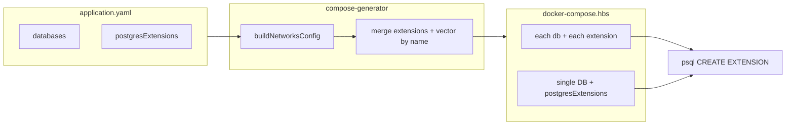

# Configurable PostgreSQL extensions in application.yaml

## Current behavior

- **Multi-database path**: When `databases` is set, db-init creates each database and, if the database **name** ends with `"vector"`, runs `CREATE EXTENSION IF NOT EXISTS vector` (see [templates/typescript/docker-compose.hbs](templates/typescript/docker-compose.hbs) and [templates/python/docker-compose.hbs](templates/python/docker-compose.hbs) around lines 138–141).
- **Single-database path**: When `databases` is not set, db-init creates one database (app key) and does **not** create any extensions today.
- Extension names with hyphens (e.g. `uuid-ossp`, `btree_gin`) must be quoted in SQL: `CREATE EXTENSION IF NOT EXISTS "uuid-ossp";`.

## Approach

1. **Schema**: Add an optional `extensions` array to each item in `databases`, and an optional top-level `postgresExtensions` for the single-DB path.
2. **Compose context**: Normalize each database with a merged `extensions` list (explicit list + implicit `vector` when the DB name ends with `"vector"` and not already present). For the single-DB path, provide `postgresExtensions` (from config or derived from app key for backward compatibility).
3. **Templates**: Replace the hard-coded `isVectorDatabase` block with a loop over `extensions`; add extension creation in the single-DB branch using `postgresExtensions`. Use proper SQL quoting for extension names (existing `pgQuote` helper).
4. **Docs and tests**: Document the new fields and add tests for explicit extensions and backward compatibility.

---

## Rules and Standards

This plan must comply with [Project Rules](.cursor/rules/project-rules.mdc). Applicable sections:

- **[Quality Gates](.cursor/rules/project-rules.mdc#quality-gates)** – Mandatory checks before commit: build, lint, test, coverage ≥80%, no hardcoded secrets.
- **[Code Quality Standards](.cursor/rules/project-rules.mdc#code-quality-standards)** – Files ≤500 lines, functions ≤50 lines; JSDoc for all public functions.
- **[Architecture Patterns](.cursor/rules/project-rules.mdc#architecture-patterns)** – Schema in `lib/schema/`, templates in `templates/`, Handlebars and JSON Schema patterns.
- **[Validation Patterns](.cursor/rules/project-rules.mdc#validation-patterns)** – JSON Schema in `lib/schema/`, AJV validation, developer-friendly errors.
- **[Template Development](.cursor/rules/project-rules.mdc#template-development)** – Handlebars helpers, context variables, `{{#each}}`/`{{#if}}`, document context.
- **[Testing Conventions](.cursor/rules/project-rules.mdc#testing-conventions)** – Jest, tests in `tests/`, mock external deps, 80%+ coverage for new code.
- **[Docker & Infrastructure](.cursor/rules/project-rules.mdc#docker--infrastructure)** – Docker Compose, db-init, secure config, validate compose output.
- **[Security & Compliance](.cursor/rules/project-rules.mdc#security--compliance-iso-27001)** – No secrets in config, input validation, no sensitive data in logs.

**Key requirements**: JSDoc for new/updated functions; validate extension names (pattern); use existing `pgQuote` for SQL identifiers; add tests for multi-DB extensions, single-DB `postgresExtensions`, and backward-compat vector-by-name.

---

## Before Development

- Read applicable sections from [project-rules.mdc](.cursor/rules/project-rules.mdc) (Quality Gates, Code Quality Standards, Validation Patterns, Template Development, Testing).
- Review [lib/utils/compose-generator.js](lib/utils/compose-generator.js) `buildNetworksConfig` and compose template context flow.
- Review [templates/typescript/docker-compose.hbs](templates/typescript/docker-compose.hbs) and [templates/python/docker-compose.hbs](templates/python/docker-compose.hbs) db-init block and `isVectorDatabase` usage.
- Confirm [lib/schema/application-schema.json](lib/schema/application-schema.json) `databases` structure and where to add `extensions` and `postgresExtensions`.

---

## Definition of Done

Before marking the plan complete:

1. **Build**: Run `npm run build` first (must succeed; runs lint + test:ci).
2. **Lint**: Run `npm run lint` (must pass with zero errors/warnings).
3. **Test**: Run `npm test` or `npm run test:ci` after lint (all tests pass; ≥80% coverage for new code).
4. **Validation order**: BUILD → LINT → TEST (do not skip steps).
5. **File size**: Files ≤500 lines, functions ≤50 lines.
6. **JSDoc**: All new or modified public functions have JSDoc (params, returns, description).
7. **Code quality**: Rule requirements met; no hardcoded secrets; extension names validated via schema pattern.
8. **Tasks**: Schema changes, compose generator normalization, template updates (TypeScript + Python), docs, and tests all done.

---

## 1. Schema changes

**File:** [lib/schema/application-schema.json](lib/schema/application-schema.json)

- In `databases.items.properties`, add:
  - **extensions** (optional): `type: "array"`, `items: { type: "string", pattern: "^[a-z0-9_-]+$" }`, description explaining that these PostgreSQL extension names are created in the database during db-init (e.g. `pgcrypto`, `uuid-ossp`, `vector`, `btree_gin`, `btree_gist`).
- At the top level (alongside `databases`), add:
  - **postgresExtensions** (optional): same array-of-strings pattern. Used when **no** `databases` array is present (single-database path) to create extensions in the app-key database. If omitted and the app key name ends with `vector`, behavior can remain backward compatible by still creating the `vector` extension in the single-DB path.

---

## 2. Compose generator: normalize databases and postgresExtensions

**File:** [lib/utils/compose-generator.js](lib/utils/compose-generator.js)

- `**buildNetworksConfig(config, appName)`**: Add a second parameter `appName`. Keep returning `{ databases, postgresExtensions }`.
  - **databases**: For `config.requires?.databases || config.databases || []`, map each item to a normalized object that includes:
    - All existing fields (`name`, etc.).
    - **extensions**: merged list = unique union of (1) `db.extensions` if present (array of strings), (2) `'vector'` if `isVectorDatabaseName(db.name)` and `'vector'` is not already in the list.
  - **postgresExtensions**: When the normalized `databases` array is **empty**, set `postgresExtensions` to:
    - `config.postgresExtensions || config.requires?.postgresExtensions || []`, then if that array is empty and `isVectorDatabaseName(appName)`, append `'vector'` so the single-DB path keeps the current “vector by name” behavior. When `databases.length > 0`, set `postgresExtensions` to `[]` (or omit; template will not use it).
- Update the single call site to `buildNetworksConfig` to pass `appName` (e.g. from the same place `appName` is available in `generateDockerCompose`).

No new Handlebars helpers are strictly required: the template can iterate over `extensions` and use the existing `pgQuote` helper to quote extension names in SQL. If desired, a small helper that returns the quoted extension name for CREATE EXTENSION could be added in [lib/utils/compose-handlebars-helpers.js](lib/utils/compose-handlebars-helpers.js) and used in the template for clarity.

---

## 3. Template changes (TypeScript and Python)

**Files:** [templates/typescript/docker-compose.hbs](templates/typescript/docker-compose.hbs), [templates/python/docker-compose.hbs](templates/python/docker-compose.hbs)

- **Multi-database block** (inside `{{#each databases}}`):
  - Remove the existing block that only runs for `(isVectorDatabase name)` and creates the `vector` extension.
  - Replace with a loop over the normalized `extensions` array for that database. For each extension, run:
    - `psql -d {{name}} -c 'CREATE EXTENSION IF NOT EXISTS {{pgQuote this}};'` (or equivalent using a helper that quotes the extension name), then `echo` and `&&` so the script continues.
  - Use the same pattern for each extension so that names like `uuid-ossp` and `btree_gin` are correctly quoted in SQL.
- **Single-database block** (the `{{else}}` branch that creates the app-key database):
  - After the “Database created successfully!” / privilege steps, add a similar loop over `postgresExtensions` (when present), running `CREATE EXTENSION IF NOT EXISTS "…"` for each, with proper quoting, so that the single-DB path can also create extensions (and keeps the implicit `vector` when the app key ends with `vector`).

Ensure the shell script remains valid (trailing `&&` only when followed by more commands; no stray `&&` after the last extension).

---

## 4. Documentation

- **[docs/configuration/application-yaml.md](docs/configuration/application-yaml.md)**: In the “Database requirements” section, document:
  - **databases[].extensions**: Optional list of PostgreSQL extension names to create in that database during db-init (e.g. `pgcrypto`, `uuid-ossp`, `vector`, `btree_gin`, `btree_gist`). If the database name ends with `vector`, the `vector` extension is still added automatically if not listed.
  - **postgresExtensions** (optional, top-level): Used when the app uses a single database (no `databases` array). List of extension names to create in the app-key database. If the app key ends with `vector`, `vector` is added automatically when not listed.
- **[docs/running.md](docs/running.md)**: In “Multiple Databases” / “Database Creation”, add a short note that extensions can be configured via `databases[].extensions` (and, for single-DB, `postgresExtensions`), with a Flowise-style example (pgcrypto, uuid-ossp, vector, btree_gin, btree_gist).

---

## 5. Tests

- **[tests/lib/compose-generator.test.js](tests/lib/compose-generator.test.js)**:
  - Add a test that generates compose with `databases: [{ name: 'flowise', extensions: ['pgcrypto', 'uuid-ossp', 'vector', 'btree_gin', 'btree_gist'] }]` and asserts the generated YAML contains the corresponding `CREATE EXTENSION IF NOT EXISTS "…"` lines for each extension and the `flowise` database.
  - Add a test that a database with no `extensions` but name ending with `vector` still gets the `vector` extension (backward compatibility).
  - Add a test for the single-DB path with `postgresExtensions: ['pgcrypto']` (and optionally with app key ending with `vector`) and assert the output contains the expected CREATE EXTENSION for the app-key database.
- **Schema/validator**: If the validator or other code validates `application.yaml` against the schema, ensure the new optional properties do not break validation; add a minimal test or assertion that a valid config with `databases[].extensions` and/or `postgresExtensions` passes.

---

## Flow (summary)




---

## Example application.yaml (Flowise)

```yaml
requires:
  database: true
databases:
  - name: flowise
    extensions:
      - pgcrypto
      - uuid-ossp
      - vector
      - btree_gin
      - btree_gist
```

This will produce db-init commands equivalent to:

```bash
psql -d flowise -c 'CREATE EXTENSION IF NOT EXISTS "pgcrypto";' &&
psql -d flowise -c 'CREATE EXTENSION IF NOT EXISTS "uuid-ossp";' &&
# ... etc.
```

---

## Plan Validation Report

**Date**: 2025-03-09  
**Plan**: .cursor/plans/101-postgres_extensions_in_application.plan.md  
**Status**: VALIDATED

### Plan Purpose

Add configurable PostgreSQL extensions in `application.yaml` (per-database `databases[].extensions` and single-DB `postgresExtensions`). Extensions are created during db-init when running the app locally. Affects: schema, compose generator, Handlebars templates (TypeScript + Python), docs, and tests. **Type**: Development + Template + Infrastructure.

### Applicable Rules

- [Quality Gates](.cursor/rules/project-rules.mdc#quality-gates) – Build, lint, test, coverage, security; mandatory for all plans.
- [Code Quality Standards](.cursor/rules/project-rules.mdc#code-quality-standards) – File/function size, JSDoc, documentation.
- [Architecture Patterns](.cursor/rules/project-rules.mdc#architecture-patterns) – Schema and template layout, Handlebars/JSON Schema.
- [Validation Patterns](.cursor/rules/project-rules.mdc#validation-patterns) – JSON Schema, AJV.
- [Template Development](.cursor/rules/project-rules.mdc#template-development) – Handlebars, context, helpers.
- [Testing Conventions](.cursor/rules/project-rules.mdc#testing-conventions) – Jest, coverage, mocks.
- [Docker & Infrastructure](.cursor/rules/project-rules.mdc#docker--infrastructure) – Docker Compose, db-init.
- [Security & Compliance](.cursor/rules/project-rules.mdc#security--compliance-iso-27001) – No secrets in config, input validation.

### Rule Compliance

- DoD requirements: Documented (build first, then lint, then test; file size; JSDoc; no secrets).
- Quality Gates: Referenced; build/lint/test order and coverage mentioned in DoD.
- Code Quality: Referenced; file/function limits and JSDoc in DoD.
- Schema/Template/Testing/Docker/Security: All referenced in Rules and Standards with key requirements.

### Plan Updates Made

- Added **Rules and Standards** section with links to project-rules.mdc and key requirements.
- Added **Before Development** checklist (read rules, review compose-generator and templates, confirm schema).
- Added **Definition of Done** (build → lint → test, file size, JSDoc, code quality, all tasks).
- Corrected markdown for **extensions** / **postgresExtensions** (removed stray backticks).
- Appended this validation report.

### Recommendations

- When implementing, run `npm run build` after changes and fix any lint or test failures before considering the task complete.
- Ensure new helper or normalization logic in `compose-generator.js` has JSDoc and is covered in `tests/lib/compose-generator.test.js`.

