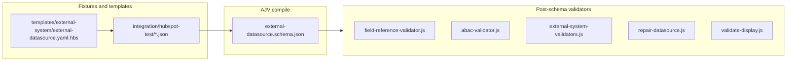

# Align codebase and tests with external-datasource 2.4.1 / external-system additive fields

## Overview

Align the Builder with **external-datasource** schema **2.4.1** and optional **external-system** fields (`performance`, `certification`) by updating validators, repair logic, templates, HubSpot integration fixtures, and tests; then add coverage for new 2.4.x behaviors. Follow [project-rules.mdc](.cursor/rules/project-rules.mdc): prefer fixing **generators/templates** over hand-editing `integration/` as the long-term source of truth where files are CLI-generated.

## Rules and Standards

This plan must comply with [Project Rules](.cursor/rules/project-rules.mdc). Applicable sections:

- **[Architecture Patterns](.cursor/rules/project-rules.mdc#architecture-patterns)** — `lib/` layout, CommonJS, **integration/** vs **builder/**: identify generator/template sources when changing fixtures; avoid one-off integration edits as the only fix.
- **[Validation Patterns](.cursor/rules/project-rules.mdc#validation-patterns)** — AJV usage (`allErrors`, `strict: false` where appropriate), schema in `lib/schema/`, developer-friendly errors.
- **[Template Development](.cursor/rules/project-rules.mdc#template-development)** — Handlebars templates under `templates/`; validate context before rendering.
- **[Testing Conventions](.cursor/rules/project-rules.mdc#testing-conventions)** — Jest, tests under `tests/`, mirror source layout, mock external I/O, success and error paths.
- **[Code Quality Standards](.cursor/rules/project-rules.mdc#code-quality-standards)** — Files ≤500 lines, functions ≤50 lines; JSDoc on public functions.
- **[Quality Gates](.cursor/rules/project-rules.mdc#quality-gates)** — Mandatory build, lint, test before completion.
- **[Security & Compliance (ISO 27001)](.cursor/rules/project-rules.mdc#security--compliance-iso-27001)** — No hardcoded secrets; do not log sensitive data; `kv://` patterns unchanged by this plan.
- **[Error Handling & Logging](.cursor/rules/project-rules.mdc#error-handling--logging)** — try/catch for async paths; meaningful messages; chalk in CLI where relevant.

**Key requirements**

- Use AJV and existing `formatValidationErrors` / schema-loader patterns for datasource and system validation.
- New or changed public functions: JSDoc with `@param` / `@returns` / `@throws` as needed.
- Split work if `repair-datasource.js` or validators would exceed file/function limits.
- Tests for every behavior change; ≥80% coverage on **new** code where practical.

## Before Development

- Re-read [external-datasource.schema.json](lib/schema/external-datasource.schema.json) `allOf` and `$defs/metadataSchemaNode` for non-`none` entity requirements.
- Confirm generator ownership for HubSpot-style files ([lib/generator/wizard.js](lib/generator/wizard.js), [lib/external-system/generator.js](lib/external-system/generator.js), templates) before relying only on edited JSON under `integration/hubspot-test/`.
- Grep `tests/` for legacy shapes (`record-storage`, `exposed.attributes`, `fieldMappings.dimensions`, `maxParallelRequests`) and track fixes.
- Skim [docs-rules.mdc](.cursor/rules/docs-rules.mdc) if touching `docs/` (optional follow-up; plan defers user docs).

## Definition of Done

Before marking this plan complete:

1. **Build**: Run `npm run build` **first** (project script runs lint + tests as configured in [package.json](package.json); must succeed).
2. **Lint**: Run `npm run lint`; **zero** errors (and resolve warnings per project policy).
3. **Test**: Run `npm test` or `npm run test:ci`; **all** tests pass.
4. **Order**: **BUILD → LINT → TEST**; do not skip or reorder.
5. **Coverage**: Aim for **≥80%** coverage on new/changed modules ([Quality Gates](.cursor/rules/project-rules.mdc#quality-gates)).
6. **File / function size**: ≤500 lines per file, ≤50 lines per function for changed code; split if needed.
7. **JSDoc**: Public exports touched by this work have appropriate JSDoc.
8. **Security**: No secrets in fixtures or code; ISO 27001-aligned handling of config samples.
9. **Tasks**: All plan todos completed (validators, fixtures/template, test updates, new tests).
10. **Integration fixtures**: Either regenerated from fixed generators or migrated with documented rationale if intentionally hand-maintained.

## Version control vs working tree (authoritative deltas)

| Artifact                                                                                 | VC (branch baseline)                                                                                                                                                                 | Working tree                                                                                                                                                                                                                                                                                          |
| ---------------------------------------------------------------------------------------- | ------------------------------------------------------------------------------------------------------------------------------------------------------------------------------------ | ----------------------------------------------------------------------------------------------------------------------------------------------------------------------------------------------------------------------------------------------------------------------------------------------------- |
| [lib/schema/external-datasource.schema.json](lib/schema/external-datasource.schema.json) | `metadata.version` **2.3.0**, `updatedAt` 2026-01-19; older required root fields, kebab `entityType`, `fieldMappings.dimensions`, `exposed.attributes`, loose `metadataSchema`, etc. | **metadata.version 2.4.1**, **updatedAt 2026-03-29**; changelog **2.4.0** (breaking freeze) + **2.4.1** (CIP/custom ops, dimensions warnings, testPayload strictness, fetch naming).                                                                                                                  |
| [lib/schema/external-system.schema.json](lib/schema/external-system.schema.json)         | Same as today minus two optional root properties.                                                                                                                                    | Adds optional **performance.cacheDefaults** (enabled, ttlSeconds) and optional **certification** (when present: enabled, publicKey, algorithm RS256, issuer, version). **metadata.version** still **1.5.0** in file—consider **1.6.0 + changelog** when finalizing the branch (not required for AJV). |

## Breaking schema rules that drive code/fixture work (datasource)

- **entityType**: only `documentStorage`  `vectorStore`  `recordStorage`  `messageService`  `none` (kebab values removed).
- **allOf** (non-`none`): requires **metadataSchema**, **primaryKey**, **labelKey**, **fieldMappings** ([lines 963–969](lib/schema/external-datasource.schema.json)).
- **fieldMappings**: only **attributes**; each attribute **expression** only + `additionalProperties: false`; expression roots **raw.**, **fk.**, **dimension.** only (no legacy `{{id}}` / `{{properties...}}` without `raw.`).
- **metadataSchema**: strict **$defs/metadataSchemaNode** (typed tree, **index** / **filter**, camelCase **propertyNames**); **primaryKey** / **labelKey** must align with indexed/filterable metadata fields per schema text.
- **dimensions**: moved to **root** (`dimensionBinding`), not under `fieldMappings`.
- **exposed**: when present, **required: ["schema"]** — canonical **exposed.schema** object (not `exposed.attributes` as the primary contract).
- **sync**: **maxParallelRequests** removed; stricter object shape.
- **config**: only **config.extensions** (vendor `x*` keys); **config.abac** removed from schema.
- **Root `additionalProperties: false`** ([end of file](lib/schema/external-datasource.schema.json)) — keys like **compiledAttributes** in current HubSpot JSON **must be removed** or validation fails.

## Files to change (by area)

### 1. Integration fixtures (must validate + match test expectations)

- [integration/hubspot-test/hubspot-test-datasource-company.json](integration/hubspot-test/hubspot-test-datasource-company.json) (and **contact**, **deal**, **users**): full migration to **2.4.x**: `entityType: recordStorage`; rewrite **fieldMappings.attributes** expressions to **raw.** roots; **remove** `fieldMappings.dimensions`, **compiledAttributes**, legacy **config.abac** if any; add **root dimensions** with valid **dimensionBinding** objects; add **labelKey**; reshape **metadataSchema** to satisfy `metadataSchemaNode` and set **index** / **filter** so **primaryKey** / **labelKey** are valid; replace **exposed.attributes** with **exposed.schema** (and adjust **profiles** if used to match new `oneOf`); align **sync** with new shape; ensure **testPayload** top-level keys comply (per 2.4.1 app-validator story—implement if missing in step 2).

### 2. Generator template + tests

- [templates/external-system/external-datasource.yaml.hbs](templates/external-system/external-datasource.yaml.hbs): stop emitting **fieldMappings.dimensions** and **type** / **indexed** on attributes; use **raw.** in default expressions; document **root dimensions** / **labelKey** / **exposed.schema**; fix **sync** default (drop `maxParallelRequests`); refresh commented CIP examples for **JMESPath filter.expression**, optional **fetch.datasource**, custom operation keys where relevant.
- [lib/external-system/generator.js](lib/external-system/generator.js): **buildDatasourceContext** / defaults aligned with template (e.g. default **labelKey**, sample **exposed.schema** or clear comments).
- [tests/lib/external-system/external-system-generator.test.js](tests/lib/external-system/external-system-generator.test.js): expectations for parsed YAML/JSON (no `fieldMappings.dimensions`, attributes shape, AJV compile against current schema).

### 3. Repair pipeline

- [lib/commands/repair-datasource.js](lib/commands/repair-datasource.js): today assumes **fieldMappings.dimensions**, **exposed.attributes**, **DEFAULT_SYNC.maxParallelRequests**, and **metadata.xxx** paths in expressions. Refactor to **v2.4** model: e.g. migrate or repair **root dimensions**, **exposed.schema** from attribute keys (or documented mapping), **parsePathsFromExpressions** understanding **raw.** segments, **DEFAULT_SYNC** without `maxParallelRequests`, and **testPayload** generation without relying on removed **type** on attributes.
- [tests/lib/commands/repair.test.js](tests/lib/commands/repair.test.js): update mocks and assertions (`exposed.schema`, dimensions location, sync shape).

### 4. Post-schema validators and CLI display

- [lib/datasource/field-reference-validator.js](lib/datasource/field-reference-validator.js): **primaryKey** / **exposed.profiles** resolution must use **attribute keys + new exposed.schema leaves** (and optionally **root dimensions** keys if spec requires); drop or narrow **indexing.*** checks if those root properties are gone from schema (keep only if still in schema for some entity types).
- [lib/datasource/abac-validator.js](lib/datasource/abac-validator.js): remove or repoint **fieldMappings.dimensions** validation; **config.abac** is no longer in schema—either **no-op** when absent or **explicit error** if legacy `config.abac` appears in file (optional migration message).
- [lib/utils/external-system-validators.js](lib/utils/external-system-validators.js): **validateDimensions** / **validateFieldMappings** must use **root dimensions**, not **fieldMappings.dimensions**; relax or replace “dimensions required” to match schema (dimensions optional at JSON Schema level, **warn** for empty for record/document per 2.4.1); **validateSingleAttribute** should not require **type**; align **validateFieldMappingExpression** regex with schema’s **raw.** / **fk.** / **dimension.** contract (or delegate to AJV and keep only lightweight checks).
- [lib/validation/validate-display.js](lib/validation/validate-display.js): **extractDimensionsFromDatasource** should read **root dimensions**, not **fieldMappings.dimensions**.

### 5. Validation entry points (optional warnings from 2.4.1 notes)

- [lib/validation/validate.js](lib/validation/validate.js) (and any datasource-specific helper): if not already present, add **warnings** called out in 2.4.1 changelog: empty **dimensions** for **recordStorage** / **documentStorage**; **dimensionBinding** `type=fk` without **actor**; **strict testPayload** top-level keys. Keeps schema + product behavior aligned.

### 6. Unit / integration tests (update list — non-exhaustive)

- [tests/integration/hubspot/hubspot-integration.test.js](tests/integration/hubspot/hubspot-integration.test.js): **entityType** `recordStorage`; assertions on **dimensions** at root, **exposed.schema**, **fieldMappings.attributes** (expression-only); dimension vs exposure tests rewritten; optional **strict** schema validation (`expect(valid).toBe(true)`) once fixtures are valid.
- [tests/lib/datasource/field-reference-validator.test.js](tests/lib/datasource/field-reference-validator.test.js), [tests/lib/datasource/abac-validator.test.js](tests/lib/datasource/abac-validator.test.js), [tests/lib/datasource/datasource-validate.test.js](tests/lib/datasource/datasource-validate.test.js): new shapes and error message substrings.
- [tests/lib/validation/validate.test.js](tests/lib/validation/validate.test.js): minimal datasource mocks must satisfy **2.4** required fields and patterns.
- [tests/lib/generator/generator.test.js](tests/lib/generator/generator.test.js), [tests/manual/external-system-download-roundtrip.test.js](tests/manual/external-system-download-roundtrip.test.js): **entityType** and payload shapes.
- Grep for remaining `record-storage`, `exposed.attributes`, `fieldMappings.dimensions`, `maxParallelRequests` in `tests/` and fix stragglers.

### 7. External system schema follow-up

- Optional: bump [lib/schema/external-system.schema.json](lib/schema/external-system.schema.json) **metadata.version** / **changelog** for **performance** + **certification** (e.g. 1.6.0) so docs and tooling can refer to a single version bump.

## New tests to add (after green suite)

- **Schema compile smoke**: AJV compiles **external-datasource** with `$defs` and **allOf** (guard against regressions in [lib/utils/schema-loader.js](lib/utils/schema-loader.js)).
- **Minimal valid v2.4.1 datasource** fixture in `tests/fixtures/` used by **field-reference-validator**, **validateExternalFile**, and **repair-datasource** round-trip.
- **Custom CIP operation key** + **cipStepFetch** with **source: datasource** and **operation** / **openapiRef** naming pattern `^[a-z][a-zA-Z0-9]*$` (2.4.1).
- **testPayload strict top-level keys** — negative test with extra top-level property expects error/warning per implemented rule.
- **Optional performance / certification** on external system: single happy-path JSON snippet validates under [lib/schema/external-system.schema.json](lib/schema/external-system.schema.json).

## Execution order (recommended)

1. Fix **library validators + repair-datasource** so they match the new schema semantics (otherwise fixtures will fight the tooling).
2. Migrate **HubSpot datasource JSONs** + **template/generator**.
3. Update **tests** to match; run `npm test` and integration subset until clean.
4. Add **new coverage** items above.

## Docs (out of scope unless you ask)

- [docs/external-systems.md](docs/external-systems.md) and validation docs still describe kebab **entityType**, **exposed.attributes**, etc.; schedule a separate pass so CLI user docs match 2.4.x (per [docs-rules.mdc](.cursor/rules/docs-rules.mdc)).

## Plan Validation Report

**Date**: 2026-03-29  
**Plan**: [.cursor/plans/113-schema_2.4_test_alignment.plan.md](.cursor/plans/113-schema_2.4_test_alignment.plan.md)  
**Status**: VALIDATED (with recommendations)

### Plan purpose

- **Summary**: Migrate the AI Fabrix Builder to **external-datasource 2.4.1** and optional **external-system** additions by updating validators, repair, templates, HubSpot fixtures, and tests, then add targeted regression tests.
- **Scope**: Schemas (`lib/schema/`), validation (`lib/datasource/`, `lib/validation/`, `lib/utils/`), CLI repair ([lib/commands/repair-datasource.js](lib/commands/repair-datasource.js)), Handlebars templates, **integration/hubspot-test** fixtures, Jest unit/integration tests.
- **Type**: Architecture + Development + Template + Testing (schema-driven refactor).
- **Key components**: `external-datasource.schema.json`, `external-system.schema.json`, `field-reference-validator.js`, `abac-validator.js`, `external-system-validators.js`, `validate-display.js`, `validate.js`, `repair-datasource.js`, `external-datasource.yaml.hbs`, `generator.js`, HubSpot JSON fixtures, `hubspot-integration.test.js`.

### Applicable rules

| Rule area                                                                                           | Status    | Notes                                               |
| --------------------------------------------------------------------------------------------------- | --------- | --------------------------------------------------- |
| [Architecture Patterns](.cursor/rules/project-rules.mdc#architecture-patterns)                      | Compliant | Plan states generator vs `integration/` precedence. |
| [Validation Patterns](.cursor/rules/project-rules.mdc#validation-patterns)                          | Compliant | AJV/schema paths in Rules section.                  |
| [Template Development](.cursor/rules/project-rules.mdc#template-development)                        | Compliant | Template file listed.                               |
| [Testing Conventions](.cursor/rules/project-rules.mdc#testing-conventions)                          | Compliant | DoD + new tests section.                            |
| [Code Quality Standards](.cursor/rules/project-rules.mdc#code-quality-standards)                    | Compliant | DoD: file/function limits, JSDoc.                   |
| [Quality Gates](.cursor/rules/project-rules.mdc#quality-gates)                                      | Compliant | DoD: **build → lint → test**.                       |
| [Security & Compliance (ISO 27001)](.cursor/rules/project-rules.mdc#security--compliance-iso-27001) | Compliant | DoD: no secrets in fixtures/code.                   |
| [Error Handling & Logging](.cursor/rules/project-rules.mdc#error-handling--logging)                 | Partial   | Chalk/try-catch implicit for CLI edits.             |

### Rule compliance

- **DoD**: Documented (build, lint, test, order, coverage, size, JSDoc, security, tasks).
- **Plan-specific**: Previously missing explicit DoD and rule links; **resolved** in this update.
- **docs-rules**: User docs refresh correctly deferred; linked for optional follow-up.

### Plan updates made

- Added **Overview** (generator vs integration guidance).
- Added **Rules and Standards** with links to [project-rules.mdc](.cursor/rules/project-rules.mdc) and key requirements.
- Added **Before Development** checklist.
- Added **Definition of Done** (aligned with Quality Gates: `npm run build`, `npm run lint`, `npm test` / `test:ci`, coverage, limits, JSDoc, security).
- Fixed **markdown table** and **bullet formatting** (stray backticks/`*`* that broke rendering).
- Appended this **Plan Validation Report**.

### Recommendations

- When implementing **warnings** in `validate.js`, keep messages actionable and avoid logging sensitive field values (ISO 27001).
- If **repair-datasource.js** grows past 500 lines during refactor, extract helpers into `lib/commands/repair-datasource-*.js` per Code Quality Standards.
- After implementation, run `npm run build` once and treat its definition in `package.json` as source of truth (lint + test aggregation may differ slightly from separate steps).

## Implementation Validation Report

**Date**: 2026-03-29  
**Plan**: [.cursor/plans/113-schema_2.4_test_alignment.plan.md](.cursor/plans/113-schema_2.4_test_alignment.plan.md)  
**Status**: ⚠️ INCOMPLETE (quality gates green; scope gaps remain)

### Executive Summary

`npm run lint:fix`, `npm run lint`, `npm test`, and `npm run build` all succeed (0 lint errors). Core v2.4-oriented work in repair, validators, `validate-display`, template, and generator is in place with unit tests updated (including `repair-datasource.test.js` expectation for `metadataSchema.properties`). **Not fully aligned with the written plan:** several HubSpot integration JSON files still use **`entityType: "record-storage"`** (kebab); there is **no** shared **`tests/fixtures/`** minimal v2.4.1 datasource file; the plan section **“New tests to add”** (CIP custom ops, strict `testPayload`, external-system `performance`/`certification` smoke, etc.) is largely **not** implemented; optional **`lib/validation/validate.js`** 2.4.1 **warnings** are **not** evident in that file. A small **lint fix** in `tests/lib/datasource/log-viewer.test.js` (`no-control-regex`) was required for the lint gate and is unrelated to schema 2.4.

### Task completion (YAML todos)

| Todo ID            | Status (updated) | Notes |
| ------------------ | ---------------- | ----- |
| validators-repair  | completed        | Repair + post-schema validators + display path updated; optional `validate.js` warnings still open. |
| fixtures-template  | pending          | Template/generator work done; **company/contact/deal** HubSpot datasource JSONs still `record-storage`. |
| tests-update       | completed        | Full `npm test` / `npm run build` green. |
| tests-new          | pending          | Planned new fixtures/tests not added. |

### File existence validation (sample)

| Item | Result |
| ---- | ------ |
| `lib/schema/external-datasource.schema.json` | Present (2.4.1 in plan narrative) |
| `lib/commands/repair-datasource.js` | Present |
| `templates/external-system/external-datasource.yaml.hbs` | Present |
| `integration/hubspot-test/*datasource*.json` | Present but **partial** migration (`record-storage` on company/contact/deal; users uses `recordStorage`) |
| `tests/fixtures/` minimal v2.4.1 datasource | **Missing** (no matching fixture file) |

### Test coverage

- **Unit tests**: Present and passing for repair, generator, external-datasource schema, and related areas touched by the alignment work.
- **Integration**: Not re-run in this validation pass as a separate step; recommend `pnpm test:integration` / project integration script if HubSpot JSON shape is tightened.
- **New tests from plan “New tests to add”**: Not implemented.

### Code quality validation

- **Format (`npm run lint:fix`)**: PASSED  
- **Lint (`npm run lint`)**: PASSED (0 errors, 0 warnings)  
- **Tests (`npm test`)**: PASSED (247 suites, 5450 tests passed in default run)  
- **Build (`npm run build`)**: PASSED  

### Cursor rules compliance (spot check)

- CommonJS, `tests/` layout, no secrets in reviewed paths: **OK**  
- `repair-datasource` refactored to satisfy function complexity/statement limits: **OK** (per recent helper split)  
- Full static audit of every touched file: **not** performed in this report  

### Implementation completeness

| Area | Status |
| ---- | ------ |
| Schemas | In branch / per git status |
| Validators + repair + display | Largely complete |
| `validate.js` optional warnings | **Open** |
| HubSpot integration JSONs | **Incomplete** (`record-storage`) |
| New regression tests / shared fixture | **Open** |
| Docs | Deferred per plan |

### Issues and recommendations

1. **Finish fixture migration**: Normalize `entityType` to `recordStorage` and full 2.4.x shape for `hubspot-test-datasource-company.json`, `-contact.json`, `-deal.json` (and align with schema `allOf` for non-`none`).  
2. **Add `tests/fixtures/` minimal valid v2.4.1 datasource** and wire into field-reference / validate / repair tests as the plan describes.  
3. **Implement or explicitly descope** the “New tests to add” checklist; if descoped, update plan todos and Definition of Done.  
4. **Optional**: Add 2.4.1 changelog warnings in `validate.js` if product still expects them.  
5. Run **integration** test target after HubSpot JSON updates.

### Final validation checklist

- [ ] All YAML todos completed  
- [x] Primary code paths for alignment exist and tests pass  
- [x] `npm run lint:fix` → `npm run lint` → `npm test` → `npm run build` succeed  
- [x] Lint: 0 errors, 0 warnings  
- [ ] HubSpot datasource fixtures fully migrated per plan  
- [ ] New tests + shared fixture from plan delivered  
- [ ] Optional `validate.js` warnings (if still in scope)  

