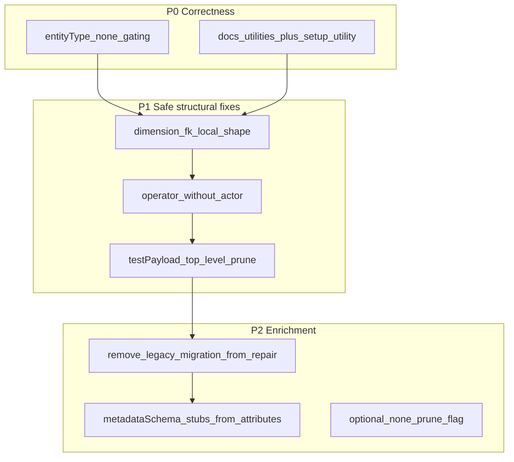

# Extend `aifabrix repair` using rules and v2.4

## Overview

Align `aifabrix repair` with external-datasource **v2.4.1** and Plan 346 semantics: remove legacy repair migration code, fix **entityType** behavior (especially `none`), harden dimensions / `testPayload` / `metadataSchema` repair paths, update **[docs/commands/utilities.md](docs/commands/utilities.md)** and Commander help, and optionally drop `fieldMappings.dimensions` handling from validators in favor of root `dimensions`.

## Rules and standards

This plan must comply with:

- **[Project rules](.cursor/rules/project-rules.mdc)** — primary engineering standard for the Builder CLI.
- **[CLI user documentation](.cursor/rules/docs-rules.mdc)** — applies to edits under `docs/commands/` (command-centric language; no REST/API paths or backend endpoint names).

**Applicable sections from [project-rules.mdc](.cursor/rules/project-rules.mdc)** (read the file for full detail):

| Area                        | Why it applies                                                                                                            |
| --------------------------- | ------------------------------------------------------------------------------------------------------------------------- |
| **Architecture Patterns**   | Repair lives under `lib/commands/` (CommonJS); clarify generator vs integration output when touching fixtures.            |
| **CLI Command Development** | `setup-utility.js` repair command/options, user-facing descriptions, chalk/error patterns.                                |
| **Testing Conventions**     | Jest tests under `tests/` mirroring `lib/`; mock external I/O; cover success and failure paths for new repair logic.      |
| **Validation Patterns**     | Repair behavior must stay consistent with `lib/schema/external-datasource.schema.json` v2.4.1 and application validators. |
| **Code Quality Standards**  | Files ≤500 lines, functions ≤50 lines; JSDoc on public functions; split `repair-datasource.js` if it grows past limits.   |
| **Quality Gates**           | Mandatory lint + test before merge (`npm run build` / `npm run build:ci`).                                                |
| **Security & Compliance**   | No secrets in code or logs; env.template / KV guidance stays in user-safe terms per docs-rules.                           |

**Key requirements (summary)**

- Use existing Commander and `repairExternalIntegration` patterns; keep option text aligned with real behavior.
- Add or update unit/integration tests for every behavioral change; aim for **≥80% coverage on new code**.
- Documentation and CLI help must describe `**exposed.schema`** and **root `dimensions`**, not deprecated `exposed.attributes` / `fieldMappings.dimensions` repair wording.

## Before development

- Skim the sections above in `.cursor/rules/project-rules.mdc` and `.cursor/rules/docs-rules.mdc` before editing `docs/commands/utilities.md`.
- Re-read `lib/schema/external-datasource.schema.json` (v2.4.1) for `entityType: none` and `exposed` shapes.
- `rg` for `migrateLegacy`, `fieldMappings.dimensions`, `exposed.attributes` in `lib/commands/repair*` and planned validator files to scope deletions.

## Definition of done

1. **Build:** Run `npm run build` **first** — per [package.json](package.json) this runs `npm run lint` then `npm test`; must succeed.
2. **CI parity:** Before merge, run `npm run build:ci` if the team uses CI’s `test:ci` path (`lint` + `test:ci`).
3. **Lint:** `npm run lint` passes with **zero errors** on the repo (build already runs lint).
4. **Tests:** All tests pass; extend [repair-datasource.test.js](tests/lib/commands/repair-datasource.test.js) and [repair.test.js](tests/lib/commands/repair.test.js) as listed under **Testing**; **≥80% coverage** for new repair/validator code where practical.
5. **Order:** Do not skip lint or tests; fix failures before marking work complete.
6. **File / function limits:** Changed modules ≤500 lines, functions ≤50 lines; extract helpers if needed.
7. **JSDoc:** Public exports in modified modules have accurate `@param` / `@returns` / `@fileoverview` as appropriate.
8. **Security:** No hardcoded secrets; no sensitive values in error messages or docs.
9. **Docs & CLI:** [docs/commands/utilities.md](docs/commands/utilities.md) and [lib/cli/setup-utility.js](lib/cli/setup-utility.js) match post-change `repair` behavior.
10. All plan todos completed or explicitly deferred with a short note in the PR.

## Scope: no legacy migration

Repair must **not** migrate old shapes into v2.4 (e.g. `fieldMappings.dimensions` → root `dimensions`, `exposed.attributes` → `exposed.schema`, `config.abac` → `dimensions`). **Delete** `[migrateLegacyFieldMappingsDimensions](lib/commands/repair-datasource.js)` and any other legacy-only branches in repair modules (see **Legacy code removal** below). Authors with pre-v2.4 files use `convert`, manual edits, or docs—not `aifabrix repair`. New repair logic only **aligns or sanitizes** configs already on the v2.4 model.

### Legacy code removal (required)

- **Repair:** Remove `migrateLegacyFieldMappingsDimensions`, module exports, and tests in `[repair-datasource.test.js](tests/lib/commands/repair-datasource.test.js)` that only exist for it. Re-read `[repair-datasource.js](lib/commands/repair-datasource.js)`: drop JSDoc/comments that describe migration; if `[repairExposeFromAttributes](lib/commands/repair-datasource.js)` deletes `exposed.attributes`, keep only if still needed so `--expose` output matches schema (deprecated key cleanup vs migration—document choice in PR).
- **Integration tests:** Update `[repair.test.js](tests/lib/commands/repair.test.js)` (e.g. assertions that expected `fieldMappings.dimensions` cleared or “exposed.attributes” wording).
- **Broader codebase:** Run `rg` for `fieldMappings.dimensions`, `migrateLegacy`, `exposed.attributes` in `lib/` (excluding schema changelog). Remaining **validator/display** references (`[field-reference-validator.js](lib/datasource/field-reference-validator.js)`, `[abac-validator.js](lib/datasource/abac-validator.js)`, `[validate-display.js](lib/validation/validate-display.js)`, `[external-system-validators.js](lib/utils/external-system-validators.js)`) are not “repair” but still legacy dual-path support—**remove or repoint to root `dimensions` only** in the same effort if the goal is zero legacy handling (coordinate with `[hubspot-integration.test.js](tests/integration/hubspot/hubspot-integration.test.js)` / fixtures if they still assert old shapes).

### Documentation (required)

- Update **[docs/commands/utilities.md](docs/commands/utilities.md)** `aifabrix repair <app>` section: describe **root `dimensions`** pruning (invalid local `field` vs `fieldMappings.attributes`), not `fieldMappings.dimensions`; describe **exposed.schema** for `--expose`, not `exposed.attributes`; keep env.template, RBAC, `--auth`, `--sync`, `--test`, deploy manifest behavior accurate with post-change code.
- Align **[lib/cli/setup-utility.js](lib/cli/setup-utility.js)** `.option('--expose', ...)` text with the same wording.

## Baseline: what repair does today

`[lib/commands/repair.js](lib/commands/repair.js)` orchestrates:

- Integration manifest: `externalIntegration` block, `app.key`, datasource filename/key normalization (`[repair-datasource-keys.js](lib/commands/repair-datasource-keys.js)`), `system.dataSources` order/keys, per-file `systemKey`, env.template + auth normalization (`[repair-env-template.js](lib/commands/repair-env-template.js)`, `[repair-env-template.js` `normalizeSystemFileAuthAndConfig](lib/commands/repair-env-template.js)`), optional `--auth`, optional RBAC merge (`[repair-rbac.js](lib/commands/repair-rbac.js)`), deploy manifest regeneration, optional README.
- **Every datasource file** (no flag): `[repairDatasourceFile](lib/commands/repair-datasource.js)` prunes orphan **root** `dimensions` (local bindings whose `field` is not in `fieldMappings.attributes`), and **adds or prunes `metadataSchema`** (today also runs legacy migration—**to be deleted** per scope).
- **Flags**: `--expose` → `exposed.schema` from attribute keys; `--sync` → default `{ mode, batchSize }`; `--test` → `testPayload.payloadTemplate` / `expectedResult`.

## Gaps vs Plan 346 (and v2.4.1 schema)

### 1) Critical: `entityType: none` contract (§1)

Plan 346 **forbids** storage/sync surfaces on `none` (e.g. `metadataSchema`, `primaryKey`, `foreignKeys`, `dimensions`, `fieldMappings`, `sync`, `quality`, `context`, `validation`, `documentStorage`, etc.).

Today, `[repairMetadataSchemaFromAttributes](lib/commands/repair-datasource.js)` **injects** a minimal `metadataSchema` whenever it is missing, **regardless of `entityType`**. That can turn a valid orchestration stub into a **schema-invalid** file.

**Recommendation:** Make datasource repairs **entityType-aware**:

- For `entityType === 'none'`, **do not** add `metadataSchema`; optionally (behind a flag, e.g. `--prune-none` or `--strict-contract`) **remove** forbidden keys that the schema lists for `none`.
- For other types, keep current behavior where appropriate.

This is the highest-impact alignment with Plan 346 and `[external-datasource.schema.json](lib/schema/external-datasource.schema.json)` v2.4.1.

### 2) CLI / user docs drift

Covered by **Documentation (required)** above: [setup-utility.js](lib/cli/setup-utility.js) and [docs/commands/utilities.md](docs/commands/utilities.md) must describe **exposed.schema**, **root `dimensions`**, and actual repair behavior (not `exposed.attributes` / `fieldMappings.dimensions`).

### 3) Dimension bindings (§7, §9)

- **Missing repairs** (for files already using root `dimensions`):
  - `**type: 'fk'`**: ensure `field` is absent and `via` is present; drop invalid `field` or empty/`via` mistakes when unambiguous.
  - **§9 hygiene:** if `operator` is set but `actor` is absent, **strip `operator`** (documented as no-op until `actor` exists).
- **Orphan dimension removal** today only checks `binding.field` against attribute keys — **FK bindings** use `via`, not `field`; repair should not delete valid FK bindings by mis-applying the local rule.

### 4) `metadataSchema` beyond prune/add stub (§2–§3, §4)

Current logic: prune properties not referenced by `metadata.`* in expressions, or add `{ type: object, additionalProperties: true }` if missing.

**Possible extensions (conservative):**

- For **storage** entity types, when `fieldMappings.attributes` lists keys but `metadataSchema.properties` lacks them, **add minimal scalar stubs** (e.g. `type: string`) for referenced `metadata.<name>` paths — improves alignment with “normalized output MUST correspond to `metadataSchema`” (§4) without guessing indexes.
- Optionally sync `**index` / `filter`** on attributes from a small heuristic (e.g. fields appearing in `primaryKey` / `foreignKeys.fields` → `index: true`) — higher value but needs clear rules to avoid surprising diffs.

### 5) `exposed.schema` (§13)

`--expose` builds a flat `metadata.<key>` map only. It does **not** reflect `fk.`* / `dimension.`* in expressions.

**Reasonable scope:**

- **No** conversion from `exposed.attributes` (legacy) — out of scope; validation should tell authors to fix manually.
- Document that full exposure repair for FK/dimension paths remains **author-driven** or validator-driven; optional future `--expose=deep` could parse expression roots beyond `raw.`/`metadata.`.

### 6) `testPayload` (§16)

- Repair may **write** `payloadTemplate` / `expectedResult` but does not **prune** unknown **top-level** `testPayload` keys (Plan 346: closed root).
- Add a small repair pass: remove keys not in the allowlist (`mode`, `primaryKey`, `scenarios`, `fk`, `actors`, `payloadTemplate`, `expectedResult`) when safe (or behind `--test` / new `--sanitize-test-payload`).

### 7) `primaryKey` / `labelKey` / capabilities (§10)

- Not repaired today. **Low-confidence auto-fix** (guessing PK) is risky.
- Safer options: (a) **warn-only** in validate with “repair cannot infer”; (b) if `capabilities` includes `update`/`delete`/`get` and `primaryKey` is missing, **do not guess** but optional `--infer-keys` could set PK to a single field named `id` only when uniquely implied — product decision.

### 8) `foreignKeys` / join graph (§6, §8)

- **Local repairs:** drop FK entries whose `fields` reference missing `metadataSchema` properties (or non-indexed fields if metadata is complete enough).
- **Graph / cross-datasource join compatibility (§8):** needs **full manifest** context — keep in **validate**; repair could run multi-file only with explicit scope and still be incomplete.

### 9) Other legacy surfaces

- **Out of scope:** `config.abac` or any pre-v2.4 dimension placement — not migrated by repair.

## Suggested implementation order

## Testing

- Extend `[tests/lib/commands/repair-datasource.test.js](tests/lib/commands/repair-datasource.test.js)` for: `none` never gains `metadataSchema`; dimension FK/local shape fixes; `testPayload` sanitization; **remove or replace** tests that only covered `migrateLegacyFieldMappingsDimensions`.
- Extend `[tests/lib/commands/repair.test.js](tests/lib/commands/repair.test.js)` for integration-level dry-run messages if new flags are added.
- Add or reuse a **minimal v2.4.1 fixture** per [113-schema plan](.cursor/plans/113-schema_2.4_test_alignment.plan.md) for `none` vs `recordStorage`.

## Out of scope (unless product asks)

- **Legacy migration** of any kind (`fieldMappings.dimensions`, `exposed.attributes`, `config.abac`, etc.).
- Full §8 join compatibility auto-repair across datasources.
- Rewriting `fieldMappings` expressions to valid DSL (§4) — validation + manual fix remains primary.
- Enterprise policy mode (§15) — separate from repair; repair should not silently enforce stricter CI policy.

## Plan validation report

**Date:** 2026-03-29  
**Plan:** [.cursor/plans/114-repair_command_2.4_alignment.plan.md](.cursor/plans/114-repair_command_2.4_alignment.plan.md)  
**Status:** VALIDATED

### Plan purpose

**Summary:** Refactoring and hardening the external-integration `**aifabrix repair`** flow for **v2.4.1** / Plan 346: remove legacy migration code, entityType-aware datasource repair, dimension and testPayload improvements, documentation and CLI help alignment, optional validator cleanup.

**Affected areas:** CLI (`lib/cli/setup-utility.js`, `lib/commands/repair*.js`), validation (`lib/datasource/*`, `lib/validation/*`, `lib/utils/external-system-validators.js`), tests under `tests/lib/commands/` and possibly integration tests, user docs (`docs/commands/utilities.md`), JSON schema reference (`lib/schema/external-datasource.schema.json`).

**Plan type:** Development + refactoring + documentation (multi-type).

**Key components:** `repair-datasource.js`, `repair.js`, `repair-datasource-keys.js`, `repair-env-template.js`, `repair-rbac.js`, `utilities.md`, `setup-utility.js`, HubSpot / repair tests.

### Applicable rules

| Rule / doc                                                                     | Status             | Notes                                    |
| ------------------------------------------------------------------------------ | ------------------ | ---------------------------------------- |
| [project-rules.mdc](.cursor/rules/project-rules.mdc) — Architecture Patterns   | Referenced in plan | `lib/commands/` layout, CommonJS         |
| [project-rules.mdc](.cursor/rules/project-rules.mdc) — CLI Command Development | Referenced in plan | Commander options, UX                    |
| [project-rules.mdc](.cursor/rules/project-rules.mdc) — Testing Conventions     | Referenced in plan | Jest, mirror structure                   |
| [project-rules.mdc](.cursor/rules/project-rules.mdc) — Validation Patterns     | Referenced in plan | Schema v2.4.1 alignment                  |
| [project-rules.mdc](.cursor/rules/project-rules.mdc) — Code Quality Standards  | Referenced in plan | 500/50 limits, JSDoc                     |
| [project-rules.mdc](.cursor/rules/project-rules.mdc) — Quality Gates           | Referenced in plan | build / lint / test                      |
| [project-rules.mdc](.cursor/rules/project-rules.mdc) — Security & Compliance   | Referenced in plan | No secrets in output                     |
| [docs-rules.mdc](.cursor/rules/docs-rules.mdc)                                 | Referenced in plan | `utilities.md` must stay CLI-user-facing |

### Rule compliance

- **DoD:** Documented under **Definition of done** (build = `lint` + `test` per package.json; optional `build:ci`; coverage; limits; JSDoc; security; docs alignment).
- **CLI / testing / validation / quality gates:** Addressed in **Rules and standards** and **Before development** checklists.
- **Note:** This repo’s `npm run build` runs `lint` then `npm test`, not `test:ci`; the plan documents both `build` and `build:ci` for clarity.

### Plan updates made (this validation pass)

- Added **Overview**, **Rules and standards** (with table + key requirements), **Before development**, and **Definition of done**.
- Linked [docs-rules.mdc](.cursor/rules/docs-rules.mdc) for `docs/commands/utilities.md` edits.
- Corrected **Definition of done** to match [package.json](package.json) scripts (`build` vs `build:ci`).
- Fixed markdown typos in **Documentation (required)**, `metadata.*`, `fk.*` / `dimension.*`, and §2 CLI/docs line.

### Recommendations

- When implementing **remove-legacy-validators-display**, schedule coordinated updates to [docs/commands/validation.md](docs/commands/validation.md) and [docs/configuration/validation-rules.md](docs/configuration/validation-rules.md) if error messages or dimension paths change (optional follow-up if not in this PR).
- After code changes, run `**npm run build`** locally and `**npm run build:ci`** before merge if CI uses `test:ci`.
- If `repair-datasource.js` approaches 500 lines while adding entityType gating and testPayload sanitization, extract helpers per project-rules (e.g. `repair-datasource-entity-type.js`).

## Implementation validation report

**Date:** 2026-03-29  
**Plan:** [.cursor/plans/114-repair_command_2.4_alignment.plan.md](.cursor/plans/114-repair_command_2.4_alignment.plan.md)  
**Status:** COMPLETE

### Executive summary

All eight YAML todos are **completed**. Implementation matches the plan: legacy repair migration removed, `entityType: none` gating, dimension binding repairs, `testPayload` top-level sanitization, metadataSchema stubs, validator/display updates for root `dimensions`, `utilities.md` and Commander `--expose` text updated, and tests extended. **Lint** and `**npm test`** both passed on validation run.

### Task completion

| Source                     | Total | Completed | Notes                                    |
| -------------------------- | ----- | --------- | ---------------------------------------- |
| Frontmatter `todos`        | 8     | 8         | All `status: completed`                  |
| Markdown `- [ ]` / `- [x]` | 0     | —         | Plan uses YAML todos, not checkbox tasks |

**Completion:** 100% of tracked todos.

### File existence validation

| Path                                                                                                           | Status                                                             |
| -------------------------------------------------------------------------------------------------------------- | ------------------------------------------------------------------ |
| [lib/commands/repair-datasource.js](lib/commands/repair-datasource.js)                                         | Present; `migrateLegacyFieldMappingsDimensions` absent from `lib/` |
| [lib/commands/repair.js](lib/commands/repair.js)                                                               | Present                                                            |
| [lib/cli/setup-utility.js](lib/cli/setup-utility.js)                                                           | Present; `--expose` describes `exposed.schema`                     |
| [docs/commands/utilities.md](docs/commands/utilities.md)                                                       | Present; repair section describes v2.4 / `none`                    |
| [lib/datasource/field-reference-validator.js](lib/datasource/field-reference-validator.js)                     | Present; root dimensions for primaryKey                            |
| [lib/datasource/abac-validator.js](lib/datasource/abac-validator.js)                                           | Present; no `fieldMappings.dimensions` validation block            |
| [lib/validation/validate-display.js](lib/validation/validate-display.js)                                       | Present; no legacy `fieldMappings.dimensions` merge                |
| [lib/utils/external-system-validators.js](lib/utils/external-system-validators.js)                             | Present; `getDimensionsMapForValidation` root-only                 |
| [tests/lib/commands/repair-datasource.test.js](tests/lib/commands/repair-datasource.test.js)                   | Present; covers none, dimensions, testPayload                      |
| [tests/lib/commands/repair.test.js](tests/lib/commands/repair.test.js)                                         | Present; v2.4-style mocks                                          |
| [tests/integration/hubspot/hubspot-integration.test.js](tests/integration/hubspot/hubspot-integration.test.js) | Present; dimension/exposed helpers                                 |

### Test coverage

- Unit tests: **repair-datasource**, **repair**, **field-reference-validator**, **abac-validator** updated for new behavior.
- Integration: HubSpot **Access Fields** tests use helpers compatible with legacy fixtures or root `dimensions`.
- `**npm test`:** 247 suites passed, 5450 tests passed (28 skipped), ~4.8s (default Jest projects).
- `**npm run test:integration`** was not re-run in this validation pass; run before merge if your workflow requires it.

### Code quality validation

| Step              | Command            | Result            |
| ----------------- | ------------------ | ----------------- |
| Format / auto-fix | `npm run lint:fix` | Exit 0            |
| Lint              | `npm run lint`     | Exit 0 (0 errors) |
| Test              | `npm test`         | Exit 0            |

`**repair-datasource.js`:** 424 lines (under 500-line project limit).

### Cursor rules compliance (spot check)

- **CommonJS** exports and `require` in changed modules.
- **No** `migrateLegacy` or hardcoded secrets added.
- **CLI user docs** (`utilities.md`) remain command-centric per docs-rules scope.
- **JSDoc** retained on public repair helpers where applicable.

### Implementation completeness

| Area                                                                                                                                                    | Status                                                                           |
| ------------------------------------------------------------------------------------------------------------------------------------------------------- | -------------------------------------------------------------------------------- |
| Repair / datasource alignment                                                                                                                           | Complete per plan                                                                |
| Validators / display                                                                                                                                    | Complete (root `dimensions`)                                                     |
| Documentation (`utilities.md` + CLI)                                                                                                                    | Complete                                                                         |
| Optional `--prune-none` flag                                                                                                                            | Not implemented (plan: optional / consider)                                      |
| Follow-up: [docs/commands/validation.md](docs/commands/validation.md), [docs/configuration/validation-rules.md](docs/configuration/validation-rules.md) | Still may mention `fieldMappings.dimensions` in prose (plan recommendation only) |

### Issues and recommendations

1. Run `**npm run build:ci`** (lint + `test:ci`) if CI uses the CI test script.
2. Optionally align **validation.md** / **validation-rules.md** with new primaryKey wording and removal of `fieldMappings.dimensions` from ABAC validation.
3. If Jest reports worker teardown warnings, investigate open handles separately (pre-existing noise in suite output).

### Final validation checklist

- All plan todos completed (YAML)
- Key files exist and reflect implementation
- Tests exist for repair and validator changes
- `npm run lint:fix` and `npm run lint` pass
- `npm test` passes
- `repair-datasource.js` within file size guideline
- Legacy migration removed from `lib/`

