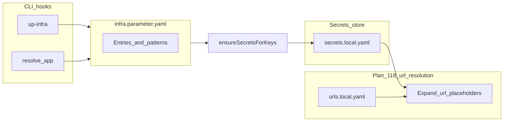

# Plan: `infra.parameter.yaml` — unified infra + Azure parameter catalog

## Current behavior (validated in repo)

- `**aifabrix up-infra**` (`[lib/cli/setup-infra.js](aifabrix-builder/lib/cli/setup-infra.js)`) calls `[prepareInfrastructureEnvironment](aifabrix-builder/lib/infrastructure/index.js)`, which runs `[secretsEnsure.ensureInfraSecrets](aifabrix-builder/lib/core/secrets-ensure.js)` then writes `admin-secrets.env` and starts Docker.
- **Infra secret keys are a fixed list** in `[INFRA_SECRET_KEYS](aifabrix-builder/lib/core/secrets-ensure.js)` (`postgres-passwordKeyVault`, `redis-*`, Keycloak placeholders, `**databases-miso-controller-0-*` only**). There is **no** entry for `databases-miso-controller-1-*`, yet `[builder/miso-controller/env.template](aifabrix-miso/builder/miso-controller/env.template)` requires URLs/passwords for DB index `1` (miso-logs).
- **Per-app secrets** are created when the user runs `**aifabrix resolve <app> --force`**, which uses `[findMissingSecretKeys](aifabrix-builder/lib/utils/secrets-generator.js)` on `env.template` and `[generateSecretValue](aifabrix-builder/lib/utils/secrets-generator.js)` for new keys.
- **DB naming — two conventions (not a mistake):** Local `kv://` suffixes in Builder `env.template`/secrets follow `databases-{appKey}-{index}-urlKeyVault` / `passwordKeyVault` (see `[lib/core/templates-env.js](aifabrix-builder/lib/core/templates-env.js)` and miso `env.template`). [.cursor/plans/keyvault.md](aifabrix-builder/.cursor/plans/keyvault.md) documents **Azure Key Vault secret names** for install/controller as `{app-key}-databases-{index}-urlKeyVault` / `passwordKeyVault` (and the same `{app-key}-` prefix pattern for other app-scoped secrets). **Naming truth:** **local** `kv://` patterns are authoritative in Builder templates; **keyvault.md** is authoritative for Azure vault secret names; `**infra.parameter.yaml`** must record the explicit mapping (`key` / pattern for local, `azure.vaultSecretName` / pattern for Azure) so validate/deploy paths do not guess. There is no separate `116-parameters.md`.
- **Generator bug / gap**: `[generateDbPasswordValue` / `generateDbUrlValue](aifabrix-builder/lib/utils/secrets-generator.js)` treat every `databases-miso-controller-*` key like the **primary** DB (they ignore the numeric index). If index `1` were ever auto-generated via this path, it would be wrong. Today many workspaces rely on pre-filled `[secrets.local.yaml](aifabrix-miso/builder/secrets.local.yaml)` instead.

## Goal

1. Add `**infra.parameter.yaml`** (Builder-owned catalog) describing every parameter the Builder may generate or validate: local secret key, kind (infra-shared vs app-prefixed), generator profile, optional **Azure KV secret name** / mapping notes, and validation constraints.
2. `**up-infra`**: extend auto-ensure so **all infra-related secrets required by checked-out apps** (at least miso-controller’s multi-DB keys, shared redis/postgres, etc.) are written to the configured secrets file (`~/.aifabrix/secrets.local.yaml` or `config.yaml` → `aifabrix-secrets`) — **without** manual `resolve --force` for standard installs.
3. **Adding a database** in `application.yaml` / `requires.databases`: when apps are regenerated or `resolve` runs, **derive** `databases-{appKey}-{i}-*` keys from the DB list and ensure missing keys.
4. **Validation**: one place that checks catalog completeness vs `kv://` usage in `env.template` (and optionally vs deploy JSON `configuration` entries), and checks that generator rules exist for every required key.
5. **Azure alignment**: for each catalog entry, record **actual** Azure-side secret naming as used by controller/install. **Primary human-readable matrix:** [.cursor/plans/keyvault.md](aifabrix-builder/.cursor/plans/keyvault.md) (infrastructure vs `{app-key}-…` app-scoped rows). Cross-check with Miso `[docs/schemas/application.md](aifabrix-miso/docs/schemas/application.md)` and Bicep under `[aifabrix-miso/infrastructure/bicep/](aifabrix-miso/infrastructure/bicep/)`. Where local `kv://` suffix ≠ Azure vault secret name, the catalog holds `azure.vaultSecretName` / pattern or `nameTransform` — no implicit rename in code.

## Alignment with Plan 118 (declarative `url://` resolution)

- **[118-declarative_url_resolution.plan.md](aifabrix-builder/.cursor/plans/118-declarative_url_resolution.plan.md)** defines `url://` placeholders, `~/.aifabrix/urls.local.yaml` (ports + front-door **pattern** only), and resolve order: load config → refresh URL registry → **resolve `kv://` (and other secret rules)** → derive env key → expand `url://` → emit Docker vs Local `.env`.
- **This plan (116)** owns **secret key catalog + generation + `kv://` coverage validation**. It does **not** define `url://`, host port math, or `urls.local.yaml`.
- **Shared pipeline constraint:** any implementation of 118 must keep **secrets/materialized `kv://` values available before `url://` expansion** (118 § Resolver step 3). The catalog feeds `generateSecretValue` / ensure steps that populate `secrets.local.yaml` (or equivalent); the 118 resolver consumes that store when building final `.env` files.
- **Plan 118 legacy removal** (`env-config.yaml`, `build.localPort`) is **orthogonal** to `infra.parameter.yaml`: 118 replaces URL/host-port config; 116 replaces ad hoc infra key lists and documents KV naming. Avoid introducing a second user-edited YAML for URLs (118) while introducing the catalog (116) — both should converge on **Builder code + small number of user-global files** (`config.yaml`, `secrets.local.yaml`, `urls.local.yaml`).

## Non-goals (for this iteration)

- Changing Controller or Dataplane HTTP APIs.
- Rewriting all env templates in one shot (catalog should describe existing keys first; template edits only where naming must be fixed for consistency).

## Rules and standards

This plan must comply with [Project Rules](.cursor/rules/project-rules.mdc):

- **[Quality Gates](.cursor/rules/project-rules.mdc#quality-gates)** — Mandatory **BUILD → LINT → TEST** before merge; run `npm run build` first per repository workflow.
- **[Code Quality Standards](.cursor/rules/project-rules.mdc#code-quality-standards)** — Files ≤500 lines, functions ≤50 lines; JSDoc on new public exports; split catalog/loader if a module approaches limits.
- **[Validation Patterns](.cursor/rules/project-rules.mdc#validation-patterns)** — JSON Schema + AJV for `infra-parameter.schema.json`; clear validation errors; js-yaml load errors surfaced with context paths.
- **[Architecture Patterns](.cursor/rules/project-rules.mdc#architecture-patterns)** — CommonJS, schemas under `lib/schema/`; new logic in `lib/parameters/` (or adjacent `lib/utils/` if team prefers minimal new folders); `path.join()` for filesystem paths.
- **[CLI Command Development](.cursor/rules/project-rules.mdc#cli-command-development)** — Extended `validate` / new `parameters` subcommand: Commander.js, validate arguments, chalk user errors, try/catch on async actions.
- **[Docker & Infrastructure](.cursor/rules/project-rules.mdc#docker--infrastructure)** — `up-infra` / `secrets-ensure` changes must keep Docker Compose and local Postgres/Redis behavior coherent.
- **[Security & Compliance (ISO 27001)](.cursor/rules/project-rules.mdc#security--compliance-iso-27001)** — Never log generated passwords or full `secrets.local.yaml` contents; errors must not echo secret values.
- **[Testing Conventions](.cursor/rules/project-rules.mdc#testing-conventions)** — Jest mirrors `lib/` layout; mock fs/workspace for discovery tests; ≥80% coverage on new code; golden cases for index-aware DB URL/password generation.
- **[Error Handling & Logging](.cursor/rules/project-rules.mdc#error-handling--logging)** — Structured, actionable errors for catalog load and validate failures; no secret material in log lines.

**Docs:** CLI/user documentation stays command-centric per [.cursor/rules/docs-rules.mdc](.cursor/rules/docs-rules.mdc) (no REST/API payload detail). Add `@requiresPermission` in `lib/api` only if new network calls to Controller/Dataplane are introduced ([permissions-guide.md](docs/commands/permissions.md)).

## Before development

- Read [Quality Gates](.cursor/rules/project-rules.mdc#quality-gates) and [Validation Patterns](.cursor/rules/project-rules.mdc#validation-patterns) in `project-rules.mdc`.
- Trace: [lib/cli/setup-infra.js](lib/cli/setup-infra.js) → [lib/infrastructure/index.js](lib/infrastructure/index.js) → [lib/core/secrets-ensure.js](lib/core/secrets-ensure.js); [lib/utils/secrets-generator.js](lib/utils/secrets-generator.js); [lib/utils/secrets-validation.js](lib/utils/secrets-validation.js) (if extended).
- Re-read [.cursor/plans/keyvault.md](keyvault.md) and lock catalog `azure` field semantics before implementation.
- Confirm **resolve order** with [118-declarative_url_resolution.plan.md](118-declarative_url_resolution.plan.md): `**kv://` materialized before `url://`** in any unified pipeline.
- If [117-environment-scoped_resources_schema.plan.md](117-environment-scoped_resources_schema.plan.md) is implemented, re-read plan § “Interaction with Plan 117” for optional prefixed secret keys in validation.

## Definition of done

Before marking this plan complete:

1. **Build:** Run `npm run build` **first** (must succeed).
2. **Lint:** Run `npm run lint`; **zero** errors and **zero** warnings.
3. **Test:** Run `npm test` or `npm run test:ci` **after** lint; all tests pass; **≥80% coverage** on new catalog, loader, generator wiring, and validate paths.
4. **Validation order:** **BUILD → LINT → TEST** only; do not skip steps.
5. **Size / style:** Files ≤500 lines; functions ≤50 lines for new/changed code.
6. **JSDoc:** New exported functions documented (`@param`, `@returns`, `@throws`).
7. **Security:** No hardcoded secrets; no logging of sensitive values; alignment with ISO 27001 secret-handling expectations.
8. **Documentation:** `docs/` updated for user-facing command behavior; onboarding/infra-parameters mirror per Phase 5.
9. **Plan success criteria:** Fresh `up-infra` satisfies miso-controller DB indices 0 and 1; miso-controller-1 URL/password generation correct; validate fails on uncovered `kv://`; Azure names cross-checked with keyvault.md + Miso schema/Bicep.
10. **Frontmatter todos:** All completed or deferred with explicit follow-up reference.

## Design: `infra.parameter.yaml`

**Location (proposed):** `[aifabrix-builder/lib/schema/infra-parameter.schema.json](aifabrix-builder/lib/schema/)` (JSON Schema) + default data `[aifabrix-builder/lib/schema/infra.parameter.yaml](aifabrix-builder/lib/schema/infra.parameter.yaml)` (or `templates/infra/` if you prefer assets-only — implementation detail).

**Suggested entry shape (conceptual):**

- `key` — canonical local secret name (matches `kv://` suffix).
- `scope` — `infra` | `app` | `shared-service` (redis, keycloak, azure-sp, …).
- `keyPattern` — optional regex for families (e.g. `^databases-(?<app>[a-z0-9-]+)-(?<idx>\d+)-urlKeyVault$`).
- `generator` — enum + params: e.g. `databaseUrl`, `databasePassword`, `randomBytes32`, `adminPostgresSync`, `emptyAllowed`, `literal`.
- `azure` — `vaultSecretName` or `vaultSecretNamePattern` + notes; align field semantics with **keyvault.md** columns (infrastructure shared names vs `{app-key}-…` app-scoped names).
- `ensureOn` — `upInfra` | `resolveApp` | `appRegister` (list).
- `validation` — min length, must match URL, must reference existing DB name from `application.yaml`, etc.

**Multi-DB / miso-controller:** encode **per-index** rules in the catalog (e.g. index `0` → primary `miso` DB user/url; index `1` → `miso-logs` — match `[application.yaml](aifabrix-miso/builder/miso-controller/application.yaml)` `requires.databases` order) so generators stop being index-blind.

## Implementation phases

### Phase 1 — Catalog + loader

- Add schema + default `infra.parameter.yaml`.
- Add `lib/parameters/infra-parameter-catalog.js` (load, validate with AJV, resolve patterns).
- Unit tests: load fixture, reject invalid catalog.

### Phase 2 — Wire generation to catalog

- Refactor `[generateSecretValue](aifabrix-builder/lib/utils/secrets-generator.js)` (or wrap it) to consult the catalog first; fall back to today’s heuristics only for keys not in catalog (with a deprecation path).
- Fix **miso-controller multi-DB** generation using catalog rules (index-aware).
- Replace hard-coded `[INFRA_SECRET_KEYS](aifabrix-builder/lib/core/secrets-ensure.js)` with **“keys where `ensureOn` includes `upInfra`”** plus **dynamic keys** from discovery (phase 3).

### Phase 3 — Discovery on `up-infra`

- After `ensureInfraSecrets`, scan configured workspace(s) for `builder/*/env.template` or known app list (reuse paths from `[lib/utils/paths.js](aifabrix-builder/lib/utils/paths.js)` / config) and collect all `kv://` references.
- Union with keys derived from each app’s `application.yaml` `requires.databases` length: for app key `dataplane` with 2 DBs → ensure `databases-dataplane-0|1-*` per catalog.
- Call `ensureSecretsForKeys` for missing keys (respect encryption + remote store behavior unchanged).

### Phase 4 — Validation command / flags

- Extend existing `[secret validate](aifabrix-builder/lib/utils/secrets-validation.js)` or add `aifabrix parameters validate`:
  - Every `kv://` in selected `env.template` files has a catalog entry or matching pattern.
  - Every catalog entry marked `requiredForLocal` has a generator or fixed default.
  - Optional: compare to deploy JSON / `configuration` block `value` fields that reference `*.KeyVault` names vs `azure` section.
- `**url://` validation** stays in the 118 resolver / tests (golden matrices). This command does not need to parse `url://` unless a future unified “resolve dry-run” explicitly combines both; if so, reuse 118 ordering: catalog/`kv://` first, then URL expansion.

### Phase 5 — Documentation alignment

- **[keyvault.md](aifabrix-builder/.cursor/plans/keyvault.md):** remains the **Azure Key Vault naming** reference (existing parameter table). Extend it with a short **Local vs Azure** note at the top (or an extra column / companion subsection) so `**kv://` suffix** (`databases-{appKey}-{index}-*`) is not confused with **vault secret names** (`{app-key}-databases-{index}-*`) — avoid implying one string works everywhere. Do not add a separate `116-parameters.md`.
- Mirror the sections **Onboarding: file structure** and **Variables, keys, and naming** into contributor docs (e.g. `[docs/developer-isolation.md](aifabrix-builder/docs/developer-isolation.md)` or new `docs/configuration/infra-parameters.md`) so onboarding does not depend on this plan file alone.
- **User-facing CLI docs** under `[docs/](aifabrix-builder/docs/)` for `up-infra` / `resolve` (per project docs rules: no raw REST; describe command outcomes).

## Interaction with Plan 117 (environment-scoped resources)

If `[useEnvironmentScopedResources](aifabrix-builder/.cursor/plans/117-environment-scoped_resources_schema.plan.md)` is implemented, the catalog should define **base** keys only; runtime prefixing stays in resolution (per 117). Validation should accept either base or effective `dev-` prefixed keys when scoping is on.

**Interaction with Plan 117 + 118:** URL path prefixes for `url://public` (`/dev`, `/tst`, or none) come from 117’s two-layer gate and client-id-derived env key (118 §6). **Secret keys in the catalog are not path-prefixed by 117** unless a separate product decision adds env-scoped secret names; today `kv://` names are stable base keys.

## Risks / decisions

- **Workspace discovery**: Builder may not know all apps on a machine; default to **apps under current monorepo / `AIFABRIX_BUILDER_DIR`** plus optional `config.yaml` list. Document limitation.
- **Security**: auto-generating Azure SP secrets or subscription IDs is not always possible locally; catalog should mark which keys are `**localDevOnly`** placeholders vs **must be supplied by user** after `az login` / portal.
- **Single source of truth**: long-term, `[application-schema.json](aifabrix-builder/lib/schema/application-schema.json)` `configuration` items could reference catalog ids instead of duplicating Key Vault string patterns — optional follow-up.

## Success criteria

- Fresh clone + `aifabrix up-infra` yields secrets sufficient for **miso-controller** local compose including **both** Postgres DBs (indices 0 and 1) without manual YAML edits.
- `generateSecretValue` never produces wrong URLs/passwords for `databases-miso-controller-1-urlKeyVault` / `passwordKeyVault`.
- `parameters validate` (or equivalent) fails CI when a new `kv://` appears in `env.template` with no catalog rule.
- Catalog documents **Azure secret name** alignment for each infrastructure-level parameter you care about, cross-checked with **keyvault.md**, Miso Bicep, and `application.md` schemas.

*Plan 118:* after `secretsLocal` (and config) are loaded, `urlExpand` produces Docker/Local `.env`; 116 does not replace that step.

## Validation checklist (plans 116 ↔ keyvault ↔ 118)

| Topic                                          | 116                                                                    | keyvault.md                         | 118                                                                  |
| ---------------------------------------------- | ---------------------------------------------------------------------- | ----------------------------------- | -------------------------------------------------------------------- |
| **Database secret naming**                     | Catalog maps local `databases-{app}-`* ↔ Azure `{app-key}-databases-`* | Azure column is vault secret name   | —                                                                    |
| **Infra-shared keys** (`redis-*`, `smtp-*`, …) | Catalog entries + `ensureOn: upInfra` where applicable                 | Table rows for infra-level KV names | —                                                                    |
| `**env.template`**                             | `kv://` refs must match catalog                                        | —                                   | Also `url://*`; expand after `kv://`                                 |
| **Global files under `~/.aifabrix/`**          | `secrets.local.yaml` / config paths for secrets                        | —                                   | `urls.local.yaml`, `config.yaml` for dev-id, remote-server, 117 gate |
| **Resolve order**                              | Generation/ensure before URL step                                      | —                                   | Explicit in 118 Resolver §3 → §8                                     |

## Plan validation report

**Date:** 2026-04-05  
**Plan:** `.cursor/plans/116-infra.parameter.yaml_parameters.plan.md`  
**Status:** ✅ VALIDATED

### Plan purpose

Introduce **Builder-owned** `infra.parameter.yaml` (JSON Schema + default catalog) so `kv://` keys, generators, and **Azure Key Vault naming** are explicit, **index-aware** (e.g. miso-controller DB `0` vs `1`), and validated; extend `**up-infra`** discovery and `**validate`** so infra/app secrets align with `env.template` and keyvault.md. **Does not** implement `url://` (Plan 118) or env-scoped prefixes (Plan 117), but documents interactions.

**Type:** Architecture + Development (schema, CLI hooks, infra/secrets) + Documentation + Testing.

**Affected areas:** `lib/schema/`, new catalog loader, `lib/core/secrets-ensure.js`, `lib/utils/secrets-generator.js`, `up-infra` / resolve paths, `docs/`; Miso schema/Bicep are **read-only** cross-checks.

### Applicable rules

- ✅ [Quality Gates](.cursor/rules/project-rules.mdc#quality-gates) — DoD documents BUILD → LINT → TEST and coverage.
- ✅ [Code Quality Standards](.cursor/rules/project-rules.mdc#code-quality-standards) — File/function limits and JSDoc in Rules + DoD.
- ✅ [Validation Patterns](.cursor/rules/project-rules.mdc#validation-patterns) — AJV + schema; matches Phase 1.
- ✅ [Architecture Patterns](.cursor/rules/project-rules.mdc#architecture-patterns) — `lib/schema/`, module layout.
- ✅ [CLI Command Development](.cursor/rules/project-rules.mdc#cli-command-development) — Phase 4 validate command.
- ✅ [Docker & Infrastructure](.cursor/rules/project-rules.mdc#docker--infrastructure) — `up-infra` / secrets ensure.
- ✅ [Security & Compliance (ISO 27001)](.cursor/rules/project-rules.mdc#security--compliance-iso-27001) — Secret handling.
- ✅ [Testing Conventions](.cursor/rules/project-rules.mdc#testing-conventions) — Jest, fixtures, coverage.
- ✅ [Error Handling & Logging](.cursor/rules/project-rules.mdc#error-handling--logging) — Catalog/validate errors.

### Rule compliance

- ✅ **DoD:** Checklist added (build first, lint, test, order, size, JSDoc, security, docs, success criteria, todos).
- ✅ **Rules and standards:** Section added with `project-rules.mdc` links and docs-rules / permissions note.
- ✅ **Before development:** Trace checklist for infra + secrets + 117/118 coordination.
- ⚠️ **Inline links in “Current behavior”:** Some use the `aifabrix-builder/lib/...` prefix; optional cleanup to repo-relative `lib/...` for readability in a single-repo checkout.

### Plan updates made (this validation)

- Inserted **Rules and standards**, **Before development**, and **Definition of done** after **Non-goals**.
- Appended this **Plan validation report**.
- Removed references to non-existent `**116-parameters.md`**; documentation alignment is **keyvault.md** + contributor `docs/` only.

### Recommendations

- Implement **index-aware** miso-controller generation (Phase 2) before fully replacing `INFRA_SECRET_KEYS` so regressions are visible early.
- When unifying resolve with Plan 118, keep **catalog-backed `kv://` completion before `url://`** expansion.
- Document **workspace discovery limits** (`AIFABRIX_BUILDER_DIR`, monorepo layout) in user-facing docs as already flagged under Risks.

