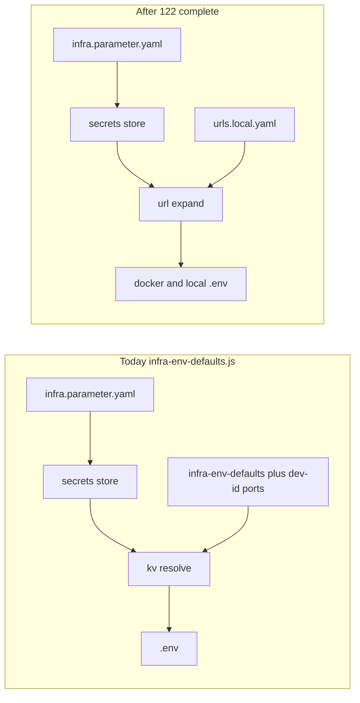

# Plan 123 — `up-miso` / `up-dataplane` and parameter consolidation

## Relationship to other plans

| Plan                                                                                       | Role                                                                                                                                                                           | Status                                                  |
| ------------------------------------------------------------------------------------------ | ------------------------------------------------------------------------------------------------------------------------------------------------------------------------------ | ------------------------------------------------------- |
| [121-infra.parameter.yaml_parameters.plan.md](121-infra.parameter.yaml_parameters.plan.md) | `infra.parameter.yaml` catalog, catalog-first `generateSecretValue`, `up-infra` discovery, `aifabrix parameters validate`                                                      | **Complete** (see 121 Implementation Validation Report) |
| [122-declarative_url_resolution.plan.md](122-declarative_url_resolution.plan.md)           | `url://` placeholders, `urls.local.yaml`, port math, remove `build.localPort`; **resolve order: `kv://` then `url://`** (Builder no longer ships `lib/schema/env-config.yaml`) | **Pending**                                             |
| **123 (this doc)**                                                                         | Bridges platform install commands + remaining cleanup; **does not redefine** 121 or 122                                                                                        | Tracking                                                |

## Commands (behavioral summary)

- `**aifabrix up-miso`** — Requires `up-infra` healthy; ensures `builder/keycloak` and `builder/miso-controller` from templates; runs both apps in Docker (`lib/commands/up-miso.js`).
- `**aifabrix up-dataplane`** — Controller health + auth; ensures `builder/dataplane`; register/rotate + deploy; runs dataplane locally (`lib/commands/up-dataplane.js`).

Secrets for `.env` generation flow through resolve: `env.template` → interpolate `${VAR}` where applicable → replace `kv://` from the secrets store → profile-specific passes (docker/local) in `lib/core/secrets.js` / `lib/utils/secrets-helpers.js`. Infra host/port defaults for `${VAR}` live in `**lib/utils/infra-env-defaults.js`** (loaded via `lib/utils/env-config-loader.js` → `buildEnvVarMap` in `lib/utils/env-map.js`); optional user override path remains `aifabrix dev set-env-config` if configured. Plan **122** adds `url://` + `urls.local.yaml` on top of the same ordering (`**kv://` before `url://`**).

## How values resolve (local install)

Two independent mechanisms appear in `env.template`:

### A. `${VAR}` placeholders (not secrets)

Examples: `KEYCLOAK_PUBLIC_PORT`, `REDIS_HOST`, `DB_HOST`, `KEYCLOAK_HOST`, `KEYCLOAK_PORT`, `MISO_HOST`, `MISO_PORT`.

- **Source:** `buildEnvVarMap(environment, …)` merges `**[lib/utils/infra-env-defaults.js](lib/utils/infra-env-defaults.js)`** (`docker` vs `local` blocks) with **developer-id** port math (`*_PUBLIC_PORT`, etc.).
- **When:** First phase of `resolveKvReferences` — `interpolateEnvVars(template, envVars)` runs **before** `kv://` substitution (`lib/core/secrets.js`, `lib/utils/secrets-helpers.js`).
- **Result:** For a normal dev install, these are **never empty** unless defaults are wrong or interpolation order is broken.

### B. `kv://secret-key` references (secrets store)

Examples: `API_KEY=kv://miso-controller-api-key-secretKeyVault`, `ENCRYPTION_KEY=kv://secrets-encryptionKeyVault`, database URLs/passwords, Azure/Mori keys.

- **Source:** User secrets file (e.g. `~/.aifabrix/secrets.local.yaml` or configured path), populated by `**up-infra`** (`ensureInfraSecrets` + discovery) and/or `**aifabrix resolve <app> --force**` / ensure-on-run paths that call `ensureSecretsFromEnvTemplate`.
- **Rules:** `[lib/schema/infra.parameter.yaml](lib/schema/infra.parameter.yaml)` — each key has a **generator** (or matches a **keyPattern**):
  - `**randomBytes32`** — e.g. most `*KeyVault` suffix keys: **API_KEY**, **ENCRYPTION_KEY**, JWT secrets, onboarding **password**, Keycloak tokens, dataplane client secret, etc. First ensure creates a value; **dataplane and miso-controller sharing `miso-controller-api-key-secretKeyVault`** means one shared secret file entry serves both apps.
  - `**databaseUrl` / `databasePassword**` — `databases-*-{index}-*` keys aligned with `requires.databases` in `application.yaml`.
  - `**literal**` — e.g. `redis-url` = `redis://${REDIS_HOST}:${REDIS_PORT}`; `${REDIS_*}` expanded when the secret value is applied (`replaceKvInContent` in `secrets-helpers.js`).
  - `**emptyString` / `emptyAllowed**` — URL-shaped keys in the catalog (`keycloak-server-url`, `keycloak-internal-server-url`, pattern `^[a-z0-9-]+-url$`, etc.) and **redis-password** when Redis has no password locally.
- **“Missing” from the user’s point of view:** If a key was never **ensured**, resolve throws “Missing secrets”. Fix: run `up-infra`, then `resolve <app> --force` (or use commands that call ensure with `force`), so the catalog generates missing keys.

### C. Intentionally empty or “don’t care” for local

- **Azure `kv://` lines** (`AZURE_SUBSCRIPTION_ID`, …): catalog treats them as `*KeyVault` → **randomBytes32** locally unless refined. With `**DEPLOYMENT=database`** (or non-Azure modes), the controller often **does not** need real Azure credentials; random placeholders are acceptable for “install comes up”. If the app validates non-empty UUID-shaped values, catalog may need `**emptyAllowed`** or dedicated entries (follow-up).
- **URL-shaped secrets** (`keycloak-server-url`, `miso-controller-web-server-url`, `dataplane-*-url`, …): catalog `**emptyString`** today → **empty in `.env` unless the user fills secrets** or **122** supplies URLs via `url://`. This is the main **gap vs “no manual work”** for OAuth/callback correctness.

### D. Known semantic bug (blocks polish for zero-touch)

- `**ONBOARDING_ADMIN_EMAIL=kv://miso-controller-admin-emailKeyVault`** matches the catch-all `*KeyVault` pattern → `**randomBytes32**`, which is **not a valid email**. Onboarding may expect `admin@…` or empty for default. **Fix:** exact catalog entry (`emptyAllowed` + template default) or non-`KeyVault` key / literal in template (todo **semantic-kv-onboarding-email**).

## Goal: local installation without manual work

**Today (honest state):**

| Area                                                   | Auto?           | Notes                                                                                                                                         |
| ------------------------------------------------------ | --------------- | --------------------------------------------------------------------------------------------------------------------------------------------- |
| `${VAR}` infra hosts/ports                             | Yes             | `infra-env-defaults.js` + dev-id                                                                                                              |
| Shared secrets (API key, encryption, JWT, DB strings)  | Yes             | After `up-infra` + per-app ensure/`resolve --force`                                                                                           |
| Redis URL / empty redis password                       | Yes             | `literal` + `emptyAllowed`                                                                                                                    |
| Public/internal service URLs in `kv://`                | **Often no**    | Catalog `emptyString`; **122** is the proper fix                                                                                              |
| Onboarding admin email                                 | **Wrong value** | Random bytes via `*KeyVault` pattern                                                                                                          |
| Dataplane DB secrets before `builder/dataplane` exists | **Maybe**       | Discovery only sees templates on disk; optional `standardUpInfraEnsureKeys` for dataplane indices (todo **optional-standard-dataplane-keys**) |

**Target path:** implement **122** for URLs; fix **onboarding email** generator; optionally extend **standardUpInfraEnsureKeys** for dataplane; document minimal command sequence: `up-infra` → `up-miso` → `up-dataplane` (each step must trigger ensure for needed keys).

## What must exist in the secrets store (`kv://`)

Union of **active** (non-comment) `kv://` lines in:

- [templates/applications/keycloak/env.template](templates/applications/keycloak/env.template)
- [templates/applications/miso-controller/env.template](templates/applications/miso-controller/env.template)
- [templates/applications/dataplane/env.template](templates/applications/dataplane/env.template)

**121** guarantees each such key matches [lib/schema/infra.parameter.yaml](lib/schema/infra.parameter.yaml) (exact or pattern) and is generated via catalog (or DB helpers) when ensured.

**Categories (informal):**

- **Infra-shared:** `redis-url`, `redis-passwordKeyVault`, `postgres-passwordKeyVault`, …
- **Per-app databases:** `databases-{appKey}-{index}-urlKeyVault` / `passwordKeyVault` (keycloak 0; miso-controller 0–1; dataplane 0–3)
- **Tokens / KeyVault suffix:** `*KeyVault` patterns (JWT, API keys, Azure/Mori placeholders, encryption, npm token, etc.)
- **URL-shaped keys today:** e.g. `keycloak-server-url`, `miso-controller-web-server-url`, `dataplane-web-server-url` — catalog often uses `emptyString` or patterns; **122** is the right place to move these to `**url://`** and drop duplicated URL logic from secrets.

## Does plan 123 add entries to `lib/schema/infra.parameter.yaml`?

**No — not as a goal of this plan.**

- **121** already introduced and maintains the catalog (`parameters[]`, patterns, `standardUpInfraEnsureKeys`, generators).
- **123** only tracks coordination and optional follow-ups. The only **optional** catalog touch is the todo *optional-standard-dataplane-keys*: if done, it may append **key names** to the root-level `standardUpInfraEnsureKeys` list (bootstrap list), not new `generator` / `parameters[]` definitions unless a new `kv://` key appears in templates first (then 121-style catalog work applies).
- **123 explicitly avoids** adding URL `literal` generators to the catalog for service public URLs — that stays with **122** (`url://`).

## Design decisions (123)

1. **No second URL system in the catalog** — Avoid adding many `generator: literal` URL strings to `infra.parameter.yaml` for public/internal service URLs; that duplicates **122** and conflicts with resolve order documented in 121 ↔ 122.
2. **121 stays source of truth for `kv://` key names and generators** (secrets, DB URLs/passwords, random material).
3. **122 owns** computed public/internal URLs, `urls.local.yaml`, and port formulas. `**env-config.yaml` is gone** from Builder; 122 describes the replacement model (`url://` registry + resolver).
4. **Optional `standardUpInfraEnsureKeys`** for dataplane DB keys — Only if product requires secrets before `builder/dataplane` exists; otherwise discovery after template copy is enough (121 Phase 3 behavior).

## Follow-up work (todos above)

- **122 alignment:** When migrating templates, replace URL-like `kv://` with `url://public` / `url://internal` / cross-app refs per 122; keep **121** catalog entries until migration, then delete or mark deprecated.
- **JS cleanup:** `createDefaultSecrets`, legacy `generateSecretValue` branches, `MISO_CONTROLLER_DATABASE_NAMES` — shrink in favor of catalog + YAML-driven DB lists (121 already fixed index-aware miso-controller generation; constant is a leftover optimization).
- **Tests:** Keep `parameters validate` / workspace tests in sync when platform `env.template` files gain new `kv://` keys.
- **Contributor/user docs (`docs-infra-parameters-md` todo):** Extend `docs/configuration/infra-parameters.md` so it is not only “catalog + Bicep audit” but also **how local `.env` gets values** — same substance as plan § “How values resolve” and § “Goal: local installation…”, without duplicating HTTP/API detail (per `.cursor/rules/docs-rules.mdc`). When 122 lands, add a short subsection pointing to `url://` / `urls.local.yaml` and update the “empty URL keys” paragraph.

## Definition of done (for 123 closure)

- Todos in this file’s frontmatter completed or explicitly superseded by a merged 122 implementation plan (including **`docs-infra-parameters-md`** unless deferred with a pointer to a follow-up issue).
- **`docs/configuration/infra-parameters.md` updated** to reflect resolution of `${VAR}` vs `kv://`, shared secret keys, known gaps (empty URL secrets until 122, onboarding email), and the recommended platform command sequence — with a **Related** link to this plan (`.cursor/plans/123-up-miso-dataplane-and-parameter-consolidation.plan.md`).
- **Zero-touch local install:** URL-shaped values either populated by **122** or an agreed interim; **onboarding email** no longer random bytes; command sequence documented and verified (up-infra → up-miso → up-dataplane).
- No contradiction with 121 (catalog) or 122 (`url://` / registry / legacy removal).

## Mermaid — target pipeline (after 122)

**Invariant (121 + 122):** materialize `**kv://`** before expanding `**url://`**.