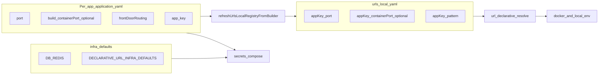

# Declarative URLs and ports: use-case catalog and infra-vs-app policy (validated)

## Plan status and alignment

- **[122-declarative_url_resolution.plan.md](aifabrix-builder/.cursor/plans/Done/122-declarative_url_resolution.plan.md)** — archive: port math, matrices A–D, original registry wording (**port + pattern only**). **Superseded for registry** by implementation: registry also stores **`<appKey>-containerPort`** when `build.containerPort` is set ([urls-local-registry.js](aifabrix-builder/lib/utils/urls-local-registry.js)).
- **[124-declarative-url-truth-table.plan.md](aifabrix-builder/.cursor/plans/Done/124-declarative-url-truth-table.plan.md)** — **canonical** for Traefik / `pathActive` / Plan 117 path prefix when proxy is on, docker vs local vdir-internal rules, and `traefik: false` = no proxy. Implementation reported complete; one **optional** isolated golden remains (see [Traefik coverage validation](#traefik-coverage-validation)).
- **This document** — single inventory of **code use cases**, **token surfaces**, **registry ↔ `url://<appKey>-…`**, **policy gaps** (`DEFAULT_ENV_CONFIG`), and **delivery phases**.

---

## Policy (target)

- **`application.yaml` is the source of truth** for each app: **`port`** (published / manifest basis for host URLs and port math), optional **`build.containerPort`** (in-container listen when it differs, e.g. Keycloak **8082** published / **8080** inside), **`frontDoorRouting`**, **`app.key`** (compose service name; used for `*_HOST === app.key` matching in docker env).
- **`urls.local.yaml`** mirrors intrinsic fields for cross-app resolution and tooling:
  - **`<appKey>-port`** — from manifest `port`
  - **`<appKey>-pattern`** — from `frontDoorRouting.pattern` or infra default ([DECLARATIVE_URL_INFRA_DEFAULTS](aifabrix-builder/lib/utils/infra-env-defaults.js))
  - **`<appKey>-containerPort`** — optional; written when `build.containerPort` set; removed on refresh when cleared ([urls-local-registry.js](aifabrix-builder/lib/utils/urls-local-registry.js))
  Refreshed when scanning `builder/*` and after successful app register ([register.js](aifabrix-builder/lib/app/register.js)). Resolver loads **YAML first**, then supplements with registry when expanding tokens for a target app ([resolveListenPortAndPatternFromDoc](aifabrix-builder/lib/utils/url-declarative-resolve-build.js)).
- **Hardcoded defaults — infra only** (e.g. `DB_*`, `REDIS_*`). First-party apps (dataplane, Keycloak, miso-controller, …) must **not** depend long-term on **`DEFAULT_ENV_CONFIG`** app rows in [infra-env-defaults.js](aifabrix-builder/lib/utils/infra-env-defaults.js) — **known gap**; Phase 2 removes them in favor of YAML + `url://` + registry.
- **Allowed builder literals (infra / generic):**
  - **`DECLARATIVE_URL_INFRA_DEFAULTS`**: `manifestPortFallback` (3000), `frontDoorPatternWhenUnspecified` (`/`), `inactiveVdirPublicEnvReplacement` (`/`) — [infra-env-defaults.js](aifabrix-builder/lib/utils/infra-env-defaults.js)
  - **Default port fallbacks** in [port-resolver.js](aifabrix-builder/lib/utils/port-resolver.js) via same manifest fallback when YAML omits `port`
  - **Stable protocol tokens** e.g. `url://vdir-public` string for inactive-line rewrite ([url-declarative-vdir-inactive-env.js](aifabrix-builder/lib/utils/url-declarative-vdir-inactive-env.js)) — not app-specific values
- **Declarative resolution** stays **generic**: token shape + target `appKey`; no product-specific branches in the resolver ([parseUrlToken](aifabrix-builder/lib/utils/url-declarative-resolve-build.js), [docker-manifest-public-port.js](aifabrix-builder/lib/utils/docker-manifest-public-port.js)).

---

## Declarative surface tokens (“variables” = six surfaces)

There is **no** token `url://<appKey>-variables`. Surfaces are **fixed suffixes** only.

### Current app (implicit `currentAppKey` from resolve context)

| Surface | Tokens (equivalent internal = private) |
|--------|------------------------------------------|
| Full URL public | `url://public` |
| Full URL internal | `url://internal`, `url://private` |
| Origin only public | `url://host-public` |
| Origin only internal | `url://host-internal`, `url://host-private` |
| Path / vdir public | `url://vdir-public` |
| Path / vdir internal | `url://vdir-internal`, `url://vdir-private` |

### Cross-app (`<appKey>` = `app.key`, e.g. `dataplane`, `keycloak`)

| Surface | Example |
|--------|---------|
| Full public | `url://dataplane-public` |
| Full internal | `url://dataplane-internal`, `url://dataplane-private` |
| Host public | `url://dataplane-host-public` |
| Host internal | `url://dataplane-host-internal` |
| Vdir public | `url://dataplane-vdir-public` |
| Vdir internal | `url://dataplane-vdir-internal` |

Implementation: [URL_TOKEN_EXACT, URL_TOKEN_SUFFIX_LONG, parseUrlToken](aifabrix-builder/lib/utils/url-declarative-resolve-build.js). **Public host surfaces** use **`publicPortBasis`** (manifest `port`); **internal `http://service:port`** uses **`listenPort`** (`getContainerPort` / registry `containerPort`).

---

## Traefik coverage validation

**Declarative `url://` behavior** is specified and marked **complete** in [124-declarative-url-truth-table.plan.md](aifabrix-builder/.cursor/plans/Done/124-declarative-url-truth-table.plan.md) (Implementation Validation Report). Covered cases include:

| Area | Rule | Code / tests |
|------|------|----------------|
| Traefik off | No ingress host, **no** `/dev`/`/tst` prefix, direct published port / remote / localhost | [computeDeclarativePathPrefix](aifabrix-builder/lib/utils/url-declarative-url-flags.js), [computePublicUrlBaseString](aifabrix-builder/lib/utils/url-declarative-public-base.js) |
| pathActive | `traefik && frontDoorRouting.enabled === true` | [computePathActive](aifabrix-builder/lib/utils/url-declarative-url-flags.js) |
| Traefik public authority | Expanded `frontDoorRouting.host` (same as compose placeholders) | [buildTraefikPublicBaseIfApplicable](aifabrix-builder/lib/utils/url-declarative-public-base.js), [expandFrontDoorHostPlaceholders](aifabrix-builder/lib/utils/compose-generator.js) |
| Plan 117 + Traefik | `/dev`, `/tst` only when traefik on + two-layer gate | [computeDeclarativePathPrefix](aifabrix-builder/lib/utils/url-declarative-url-flags.js) |
| TLS | `infraTlsEnabled` vs `frontDoorRouting.tls` on Traefik and direct branches | [url-declarative-public-base.js](aifabrix-builder/lib/utils/url-declarative-public-base.js) |
| Docker vs local | Internal URLs; docker `vdir-internal` empty; local mirrors public where applicable | [url-declarative-resolve-build.js](aifabrix-builder/lib/utils/url-declarative-resolve-build.js) |
| Tests | Truth table + expand + public-base + matrix D | [url-declarative-truth-table-124.test.js](aifabrix-builder/tests/lib/utils/url-declarative-truth-table-124.test.js), etc. |

**Optional gap (124 self-report):** add one explicit golden — **config `useEnvironmentScopedResources: true`**, **app `environmentScopedResources: false`**, **traefik on**, **front door enabled**, dev client id → public URL **without** `/dev` segment (behavior believed covered indirectly).

**Out of scope for “complete Traefik” in this plan:** every possible compose topology / label edge case beyond **shared host template rules** with `url://` ([compose-generator.js](aifabrix-builder/lib/utils/compose-generator.js)).

---

## Use cases from the code (complete inventory)

### A. Env generation pipeline (primary consumer)

| # | Use case | Where |
|---|----------|--------|
| A1 | After `kv://`, expand `url://` for **current app** | [secrets.js](aifabrix-builder/lib/core/secrets.js) `expandDeclarativeUrlsIfPresent` → [url-declarative-resolve.js](aifabrix-builder/lib/utils/url-declarative-resolve.js) |
| A2 | Inactive vdir: rewrite `VAR=url://vdir-public` → infra fallback `/` | [url-declarative-vdir-inactive-env.js](aifabrix-builder/lib/utils/url-declarative-vdir-inactive-env.js) |
| A3 | Docker: `*_PUBLIC_PORT` align to manifest `port` when `*_HOST === app.key` | [docker-manifest-public-port.js](aifabrix-builder/lib/utils/docker-manifest-public-port.js) |
| A4 | Redis/DB endpoints | [env-endpoints.js](aifabrix-builder/lib/utils/env-endpoints.js) via `loadEnvConfig()` (**still loads app rows today — gap**) |

### B. Declarative URL token model

| # | Use case | Where |
|---|----------|--------|
| B1 | Token parsing (see [surface table](#declarative-surface-tokens-variables--six-surfaces)) | [url-declarative-resolve-build.js](aifabrix-builder/lib/utils/url-declarative-resolve-build.js) |
| B2 | `listenPort` vs `publicPortBasis` + registry fallback | `resolveListenPortAndPatternFromDoc`, [port-resolver.js](aifabrix-builder/lib/utils/port-resolver.js) |
| B3 | Plan 117 prefix + client id | [url-declarative-resolve.js](aifabrix-builder/lib/utils/url-declarative-resolve.js), [url-public-path-prefix.js](aifabrix-builder/lib/utils/url-public-path-prefix.js) |
| B4 | Traefik / public base | [url-declarative-public-base.js](aifabrix-builder/lib/utils/url-declarative-public-base.js) |
| B5 | Cross-app scoped flag | `readTargetAppScopedFlag` in [url-declarative-resolve.js](aifabrix-builder/lib/utils/url-declarative-resolve.js) |
| B6 | Load target YAML | [url-declarative-resolve-load-doc.js](aifabrix-builder/lib/utils/url-declarative-resolve-load-doc.js) |

### C. Registry (`urls.local.yaml`)

| # | Use case | Where |
|---|----------|--------|
| C1 | Merge `builder/*/application.yaml` → registry | [urls-local-registry.js](aifabrix-builder/lib/utils/urls-local-registry.js) |
| C2 | Read during expansion | [url-declarative-resolve.js](aifabrix-builder/lib/utils/url-declarative-resolve.js) |
| C3 | CLI path display | [dev-show-display.js](aifabrix-builder/lib/commands/dev-show-display.js) |

### D. Compose / Traefik alignment

| # | Use case | Where |
|---|----------|--------|
| D1 | Host template expansion for labels | [compose-traefik-ingress-base.js](aifabrix-builder/lib/utils/compose-traefik-ingress-base.js), [compose-generator.js](aifabrix-builder/lib/utils/compose-generator.js) |
| D2 | Readiness / PathPrefix vs vdir | [compose-generator.js](aifabrix-builder/lib/utils/compose-generator.js) |

### E. Deploy / generator

| # | Use case | Where |
|---|----------|--------|
| E1 | Map `url://` → Key Vault naming | [deploy-manifest-azure-kv.js](aifabrix-builder/lib/generator/deploy-manifest-azure-kv.js), [generator/helpers.js](aifabrix-builder/lib/generator/helpers.js) |
| E2 | Template defaults (e.g. `url://miso-controller-public`) | [templates-env.js](aifabrix-builder/lib/core/templates-env.js) |

### F. Run / reload parity

| # | Use case | Where |
|---|----------|--------|
| F1 | `--reload` host `.env` ≡ docker-profile `url://*` | [env-copy.js](aifabrix-builder/lib/utils/env-copy.js), [run.js](aifabrix-builder/lib/app/run.js), [declarative-url-matrix-d-reload.test.js](aifabrix-builder/tests/lib/utils/declarative-url-matrix-d-reload.test.js) |

### G. App registration

| # | Use case | Where |
|---|----------|--------|
| G1 | Registration port from `getContainerPort` | [app-register-config.js](aifabrix-builder/lib/utils/app-register-config.js) |
| G2 | Refresh registry after successful register | [register.js](aifabrix-builder/lib/app/register.js) |

### H. Tests (executable spec)

| Test file | Covers |
|-----------|--------|
| [declarative-url-resolution.test.js](aifabrix-builder/tests/lib/utils/declarative-url-resolution.test.js) | envKey, Plan 117, builders |
| [declarative-url-ports.test.js](aifabrix-builder/tests/lib/utils/declarative-url-ports.test.js) | Port math |
| [url-declarative-resolve-expand.test.js](aifabrix-builder/tests/lib/utils/url-declarative-resolve-expand.test.js) | Expand, cross-app, Traefik off, manifest vs container |
| [url-declarative-public-base.test.js](aifabrix-builder/tests/lib/utils/url-declarative-public-base.test.js) | Remote base, TLS |
| [url-declarative-truth-table-124.test.js](aifabrix-builder/tests/lib/utils/url-declarative-truth-table-124.test.js) | Plan 124 matrix |
| [url-declarative-vdir-inactive-env.test.js](aifabrix-builder/tests/lib/utils/url-declarative-vdir-inactive-env.test.js) | Inactive vdir |
| [declarative-url-matrix-d-reload.test.js](aifabrix-builder/tests/lib/utils/declarative-url-matrix-d-reload.test.js) | Matrix D |
| [urls-local-registry.test.js](aifabrix-builder/tests/lib/utils/urls-local-registry.test.js) | Registry + containerPort |
| [docker-manifest-public-port.test.js](aifabrix-builder/tests/lib/utils/docker-manifest-public-port.test.js) | PUBLIC_PORT alignment |

### I. Policy outliers (document, don’t treat as env-config apps)

| # | Note | Where |
|---|------|--------|
| I1 | `DATAPLANE_APP_KEY` for secrets.local convention | [token-manager.js](aifabrix-builder/lib/utils/token-manager.js) |

---

## Gap vs policy (today)

[DEFAULT_ENV_CONFIG](aifabrix-builder/lib/utils/infra-env-defaults.js) still embeds **MISO_*, KEYCLOAK_*, DATAPLANE_*, …** host/port/public_port for docker/local. [loadEnvConfig](aifabrix-builder/lib/utils/env-config-loader.js) always returns this object → [env-endpoints.js](aifabrix-builder/lib/utils/env-endpoints.js) and interpolation still depend on those app literals until Phase 2.

---

## Target architecture

---

## Delivery phases

1. **Documentation** — [declarative-urls.md](aifabrix-builder/docs/configuration/declarative-urls.md): registry keys (`port`, `pattern`, `containerPort`), **surface token table**, Traefik off invariant, link **122** (archive) and **124** (truth table), infra-vs-app policy.
2. **Optional test** — isolated golden for 124 optional row (scoped config on, app scoped off, traefik on).
3. **Code migration** — Slim `DEFAULT_ENV_CONFIG` to infra-only; derive app connectivity from YAML + `url://` + registry; update secrets-helpers, env-map, env-endpoints, templates, tests.
4. **Verification** — `npm run build` / full Jest; document behavior when referenced app missing from `builder/`.

---

## Repo location

This plan: [126-declarative_url_use_cases.plan.md](./126-declarative_url_use_cases.plan.md) under **aifabrix-builder**.

## Implementation log (2026-04-13)

- **`lib/utils/url-declarative-token-parse.js`** — `parseUrlToken` + exported `DECLARATIVE_URL_EXACT_TOKENS` / `DECLARATIVE_URL_CROSS_APP_SUFFIXES` for tests and deploy manifest.
- **`lib/utils/url-declarative-resolve-build.js`** — imports `parseUrlToken` from token-parse (smaller file).
- **`lib/generator/deploy-manifest-azure-kv.js`** — requires token-parse directly.
- **`lib/utils/infra-env-defaults.js`** — `INFRA_ENV_DEFAULTS_*` + `APP_SERVICE_ENV_DEFAULTS_*` shallow-merged into `DEFAULT_ENV_CONFIG` (same runtime shape as before).
- **`lib/utils/urls-local-registry.js`** — `readExplicitContainerPortFromDoc` helper (complexity / lint).
- **`lib/core/secrets.js`** — `loadDeclarativeUrlExpandInputs` extracts config reads from `expandDeclarativeUrlsIfPresent`.
- **Tests:** `tests/lib/utils/url-declarative-token-surfaces.test.js`, `tests/lib/utils/infra-env-defaults.test.js`, Plan 124 golden in `url-declarative-truth-table-124.test.js`.
- **Docs:** `docs/configuration/declarative-urls.md` updated (registry, port/containerPort, infra vs app env, links to 122/124).

**Not done here:** Phase 2 removal of app rows from merged env (breaking); run full `npm test` if parallel suites flake on ephemeral FS.

## Implementation Validation Report

**Date**: 2026-04-15  
**Plan**: `aifabrix-builder/.cursor/plans/126-declarative_url_use_cases.plan.md`  
**Status**: ✅ COMPLETE (with notes)

### Executive Summary

Frontmatter todos are **completed** except **`doc-phase`**, which is explicitly **`cancelled`** in YAML (superseded by shipped documentation and the implementation log). Code artifacts from the plan (`url-declarative-token-parse.js`, infra/app split in `infra-env-defaults.js`, wiring in resolve-build / deploy-manifest / secrets) are present. Targeted and full Jest suites pass. ESLint passes with zero issues after `lint:fix`. One minor documentation gap: `docs/configuration/declarative-urls.md` does not yet contain explicit hyperlinks to archived plan **122** or canonical plan **124** (the implementation log states they were linked; consider adding a “Further reading” subsection with paths to `.cursor/plans/Done/122-*.md` and `124-*.md`).

### Task completion (YAML `todos`)

| id | status | Note |
|----|--------|------|
| copy-plan-to-builder | completed | — |
| doc-phase | cancelled | Intentionally cancelled in plan; user-facing doc still substantially updated (registry, surfaces, Traefik, infra vs app). |
| optional-test-124 | completed | — |
| token-parse-module | completed | — |
| infra-app-split | completed | — |
| slim-default-env | completed | — |
| verify-build | completed | Re-validated below. |

### File existence validation

| Path | Status |
|------|--------|
| `lib/utils/url-declarative-token-parse.js` | ✅ |
| `lib/utils/url-declarative-resolve-build.js` | ✅ (imports token-parse) |
| `lib/generator/deploy-manifest-azure-kv.js` | ✅ (requires token-parse) |
| `lib/utils/infra-env-defaults.js` | ✅ |
| `lib/utils/urls-local-registry.js` | ✅ |
| `lib/core/secrets.js` | ✅ |
| `docs/configuration/declarative-urls.md` | ✅ |
| `tests/lib/utils/url-declarative-token-surfaces.test.js` | ✅ |
| `tests/lib/utils/infra-env-defaults.test.js` | ✅ |
| `tests/lib/utils/url-declarative-truth-table-124.test.js` | ✅ |
| Other inventory tests (`declarative-url-resolution`, `declarative-url-ports`, `url-declarative-resolve-expand`, `url-declarative-public-base`, `url-declarative-vdir-inactive-env`, `declarative-url-matrix-d-reload`, `urls-local-registry`, `docker-manifest-public-port`) | ✅ (present under `tests/lib/utils/`) |

### Test coverage

- ✅ Unit tests exist for token surfaces, infra defaults, Plan 124 truth table, and related declarative URL modules.
- ✅ `npm test` (full builder suite via `tests/scripts/test-wrapper.js`): **all passed** (24 projects, 271 tests in reported aggregate).

### Code quality validation

| Step | Result |
|------|--------|
| `npm run lint:fix` | ✅ PASSED (exit 0) |
| `npm run lint` | ✅ PASSED (exit 0; 0 errors, 0 warnings) |
| `npm test` | ✅ PASSED (exit 0) |

### Cursor rules compliance (spot-check)

- ✅ CommonJS / `require`, `path.join` patterns preserved in touched areas.
- ✅ No secrets in validation output; no new `console.log` requirement for this plan scope.
- ✅ JSDoc on `url-declarative-token-parse.js` matches project conventions.

### Implementation completeness

- ✅ Token parse extraction and surface tests: implemented.
- ✅ Infra vs app defaults split in `infra-env-defaults.js`: implemented (per implementation log).
- ✅ Registry `containerPort` behavior: present (`urls-local-registry.js`).
- ⚠️ Docs: **`doc-phase` cancelled**; content aligns with plan goals but explicit **122 / 124** plan file links in `declarative-urls.md` are **not** found (optional follow-up).
- ℹ️ Long-term gap in plan narrative (`DEFAULT_ENV_CONFIG` app rows / `loadEnvConfig`): called out in plan body as policy; not a blocker for “126 shipped items” validation.

### Issues and recommendations

1. **Optional:** Add a short “Plans” or “Further reading” bullet list at the end of `docs/configuration/declarative-urls.md` linking to `.cursor/plans/Done/122-declarative_url_resolution.plan.md` and `.cursor/plans/Done/124-declarative-url-truth-table.plan.md` (relative paths from repo root or contributor note).
2. **None** blocking merge or release for the scope described in the implementation log.

### Final validation checklist

- [x] All **non-cancelled** YAML todos completed  
- [x] Critical files exist and imports resolve  
- [x] Tests exist and pass (`npm test`)  
- [x] `lint:fix` → `lint` → `test` order satisfied  
- [x] `doc-phase` understood as **cancelled** (not failed)  
- [ ] Explicit 122/124 links in `declarative-urls.md` (optional polish)
