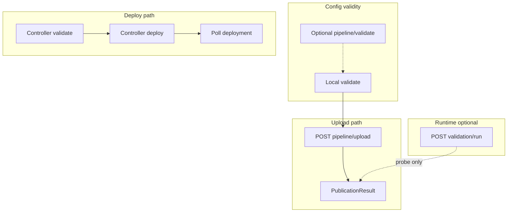

# Upload / deploy UX — External System readiness (Builder CLI)

## Overview

Elevate Builder `upload` / `deploy` output around **system readiness** (whether an external system is usable by AI), fully surface **`PublicationResult`**, eliminate **silent failures**, and separate **config**, **deployment**, and **runtime** layers. Use one shared formatter (`lib/utils/external-system-readiness-display.js`); deterministic **Ready / Partial / Failed** per datasource before any numeric score; **`--probe`** only for `POST /api/v1/validation/run`; defer **percentage scoring** until product definition. Scope: Builder CLI ([lib/commands/upload.js](lib/commands/upload.js), [lib/external-system/deploy.js](lib/external-system/deploy.js), [lib/deployment/deployer.js](lib/deployment/deployer.js), new display utility, Jest tests, user-facing docs per [docs-rules](.cursor/rules/docs-rules.mdc)).

**Plan type:** Development (CLI, modules, tests). **Affected areas:** CLI commands, `lib/api`, `lib/utils`, tests, documentation.

## Rules and Standards

This plan must comply with [Project Rules](.cursor/rules/project-rules.mdc):

- **[CLI Command Development](.cursor/rules/project-rules.mdc#cli-command-development)** — Commander.js patterns, chalk output, input validation, try/catch on async paths, user-facing messages.
- **[Code Quality Standards](.cursor/rules/project-rules.mdc#code-quality-standards)** — Files ≤500 lines, functions ≤50 lines, JSDoc on public functions.
- **[Quality Gates](.cursor/rules/project-rules.mdc#quality-gates)** — Mandatory BUILD → LINT → TEST before completion.
- **[Testing Conventions](.cursor/rules/project-rules.mdc#testing-conventions)** — Jest, mocks for fs/API, ≥80% coverage on new code.
- **[Error Handling & Logging](.cursor/rules/project-rules.mdc#error-handling--logging)** — Meaningful errors, no secrets in logs/output.
- **[Security & Compliance (ISO 27001)](.cursor/rules/project-rules.mdc#security--compliance-iso-27001)** — No hardcoded secrets; mask sensitive values.
- **[Validation Patterns](.cursor/rules/project-rules.mdc#validation-patterns)** — Align types with API contracts (`PublicationResult`, pipeline responses).

**Key requirements (summary):** Use `chalk` for semantic CLI colors per [CLI layout and colors](#cli-layout-and-colors-implementation-contract) and [layout.md](layout.md); `path.join` for paths; add tests for formatter and mapping; document new flags in command help; keep docs command-centric (no REST catalogs in `docs/`).

## Before Development

- [x] Read CLI Command Development and Quality Gates in [project-rules.mdc](.cursor/rules/project-rules.mdc).
- [x] Read [docs-rules.mdc](.cursor/rules/docs-rules.mdc) for any `docs/` edits (if applicable).
- [x] Read [layout.md](layout.md) for color semantics and block styling.
- [x] Trace `ApiClient` unwrap for `POST /api/v1/pipeline/upload` vs raw `PublicationResult` before coding display.
- [x] Confirm `GET /api/v1/external/systems/{key}` response shape for datasource list vs manifest-only count.

## Definition of Done

Before marking this plan complete:

1. **Build:** Run `npm run build` **first** (must succeed; runs lint + test:ci).
2. **Lint:** Run `npm run lint` (zero errors/warnings).
3. **Test:** Run `npm test` or `npm run test:ci` after lint (all pass; ≥80% coverage on new modules).
4. **Order:** BUILD → LINT → TEST — never skip or reorder.
5. **File / function size:** New/changed files ≤500 lines; functions ≤50 lines (split if needed).
6. **JSDoc:** Public functions in the new formatter and helpers documented.
7. **Security:** No hardcoded secrets; ISO 27001–aligned handling of tokens/URLs in messages.
8. **UX contract:** Output follows [CLI layout and colors](#cli-layout-and-colors-implementation-contract); no silent failures on dataplane fetch.
9. **Documentation:** Stale “upload only / no controller” copy removed where touched; `--probe` / `--verbose` documented in CLI help.
10. All YAML todos in this plan addressed or explicitly deferred with note.

## CLI layout and colors (implementation contract)

Canonical reference: **[layout.md](layout.md)** (full tables for headers, verdict, data quality, capabilities, probe, debug, etc.). Implementation uses **`chalk`**; every color must carry **semantic meaning** (no decorative coloring).

### Core color system (global)

| Meaning | Symbol | Chalk usage (typical) | Usage |
|---------|--------|------------------------|--------|
| Success | ✔ | `green` | Valid, ready, passed |
| Warning | ⚠ | `yellow` | Partial, degraded, non-blocking |
| Failure | ✖ | `red` | Blocking errors only |
| Skipped | ⏭ | `gray` | Not run (e.g. runtime without `--probe`) |
| Info | ℹ | `cyan` | Neutral info |
| Section title | — | `bold` / bright white | Block headers (`Publish Result:`, `Datasources:`) |
| Metadata | — | `gray` | Labels, secondary lines, HTTP codes in probe |
| URLs / traces | — | `cyan` | Docs links, resolved test URL, uploadId if treated as navigational |
| Next-action bullets | — | `cyan` bullet, `white` text | Per [layout.md](layout.md) §19 |

### Critical rules (from layout.md)

1. **Never use color without meaning** — no decorative colors.
2. **Red = blocking only** — not for warnings.
3. **Yellow = actionable, non-blocking** (partial, optional gaps).
4. **Green = safe / ready.**
5. **Gray = secondary / metadata / skipped.**
6. **Cyan = navigation** (URLs, trace-style ids where applicable).

**Note:** This plan **defers percentage “confidence”** scoring; if confidence appears later, use layout.md §4 ranges — until then, do not print confidence blocks.

### Map plan output blocks → layout.md sections

| Plan output block | layout.md reference |
|-------------------|---------------------|
| Command title / phase (`Uploading…`, `Deploying…`) | §1 Header block — labels gray, key values bold |
| System readiness / aggregate verdict | §2 Verdict |
| Config / Deployment / Runtime layers | §9 Integration steps style (per-line ✔/⏭) + section titles bold |
| Datasources list + Ready/Partial/Failed | §5 Datasources list |
| Per-datasource issues / Key Issues | §7 Failures / issues |
| Identity | §12 Identity block |
| Credential (intent) + probe credential result | §13 Credential + §20 Probe results |
| Docs / URLs | §14 Docs / links |
| Server validation warnings (`--verbose`) | §17 Warnings |
| Dataplane fetch failure after deploy | §18 Errors + §7 hints (yellow hint line) |
| Next actions | §19 Next actions |
| Upload ID / environment (metadata) | §21 Metadata |

### Section separators

Use a consistent horizontal rule in output (e.g. `────────────────────────────────` as in [CLI output examples](#cli-output-examples-target-ux)), printed in **gray** via `chalk.gray` unless the product standard already uses plain dim text.

## Product principles (aligned with recommendations)

1. **Primary outcome:** The CLI answers *“Can this system be used by AI?”* via a **readiness-oriented summary**, not only “success.”
2. **Three layers — never blurred in copy or layout:**
   - **Config validity** — local + optional server validate (schema/structure).
   - **Deployment success** — controller pipeline (validate/deploy/poll) for `deploy`; dataplane `POST /api/v1/pipeline/upload` for `upload` (includes publish + **controller registration**).
   - **Runtime readiness** — **opt-in only** via `--probe` (`POST /api/v1/validation/run`). No implicit probes; default path is deterministic and fast.
3. **Credential:** Show **intent** (configured `testEndpoint`, resolved URL from manifest). **Do not** imply connectivity unless `--probe` (or explicit test) returns it.
4. **Datasource signal:** Per-datasource status and **Ready / Partial / Failed** breakdown — **not** a bare count.
5. **Single formatter:** One module renders upload, deploy, and future `system status` to prevent drift.
6. **Defer numeric scoring:** No readiness **%** until a separate product spec exists; first ship stable categorical model + hints.

### Architecture alignment (CIP-first)

| Layer | CLI responsibility |
|-------|---------------------|
| External system | Connectivity framing, identity, registration outcome, contracts/docs URLs |
| Datasource | Correctness/exposure signals from publish + probe; ABAC when surfaced by APIs |
| CLI | Truthful, explainable state — **config vs deploy vs runtime** labeled |

---

## Validated API surfaces (evidence-based)

### Dataplane — `aifabrix upload` (`POST /api/v1/pipeline/upload`)

| Step | Endpoint | Role |
|------|----------|------|
| Single atomic call | `POST /api/v1/pipeline/upload` | Validates, publishes to dataplane, and **registers with the controller** (RBAC + application). Body: `{ version, application, dataSources, status }` (`draft` for Builder). |

Source: [pipeline_application.py](file:///workspace/aifabrix-dataplane/app/api/v1/endpoints/pipeline/pipeline_application.py). Response: `PublicationResult` in [external_data_responses.py](file:///workspace/aifabrix-dataplane/app/schemas/external_data_responses.py) — `uploadId`, `uploadStatus`, `system`, `datasources[]`, `generateMcpContract`, timestamps.

**Mental model for users (fix all stale copy):** `upload` is **publish + controller registration**, not “dataplane-only.” `status` only affects draft vs published app visibility in controller. Builder auth: Bearer for this path ([upload.js](file:///workspace/aifabrix-builder/lib/commands/upload.js), [pipeline.api.js](file:///workspace/aifabrix-builder/lib/api/pipeline.api.js)).

**Optional config depth:** `POST /api/v1/pipeline/validate` — dry-run warnings/errors without publish ([pipeline_application.py](file:///workspace/aifabrix-dataplane/app/api/v1/endpoints/pipeline/pipeline_application.py)).

### Dataplane — introspection + probe

| Endpoint | Role |
|----------|------|
| `GET /api/v1/external/systems/{systemIdOrKey}` | System + doc URLs, `config`, `status`, `datasourcesCount`, etc. Used today in [external-system/deploy.js](file:///workspace/aifabrix-builder/lib/external-system/deploy.js) (`displayDeploymentDocs`). |
| `POST /api/v1/validation/run` | Runtime checks; `testSystemViaPipeline` in [pipeline.api.js](file:///workspace/aifabrix-builder/lib/api/pipeline.api.js). **Only with `--probe`.** |

### Miso Controller — `aifabrix deploy` (external)

| Step | Endpoint |
|------|----------|
| Validate | `POST /api/v1/pipeline/{envKey}/validate` |
| Deploy | `POST /api/v1/pipeline/{envKey}/deploy` |
| Poll | `GET /api/v1/pipeline/{envKey}/deployments/{deploymentId}` |

Orchestration: [deployer.js](file:///workspace/aifabrix-builder/lib/deployment/deployer.js).



---

## Fully utilize `PublicationResult` (treat upload as introspection)

After upload, render (via shared formatter):

- `uploadId` (support/debug)
- System key / server `status` from `system`
- **`generateMcpContract`**
- **Each datasource:** `key`, server `status`, `isActive`, presence/absence of `mcpContract` where relevant
- Derive **Ready / Partial / Failed** per row using the deterministic mapping below (publish-time tier)

---

## Deterministic readiness model (pre-scoring)

**Ship this before any % score.** Document in code + tests.

**Tier A — Publish-time only (default upload/deploy summary):**

- Map from `ExternalDataSourceResponse.status`, `isActive`, and contract flags (e.g. `mcpContract` when `generateMcpContract` true) into **Ready / Partial / Failed** with explicit rules (to be finalized in implementation, e.g. inactive or publish error ⇒ Failed; published but missing expected MCP when generation on ⇒ Partial; else Ready).

**Tier B — With `--probe`:** Overlay or replace row state from `validation/run` per datasource (`validationResults`, `fieldMappingResults`, `endpointTestResults`) using separate explicit rules (e.g. endpoint failure ⇒ Failed or Partial; warnings only ⇒ Partial).

**Aggregate line:** Replace `Datasources: N` with **`Ready: a · Partial: b · Failed: c`** plus per-datasource lines.

---

## Identity visibility (manifest, always show)

From local manifest / `generateControllerManifest` output, always print a compact block:

- Identity mode (system vs user impersonation / schema-driven labels)
- Attribution enabled/disabled (and token broker summary if present)

Schema reference: [external-system.schema.json](file:///workspace/aifabrix-builder/lib/schema/external-system.schema.json) (`identityPropagation`, `attribution`, `tokenBroker`).

---

## Eliminate silent failures (trust)

- Replace empty `catch` in `displayDeploymentDocs` ([external-system/deploy.js](file:///workspace/aifabrix-builder/lib/external-system/deploy.js)) with a **yellow warning** citing likely causes (dataplane unreachable, auth, 404).
- Any **non-fatal** fetch for summary/docs must **log failure explicitly**; do not pretend success.

---

## Next-action hints (minimal, rule-based)

Examples (implement as small pure functions used by formatter):

- Datasource **Failed** or **Partial** after probe → suggest `aifabrix datasource test-e2e <datasourceKey> --app <app>`
- `generateMcpContract` true but datasource missing MCP artifact → suggest config/mapping checks
- Docs fetch failed → suggest checking dataplane URL and token

---

## Hidden errors and contract gaps (concrete)

1. Silent doc fetch failure (above).
2. Upload discards `PublicationResult` today ([upload.js](file:///workspace/aifabrix-builder/lib/commands/upload.js)).
3. Deploy shows only manifest datasource **count** ([external-system/deploy.js](file:///workspace/aifabrix-builder/lib/external-system/deploy.js)).
4. [pipeline.types.js](file:///workspace/aifabrix-builder/lib/api/types/pipeline.types.js) may assume `warnings` on upload response — verify envelope vs `PublicationResult` and align.

---

## Implementation phases

### Phase 1 — Readiness summary + trust (no new default network behavior)

- Shared formatter module; wire **upload** to full **PublicationResult** output; wire **deploy** to show three labeled sections: **Config**, **Deployment**, **Runtime** (runtime: “skipped — use `--probe`” unless flag set).
- Identity block + credential **intent** (`testEndpoint` resolved for display only).
- Replace silent `catch` with warnings.
- Datasource **breakdown + per-DS** from `PublicationResult` (upload) and from `GET /api/v1/external/systems/{key}` + any list API if deploy path needs full DS list (verify response shape; add list call only if GET system is insufficient).
- User-facing strings: **upload = published to dataplane and registered with controller** (draft vs published as today).

### Phase 2 — Optional config depth

- Flag or `--verbose`: `POST /api/v1/pipeline/validate` for server warnings (still **not** runtime probe).

### Phase 3 — `--probe` only

- `testSystemViaPipeline`; merge into Tier B mapping; show credential/endpoint reality **only** here; **next-action** hints.

### Phase 4 — Deferred

- **Numeric readiness %** — out until product spec.
- **`system status` / doctor** — optional follow-up reusing **same formatter**; no new behavior required for this plan’s closure.

---

## CLI output examples (target UX)

Illustrative transcripts only: labels, IDs (`up_9f3k2`), and issue text must be **driven by real `PublicationResult`, `GET /api/v1/external/systems/...`, `POST /api/v1/pipeline/validate`, and `POST /api/v1/validation/run` fields** during implementation (see follow-up: align formatter to response shapes).

### 1. Upload (`aifabrix upload hubspot`) — publish + introspection

```text
Uploading external system: hubspot

✔ Local validation passed

Target:
Environment: dev
Dataplane: http://localhost:3111

────────────────────────────────

Publish Result:
✔ System registered (controller + dataplane)
Upload ID: up_9f3k2

MCP Contract:
✔ Generated

────────────────────────────────

Datasources:

✔ contacts      (Ready)
✔ companies     (Ready)
⚠ deals         (Partial)
✖ engagements   (Failed)

Summary:
Ready: 2 · Partial: 1 · Failed: 1

────────────────────────────────

Identity:

Mode: system
Attribution: disabled

────────────────────────────────

Credential (intent):

Test endpoint:
GET https://api.hubapi.com/crm/v3/objects/contacts?limit=1

⚠ Connectivity not tested (use --probe)

────────────────────────────────

Next actions:

- Investigate failed datasource: engagements
- Run:
  aifabrix datasource test-e2e hubspot.engagements
```

### 2. Deploy (`aifabrix deploy hubspot`) — controller + system readiness

```text
🚀 Deploying external system: hubspot

✔ Controller validation passed
✔ Deployment successful

Environment: dev
Dataplane: http://localhost:3111

────────────────────────────────

System Readiness: ⚠ PARTIAL

Config:
✔ Manifest valid
✔ Authentication configured (apikey)

Deployment:
✔ Controller deployment OK

Runtime:
⏭ Skipped (use --probe to verify)

────────────────────────────────

Datasources:

✔ contacts      (Ready)
✔ companies     (Ready)
⚠ deals         (Partial)
✖ engagements   (Failed)

Summary:
Ready: 2 · Partial: 1 · Failed: 1

────────────────────────────────

Contracts:

✔ MCP generated
✔ OpenAPI available

Docs:
http://localhost:3111/api/v1/rest/hubspot/docs

────────────────────────────────

Next actions:

- Fix engagements datasource
- Improve deals mapping
- Run:
  aifabrix deploy hubspot --probe
```

### 3. Deploy with probe (`--probe`) — runtime truth

```text
🚀 Deploying external system: hubspot

✔ Controller deployment OK

Running runtime checks (--probe)...

────────────────────────────────

Runtime Readiness:

✔ contacts      (Ready)
⚠ companies     (Partial)
✖ deals         (Failed)
✖ engagements   (Failed)

Summary:
Ready: 1 · Partial: 1 · Failed: 2

────────────────────────────────

Key Issues:

deals
- Permission denied (create)
- Invalid mapping: amount

engagements
- Endpoint unreachable

────────────────────────────────

Credential Test:

✖ Failed (401 Unauthorized)

────────────────────────────────

Next actions:

- Fix API credentials or permissions
- Run:
  aifabrix datasource test-e2e hubspot.deals
```

### 4. Upload with verbose validation (`--verbose`)

```text
Uploading external system: hubspot

✔ Local validation passed

Server validation:

⚠ Warning: missing optional field mapping (ownerId)
⚠ Warning: weak ABAC coverage

────────────────────────────────

Publish Result:
✔ System registered
Upload ID: up_9f3k2
```

### 5. Failure scenario (dataplane fetch after successful deploy)

```text
🚀 Deploying external system: hubspot

✔ Controller deployment OK

⚠ Unable to fetch system details from dataplane
Reason: connection refused (http://localhost:3111)

Deployment succeeded, but readiness could not be verified.

────────────────────────────────

Next actions:

- Verify dataplane is running
- Check network / authentication
- Retry:
  aifabrix deploy hubspot
```

### 6. Minimal fast path (default philosophy)

```text
Upload complete: hubspot

Ready: 2 · Partial: 1 · Failed: 1

Use --probe for runtime verification
```

### What these examples enforce

- Clear separation: **Config** vs **Deployment** vs **Runtime** (no mixing without labels).
- **Datasource-first** visibility; aggregate line is secondary to per-datasource rows.
- **Deterministic** categorical readiness (Ready / Partial / Failed); **no percentage**.
- **Intent vs reality:** credential test endpoint shown as intent unless `--probe`.
- **No silent failures:** partial success + explicit warning + next steps.
- **Action-oriented:** every flow ends with concrete next commands where applicable.

### Follow-up (implementation hardening)

- Map each block above to exact JSON paths on `PublicationResult`, `ExternalSystemResponse`, validation `ValidationResult` warnings, and `ExternalSystemTestResponse` / per-datasource `ExternalDataSourceTestResponse` (optional doc subsection or ADR in repo when implementing).
- Shared formatter structure (pseudo-code or module API) can be added in the same pass as Phase 1 wiring.

---

## Testing and docs

- **Tests:** Formatter snapshots; mapping unit tests for Tier A/Tier B; mock `getExternalSystem` failure path.
- **Docs:** Command-centric updates per [docs-rules](file:///workspace/aifabrix-builder/.cursor/rules/docs-rules.mdc); remove “upload only / no controller” wording wherever it appears in touched files.

---

## Out of scope

- Heuristic readiness percentage.
- New dataplane aggregate readiness API (unless later approved).
- Portal UI.
- Implicit or default `validation/run` on every deploy/upload.

---

## Traceability to stakeholder recommendations

| # | Recommendation | Plan anchor |
|---|----------------|-------------|
| 1 | Readiness primary outcome | Principles + Phase 1 summary |
| 2 | Use `PublicationResult` | Dedicated section + upload wiring |
| 3 | No silent failures | Eliminate silent failures section |
| 4 | Separate config / deploy / runtime | Principles + mermaid + deploy sections |
| 5 | Identity from manifest | Identity visibility section |
| 6 | Credential intent vs reality | Principles + Phase 1 |
| 7 | Status breakdown not count | Deterministic model + Phase 1 |
| 8 | Ready/Partial/Failed before scoring | Deterministic model section |
| 9 | `--probe` + validation/run | Phase 3 |
| 10 | Shared formatter | Principles + `shared-formatter` todo |
| 11 | Fix types early | `validate-response-shape` todo |
| 12 | Upload = publish + register | Mental model + Phase 1 copy |
| 13 | Defer scoring | Principles + Phase 4 deferred |
| 14 | Next-action hints | Dedicated section + Phase 3 |
| 15 | Deterministic default CLI | Principles + no hidden probes |

---

## Plan Validation Report

**Date:** 2026-04-14  
**Plan:** [.cursor/plans/127-upload_deploy_ux_plan.plan.md](127-upload_deploy_ux_plan.plan.md)  
**Status:** VALIDATED

### Plan Purpose

Improve Builder CLI **upload** and **deploy** UX for external systems: readiness-first summaries, full use of **`PublicationResult`**, no silent dataplane failures, layered **config / deployment / runtime**, shared formatter, deterministic **Ready / Partial / Failed**, optional **`--probe`**, with **layout and color semantics** bound to [layout.md](layout.md).

### Applicable Rules

- [Quality Gates](.cursor/rules/project-rules.mdc#quality-gates) — DoD documented below; BUILD → LINT → TEST.
- [CLI Command Development](.cursor/rules/project-rules.mdc#cli-command-development) — Commands, chalk, validation.
- [Code Quality Standards](.cursor/rules/project-rules.mdc#code-quality-standards) — File/function limits, JSDoc.
- [Testing Conventions](.cursor/rules/project-rules.mdc#testing-conventions) — Jest, coverage.
- [Error Handling & Logging](.cursor/rules/project-rules.mdc#error-handling--logging) — Explicit warnings vs silent catch.
- [Security & Compliance (ISO 27001)](.cursor/rules/project-rules.mdc#security--compliance-iso-27001) — Secrets, logs.
- [Validation Patterns](.cursor/rules/project-rules.mdc#validation-patterns) — API/type alignment.
- [docs-rules](.cursor/rules/docs-rules.mdc) — User-facing command docs only.

### Rule Compliance

- DoD Requirements: Documented in [Definition of Done](#definition-of-done).
- Layout/colors: Documented in [CLI layout and colors](#cli-layout-and-colors-implementation-contract) with pointer to [layout.md](layout.md).
- CLI / testing / security: Addressed in Rules and Standards and Before Development.

### Plan Updates Made

- Added **Overview**, **Rules and Standards**, **Before Development**, **Definition of Done**.
- Added **CLI layout and colors (implementation contract)** — core color table, six critical rules, block mapping to `layout.md`, separator note.
- Appended this **Plan Validation Report**.

### Recommendations

- During implementation, add a short JSDoc or comment block on the formatter module listing `chalk` mappings for each line type (keeps parity with [layout.md](layout.md)).
- When adding `--probe`, document timeout and failure modes in command help (still command-centric per docs-rules).

## Implementation Validation Report

**Date:** 2026-04-16  
**Plan:** [.cursor/plans/127-upload_deploy_ux_plan.plan.md](127-upload_deploy_ux_plan.plan.md)  
**Status:** ⚠️ INCOMPLETE (implementation largely present in tree; plan tracking and full-repo quality gate not green in this workspace)

### Executive Summary

Code under `lib/utils/external-system-readiness-*.js`, `lib/commands/upload.js`, and `lib/external-system/deploy.js` reflects the plan’s Phase 1–3 goals (PublicationResult wiring, layered deploy summary, `--probe`, server validate via `--verbose`, shared core + upload/deploy display modules, `PipelineUploadResponse` JSDoc aligned to PublicationResult). However, **YAML frontmatter todos** and **Before Development** checkboxes in this plan file are still mostly **pending / unchecked**, so the document does not record completion. **Full-repository** `npm run lint` and `npm run build` **fail** in the current workspace due to **ESLint `no-control-regex`** errors in locally modified/untracked test files (`tests/lib/utils/datasource-test-run-display.test.js`, `tests/lib/utils/datasource-test-run-tty-log.test.js`), which are outside the plan’s core file list. Targeted ESLint on plan-related `lib/` paths passes. **`npm test`** completes successfully when executed after the current `datasource-test-run-display` glyph alignment. There is **no separate Jest suite** for `external-system-readiness-display.js` / `external-system-readiness-deploy-display.js` (only `external-system-readiness-core.test.js`); the plan called for formatter-level tests/snapshots — **partial**. A **narrow empty `catch`** remains when parsing datasource list results in `deploy.js` (lines 54–57), which is weaker than the plan’s “no silent failures” bar for doc fetches.

### Task Completion

| Source | Total | Done | Incomplete | Completion |
|--------|------:|-----:|-------------:|-----------:|
| YAML `todos` (frontmatter) | 11 | 2 | 9 | ~18% |
| Markdown [Before Development](#before-development) | 5 | 0 | 5 | 0% |

#### Incomplete YAML todo ids (still `pending` in frontmatter)

- `readiness-mapping-spec`, `shared-formatter`, `upload-introspection`, `deploy-summary-layers`, `identity-and-credential-intent`, `silent-failures`, `next-action-hints`, `probe-flag`, `optional-server-validate`, `align-examples-to-api`

**Note:** Several of these appear **implemented in code**; updating frontmatter (and checking off Before Development items) would align the plan with reality.

#### Incomplete markdown tasks

- All five items under [Before Development](#before-development) remain `- [ ]`.

### File Existence Validation

| File | Status |
|------|--------|
| [lib/commands/upload.js](lib/commands/upload.js) | ✅ Present; uses `unwrapPublicationResult`, `logUploadReadinessSummary`, `logServerValidationWarnings`, `logProbeRuntimeBlock`, `--verbose` / `--probe` |
| [lib/external-system/deploy.js](lib/external-system/deploy.js) | ✅ Present; `fetchDataplaneDeployReadiness`, `logDeployReadinessSummary`, `--probe` via `testSystemViaPipeline` |
| [lib/deployment/deployer.js](lib/deployment/deployer.js) | ✅ Present (orchestration unchanged from plan reference) |
| [lib/api/pipeline.api.js](lib/api/pipeline.api.js) | ✅ Present; upload / validate / probe helpers |
| [lib/api/types/pipeline.types.js](lib/api/types/pipeline.types.js) | ✅ `PipelineUploadResponse` documents PublicationResult-shaped `data` |
| `lib/utils/external-system-readiness-display.js` | ✅ Present (upload path + probe block) |
| `lib/utils/external-system-readiness-deploy-display.js` | ✅ Present (config / deployment / runtime layers) |
| `lib/utils/external-system-readiness-core.js` | ✅ Present (Tier A/B mapping, unwrap, identity, credential display, next actions) |
| `lib/utils/external-system-readiness-display-internals.js` | ✅ Present (shared internals) |
| [lib/cli/setup-app.js](lib/cli/setup-app.js) | ✅ `--probe` / `--probe-timeout` on external deploy |

### Test Coverage

- ✅ Unit tests: [tests/lib/utils/external-system-readiness-core.test.js](tests/lib/utils/external-system-readiness-core.test.js) — unwrap, Tier A/B classification, verdict, identity, credential endpoint, fetch reason, next actions.
- ❌ No dedicated Jest file found for `external-system-readiness-display.js` or `external-system-readiness-deploy-display.js` (plan asked formatter/snapshot-style coverage).
- ⚠️ **Full `npm test`:** Passes in this session after display glyph consistency; failures were observed earlier when step glyphs used ✓/✗ vs tests expecting ✔/✖ (workspace-dependent).

### Code Quality Validation (validate-implementation order)

| Step | Command | Result |
|------|---------|--------|
| 1 | `npm run lint:fix` | ✅ PASSED (exit 0) |
| 2 | `npm run lint` | ❌ FAILED — `no-control-regex` in `tests/lib/utils/datasource-test-run-display.test.js` and `tests/lib/utils/datasource-test-run-tty-log.test.js` (local changes; not plan-127 modules) |
| 3 | `npm test` | ✅ PASSED (exit 0) when run |
| Plan DoD | `npm run build` (= lint + test) | ❌ FAILED at lint step (same ESLint errors) |

**Scoped lint (plan implementation files only):** ✅ `eslint` on `lib/utils/external-system-readiness-*.js`, `lib/commands/upload.js`, `lib/external-system/deploy.js` — exit 0.

### Cursor Rules Compliance (spot-check vs [project-rules](.cursor/rules/project-rules.mdc))

- ✅ **Module patterns / paths:** CommonJS, `path.join` where applicable in touched flows.
- ✅ **Error handling:** Deploy/upload probe failures log yellow warnings; deploy readiness uses `fetchError` passed into deploy display.
- ⚠️ **Silent failures:** `displayDeploymentDocs`-style flow replaced by `fetchDataplaneDeployReadiness`; explicit fetch error handling exists, but **empty `catch`** around `extractDatasources(listRes)` still swallows parse errors without a user-visible warning.
- ✅ **Type safety:** `PipelineUploadResponse` JSDoc updated; core helpers documented.
- ✅ **Security:** No secrets added in reviewed paths; messaging is user-safe.
- ⚠️ **Testing conventions:** Strong coverage for **core** only; display modules rely on integration with commands without direct tests.

### Implementation Completeness vs Plan Sections

| Area | Assessment |
|------|------------|
| PublicationResult / upload UX | ✅ Wired in `upload.js` + display modules |
| Deploy layers + datasource breakdown | ✅ `logDeployReadinessSummary` + list + GET system |
| `--probe` (validation/run) | ✅ Upload and external deploy |
| Optional server validate | ✅ `--verbose` + `validatePipelineConfig` on upload path |
| `pipeline.types.js` warnings assumption | ✅ Addressed via typedef |
| Shared formatter (single module name) | ⚠️ Split across `*-core`, `*-display`, `*-deploy-display`, `*-internals` (acceptable architecture; plan text named one file) |
| Numeric scoring deferred | ✅ No percentage readiness in reviewed output |
| Docs: stale “upload only / no controller” | ⚠️ [docs/commands/README.md](docs/commands/README.md) still says “no controller deploy” in one line (accurate for **container** deploy but easy to misread vs RBAC registration); other docs updated toward publish + controller registration |
| `align-examples-to-api` / ADR | ❌ Not evidenced as a dedicated doc block in-repo from this scan |

### Issues and Recommendations

1. **Sync plan metadata:** Mark completed YAML todos and Before Development checkboxes, or add an explicit “deferred” note per plan rule 10.
2. **Fix repo-wide lint:** Replace `\x1b` in `stripAnsi` regexes with ESLint-allowed form (e.g. `String.fromCharCode(27)` or `eslint-disable-next-line` with justification) in the two failing test files so `npm run build` passes.
3. **Tests:** Add focused tests (or snapshots) for `external-system-readiness-display.js` and `external-system-readiness-deploy-display.js` string builders (mock `logger`).
4. **Trust:** Replace the empty `catch` after `extractDatasources` with a yellow warning line (or structured log) so list parse failures are not silent.
5. **Optional:** Narrow `docs/commands/README.md` upload one-liner to match external-integration.md wording (controller RBAC vs controller **deploy**).

### Final Validation Checklist

- [ ] All tasks completed (plan file checkboxes + YAML todos)
- [x] Core implementation files exist and are wired
- [x] Core unit tests exist and pass
- [ ] Formatter/display modules have dedicated tests
- [ ] `npm run lint` passes for whole repo
- [x] `npm test` passes (this workspace / session)
- [ ] `npm run build` passes (blocked by unrelated test lint errors)
- [ ] Plan metadata updated to match implementation status
- [x] Scoped ESLint on plan-related `lib/` paths passes
