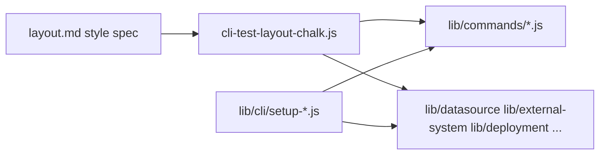

# CLI output: style guide + shared components + command checklist

## Current state (evidence)

- Commander wiring lives in [`lib/cli/index.js`](aifabrix-builder/lib/cli/index.js) (aggregates `setup-*` modules); **not** all logic is under `lib/commands/`—many handlers are in `lib/` (e.g. [`lib/datasource/deploy.js`](aifabrix-builder/lib/datasource/deploy.js), [`lib/deployment/environment.js`](aifabrix-builder/lib/deployment/environment.js)).
- Semantic chalk helpers already exist in [`lib/utils/cli-test-layout-chalk.js`](aifabrix-builder/lib/utils/cli-test-layout-chalk.js) and are referenced from [`lib/commands/datasource.js`](aifabrix-builder/lib/commands/datasource.js), datasource/external deploy/test flows, and display utilities—**but** the filename says “test” while the goal is **global** CLI consistency.
- **Drift vs** [`.cursor/plans/layout.md`](aifabrix-builder/.cursor/plans/layout.md): the guide mandates **✔ / ⚠ / ✖ / ⏭**, while code uses **✓** in dev/secrets paths ([`lib/cli/setup-dev.js`](aifabrix-builder/lib/cli/setup-dev.js), [`lib/cli/setup-dev-path-commands.js`](aifabrix-builder/lib/cli/setup-dev-path-commands.js), [`lib/cli/setup-secrets.js`](aifabrix-builder/lib/cli/setup-secrets.js)) and **✗** for validation errors in [`lib/commands/datasource.js`](aifabrix-builder/lib/commands/datasource.js) (`logDatasourceValidateOutcome`). Red is sometimes used for generic `logger.error` without the **✖** prefix pattern from §18.

---

## Part 1 — Validate and extend the style guide (`layout.md`)

**Goals:** Make the doc the single source of truth for *both* human authors and implementers; close gaps the codebase already exposes.

Suggested additions (concise sections, no duplicate tables):

1. **Canonical glyphs** — Explicit list: success **✔**, warning **⚠**, failure **✖**, skipped **⏭**, in-progress **⏳**; state “do not use ✓ / ✗ / heavy check variants.”
2. **Implementation map** — Table: layout section (e.g. Header, Status, Next actions) → **exported function name** in the shared module (fill after Part 2 names are chosen).
3. **Non-TTY / CI** — When color is disabled (`chalk.level === 0`), glyphs stay; colors are no-ops (chalk already handles this)—one paragraph so contributors do not invent parallel formats.
4. **Errors vs warnings** — Restate §354–368 as a **pattern**: blocking errors = red **✖** + message; non-blocking = yellow **⚠** (never red for warnings).
5. **Optional: “Plan vs runtime”** — Note that decorative emoji in the *plan doc* headings are fine; **CLI output** follows the semantic table only (avoids confusion with project rules on CLI icons).

---

## Part 2 — Generic CLI output components (code)

**Primary file:** extend [`lib/utils/cli-test-layout-chalk.js`](aifabrix-builder/lib/utils/cli-test-layout-chalk.js) **or** add a neutral name (e.g. `lib/utils/cli-layout-chalk.js`) that re-exports the same API and migrate imports—pick one to avoid two competing style layers.

Add small, composable builders aligned to `layout.md` blocks not yet centralized:

| Layout section | Suggested helper(s) |
|----------------|---------------------|
| §7 Failures / hints | `formatIssue(title, hint?)` — red ✖ + red title; gray “Hint:” + yellow hint |
| §19 Next actions | `formatNextActions(lines[])` — bold “Next actions:”, cyan `-` bullets, white text |
| §14 Docs / links | `formatDocsLine(label, url)` — gray label, cyan URL |
| §15 Progress | `formatProgress(message)` — yellow ⏳ + white text |
| §3 Data quality / §9 Impact / §10 Certification | thin wrappers around existing `sectionTitle` + `colorRollupPrefixedLine` or new `formatBulletSection(title, items, bulletColorFn)` |

**Refactors inside the module:**

- **`successGlyph()`** (or constant) returning **✔** in green—replace ad-hoc `chalk.green('✔')` / `✓` at call sites over time.
- Consider **`formatBlockingError(message)`** for uniform `✖` + red message to converge `logger.error(chalk.red(...))` patterns.

**Tests:** extend or add [`tests/lib/utils/...`](aifabrix-builder/tests/lib/utils) (mirror path) with snapshot-free assertions: given `chalk.level`, strings contain expected glyphs and chalk escape sequences where useful—or test unstyled fragments if you inject chalk instance (keep tests simple).

---

## Part 3 — Adoption across commands (phased; separate execution wave)

**Scope note:** “Read all commands” means the **full Commander tree** from [`lib/cli/`](aifabrix-builder/lib/cli/) **plus** `lib/commands/*` **plus** implementation modules they call. A one-shot rewrite of every `console.log`/`logger.log` is high risk; treat Part 3 as a **second story** driven by the checklist in Part 4.

**Phase 3a (high drift, already layout-adjacent):** [`lib/commands/datasource.js`](aifabrix-builder/lib/commands/datasource.js) (fix ✗→✖), [`lib/cli/setup-dev.js`](aifabrix-builder/lib/cli/setup-dev.js) + [`setup-dev-path-commands.js`](aifabrix-builder/lib/cli/setup-dev-path-commands.js) + [`setup-secrets.js`](aifabrix-builder/lib/cli/setup-secrets.js) (✓→✔), any other files grepped for `✓`/`✗`.

**Phase 3b:** Commands that already use partial helpers—align footers, lists, and URLs to new helpers ([`lib/datasource/deploy.js`](aifabrix-builder/lib/datasource/deploy.js), [`lib/utils/datasource-test-run-display.js`](aifabrix-builder/lib/utils/datasource-test-run-display.js), [`lib/utils/external-system-display.js`](aifabrix-builder/lib/utils/external-system-display.js), etc.).

**Phase 3c:** Remaining CLI surfaces—infra (`setup-infra.js`), app lifecycle (`setup-app.js`, `setup-app.test-commands.js`), utility (`setup-utility.js`), auth, wizard, credential/deployment, service-user, parameters—replace ad-hoc chalk with helpers where user-visible summaries exist; leave **machine-only stdout** (e.g. `dev print-home`) unchanged.

**Central error path:** optionally teach [`handleCommandError`](aifabrix-builder/lib/utils/cli-utils.js) / `logger.error` wrappers to use `formatBlockingError` so subcommands get consistent ✖ lines without editing every `.action` catch block (only if it does not break JSON/script consumers).

---

## Part 4 — Command list + one-line “output change” (separate pass; short rows)

Produce a **checklist artifact** (recommended: [`temp/cli-output-command-matrix.md`](aifabrix-builder/temp/cli-output-command-matrix.md) until stable, then optionally move to `.cursor/plans/` if you want it tracked—align with your team’s doc policy).

**Row format (strictly short):**  
`aifabrix <command-path> | <one-line intent: e.g. “header+status+next-actions”, “stdout-only leave”, “JSON mode skip”>`

**Inventory source of truth:** grep `program.command(` / nested `.command(` across [`lib/cli/*.js`](aifabrix-builder/lib/cli/) and [`lib/commands/datasource.js`](aifabrix-builder/lib/commands/datasource.js) / [`lib/commands/app.js`](aifabrix-builder/lib/commands/app.js); include **top-level** and **nested** (e.g. `auth status`, `datasource validate`, `dev set-home`, `credential push`, `secret remove-all`, `env deploy`, `service-user rotate-secret`, …).

**Do not** write long prose per command—only enough to assign a layout “profile” (summary vs raw vs JSON).

---

## Suggested order of work

1. Update `layout.md` (Part 1).
2. Implement/extend shared helpers + tests (Part 2).
3. Land **3a** quick wins (glyph + error consistency) in one PR if small.
4. Run Part 4 checklist generation **in parallel or immediately after**, then execute **3b–3c** as follow-up PRs using the matrix as theDefinition of Done per row.

## Artifacts in `.cursor/plans/`

- [cli-output-command-matrix.md](./cli-output-command-matrix.md) — command → output profile (adoption checklist).
- [cli-layout-implementation-notes.md](./cli-layout-implementation-notes.md) — code paths and Phase 3a scope.

## Implementation Validation Report

**Date**: Thursday, April 16, 2026  
**Plan**: `.cursor/plans/129-cli_layout_adoption.plan.md`  
**Status**: COMPLETE

### Executive Summary

All YAML-tracked todos are `status: completed`. Core deliverables exist under `lib/utils/cli-test-layout-chalk.js`, `lib/utils/cli-layout-chalk.js`, extended `.cursor/plans/layout.md` (contributor appendix), companion plan docs, and `tests/lib/utils/cli-test-layout-chalk.test.js`. Builder quality gate **lint:fix → lint → test** completed with exit code 0. No legacy ✓/✗ glyphs remain in `lib/**/*.js`. Optional follow-up (`handleCommandError` + `formatBlockingError`) was explicitly out of scope for “done” and remains documented in `cli-layout-implementation-notes.md`.

### Task completion (frontmatter todos)

| id | status |
| --- | --- |
| layout-md | completed |
| chalk-helpers | completed |
| glyph-drift-3a | completed |
| command-matrix | completed |
| adoption-3bc | completed |

**Completion**: 5/5 (100%).  
**Note**: Plan body “Current state” / Phase 3 bullets describe pre-change drift; implementation is ahead of that narrative (refresh optional for doc accuracy only).

### File existence validation

| Artifact | Result |
| --- | --- |
| `.cursor/plans/layout.md` (appendix + implementation map) | Present |
| `lib/utils/cli-test-layout-chalk.js` (helpers + exports) | Present |
| `lib/utils/cli-layout-chalk.js` (re-export) | Present |
| `.cursor/plans/cli-output-command-matrix.md` | Present (plan originally suggested `temp/`; matrix lives under `.cursor/plans/` per team choice) |
| `.cursor/plans/cli-layout-implementation-notes.md` | Present |
| Referenced code paths (`lib/cli/index.js`, `lib/commands/datasource.js`, `lib/datasource/deploy.js`, etc.) | Present |

### Implementation spot-check (`cli-test-layout-chalk.js`)

Exported helpers include: `successGlyph`, `failureGlyph`, `formatSuccessLine`, `formatSuccessParagraph`, `formatBlockingError`, `formatIssue`, `formatNextActions`, `formatDocsLine`, `formatProgress`, `formatBulletSection`, plus prior `sectionTitle`, `headerKeyValue`, `formatStatusKeyValue`, `formatDatasourceListRow`, `integrationFooterLine`, `colorRollupPrefixedLine`, `metadata`, `infoLine`, etc.

### Test coverage

| Check | Result |
| --- | --- |
| Unit tests for layout helpers | `tests/lib/utils/cli-test-layout-chalk.test.js` — present |
| Related regression (PIN / `restoreAllMocks`) | `tests/lib/utils/ensure-dev-certs-for-remote-docker.test.js` — adjusted in same initiative |
| `tests/` mirrors `lib/` for new utils | Yes (`tests/lib/utils/` ↔ `lib/utils/`) |

### Code quality validation (aifabrix-builder)

| Step | Result |
| --- | --- |
| STEP 1 — `npm run lint:fix` | PASSED (exit 0) |
| STEP 2 — `npm run lint` | PASSED (0 errors reported) |
| STEP 3 — `npm test` | PASSED — test-wrapper exit 0, “ALL TESTS PASSED” (full Jest run: 298 suites, 5981 passed of 6009 total in validation run) |

### Cursor rules / project compliance (spot)

- **Builder** (`.cursor/rules/project-rules.mdc`): CommonJS, `logger` usage preserved where applicable; no new secrets; ESLint clean.
- **Glyph policy**: `lib/**/*.js` grep for `✓` / `✗` — no matches (aligned with `layout.md` appendix).
- **Optional not done**: Central `handleCommandError` → `formatBlockingError` — intentionally deferred (see implementation notes).

### Issues and recommendations

1. **Plan markdown vs reality**: Update “Current state” and Phase 3 narrative in this file to past tense so readers are not confused by obsolete ✓/✗ references.  
2. **Matrix location**: Plan Part 4 mentioned `temp/cli-output-command-matrix.md`; actual artifact is `.cursor/plans/cli-output-command-matrix.md` — acceptable; update plan text if strict alignment matters.  
3. **Future**: If you want one-shot error styling in every Commander `.action`, implement optional `handleCommandError` integration with JSON/script safety review first.

### Final validation checklist

- [x] All tracked todos completed  
- [x] Core files and plan artifacts exist  
- [x] Unit tests exist for new/changed layout helpers  
- [x] `npm run lint:fix` → `npm run lint` → `npm test` pass  
- [x] No ✓/✗ drift in `lib/` JS sources  
- [x] Optional `handleCommandError` unification explicitly left as follow-up (documented)
