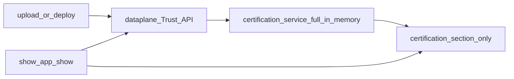

# Builder CLI certification (v1 plan — certification section only)

## Product intent (this revision)

1. **Persist only inside `certification`** on the existing external system file (`integration/<systemKey>/<systemKey>-system.json` or `.yaml`). **No** separate certificate-sync file on disk and **no** “full certification manifest” or whole-system certificate tree in v1.
2. **In memory**, the certification **service** still consumes the **full** dataplane artifact / OpenAPI-aligned shapes (fetch, verify, map). Only the **written** subset is minimal—what matters for developers and for `show` (e.g. identifiers, level, timestamps, validity (we validate via public key that certificate is valid), optional hash fingerprints—not private keys, not full signature payloads).
3. **Patch scope**: read/parse the system file, update **only the `certification` object** (merge strategy documented below), write back. Avoid unrelated churn in the rest of the file where the codebase supports it.

## Schema note (required for this approach)

Today `[external-system.schema.json](file:///workspace/aifabrix-builder/lib/schema/external-system.schema.json)` defines `certification` with **all** of `enabled`, `publicKey`, `algorithm`, `issuer`, `version` **required** and `additionalProperties: false`. Dataplane “active certificate” data **does not** supply the verify-publish bundle by itself, so v1 **must** extend the schema **only under `certification`**, for example:

- Add an **optional** nested object (name TBD, e.g. `cliSnapshot` or `reportedIntegration`) holding minimal non-secret fields: `lastSyncedAt`, optional `byDatasource` map (`certificateId`, `certificationLevel`, `issuedAt`, `systemVersion`, `integrationHash` / `contractHash` as product selects).
- Adjust `**required`** on `certification` so integrators are not forced to fill verify-publish fields when they only use the CLI-maintained snapshot (e.g. make verify-publish fields optional, or require only one of “verify bundle” vs “snapshot”—exact rule in schema PR).

This is a **narrow** schema change: **only** the `certification` branch, not the rest of the external-system file.

## Layering

| Layer                                                                                                 | Responsibility                                                                                                                   |
| ----------------------------------------------------------------------------------------------------- | -------------------------------------------------------------------------------------------------------------------------------- |
| `[lib/api/certificates.api.js](file:///workspace/aifabrix-builder/lib/api/certificates.api.js)` (new) | HTTP; returns **full** parsed bodies per OpenAPI camelCase.                                                                      |
| `lib/certification/` service                                                                          | `fetchActive…`, `verify…`, `**toMinimalCertificationSnapshot(full)`** — **no** v1 builder for a full multi-file manifest system. |
| Patch writer                                                                                          | Loads `*-system.json                                                                                                             |

## When to refresh the certification section

- After successful `**aifabrix upload*`* and `**aifabrix deploy`** (external), unless `--no-cert-sync`.
- After `**datasource test` / `test-integration` / `test-e2e`** when the unified envelope carries certificate-related data—map **minimal** fields into `certification.<snapshot>`.
- `**aifabrix validate`**: optional flag to call dataplane and refresh snapshot (no silent network by default).

## `aifabrix show` / `aifabrix app show`

- Read **certification** (including new optional snapshot) from local system file for offline; combine with online active + `**POST …/certificates/verify`** when authenticated, for validity lines. Show via indicator that the certificate is valid (the file has not been modified and the certificate matches the manifest).
- TTY: follow `[cli-layout.mdc](file:///workspace/aifabrix-builder/.cursor/rules/cli-layout.mdc)` / `[layout.md](file:///workspace/aifabrix-builder/.cursor/rules/layout.md)`; `--json`: stable shape without decorative layout (`[cli-output-command-matrix.md](file:///workspace/aifabrix-builder/.cursor/rules/cli-output-command-matrix.md)` for `app show`).

## Documentation

- `**[routes.md](file:///workspace/aifabrix-builder/.cursor/plans/routes.md)`**: Trust routes and Builder-facing symbol names.
- `**docs/`**: Command-centric—CLI refreshes **the certification section** of the system file with a short summary of trust state; **no** raw HTTP in user docs (`[docs-rules.mdc](file:///workspace/aifabrix-builder/.cursor/rules/docs-rules.mdc)`).

## Implementation order

1. Schema: optional minimal snapshot under `certification` + `required` adjustment.
2. API types + `certificates.api.js`.
3. Certification service (full in, minimal out) + **certification-only** file patcher.
4. Wire upload, deploy, tests, optional validate.
5. Show / JSON / tests.
6. routes.md, docs, `npm run build` / lint / tests.

## Risks / notes

- **Auth / scopes**: missing scope → warn; do not fail upload/deploy for snapshot refresh alone.
- **YAML vs JSON**: same patch path for both extensions.
- **Tier display**: normalize `certificationLevel` casing in one helper for TTY and JSON.

## Implementation Validation Report

**Date**: 2026-04-22  
**Plan**: `.cursor/plans/130-builder_cli_certification.plan.md`  
**Status**: ⚠️ INCOMPLETE (partial delivery; several plan items intentionally superseded or not started)

### Executive Summary

Implementation on disk covers **dataplane → system file `certification` sync** after external **upload** and **deploy**, using the **unchanged** `external-system.schema.json` `certification` object (five required fields), plus **API client**, **merge helpers**, and **unit tests**. The plan’s original **schema extension** (`cliSnapshot`), **show / verify UX**, **validate / unified-test wiring**, and **routes/docs** work are **not** implemented as written. Code quality for the builder repo **passed** format (lint:fix), lint, and full `npm test` on this validation run.

### Task completion (YAML todos vs reality)

| Todo id | Plan intent | Status |
| -------- | ------------ | ------ |
| `schema-certification-minimal` | Extend schema with `cliSnapshot` / relax `required` | **Not done** — superseded by policy: **do not change** `lib/schema/external-system.schema.json`; sync maps active certificate into existing five-field `certification`. |
| `cert-service-types` | Types + mapper to snapshot shape | **Partial** — `lib/api/types/certificates.types.js` + `merge-certification-from-artifact.js` map artifact → **schema-shaped** `certification`, not a separate snapshot object. |
| `api-certificates` | `certificates.api.js` getActive, list, verify | **Done** — `lib/api/certificates.api.js` (issue endpoint not required by plan text). |
| `patch-certification-only` | Patch only `certification` on `*-system` | **Done** — `lib/certification/sync-system-certification.js` replaces only `certification` via spread. |
| `wire-upload-deploy` | After upload / external deploy unless `--no-cert-sync` | **Done** — `lib/commands/upload.js`, `lib/external-system/deploy.js`; CLI `setup-external-system.js` (upload), `setup-app.js` (deploy). |
| `wire-tests-validate` | Unified tests + optional validate refresh | **Not done** — no hooks in `datasource-unified-test-cli` / `validate` for certification sync. |
| `show-display` | show + JSON + online verify | **Not done** — no changes in `lib/app/show.js` / `show-display.js`. |
| `routes-docs` | routes.md + docs | **Not done** — no `routes.md`; no dedicated command-centric docs for this feature under `docs/`. |

**YAML `status: pending` on all todos** — the frontmatter was never updated; treat the table above as the evidence-based status.

### File existence (implemented subset)

| Path | Exists | Notes |
|------|--------|--------|
| `lib/api/certificates.api.js` | ✅ | Active, list, verify |
| `lib/api/types/certificates.types.js` | ✅ | JSDoc typedefs |
| `lib/certification/merge-certification-from-artifact.js` | ✅ | Schema-safe merge |
| `lib/certification/sync-system-certification.js` | ✅ | I/O + orchestration |
| `lib/commands/upload.js` (wiring) | ✅ | Calls `maybeSyncSystemCertificationFromDataplane` |
| `lib/external-system/deploy.js` (wiring) | ✅ | After successful deploy + dataplane context |
| `lib/cli/setup-external-system.js` | ✅ | `--no-cert-sync` on upload |
| `lib/cli/setup-app.js` | ✅ | `--no-cert-sync` on deploy |
| `tests/lib/certification/merge-certification-from-artifact.test.js` | ✅ | |
| `tests/lib/certification/sync-system-certification.test.js` | ✅ | Mocked I/O + API |

### Test coverage

- **Unit tests**: ✅ Present under `tests/lib/certification/`, mirroring `lib/certification/`.
- **Integration / E2E** for certification sync: ❌ Not required by current code; none added.
- **Upload / deploy CLI wiring**: ❌ No dedicated tests (acceptable gap unless you want command-level tests).

### Code quality validation (mandatory order)

| Step | Command | Result |
|------|---------|--------|
| 1 Format | `npm run lint:fix` | ✅ Exit 0 |
| 2 Lint | `npm run lint` | ✅ Exit 0 (0 errors, 0 warnings) |
| 3 Test | `npm test` | ✅ Exit 0 — all test suites passed |

### Cursor rules compliance (spot check)

- **Logging**: Sync uses `logger` / `chalk` like surrounding CLI code; no raw `console.log` in new certification modules.
- **Module style**: CommonJS, `path.join` via `resolvePrimarySystemFilePath` pattern consistent with repo.
- **Security**: No secrets written; only public certification fields from artifact + file merge.
- **Schema**: `external-system.schema.json` **unchanged** (per repo constraint); written object must remain valid (merge enforces `publicKey` + `version`).

### Implementation completeness vs plan narrative

- **Done in spirit**: “certification section only” on system file, no sidecar file, Trust API usage, upload/deploy refresh, `--no-cert-sync`.
- **Not done vs plan**: `cliSnapshot`, show/verify UX, validate / test hooks, routes.md, user docs, optional `certificates/issue` usage, tier-normalization helper for TTY/JSON (only merge-level strings from artifact).

### Issues and recommendations

1. **Update plan frontmatter** — Set todo statuses or add an “As implemented” note so future readers are not misled by all-`pending` YAML.
2. **Complete remaining plan slices** if product still wants them: `show` / `app show` certification + optional verify; `aifabrix validate --cert-sync`; datasource unified test finalize; `docs/` + routes index per CLI layout / docs-rules.
3. **Optional**: Add a thin test that `upload`/`deploy` passes `noCertSync` through to `maybeSync` (mock sync module).

### Final validation checklist

- [ ] All plan tasks completed (see table — **no**)
- [x] Implemented files exist and are wired for upload/deploy sync
- [x] Unit tests exist for certification merge + sync module
- [x] `lint:fix` → `lint` → `npm test` all pass
- [x] No forbidden schema edit in `external-system.schema.json`
- [ ] Documentation / routes / show parity with plan (not done)

