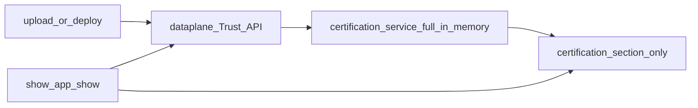

# Builder CLI certification (v1 plan — certification section only)

## Product intent (this revision)

1. **Persist only inside `certification`** on the existing external system file (`integration/<systemKey>/<systemKey>-system.json` or `.yaml`). **No** separate certificate-sync file on disk and **no** “full certification manifest” or whole-system certificate tree in v1.
2. **In memory**, the certification **service** still consumes the **full** dataplane artifact / OpenAPI-aligned shapes (fetch, verify, map). Only the **written** subset is minimal—what matters for developers and for `show` (e.g. identifiers, level, timestamps, validity (we validate via public key that certificate is valid), optional hash fingerprints—not private keys, not full signature payloads).
3. **Patch scope**: read/parse the system file, update **only the `certification` object** (merge strategy documented below), write back. Avoid unrelated churn in the rest of the file where the codebase supports it.

## Schema note (required for this approach)

Today `[external-system.schema.json](file:///workspace/aifabrix-builder/lib/schema/external-system.schema.json)` defines `certification` with **all** of `enabled`, `publicKey`, `algorithm`, `issuer`, `version` **required** and `additionalProperties: false`. Dataplane “active certificate” data **does not** supply the verify-publish bundle by itself, so v1 **must** extend the schema **only under `certification`**, for example:

- Add an **optional** nested object (name TBD, e.g. `cliSnapshot` or `reportedIntegration`) holding minimal non-secret fields: `lastSyncedAt`, optional `byDatasource` map (`certificateId`, `certificationLevel`, `issuedAt`, `systemVersion`, `integrationHash` / `contractHash` as product selects).
- Adjust `**required`** on `certification` so integrators are not forced to fill verify-publish fields when they only use the CLI-maintained snapshot (e.g. make verify-publish fields optional, or require only one of “verify bundle” vs “snapshot”—exact rule in schema PR).

This is a **narrow** schema change: **only** the `certification` branch, not the rest of the external-system file.

## Layering

| Layer                                                                                                 | Responsibility                                                                                                                   |
| ----------------------------------------------------------------------------------------------------- | -------------------------------------------------------------------------------------------------------------------------------- |
| `[lib/api/certificates.api.js](file:///workspace/aifabrix-builder/lib/api/certificates.api.js)` (new) | HTTP; returns **full** parsed bodies per OpenAPI camelCase.                                                                      |
| `lib/certification/` service                                                                          | `fetchActive…`, `verify…`, `**toMinimalCertificationSnapshot(full)`** — **no** v1 builder for a full multi-file manifest system. |
| Patch writer                                                                                          | Loads `*-system.json                                                                                                             |

## When to refresh the certification section

- After successful `**aifabrix upload*`* and `**aifabrix deploy`** (external), unless `--no-cert-sync`.
- After `**datasource test` / `test-integration` / `test-e2e`** when the unified envelope carries certificate-related data—map **minimal** fields into `certification.<snapshot>`.
- `**aifabrix validate`**: optional flag to call dataplane and refresh snapshot (no silent network by default).

## `aifabrix show` / `aifabrix app show`

- Read **certification** (including new optional snapshot) from local system file for offline; combine with online active + `**POST …/certificates/verify`** when authenticated, for validity lines. Show via indicator that the certificate is valid (the file has not been modified and the certificate matches the manifest).
- TTY: follow `[cli-layout.mdc](file:///workspace/aifabrix-builder/.cursor/rules/cli-layout.mdc)` / `[layout.md](file:///workspace/aifabrix-builder/.cursor/rules/layout.md)`; `--json`: stable shape without decorative layout (`[cli-output-command-matrix.md](file:///workspace/aifabrix-builder/.cursor/rules/cli-output-command-matrix.md)` for `app show`).

## Documentation

- `**[routes.md](file:///workspace/aifabrix-builder/.cursor/plans/routes.md)`**: Trust routes and Builder-facing symbol names.
- `**docs/`**: Command-centric—CLI refreshes **the certification section** of the system file with a short summary of trust state; **no** raw HTTP in user docs (`[docs-rules.mdc](file:///workspace/aifabrix-builder/.cursor/rules/docs-rules.mdc)`).

## Implementation order

1. Schema: optional minimal snapshot under `certification` + `required` adjustment.
2. API types + `certificates.api.js`.
3. Certification service (full in, minimal out) + **certification-only** file patcher.
4. Wire upload, deploy, tests, optional validate.
5. Show / JSON / tests.
6. routes.md, docs, `npm run build` / lint / tests.

## Risks / notes

- **Auth / scopes**: missing scope → warn; do not fail upload/deploy for snapshot refresh alone.
- **YAML vs JSON**: same patch path for both extensions.
- **Tier display**: normalize `certificationLevel` casing in one helper for TTY and JSON.

