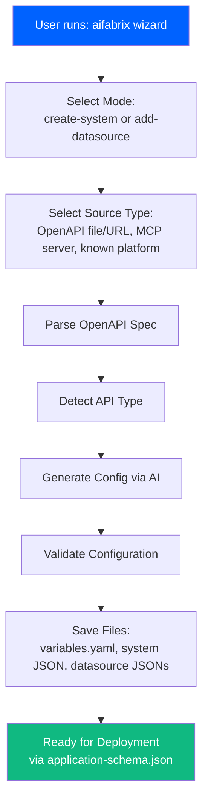

# External System Wizard CLI Integration

## Overview

Add a new `aifabrix wizard` command that provides an interactive guided workflow for creating external systems. **The CLI acts as a thin wrapper around the dataplane wizard API** - all wizard logic (parsing, type detection, AI generation, validation) is handled by the dataplane server. The CLI only:

- Collects user input via prompts
- Calls dataplane wizard API endpoints
- Saves generated configurations to local files

**No logic duplication** - all wizard processing happens on the dataplane server.

## Architecture

The wizard follows this flow:




## Implementation Tasks

### Task 1: Create Wizard API Client Module

**File**: `lib/api/wizard.api.js` (new)Create thin API client functions that call dataplane wizard endpoints. **No business logic** - just HTTP calls:

- `selectMode(dataplaneUrl, authConfig, mode)` - POST `/api/v1/wizard/mode-selection` (dataplane handles mode selection logic)
- `selectSource(dataplaneUrl, authConfig, sourceType, sourceData)` - POST `/api/v1/wizard/source-selection` (dataplane handles source processing)
- `parseOpenApi(dataplaneUrl, authConfig, openApiFile)` - POST `/api/v1/wizard/parse-openapi` (multipart/form-data, dataplane parses OpenAPI)
- `detectType(dataplaneUrl, authConfig, openApiSpec)` - POST `/api/v1/wizard/detect-type` (dataplane detects API type)
- `generateConfig(dataplaneUrl, authConfig, config)` - POST `/api/v1/wizard/generate-config` (dataplane AI generates configs)
- `validateWizardConfig(dataplaneUrl, authConfig, systemConfig, datasourceConfig)` - POST `/api/v1/wizard/validate` (dataplane validates)
- `testMcpConnection(dataplaneUrl, authConfig, serverUrl, token)` - POST `/api/v1/wizard/test-mcp-connection` (dataplane tests MCP)

**File**: `lib/api/types/wizard.types.js` (new)Define JSDoc type definitions for all wizard request/response types (matching dataplane API):

- `WizardModeSelectionRequest`
- `WizardModeSelectionResponse`
- `WizardSourceSelectionRequest`
- `WizardParseOpenApiResponse`
- `WizardDetectTypeRequest`
- `WizardDetectTypeResponse`
- `WizardGenerateConfigRequest`
- `WizardGenerateConfigResponse`
- `WizardValidateRequest`
- `WizardValidateResponse`

### Task 2: Create Wizard Command Handler

**File**: `lib/commands/wizard.js` (new)Implement thin CLI wrapper that orchestrates prompts and API calls. **All processing happens on dataplane**:

- `handleWizard(options)` - Main entry point
- Get dataplane URL from controller (via existing `getDataplaneUrl` utility)
- Get authentication (device token or client credentials)
- Run interactive prompts to collect user input
- Call dataplane wizard APIs (dataplane does all processing)
- Save dataplane-generated configurations to local files

**Wizard Flow Steps (CLI prompts + dataplane API calls):**

1. **Mode Selection** - Prompt user, then call `POST /api/v1/wizard/mode-selection` (dataplane handles logic)
2. **Source Selection** - Prompt for source type, then call `POST /api/v1/wizard/source-selection` (dataplane processes source)
3. **Parse OpenAPI** (if file/URL) - Upload file, call `POST /api/v1/wizard/parse-openapi` (dataplane parses)
4. **Detect Type** (optional) - Call `POST /api/v1/wizard/detect-type`, display dataplane response
5. **User Preferences** - Prompt for user intent/preferences (CLI only - no API call needed yet)
6. **Generate Config** - Call `POST /api/v1/wizard/generate-config` (dataplane AI generates configs)
7. **Review & Validate** - Display dataplane-generated configs, call `POST /api/v1/wizard/validate` (dataplane validates)
8. **Save Files** - Write dataplane-generated configs to local files (CLI file I/O only)

### Task 3: Create Wizard Prompts Module

**File**: `lib/wizard-prompts.js` (new)Interactive prompts for wizard flow:

- `promptForMode()` - Create system vs add datasource
- `promptForSourceType()` - OpenAPI file/URL, MCP, known platform
- `promptForOpenApiFile()` - File path input with validation
- `promptForOpenApiUrl()` - URL input with validation
- `promptForMcpServer()` - MCP server URL and token
- `promptForKnownPlatform()` - List and select from known platforms
- `promptForUserIntent()` - Sales-focused, support-focused, etc.
- `promptForUserPreferences()` - MCP, ABAC, RBAC toggles
- `promptForConfigReview()` - Show generated configs, allow edits
- `promptForAppName()` - Application name for file structure

### Task 4: Create Wizard File Generator

**File**: `lib/wizard-generator.js` (new)Generate files from **dataplane-generated configurations**. **No config generation logic** - just file I/O:

- `generateWizardFiles(appName, systemConfig, datasourceConfigs)` - Main generator
- Receive configs from dataplane wizard API (already generated)
- Create app directory structure
- Write `variables.yaml` with `externalIntegration` block (using dataplane configs)
- Write system JSON file (`<systemKey>-deploy.json`) from dataplane response
- Write datasource JSON files (`<systemKey>-deploy-<datasourceKey>.json`) from dataplane response
- Generate `env.template` with authentication variables (extracted from dataplane configs)
- Generate `README.md` with basic documentation
- Generate `application-schema.json` (via existing `generateExternalSystemApplicationSchema` - uses written files)

**File Structure Created:**

```javascript
integration/<app-name>/
  variables.yaml              # With externalIntegration block
  <systemKey>-deploy.json     # System configuration
  <systemKey>-deploy-*.json   # Datasource configurations
  env.template                # Environment variables
  README.md                   # Documentation
  application-schema.json      # Single deployment file
```


### Task 5: Add Wizard Command to CLI

**File**: `lib/cli.js`Add new command:

```javascript
program.command('wizard')
  .description('Interactive wizard for creating external systems')
  .option('-a, --app <app>', 'Application name (if not provided, will prompt)')
  .option('-c, --controller <url>', 'Controller URL')
  .option('-e, --environment <env>', 'Environment (dev, tst, pro)', 'dev')
  .option('--dataplane <url>', 'Dataplane URL (overrides controller lookup)')
  .action(async (options) => {
    try {
      const { handleWizard } = require('./commands/wizard');
      await handleWizard(options);
    } catch (error) {
      handleCommandError(error, 'wizard');
      process.exit(1);
    }
  });
```


### Task 6: Integrate with Existing External System Flow

**File**: `lib/app.js`Update `createApp` to support wizard mode:

- Add `--wizard` flag to `create` command
- If `--wizard` is set and `--type external`, run wizard instead of standard prompts
- Wizard creates same file structure as manual creation

**File**: `lib/cli.js`Update `create` command:

```javascript
.option('--wizard', 'Use interactive wizard for external system creation')
```


### Task 7: Handle File Uploads

**File**: `lib/utils/file-upload.js` (new, if needed)Utility for handling multipart/form-data file uploads to dataplane:

- `uploadOpenApiFile(dataplaneUrl, authConfig, filePath)` - Read local file, upload to dataplane wizard API
- Handle file reading and multipart form data construction
- **No file parsing** - dataplane parses the OpenAPI file

### Task 8: Add Error Handling and Validation

**Files**: `lib/commands/wizard.js`, `lib/wizard-generator.js`

- Basic file existence checks before upload (CLI only)
- Handle dataplane wizard API errors gracefully (display dataplane error messages)
- **No config validation** - dataplane validates via `/api/v1/wizard/validate` endpoint
- Check for existing app directory conflicts (CLI file system check)
- Provide rollback if file generation fails (CLI file operations only)

### Task 9: Add Progress Indicators

**File**: `lib/commands/wizard.js`Use `ora` spinner for:

- Parsing OpenAPI spec
- Detecting API type
- Generating configuration (AI may take 5-10 seconds)
- Validating configuration
- Saving files

### Task 10: Create Wizard Documentation

**File**: `docs/wizard.md` (new)Create new wizard documentation file (lowercase naming):

- Overview of wizard functionality
- Wizard workflow steps
- Source types (OpenAPI file/URL, MCP server, known platforms)
- API type detection explanation
- Configuration generation process
- Validation process
- Examples and use cases
- Troubleshooting wizard issues
- Reference to dataplane wizard API documentation

**File**: `docs/external-systems.md` (renamed from `EXTERNAL-SYSTEMS.md`)

- Add section referencing wizard: "→ [Wizard Guide](wizard.md) - Interactive wizard for creating external systems"
- Update quick start to mention wizard option
- Keep manual creation instructions

**File**: `docs/cli-reference.md` (renamed from `CLI-REFERENCE.md`)

- Add wizard command documentation:
- Command syntax
- Options
- Examples
- Wizard flow description
- Reference to wizard.md for detailed workflow

### Task 11: Rename Documentation Files to Lowercase

Rename all documentation files from uppercase to lowercase:

- `docs/EXTERNAL-SYSTEMS.md` → `docs/external-systems.md`
- `docs/CLI-REFERENCE.md` → `docs/cli-reference.md`
- `docs/QUICK-START.md` → `docs/quick-start.md`
- `docs/CONFIGURATION.md` → `docs/configuration.md`
- `docs/DEPLOYING.md` → `docs/deploying.md`
- `docs/BUILDING.md` → `docs/building.md`
- `docs/RUNNING.md` → `docs/running.md`
- `docs/INFRASTRUCTURE.md` → `docs/infrastructure.md`
- `docs/GITHUB-WORKFLOWS.md` → `docs/github-workflows.md`
- `docs/DEVELOPER-ISOLATION.md` → `docs/developer-isolation.md`

**File**: Update all internal documentation links

- Update all markdown links in documentation files to use lowercase names
- Update links in README.md
- Update links in CHANGELOG.md
- Update links in integration examples

## Key Design Decisions

1. **No Logic Duplication**: All wizard logic (parsing, type detection, AI generation, validation) is handled by the dataplane server. The CLI is a thin wrapper that:

- Collects user input via prompts
- Calls dataplane wizard API endpoints
- Saves dataplane-generated configs to files
- **No business logic in CLI** - keep it simple

2. **Dataplane URL Resolution**: Wizard API is on dataplane, not controller:

- Get dataplane URL from controller (via existing `getDataplaneUrl` utility)
- Or allow direct dataplane URL via `--dataplane` flag

3. **Authentication**: Use same auth flow as other commands:

- Device token (from `aifabrix login`)
- Client credentials (from `aifabrix app register`)
- Pass auth config to wizard API calls

4. **File Structure**: Wizard creates same structure as manual creation:

- Uses `integration/` directory (not `builder/`)
- Generates `application-schema.json` for single-file deployment
- Compatible with existing `aifabrix deploy` command

5. **Configuration Source**: All configs come from dataplane:

- Display dataplane-generated configs to user
- Allow manual edits before saving (optional)
- Re-validate via dataplane `/api/v1/wizard/validate` endpoint if edited

6. **Error Handling**: Display dataplane error messages:

- Pass through dataplane API errors to user
- No error interpretation in CLI
- Clear error messages from dataplane

## Testing Considerations

- Mock dataplane wizard API responses in tests (simulate dataplane behavior)
- Test CLI prompts and user input collection
- Test API client functions (HTTP calls to dataplane)
- Test file I/O operations (saving dataplane-generated configs)
- Test error handling for dataplane API failures
- Test integration with existing deploy flow
- **No need to test wizard logic** - that's tested in dataplane

## Dependencies

- No new npm packages required (use existing: `inquirer`, `ora`, `chalk`)
- Dataplane wizard API endpoints must be available
- Existing utilities: `getDataplaneUrl`, `getDeploymentAuth`, file operations

## Summary

**The CLI is a thin wrapper around the dataplane wizard API.** All wizard processing (OpenAPI parsing, type detection, AI generation, validation) happens on the dataplane server. The CLI only:

1. Prompts for user input
2. Calls dataplane wizard endpoints
3. Saves dataplane-generated configurations to files