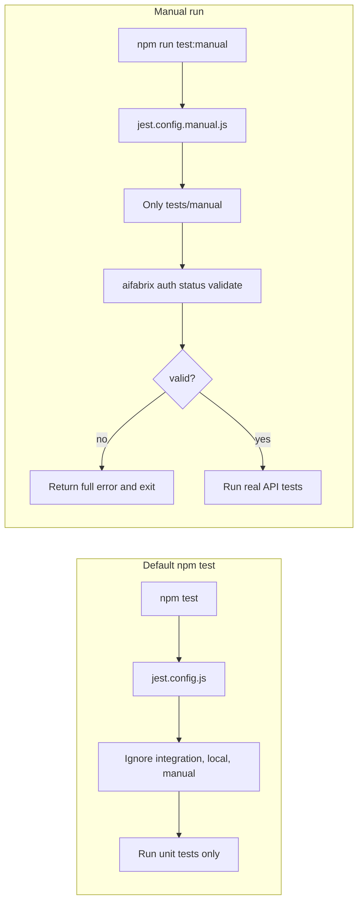

# Add tests/manual for real API calls (manual, login required)

## Goal

- Introduce **tests/manual** as the place for tests that perform **real** API calls to Controller and Dataplane (no mocks).
- These tests are **manual**: they must not run in CI or default `npm test`, and the **user must be logged in** (or have credentials configured) before running them.
- **Validate first**: before running any manual test, run the same check as `aifabrix auth status`; if the user token is not valid, **do not run tests** and **return the full error** (so it makes no sense to run tests when auth is bad).
- Document and enforce that usage is manual and login is required.

## Current test layout (relevant parts)

- **Default run** ([jest.config.js](jest.config.js)): runs `**/tests/**/*.test.js` but **ignores** `tests/integration/` and `tests/local/` (unless `INCLUDE_LOCAL_TESTS=true`).
- **Integration** ([jest.config.integration.js](jest.config.integration.js)): runs only `**/tests/integration/**/*.test.js` via `testMatch`; used with `npm run test:integration`.
- **Auth**: CLI uses `aifabrix login` (device token in config) or client credentials in `~/.aifabrix/secrets.local.yaml`; [lib/utils/token-manager.js](lib/utils/token-manager.js) exposes `getDeploymentAuth(controllerUrl, environment, appName)` which tries device token, then client token, then client credentials. Controller/Dataplane URLs come from config or application/deployment config.

## Implementation plan

### 1. Exclude tests/manual from default and CI

- In [jest.config.js](jest.config.js), add **tests/manual** to `testPathIgnorePatterns` (same style as `tests/integration/` and `tests/local/`), so `npm test` and CI never run them.

### 2. Jest config for manual tests only

- Add **jest.config.manual.js** (similar to [jest.config.integration.js](jest.config.integration.js)):
  - Extend base config from `jest.config.js`.
  - `testMatch`: only `**/tests/manual/**/*.test.js`.
  - Override `testPathIgnorePatterns` so that only `node_modules` is ignored (do not ignore `tests/manual/`).
  - Use a longer `testTimeout` (e.g. 30000–60000 ms) and `maxWorkers: 1` for predictable, sequential real API calls.

### 3. npm script

- In [package.json](package.json), add a script, e.g. `"test:manual": "jest --config jest.config.manual.js --runInBand"`, so users run manual tests explicitly with `npm run test:manual`.

### 4. tests/manual/README.md

- State that:
  - **tests/manual** contains tests that call **real** Controller and Dataplane APIs (no mocks).
  - These tests are **manual** and **must not** be run in CI or as part of default `npm test`.
  - **Prerequisite: user must be logged in** (e.g. run `aifabrix login` and complete device flow) or have valid client credentials in `~/.aifabrix/secrets.local.yaml` (and optionally env vars such as `CLIENTID`/`CLIENTSECRET` where applicable).
  - Document how to run: `npm run test:manual` (and optionally running a single file).
  - Document required environment/configuration: Controller URL and Dataplane URL (from config, or e.g. `CONTROLLER_URL` / `DATAPLANE_URL` if you add support in the helper), and auth as above.
  - Optionally: note that use of this suite is logged/audited by the platform (real API calls).

### 5. Validate token first: run `aifabrix auth status`; on failure, do not run tests and return full error

- **Requirement**: Before any manual test runs, validate that the user token is correct using the same criterion as `aifabrix auth status`. If validation fails, **do not run any tests**; output the **full error** and exit with non-zero.
- **Rationale**: Running real API tests when auth is invalid makes no sense; failing fast with the same message as `aifabrix auth status` keeps behavior consistent and gives the user the full error to fix login/credentials.
- **Implementation** (choose one approach):
  - **Preferred**: Add a `--validate` flag to `aifabrix auth status` in [lib/cli/setup-auth.js](lib/cli/setup-auth.js) and [lib/commands/auth-status.js](lib/commands/auth-status.js). When `--validate` is set: run the same logic as today; if not authenticated (no token or token invalid), **exit with code 1** and print the same status output (so the “full error” is exactly what the user would see when running `aifabrix auth status`). Manual test setup (e.g. [tests/manual/setup.js](tests/manual/setup.js) or a Jest globalSetup) runs `aifabrix auth status --validate` (e.g. via `child_process.spawnSync`); if exit code !== 0, write stdout and stderr to process.stdout/stderr and `process.exit(exitCode)` so no tests run and the full error is returned.
  - **Alternative**: Export from [lib/commands/auth-status.js](lib/commands/auth-status.js) a function (e.g. `validateAuthStatus()`) that performs the same checks as `handleAuthStatus` and returns `{ valid: boolean, errorMessage?: string }` (or throws with full message when invalid). Manual setup calls it; if `!valid`, log `errorMessage` (or caught error message) and `process.exit(1)`. Ensures single source of truth without spawning the CLI.
- **Placement**: Run this validation in Jest `globalSetup` for the manual config (so it runs once before any test file), or in `setupFilesAfterEnv` in [tests/manual/setup.js](tests/manual/setup.js) so it runs before the first test. On failure, exit immediately and do not run any tests.

### 6. Auth/config helper for tests (after validation passes)

- After validation (above) passes, tests still need controller/dataplane URLs and auth config. Add a small helper in **tests/manual/** (e.g. `require-auth.js`) that:
  - Resolves Controller URL (and if needed Dataplane URL) from config (same as auth status) or env (e.g. `CONTROLLER_URL`, `DATAPLANE_URL`).
  - Returns the same token/auth info that `auth status` validated (e.g. by reusing logic from [lib/commands/auth-status.js](lib/commands/auth-status.js) or token-manager) so tests can call real APIs.
- This helper is used by individual test files to build `authConfig` and URLs; the **guard** that prevents running tests when auth is bad is the validation step in section 5.

### 7. Manual test files that call real APIs

- Add at least one manual test file under **tests/manual/** that:
  - Uses the real [lib/api](lib/api) modules (e.g. [auth.api.js](lib/api/auth.api.js), [applications.api.js](lib/api/applications.api.js), or others as needed).
  - Builds `authConfig` from the helper above (or from `getDeploymentAuth` / token-manager) and resolves Controller/Dataplane URLs from env or config.
  - Calls a small set of real endpoints (e.g. auth validate/user, applications list, or similar) to verify connectivity and that “all our APIs” can be called with real calls when logged in.
- Structure can be one file per domain (e.g. `api-auth.test.js`, `api-applications.test.js`) or one file that groups several API calls; prefer clarity and maintainability.

### 8. Docs and .gitignore

- In [tests/README.md](tests/README.md), add a short subsection for **Manual tests**: where they live (`tests/manual/`), that they use real APIs and require login, that they are excluded from CI, and how to run them (`npm run test:manual`).
- Do **not** add `tests/manual` to `.gitignore` (the directory and its tests should be committed); only the pattern of “exclude from default Jest” and “document as manual” is needed.

## Summary of files to add or change

| Item                                                                                                        | Action                                                                                                                             |
| ----------------------------------------------------------------------------------------------------------- | ---------------------------------------------------------------------------------------------------------------------------------- |
| [jest.config.js](jest.config.js)                                                                            | Add `tests/manual/` to `testPathIgnorePatterns`.                                                                                   |
| **jest.config.manual.js**                                                                                   | New file: `testMatch` for `tests/manual/**/*.test.js`, timeout, maxWorkers: 1, globalSetup/setupFilesAfterEnv for auth validation. |
| [package.json](package.json)                                                                                | Add script `test:manual`.                                                                                                          |
| [lib/cli/setup-auth.js](lib/cli/setup-auth.js) / [lib/commands/auth-status.js](lib/commands/auth-status.js) | Add `--validate` to `aifabrix auth status`: exit 1 when not authenticated and print same status (full error).                      |
| **tests/manual/README.md**                                                                                  | New: purpose, prerequisite (run `aifabrix auth status` first), how to run, env/config, that use is manual and not for CI.          |
| **tests/manual/setup.js**                                                                                   | New: run `aifabrix auth status --validate` (or call validateAuthStatus); on failure, output full error and process.exit(1).        |
| **tests/manual/require-auth.js** (or similar)                                                               | New: resolve controller/dataplane URLs and auth for tests (after validation passes).                                               |
| **tests/manual/*.test.js**                                                                                  | New: one or more test files that call real lib/api functions with real auth.                                                       |
| [tests/README.md](tests/README.md)                                                                          | Add subsection for manual tests (location, real APIs, validate with `aifabrix auth status` first, how to run).                     |

## Flow (high level)

## Out of scope

- Changing how `aifabrix login` or token-manager works.
- Adding real API tests for every single endpoint (only enough to establish the pattern and “call all our APIs with real call” for the main flows you care about).
- Running manual tests in CI (they must remain manual and excluded).

