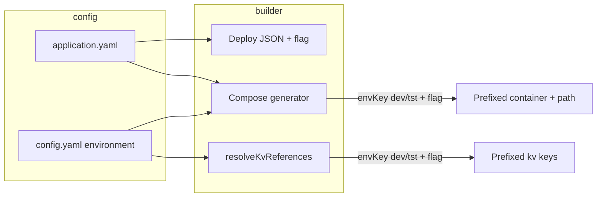

# Environment-Scoped Resources (Application Schema)

## Purpose

Allow applications to opt in to **environment-prefixed resource names** so that dev, tst, and pro can share the same Postgres instance and Docker host without name collisions. When enabled and the target environment is **dev** or **tst**:

- Key Vault (kv://) keys: `<envKey>-<existing-key>` (e.g. `dev-my-keyvault-value-key`)
- Database names: `<envKey>-<existing-app-db>` (e.g. `dev-myapp` for PostgreSQL)
- Docker container name: `<envKey>-<existing-name>` (e.g. `dev-myapp`)
- Traefik path: `<envKey>-<virtual-dir>` (e.g. `/dev/api`)

**miso** and **pro** never use the prefix. The flag is per-application and works for both Azure deployment and local development. **env.template is not modified;** resolution and generation use the flag so the resolved .env and services are correct.

### Prerequisite

Implement this plan **after** [65-remote-docker-validated.plan.md](65-remote-docker-validated.plan.md). Plan 65 provides shared infra, `run --env dev|tst|pro`, and remote Docker; plan 64 adds env-prefixed resource names on top so dev/tst/pro can share the same Postgres and Docker host without collisions.

## Naming the flag

- **Recommended:** `environmentScopedResources` (boolean). Clear meaning: resource names are scoped by environment when true.
- Alternatives considered: `prefixResourceNamesByEnvironment`, `sharedInfrastructureMode`. The first is verbose; the second describes the goal rather than the mechanism.

## User experience: one boolean only

- **Single source of truth:** One boolean in the application schema. When set to `true`, all generated files and services behave correctly; the user does nothing else (no manual key renaming, no extra config).
- **env.template stays identical:** We do **not** change env.template content (e.g. `builder/dataplane/env.template`). The file stays the same; when we **resolve** the .env file, we get correct values from the secret file(s) by using prefixed keys (and Redis index) when the flag is on and env is dev/tst.
- **Secrets when activating:** If the user already has base keys in the secret file (e.g. `databases-myapp-0-urlKeyVault`) and they set the flag to true, when we **resolve** we add the env-prefixed keys with the **same values** (e.g. `dev-databases-myapp-0-urlKeyVault` = value of base key). Secret files are for development and evaluation; Azure creates correct values and auto-generates them—no change needed there.

## Implementation (Builder-only)

### 1. Application schema

- **File:** [lib/schema/application-schema.json](lib/schema/application-schema.json)
- Add optional top-level property:
  - `environmentScopedResources`: boolean, default `false`
  - Description: When true, for environments **dev** and **tst** only, Key Vault keys, database names, container name, and Traefik path are prefixed with the environment key. **miso** and **pro** never use the prefix. Used to run dev/tst/pro against the same Postgres and Docker host.
- Add to schema metadata/changelog (non-breaking).

### 2. Application config and variable flow

- **Files:** [lib/utils/variable-transformer.js](lib/utils/variable-transformer.js), [lib/generator/split-variables.js](lib/generator/split-variables.js), [lib/generator/builders.js](lib/generator/builders.js)
- Ensure the new flag is:
  - Read from application.yaml (e.g. top-level `environmentScopedResources` or under `deployment`)
  - Passed through variable transformation and into deployment manifest
- **Deployment manifest:** Include `environmentScopedResources` in the deploy JSON so the Controller can apply the same logic for Azure (DB names, Key Vault references, etc.). Builder keeps base names in the manifest; prefixing for deploy is a controller concern.

### 3. Key Vault (kv://) resolution

- **File:** [lib/core/secrets.js](lib/core/secrets.js)
- **env.template is unchanged;** resolution produces the correct .env. When generating .env for an app:
  - If app has `environmentScopedResources === true` and the **current environment key** (from config) is **dev** or **tst**, resolve using the **prefixed** kv key (e.g. `databases-myapp-0-urlKeyVault` → look up `dev-databases-myapp-0-urlKeyVault`).
  - **Add prefixed keys with same values:** If the prefixed key is missing in the secrets file, use the **base key’s value** and add the prefixed key with that same value (so existing base keys work; we duplicate to prefixed keys for dev/eval). User does not need to manually duplicate keys.
- **Current environment:** Pass **envKey** (miso | dev | tst | pro) into the resolve flow—from the run command’s `--env` when provided, otherwise from `config.getConfig().environment`. If envKey is missing or not dev/tst, do not prefix.

### 3b. Redis: correct DB index when resolving

- When `environmentScopedResources === true` and envKey is **dev** or **tst**, set the correct **Redis DB index** when resolving (e.g. dev → index 0, tst → index 1, or a defined mapping) so each environment uses a different Redis DB on the same Redis instance. Apply this during resolution so the resolved .env (or Redis URL) contains the right index; env.template stays unchanged.

### 4. Docker Compose (run)

- **File:** [lib/utils/compose-generator.js](lib/utils/compose-generator.js)
- **Container name:** In `buildNetworkAndContainerNames`, when the app has `environmentScopedResources === true` and current envKey (passed in or from config) is **dev** or **tst**, set container name to `<envKey>-<appName>` (or keep devId if we want to avoid clashes between developers: e.g. `aifabrix-dev${devId}-${envKey}-${appName}`). Align with product preference (single dev host vs multi-developer).
- **Traefik path:** In `buildTraefikConfig`, when the app has the flag and envKey is dev or tst, prefix the path: e.g. path = `/${envKey}${derivePathFromPattern(frontDoor.pattern)}` so `/api` becomes `/dev/api`.
- **Router name:** Ensure Traefik router/service names stay unique (e.g. use `dev-myapp` when env-prefixed) so multiple envs do not clash.
- **Call sites:** [lib/app/run-helpers.js](lib/app/run-helpers.js) (e.g. `prepareEnvironment` → `generateComposeFile`) and any caller of `generateDockerCompose` must pass app config (with the flag) and current envKey. Compose generator should receive envKey (and app config) and apply the rules above.

### 5. Run flow: pass envKey and app config

- **Files:** [lib/app/run.js](lib/app/run.js), [lib/app/run-helpers.js](lib/app/run-helpers.js)
- When loading app config for run, include the new flag (already in appConfig if defined in application.yaml).
- **envKey source:** Use the run command's `--env` option when present (per plan 65: `aifabrix run myapp --env dev|tst|pro`); otherwise use `config.getConfig().environment`. Pass this envKey into the compose generator and into secret resolution. If unset, treat as “no prefix” (safe default).

### 6. Database names (builder side)

- **Manifest:** Keep base names in deployment JSON (e.g. `databases: [{ name: "myapp" }]`). Controller/dataplane will use env-prefixed names when deploying to dev/tst and the flag is set.
- **Local:** Connection strings and DB names come from resolved .env (Key Vault keys already env-prefixed in resolution). No separate “create database” step in the builder for app DBs (only miso in [lib/infrastructure/helpers.js](lib/infrastructure/helpers.js)); document that when using env-scoped resources, the actual DB (e.g. `dev_myapp`) must exist or be created by controller/infra/scripts.

### 7. Documentation

- **Application config:** [docs/configuration/application-yaml.md](docs/configuration/application-yaml.md) – document `environmentScopedResources`: one boolean; when true, dev/tst get prefixed resources and correct Redis index; miso/pro unchanged; env.template unchanged; resolve adds prefixed keys with same values when missing.
- **Secrets:** [docs/configuration/secrets-and-config.md](docs/configuration/secrets-and-config.md) – note that for dev/eval, when the flag is on, resolve can add env-prefixed keys with the same values as base keys; Azure creates and auto-generates values.
- **Deployment/running:** Short note that this option allows sharing Postgres/Docker across dev/tst/pro; user only sets the boolean.

### 8. Tests

- **Schema:** Add test that deployment manifest and validation accept `environmentScopedResources` and that it is optional (default false).
- **Variable transformer / split:** Test that the flag is passed through from application config to deployment manifest.
- **Secrets:** Test that when `environmentScopedResources` is true and envKey is dev (or tst), kv resolution uses env-prefixed keys and adds prefixed keys with same values when missing; when envKey is pro/miso or unset, no prefix.
- **Redis:** Test that when flag is true and env is dev/tst, resolved output has correct Redis DB index.
- **Compose:** Test that with the flag and envKey dev, container name and Traefik path are prefixed; with envKey pro or flag false, no prefix.

## Flow summary

## Rules and Standards

This plan must comply with the following from [Project Rules](.cursor/rules/project-rules.mdc):

- **[Validation Patterns](.cursor/rules/project-rules.mdc#validation-patterns)** – Schema in `lib/schema/`, JSON Schema format; validate before deployment; developer-friendly error messages.
- **[Architecture Patterns](.cursor/rules/project-rules.mdc#architecture-patterns)** – Module structure (CommonJS, lib/ layout); schema under `lib/schema/`; generated output in builder/ from generators.
- **[Code Quality Standards](.cursor/rules/project-rules.mdc#code-quality-standards)** – Files ≤500 lines, functions ≤50 lines; JSDoc for all public functions; single responsibility.
- **[Quality Gates](.cursor/rules/project-rules.mdc#quality-gates)** – Build/lint/test pass; coverage ≥80% for new code; no hardcoded secrets; documentation updated.
- **[Testing Conventions](.cursor/rules/project-rules.mdc#testing-conventions)** – Tests in `tests/` mirroring `lib/`; Jest; mock external deps; success and error paths; 80%+ coverage.
- **[Security & Compliance (ISO 27001)](.cursor/rules/project-rules.mdc#security--compliance-iso-27001)** – kv:// and secret resolution in `lib/secrets.js`; never log secrets; no hardcoded secrets; input validation.
- **[Docker & Infrastructure](.cursor/rules/project-rules.mdc#docker--infrastructure)** – Compose generation; env vars for config; validate compose output.
- **[Error Handling & Logging](.cursor/rules/project-rules.mdc#error-handling--logging)** – Structured errors with context; never expose secrets in messages; chalk for CLI output.

**Key requirements:** JSDoc for new/changed functions; try-catch for async; validate app name and envKey; path.join() for paths; tests for schema, variable flow, secrets resolution, Redis index, and compose behavior.

## Before Development

- Read Validation Patterns and Schema Validation from project-rules.mdc (application-schema.json changes).
- Read Secret Management and Data Protection from Security & Compliance (secrets.js resolution, add prefixed keys).
- Review existing compose-generator and buildNetworkAndContainerNames / buildTraefikConfig for run-time env usage.
- Confirm envKey source (config.getConfig().environment) and valid values (miso, dev, tst, pro) in deployment-validation.

## Definition of Done

Before marking this plan complete:

1. **Build:** Run `npm run build` FIRST (must succeed; runs lint + test:ci).
2. **Lint:** Run `npm run lint` (must pass with zero errors and zero warnings).
3. **Test:** Run `npm test` or `npm run test:ci` AFTER lint (all tests pass; ≥80% coverage for new code).
4. **Validation order:** BUILD → LINT → TEST (mandatory sequence; do not skip steps).
5. **File size:** Files ≤500 lines, functions ≤50 lines.
6. **JSDoc:** All new or modified public functions have JSDoc (params, returns, throws).
7. **Code quality:** All rule requirements met; no hardcoded secrets; ISO 27001 considerations for secret handling.
8. **Tasks:** Schema updated; variable flow and deploy JSON include flag; secrets resolution (kv prefix + add keys with same values); Redis DB index on resolve; compose container name and Traefik path prefix; run flow passes envKey and app config; docs updated; tests added and passing.

## Out of scope (for this plan)

- Controller/Dataplane logic to apply env prefix when deploying to Azure (align contract and docs only).
- Automatic creation of env-prefixed databases in local Postgres (document expectation instead).
- Remote Docker, TLS onboarding, and Mutagen sync (see [65-remote-docker-validated.plan.md](65-remote-docker-validated.plan.md); implement that plan first).

---

## Plan Validation Report

**Date:** 2025-02-13  
**Plan:** .cursor/plans/64-environment-scoped_resources_schema.plan.md  
**Status:** VALIDATED

### Plan Purpose

Add an optional application-level boolean `environmentScopedResources` so that for **dev** and **tst** only, resource names (Key Vault keys, database names, Docker container name, Traefik path) are prefixed with the environment key, and Redis uses the correct DB index. Enables dev/tst/pro to share the same Postgres and Docker host. env.template stays unchanged; resolution and generation apply the flag. One boolean; resolve adds prefixed secret keys with same values when missing. Plan type: Development (schema, config flow, secrets, compose, run) + Documentation.

### Applicable Rules

- [Validation Patterns](.cursor/rules/project-rules.mdc#validation-patterns) – Schema and validation changes.
- [Architecture Patterns](.cursor/rules/project-rules.mdc#architecture-patterns) – Module and schema layout.
- [Code Quality Standards](.cursor/rules/project-rules.mdc#code-quality-standards) – File size, JSDoc.
- [Quality Gates](.cursor/rules/project-rules.mdc#quality-gates) – Build, lint, test, coverage, security.
- [Testing Conventions](.cursor/rules/project-rules.mdc#testing-conventions) – Jest, structure, coverage.
- [Security & Compliance (ISO 27001)](.cursor/rules/project-rules.mdc#security--compliance-iso-27001) – Secret management, kv resolution.
- [Docker & Infrastructure](.cursor/rules/project-rules.mdc#docker--infrastructure) – Compose generation.
- [Error Handling & Logging](.cursor/rules/project-rules.mdc#error-handling--logging) – Errors and logging.

### Rule Compliance

- DoD requirements: Documented (build first, lint, test, order, coverage, file size, JSDoc, security).
- Rules and Standards: Added with links to project-rules.mdc.
- Before Development: Checklist added.
- Definition of Done: Expanded with full BUILD → LINT → TEST and task checklist.

### Plan Updates Made

- Added **Rules and Standards** section with applicable rule sections and key requirements.
- Added **Before Development** checklist (schema, secrets, compose, envKey).
- Expanded **Definition of Done** with mandatory build/lint/test order, file size, JSDoc, and task completion items.
- Appended this **Plan Validation Report**.

### Recommendations

- When implementing, ensure `generateEnvFile` / `resolveKvReferences` receive app config (or a way to read `environmentScopedResources`) and envKey so resolution can prefix and add keys without changing env.template.
- Define Redis DB index mapping (e.g. dev → 0, tst → 1) in one place (constant or config) and use it during resolution.
- Add validator test that application.yaml with `environmentScopedResources: true` validates and that the flag is optional.

