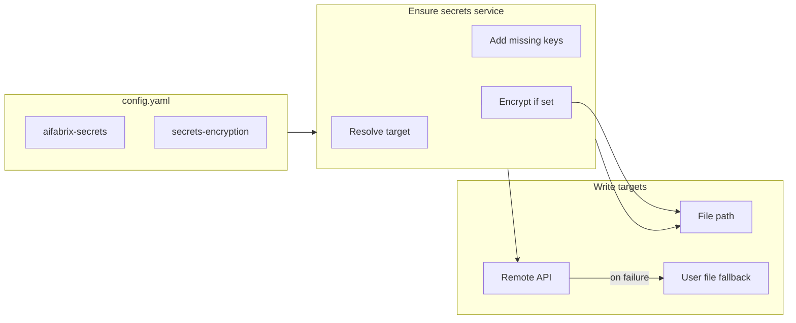

# Secrets auto-provision and zero-touch install

## Current state

- **Secrets source**: `[lib/core/secrets.js](lib/core/secrets.js)` loads secrets via cascade (user `~/.aifabrix/secrets.local.yaml` + config `aifabrix-secrets` path, or remote API when `aifabrix-secrets` is `http(s)://`).
- **Config**: `[lib/core/config.js](lib/core/config.js)` reads `~/.aifabrix/config.yaml`; `getSecretsPath()` returns `aifabrix-secrets` or `secrets-path`; `getSecretsEncryptionKey()` returns `secrets-encryption`.
- **Generation**: `[lib/utils/secrets-generator.js](lib/utils/secrets-generator.js)` has `createDefaultSecrets(secretsPath)` and `generateMissingSecrets(envTemplate, secretsPath)`; both write only to a **file path** (no remote, no encryption of new values).
- **Admin secrets**: `[lib/infrastructure/helpers.js](lib/infrastructure/helpers.js)` `ensureAdminSecrets()` creates `~/.aifabrix/admin-secrets.env` via `secrets.generateAdminSecretsEnv()`; backfills empty fields with `admin123`. Admin file is plaintext.
- **up-infra**: `[lib/cli/setup-infra.js](lib/cli/setup-infra.js)` calls `config.ensureSecretsEncryptionKey()` then `infra.startInfra()`; no `--adminPwd` and no prior “ensure infra secrets in store”.
- **Naming**: `[.cursor/plans/keyvault.md](.cursor/plans/keyvault.md)` documents Key Vault–style names (e.g. `postgres-passwordKeyVault`, `redis-urlKeyVault`, `{app-key}-databases-{index}-passwordKeyVault`).

## Goals

1. **No manual secret setup**: Automatically create missing secret values when installing infra, apps, or integrations.
2. **Storage order**:
  - If `aifabrix-secrets` is a **file path** → create/write missing values in that file (create file if missing).  
  - If `aifabrix-secrets` is **http(s) URL** → try adding to builder server (plain text); on failure, add to user’s local secrets file and **warn**.  
  - If **no** `aifabrix-secrets` → add to local file (`~/.aifabrix/secrets.local.yaml` or `aifabrix-home`).
3. **Encryption**: If `secrets-encryption` is set in config, **encrypt only newly created values** when writing to a file.
4. **admin-secrets.env**: Support encrypting or generating from main secrets; add `aifabrix up-infra --adminPwd` to override default `admin123`.
5. **Validation and docs**: Validate `secrets.local.yaml` (structure + naming); document naming convention and which docs to update.

---

## 1. Central “ensure secrets” service

**Location**: New module e.g. `lib/core/secrets-ensure.js` (or under `lib/utils/`).

**Responsibilities**:

- **Input**: List of secret keys (and optional suggested values), or derive keys from an `env.template` string (reuse `findMissingSecretKeys` from `[lib/utils/secrets-generator.js](lib/utils/secrets-generator.js)`).
- **Resolve write target** from config:
  - Read `aifabrix-secrets` and `secrets-encryption` via existing config helpers.
  - If `aifabrix-secrets` is a **file path** (not `http(s)://`): target = that path (expand `~`); create parent dir and file if missing.
  - If `aifabrix-secrets` is **http(s) URL**: for each key, try remote `addSecret` (reuse `[lib/api/dev.api.js](lib/api/dev.api.js)` `addSecret`); on failure (e.g. 403, 404, network), write to **user secrets file** and log a **warning**.
  - If no `aifabrix-secrets`: target = user secrets file.
- **Only add missing keys**: Load existing secrets from file (or from remote when URL) and skip keys that already have a value.
- **Values**: Use existing `[generateSecretValue](lib/utils/secrets-generator.js)` for infra/app keys; empty string for integration “credentials only” placeholders when requested.
- **Encryption**: When writing to a **file** and `secrets-encryption` is set, encrypt the **new** value (e.g. `secure://...`) using existing `[lib/utils/secrets-encryption.js](lib/utils/secrets-encryption.js)` before writing. Do not encrypt values sent to remote API (API receives plaintext as today).
- **API**: Expose e.g. `ensureSecretsForKeys(keys[], options?)` and `ensureSecretsFromEnvTemplate(envTemplatePathOrContent, options?)`; options may include `emptyValuesForCredentials: true` for integrations.

**Integration points**:

- **File writes**: Reuse and extend `[lib/utils/local-secrets.js](lib/utils/local-secrets.js)` `saveSecret` for arbitrary path; or use `[lib/utils/secrets-generator.js](lib/utils/secrets-generator.js)` `loadExistingSecrets` / `saveSecretsFile` with encryption step for new keys.
- **Remote**: Reuse `devApi.addSecret`; handle “key already exists” if API returns that (treat as success); on any failure, fallback to user file + warning.
- **Encryption**: When saving to file, for each new key run value through `encryptSecret` if `config.getSecretsEncryptionKey()` is set, then write `secure://...` into the file.

---

## 2. Use “ensure secrets” when starting infra

**In** `[lib/infrastructure/helpers.js](lib/infrastructure/helpers.js)` **or** `[lib/infrastructure/index.js](lib/infrastructure/index.js)`:

- Before (or inside) `ensureAdminSecrets()`:
  - Call the new ensure service with the **infra secret keys** (e.g. `postgres-passwordKeyVault`, `redis-passwordKeyVault`, `redis-urlKeyVault`, `keycloak-admin-passwordKeyVault`, `keycloak-auth-server-urlKeyVault` — align with `[createDefaultSecrets](lib/utils/secrets-generator.js)` and keyvault.md).
  - This creates the secrets in the correct store (file path, remote, or local) and encrypts new values if `secrets-encryption` is set.

**In** `[lib/core/secrets.js](lib/core/secrets.js)` `**generateAdminSecretsEnv`**:

- Keep using `loadSecrets(secretsPath)` so it reads from the same cascade (including remote). If infra secrets were just ensured, they will be available.
- When generating `admin-secrets.env`, if `secrets-encryption` is set, either:
  - **Option A**: Keep writing **plaintext** to `admin-secrets.env` (current behavior) so Docker Compose can read it; encryption only in `secrets.local.yaml`.  
  - **Option B**: Store infra passwords only in the main secrets file and generate `admin-secrets.env` from decrypted values at runtime (no change to Compose; decryption when writing the file).
- Recommend **Option A** for minimal change; document that `admin-secrets.env` remains plaintext and should have restricted permissions (600).

**New option** `aifabrix up-infra --adminPwd <password>`:

- In `[lib/cli/setup-infra.js](lib/cli/setup-infra.js)`, add `.option('--adminPwd <password>', 'Override default admin password for new install (Postgres, pgAdmin, Redis Commander)')`.
- Pass this into infra start (e.g. options.adminPwd). In `ensureAdminSecrets()` / `generateAdminSecretsEnv()`:
  - If `adminPwd` is provided and we are creating or backfilling admin secrets, use it instead of `admin123` for `POSTGRES_PASSWORD`, `PGADMIN_DEFAULT_PASSWORD`, `REDIS_COMMANDER_PASSWORD`, and ensure the same value is set for `postgres-passwordKeyVault` in the main secrets store when creating defaults.

---

## 3. Ensure secrets when creating or running an application

- **App create**: After generating files (e.g. in `[lib/app/index.js](lib/app/index.js)` `generateApplicationFiles` or in the create flow after `generateConfigFiles`), load the app’s `env.template`, call the new ensure service with keys derived from that template so app-specific secrets (e.g. `databases-<app>-0-passwordKeyVault`, `redis-`*, etc.) exist.
- **App run / generateEnvFile**: Today `[generateEnvFile](lib/core/secrets.js)` with `force: true` calls `generateMissingSecrets(template, secretsFileForGeneration)` which only writes to a file. Replace or wrap this with the new ensure service so that:
  - Missing keys are ensured in the correct store (file path, remote with fallback, or local).
  - New values are encrypted when writing to file and `secrets-encryption` is set.
- **Places that call generateEnvFile with force**: `[lib/app/run-helpers.js](lib/app/run-helpers.js)` (indirect), `[lib/commands/up-miso.js](lib/commands/up-miso.js)`, `[lib/build/index.js](lib/build/index.js)`, `[lib/cli/setup-utility.js](lib/cli/setup-utility.js)`, `[lib/app/register.js](lib/app/register.js)`, `[lib/app/rotate-secret.js](lib/app/rotate-secret.js)`. Prefer a single path: e.g. `generateEnvFile` (or a shared “prepare env” helper) calls the ensure service when it needs to create missing secrets, instead of calling `generateMissingSecrets` with a file path only.

---

## 4. Ensure secrets for integrations (credentials placeholders)

- When creating or onboarding an **integration** (e.g. wizard or download that creates `integration/<name>/` with `env.template` or credential config):
  - Call the ensure service with the credential keys inferred from the integration (e.g. from env.template or a small schema), with option **emptyValuesForCredentials: true** so placeholders are created with empty string.
  - This avoids “missing secret” errors while still requiring the user to fill real credentials later.

---

## 5. Validation of secrets.local.yaml and naming convention

- **Validation**:
  - Add a small validator (e.g. in `lib/utils/secrets-helpers.js` or a dedicated module) that:
    - Reads the file at a given path (or the resolved “write target” path when it’s a file).
    - Checks it’s valid YAML and a flat key-value object (no nested objects for secret values).
    - Optionally checks key names against the allowed naming convention (e.g. `*KeyVault` suffix, patterns from keyvault.md).
  - Expose via CLI e.g. `aifabrix secrets validate [path]` (optional) and/or run when reading/writing in the ensure service (e.g. after writing, re-read and validate).
- **Naming convention** (document in repo):
  - Add a section to `[docs/configuration/secrets-and-config.md](docs/configuration/secrets-and-config.md)` (or a new `docs/configuration/secrets-naming.md`) that documents the convention: table from `[.cursor/plans/keyvault.md](.cursor/plans/keyvault.md)` (parameter type, field name, key in secrets file, description). State that `secrets.local.yaml` uses the same keys as Key Vault secret names for consistency with production.

---

## 6. Documentation to update

- `**[docs/configuration/secrets-and-config.md](docs/configuration/secrets-and-config.md)`**  
  - Describe automatic creation of missing secrets (on up-infra, app create/run, integration create).  
  - Document storage order: file path → write there; http(s) URL → try remote, then local + warning; no config → local.  
  - Document that when `secrets-encryption` is set, **newly created** values in file-based stores are encrypted.  
  - Add (or link to) naming convention and validation.
- `**[docs/commands/infrastructure.md](docs/commands/infrastructure.md)`**  
  - Document `aifabrix up-infra --adminPwd <password>` for overriding default admin password on new install.
- `**[docs/configuration/README.md](docs/configuration/README.md)`**  
  - Short note that secrets can be auto-created and where to find the full behavior (secrets-and-config.md).
- **Optional new doc** `docs/configuration/secrets-naming.md`: Full table of secret keys (from keyvault.md), validation rules, and that `secrets.local.yaml` should follow this convention.
- **Quick start / README** (e.g. `[docs/README.md](docs/README.md)` or main `[README.md](README.md)`): Mention that first-time `aifabrix up-infra` (and optionally `--adminPwd`) creates required secrets automatically.
- `**admin-secrets.env`**: In secrets-and-config or infrastructure docs, state that `~/.aifabrix/admin-secrets.env` is generated from the main secrets store and is plaintext; restrict permissions (600); when using `aifabrix secure`, only `secrets.local.yaml` (or the configured file) holds encrypted values.

---

## 7. Implementation order (suggested)

1. Add **secrets-ensure** module with storage-order logic, encryption of new file values, and remote try-then-fallback.
2. Wire **up-infra**: ensure infra secrets before `ensureAdminSecrets`; add `--adminPwd` and use it when creating/backfilling admin and `postgres-passwordKeyVault`.
3. Replace/wrap **generateMissingSecrets** usage with the ensure service so app run/create and build flows create secrets in the right place with optional encryption.
4. Add **integration** placeholder secrets (empty values) in the integration create/wizard path.
5. Add **validation** (structure + naming) and **docs** (secrets-and-config, infrastructure, naming, README).

---

## Diagram (high level)

---

## Out of scope (for later)

- Changing how the **remote** API stores secrets (e.g. server-side encryption).
- Migrating existing unencrypted file values to encrypted (only new values encrypted as per goal).
- Backup/restore of secrets (already documented as not supported).

