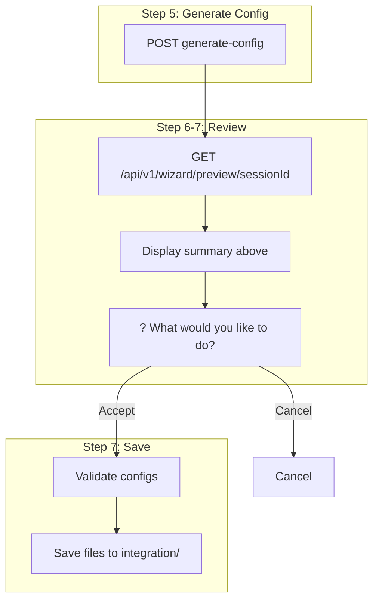

# Wizard Preview Endpoint Integration

## Overview

Replace the full manifest YAML dump at "What would you like to do? Accept and save" with data from `GET /api/v1/wizard/preview/{sessionId}`, showing human-readable summaries. Update and validate [docs/wizard.md](docs/wizard.md) to reflect the new structure and provide a clear step-by-step integration flow.

## Rules and Standards

This plan must comply with the following rules from [Project Rules](.cursor/rules/project-rules.mdc):

- **[API Client Structure Pattern](.cursor/rules/project-rules.mdc#api-client-structure-pattern)** - Uses `lib/api/wizard.api.js` `getPreview`; ensure typed interfaces and error handling.
- **[CLI Command Development](.cursor/rules/project-rules.mdc#cli-command-development)** - Wizard command flow, user experience, chalk output, error handling.
- **[Architecture Patterns](.cursor/rules/project-rules.mdc#architecture-patterns)** - Module structure, lib/commands and lib/generator organization.
- **[Code Quality Standards](.cursor/rules/project-rules.mdc#code-quality-standards)** - File size limits, JSDoc for all public functions.
- **[Quality Gates](.cursor/rules/project-rules.mdc#quality-gates)** - Mandatory checks before commit (build, lint, test).
- **[Testing Conventions](.cursor/rules/project-rules.mdc#testing-conventions)** - Jest patterns, mock getPreview, test success and fallback paths.
- **[Error Handling & Logging](.cursor/rules/project-rules.mdc#error-handling--logging)** - Try-catch for async, chalk for errors, never log tokens/secrets.

**Key Requirements**:

- Use existing `getPreview` from `lib/api/wizard.api.js`; add `@requiresPermission` JSDoc if not already present
- Add JSDoc for all modified public functions (`handleConfigurationReview`, `promptForConfigReview`)
- Use try-catch for `getPreview`; fall back to YAML on failure; never crash the wizard
- Mock `getPreview` in tests; assert preview display path and fallback path
- Keep files ≤500 lines and functions ≤50 lines
- Never log authentication tokens or sensitive data

## Before Development

- Read API Client Structure Pattern and CLI Command Development sections from project-rules.mdc
- Review `lib/api/wizard.api.js` `getPreview` signature and return shape
- Review `lib/commands/wizard.js` `handleConfigurationReview` flow
- Review `lib/generator/wizard-prompts-secondary.js` `promptForConfigReview`
- Understand WizardPreviewResponse shape from dataplane OpenAPI
- Review existing wizard tests for mock patterns

## Definition of Done

Before marking this plan as complete, ensure:

1. **Build**: Run `npm run build` FIRST (must complete successfully; runs lint + test)
2. **Lint**: Run `npm run lint` (must pass with zero errors/warnings)
3. **Test**: Run `npm test` or `npm run test:ci` AFTER lint (all tests must pass, ≥80% coverage for new code)
4. **Validation Order**: BUILD → LINT → TEST (mandatory sequence, never skip steps)
5. **File Size Limits**: Files ≤500 lines, functions ≤50 lines
6. **JSDoc Documentation**: All public functions have JSDoc comments
7. **Code Quality**: All rule requirements met
8. **Security**: No hardcoded secrets, never log tokens or sensitive data
9. **Plan-specific**:
  - `getPreview` called before "Accept and save" prompt
  - Summary displayed (systemSummary, datasourceSummary, cipPipelineSummary, fieldMappingsSummary)
  - Fallback to YAML when preview API fails
  - docs/wizard.md updated with Step 6 behavior and integration flow
  - `/validate-knowledgebase` run; report attached to plan; 0 MarkdownLint errors
10. All tasks completed

## Current Behavior

At Step 6-7 (Review & Validate), the wizard dumps the **entire** generated configuration as YAML before prompting:

```59:67:lib/generator/wizard-prompts-secondary.js
async function promptForConfigReview(systemConfig, datasourceConfigs) {
  console.log('\n📋 Generated Configuration:\nSystem Configuration:');
  console.log(yaml.dump(systemConfig, { lineWidth: -1 }));
  console.log('Datasource Configurations:');
  datasourceConfigs.forEach((ds, index) => {
    console.log(`\nDatasource ${index + 1}:\n${yaml.dump(ds, { lineWidth: -1 })}`);
  });
```

## Desired Behavior

Use `GET /api/v1/wizard/preview/{sessionId}` to fetch summaries and display them in a compact, scannable format. The [WizardPreviewResponse](https://github.com/aifabrix/aifabrix-dataplane/blob/main/openapi/openapi.yaml) includes:

- `systemSummary` – key, displayName, type, baseUrl, authenticationType, endpointCount
- `datasourceSummary` – key, entity, resourceType, cipStepCount, fieldMappingCount, exposedProfileCount
- `cipPipelineSummary` – stepCount, steps, estimatedExecutionTime
- `fieldMappingsSummary` – mappingCount, mappedFields, unmappedFields
- `estimatedRecords`, `estimatedSyncTime` (optional)

---

## Visual: What the Preview Summary Looks Like

When the user reaches "What would you like to do? Accept and save", the CLI will display a compact summary instead of the full YAML manifest:

```
📋 Configuration Preview (what will be created)
────────────────────────────────────────────────────────────────

System
  Key:            hubspot
  Display name:   HubSpot CRM
  Type:           openapi
  Base URL:       https://api.hubapi.com
  Auth:           oauth2
  Endpoints:      12

Datasource
  Key:            hubspot-contacts
  Entity:         Contact
  Resource type:  record-based
  CIP steps:      3
  Field mappings: 15
  Exposed:        2 profiles

CIP Pipeline
  Steps:          3
  Est. execution: ~45s

Field Mappings
  Mapped:   15 (id, email, firstname, lastname, ...)
  Unmapped: 3 (custom_field_x, ...)

Estimates
  Records:  ~10,000
  Sync:     ~2 min

────────────────────────────────────────────────────────────────
? What would you like to do?
  ❯ Accept and save
    Cancel
```

(Mermaid-style flow showing when this appears in the wizard)




---

## Implementation Plan

### 1. Pass `sessionId` and fetch preview in review flow ✅

- [lib/commands/wizard.js](lib/commands/wizard.js): Add `sessionId` to `handleConfigurationReview`; call `getPreview(dataplaneUrl, sessionId, authConfig)` before prompting; pass preview (or fallback) to `promptForConfigReview`.

### 2. Update `promptForConfigReview` to display summaries ✅

- [lib/generator/wizard-prompts-secondary.js](lib/generator/wizard-prompts-secondary.js): Change signature to `promptForConfigReview({ preview, systemConfig, datasourceConfigs })`. When `preview` exists, format and print systemSummary, datasourceSummary, cipPipelineSummary, fieldMappingsSummary (as in the visual above). On failure/fallback, keep YAML dump.

### 3. Fallback and error handling ✅

- If `getPreview` fails: log "Preview unavailable", fall back to YAML display.
- Ensure wizard does not crash; user can always Accept or Cancel.

### 4. Tests ✅

- [tests/lib/api/wizard.api.test.js](tests/lib/api/wizard.api.test.js): Extend `getPreview` mock with full summary shape.
- [tests/lib/commands/wizard.test.js](tests/lib/commands/wizard.test.js): Mock `getPreview`; assert preview path and fallback path.
- [tests/lib/generator/wizard-prompts-secondary.test.js](tests/lib/generator/wizard-prompts-secondary.test.js): Add tests for preview display and fallback (create if missing).

---

## Documentation: Update and Validate wizard.md

### 4.1 Updates to [docs/wizard.md](docs/wizard.md)


| Section                       | Update                                                                                                                                                                                                                                                                  |
| ----------------------------- | ----------------------------------------------------------------------------------------------------------------------------------------------------------------------------------------------------------------------------------------------------------------------- |
| **Step 6: Review & Validate** | Document that the wizard fetches `GET /api/v1/wizard/preview/{sessionId}` and displays a **summary** (system, datasource, CIP pipeline, field mappings, estimates) instead of the full manifest. Add a small example of the summary format (matching the visual above). |
| **Dataplane Wizard API**      | Ensure `GET /api/v1/wizard/preview/{id}` is described as used for the review step to show "what will be created" before save.                                                                                                                                           |
| **Integration flow**          | Add a clear "How to get integration flowing" step-by-step subsection (e.g., 1. Run wizard, 2. Review preview, 3. Accept and save, 4. Deploy/upload).                                                                                                                    |


### 4.2 Step-by-step integration flow (for docs)

Add a concise "Quick Integration Flow" section with numbered steps:

1. Run `aifabrix wizard [appName]` or `aifabrix wizard --config wizard.yaml`
2. Complete Steps 1–5 (mode, source, credential, type, preferences)
3. At Step 6: Review the **preview summary** (fetched from dataplane); choose **Accept and save** or **Cancel**
4. Wizard saves files to `integration/<appKey>/`
5. Deploy: `aifabrix deploy <appKey>` or `node deploy.js` from the integration folder

### 4.3 Validation

After implementation, run:

```text
/validate-knowledgebase .cursor/plans/wizard-preview-endpoint-integration.plan.md
```

Per [.cursor/commands/validate-knowledgebase.md](.cursor/commands/validate-knowledgebase.md), this will:

- Validate all docs mentioned in the plan
- Ensure examples and structure align with `lib/schema` (e.g. wizard-config.schema.json)
- Run MarkdownLint (0 errors)
- Validate cross-references within docs
- Attach results to this plan file

---

## Files to Modify


| File                                                                                                         | Changes                                                                                                        |
| ------------------------------------------------------------------------------------------------------------ | -------------------------------------------------------------------------------------------------------------- |
| [lib/commands/wizard.js](lib/commands/wizard.js)                                                             | Add `sessionId` to `handleConfigurationReview`; call `getPreview`; pass preview/fallback to prompt             |
| [lib/generator/wizard-prompts-secondary.js](lib/generator/wizard-prompts-secondary.js)                       | Accept `{ preview, systemConfig, datasourceConfigs }`; format summaries when preview present; fallback to YAML |
| [docs/wizard.md](docs/wizard.md)                                                                             | Update Step 6 description; add preview summary example; add "Quick Integration Flow"                           |
| [tests/lib/commands/wizard.test.js](tests/lib/commands/wizard.test.js)                                       | Mock `getPreview`; assert preview and fallback paths                                                           |
| [tests/lib/generator/wizard-prompts-secondary.test.js](tests/lib/generator/wizard-prompts-secondary.test.js) | Add preview display and fallback tests (create if missing)                                                     |


---

## Validation Checklist (post-implementation)

- `getPreview` called before "Accept and save" prompt
- Summary displayed (systemSummary, datasourceSummary, cipPipelineSummary, fieldMappingsSummary)
- Fallback to YAML when preview API fails
- docs/wizard.md updated with Step 6 behavior and integration flow
- `/validate-knowledgebase` run; report attached to plan; 0 MarkdownLint errors (run manually)
- `npm run build` completed successfully
- All tests pass; ≥80% coverage for new code

---

## Plan Validation Report

**Date**: 2025-02-26  
**Plan**: .cursor/plans/80-wizard-preview-endpoint-integration.plan.md  
**Status**: ✅ VALIDATED

### Plan Purpose

Integrate `GET /api/v1/wizard/preview/{sessionId}` into the wizard review flow to replace the full YAML manifest dump with human-readable summaries. Update docs/wizard.md and add tests for the preview path and fallback.

**Affected areas**: CLI commands (wizard.js), generator (wizard-prompts-secondary.js), API (wizard.api.js getPreview), documentation (docs/wizard.md), tests.  
**Plan type**: Development (CLI/wizard flow, API integration, documentation).

### Applicable Rules

- ✅ [API Client Structure Pattern](.cursor/rules/project-rules.mdc#api-client-structure-pattern) - Uses getPreview from lib/api/wizard.api.js
- ✅ [CLI Command Development](.cursor/rules/project-rules.mdc#cli-command-development) - Wizard command flow and UX
- ✅ [Architecture Patterns](.cursor/rules/project-rules.mdc#architecture-patterns) - lib/commands, lib/generator structure
- ✅ [Code Quality Standards](.cursor/rules/project-rules.mdc#code-quality-standards) - File size, JSDoc
- ✅ [Quality Gates](.cursor/rules/project-rules.mdc#quality-gates) - Build, lint, test
- ✅ [Testing Conventions](.cursor/rules/project-rules.mdc#testing-conventions) - Jest mocks, preview/fallback tests
- ✅ [Error Handling & Logging](.cursor/rules/project-rules.mdc#error-handling--logging) - Try-catch, chalk, no secrets in logs

### Rule Compliance

- ✅ DoD Requirements: Documented (BUILD → LINT → TEST, npm run build, npm run lint, npm test)
- ✅ Rules and Standards: Added with applicable sections and key requirements
- ✅ Before Development: Added checklist
- ✅ Definition of Done: Added with mandatory sequence and plan-specific items

### Plan Updates Made

- ✅ Added Rules and Standards section with API, CLI, Architecture, Code Quality, Quality Gates, Testing, Error Handling
- ✅ Added Before Development checklist
- ✅ Added Definition of Done with build/lint/test order and plan-specific items
- ✅ Updated Validation Checklist with checkboxes and build/test items
- ✅ Appended Plan Validation Report

### Recommendations

- Ensure `wizard-prompts-secondary.test.js` is created (plan specifies "create if missing"); mirror patterns from wizard.test.js and wizard.api.test.js
- When implementing, add JSDoc for `promptForConfigReview` new signature `{ preview, systemConfig, datasourceConfigs }`
- Verify `/validate-knowledgebase` path: plan references `wizard-preview-endpoint-integration.plan.md`; actual file is `80-wizard-preview-endpoint-integration.plan.md`

