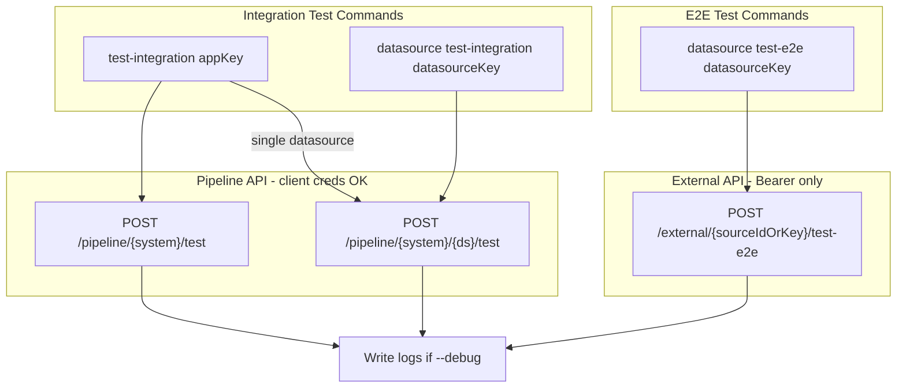

# Integration and E2E Testing Improvements

## Summary

Improve integration testing with clearer CLI commands, better messages, debug logging to `integration/<appKey>/`, and support for client credentials in CI/CD. Add E2E testing for datasources via the dataplane external API.

## Dataplane API Reference

| Endpoint                                                 | Auth                                    | Scope                     |
| -------------------------------------------------------- | --------------------------------------- | ------------------------- |
| `POST /api/v1/pipeline/{systemKey}/test`                 | Bearer, API_KEY, **client credentials** | external-system:publish   |
| `POST /api/v1/pipeline/{systemKey}/{datasourceKey}/test` | Bearer, API_KEY, **client credentials** | external-system:publish   |
| `POST /api/v1/external/{sourceIdOrKey}/test`             | Bearer, API_KEY only                    | external-data-source:read |
| `POST /api/v1/external/{sourceIdOrKey}/test-e2e`         | Bearer, API_KEY only                    | external-data-source:read |

**Note:** Pipeline test endpoints support `x-client-id`/`x-client-secret` for CI/CD. External test endpoints require Bearer/API_KEY (no client credentials).

---

## Rules and Standards

This plan must comply with [Project Rules](.cursor/rules/project-rules.mdc):

- **[CLI Command Development](.cursor/rules/project-rules.mdc#cli-command-development)** - New commands (`test-integration`, `datasource test-integration`, `datasource test-e2e`), input validation, chalk output, error handling.
- **[API Client Structure Pattern](.cursor/rules/project-rules.mdc#api-client-structure-pattern)** - New `lib/api/external-test.api.js`, use ApiClient, add `@requiresPermission` per permissions-guide.md.
- **[Testing Conventions](.cursor/rules/project-rules.mdc#testing-conventions)** - Jest for new modules, mock API client, 80%+ coverage, tests in `tests/` folder.
- **[Security & Compliance (ISO 27001)](.cursor/rules/project-rules.mdc#security--compliance-iso-27001)** - Sanitize secrets in debug logs; never log tokens or credentials.
- **[Code Quality Standards](.cursor/rules/project-rules.mdc#code-quality-standards)** - Files ≤500 lines, functions ≤50 lines, JSDoc for all public functions.
- **[Quality Gates](.cursor/rules/project-rules.mdc#quality-gates)** - Build, lint, test must pass; no hardcoded secrets.

**Key Requirements:**

- Use Commander.js pattern; validate inputs; use chalk for colored output.
- New API module: JSDoc `@typedef` for request/response; `@requiresPermission` for dataplane calls.
- Sanitize request/response before writing to log files (strip tokens, clientSecret, etc.).
- Mock `lib/api` in tests; aim for 80%+ coverage on new code.

---

## Before Development

- Read CLI Command Development and API Client Structure sections from project-rules.mdc
- Review existing `lib/external-system/test.js` and `lib/utils/external-system-test-helpers.js`
- Review [permissions-guide.md](permissions-guide.md) for `@requiresPermission` JSDoc
- Ensure test log writer sanitizes all secrets before writing

---

## Definition of Done

Before marking this plan complete:

1. **Build**: Run `npm run build` FIRST (must complete successfully - runs lint + test:ci)
2. **Lint**: Run `npm run lint` (must pass with zero errors/warnings)
3. **Test**: Run `npm test` or `npm run test:ci` AFTER lint (all tests must pass, ≥80% coverage for new code)
4. **Validation order**: BUILD → LINT → TEST (mandatory sequence, never skip steps)
5. **File size limits**: Files ≤500 lines, functions ≤50 lines
6. **JSDoc**: All public functions have JSDoc comments
7. **Security**: No hardcoded secrets; debug logs sanitize tokens/credentials
8. **API permissions**: New `lib/api` functions document `@requiresPermission`
9. All implementation tasks completed

---

## 1. CLI Command Structure

### 1.1 Top-level `test-integration <appKey>` (existing, enhance)

- **Current:** `aifabrix test-integration <app>` runs builder app tests or external system tests (per-datasource via pipeline).
- **Goal:** Run **all** datasources for one external system in a single API call when targeting external systems.
- **Change:** Prefer `POST /api/v1/pipeline/{systemKey}/test` (system-level) over per-datasource loop when all datasources are tested. Add `--datasource <key>` to restrict to one datasource (then use per-datasource endpoint).

**Files:** [lib/cli/setup-external-system.js](lib/cli/setup-external-system.js), [lib/external-system/test.js](lib/external-system/test.js), [lib/api/pipeline.api.js](lib/api/pipeline.api.js)

### 1.2 New `datasource test-integration <datasourceKey>`

- **Command:** `aifabrix datasource test-integration <datasourceKey> [options]`
- **Behavior:** Run integration (config) test for **one** datasource via dataplane.
- **API:** Use pipeline test (supports client credentials):
  - `POST /api/v1/pipeline/{systemKey}/{datasourceKey}/test`
- **Context:** Resolve `systemKey` from:
  - `--app <appKey>` (explicit)
  - Or cwd: if inside `integration/<appKey>/`, use that `appKey` and system key from application.yaml
  - Or fail with a clear message

**Files:** [lib/commands/datasource.js](lib/commands/datasource.js), new `lib/datasource/test-integration.js`, [lib/api/pipeline.api.js](lib/api/pipeline.api.js)

### 1.3 New `datasource test-e2e <datasourceKey>`

- **Command:** `aifabrix datasource test-e2e <datasourceKey> [options]`
- **Behavior:** Run E2E test for one datasource (config, credential, sync, data, CIP) via dataplane.
- **API:** `POST /api/v1/external/{sourceIdOrKey}/test-e2e`
- **Auth:** Bearer/API_KEY only (no client credentials). Fail with clear message if only client credentials are available.
- **SourceIdOrKey:** Use `datasourceKey` as `sourceIdOrKey` (e.g. `hubspot-test-v4-contacts`, `test-e2e-hubspot-contacts`).

**Files:** [lib/commands/datasource.js](lib/commands/datasource.js), new `lib/datasource/test-e2e.js`, new `lib/api/external-test.api.js` (or extend existing API module)

---

## 2. Auth: Client Credentials for Pipeline Test

The dataplane **pipeline test** endpoints support `x-client-id`/`x-client-secret`. The Builder currently calls `requireBearerForDataplanePipeline(authConfig)` before pipeline test, which rejects client credentials.

- **Change:** Stop calling `requireBearerForDataplanePipeline` in the **test** flow. Allow `token` OR `clientId`+`clientSecret` for pipeline test.
- **Where:** [lib/utils/external-system-test-helpers.js](lib/utils/external-system-test-helpers.js) – remove or conditionally skip `requireBearerForDataplanePipeline` in `callPipelineTestEndpoint`.
- **Note:** Keep `requireBearerForDataplanePipeline` for upload/publish/deploy (unchanged).

---

## 3. Debug Mode and Log Files

### 3.1 Debug mode (`--debug`)

- **Option:** Add `--debug` to `test-integration` and `datasource test-integration` / `datasource test-e2e`.
- **Behavior:** When `--debug` is set:
  - Send `includeDebug: true` in request body.
  - Write full response (including `debug` object) to a log file in `integration/<appKey>/`.

### 3.2 Log file location and format

- **Path:** `integration/<appKey>/test-<timestamp>.log` or `integration/<appKey>/logs/test-integration-<timestamp>.json`
- **Content:** JSON of request + response (sanitize secrets).
- **Implementation:** New helper in `lib/utils/test-log-writer.js` or within existing test modules.

**Files:** [lib/cli/setup-external-system.js](lib/cli/setup-external-system.js), [lib/commands/datasource.js](lib/commands/datasource.js), new `lib/utils/test-log-writer.js`, [lib/external-system/test.js](lib/external-system/test.js)

---

## 4. API Layer

### 4.1 Pipeline API

- Add `testSystemViaPipeline(dataplaneUrl, systemKey, authConfig, testData)` for `POST /api/v1/pipeline/{systemKey}/test`.
- Ensure `testData` supports `payloadTemplate` and `includeDebug`.

**File:** [lib/api/pipeline.api.js](lib/api/pipeline.api.js)

### 4.2 External test API (new)

- Add module for external endpoints:
  - `testDatasourceE2E(dataplaneUrl, sourceIdOrKey, authConfig, body)` → `POST /api/v1/external/{sourceIdOrKey}/test-e2e`
- Optional: `testDatasourceConfig(dataplaneUrl, sourceIdOrKey, authConfig, body)` for `POST /api/v1/external/{sourceIdOrKey}/test` (if needed for datasource-level config test without system context).

**File:** New `lib/api/external-test.api.js`

---

## 5. Improved Messages

- **Success:** Clear summary: "X datasource(s) passed" and list datasource keys.
- **Failure:** Per-datasource errors with `validationResults.errors`, `fieldMappingResults`, etc.
- **E2E:** Per-step status (config, credential, sync, data, cip) from `steps[]` with success/message/error.
- **Auth:** If E2E is run with only client credentials, fail with: "E2E tests require Bearer token or API key. Run 'aifabrix login' or configure API key."

**Files:** [lib/utils/external-system-display.js](lib/utils/external-system-display.js), new display helpers for E2E results.

---

## 6. Response Schema Validation (Optional)

- Use `datasource-test-response.schema.json` and `datasource-e2e-test-response.schema.json` from dataplane for optional validation of responses in tests or debug output.
- Copy or reference schemas in Builder if we add validation; otherwise document for future use.

---

## 7. Mermaid Diagram: Command Flow

---

## 8. Implementation Order

1. **API layer:** Add `testSystemViaPipeline`, `testDatasourceE2E` (and optionally `testDatasourceConfig`).
2. **Auth:** Relax pipeline test auth to allow client credentials in test helpers.
3. **test-integration:** Use system-level pipeline test when testing all datasources; add `--debug` and log writing.
4. **datasource test-integration:** New command + module, resolve systemKey from `--app` or cwd.
5. **datasource test-e2e:** New command + module, require Bearer, call external E2E endpoint.
6. **Display:** Improve messages and add E2E step display.
7. **Tests:** Unit tests for new modules; integration tests where feasible.

---

## 9. Key Files to Touch

| File                                        | Changes                                                               |
| ------------------------------------------- | --------------------------------------------------------------------- |
| `lib/api/pipeline.api.js`                   | Add `testSystemViaPipeline`                                           |
| `lib/api/external-test.api.js`              | New: `testDatasourceE2E`                                              |
| `lib/utils/external-system-test-helpers.js` | Allow client creds for pipeline test; add `includeDebug` support      |
| `lib/external-system/test.js`               | Use system-level test when no `--datasource`; add debug + log writing |
| `lib/cli/setup-external-system.js`          | Add `--debug` to test-integration                                     |
| `lib/commands/datasource.js`                | Add test-integration and test-e2e subcommands                         |
| `lib/datasource/test-integration.js`        | New: datasource integration test logic                                |
| `lib/datasource/test-e2e.js`                | New: datasource E2E test logic                                        |
| `lib/utils/test-log-writer.js`              | New: write debug logs to integration// (sanitize secrets)             |
| `lib/utils/external-system-display.js`      | Improve messages; add E2E display                                     |
| `tests/`                                    | Add tests for new commands and modules                                |

---

## Plan Validation Report

**Date**: 2025-02-26
**Plan**: .cursor/plans/81-integration_and_e2e_testing.plan.md
**Status**: VALIDATED

### Plan Purpose

Add integration and E2E testing commands to the Builder CLI, improve output and debug logging, support client credentials for CI/CD, and add datasource-level test commands. Plan type: Development (CLI commands, API modules) + Testing.

**Affected areas:** CLI commands, API layer, test helpers, display, auth, file utilities.

### Applicable Rules

- **CLI Command Development** - New commands and subcommands; input validation, chalk, error handling
- **API Client Structure Pattern** - New `lib/api/external-test.api.js`; ApiClient; `@requiresPermission`
- **Testing Conventions** - Jest, mock API, 80%+ coverage, tests in `tests/`
- **Security & Compliance (ISO 27001)** - Sanitize secrets in logs; never log tokens
- **Code Quality Standards** - File/function size limits; JSDoc
- **Quality Gates** - Build, lint, test; no hardcoded secrets

### Rule Compliance

- DoD requirements: Documented (build, lint, test, order, file limits, JSDoc, security)
- CLI patterns: Plan follows Commander.js and datasource subcommand structure
- API patterns: Plan specifies new API module and pipeline API extension
- Security: Plan explicitly requires sanitizing secrets in debug logs
- Testing: Plan includes tests in implementation order

### Plan Updates Made

- Added Rules and Standards section with rule references
- Added Before Development checklist
- Added Definition of Done section with full DoD requirements
- Fixed typo in Key Files table (integration// → integration//)
- Added validation report

### Recommendations

- Ensure `test-log-writer.js` explicitly removes `token`, `clientSecret`, `x-client-secret`, and any credentials from logged objects before writing.
- Add `tests/lib/datasource/test-integration.test.js` and `tests/lib/datasource/test-e2e.test.js` plus `tests/lib/api/external-test.api.test.js` to implementation tasks.
- Verify `@requiresPermission` JSDoc on new API functions: `external-data-source:read` for external E2E, `external-system:publish` for pipeline test.

