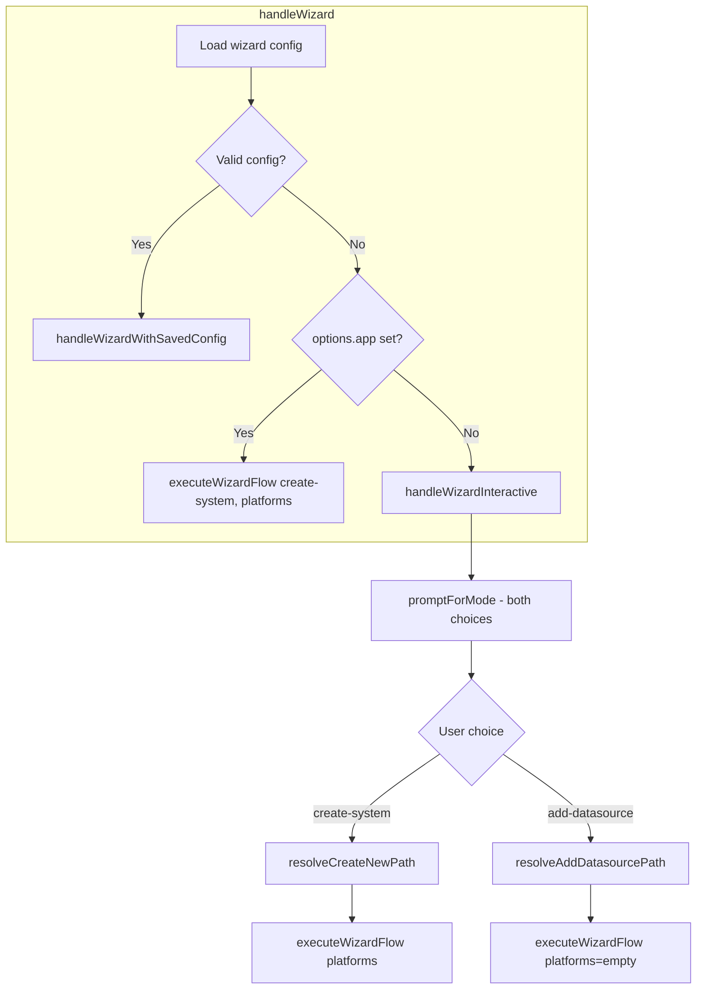

# Wizard UX Improvements Plan

## Context

The wizard currently shows both "Create a new external system" and "Add datasource to existing system" regardless of whether the user provided an appKey. When appKey is given (e.g. `af wizard hubspot-test-v4`), the system already exists on disk, so "Add datasource" is the wrong option—the user should use "Known platform (pre-configured)" instead.

## 1. Mode selection: Hide "Add datasource" when appKey is given

**Current behavior:** `handleWizardInteractive` always calls `promptForMode()` and shows both choices.

**Target behavior:**

- **appKey given** (`af wizard hubspot-test-v4`): Do not show "Add datasource to existing system". Use create-system flow with Known platform available.
- **appKey NOT given** (`af wizard`): Show both options as today.

**Implementation:**

- In [lib/commands/wizard.js](lib/commands/wizard.js):
  - Add a new path when `options.app` is set and `loadedConfig` is null: call a modified flow that skips the mode prompt and uses `mode = 'create-system'` directly.
  - Alternatively: pass `allowAddDatasource: false` into `promptForMode(options.app ? false : true)` and filter choices in the prompt.
- In [lib/generator/wizard-prompts.js](lib/generator/wizard-prompts.js):
  - Update `promptForMode(defaultMode, allowAddDatasource = true)` to conditionally include "Add datasource" in the choices when `allowAddDatasource` is true.

## 2. "Known platform" visibility: Hide in add-datasource mode

**Current behavior:** `executeWizardFlow` always fetches platforms and passes them to `handleInteractiveSourceSelection`, so "Known platform" is always shown.

**Target behavior:**

- **add-datasource mode:** Do not show "Known platform (pre-configured)" — user downloaded a system from dataplane, so we use the system's existing OpenAPI/MCP source.
- **create-system mode:** Show "Known platform" as today.

**Implementation:**

- In [lib/commands/wizard.js](lib/commands/wizard.js) `executeWizardFlow`:
  - When `mode === 'add-datasource'`, pass `platforms = []` to `runWizardStepsAfterSession` (and thus to `handleInteractiveSourceSelection`).
  - When `mode === 'create-system'`, pass the fetched `platforms` as today.

## 3. Known platform + multiple datasources: Summary display

**Current behavior:** `derivePreviewFromConfig` and `formatPreviewSummary` in [lib/generator/wizard-prompts-secondary.js](lib/generator/wizard-prompts-secondary.js) only handle a single datasource (`dsList[0]`).

**Target behavior:**

- Known platform can add more than one datasource. Validate that multiple datasources are supported and display all of them in the review summary.

**Implementation:**

- In [lib/generator/wizard-prompts-secondary.js](lib/generator/wizard-prompts-secondary.js):
  - Update `derivePreviewFromConfig` to produce `datasourceSummaries` (array) when there are multiple datasources, or keep `datasourceSummary` for a single one (backward compatible with preview API).
  - Update `formatPreviewSummary` to support both `datasourceSummary` and `datasourceSummaries`: if `datasourceSummaries` exists, loop and format each; otherwise use `datasourceSummary`.
  - Ensure `promptForConfigReview` uses the extended format when multiple datasources exist.

## 4. List pagination and external system display

**Target behavior:**

- All wizard lists (external systems, credentials): show 10 items per "page", then scroll when there are more than 10.
- External system list: show both **Name** and **appKey** (e.g. `HubSpot CRM (hubspot-test-v4)` or `displayName - key`).

**Implementation:**

- In [lib/generator/wizard-prompts.js](lib/generator/wizard-prompts.js):
  - `promptForExistingSystem`: Add `pageSize: 10` to the list prompt. Change choice `name` from `(s.displayName ?? s.name ?? value)` to a format showing both, e.g. `"${displayName} (${key})"` where `displayName = s.displayName ?? s.name ?? value` and `key = s.key ?? s.id ?? value`.
  - `promptForExistingCredential`: Add `pageSize: 10` to the list prompt.
- In [lib/generator/wizard-prompts-secondary.js](lib/generator/wizard-prompts-secondary.js):
  - `promptForKnownPlatform`: Add `pageSize: 10` to the list prompt.
- Optionally: add `pageSize: 10` to `promptForMode` and `promptForSourceType` for consistency.

## Files to modify

| File                                                                                   | Changes                                                                                                                       |
| -------------------------------------------------------------------------------------- | ----------------------------------------------------------------------------------------------------------------------------- |
| [lib/commands/wizard.js](lib/commands/wizard.js)                                       | Conditional mode flow when appKey given; pass empty platforms in add-datasource mode                                          |
| [lib/generator/wizard-prompts.js](lib/generator/wizard-prompts.js)                     | `promptForMode(allowAddDatasource)`; `promptForExistingSystem` pageSize + Name/appKey; `promptForExistingCredential` pageSize |
| [lib/generator/wizard-prompts-secondary.js](lib/generator/wizard-prompts-secondary.js) | `derivePreviewFromConfig` and `formatPreviewSummary` for multiple datasources; `promptForKnownPlatform` pageSize              |

## Flow diagram (simplified)

After changes:

- When `options.app` set and config invalid: go directly to create-system (no mode prompt), platforms passed.
- When `options.app` not set: show mode prompt; add-datasource path passes `platforms = []`.

