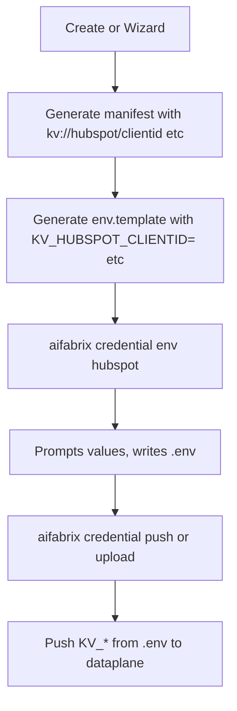

# Integration Credential Env Flow

## Goal

Generate correct secrets structure in the manifest so we have correct env.template, can resolve a correct .env file, and the system can push credential secrets as part of wizard, upload, and deployment. Add `aifabrix credential env <system-key>` and `aifabrix credential push <system-key>`.

## KV_* Convention (from external-integration.md)

Per [Credential secrets push (automatic)](docs/commands/external-integration.md#aifabrix-upload-system-key):

- **Naming:** `KV_<APPKEY>_<VAR>=my value` (e.g. `KV_HUBSPOT_CLIENTID=xxx`, `KV_HUBSPOT_CLIENTSECRET=yyy`)
- **Mapping:** `KV_` + segments (underscores) → `kv://segment1/segment2/...` (lowercase)
- Example: `KV_HUBSPOT_CLIENTID` → `kv://hubspot/clientid`
- Example: `KV_HUBSPOT_CLIENTSECRET` → `kv://hubspot/clientsecret`

The manifest (system config, deploy JSON) must reference `kv://hubspot/clientid` and `kv://hubspot/clientsecret`—not `hubspot-clientidKeyVault`.

## Rules and Standards

This plan must comply with [Project Rules](.cursor/rules/project-rules.mdc):

- **[CLI Command Development](.cursor/rules/project-rules.mdc#cli-command-development)** – New commands `credential env` and `credential push`; input validation, chalk output, error handling
- **[Security & Compliance (ISO 27001)](.cursor/rules/project-rules.mdc#security--compliance-iso-27001)** – Secret management, no logging of values, password prompts for secrets, .env file mode 0o600
- **[Code Quality Standards](.cursor/rules/project-rules.mdc#code-quality-standards)** – Files ≤500 lines, functions ≤50 lines, JSDoc for all public functions
- **[Quality Gates](.cursor/rules/project-rules.mdc#quality-gates)** – Build, lint, test must pass; ≥80% coverage for new code
- **[Testing Conventions](.cursor/rules/project-rules.mdc#testing-conventions)** – Jest, mirror tests in `tests/lib/commands/`, mock inquirer and fs
- **[Generated Output](.cursor/rules/project-rules.mdc#generated-output-integration-and-builder)** – Fix generators (wizard, config) that produce env.template, not only generated files

**Key Requirements:**

- Validate systemKey format (alphanumeric, hyphens, underscores)
- Use try-catch for all async operations; never log secret values
- JSDoc for all public functions; use path.join() for paths
- Write tests for credential-env and credential-push
- credential push must use credential.api or existing pushCredentialSecrets (no new raw API calls)

## Before Development

- [ ] Read Credential secrets push section in [docs/commands/external-integration.md](docs/commands/external-integration.md)
- [ ] Review [lib/utils/credential-secrets-env.js](lib/utils/credential-secrets-env.js) kvEnvKeyToPath and pushCredentialSecrets
- [ ] Review [lib/generator/wizard.js](lib/generator/wizard.js) addAuthenticationLines and generateEnvTemplate
- [ ] Review [lib/app/config.js](lib/app/config.js) generateExternalSystemEnvTemplate

## Definition of Done

1. **Build:** Run `npm run build` FIRST (must complete successfully – runs lint + test:ci)
2. **Lint:** Run `npm run lint` (must pass with zero errors/warnings)
3. **Test:** Run `npm test` or `npm run test:ci` AFTER lint (all tests must pass, ≥80% coverage for new code)
4. **Validation order:** BUILD → LINT → TEST (mandatory sequence)
5. **File size:** Files ≤500 lines, functions ≤50 lines
6. **JSDoc:** All public functions have JSDoc comments
7. **Security:** No hardcoded secrets; use password type for secret prompts; .env mode 0o600
8. All implementation tasks completed
9. Documentation updated

## Flow




## Implementation Plan

### 1. Generate manifest with correct kv:// paths

When creating system config (wizard, create, platform config), use path-style kv refs: `kv://<systemKey>/<var>` (e.g. `kv://hubspot/clientid`, `kv://hubspot/clientsecret`).

- [lib/generator/wizard.js](lib/generator/wizard.js) – derive from systemConfig or use `kv://${systemKey}/clientid` etc.
- [lib/app/config.js](lib/app/config.js) – generateExternalSystemEnvTemplate: use `kv://${systemKey}/clientid` (path-style)
- [lib/external-system/generator.js](lib/external-system/generator.js) – ensure auth security uses `kv://<systemKey>/<key>` format
- Deploy JSON / system configuration `configuration` array: `value` must be the kv path segment that matches KV_* mapping (e.g. `hubspot/clientid` for config that maps to `kv://hubspot/clientid`)

### 2. Generate env.template with KV_* variable names

env.template must use KV_* variable names so .env aligns with credential push.

- OAuth2: `KV_<APPKEY>_CLIENTID=`, `KV_<APPKEY>_CLIENTSECRET=`, `TOKENURL=...` (TOKENURL is literal, no KV_)
- API Key: `KV_<APPKEY>_APIKEY=`
- Basic: `KV_<APPKEY>_USERNAME=`, `KV_<APPKEY>_PASSWORD=`

Example for hubspot (systemKey=hubspot):

```
KV_HUBSPOT_CLIENTID=
KV_HUBSPOT_CLIENTSECRET=
TOKENURL=https://api.hubapi.com/oauth/v1/token
```

- [lib/generator/wizard.js](lib/generator/wizard.js) – addAuthenticationLines: use `KV_${systemKey.toUpperCase().replace(/-/g,'_')}_CLIENTID=` etc.
- [lib/app/config.js](lib/app/config.js) – generateExternalSystemEnvTemplate: use KV_* names

### 3. aifabrix resolve and generateEnvFile

Ensure `aifabrix resolve` works with env.template that has KV_* vars. KV_* vars with empty values stay as empty; user fills via credential env. Non-KV vars (TOKENURL) are literal. No kv:// resolution needed for KV_* vars—they hold plain values.

- [lib/core/secrets.js](lib/core/secrets.js) – generateEnvContent: handle KV_* lines (pass through if no kv:// in value)
- [lib/utils/secrets-helpers.js](lib/utils/secrets-helpers.js) – ensure replaceKvInContent does not break KV_* lines that have no kv://

### 4. aifabrix credential env 

Prompts for credential values based on env.template, writes .env with KV_* vars.

- New [lib/commands/credential-env.js](lib/commands/credential-env.js)
- Parse env.template for `KV_<APPKEY>_<VAR>=` lines; prompt for each (password for secrets)
- Write .env: `KV_HUBSPOT_CLIENTID=value`, `KV_HUBSPOT_CLIENTSECRET=value`, `TOKENURL=...`
- No setSecretInStore—values go directly to .env. Upload/push reads .env.

### 5. aifabrix credential push

Standalone command to push credential secrets from .env to dataplane. Reuses logic from upload's credential push. This works only with external-system.

- New [lib/commands/credential-push.js](lib/commands/credential-push.js) or extend credential-env
- Read integration/.env, collect KV_* vars, build payload, call pushCredentialSecrets
- Requires dataplane URL and auth (same as upload)
- Add `credential push` subcommand in [lib/cli/setup-credential-deployment.js](lib/cli/setup-credential-deployment.js)

### 6. Add --debug to upload <external-system>

- [lib/cli/setup-external-system.js](lib/cli/setup-external-system.js) – add `--debug` option to upload command

### 7. Update documentation

- [docs/commands/external-integration.md](docs/commands/external-integration.md) – clarify KV_* naming; add credential env and credential push
- [docs/external-systems.md](docs/external-systems.md) – document env.template format, credential env, credential push flow

## Key Files


| File                                                                             | Change                                        |
| -------------------------------------------------------------------------------- | --------------------------------------------- |
| [lib/generator/wizard.js](lib/generator/wizard.js)                               | env.template: KV_* vars; manifest kv:// paths |
| [lib/app/config.js](lib/app/config.js)                                           | generateExternalSystemEnvTemplate: KV_* vars  |
| [lib/external-system/generator.js](lib/external-system/generator.js)             | auth security kv:// path format               |
| [lib/commands/credential-env.js](lib/commands/credential-env.js)                 | New: prompt values, write .env with KV_*      |
| [lib/commands/credential-push.js](lib/commands/credential-push.js)               | New: push KV_* from .env to dataplane         |
| [lib/cli/setup-credential-deployment.js](lib/cli/setup-credential-deployment.js) | Add credential env, credential push           |
| [lib/cli/setup-external-system.js](lib/cli/setup-external-system.js)             | Add --debug to upload                         |
| [docs/commands/external-integration.md](docs/commands/external-integration.md)   | KV_* naming; credential commands              |
| [docs/external-systems.md](docs/external-systems.md)                             | env.template format; credential flow          |


## Security (ISO 27001)

- No logging of secret values
- Use `type: 'password'` in inquirer prompts for secrets
- .env file mode 0o600

## Tests

- [tests/lib/commands/credential-env.test.js](tests/lib/commands/credential-env.test.js) – mock inquirer, fs; assert correct KV_* lines written to .env; no secret values in assertions
- [tests/lib/commands/credential-push.test.js](tests/lib/commands/credential-push.test.js) – mock pushCredentialSecrets, fs; assert KV_* collected and pushed
- Update existing wizard and config tests for new env.template format

---

## Plan Validation Report

**Date:** 2025-03-01  
**Plan:** .cursor/plans/87-integration_credential_env_flow.plan.md  
**Status:** VALIDATED

### Plan Purpose

Generate correct manifest kv:// paths and env.template using KV_<APPKEY>_<VAR> convention so credential secrets push (wizard, upload, deploy) works. Add `aifabrix credential env <system-key>` and `aifabrix credential push <system-key>`.

**Affected areas:** CLI commands, generators (wizard, config), env.template, credential secrets push, documentation.  
**Plan type:** Development (CLI commands, generators, secret management).

### Applicable Rules

- [CLI Command Development](.cursor/rules/project-rules.mdc#cli-command-development) – New credential env and credential push commands
- [Security & Compliance (ISO 27001)](.cursor/rules/project-rules.mdc#security--compliance-iso-27001) – Secret management, no logging of values
- [Code Quality Standards](.cursor/rules/project-rules.mdc#code-quality-standards) – File size, JSDoc
- [Quality Gates](.cursor/rules/project-rules.mdc#quality-gates) – Build, lint, test, coverage
- [Testing Conventions](.cursor/rules/project-rules.mdc#testing-conventions) – Jest, mocks
- [Generated Output](.cursor/rules/project-rules.mdc#generated-output-integration-and-builder) – Fix generators for env.template

### Rule Compliance

- DoD requirements documented (Build, Lint, Test, validation order)
- Rules and Standards section added with rule references
- Before Development checklist added
- Tests section added for new commands

### Plan Updates Made

- Added Rules and Standards section with project-rules.mdc references
- Added Before Development checklist
- Added Definition of Done section
- Added Tests section
- Fixed KV_* typo in mapping description

### Recommendations

- Ensure credential push reuses existing pushCredentialSecrets from [lib/utils/credential-secrets-env.js](lib/utils/credential-secrets-env.js)
- Consider backward compatibility for existing integrations using hubspot-clientidKeyVault format (optional migration path)
