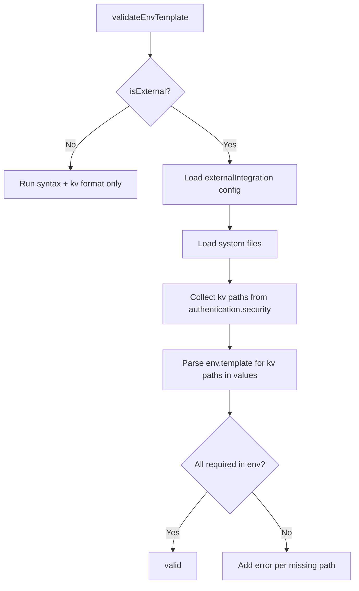

# env.template Authentication kv:// Validation

## Rules and Standards

This plan must comply with the following rules from [Project Rules](.cursor/rules/project-rules.mdc):

- **[Validation Patterns](.cursor/rules/project-rules.mdc#validation-patterns)** - Schema validation, developer-friendly error messages, validate before deployment
- **[Security & Compliance (ISO 27001)](.cursor/rules/project-rules.mdc#security--compliance-iso-27001)** - kv:// references for secrets, no hardcoded credentials
- **[Code Quality Standards](.cursor/rules/project-rules.mdc#code-quality-standards)** - File size ≤500 lines, functions ≤50 lines, JSDoc for all public functions
- **[Quality Gates](.cursor/rules/project-rules.mdc#quality-gates)** - Build, lint, test before commit; 80%+ coverage for new code
- **[Testing Conventions](.cursor/rules/project-rules.mdc#testing-conventions)** - Jest patterns, mirror source structure in tests/, mock external dependencies
- **[Error Handling & Logging](.cursor/rules/project-rules.mdc#error-handling--logging)** - Meaningful error messages, never expose secrets in errors

**Key Requirements:**

- Use try-catch for all async operations; handle config load failures gracefully (warn and skip auth check)
- Add JSDoc for `collectRequiredAuthKvPaths`, `extractKvPathsFromEnvTemplate`, and any new exports
- Keep validator.js under 500 lines; extract helpers if needed
- Never log kv path values or secrets in error messages
- Write tests for auth kv coverage: external app (matching/missing paths), builder app no-op, oidc/none empty security
- Use path.join() for cross-platform paths

## Before Development

- Read Validation Patterns and Security & Compliance sections from project-rules.mdc
- Review existing `validateEnvTemplate` and `validateKvReferencesInLines` in validator.js
- Review `loadExternalIntegrationConfig` and `loadSystemFile` in lib/generator/external.js
- Review authenticationVariablesByMethod in lib/schema/external-system.schema.json
- Review existing validator.test.js structure and mock patterns

## Definition of Done

Before marking this plan as complete, ensure:

1. **Build**: Run `npm run build` FIRST (must complete successfully - runs lint + test:ci)
2. **Lint**: Run `npm run lint` (must pass with zero errors/warnings)
3. **Test**: Run `npm test` or `npm run test:ci` AFTER lint (all tests must pass, ≥80% coverage for new code)
4. **Validation Order**: BUILD → LINT → TEST (mandatory sequence, never skip steps)
5. **File Size Limits**: Files ≤500 lines, functions ≤50 lines
6. **JSDoc Documentation**: All public functions (`collectRequiredAuthKvPaths`, `extractKvPathsFromEnvTemplate`) have JSDoc comments
7. **Code Quality**: All rule requirements met
8. **Security**: No hardcoded secrets; error messages do not expose kv path values or credentials
9. All implementation tasks completed
10. Tests cover: external app with matching paths, external app with missing paths, builder app no-op, oidc/none empty security, config load failure (warning path)

## Context

**Current state:** [lib/validation/validator.js](lib/validation/validator.js) validates env.template syntax and kv:// reference format (non-empty path, no leading/trailing slash) but does **not** verify that required authentication secrets are present.

**Authentication schema:** [lib/schema/external-system.schema.json](lib/schema/external-system.schema.json) defines `authenticationVariablesByMethod` with per-method security keys:


| Method     | Security keys (required kv paths) |
| ---------- | --------------------------------- |
| oauth2     | clientId, clientSecret            |
| aad        | clientId, clientSecret            |
| apikey     | apiKey                            |
| basic      | username, password                |
| queryParam | paramValue                        |
| oidc       | (none)                            |
| hmac       | signingSecret                     |
| none       | (none)                            |


**Source of truth:** The `authentication.security` object in each system config (`*-system.json` / `*-system.yaml`) lists required kv:// paths. Values are the exact paths (e.g. `kv://hubspot/client-id`, `kv://hubspot-clientidKeyVault`).

**Data flow:** env.template lines like `CLIENT_ID=kv://hubspot/client-id` provide values for credential push. Those kv:// paths must match what the system config's `authentication.security` expects.

## Approach

Extend `validateEnvTemplate` to:

1. **When external (integration):** Load system config(s), collect required kv:// paths from `authentication.security`, extract kv:// paths from env.template values, and report errors for any missing paths.
2. **When builder:** Skip auth kv coverage (no system config with authentication).
3. **Keep existing checks:** Syntax and kv:// format validation remain unchanged.




## Implementation

### 1. Add helper to collect required kv paths from systems

**File:** [lib/validation/validator.js](lib/validation/validator.js)

- Add `collectRequiredAuthKvPaths(appPath, options)`:
  - Load application config via `resolveApplicationConfigPath(appPath)` and `loadConfigFile`
  - Return early if no `externalIntegration.systems`
  - Use `loadExternalIntegrationConfig` (or equivalent from [lib/generator/external.js](lib/generator/external.js)) to get `schemaBasePath` and `systemFiles`
  - Load each system file via `loadSystemFile` (reuse from generator/external or implement inline with `loadConfigFile`)
  - For each system: `authentication?.security` values that match `^kv://.+` are required paths
  - Return `Set` or array of unique required kv paths
- Add `extractKvPathsFromEnvTemplate(content)`:
  - Split by newlines, for each line with `=`: take RHS value
  - Match `kv://...` in value (same regex as `validateKvReferencesInLines`)
  - Return set of kv paths found

### 2. Extend validateEnvTemplate

- After `detectAppType`, branch on `isExternal`
- If external:
  - Try to load required paths (catch config/file errors; on failure add warning and skip auth check)
  - Call `extractKvPathsFromEnvTemplate(content)`
  - For each required path, if not in extracted set: `errors.push('env.template: Missing required authentication secret: <path> (from authentication.security)')`
- If not external: no change to current behavior (syntax + format only)

### 3. Reuse existing loader

Import or call `loadExternalIntegrationConfig` and `loadSystemFile` from [lib/generator/external.js](lib/generator/external.js) to avoid duplication. The validator already has access to `detectAppType`, `resolveApplicationConfigPath`, `loadConfigFile`.

### 4. Edge cases

- **Multiple systems:** Collect paths from all system files (each can have different systemKey and auth).
- **oidc / none:** `authentication.security` is empty; required set is empty; no errors.
- **Config load failure:** Add warning and skip auth kv check; do not fail validation due to missing application.yaml or system files (let other validation steps catch that).
- **Path format:** Use exact string match; no normalization (e.g. `kv://hubspot/client-id` vs `kv://hubspot/clientId` are different keys).

## Files to Modify

- [lib/validation/validator.js](lib/validation/validator.js): Add `collectRequiredAuthKvPaths`, `extractKvPathsFromEnvTemplate`, extend `validateEnvTemplate`
- [tests/lib/validation/validator.test.js](tests/lib/validation/validator.test.js): Add tests for auth kv coverage (external app with matching/missing paths, builder app no-op, multiple systems, oidc/none empty security)

## Validation Logic Summary

```javascript
// Pseudocode
requiredPaths = collectRequiredAuthKvPaths(appPath)  // from all system configs
actualPaths = extractKvPathsFromEnvTemplate(content)
for (path of requiredPaths) {
  if (!actualPaths.has(path)) {
    errors.push(`env.template: Missing required authentication secret: ${path} (required by authentication.security)`)
  }
}
```

---

## Plan Validation Report

**Date**: 2025-03-01
**Plan**: .cursor/plans/89-env.template_auth_kv_validation.plan.md
**Status**: VALIDATED

### Plan Purpose

Add validation in env.template to ensure all kv:// paths required by the authentication section (from system config) are present in env.template values. Plan modifies the validation module (lib/validation/validator.js) for external integrations, adds helpers to collect required auth paths and extract kv paths from env.template, and extends validateEnvTemplate to branch on isExternal. Type: Development (validation feature). Affected areas: validation, schema, env.template, external systems.

### Applicable Rules

- [Validation Patterns](.cursor/rules/project-rules.mdc#validation-patterns) - Plan extends schema/validation logic for env.template
- [Security & Compliance (ISO 27001)](.cursor/rules/project-rules.mdc#security--compliance-iso-27001) - Plan validates kv:// secret references
- [Code Quality Standards](.cursor/rules/project-rules.mdc#code-quality-standards) - New functions need JSDoc, file size limits
- [Quality Gates](.cursor/rules/project-rules.mdc#quality-gates) - Mandatory for all plans
- [Testing Conventions](.cursor/rules/project-rules.mdc#testing-conventions) - Plan adds tests in validator.test.js
- [Error Handling & Logging](.cursor/rules/project-rules.mdc#error-handling--logging) - Plan adds validation errors; must not expose secrets

### Rule Compliance

- DoD Requirements: Documented (build, lint, test, validation order, coverage)
- Validation Patterns: Compliant
- Security & Compliance: Compliant (kv:// validation, no secrets in errors)
- Code Quality Standards: Compliant
- Quality Gates: Compliant
- Testing Conventions: Compliant
- Error Handling: Compliant

### Plan Updates Made

- Added Rules and Standards section with links to project-rules.mdc
- Added Definition of Done section with build, lint, test, JSDoc, security requirements
- Added Before Development checklist
- Added rule references: Validation Patterns, Security & Compliance, Code Quality Standards, Quality Gates, Testing Conventions, Error Handling & Logging

### Recommendations

- Ensure `collectRequiredAuthKvPaths` handles loadExternalIntegrationConfig throwing (e.g. missing externalIntegration) by returning empty set and optionally adding a warning rather than failing validation
- Consider extracting `extractKvPathsFromEnvTemplate` to a small utility if validator.js approaches 500 lines

