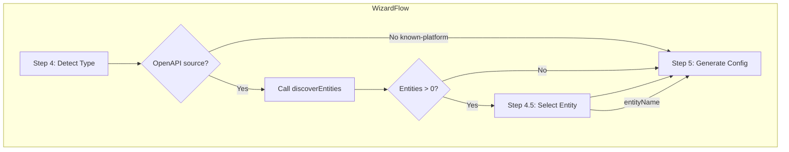

# Wizard Entity Selection Step

## Summary

Add entity discovery and selection to the wizard for OpenAPI-based sources. After type detection (Step 4) and before configuration generation (Step 5), the wizard will call `discoverEntities`, present a searchable list of entities (10 rows, client-side filter), and pass the selected `entityName` to generate-config. Reuses existing `discoverEntities` API and `validateEntityNameForOpenApi`; wires `entityName` into `buildConfigPayload` and headless flow.

## Rules and Standards

This plan must comply with the following rules from [Project Rules](.cursor/rules/project-rules.mdc):

- **[CLI Command Development](.cursor/rules/project-rules.mdc#cli-command-development)** - Wizard flow is part of the CLI; prompts, user experience, chalk for output, error handling
- **[Code Quality Standards](.cursor/rules/project-rules.mdc#code-quality-standards)** - File size ≤500 lines, functions ≤50 lines, JSDoc for all public functions
- **[Quality Gates](.cursor/rules/project-rules.mdc#quality-gates)** - Build, lint, test before commit; 80%+ coverage for new code
- **[Testing Conventions](.cursor/rules/project-rules.mdc#testing-conventions)** - Jest patterns, mirror source structure in tests/, mock API and inquirer
- **[Validation Patterns](.cursor/rules/project-rules.mdc#validation-patterns)** - Schema validation for wizard-config; validate entityName before generate-config
- **[Error Handling & Logging](.cursor/rules/project-rules.mdc#error-handling--logging)** - Meaningful error messages, try-catch for async, chalk for output, never log secrets
- **[Architecture Patterns](.cursor/rules/project-rules.mdc#architecture-patterns)** - Use lib/api (discoverEntities), CommonJS, module export patterns
- **[Security & Compliance](.cursor/rules/project-rules.mdc#security--compliance-iso-27001)** - No hardcoded secrets, input validation

**Key Requirements:**

- Use try-catch for all async operations (discoverEntities, prompts)
- Add JSDoc for `promptForEntitySelection`, `handleEntitySelection`, and any new exports
- Keep files ≤500 lines; extract helpers if needed
- Use chalk for step labels and success/error messages
- Write tests for prompt (mocked inquirer), handleEntitySelection (mocked discoverEntities), buildConfigPayload with entityName
- Use path.join() for cross-platform paths

## Before Development

- Read CLI Command Development and Testing Conventions sections from project-rules.mdc
- Review existing wizard flow in lib/commands/wizard.js and wizard-core.js
- Review promptForKnownPlatform and promptForExistingCredential in wizard-prompts.js / wizard-prompts-secondary.js
- Review discoverEntities and validateEntityNameForOpenApi (lib/api/wizard-platform.api.js, lib/validation/wizard-datasource-validation.js)
- Verify inquirer-autocomplete-prompt v2.x CommonJS compatibility with Inquirer 8

## Definition of Done

Before marking this plan as complete, ensure:

1. **Build**: Run `npm run build` FIRST (must complete successfully - runs lint + test:ci)
2. **Lint**: Run `npm run lint` (must pass with zero errors/warnings)
3. **Test**: Run `npm test` or `npm run test:ci` AFTER lint (all tests must pass, ≥80% coverage for new code)
4. **Validation Order**: BUILD → LINT → TEST (mandatory sequence, never skip steps)
5. **File Size Limits**: Files ≤500 lines, functions ≤50 lines
6. **JSDoc Documentation**: All public functions (`promptForEntitySelection`, `handleEntitySelection`) have JSDoc comments
7. **Code Quality**: All rule requirements met
8. **Security**: No hardcoded secrets; input validation for entityName
9. All implementation tasks completed
10. Tests cover: promptForEntitySelection (choices, filter), handleEntitySelection (0 entities skip, N entities prompt), buildConfigPayload with entityName, headless entityName flow

## Architecture




## Implementation

### 1. Add searchable list prompt dependency

- Add `inquirer-autocomplete-prompt` (v2.x for CommonJS + Inquirer 8 compatibility) to [package.json](package.json)
- Register the prompt in [lib/generator/wizard-prompts.js](lib/generator/wizard-prompts.js) or a new module used by the entity prompt

### 2. New prompt: `promptForEntitySelection`

- **Location**: [lib/generator/wizard-prompts.js](lib/generator/wizard-prompts.js) or [lib/generator/wizard-prompts-secondary.js](lib/generator/wizard-prompts-secondary.js)
- **Input**: `entities: Array<{ name, pathCount?, schemaMatch? }>` from discover-entities
- **Output**: `entityName: string`
- **UI**:
  - Use `inquirer-autocomplete-prompt` with `pageSize: 10`
  - `source(answers, input)` filters entities client-side: `entity.name.toLowerCase().includes((input || '').toLowerCase())`
  - Choice format: `companies (12 paths)` or `companies` if no pathCount
- **When to show**: Only when `entities.length > 0`; if 0, skip and do not pass `entityName`

### 3. New step: `handleEntitySelection`

- **Location**: [lib/commands/wizard-core.js](lib/commands/wizard-core.js) (or [lib/commands/wizard.js](lib/commands/wizard.js) if step is interactive-only)
- **Logic**:
  1. Call `discoverEntities(dataplaneUrl, authConfig, openapiSpec)`
  2. If `response.data?.entities?.length === 0`, return `null` (no entityName)
  3. Otherwise call `promptForEntitySelection(entities)` and return selected `entityName`
- **Validation**: Before passing to generate-config, call `validateEntityNameForOpenApi(entityName, entities)` (belt-and-suspenders; API also validates)

### 4. Wire into interactive flow

- **File**: [lib/commands/wizard.js](lib/commands/wizard.js)
- **In `doWizardSteps`**: After `handleTypeDetection`, before `handleInteractiveConfigGeneration`:
  - If `openapiSpec` exists and `sourceType` is not `known-platform`:
    - Call `handleEntitySelection(dataplaneUrl, authConfig, openapiSpec)`
    - Pass `entityName` (or `undefined`) into `handleInteractiveConfigGeneration` options
- **Step label**: Log "Step 4.5: Select Entity" when the step runs (or fold into Step 5 messaging)

### 5. Update `handleInteractiveConfigGeneration` and `callGenerateApi`

- **File**: [lib/commands/wizard.js](lib/commands/wizard.js): Add `entityName` to options passed to `handleConfigurationGeneration`
- **File**: [lib/commands/wizard-core.js](lib/commands/wizard-core.js): `callGenerateApi` passes `entityName` into `buildConfigPayload`
- **File**: [lib/commands/wizard-core-helpers.js](lib/commands/wizard-core-helpers.js): `buildConfigPayload` accepts `entityName` and includes it in payload when present:

```javascript
if (entityName) payload.entityName = entityName;
```

### 6. Update `generateConfig` JSDoc

- **File**: [lib/api/wizard.api.js](lib/api/wizard.api.js): Add `config.entityName` to JSDoc for `generateConfig`

### 7. Headless support

- **Schema**: [lib/schema/wizard-config.schema.json](lib/schema/wizard-config.schema.json)  
  - Add `entityName: { type: "string" }` under `source.properties` for openapi-file and openapi-url (conditional via `allOf` or document that it applies to OpenAPI sources only)
- **File**: [lib/commands/wizard-headless.js](lib/commands/wizard-headless.js): Pass `entityName: source?.entityName` from config into `handleConfigurationGeneration` options
- **Validation**: When `entityName` is provided in headless config, call `discoverEntities` and `validateEntityNameForOpenApi` before generate-config; on invalid, throw with available entities listed

### 8. Documentation

- **File**: [docs/wizard.md](docs/wizard.md):
  - Add Step 4.5 "Select Entity (OpenAPI)" between Step 4 and Step 5
  - Describe: discover-entities, searchable list, 10 rows, client-side filter
  - Headless: document `entityName` in `source` for wizard.yaml

## File Summary


| Action     | File                                                                                                                         |
| ---------- | ---------------------------------------------------------------------------------------------------------------------------- |
| Modify     | [package.json](package.json) - add inquirer-autocomplete-prompt                                                              |
| Add/Modify | [lib/generator/wizard-prompts.js](lib/generator/wizard-prompts.js) or wizard-prompts-secondary.js - promptForEntitySelection |
| Add        | [lib/commands/wizard-core.js](lib/commands/wizard-core.js) - handleEntitySelection                                           |
| Modify     | [lib/commands/wizard.js](lib/commands/wizard.js) - call handleEntitySelection, pass entityName                               |
| Modify     | [lib/commands/wizard-core-helpers.js](lib/commands/wizard-core-helpers.js) - buildConfigPayload entityName                   |
| Modify     | [lib/commands/wizard-headless.js](lib/commands/wizard-headless.js) - pass entityName from source                             |
| Modify     | [lib/schema/wizard-config.schema.json](lib/schema/wizard-config.schema.json) - entityName in source                          |
| Modify     | [lib/api/wizard.api.js](lib/api/wizard.api.js) - JSDoc for entityName                                                        |
| Modify     | [docs/wizard.md](docs/wizard.md) - Step 4.5 documentation                                                                    |


## Search implementation detail

`inquirer-autocomplete-prompt` uses a `source` function that returns a Promise of choices. For client-side filtering:

```javascript
source: (_, input) => {
  const q = (input || '').toLowerCase();
  const filtered = entities.filter(e => (e.name || '').toLowerCase().includes(q));
  return Promise.resolve(filtered.map(e => ({
    name: e.pathCount != null ? `${e.name} (${e.pathCount} paths)` : e.name,
    value: e.name
  })));
}
```

If no plugin is added, fallback: use standard `list` with `pageSize: 10` (no search). The plan recommends adding the plugin for better UX with large entity lists.

## Edge cases

- **discoverEntities fails**: Log warning, skip step, do not pass entityName (dataplane uses default heuristic)
- **Empty entities**: Skip step; do not pass entityName
- **Single entity**: Still show selection (one choice); or optionally auto-select to reduce a step
- **Headless invalid entityName**: Throw with message listing available entities from discover-entities

## Tests

- Unit: `promptForEntitySelection` with mocked inquirer (choices built correctly)
- Unit: `handleEntitySelection` - mock discoverEntities (0 entities = skip, N entities = prompt)
- Integration: `callGenerateApi` / `buildConfigPayload` receives and sends entityName
- Headless: executeWizardFromConfig with source.entityName, validate it reaches handleConfigurationGeneration

---

## Plan Validation Report

**Date**: 2026-03-01
**Plan**: .cursor/plans/90-wizard_entity_selection_step.plan.md
**Status**: VALIDATED

### Plan Purpose

Add a new wizard step (Step 4.5) for OpenAPI sources: call discover-entities, present a searchable entity list (10 rows, client-side filter), and pass entityName to generate-config. Plan type: **Development** (CLI wizard flow, prompts, schema, API integration).

### Applicable Rules

- CLI Command Development - Wizard flow, prompts, user experience
- Code Quality Standards - File size limits, JSDoc
- Quality Gates - Build, lint, test
- Testing Conventions - Jest, mocks, 80%+ coverage
- Validation Patterns - wizard-config schema, entityName validation
- Error Handling and Logging - try-catch, chalk, meaningful errors
- Architecture Patterns - lib/api, CommonJS
- Security and Compliance - No hardcoded secrets, input validation

### Rule Compliance

- DoD Requirements: Documented (Build, Lint, Test, validation order)
- CLI Command Development: Compliant (prompts, UX, error handling)
- Code Quality Standards: Compliant (file size, JSDoc in plan)
- Quality Gates: Compliant (build, lint, test in DoD)
- Testing Conventions: Compliant (test cases listed)
- Validation Patterns: Compliant (schema update, entityName validation)
- Security: Compliant (no secrets, input validation)

### Plan Updates Made

- Added Rules and Standards section with rule references
- Added Before Development checklist
- Added Definition of Done section with full DoD requirements
- Added rule links to project-rules.mdc

### Recommendations

- Confirm inquirer-autocomplete-prompt v2.x works with Inquirer 8 before implementation; if not, fallback to standard list with pageSize 10
- Consider adding entityName to lib/api/types/wizard.types.js for generate-config request type
- Run `npm run build` after implementation to validate lint and tests pass

---

## Implementation Validation Report

**Date**: 2026-03-01
**Plan**: .cursor/plans/90-wizard_entity_selection_step.plan.md
**Status**: COMPLETE

### Executive Summary

All implementation requirements have been implemented. The Wizard Entity Selection Step (Step 4.5) is integrated into the interactive and headless wizard flows. Format, lint, and tests pass.

### Task Completion

| Task | Status | Evidence |
|------|--------|----------|
| 1. Add inquirer-autocomplete-prompt to package.json | Done | Dependency present |
| 2. promptForEntitySelection in wizard-prompts-secondary | Done | Function in wizard-prompts-secondary.js, exported via wizard-prompts.js |
| 3. handleEntitySelection | Done | lib/commands/wizard-entity-selection.js (extracted for file size) |
| 4. Wire handleEntitySelection into wizard.js | Done | doWizardSteps calls it after handleTypeDetection |
| 5. entityName in buildConfigPayload, callGenerateApi | Done | buildConfigPayload accepts entityName; callGenerateApi passes it |
| 6. generateConfig JSDoc entityName | Done | JSDoc in wizard.api.js |
| 7. Headless: schema, wizard-headless, validation | Done | entityName in schema; validateHeadlessEntityName; pass entityName |
| 8. docs/wizard.md Step 4.5 | Done | Section added with headless entityName docs |

**Completion**: 100% (8/8)

### File Existence Validation

| File | Status |
|------|--------|
| package.json | Done – inquirer-autocomplete-prompt added |
| lib/generator/wizard-prompts-secondary.js | Done – promptForEntitySelection |
| lib/commands/wizard-entity-selection.js | Done – handleEntitySelection (new file) |
| lib/commands/wizard-core.js | Done – imports and exports handleEntitySelection |
| lib/commands/wizard.js | Done – entity selection flow, entityName passed |
| lib/commands/wizard-core-helpers.js | Done – buildConfigPayload(entityName) |
| lib/commands/wizard-headless.js | Done – validateHeadlessEntityName, entityName passed |
| lib/schema/wizard-config.schema.json | Done – entityName in source.properties |
| lib/api/wizard.api.js | Done – JSDoc config.entityName |
| docs/wizard.md | Done – Step 4.5 documentation |

### Test Coverage

| Test | Status |
|------|--------|
| promptForEntitySelection (choices, format, empty) | tests/lib/generator/wizard-prompts-secondary.test.js |
| handleEntitySelection (null spec, empty entities, prompt, discover fails) | tests/lib/commands/wizard-core.test.js |
| buildConfigPayload with entityName | tests/lib/commands/wizard-core.test.js |
| Headless entityName (pass, invalid) | tests/lib/commands/wizard-headless.test.js |

### Code Quality Validation

| Step | Result |
|------|--------|
| Format (npm run lint:fix) | PASSED |
| Lint (npm run lint) | PASSED (0 errors, 0 warnings) |
| Tests (npm test) | PASSED (232 suites, 5077 tests) |

### Cursor Rules Compliance

- Code reuse: Uses discoverEntities, validateEntityNameForOpenApi
- Error handling: try-catch in handleEntitySelection, validateHeadlessEntityName
- Logging: logger.log, chalk for step labels
- JSDoc: promptForEntitySelection, handleEntitySelection, validateHeadlessEntityName
- Async patterns: async/await throughout
- Module patterns: CommonJS, proper exports
- Security: No hardcoded secrets; input validation via validateEntityNameForOpenApi

### Final Validation Checklist

- [x] All implementation tasks completed
- [x] All files exist and contain expected changes
- [x] Tests exist for new code
- [x] Code quality validation passes (format, lint, test)
- [x] Implementation complete

