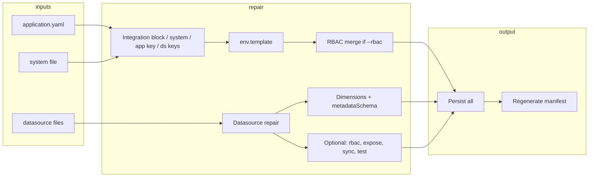

# Repair command: validate manifest + optional flags

## Current behavior

- **Repair** ([lib/commands/repair.js](lib/commands/repair.js)) runs on **application.yaml** and **system file** only: `externalIntegration` block, system `dataSources` list, app key, datasource `systemKey`s, auth/config normalization, optional rbac.yaml creation from system, env.template alignment, then manifest regeneration.
- It does **not** read or modify **datasource files** (e.g. `*-datasource-*.json`). Datasource content (metadataSchema, dimensions, exposed, sync, testPayload) is untouched.

## Goal

1. **Core repair (always)**
  For each discovered datasource file, treat **fieldMappings.attributes** as the source of truth and:
  - **metadataSchema**: If missing, add a minimal one; if present, remove any schema branches that are not referenced by any attribute expression.
  - **Dimensions**: For each `fieldMappings.dimensions` entry, the value is an attribute path (e.g. `metadata.email`). Ensure the segment after `metadata.` is an attribute key; if not, remove that dimension.
2. **Optional flags** (only when passed):
  - **--rbac**: Ensure rbac has permissions for every endpoint (per datasource: `<resourceType>:<capability>`) and default Admin/Reader roles if none exist.
  - **--expose**: Set `exposed.attributes` to the list of all `fieldMappings.attributes` keys.
  - **--sync**: Add or ensure a `sync` section on the datasource (e.g. mode, schedule, batchSize, maxParallelRequests).
  - **--test**: Generate `testPayload.payloadTemplate` and `testPayload.expectedResult` (e.g. from attributes / sample shape).

## Rules and Standards

This plan must comply with the following rules from [Project Rules](.cursor/rules/project-rules.mdc):

- **[CLI Command Development](.cursor/rules/project-rules.mdc)** – Adding options to `repair <app>`; command pattern, input validation, chalk output, user experience. Applies because the plan adds `--rbac`, `--expose`, `--sync`, `--test` and wires them in setup-utility.js.
- **[Architecture Patterns](.cursor/rules/project-rules.mdc)** – Module structure (lib/commands/, CommonJS), file organization, fixes in generator/repair source not only generated artifacts. Applies because new `repair-datasource.js` and changes to repair.js live in lib/commands/.
- **[Code Quality Standards](.cursor/rules/project-rules.mdc)** – File size (≤500 lines/file, ≤50 lines/function), JSDoc for all public functions, documentation requirements. Applies to new and modified modules.
- **[Quality Gates](.cursor/rules/project-rules.mdc)** – Mandatory checks before commit: build, lint, test, coverage ≥80% for new code. Applies to all implementation.
- **[Testing Conventions](.cursor/rules/project-rules.mdc)** – Jest, tests in tests/, mock fs and config, success and error paths. Applies because plan adds tests in tests/lib/commands/repair.test.js and possibly repair-datasource.test.js.
- **[Security & Compliance (ISO 27001)](.cursor/rules/project-rules.mdc)** – No hardcoded secrets, input validation, no logging of sensitive data. Applies especially to RBAC and datasource repair touching permissions/roles.
- **[Validation Patterns](.cursor/rules/project-rules.mdc)** – Schema validation (external-datasource schema), YAML/JSON handling. Applies to metadataSchema and datasource structure.
- **[Error Handling & Logging](.cursor/rules/project-rules.mdc)** – try-catch for async, meaningful errors, chalk for output. Applies to repair and repair-datasource code paths.
- **[Documentation Rules](.cursor/rules/docs-rules.mdc)** – CLI user docs: command-centric, no REST/HTTP details; document what the command does, options, and outcomes. Applies to docs/ updates for repair.

**Key requirements**

- Use Commander.js pattern for new options; pass options into `repairExternalIntegration(appName, { dryRun, rbac, expose, sync, test })`.
- Validate inputs (app name, file paths); use path.join() for paths; try-catch for async operations.
- JSDoc for all public functions in repair-datasource.js and any new exports in repair.js.
- Keep files ≤500 lines and functions ≤50 lines; split into repair-datasource.js if needed.
- Tests: dimensions prune, metadataSchema add/prune, --expose, --sync, --rbac, --test; mock fs and config-format; ≥80% coverage for new code.
- Run `npm run build` (then lint, test) before commit; zero lint errors.
- No hardcoded secrets; RBAC content uses system key/displayName from config only.
- Docs: describe repair behavior and flags in user terms; do not expose HTTP/API details.

## Before Development

- Read CLI Command Development and Quality Gates sections from project-rules.mdc.
- Review existing [lib/commands/repair.js](lib/commands/repair.js) and [tests/lib/commands/repair.test.js](tests/lib/commands/repair.test.js) for patterns.
- Review [lib/schema/external-datasource.schema.json](lib/schema/external-datasource.schema.json) for metadataSchema, dimensions, exposed, sync, testPayload.
- Review [lib/schema/external-system.schema.json](lib/schema/external-system.schema.json) for roles and permissions shape.
- Review [.cursor/rules/docs-rules.mdc](.cursor/rules/docs-rules.mdc) for doc constraints (command-centric, no REST details).
- Confirm validation order: BUILD → LINT → TEST.

## Definition of Done

Before marking this plan complete, ensure:

1. **Build**: Run `npm run build` FIRST (must complete successfully; runs lint + test:ci).
2. **Lint**: Run `npm run lint` (must pass with zero errors/warnings).
3. **Test**: Run `npm test` or `npm run test:ci` AFTER lint (all tests must pass; ≥80% coverage for new code).
4. **Validation order**: BUILD → LINT → TEST (mandatory sequence; do not skip steps).
5. **File size**: All files ≤500 lines; all functions ≤50 lines.
6. **JSDoc**: All public functions have JSDoc (params, returns, throws where applicable).
7. **Code quality**: Rule requirements met (error handling, path.join, no secrets in code/logs).
8. **Security**: No hardcoded secrets; ISO 27001–aware handling of RBAC and config.
9. **Tasks**: All plan tasks (core repair, optional flags, CLI wiring, tests, docs) completed.
10. **Docs**: All documents listed in **§ Documentation to update** revised as specified; repair behavior and flags described in user terms only (no HTTP/API details), per docs-rules.mdc.

---

## 1. Attributes as source of truth (core repair)

**Scope**: Each file in `datasourceFiles` under the app path.

**1.1 Dimensions**

- **Rule**: `dimensions` values are attribute paths (e.g. `metadata.email`, `metadata.country`). The part after `metadata.` must be a key in `fieldMappings.attributes`.
- **Action**: Build the set of attribute keys from `fieldMappings.attributes`. For each `dimensions[key]`:
  - If value is `metadata.<attr>` and `attr` is not in the attribute set, **delete** that dimension entry.
- **Location**: New helper (e.g. in [lib/commands/repair-datasource.js](lib/commands/repair-datasource.js) or under [lib/commands/](lib/commands/)) that mutates the parsed datasource object; repair.js loads each datasource file, runs the helper, and writes back if changed.

**1.2 metadataSchema**

- **If missing**: Set `datasource.metadataSchema = { type: "object", additionalProperties: true }` (minimal stub so validators don’t complain).
- **If present**: Treat attributes as source of truth:
  - Collect all paths referenced by attribute expressions (parse `{{ path.to.field }}` from each `fieldMappings.attributes[*].expression`; skip `record_ref:`).
  - Remove from metadataSchema any property (or branch) that is not needed by those paths. Implementation options:
    - **Simpler**: Only prune top-level `properties` keys that don’t appear in any path (e.g. if no expression references `foo`, remove `metadataSchema.properties.foo`). Nested pruning (e.g. `properties.bar.baz`) can be a follow-up.
    - **Full**: Walk schema recursively and remove branches that don’t match any path; more complex and schema-dependent.
- **Recommendation**: Implement “add if missing” plus a conservative prune (e.g. top-level only or path set vs schema paths) to avoid subtle schema breakage; document behavior in JSDoc and user docs.

**1.3 Order**

- Run dimension cleanup and metadataSchema add/trim **after** existing repair steps that touch the same app path, and **before** `persistChangesAndRegenerate` so that when the manifest is regenerated it sees the repaired datasource files. Persist datasource file changes in the same “persist” phase (write back each modified datasource file, then application.yaml, then regenerate manifest).

---

## 2. Optional flag: --rbac

- **When**: Only when `options.rbac === true` (e.g. `repair <app> --rbac`).
- **Behavior**:
  - For each **datasource** in the app, get `resourceType` (e.g. `contact`) and capabilities (from `capabilities` array or object, or default `['list','get','create','update','delete']`).
  - Ensure there is a permission per capability: `<resourceType>:<capability>` (e.g. `contact:list`, `contact:get`, ...). If a permission is missing, add it and assign to appropriate roles.
  - If there are **no roles** in rbac (or no rbac file and system has no roles), add two roles:
    - **Admin**: `name: "<displayName> Admin"`, `value: "<key>-admin"`, `description: "Full access to all <displayName> operations"`, `groups: []`; grant all permissions for all datasources’ resourceTypes.
    - **Reader**: `name: "<displayName> Reader"`, `value: "<key>-reader"`, `description: "Read-only access to all <displayName> data"`, `groups: []`; grant only `<resourceType>:list` and `<resourceType>:get` for each resourceType.
  - Use system `key` and `displayName` for role names/values. Permissions format: existing schema in [lib/schema/external-system.schema.json](lib/schema/external-system.schema.json) (permissions[].name, permissions[].roles, permissions[].description).
- **Where**: Prefer updating **rbac.yaml** (create if missing from system roles/permissions or from this step). If the code path currently only creates rbac from system when rbac is absent, extend it so that when `--rbac` is set we also **merge** new permissions/roles into existing rbac and write back; then ensure deploy manifest generation still merges rbac into system (so manifest has full RBAC).

---

## 3. Optional flag: --expose

- **When**: Only when `options.expose === true`.
- **Behavior**: For each datasource file, set `exposed.attributes` to the list of all keys in `fieldMappings.attributes` (order can be object key order or sorted). If `exposed` is missing, create it with only `attributes`; otherwise replace or set `exposed.attributes`. Schema: [external-datasource.schema.json](lib/schema/external-datasource.schema.json) `exposed.attributes` (array of strings, pattern `^[a-zA-Z0-9_]+$`).

---

## 4. Optional flag: --sync

- **When**: Only when `options.sync === true`.
- **Behavior**: For each datasource file, if `sync` is missing or empty, add a default `sync` section, e.g. `{ mode: "pull", batchSize: 500, maxParallelRequests: 5 }` (and optionally `schedule` if a default is defined). Align with [external-datasource.schema.json](lib/schema/external-datasource.schema.json) `sync` (mode, schedule, batchSize, maxParallelRequests).

---

## 5. Optional flag: --test

- **When**: Only when `options.test === true`.
- **Behavior**: For each datasource, generate:
  - **testPayload.payloadTemplate**: Minimal sample object that matches the shape expected by attribute expressions (e.g. from expression paths and types). If metadataSchema exists, a minimal valid sample consistent with it can be used; otherwise build from `{{ path.to.field }}` paths and attribute types.
  - **testPayload.expectedResult**: Expected normalized result after applying field mappings (attribute keys and sample values). Can be derived from attributes (keys and types) with placeholder or default values.
- **Implementation note**: Reuse or extend any existing logic that builds samples from schema or expressions (e.g. in [lib/utils/external-system-validators.js](lib/utils/external-system-validators.js) or test runners). If none exists, implement a minimal generator (paths + types → minimal payload and expected normalized object).

---

## 6. CLI and wiring

- **CLI**: In [lib/cli/setup-utility.js](lib/cli/setup-utility.js), add options to the `repair <app>` command:
  - `--rbac`
  - `--expose`
  - `--sync`
  - `--test`
- Pass these into `repairExternalIntegration(appName, { dryRun, rbac, expose, sync, test })`.
- In [lib/commands/repair.js](lib/commands/repair.js):
  - After resolving system and datasource file list, loop over each datasource file: load, run **datasource repair** (dimensions + metadataSchema always; expose/sync/test when flags set), write back if changed.
  - Then run existing steps (integration block, system dataSources, app key, datasource systemKeys, rbac-from-system if needed, **--rbac** merge if flag set, env.template), persist all changes, regenerate manifest.

---

## 7. Files to add or touch

| Area                 | File(s)                                                                | Action                                                                                                                                                                                                                                                     |
| -------------------- | ---------------------------------------------------------------------- | ---------------------------------------------------------------------------------------------------------------------------------------------------------------------------------------------------------------------------------------------------------- |
| Datasource repair    | New `lib/commands/repair-datasource.js` (or similar)                   | Helpers: repairDimensionsFromAttributes, repairMetadataSchemaFromAttributes, repairExposeFromAttributes, repairSyncSection, repairTestPayload; single entry e.g. `repairDatasourceFile(parsed, options)` that applies all and returns { updated, changes } |
| Repair orchestration | [lib/commands/repair.js](lib/commands/repair.js)                       | Call datasource repair for each file; add --rbac logic (merge permissions/roles into rbac.yaml); pass options.rbac, .expose, .sync, .test                                                                                                                  |
| CLI                  | [lib/cli/setup-utility.js](lib/cli/setup-utility.js)                   | Add .option('--rbac', ...), .option('--expose', ...), .option('--sync', ...), .option('--test', ...) and pass to repairExternalIntegration                                                                                                                 |
| Tests                | [tests/lib/commands/repair.test.js](tests/lib/commands/repair.test.js) | New cases: dimensions removed when metadata.xx not in attributes; metadataSchema added when missing; metadataSchema pruned; --expose sets exposed.attributes; --sync adds sync; --rbac adds permissions/roles; --test generates testPayload                |
| Docs                 | See **§ Documentation to update** below                                | Document repair behavior: attributes as source of truth (dimensions, metadataSchema), and optional flags --rbac, --expose, --sync, --test (user-facing, no HTTP/API details)                                                                               |

---

## Documentation to update

All updates must be **command-centric** and **user-facing** (what the command does, options, outcomes). Do **not** add REST/HTTP or backend endpoint details (per [docs-rules.mdc](.cursor/rules/docs-rules.mdc)).

| Document                                                                                 | What to update                                                                                                                                                                                                                                                                                                                                                                                                                                                                                                                                                                                                                                                                                                                                                                                                                                                                                                                                                                                                                                                                                                                                |
| ---------------------------------------------------------------------------------------- | --------------------------------------------------------------------------------------------------------------------------------------------------------------------------------------------------------------------------------------------------------------------------------------------------------------------------------------------------------------------------------------------------------------------------------------------------------------------------------------------------------------------------------------------------------------------------------------------------------------------------------------------------------------------------------------------------------------------------------------------------------------------------------------------------------------------------------------------------------------------------------------------------------------------------------------------------------------------------------------------------------------------------------------------------------------------------------------------------------------------------------------------- |
| **[docs/commands/utilities.md](docs/commands/utilities.md)**                             | **Repair section** (`## aifabrix repair <app>`): (1) In **What**, add that repair also runs on **datasource files**: aligns `fieldMappings.dimensions` with attributes (removes dimensions whose `metadata.<attr>` is not in `fieldMappings.attributes`), and syncs `metadataSchema` with attributes (adds minimal schema if missing; removes schema branches not referenced by any attribute expression). (2) Add **Options**: `--rbac`, `--expose`, `--sync`, `--test` with one-line descriptions. (3) Under **Repairable issues**, add: **Dimensions not in attributes** — dimension values like `metadata.<attr>` must reference an existing attribute; repair removes invalid dimension entries; **metadataSchema drift** — repair adds minimal metadataSchema when missing and removes schema fields not used by attribute expressions; **Optional flags** — document that `--rbac` adds/merges RBAC permissions and default Admin/Reader roles; `--expose` sets `exposed.attributes` from all attribute keys; `--sync` adds a default sync section; `--test` generates `testPayload.payloadTemplate` and `testPayload.expectedResult`. |
| **[docs/commands/external-integration.md](docs/commands/external-integration.md)**       | **Repair bullet** (intro): Extend to say repair also aligns datasource files with the manifest (dimensions, metadataSchema) and supports optional flags `--rbac`, `--expose`, `--sync`, `--test`. Keep link to [Utility commands – repair](utilities.md#aifabrix-repair-app).                                                                                                                                                                                                                                                                                                                                                                                                                                                                                                                                                                                                                                                                                                                                                                                                                                                                 |
| **[docs/external-systems.md](docs/external-systems.md)**                                 | *env.template / KV_ section** (around line 1107): After the sentence about running `aifabrix repair <app>` to align env.template, add that repair also aligns datasource files (dimensions and metadataSchema with attributes as source of truth). **Troubleshooting** (around line 1462): In the bullet about running repair to align systems/dataSources and env.template, add that repair also fixes datasource manifest alignment (dimensions, metadataSchema) and that optional flags (`--rbac`, `--expose`, `--sync`, `--test`) can add RBAC, exposed attributes, sync section, or test payload.                                                                                                                                                                                                                                                                                                                                                                                                                                                                                                                                        |
| **[docs/configuration/secrets-and-config.md](docs/configuration/secrets-and-config.md)** | *KV_ / env.template** (around line 61): Optionally add one sentence that repair can also align datasource config (dimensions, metadataSchema) and supports `--rbac`, `--expose`, `--sync`, `--test` for RBAC, exposure, sync, and test payload. Keep existing repair sentence for env.template.                                                                                                                                                                                                                                                                                                                                                                                                                                                                                                                                                                                                                                                                                                                                                                                                                                               |
| **[docs/commands/README.md](docs/commands/README.md)**                                   | **Repair list item**: Update the one-line description so it mentions that repair also aligns datasource files (dimensions, metadataSchema) and supports optional flags for RBAC, expose, sync, and test.                                                                                                                                                                                                                                                                                                                                                                                                                                                                                                                                                                                                                                                                                                                                                                                                                                                                                                                                      |
| **[docs/configuration/application-yaml.md](docs/configuration/application-yaml.md)**     | **Repair sentence** (around line 73): Add that repair also aligns datasource files with the manifest (dimensions and metadataSchema from attributes) when config drifts.                                                                                                                                                                                                                                                                                                                                                                                                                                                                                                                                                                                                                                                                                                                                                                                                                                                                                                                                                                      |
| **[docs/commands/validation.md](docs/commands/validation.md)**                           | **Troubleshooting** (around line 444): Where it says to run `aifabrix repair <app>` to sync config with files on disk, add that repair also fixes datasource manifest alignment (dimensions, metadataSchema) and can add RBAC, expose, sync, or test payload with the optional flags.                                                                                                                                                                                                                                                                                                                                                                                                                                                                                                                                                                                                                                                                                                                                                                                                                                                         |

**Summary**

- **Primary**: [docs/commands/utilities.md](docs/commands/utilities.md) — full repair section update (behavior + options + repairable issues).
- **Secondary**: [docs/commands/external-integration.md](docs/commands/external-integration.md), [docs/external-systems.md](docs/external-systems.md) — repair scope and optional flags.
- **Tertiary**: [docs/configuration/secrets-and-config.md](docs/configuration/secrets-and-config.md), [docs/commands/README.md](docs/commands/README.md), [docs/configuration/application-yaml.md](docs/configuration/application-yaml.md), [docs/commands/validation.md](docs/commands/validation.md) — short mentions so users find repair and the new behavior/flags from every relevant doc.

---

## 8. Diagram (high level)

---

## 9. Validation details

- **Dimension value format**: Dimension values are strings like `metadata.<attr>`. Only the segment after `metadata.` is checked against `fieldMappings.attributes` keys. Non-`metadata.`* paths can be left as-is or validated in a follow-up (schema allows `^[a-zA-Z0-9_.]+$`).
- **metadataSchema prune**: Prefer safe, conservative pruning (e.g. top-level properties) to avoid breaking nested or `$ref`-based schemas. Full recursive prune can be a later enhancement.
- **RBAC permission name**: Use `<resourceType>:<capability>` (e.g. `contact:list`). Align with existing permission `name` pattern in external-system schema (`^[a-z0-9-:]+$`).

---

## 10. Out of scope for this plan

- Changing how the wizard or download generates initial datasource files.
- Validating or repairing `config.abac.dimensions` (only `fieldMappings.dimensions` is in scope).
- Exposing HTTP/API details in user-facing docs (per docs rules).

---

## Plan Validation Report

**Date**: 2026-03-06  
**Plan**: .cursor/plans/95-repair_command_improvements.plan.md  
**Status**: VALIDATED

### Plan Purpose

Extend `aifabrix repair <app>` with manifest-centric datasource repairs (attributes as source of truth: metadataSchema sync, dimension validation) and optional flags (--rbac, --expose, --sync, --test). **Scope**: CLI command (repair), lib/commands/ modules, datasource and system schemas, tests, docs. **Type**: Development (CLI features, repair logic, new module).

### Applicable Rules

- [CLI Command Development](.cursor/rules/project-rules.mdc) – New repair options and wiring; applies.
- [Architecture Patterns](.cursor/rules/project-rules.mdc) – lib/commands/, CommonJS, generator/repair as fix location; applies.
- [Code Quality Standards](.cursor/rules/project-rules.mdc) – File size, JSDoc; applies.
- [Quality Gates](.cursor/rules/project-rules.mdc) – Build, lint, test, coverage; applies (mandatory).
- [Testing Conventions](.cursor/rules/project-rules.mdc) – Jest, tests in tests/, mocks; applies.
- [Security & Compliance (ISO 27001)](.cursor/rules/project-rules.mdc) – No secrets, RBAC handling; applies.
- [Validation Patterns](.cursor/rules/project-rules.mdc) – Schema validation for datasource; applies.
- [Error Handling & Logging](.cursor/rules/project-rules.mdc) – try-catch, chalk; applies.
- [Documentation Rules](.cursor/rules/docs-rules.mdc) – User-facing docs, no HTTP details; applies.

### Rule Compliance

- DoD requirements: Documented (build first, lint, test, order BUILD → LINT → TEST, file size, JSDoc, security, tasks).
- CLI Command Development: Plan adds options and passes them; compliant.
- Code Quality / Quality Gates: DoD includes file size, JSDoc, build/lint/test; compliant.
- Testing: Plan lists new test cases and file; compliant.
- Security: Plan references no hardcoded secrets and RBAC from config; compliant.
- Docs: Plan references docs-rules (user terms, no HTTP); compliant.

### Plan Updates Made

- Added **Rules and Standards** section with links to project-rules.mdc and docs-rules.mdc and key requirements.
- Added **Before Development** checklist (read rules, review repair.js, schemas, docs-rules, validation order).
- Added **Definition of Done** (build, lint, test, order, file size, JSDoc, code quality, security, tasks, docs).
- Appended this **Plan Validation Report**.

### Recommendations

- When implementing, add unit tests for `repair-datasource.js` in `tests/lib/commands/repair-datasource.test.js` if the module grows beyond a few helpers, to keep coverage and isolation clear.
- Run `npm run build` (or lint then test) after each logical change to catch regressions early.
- In docs, keep repair description command-centric and avoid mentioning pipeline/controller endpoints.

