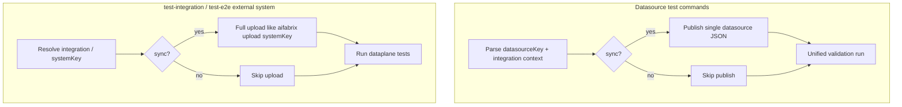

# Test commands: optional `--sync` before dataplane runs

## Problem
Dataplane-backed tests identify the external system and datasource by **key** and run against **whatever configuration is already stored on the dataplane**. Local edits under `integration/<systemKey>/` (e.g. `*-datasource-*.json`) are **not** automatically published when you run `aifabrix datasource test|test-integration|test-e2e` or system-level `test-integration` / `test-e2e`, so tests can exercise an older version.

**Normative parent plan:** [115 — Builder CLI: full testing and certification support](115-testing-tool.plan.md) defines unified validation scopes, **§2.1a** datasource flag registration order (`lib/commands/datasource-unified-test-cli.options.js`), **§2.2** system-level command flag surface, exit matrix **§3.1**, and TTY contracts. Plan 128 adds only a **pre-run publish** step; it must **not** change validation request shapes, exit semantics after the run starts, or renderer ordering for `DatasourceTestRun` output.

## Desired behavior

### Datasource-scoped commands (server-backed)
Commands: `aifabrix datasource test`, `aifabrix datasource test-integration`, `aifabrix datasource test-e2e`.

- **Without `--sync`**: unchanged (POST unified validation using server state).
- **With `--sync`**: publish **only the datasource under test** from local disk to the dataplane, then run the test.
  - Reuse the same publish path as datasource upload: `publishDatasourceViaPipeline` in [`lib/api/pipeline.api.js`](/workspace/aifabrix-builder/lib/api/pipeline.api.js). Exact HTTP shape stays in OpenAPI / `pipeline.api` JSDoc (per 115 — avoid duplicating REST field lists in user docs).

### System-level commands (dataplane-backed)
Commands: `aifabrix test-integration <systemKey>`, `aifabrix test-e2e <systemKey>` when the resolved target is an **external integration** app (`integration/<systemKey>/`, same disambiguation as 115 **§2.0** / `lib/cli/setup-external-system.js`).

- **With `--sync`**: run the **full** upload flow equivalent to **`aifabrix upload <systemKey>`** (system + all datasources), then run the existing test flow.
  - Rationale: avoids partial drift between system JSON and datasource JSONs when only one file changed on disk.
- **§2.2 alignment:** Today system-level commands expose a small flag set (`-e`, `-v`, `-d/--debug`, `-h`). **`--sync`** extends that surface; document it in `lib/cli/setup-app.help.js` and `lib/cli/setup-external-system.help.js` (and any shared external test help) without implying new machine modes (`--json` / `--summary` remain datasource-family only per 115).

### Local command (no server)
Command: `aifabrix test <systemKey>` for external systems (local validation only — no dataplane validation POST).

- **`--sync`**: either **not supported** (error with hint: use `upload` or use dataplane test commands) or **no-op with warning**. Prefer **not supported** to avoid implying server state changed.

### Authentication
- **Same expectation as testing**: user must be logged in (or otherwise have the same auth the upload path already requires). If upload cannot proceed, **fail with a clear error** before running tests (do not silently fall back to stale server config when `--sync` was requested).

## Rules and Standards
This plan must follow Builder standards in:

- **Project rules**: `.cursor/rules/project-rules.mdc`
  - **CLI Command Development**: follow Commander patterns and keep UX consistent (clear errors; non-zero exit on failure).
  - **Code Style**: async/await + try/catch; input validation; meaningful errors; no secrets in logs.
  - **API Client Structure Pattern**: reuse existing `lib/api/*` modules rather than ad hoc HTTP calls.
  - **Testing Conventions**: Jest tests must cover success + error paths; mock external IO.
  - **Quality Gates**: validation must pass before considering the work done.
- **Docs rules**: `.cursor/rules/docs-rules.mdc`
  - Docs under `docs/` must stay **command-centric** (no REST endpoints/payload shapes).
- **Product / CLI contracts (Builder plans):** [115 — unified testing and certification](115-testing-tool.plan.md) — keep flag `--help` order, system vs datasource asymmetry, and exit/TTY rules consistent when adding `--sync`.

## Before Development
- [ ] Read 115 **§2.1a** and confirm where new options belong in `attachDatasourceTestCommonOptions` (registration order is normative: insert **`--sync` after `--timeout` and before `--json`** so “pre-run publish” sits with operational flags before machine/exit modifiers; see comment in `lib/commands/datasource-unified-test-cli.options.js`).
- [ ] Read 115 **§2.2** and list system-level commands that will gain `--sync` only (`test-integration`, `test-e2e` external path; **not** datasource-only flags).
- [ ] Review existing `test*` command wiring patterns in `lib/cli/` and `lib/commands/` so `--sync` is threaded the same way everywhere.
- [ ] Locate the existing implementation behind `aifabrix upload <systemKey>` and identify the function(s) to reuse for system-level `--sync` (avoid a second upload implementation).
- [ ] Identify how datasource tests currently resolve `systemKey` and load local datasource JSON to ensure the `--sync` publish uses the same resolved inputs.
- [ ] Confirm where user-facing output is emitted for these commands so the “Syncing…” banner appears in the right place and doesn’t leak tokens/secrets.
- [ ] Identify the minimal set of modules to mock in Jest for pipeline publish + full upload.

## Definition of Done
Before marking this plan complete:

- **Behavior**
  - `aifabrix datasource test* --sync` publishes only the targeted datasource JSON from disk before starting the dataplane-backed run.
  - `aifabrix test-integration <systemKey> --sync` and `aifabrix test-e2e <systemKey> --sync` (external resolution) perform the same full upload as `aifabrix upload <systemKey>` exactly once before tests.
  - `aifabrix test <systemKey> --sync` (external local path) is handled explicitly (recommended: reject with a clear error + guidance).
  - On any sync failure: exit non-zero and do **not** proceed to run tests.
  - **115 compliance:** No regression to unified validation POST/poll behavior, exit matrix after the run, or `DatasourceTestRun` rendering order; `--help` order for datasource commands stays consistent with **§2.1a** after adding `--sync`.
- **Documentation**
  - If docs are updated, they remain command-centric per `.cursor/rules/docs-rules.mdc` (no REST/API specifics).
- **Quality gates (Builder)**
  - Run `npm run build` — must succeed (`npm run lint && npm run test` per `package.json`).
  - For CI parity with GitHub-style checks: `npm run build:ci` (`lint` + `test:ci`).
  - Aim **≥80%** branch coverage on new/changed code per `.cursor/rules/project-rules.mdc`.

## Implementation outline (aifabrix-builder)

1. **CLI flags**
   - Add `--sync` in [`lib/commands/datasource-unified-test-cli.options.js`](/workspace/aifabrix-builder/lib/commands/datasource-unified-test-cli.options.js) inside `attachDatasourceTestCommonOptions` **after** `--timeout` and **before** `--json` (preserves 115 **§2.1a** grouping). Wire the parsed flag through [`lib/commands/datasource-unified-test-cli.js`](/workspace/aifabrix-builder/lib/commands/datasource-unified-test-cli.js) into `runUnifiedDatasourceValidation` options.
   - Add `--sync` to system-level commands:
     - [`lib/cli/setup-external-system.js`](/workspace/aifabrix-builder/lib/cli/setup-external-system.js) (`test-integration <systemKey>`)
     - [`lib/cli/setup-app.js`](/workspace/aifabrix-builder/lib/cli/setup-app.js) / [`lib/cli/setup-app.test-commands.js`](/workspace/aifabrix-builder/lib/cli/setup-app.test-commands.js) for `test-e2e <systemKey>` (external path)
   - Update help strings in [`lib/cli/setup-app.help.js`](/workspace/aifabrix-builder/lib/cli/setup-app.help.js) and [`lib/cli/setup-external-system.help.js`](/workspace/aifabrix-builder/lib/cli/setup-external-system.help.js) (and datasource help after-blocks in `datasource-unified-test-cli.options.js` if examples mention sync).
   - Propagate `sync` into [`lib/external-system/test.js`](/workspace/aifabrix-builder/lib/external-system/test.js) (`testExternalSystemIntegration`) and [`lib/commands/test-e2e-external.js`](/workspace/aifabrix-builder/lib/commands/test-e2e-external.js).

2. **Datasource `--sync` hook**
   - In [`lib/datasource/unified-validation-run.js`](/workspace/aifabrix-builder/lib/datasource/unified-validation-run.js) (or a small dedicated helper imported there):
     - After resolving `systemKey` + loading local `datasource` JSON, if `options.sync`, call `publishDatasourceViaPipeline(dataplaneUrl, systemKey, authConfig, datasource)`.
     - Then proceed with existing `postValidationRunAndOptionalPoll`.

3. **System-level `--sync` hook**
   - Extract or reuse the existing upload implementation used by `aifabrix upload <systemKey>` (likely under external-system upload command modules) so `--sync` calls the **same code path** as the CLI upload (not a second divergent implementation).
   - Invoke it once at the start of:
     - `testExternalSystemIntegration` when `options.sync`
     - `runTestE2EForExternalSystem` when `options.sync`

4. **User feedback**
   - When `--sync` is enabled, print a short banner **before** the normal validation progress / TTY output from 115 (e.g. “Syncing local config to dataplane…”) then success/failure; do not interleave sync logs inside `DatasourceTestRun` sections.
   - On sync failure: exit non-zero **before** tests.

5. **Tests**
   - Jest tests mocking `publishDatasourceViaPipeline` and the full-upload function to assert:
     - datasource commands call publish once when `--sync`
     - system-level commands call full upload once when `--sync`
     - local `test` rejects or ignores `--sync` per chosen behavior

## Documentation
- Update builder command docs only if the repo already documents these flags in `docs/commands/` (keep user-facing docs command-centric per builder docs rules: describe behavior, not raw HTTP paths).

## Plan Validation Report

**Date**: 2026-04-16 (re-validated after 115 plan update)  
**Plan**: `.cursor/plans/128-test-commands-sync-flag.plan.md`  
**Status**: ✅ VALIDATED

### Plan purpose
Add an opt-in `--sync` flag to dataplane-backed test commands so local integration JSON is published before running tests, preventing stale server-side config from being exercised.

### Scope and type
- **Type**: CLI feature + testing
- **Primary areas**: CLI wiring (`lib/cli/*`, `lib/commands/*`), dataplane publish/upload reuse (`lib/api/*`, external system upload code), Jest tests, optional docs updates

### Applicable rules and plans
- ✅ `.cursor/rules/project-rules.mdc` (CLI patterns, error handling, security, testing, quality gates)
- ✅ `.cursor/rules/docs-rules.mdc` (if editing `docs/commands/*`, keep docs command-centric; avoid REST details)
- ✅ [115 — Builder CLI: unified testing and certification](115-testing-tool.plan.md) — **§2.1a** (`datasource-unified-test-cli.options.js` help order), **§2.2** (system-level flag surface + help files), **§3** exit/TTY (no change to post-run semantics)

### Rule compliance check (after updates in this plan)
- ✅ Includes rule references and doc-policy constraint
- ✅ Includes a pre-development checklist focused on reuse, **115 §2.1a/§2.2** alignment, and scope control
- ✅ Includes Definition of Done with explicit build → lint → test gates and **≥80%** coverage target for new code
- ✅ Traceability to plan **115** and explicit “no regression” constraints on validation/TTY

### Recommendations
- Reuse the existing `aifabrix upload <systemKey>` implementation for system-level `--sync` exactly (no parallel “almost the same” upload path).
- Ensure `--sync` failures are loud and early (non-zero exit before any tests run), to avoid false confidence from stale config.
- When plan **115** §2.1a/§2.2 tables are next edited for documentation parity, add **`--sync`** to the normative flag list in **115** so both plans stay single-sourced.

## Implementation Validation Report

**Date**: 2026-04-16  
**Plan**: `.cursor/plans/128-test-commands-sync-flag.plan.md`  
**Status**: ✅ COMPLETE (minor follow-ups below)

### Executive summary
All YAML implementation todos are **completed**. Code implements datasource `--sync` via `publishDatasourceViaPipeline`, system-level `--sync` via `uploadExternalSystem` from `lib/commands/upload.js`, builder/unsupported paths with explicit errors, and CLI help notes in `lib/cli/setup-app.help.js`. `npm run lint:fix`, `npm run lint`, and `npm test` all pass with **zero ESLint warnings**.

### Task completion (frontmatter `todos`)
| id | status |
|----|--------|
| cli-sync-flags | ✅ completed |
| sync-datasource-publish | ✅ completed |
| sync-system-full-upload | ✅ completed |
| local-test-sync-policy | ✅ completed |
| jest-coverage | ✅ completed |

**Markdown “Before Development” checkboxes** (lines 68–74) remain unchecked; those are preparatory notes, not tracked todos.

### File existence validation
| Path | Status |
|------|--------|
| `lib/commands/datasource-unified-test-cli.options.js` (`--sync` after `--timeout`, before `--json`) | ✅ |
| `lib/commands/datasource-unified-test-cli.js` (`sync` in run opts) | ✅ |
| `lib/datasource/unified-validation-run.js` (`publishDatasourceViaPipeline` + `requireBearerForDataplanePipeline`) | ✅ |
| `lib/datasource/test-integration.js`, `lib/datasource/test-e2e.js` | ✅ |
| `lib/cli/setup-external-system.js` (`--sync`, guards, pass-through) | ✅ |
| `lib/cli/setup-app.test-commands.js` (`test` / `test-e2e` `--sync`, rejections) | ✅ |
| `lib/cli/setup-app.help.js` (help notes) | ✅ |
| `lib/cli/setup-external-system.help.js` | ⚠️ **Not present** — `test-integration` help uses `TEST_INTEGRATION_HELP_AFTER` from `setup-app.help.js` (see `setup-external-system.js` import). No gap vs behavior. |
| `lib/external-system/test.js` (`testExternalSystemIntegration` sync) | ✅ |
| `lib/commands/test-e2e-external.js` (`syncLocalIfRequested` + `uploadExternalSystem`) | ✅ |

### Test coverage
| Area | Test file / location | Status |
|------|----------------------|--------|
| Datasource sync → publish then POST | `tests/lib/datasource/unified-validation-run.test.js` (success, no-sync, publish failure) | ✅ |
| System E2E sync → full upload once | `tests/lib/commands/test-e2e-external.test.js` (`uploadExternalSystem` mock) | ✅ |
| `aifabrix test <app> --sync` rejection | No dedicated Jest test found | ⚠️ Optional: add CLI/unit test asserting thrown message |

### Code quality validation
- **Format / lint:fix**: ✅ PASSED (exit 0)
- **Lint**: ✅ PASSED (exit 0, **0 warnings, 0 errors**)
- **Tests**: ✅ PASSED (`npm test` full suite)

### Cursor rules compliance (spot-check vs `.cursor/rules/project-rules.mdc`)
- **API reuse**: ✅ `lib/api/pipeline.api.js` + `lib/commands/upload.js` (no ad hoc HTTP for sync)
- **Logging**: ✅ `logger` / `chalk` for banners (no `console.log` in new paths)
- **Async / errors**: ✅ `async`/`await`; publish failure throws before validation in `unified-validation-run.js`
- **Security**: ✅ No secrets in new log strings
- **Complexity**: ✅ `runTestE2EForExternalSystem` refactored with `syncLocalIfRequested` helper (ESLint complexity within limit)

### Implementation completeness vs plan outline
- **§1–3 CLI + hooks + upload reuse**: ✅ Implemented as specified
- **§4 User feedback**: ✅ “Syncing local config to dataplane…” / “✔ Sync complete” before validation flow
- **§5 Tests**: ✅ Datasource + system E2E; ⚠️ local `test --sync` rejection not covered by automated test
- **`docs/commands/`** (plan optional): Not required by plan completion; help text updated in `setup-app.help.js` only

### Issues and recommendations
1. Add a small Jest test (e.g. mock `detectAppType` + invoke `test` action handler or test a tiny exported guard) for **`aifabrix test <app> --sync`** rejection to match plan §5 bullet on local `test`.
2. Optionally extend `external-system-test` or CLI tests for **`testExternalSystemIntegration` + `sync: true`** calling `uploadExternalSystem` once (currently covered indirectly via E2E external tests + unified-validation-run).
3. Keep plan **115** flag tables in sync when next edited (per prior Plan Validation Report).

### Final validation checklist
- [x] All YAML todos completed
- [x] All implementation files exist and contain `--sync` / upload / publish wiring
- [x] Unit tests exist for primary new behavior (unified run + E2E external upload)
- [x] `npm run lint:fix` → `npm run lint` → `npm test` all green (no lint warnings)
- [x] Reuses `uploadExternalSystem` and `publishDatasourceViaPipeline` (single code paths)
- [ ] Dedicated automated test for `aifabrix test --sync` rejection (recommended follow-up)
