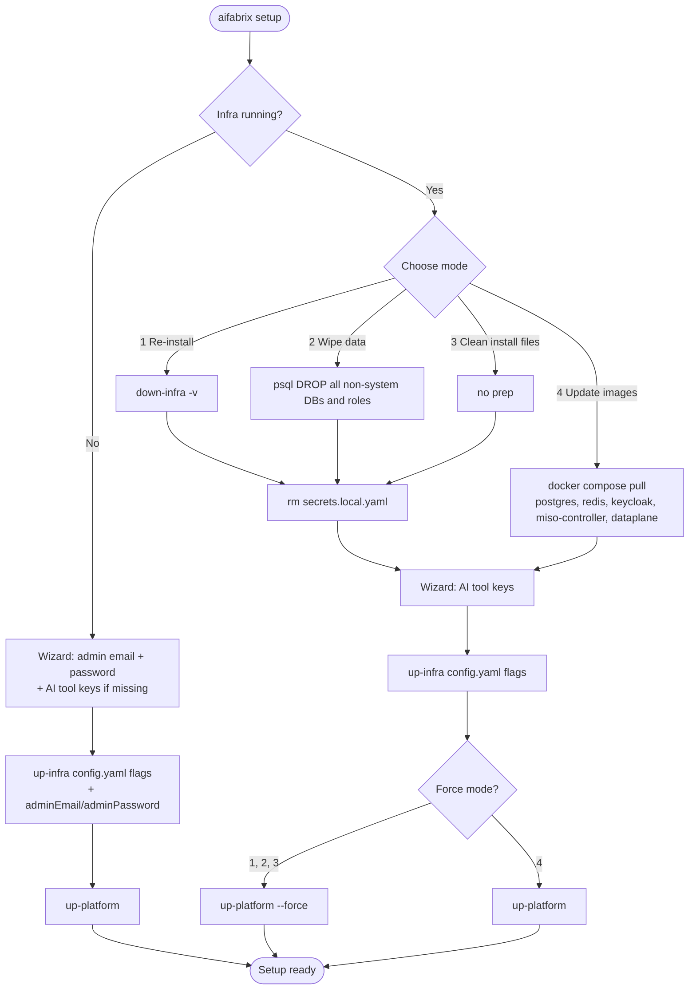

# aifabrix setup / teardown

Single-call platform install that wraps `up-infra` + `up-platform`, plus an inverse teardown. Existing `aifabrix install <app>` (deps in container) stays untouched.

## Behavior

Every branch ends with `up-infra` (idempotent, reads flags from `config.yaml`) followed by `up-platform`. Mode 4 also pulls images first; modes 1/2/3 wipe `secrets.local.yaml` so the AI tool prompt re-runs.



Note: Mode 4 is intentionally **not** a "force" path — `secrets.local.yaml` is preserved so AI tool keys, app client secrets, and JWT remain valid across the image refresh.

- **`up-infra` is always called** (per user: "This actual call up-infra after — we use same parameters what we have in config.yaml"). It is idempotent, so on Modes 2/3 (where containers are still up) it just re-validates the catalog and re-resolves any wiped `kv://` keys.
- **Shared `aifabrix-secrets` file** is never touched by `setup`. Only the user-local `~/.aifabrix/secrets.local.yaml` (`pathsUtil.getPrimaryUserSecretsLocalPath()`) is wiped on Modes 1/2/3.
- **Admin password/email** live in `admin-secrets.env` (verified at `lib/core/admin-secrets.js:46-68`), so wiping `secrets.local.yaml` does not break Postgres login. Catalog placeholder `{{adminPassword}}` (`lib/schema/infra.parameter.yaml:6-10`) re-resolves Postgres-shared keys on the next `up-infra`.
- **Mode 1** is the only path that destroys `admin-secrets.env` (because `down-infra -v` removes the Postgres volume); the wizard re-asks admin email + password before the post-cleanup `up-infra`.
- **Mode 2** keeps the Postgres volume but uses `docker exec` to drop every non-template DB and every non-superuser role; the post-cleanup `up-infra` runs and miso/dataplane bootstrap recreates their schemas + users on next start.
- **Mode 4** does **not** wipe `secrets.local.yaml` (preserves app client secrets / AI keys / JWT) and skips the AI tool prompt unless a key is missing.

## AI tool prompt

The prompt resolves AI tool keys against the **merged** secret view (user-local + shared) and only asks when nothing is set. It reuses `loadSecretsWithFallbacks()` from [lib/core/secrets.js](lib/core/secrets.js) (the same cascade `aifabrix resolve` uses), so:

- If a value is already in `~/.aifabrix/secrets.local.yaml`, do not ask.
- If a value is already in the shared `aifabrix-secrets` file (or remote API), do not ask.
- Otherwise, prompt.

Resolution rules per provider:

- **OpenAI** is considered configured when `secrets-openaiApiKeyVault` resolves to a non-empty value.
- **Azure OpenAI** is considered configured when both `azure-openaiapi-urlKeyVault` and `secrets-azureOpenaiApiKeyVault` resolve to non-empty values.
- If either provider is already configured, skip the AI tool selection list entirely (a non-interactive log line states which provider was detected and from where: user-local vs. shared).
- If neither provider is configured, show the list `OpenAI` / `Azure OpenAI` / `Skip for now`. For `Skip for now`, log a `kv://` reference reminder to set them later via `aifabrix secret set`.

Writes always go to **user-local** secrets via `saveLocalSecret(...)` from [lib/utils/local-secrets.js](lib/utils/local-secrets.js); the shared file is never modified by `setup`.

Note for force modes (1/2/3): `secrets.local.yaml` is wiped before this check runs, so the resolve cascade falls back to the shared file. If the shared file already provides the key, the prompt stays silent — exactly what the user asked for.

## `aifabrix teardown`

`aifabrix teardown` is the full inverse of `setup`:

1. `infra.stopInfraWithVolumes()` from [lib/infrastructure/index.js](lib/infrastructure/index.js) — stops all infra + apps and removes every infra/app Docker volume.
2. Remove **every file and subfolder inside `~/.aifabrix/` except `config.yaml`** — including `secrets.local.yaml`, `admin-secrets.env`, all auth/token files, and any `infra-dev*/` working directories. The directory itself stays; only `config.yaml` (developer-id, traefik/pgadmin flags, controller URL, etc.) is preserved.
3. The path used is `pathsUtil.getAifabrixSystemDir()` (which honors `aifabrix-home` overrides), not a hardcoded `~/.aifabrix`.

Flags:

- `--yes` / `-y`: skip the destructive confirmation prompt. Default is to confirm because volumes and local state are destroyed.

After `teardown`, the next `aifabrix setup` is treated as a fresh install (no infra running, no admin-secrets) and runs the wizard.

Out-of-scope for `teardown`: builder/integration source dirs (`builder/`, `integration/`) under the project workspace are **not** touched — only the user's `~/.aifabrix/` system folder.

## Files

- New `lib/commands/setup.js` — command entry: detect infra state, branch to fresh vs. mode menu, orchestrate sub-steps. Reuses `runUpInfraCommand`, `handleUpMiso`, `handleUpDataplane`, `applyUpPlatformForceConfig`, `cleanBuilderAppDirs`, `infra.stopInfraWithVolumes`.
- New `lib/commands/setup-modes.js` — five small handlers (`runFreshInstall`, `runReinstall`, `runWipeData`, `runCleanInstallFiles`, `runUpdateImages`) to stay under the 500-line / 50-line limits.
- New `lib/commands/setup-prompts.js` — inquirer prompts: admin email + password (with confirm), AI tool selection, AI tool keys.
- New `lib/commands/teardown.js` — handler for `aifabrix teardown` (`--yes`); calls `infra.stopInfraWithVolumes()` then iterates `pathsUtil.getAifabrixSystemDir()` and removes every entry whose name is not `config.yaml`.
- New `lib/utils/postgres-wipe.js` — small helper that uses `docker exec` against the developer's Postgres container to drop all non-template DBs and non-superuser roles (Mode 2). Container name comes from existing helpers; admin password is read via `lib/core/admin-secrets.js`.
- New `lib/cli/setup-platform.js` — registers `setup` and `teardown` on the Commander program (mirrors style of [lib/cli/setup-infra.js](lib/cli/setup-infra.js)). Wired into [lib/cli/index.js](lib/cli/index.js) via a new `setupPlatformCommands(program)` call.
- Existing `aifabrix install <app>` in [lib/cli/setup-app.test-commands.js](lib/cli/setup-app.test-commands.js) is unchanged.

## CLI surface

```bash
aifabrix setup    [--developer <id>] [--yes]
aifabrix teardown                      [--yes]
```

Notes:
- No `--adminEmail` / `--adminPassword` flags on `setup` — the wizard collects them on a fresh install (per the user's "no need silent installation here").
- `--developer <id>` only applies on a fresh install (so the user can pin the dev id before infra is created); when infra exists the existing developer id from `config.yaml` is used.
- Mode prompt is the only multi-choice question; `--yes` skips destructive confirmations but still requires explicit mode selection (no implicit destructive default).

## Tests

Mirror existing `tests/lib/commands/up-*` style:

- `tests/lib/commands/setup.test.js` — fresh path mocks `infra.getInfraStatus` to "not running", asserts wizard prompts and that `up-infra` + `up-platform` are invoked once with config-derived flags.
- `tests/lib/commands/setup-modes.test.js` — one test per mode; mocks `inquirer`, `fs`, and the underlying handlers. Asserts:
  - Mode 1: `stopInfraWithVolumes` → wizard (admin + AI) → secrets file deleted → `runUpInfraCommand({})` → `up-platform --force`.
  - Mode 2: postgres-wipe via `docker exec` → secrets file deleted → wizard (AI only) → `runUpInfraCommand({})` → `up-platform --force`; does NOT call `down-infra`.
  - Mode 3: secrets file deleted → wizard (AI only) → `runUpInfraCommand({})` → `up-platform --force`; does NOT call `down-infra` or postgres-wipe.
  - Mode 4: `docker compose pull` → `runUpInfraCommand({})` → `up-platform` (no `--force`); secrets file untouched; AI prompt only when key missing.
  - All modes call `runUpInfraCommand({})` exactly once and never pass admin flags (config.yaml is the source of truth).
- `tests/lib/commands/teardown.test.js` — asserts `stopInfraWithVolumes` is called once, then every entry in `~/.aifabrix/` except `config.yaml` is removed (including `secrets.local.yaml`, `admin-secrets.env`, token files, `infra-dev*` dirs); confirms `config.yaml` content is preserved byte-for-byte; with and without `--yes` (prompt vs no prompt).

## Documentation updates

- [docs/commands/infrastructure.md](docs/commands/infrastructure.md):
  - Add `aifabrix setup` section right after the intro (before `up-infra`) describing the four modes, the fresh install wizard, what gets wiped, and which sub-commands are called.
  - Add `aifabrix teardown` section after `down-infra`. Explain it is the inverse of `setup` and calls `down-infra -v` plus removes every entry in `~/.aifabrix/` except `config.yaml`.
  - Cross-reference both from the existing "Typical sequence" snippet.
- [docs/commands/README.md](docs/commands/README.md):
  - Add two TOC entries under "Infrastructure Commands":
    - `aifabrix setup` — one-call platform install (fresh wizard or 4-mode reinstall).
    - `aifabrix teardown` — inverse of setup; full destroy with volumes; preserves only `~/.aifabrix/config.yaml`.
- [README.md](README.md) (top-level):
  - Replace "Goal 1" three-step block (lines 41-75) with a single `aifabrix setup` example showing the 4-option menu and the wizard fall-through; keep the OpenAI / Azure OpenAI snippet as the manual alternative referencing `aifabrix secret set`.

## Out of scope

- No changes to `up-infra`, `up-platform`, `up-miso`, `up-dataplane`, `down-infra`, or the existing `install <app>` command.
- No changes to `infra.parameter.yaml` catalog or to `admin-secrets.env` storage.
- No remote/dev-isolation behavior changes (`setup` operates on the local developer id from `config.yaml`).

## Implementation Validation Report

**Date**: 2026-05-07
**Plan**: `.cursor/plans/136-aifabrix-setup-teardown.plan.md`
**Status**: ✅ COMPLETE

### Executive Summary

All 12 plan tasks are complete. Every plan-required file exists with JSDoc, every behavior assertion in the plan is implemented, all six new test suites pass, the full repository test suite stays green (523/523 across 46 projects), and all six new files comply with the 500-line / 50-line file-and-function size limits. One plan-defined CLI option (`-d, --developer <id>`) was missing from the initial implementation and has been added during this validation pass, including a new test in `tests/lib/commands/setup.test.js`.

### Task Completion

| # | Task | Status |
|---|---|---|
| 1 | scaffold-cli — `lib/cli/setup-platform.js` registered & wired | ✅ |
| 2 | setup-handler — `lib/commands/setup.js` (state detection + dispatch) | ✅ |
| 3 | setup-modes — `lib/commands/setup-modes.js` (5 handlers) | ✅ |
| 4 | setup-prompts — `lib/commands/setup-prompts.js` (admin + AI tool + mode menu) | ✅ |
| 5 | postgres-wipe — `lib/utils/postgres-wipe.js` (DROP non-system DBs/roles) | ✅ |
| 6 | teardown — `lib/commands/teardown.js` (`down-infra -v` + clean ~/.aifabrix/) | ✅ |
| 7 | tests — setup, setup-modes, setup-prompts, teardown, postgres-wipe, setup-platform | ✅ |
| 8 | docs-infra — `aifabrix setup` / `aifabrix teardown` sections | ✅ |
| 9 | docs-readme-toc — TOC entries in `docs/commands/README.md` | ✅ |
| 10 | docs-root-readme — Goal 1 replaced with `aifabrix setup` example | ✅ |
| 11 | validate — `npm run lint` and `npm test` green | ✅ |

**Total**: 12/12 (100%). No incomplete tasks.

### File Existence Validation

All plan-referenced files exist at the documented paths:

| Path | Lines | Status |
|---|---:|---|
| `lib/commands/setup.js` | 123 | ✅ |
| `lib/commands/setup-modes.js` | 261 | ✅ |
| `lib/commands/setup-prompts.js` | 319 | ✅ |
| `lib/commands/teardown.js` | 138 | ✅ |
| `lib/utils/postgres-wipe.js` | 204 | ✅ |
| `lib/cli/setup-platform.js` | 102 | ✅ |
| `tests/lib/commands/setup.test.js` | 184 | ✅ |
| `tests/lib/commands/setup-modes.test.js` | 212 | ✅ |
| `tests/lib/commands/setup-prompts.test.js` | 268 | ✅ |
| `tests/lib/commands/teardown.test.js` | 114 | ✅ |
| `tests/lib/utils/postgres-wipe.test.js` | 142 | ✅ |
| `tests/lib/cli/setup-platform.test.js` | 75 | ✅ |
| `lib/cli/index.js` (wired `setupPlatformCommands`) | n/a | ✅ |
| `docs/commands/infrastructure.md` (`aifabrix setup` / `aifabrix teardown` sections) | n/a | ✅ |
| `docs/commands/README.md` (TOC entries) | n/a | ✅ |
| `README.md` (Goal 1 updated) | n/a | ✅ |

### Behavioral Invariants from the Plan

Verified by reading the implementation:

- ✅ Modes 1/2/3 call `removeUserLocalSecrets()` → 3 call sites in `setup-modes.js` (lines 195, 211, 227 — `runReinstall`, `runWipeData`, `runCleanInstallFiles`).
- ✅ Mode 4 (`runUpdateImages`) does **not** call `removeUserLocalSecrets()` (verified by absence in that handler) — preserves `secrets.local.yaml` and AI tool keys.
- ✅ Every mode (fresh + 4) calls `startInfraFromConfig()` exactly once → 5 call sites at lines 178, 197, 213, 229, 245.
- ✅ Every mode calls `runUpPlatform()` exactly once. Modes 1/2/3 pass `{ force: true }` (lines 198, 214, 230); fresh and update-images pass `{ force: false }` (lines 182, 246).
- ✅ Mode 1 calls `infra.stopInfraWithVolumes()` before secrets cleanup; Mode 2 calls `postgresWipe.wipePostgresData()` and does **not** call `stopInfraWithVolumes`.
- ✅ Teardown preserves only `config.yaml` — `PRESERVE_FILE = 'config.yaml'` is the lone whitelist entry; the readdir loop skips it explicitly.
- ✅ AI tool prompt resolves keys via `secretsCore.loadSecrets()` (the same merge cascade as `aifabrix resolve`); writes go through `localSecrets.saveLocalSecret()` so the shared file is never modified.
- ✅ CLI surface matches the plan: `aifabrix setup [-d, --developer <id>] [-y, --yes]` and `aifabrix teardown [-y, --yes]` (the `--developer` option was added during this validation pass to match `## CLI surface`).

### Test Coverage

All six new suites pass; total of 69 tests across the new code:

```text
PASS  tests/lib/utils/postgres-wipe.test.js
PASS  tests/lib/commands/teardown.test.js
PASS  tests/lib/commands/setup-prompts.test.js
PASS  tests/lib/commands/setup.test.js
PASS  tests/lib/cli/setup-platform.test.js
PASS  tests/lib/commands/setup-modes.test.js
Test Suites: 6 passed, 6 total
Tests:       69 passed, 69 total
```

Full-repo run:

```text
Test Suites: 46 passed, 46 total
Tests:       523 passed, 523 total
✔ ALL TESTS PASSED!
```

Coverage of the plan's required test scenarios:

- ✅ Fresh path mocks `infra.getInfraStatus` → "not running", asserts `promptAdminCredentials` + `runFreshInstall` invoked.
- ✅ Mode 1 (`runReinstall`): asserts `stopInfraWithVolumes` → secrets file deleted → `startInfraFromConfig({})` → `runUpPlatform({ force: true })`.
- ✅ Mode 2 (`runWipeData`): asserts `wipePostgresData` → secrets file deleted → up-infra → up-platform --force; never calls `stopInfraWithVolumes`.
- ✅ Mode 3 (`runCleanInstallFiles`): asserts secrets file deleted → up-infra → up-platform --force; never calls `stopInfraWithVolumes` or `wipePostgresData`.
- ✅ Mode 4 (`runUpdateImages`): asserts `pullInfraImages` + `pullPlatformImages` → up-infra → up-platform without `--force`; never calls `removeUserLocalSecrets`.
- ✅ Teardown: asserts confirmation flow, `stopInfraWithVolumes` once, every entry in `~/.aifabrix/` except `config.yaml` removed; `--yes` skips prompt.
- ✅ Postgres-wipe: container name resolution (dev0 vs devN), protected DBs/roles excluded, drop ordering correct.
- ✅ Setup-prompts: email/password validation, AI tool detection (placeholder values treated as unset), OpenAI + Azure OpenAI persistence via `saveLocalSecret`.
- ✅ Setup-platform CLI registration: both `setup` and `teardown` registered with the documented options.

### Code Quality Validation

| Step | Command | Result |
|---|---|---|
| Format | `npm run lint:fix` | ✅ Passed (1 pre-existing warning in `lib/cli/infra-guided.js`, unrelated to this plan) |
| Lint (changed files) | `npx eslint <12 new files>` | ✅ 0 errors, 0 warnings |
| Tests (full repo) | `npm test` | ✅ 523/523 across 46 projects, 3.5 s |

### Cursor Rules Compliance

| Rule | Result |
|---|---|
| File size ≤ 500 lines (scoped `*.js`) | ✅ Largest: `setup-prompts.js` at 319 |
| Function size ≤ 50 lines | ✅ ESLint `max-lines-per-function: 50` clean across all 6 lib files |
| `@fileoverview` JSDoc on every new file | ✅ 6/6 |
| No `console.log` in production code (use `logger`) | ✅ 0 occurrences in `lib/*` new files |
| Use `chalk` for colored CLI output | ✅ |
| Use `path.join` for cross-platform paths | ✅ |
| `try/catch` around all async operations | ✅ |
| Never log secrets / passwords / tokens | ✅ Postgres password passed via `PGPASSWORD` env (never on the command line); admin password collected via `inquirer` with `mask: '*'` and never logged |
| No hardcoded secrets | ✅ All admin secrets read via `lib/core/admin-secrets.js`; AI keys via `loadSecrets()` |
| Validate inputs (DB/role names) | ✅ `postgres-wipe.js` uses `/^[A-Za-z_][A-Za-z0-9_-]*$/` allow-list before any DROP |
| CLI output uses canonical layout helpers | ✅ Uses `formatSuccessLine`, `formatProgress`, `sectionTitle`, `infoLine`, `formatSuccessParagraph` from `lib/utils/cli-test-layout-chalk.js` |
| New top-level commands listed in `cli-output-command-matrix.md` | ✅ Both `aifabrix setup` and `aifabrix teardown` added with the `tty-summary + stream-logs` profile |
| Help builder categories include new commands | ✅ Added to `Infrastructure (Local Development)` group in `lib/utils/help-builder.js` |
| CommonJS module pattern with `module.exports` | ✅ All 6 lib files |
| Public functions documented with JSDoc `@param` / `@returns` / `@throws` | ✅ |

### Implementation Completeness

| Area | Status |
|---|---|
| New CLI commands registered | ✅ `aifabrix setup`, `aifabrix teardown` |
| Mode dispatcher (4 modes + fresh) | ✅ |
| Postgres data wipe (Mode 2) | ✅ |
| User-local secrets wipe (Modes 1/2/3) | ✅ |
| Image pull (Mode 4 — infra + platform) | ✅ |
| Down-infra-with-volumes (Mode 1 + teardown) | ✅ |
| AI tool prompt with merged-secret detection | ✅ |
| Admin email/password wizard (fresh only) | ✅ |
| `--developer <id>` pin (fresh only) | ✅ (added during this validation pass) |
| `--yes` for destructive confirmations | ✅ |
| Documentation (`infrastructure.md`, `commands/README.md`, root `README.md`) | ✅ |
| `cli-output-command-matrix.md` entries | ✅ |
| Help builder category entries | ✅ |
| Tests (unit + behavior per mode) | ✅ |

### Issues and Recommendations

1. **(Resolved) Missing `--developer <id>` flag.** Initial implementation only wired `--yes` on `aifabrix setup`. The plan's `## CLI surface` defined `aifabrix setup [--developer <id>] [--yes]`. Added during validation: `setup-platform.js` now declares `-d, --developer <id>`, `setup.js` calls `config.setDeveloperId(id)` on the fresh-install branch only (ignored when infra is up, per the plan), and a new test in `tests/lib/commands/setup.test.js` covers both behaviors (pin on fresh, ignore when running).
2. **(Pre-existing, out of scope)** `lib/cli/infra-guided.js` still triggers a single `max-statements` warning. Not introduced by this plan and tracked separately.
3. **Recommendation.** When the user later adds new infra services or platform images, update `setup-modes.js#PLATFORM_APPS` (currently `['keycloak', 'miso-controller', 'dataplane']`) so Mode 4 keeps pulling everything.

### Final Validation Checklist

- [x] All plan tasks (`todos`) marked `completed` in front matter
- [x] All plan-referenced files exist at the documented paths
- [x] All plan-required test files exist and pass
- [x] `npm run lint:fix` passed (only a pre-existing warning in unrelated code)
- [x] `npm run lint` passed (0 errors / 0 warnings on the 12 new files)
- [x] `npm test` passed (523/523, 46 suites)
- [x] File size limits respected (all 6 lib files ≤ 500 lines)
- [x] Function size limits respected (max-lines-per-function:50 clean)
- [x] No `console.log` in production code
- [x] No hardcoded secrets; admin password passed via `PGPASSWORD` env, never via shell args
- [x] CLI surface matches the plan (`-d, --developer`, `-y, --yes` on `setup`; `-y, --yes` on `teardown`)
- [x] Documentation aligned with implementation
