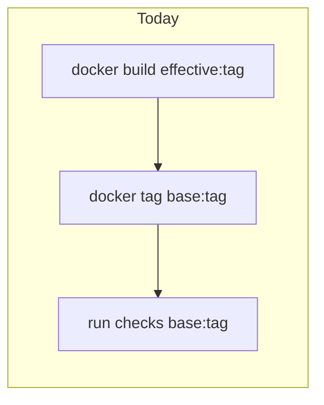

# Dev-scoped build tags, single `--base`, and run image resolution

## Overview

- **Build**: Default to **developer-scoped** image names when a **developer id** is configured; **if there is no developer id**, build and tag as the **base** (manifest) image—no `*-devN` suffix.
- **Tagging**: Use a **single** `--tag` per command (e.g. `latest` or `1.9.5`). **Do not** support comma-separated multiple tags in one invocation.
- **Unified `--base` (boolean)**:
  - **`aifabrix build <app>`**: When `--base` is set **and** a dev id exists, also apply the compat tag (`effective` → manifest base name), equivalent to “publish-style” base tagging. When **no** dev id, build already targets base; `--base` may be redundant or documented as no-op / validation-only—implementation should pick one consistent behavior.
  - **`aifabrix run <app>`** (and any internal run path): When `--base` is set, **skip** local dev-first resolution and use the **manifest base** image (latest approved / canonical ref for that tag). When `--base` is unset, keep **dev first, then base** fallback.
- **Bootstrap / platform commands**: `aifabrix setup`, `aifabrix up-platform`, `aifabrix up-miso`, and `aifabrix up-dataplane` should pass or default **`--base`** so these flows **run from the approved base images** (not dev-preferring local tags), matching “get latest approved image” behavior.
- **Documentation**: Update files under [`docs/`](docs/) alongside code changes (CLI user docs—command behavior, flags, prerequisites; follow [`docs-rules.mdc`](.cursor/rules/docs-rules.mdc): no raw REST/API endpoint detail in user-facing CLI docs).

## Current behavior (why this surprises users)

- **Build**: [`executeDockerBuildWithTag`](lib/utils/docker-build.js) builds `effectiveImageName:tag` (`buildDevImageName(base, devId)`, e.g. `miso-controller-dev2:latest`), then **always** runs `docker tag … ${effective}:${tag} ${base}:${tag}` (“compatibility tag”). So every build creates **both** dev and root local refs.
- **Run**: [`resolveDockerImageRef`](lib/utils/resolve-docker-image-ref.js) / [`resolveRunImage`](lib/app/run-resolve-image.js) resolve **`manifest` repo + tag** (root path), **not** `-devN`. Runs worked because the compat tag populated `miso-controller:latest`. Removing/changing that tag breaks today’s implicit coupling.

## Target behavior

1. **Developer id present — build (default)**  
   - Produce **only** `effectiveImageName:tag` (developer-scoped).  
   - **Do not** create `baseName:tag` unless **`--base`** is set (compat `docker tag`).

2. **No developer id — build**  
   - Build/tag as **base** image (`manifest` repository name + `--tag`), **not** `*-devN`.

3. **Single tag**  
   - One `--tag` argument per invocation; no `latest,1.9.5` multi-tag strings.

4. **Run (default, dev id may or may not matter for naming)**  
   - If **`--image`** is set → unchanged (full override).  
   - Else if **`--base`** → use **root/base** ref only (manifest-approved for that tag).  
   - Else → **`await checkImageExists(devRepo, tag)`**; if true use dev; else **`checkImageExists(rootRepo, tag)`**; else error with existing hints.

5. **Infra / setup**  
   - [`lib/cli/setup-infra.js`](lib/cli/setup-infra.js) (`up-platform`, `up-miso`, `up-dataplane`), [`lib/cli/setup-platform.js`](lib/cli/setup-platform.js) (`setup`), and orchestration in [`lib/commands/setup-modes.js`](lib/commands/setup-modes.js) should thread **`--base`** (default **on** for these commands, unless overridden) into whatever resolves or pulls platform images so operators get **latest approved base** images, not dev-first local resolution.

## Registry / qualified repository names

- **Local short names** (`miso-controller`): dev repo = `buildDevImageName('miso-controller', devId)`.  
- **Qualified refs** (`registry/ns/app`): define one rule and document it—recommended **suffix the last path segment** only: `registry/ns/app` → `registry/ns/app-dev2`, matching how [`pickBaseFromDockerLines`](lib/utils/build-resolve-image.js) strips `-devN`. If that is too risky for some registries, gate qualified-repo behavior behind the same rule used at build time (build currently tags **short** names from manifest).

## Implementation outline

| Area | Change |
|------|--------|
| [lib/utils/docker-build.js](lib/utils/docker-build.js) | If **no** dev id → build/tag **base** only. If dev id → gate compat `docker tag effective → base` on **`options.base === true`**. Default **false** for compat tag when dev id present. |
| [lib/build/index.js](lib/build/index.js) | Pass `base` from CLI; branch effective image name when dev id missing (use manifest base name). |
| [lib/utils/image-name.js](lib/utils/image-name.js) | Clarify or extend helpers so “no dev id” path does not append `-devN`. |
| [lib/cli/setup-app.js](lib/cli/setup-app.js) | `--tag` (single), `--base` for build/run; wire to `app.buildApp` / `app.runApp`. Follow [.cursor/rules/cli-layout.mdc](.cursor/rules/cli-layout.mdc) and update [cli-output-command-matrix.md](.cursor/rules/cli-output-command-matrix.md). |
| [lib/cli/setup-infra.js](lib/cli/setup-infra.js) | Add `--base` (default **true**) on `up-platform`, `up-miso`, `up-dataplane`; pass through to handlers. |
| [lib/cli/setup-platform.js](lib/cli/setup-platform.js) | Ensure `setup` flows pass **`--base`** into `up-platform` / chained commands. |
| [lib/commands/up-miso.js](lib/commands/up-miso.js), [lib/commands/up-dataplane.js](lib/commands/up-dataplane.js), [lib/commands/up-common.js](lib/commands/up-common.js) | Thread option into image resolution / template generation as needed. |
| New or extend [lib/app/run-resolve-image.js](lib/app/run-resolve-image.js) | **`async resolveRunImageWithLocalFallback(...)`** with `--base` skipping dev probe; use `checkImageExists` from [lib/utils/app-run-containers.js](lib/utils/app-run-containers.js). |
| [lib/app/run-helpers.js](lib/app/run-helpers.js), [lib/app/run.js](lib/app/run.js), [lib/app/run-container-start.js](lib/app/run-container-start.js) | Async prerequisites; merge resolved ref into `options` for compose overrides. |

## Tests

- **docker-build**: No dev id → base tag only, no `-devN`. With dev id → compat tag only when `--base`.
- **run-resolve**: Dev exists → dev; dev missing, root exists → root; `--base` → root only; neither → error.
- **Infra**: Options parsing — `up-platform` / `up-miso` / `up-dataplane` receive `--base` default true (or explicit false).

## Documentation

- **`docs/`**: Describe `--tag`, `--base`, and bootstrap defaults (`setup`, `up-*`) in command-centric language; link from [docs/commands/README.md](docs/commands/README.md) if adding new pages.
- **Developer-only**: `cli-output-command-matrix.md` and JSDoc per project rules.

## Risks / follow-ups

- **Breaking change**: Users who relied on **only** `base:latest` after a local dev build must pass **`--base`** on build once, or rely on **run** fallback pulling base.
- **Remote Docker**: `checkImageExists` must remain consistent with [`execWithDockerEnv`](lib/utils/docker-exec.js).

## Rules and Standards

This plan must comply with [Project Rules](.cursor/rules/project-rules.mdc):

- **[CLI layout and output](.cursor/rules/project-rules.mdc#cli-layout-and-output)** — Any new/changed flags or terminal output must follow [.cursor/rules/cli-layout.mdc](.cursor/rules/cli-layout.mdc), [.cursor/rules/layout.md](.cursor/rules/layout.md), and [.cursor/rules/cli-output-command-matrix.md](.cursor/rules/cli-output-command-matrix.md).
- **[CLI Command Development](.cursor/rules/project-rules.mdc#cli-command-development)** — Commander.js patterns, validation, chalk errors, user-facing help text.
- **[Docker & Infrastructure](.cursor/rules/project-rules.mdc#docker--infrastructure)** — Docker tagging and compose/run consistency.
- **[Testing Conventions](.cursor/rules/project-rules.mdc#testing-conventions)** — Jest, mocks for `exec`/Docker, tests under `tests/`.
- **[Code Quality Standards](.cursor/rules/project-rules.mdc#code-quality-standards)** — ≤500 lines per file, ≤50 lines per function, JSDoc on public functions.
- **[Security & Compliance (ISO 27001)](.cursor/rules/project-rules.mdc#security--compliance-iso-27001)** — No secrets in logs or code.
- **[Quality Gates](.cursor/rules/project-rules.mdc#quality-gates)** — Build, lint, tests before completion.

**Documentation policy** (CLI user docs): [.cursor/rules/docs-rules.mdc](.cursor/rules/docs-rules.mdc) — user-facing `docs/` stays command-centric; avoid REST paths and raw API payloads.

## Before Development

- [x] Read **CLI layout** and **cli-output-command-matrix** for affected commands (`build`, `run`, `up-platform`, `up-miso`, `up-dataplane`, `setup`).
- [x] Trace current image resolution: [`resolveDockerImageRef`](lib/utils/resolve-docker-image-ref.js), [`buildDevImageName`](lib/utils/image-name.js), config **developer id** resolution.
- [x] List exact `docs/` files to edit for each new or changed flag.

## Definition of Done

1. **Build (repo scripts)**: Run `npm run build` from the repo root — it runs **`npm run lint`** then **`npm test`** and must succeed (see [package.json](package.json) `scripts.build`).
2. **Lint**: `npm run lint` passes with zero errors (also covered by `npm run build`).
3. **Tests**: All tests pass (`npm test` / via `npm run build`); aim for ≥80% coverage on new code per Quality Gates.
4. **Optional CI parity**: For GitHub-style checks, `npm run build:ci` may be used locally (includes schema/flag checks + `test:ci`).
5. **File size / JSDoc**: Respect Code Quality Standards (file and function limits; JSDoc on new public functions).
6. **Security**: No hardcoded secrets; no sensitive data in logs.
7. **CLI matrix**: [cli-output-command-matrix.md](.cursor/rules/cli-output-command-matrix.md) updated for every touched leaf command profile.
8. **Docs**: Relevant `docs/` updated for user-visible behavior (`--tag`, `--base`, bootstrap commands).
9. **All implementation todos** in this plan completed or consciously deferred with rationale.

---

## Validation Report

**Date**: 2026-05-10 (today is 2026-05-10)  
**Plan**: `.cursor/plans/138-dev_vs_root_docker_tags.plan.md`  
**Status**: ✅ COMPLETE (automated gates); ⚠️ Manual API tests not executed (auth prerequisite)

### Executive Summary

Implementation matches the plan: gated compat tagging, single `--tag`, `resolveRunImageWithLocalFallback`, CLI `--base` on build/run and infra commands (default `--base` on `up-*`), `setup-modes` passes `{ base: true }` into guided platform, docs and CLI matrix updated, Jest unit tests added/updated. **`npm run build`** and **`npm run build:ci`** succeeded in `/home/dev02/workspace/aifabrix-builder`. **`npm run test:manual`** did not complete in this environment because `tests/manual/setup.js` requires `aifabrix auth status --validate` (not authenticated); this is an environment prerequisite, not a regression from this plan.

### Task Completion

| Area | Evidence |
|------|----------|
| Frontmatter todos | All nine items set to `status: completed` (synced with this report). |
| Before Development checkboxes | All marked `[x]`. |

### Task State Synchronization

- ✅ Markdown checkboxes under **Before Development** set to completed where validated.
- ✅ YAML frontmatter `todos` statuses set to `completed` for all nine ids.
- ✅ No contradiction between checkboxes and `todos`.

### File Existence Validation

| Path | Status |
|------|--------|
| `lib/utils/docker-build.js` | ✅ Compat tag gated on `options.base` |
| `lib/build/index.js` | ✅ Single-tag validation; passes `base`; returns effective ref |
| `lib/utils/image-name.js` | ✅ `buildDevImageName` / `buildDevImageRepositoryPath` |
| `lib/utils/resolve-docker-image-ref.js` | ✅ `runOptions.tag`; exports `imageTagFromConfig` |
| `lib/app/run-resolve-image.js` | ✅ `resolveRunImageWithLocalFallback` |
| `lib/app/run.js` | ✅ Resolves image before prerequisites |
| `lib/cli/setup-app.js` | ✅ `--base` on build/run |
| `lib/cli/setup-infra.js` | ✅ `--base` default true on up-platform, up-miso, up-dataplane |
| `lib/commands/up-miso.js`, `up-dataplane.js` | ✅ Thread `base` |
| `lib/commands/setup-modes.js` | ✅ `runGuidedUpPlatform({ base: true }, …)` |
| `.cursor/rules/cli-output-command-matrix.md` | ✅ Docker flag note |
| `docs/commands/application-development.md`, `infrastructure.md` | ✅ User-facing flags |

**Note:** `lib/cli/setup-platform.js` has no new `--base` flag; **setup** passes **`base: true`** via **`setup-modes.js` → `runGuidedUpPlatform`**, satisfying the plan’s bootstrap behavior.

### Test Coverage

| Suite | Status |
|-------|--------|
| `tests/lib/utils/image-name.test.js` | ✅ Updated (base id 0, `buildDevImageRepositoryPath`) |
| `tests/lib/utils/resolve-docker-image-ref.test.js` | ✅ `runOptions.tag` |
| `tests/lib/app/run-resolve-image.test.js` | ✅ New (fallback, `--base`, dev/base/neither) |
| Default Jest (`npm test`) | ✅ 528 tests passed (from `npm run build` log) |
| `npm run test:manual` | ⚠️ Failed at auth gate (`tests/manual/setup.js`); requires logged-in controller |

### Code Quality Validation (aifabrix-builder uses **npm**, not pnpm)

| Step | Result | Notes |
|------|--------|--------|
| Lint | ✅ | Part of `npm run build` |
| Unit tests | ✅ | Part of `npm run build` |
| Optional CI parity | ✅ | `npm run build:ci` exit 0 (lint + schema sync + flag check + `test:ci`) |
| Test typecheck | N/A | JavaScript project (no `test:typecheck` script) |
| Format / md:lint | N/A | Not in standard builder scripts; plan DoD uses `npm run build` |
| Manual tests | ⚠️ | Blocked without `aifabrix login` — document only |

Full logs: `.temp/validation/npm-build.log`, `.temp/validation/npm-build-ci.log`, `.temp/validation/npm-test-manual.log`.

### API / OpenAPI Validation

**Skipped** — plan does not add HTTP routes or OpenAPI surfaces (CLI/Docker-only).

### Cursor Rules Compliance (spot check)

- ✅ CLI flags aligned with [cli-output-command-matrix.md](../../.cursor/rules/cli-output-command-matrix.md).
- ✅ User `docs/` remain command-centric per [docs-rules.mdc](../../.cursor/rules/docs-rules.mdc).
- ✅ Jest tests mock `config` / `checkImageExists` where appropriate.

### Implementation Completeness

- ✅ Build/run/infra image behavior per **Target behavior** and implementation table.
- ✅ Documentation and matrix updated.
- ⚠️ Manual live API tests not re-run here (auth).

### Issues and Recommendations

1. **Manual tests:** To pass `npm run test:manual`, run `aifabrix login` against a healthy controller, then re-run.
2. **`setup-platform.js`:** No CLI `--base`; behavior covered by **`setup-modes`** — acceptable per plan orchestration.

### Final Validation Checklist

- [x] Plan tasks implemented (evidence in repo)
- [x] `npm run build` passes (lint + unit tests)
- [x] `npm run build:ci` passes (optional parity)
- [x] New/updated unit tests present and passing
- [ ] `npm run test:manual` passes — **blocked** (not authenticated in validation environment)
- [x] Docs and CLI matrix updated
- [x] Not an API plan; OpenAPI runtime checks N/A
