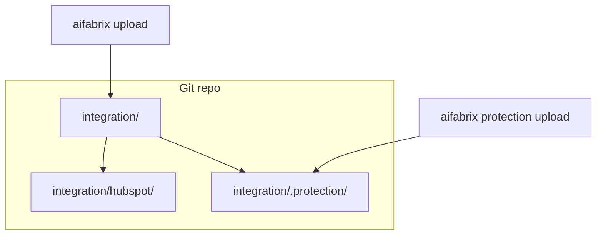

# CLI sync flags, credential UX, protection location, and command docs

## Problem summary

### A. `--no-sync` still runs full upload

Running `aifabrix test-trust test-e2e-hubspot --no-sync` still prints `Syncing local config to dataplane…` and runs [`uploadExternalSystem`](file:///workspace/aifabrix-builder/lib/commands/upload.js) (manifest + [`pushAndLogCredentialSecrets`](file:///workspace/aifabrix-builder/lib/commands/upload.js)).

**Root cause:** Commander maps `--no-sync` → `sync: false` (same as [`cliOptsSkipCertSync`](file:///workspace/aifabrix-builder/lib/certification/cli-cert-sync-skip.js) for `--no-cert-sync`). Code checks `options.noSync === true` only.

### B. Protection folder resolves to home, not repo

From `/workspace/aifabrix-dataplane`:

```text
aifabrix validate .protection
Folder: work — /workspace/.aifabrix/.protection
Summary: All 0 manifest(s) validated
```

Today [`getProtectionRoot()`](file:///workspace/aifabrix-builder/lib/protection/paths.js) is `{work}/.protection` via [`getAppsMaterializationParent()`](file:///workspace/aifabrix-builder/lib/utils/paths.js) — **sibling** to `integration/`, under `~/.aifabrix` when `aifabrix-work` points there. That is **not** versioned with the git repo.

**Target:** Per-repo manifests under **`integration/.protection/`** (e.g. `/workspace/aifabrix-dataplane/integration/.protection/`), committed with integration apps. Reverses plan 141’s “never under integration/” rule in favor of repo-local, team-shared config.

### C. YAML-only load vs JSON on disk

[`loadProtectionManifest`](file:///workspace/aifabrix-builder/lib/protection/load.js) rejects `.json` for `protection *` commands, while [`listProtectionManifestPaths`](file:///workspace/aifabrix-builder/lib/protection/resolve.js) already lists `*.{yaml,yml,json}`. User converted manifests to JSON; batch validate shows **0** files because root/path and load rules disagree.

### D. Docs / CLI matrix drift

Need one pass over help text, [`docs/commands/protection.md`](file:///workspace/aifabrix-builder/docs/commands/protection.md), external-integration docs, and [`.cursor/rules/cli-output-command-matrix.md`](file:///workspace/aifabrix-builder/.cursor/rules/cli-output-command-matrix.md) so profiles and examples match behavior.

---

## Architecture (publish vs protection)



| Path | Purpose |
| --- | --- |
| `integration/<systemKey>/` | External system + datasources (git) |
| `integration/.protection/` | Protection manifests per datasource key (git) |
| `{work}/.protection/` | **Deprecated** — migrate to repo path |

---

## Rules and Standards

This plan must comply with the following rules:

- **[Project Rules](.cursor/rules/project-rules.mdc)** — Builder architecture, CLI patterns, testing, quality gates, security
- **[CLI layout](.cursor/rules/cli-layout.mdc)** — Output profiles, glyphs, TTY vs `--json`, matrix updates for touched leaf commands
- **[CLI output command matrix](.cursor/rules/cli-output-command-matrix.md)** — Per-command profile audit (Phase 6)
- **[Layout spec](.cursor/rules/layout.md)** — Colors, sections, `cli-test-layout-chalk` helpers (credential spinner, protection display)
- **[CLI user docs](.cursor/rules/docs-rules.mdc)** — Command-centric docs under `docs/`; no raw HTTP/API details in user-facing docs

### Applicable sections from [project-rules.mdc](.cursor/rules/project-rules.mdc)

- **[CLI Command Development](.cursor/rules/project-rules.mdc#cli-command-development)** — Commander patterns, `--no-sync` wiring, help text, chalk/ora UX
- **[Code Quality Standards](.cursor/rules/project-rules.mdc#code-quality-standards)** — Files ≤500 lines, functions ≤50 lines, JSDoc on new public functions
- **[Quality Gates](.cursor/rules/project-rules.mdc#quality-gates)** — Mandatory BUILD → LINT → TEST before completion
- **[Testing Conventions](.cursor/rules/project-rules.mdc#testing-conventions)** — Jest unit tests mirroring `lib/` structure; ≥80% coverage for new code
- **[Error Handling & Logging](.cursor/rules/project-rules.mdc#error-handling--logging)** — Actionable errors; never log secrets/tokens during credential push
- **[Validation Patterns](.cursor/rules/project-rules.mdc#validation-patterns)** — YAML/JSON load via `config-format`; schema-safe protection manifests
- **[Template Development](.cursor/rules/project-rules.mdc#template-development)** — `README.md.hbs` updates for integration repos
- **[Security & Compliance](.cursor/rules/project-rules.mdc#security--compliance-iso-27001)** — Protection manifests are expressions only (no secrets in git); path validation

### Key requirements

- Use `cliOptsSkipSync(options, cmd)` for test-trust/test-e2e sync skip; **do not** conflate with `protection upload --no-sync`
- New utilities: JSDoc, `path.join()`, try-catch on async; mock `ora` and upload in tests
- Credential spinner: skip when non-TTY or `--json`; use `cli-test-layout-chalk` per matrix profile
- Update **cli-output-command-matrix.md** for every touched leaf command (help, profile, manifest roots)
- Fix generators/templates (`protection` paths, README) — not only one-off edits in consumer repos
- User docs: describe flags and folders in CLI terms; no endpoint URLs or payload shapes

---

## Before Development

- [ ] Read [cli-layout.mdc](.cursor/rules/cli-layout.mdc) and [cli-output-command-matrix.md](.cursor/rules/cli-output-command-matrix.md)
- [ ] Review existing `cliOptsSkipCertSync` / Commander `sync: false` behavior in [`cli-cert-sync-skip.js`](file:///workspace/aifabrix-builder/lib/certification/cli-cert-sync-skip.js)
- [ ] Review [`getProtectionRoot()`](file:///workspace/aifabrix-builder/lib/protection/paths.js) and plan 141 amendment scope
- [ ] Confirm test fixtures for `integration/.protection/` under `tests/`
- [ ] Plan Jest coverage for new modules (`cli-sync-options`, `credential-push-ui`, protection paths/load)
- [ ] Grep docs for stale `{work}/.protection`, removed flags, and wrong `--no-sync` semantics

---

## Definition of Done

Before marking this plan complete:

1. **Build**: Run `npm run build` **FIRST** (must succeed; runs lint + test:ci)
2. **Lint**: Run `npm run lint` (zero errors/warnings)
3. **Test**: Run `npm test` or targeted patterns **after** lint; all tests pass; ≥80% coverage on new code
4. **Validation order**: **BUILD → LINT → TEST** (never skip or reorder)
5. **File size limits**: New/changed files ≤500 lines; functions ≤50 lines
6. **JSDoc**: All new public functions documented
7. **CLI matrix**: Rows for touched commands match help, implementation, and docs
8. **Security**: No secrets in protection manifests or logs; migration docs warn about git-committed expressions only
9. **Manual smoke**: Steps in Phase 7 executed from a repo with `integration/.protection/`
10. **Plan 141**: Short amendment note added to [141-protection-system.plan.md](file:///workspace/aifabrix-builder/.cursor/plans/Done/141-protection-system.plan.md) when protection path ships
11. All frontmatter todos completed

---

## Phase 1 — Central `--no-sync` detection

### 1.1 Add [`lib/utils/cli-sync-options.js`](file:///workspace/aifabrix-builder/lib/utils/cli-sync-options.js)

```javascript
function cliOptsSkipSync(options, cmd) {
  if (!options || typeof options !== 'object') return false;
  if (options.noSync === true) return true;
  if (options.sync === false) return true;
  const raw = cmd && Array.isArray(cmd.rawArgs) ? cmd.rawArgs : [];
  return raw.includes('--no-sync');
}
```

### 1.2 Wire into commands

| Location | Change |
| -------- | ------ |
| [`test-trust-cli-options.js`](file:///workspace/aifabrix-builder/lib/commands/test-trust-cli-options.js) | `noSync: cliOptsSkipSync(options, cmd)` |
| [`test-trust-external.js`](file:///workspace/aifabrix-builder/lib/commands/test-trust-external.js) | `syncLocalIfRequested` uses helper |
| [`test-e2e-external.js`](file:///workspace/aifabrix-builder/lib/commands/test-e2e-external.js) | same |
| [`setup-app.test-commands.js`](file:///workspace/aifabrix-builder/lib/cli/setup-app.test-commands.js) `test-e2e` action | pass `cmd`; `noSync: cliOptsSkipSync(options, cmd)` |
| [`datasource-test-trust-cli.js`](file:///workspace/aifabrix-builder/lib/commands/datasource-test-trust-cli.js) | action `(key, options, cmd)` |
| [`agent-trust-run.js`](file:///workspace/aifabrix-builder/lib/datasource/agent-trust-run.js) | honor `skipSync` from callers |

**Do not** use this helper for `protection upload --no-sync` (means skip **datasource sync after** upload only).

### 1.3 Tests + semantics

- New `tests/lib/utils/cli-sync-options.test.js` — `{ sync: false }`, `{ noSync: true }`, `rawArgs`, negatives.
- Extend test-trust / test-e2e tests: mock `uploadExternalSystem`; assert **not called** when `sync: false`.

**Documented meaning:** `--no-sync` on `test-trust` / `test-e2e` (system) = skip entire pre-run publish (no manifest, **no credential push**, no OpenAPI sync). Datasource `test|test-integration|test-e2e` use opt-in `--sync`; `datasource test-trust` defaults to upload unless `--no-sync`.

---

## Phase 2 — Credential push spinner

- Add [`lib/utils/credential-push-ui.js`](file:///workspace/aifabrix-builder/lib/utils/credential-push-ui.js) (`ora` + [`cli-test-layout-chalk`](file:///workspace/aifabrix-builder/lib/utils/cli-test-layout-chalk.js)); skip spinner when non-TTY / `--json`.
- Use from [`pushAndLogCredentialSecrets`](file:///workspace/aifabrix-builder/lib/commands/upload.js) and [`credential-push.js`](file:///workspace/aifabrix-builder/lib/commands/credential-push.js).
- Tests with mocked `ora`.

---

## Phase 3 — test-trust: single dataplane URL resolve

In [`runTestTrustForExternalSystem`](file:///workspace/aifabrix-builder/lib/commands/test-trust-external.js): after optional sync, call `setupIntegrationTestAuth` **once**; pass `dataplane` + `authConfig` into each `runDatasourceAgentTrust` to avoid 4× “Getting dataplane URL from controller…”.

---

## Phase 4 — Protection location (`integration/.protection/`)

### 4.1 New resolution in [`lib/protection/paths.js`](file:///workspace/aifabrix-builder/lib/protection/paths.js)

**Priority:**

1. **`{cwd}/integration/.protection`** when [`getCwdIntegrationRoot()`](file:///workspace/aifabrix-builder/lib/utils/paths.js) is set (user in repo with `./integration/`).
2. **Walk up** from `cwd` for nearest `integration/` directory → `integration/.protection` (monorepo / subfolder runs).
3. **`{materialization}/integration/.protection`** — `path.join(getAppsMaterializationParent(), 'integration', '.protection')` when materialization tree has integration apps (not `{work}/.protection` at work root).

**Remove** `{work}/.protection` as default. Optional **compat** (one release): if `AIFABRIX_PROTECTION_LEGACY=1` or env `AIFABRIX_PROTECTION_ROOT`, or if legacy folder exists and repo folder empty, print migration hint pointing to `integration/.protection`.

Export `getProtectionRoot()` + `describeProtectionRoot()` for display (replaces misleading `Folder: work — …` in [`protection-display.js`](file:///workspace/aifabrix-builder/lib/protection/protection-display.js)).

### 4.2 Migration (manual + docs)

- Move manifests from `/workspace/.aifabrix/.protection/*` → `/workspace/aifabrix-dataplane/integration/.protection/` (or each repo’s `integration/.protection/`).
- Add `integration/.protection/.gitkeep` or document in protection.md that folder is **intended for git** (no secrets in manifests; values are expressions).
- Update [`docs/commands/protection.md`](file:///workspace/aifabrix-builder/docs/commands/protection.md), [`lib/commands/protection.js`](file:///workspace/aifabrix-builder/lib/commands/protection.js) description, all `{work}/.protection` strings in help ([`protection-cli-leaves.js`](file:///workspace/aifabrix-builder/lib/commands/protection-cli-leaves.js)).

### 4.3 Tests

- `tests/lib/protection/paths.test.js` — cwd repo → `integration/.protection`; legacy path not used by default.
- Batch validate with fixture under `integration/.protection/` counts manifests > 0.

---

## Phase 5 — Protection YAML | JSON parity

### 5.1 Load / resolve

- [`load.js`](file:///workspace/aifabrix-builder/lib/protection/load.js): accept `.yaml`, `.yml`, `.json` via [`loadConfigFile`](file:///workspace/aifabrix-builder/lib/utils/config-format.js); drop “yaml only” error for `protection validate|upload|show|delete`.
- [`resolve.js`](file:///workspace/aifabrix-builder/lib/protection/resolve.js): prefer `{datasourceKey}.{ext}` for both extensions; scan `*.{yaml,yml,json}` (already partial).

### 5.2 Create scaffold

- [`run-protection-create-helpers.js`](file:///workspace/aifabrix-builder/lib/protection/run-protection-create-helpers.js): output path `{root}/{datasourceKey}.{ext}` where `ext` = `await config.getFormat()` || `'yaml'` (same as wizard / `dev set-format`).
- Serialize with `jsonToYaml` / `writeConfigFile` from config-format layer (not hardcoded YAML only).
- `--dry-run`: print using chosen format; help text: “scaffold under `integration/.protection/`” not `{work}/.protection`.

### 5.3 Batch commands

- `validate .protection`, `upload .protection`, `convert .protection` — operate on resolved `integration/.protection` root; convert already supports yaml|json.
- Ensure upload API sends parsed object (format-agnostic).

### 5.4 Tests

- Load `.json` manifest in protection validate/upload unit tests.
- Create writes `.json` when `config.format: json` mocked.

---

## Phase 6 — CLI matrix + help/docs audit

Use [cli-output-command-matrix.md](file:///workspace/aifabrix-builder/.cursor/rules/cli-output-command-matrix.md) as checklist. For each row, verify **help `after` text**, **description**, and **user doc** match profile and manifest roots (**int** = integration tree).

### 6.1 External system (top-level)

| Command | Profile (target) | Audit focus |
| --- | --- | --- |
| `deploy` | tty-summary + stream-logs | 141+ manifest line; no credential push unless documented |
| `test` | stream-logs | local only |
| `test-integration` | layout-blocks | int; no false `--no-sync` |
| `test-e2e` | layout-blocks | `--no-sync` semantics after Phase 1 |
| `test-trust` | layout-blocks | `--no-sync`; not E2E |
| `download` / `upload` / `delete` | tty-summary | int; upload spinner (Phase 2) |
| `convert` / `show` / `validate` | tty-summary | 141+; `.protection` batch separate |

### 6.2 Datasource

| Command | Profile | Audit focus |
| --- | --- | --- |
| `datasource upload` | layout-blocks | |
| `datasource test` / `test-integration` / `test-e2e` / `test-trust` | layout-blocks | `--sync` vs `--no-sync` |
| `datasource log-e2e` | tty-summary | examples + `--app` optional |
| `datasource log-integration` | tty-summary | **Registered** in [`datasource.js`](file:///workspace/aifabrix-builder/lib/commands/datasource.js); verify top-level `datasource --help`, [datasources.md](file:///workspace/aifabrix-builder/docs/commands/external-integration/datasources.md), and commands README index list it (matrix row already present) |
| `datasource log-test` | (if documented) | distinct from log-integration |

### 6.3 Protection + batch scope

| Command | Profile | Audit focus |
| --- | --- | --- |
| `protection validate` | layout-blocks + json-opt | path = `integration/.protection` |
| `protection create` | tty-summary + stdout dry-run | format from config |
| `protection upload` | layout-blocks + tty-summary | `--no-sync` = post-upload sync only |
| `protection list` / `show` / `delete` | tty-summary + json-opt | |
| `validate .protection` | layout-blocks + json-opt | folder label + non-zero count when files exist |
| `upload .protection` | layout-blocks + json-opt | |
| `convert .protection` | tty-summary | yaml\|json |
| `deploy .protection` | blocking error | unchanged message |

### 6.4 Generated integration README

[`templates/external-system/README.md.hbs`](file:///workspace/aifabrix-builder/templates/external-system/README.md.hbs):

- Publish table (upload vs deploy vs `credential push`).
- `test-trust` row + examples.
- Pointer: protection manifests live in **`integration/.protection/`** at repo root (sibling to `integration/<appName>/`), not under each app folder.

### 6.5 Other docs

| Doc | Updates |
| --- | --- |
| [`external-integration-testing.md`](file:///workspace/aifabrix-builder/docs/commands/external-integration-testing.md) | Flag matrix; test-trust flags |
| [`external-integration.md`](file:///workspace/aifabrix-builder/docs/commands/external-integration.md) | upload, test-trust, log-* |
| [`application-development.md`](file:///workspace/aifabrix-builder/docs/commands/application-development.md) | test-e2e / test-trust `--no-sync` |
| [`permissions.md`](file:///workspace/aifabrix-builder/docs/commands/permissions.md) | `--no-sync` skips cred push |
| [`protection.md`](file:///workspace/aifabrix-builder/docs/commands/protection.md) | location, yaml\|json, batch examples |
| [`setup-app.help.js`](file:///workspace/aifabrix-builder/lib/cli/setup-app.help.js) | aligned examples |

Grep docs for removed flags (`test-e2e --sync`, `datasource test-e2e --capability`) and stale `{work}/.protection`.

---

## Phase 7 — Validation

**Mandatory order: BUILD → LINT → TEST** (see [Definition of Done](#definition-of-done)).

```bash
cd /workspace/aifabrix-builder
npm run build
npm run lint
npm test -- --testPathPattern="cli-sync-options|test-trust|test-e2e-external|protection|upload.test|credential-push"
```

Manual (from `aifabrix-dataplane` repo root):

```bash
# Protection path + JSON
ls integration/.protection/
aifabrix validate .protection          # finds manifests; folder shows integration/.protection path
aifabrix protection validate test-e2e-hubspot-companies

# No-sync
aifabrix test-trust test-e2e-hubspot --no-sync   # no upload / credential push

# Credential spinner
aifabrix upload test-e2e-hubspot
aifabrix credential push test-e2e-hubspot

# Datasource logs
aifabrix datasource log-integration test-e2e-hubspot-companies --app test-e2e-hubspot
```

---

## Out of scope (follow-ups)

- **Deploy-time credential push** on `aifabrix deploy` — document `upload` / `credential push` instead.
- **Auto-migrate** files from `{work}/.protection` to `integration/.protection` (hint only unless requested).
- Changing `datasource test-trust` default from upload-on to opt-in `--sync` (breaking).
- Dataplane semantic / CIP fixes in integration JSON.

---

## Supersedes / updates plan 141 protection placement

Plan 141 specified shared `{work}/.protection/` outside `integration/`. This plan **changes** canonical storage to **`integration/.protection/` per repository** so protection travels with integration code in GitHub. Update [Done/141-protection-system.plan.md](file:///workspace/aifabrix-builder/.cursor/plans/Done/141-protection-system.plan.md) with a short amendment note when implementing.

---

## Plan Validation Report

**Date**: 2026-05-19  
**Plan**: `.cursor/plans/145-cli_sync_flags_and_ux.plan.md`  
**Status**: ✅ VALIDATED

### Plan Purpose

Fix CLI sync-flag handling (`--no-sync` must skip full upload including credential push), improve credential-push and test-trust UX, relocate protection manifests to repo-local `integration/.protection/` with YAML|JSON parity, and audit CLI matrix/help/docs for external, datasource, and protection commands.

**Type**: Development (CLI commands, utilities, docs, templates)  
**Affected areas**: CLI/commands, `lib/utils/`, `lib/protection/`, Handlebars README template, `docs/commands/`, cli-output-command-matrix

### Applicable Rules

- ✅ [CLI layout](.cursor/rules/cli-layout.mdc) — Spinner, display labels, matrix profiles (Phase 2, 6)
- ✅ [CLI Command Development](.cursor/rules/project-rules.mdc#cli-command-development) — Commander wiring, flags, help
- ✅ [Code Quality Standards](.cursor/rules/project-rules.mdc#code-quality-standards) — Size limits, JSDoc
- ✅ [Quality Gates](.cursor/rules/project-rules.mdc#quality-gates) — BUILD → LINT → TEST
- ✅ [Testing Conventions](.cursor/rules/project-rules.mdc#testing-conventions) — Unit/integration tests listed per phase
- ✅ [Validation Patterns](.cursor/rules/project-rules.mdc#validation-patterns) — YAML|JSON via config-format
- ✅ [Template Development](.cursor/rules/project-rules.mdc#template-development) — README.md.hbs
- ✅ [Security & Compliance](.cursor/rules/project-rules.mdc#security--compliance-iso-27001) — No secrets in manifests/logs
- ✅ [docs-rules.mdc](.cursor/rules/docs-rules.mdc) — User docs without HTTP/API tutorial detail

### Rule Compliance

- ✅ DoD Requirements: Documented (Definition of Done + Phase 7 order corrected)
- ✅ CLI/layout: Addressed in Phase 2 and Phase 6 matrix audit
- ✅ Testing: Per-phase test tasks and targeted `npm test` pattern
- ✅ Templates/docs: Phase 6.4–6.5 and README template
- ⚠️ Plan 141 amendment: Called out in DoD item 10 — execute during implementation, not pre-work

### Plan Updates Made

- ✅ Added **Rules and Standards** section (project-rules + cli-layout + docs-rules)
- ✅ Added **Before Development** checklist
- ✅ Added **Definition of Done** with mandatory BUILD → LINT → TEST
- ✅ Corrected Phase 7 command order (was test → lint → build)
- ✅ Appended this validation report

### Recommendations

- When implementing `describeProtectionRoot()`, align batch `validate .protection` folder label with resolved `integration/.protection` path (fixes user-reported “Folder: work” confusion).
- Document legacy `{work}/.protection` migration in `protection.md` with env override names (`AIFABRIX_PROTECTION_LEGACY`, `AIFABRIX_PROTECTION_ROOT`) before removing default compat.
- After matrix audit, run `aifabrix <cmd> --help` spot-checks for rows marked **audit focus** in Phase 6 tables.
- Keep `protection upload --no-sync` semantics separate in help text to avoid reusing `cliOptsSkipSync` (already noted in plan — preserve during implementation).

---

## Implementation Validation Report

**Date**: 2026-05-19  
**Plan**: `.cursor/plans/145-cli_sync_flags_and_ux.plan.md`  
**Status**: ✅ COMPLETE (code, tests, docs; manual smoke on operator)

## Executive Summary

All **8 frontmatter todos** are marked **completed**. Core code for Phases 1–5 is present with unit tests; `templates/external-system/README.md.hbs` and `docs/commands/protection.md` were updated. **`npm run build`** (lint + full Jest) **passed** on validation run.

Doc/help strings updated (`protection.js`, `permissions.md`, `README.md`, `cli-output-command-matrix.md`, batch file headers, `protection.md` env overrides). Tests added in `run-protection-create-helpers.test.js`, `paths.test.js`, `validate-batch.test.js`.

**Manual smoke** (Phase 7) remains for the operator from a repo with `integration/.protection/`.

## Task Completion

| Source | Total | Completed | Incomplete |
| --- | ---: | ---: | ---: |
| Frontmatter todos | 8 | 8 | 0 |
| Before Development checkboxes | 6 | 0 | 6 (pre-work; not tracked post-impl) |

### Frontmatter todos

- ✅ cli-sync-helper  
- ✅ wire-no-sync  
- ✅ credential-spinner  
- ✅ trust-url-cache  
- ✅ protection-root  
- ✅ protection-yaml-json  
- ✅ cli-matrix-docs-audit (partial — see gaps)  
- ✅ readme-template-docs  

## File Existence Validation

| File | Status |
| --- | --- |
| `lib/utils/cli-sync-options.js` | ✅ Exists (33 lines) |
| `lib/utils/credential-push-ui.js` | ✅ Exists (64 lines) |
| `lib/protection/paths.js` | ✅ Exists (151 lines; `getProtectionRoot`, `describeProtectionRoot`) |
| `lib/protection/load.js` | ✅ Accepts `.yaml`/`.yml`/`.json` |
| `lib/protection/resolve.js` | ✅ Multi-extension preferred paths |
| `lib/protection/run-protection-create-helpers.js` | ✅ Format-aware `writeProtectionManifest` |
| `lib/commands/test-trust-external.js` | ✅ `cliOptsSkipSync` + single `setupIntegrationTestAuth` |
| `lib/commands/test-e2e-external.js` | ✅ `cliOptsSkipSync` in `syncLocalIfRequested` |
| `lib/commands/test-trust-cli-options.js` | ✅ Wired |
| `lib/cli/setup-app.test-commands.js` | ✅ test-e2e passes `cmd`, uses helper |
| `lib/commands/datasource-test-trust-cli.js` | ✅ `(key, options, cmd)` + helper |
| `lib/datasource/agent-trust-run.js` | ✅ Reuses `authConfig`/`dataplaneUrl` when provided |
| `lib/commands/upload.js` | ✅ `runWithCredentialPushSpinner` |
| `lib/commands/credential-push.js` | ✅ Spinner |
| `lib/protection/protection-display.js` | ✅ `describeProtectionRoot` folder line |
| `templates/external-system/README.md.hbs` | ✅ Publish, test-trust, protection sections |
| `docs/commands/protection.md` | ✅ Updated path + yaml\|json |
| `.cursor/plans/Done/141-protection-system.plan.md` | ✅ Amendment note present |

## Test Coverage

| Area | Test file | Status |
| --- | --- | --- |
| `cliOptsSkipSync` | `tests/lib/utils/cli-sync-options.test.js` | ✅ |
| Credential spinner | `tests/lib/utils/credential-push-ui.test.js` | ✅ |
| Protection paths | `tests/lib/protection/paths.test.js` | ✅ |
| test-trust skip sync | `tests/lib/commands/test-trust-external.test.js` | ✅ incl. `sync: false` |
| test-e2e skip sync | `tests/lib/commands/test-e2e-external.test.js` | ✅ incl. `sync: false` |
| Protection JSON load | `tests/lib/protection/protection-resolve.test.js` | ✅ |
| protection create → `.json` when `config.format: json` | `run-protection-create-helpers.test.js` | ✅ |
| Batch validate JSON manifests | `validate-batch.test.js` | ✅ (uses `listProtectionManifestPaths` without yaml-only filter) |

## Code Quality Validation

| Step | Command | Result |
| --- | --- | --- |
| Build (lint + test) | `npm run build` | ✅ PASSED (386 suites, 6482 tests) |
| Lint only | `npm run lint` | ⚠️ 0 errors, **1 pre-existing warning** (`login.js` max-statements; unrelated) |
| Targeted pattern (plan Phase 7) | Covered by full build | ✅ |

**Validation order**: Build runs lint then tests internally — ✅ compliant.

## Cursor Rules Compliance

| Rule area | Status | Notes |
| --- | --- | --- |
| File size (≤500 lines / ≤50 per fn) | ✅ | New files well under limits |
| JSDoc on public functions | ✅ | New utilities documented |
| `path.join()` / no raw paths | ✅ | `paths.js` uses `path.join` |
| No hardcoded secrets | ✅ | No secrets in new code |
| CLI layout (ora, chalk helpers) | ✅ | `credential-push-ui` uses `formatProgress` |
| Tests in `tests/` mirroring `lib/` | ✅ | |
| `cliOptsSkipSync` not used for protection upload | ✅ | Verified — protection uses `opts.noSync` locally |
| docs-rules (no HTTP in user docs) | ✅ | Template/docs are command-centric |

## Implementation Completeness

| Phase | Status |
| --- | --- |
| 1 — `--no-sync` helper + wiring | ✅ Complete |
| 2 — Credential push spinner | ✅ Complete |
| 3 — test-trust single auth resolve | ✅ Complete |
| 4 — `integration/.protection/` root | ✅ Complete (+ legacy compat) |
| 5 — YAML \| JSON parity | ✅ Code complete; create `.json` test missing |
| 6 — Matrix/docs audit | ✅ Complete |
| 7 — Manual smoke | ⏳ Operator (not automated in CI) |

## Issues and Recommendations

1. **Run manual smoke** from a repo with `integration/.protection/` (Phase 7 commands) before production use.
2. **Migrate** manifests from `~/.aifabrix/.protection/` or `{work}/.protection/` into `<repo>/integration/.protection/` when upgrading.

## Final Validation Checklist

- [x] All frontmatter todos completed  
- [x] Core implementation files exist  
- [x] Unit tests exist for new modules and sync-skip behavior  
- [x] `npm run build` passes  
- [x] Full doc/matrix audit (Phase 6)  
- [ ] Manual smoke (Phase 7) — operator  
- [x] Plan 141 amendment note added  
- [x] Env overrides documented in `protection.md`
