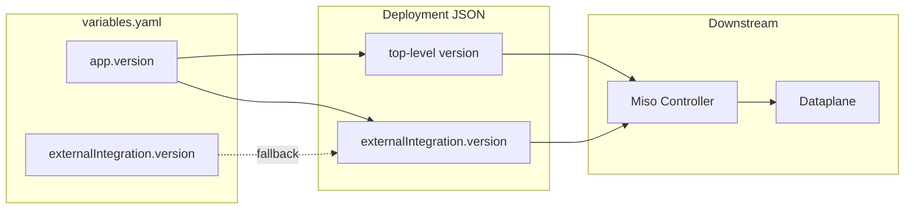
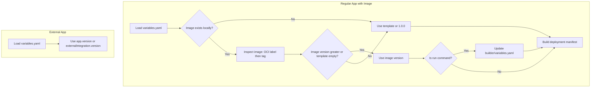

# Version in variables.yaml and Documentation

## Current State

- **Regular apps**: `buildAppMetadata` in [lib/generator/builders.js](lib/generator/builders.js) already reads `variables.app?.version` and defaults to `1.0.0`; deployment JSON includes top-level `version`.
- **External apps**: [lib/generator/external-controller-manifest.js](lib/generator/external-controller-manifest.js) uses `variables.externalIntegration.version` only; no `app.version`, no top-level `version` in manifest.
- **Templates**: None of dataplane, keycloak, miso-controller include `app.version` in their `variables.yaml`.
- **Docs**: [docs/deploying.md](docs/deploying.md) has "Version vs deployment" table; [docs/configuration/variables-yaml.md](docs/configuration/variables-yaml.md) does not list `app.version`.

## Design Decision: Version from Image

- **Regular apps**: Keep `app.version` empty in templates. When the image exists locally (run or deploy), resolve version from the image (OCI label `org.opencontainers.image.version` or semver-parsable `image.tag`). If image version is greater than template, or template is empty, use image version. Update `builder/<app>/variables.yaml` when running the image.
- **External apps**: No image to inspect. Use explicit `app.version` or `externalIntegration.version` in variables.yaml.

## Version Flow (target)

Resolved version (from image or template) flows into deployment JSON. See "Version Resolution Flow" below for how regular apps resolve version.




## Version Resolution Flow (regular apps)




---

## 1. Code Changes

### 1.1 Keep `app.version` empty in templates (regular apps)

Do **not** add `app.version` to regular app templates. Version is resolved from the image when running or deploying. Templates remain:

- [templates/applications/dataplane/variables.yaml](templates/applications/dataplane/variables.yaml)
- [templates/applications/keycloak/variables.yaml](templates/applications/keycloak/variables.yaml)
- [templates/applications/miso-controller/variables.yaml](templates/applications/miso-controller/variables.yaml)

If `app.version` is present, it is used as fallback when the image has no version or a smaller version.

### 1.2 Version resolution from image (regular apps)

Create [lib/utils/image-version.js](lib/utils/image-version.js):

- `getVersionFromImage(imageName, imageTag)`: Inspect image via `docker inspect` for OCI label `org.opencontainers.image.version`; fallback to parsing `image.tag` if it matches semver (e.g. `v1.0.0`, `1.0.0`). Return version string or `null`.
- `compareSemver(a, b)`: Compare semantic versions; return -1, 0, or 1.
- `resolveVersionForApp(appName, variables, options)`: For regular apps with image, if image exists locally and (template empty or image version greater), use image version. Return `{ version, fromImage, updated }`.
- `updateAppVersionInVariablesYaml(builderPath, version)`: Read variables.yaml, set `app.version`, write back.

**Integration points:**

- **Deploy**: In [lib/generator/index.js](lib/generator/index.js), before `buildAndValidateDeployment` for regular apps, call `resolveVersionForApp` when image exists locally; merge resolved version into `variables.app`. No disk write during deploy (builder dir may be ephemeral in CI).
- **Run**: In [lib/app/run-helpers.js](lib/app/run-helpers.js), after `checkImageExists` passes, call `resolveVersionForApp` with `updateBuilder: true`; if `fromImage`, update `builder/<app>/variables.yaml` with discovered version.

### 1.3 Sync external integration version from app.version

In [lib/generator/external-controller-manifest.js](lib/generator/external-controller-manifest.js):

- Resolve version as: `app.version` (if set) > `externalIntegration.version` (fallback) > `'1.0.0'`.
- Use this value for both `externalIntegration.version` and top-level `manifest.version`.

Current (line 133):

```javascript
version: variables.externalIntegration.version || '1.0.0'
```

Change to:

```javascript
version: variables.app?.version || variables.externalIntegration?.version || '1.0.0'
```

And add top-level `version` to the manifest (around line 137):

```javascript
const appVersion = variables.app?.version || variables.externalIntegration?.version || '1.0.0';
// ...
const manifest = {
  key: metadata.appKey,
  displayName: metadata.displayName,
  description: metadata.description,
  type: 'external',
  version: appVersion,
  externalIntegration: { ...externalIntegration, version: appVersion },
  // ...
};
```

### 1.4 Builder copies and app.version

Builder copies (e.g. `builder/dataplane/variables.yaml`) are updated with `app.version` when running the image via `resolveVersionForApp` and `updateAppVersionInVariablesYaml`. Templates stay empty; the builder copy is the source of truth after run.

---

## 2. Documentation Changes

### 2.1 variables-yaml.md

In [docs/configuration/variables-yaml.md](docs/configuration/variables-yaml.md):

- Add `app.version` to **Optional** fields.
- Add a short "Version and tag" subsection:
  - `app.version`: semantic version; for regular apps, can be auto-resolved from the image (OCI label or semver tag) when running or deploying if template is empty or smaller. Defaults to `1.0.0` when no image or no version in image.
  - `image.tag`: Docker image tag (which image to pull).
  - Purpose: version = product/change semantics; tag = container artifact.
  - Note: when running the image, builder/variables.yaml is updated with the discovered version.

### 2.2 external-integration.md

In [docs/configuration/external-integration.md](docs/configuration/external-integration.md):

- Update the **version** field description: "Integration version for schema diffing. If `app.version` is set, it overrides this value. Otherwise defaults to `1.0.0`."

### 2.3 New "Version" section in deploying.md

In [docs/deploying.md](docs/deploying.md), expand the existing "Version vs deployment" area (around lines 582–596):

- **Purpose**: Explain that version tracks product/application changes and enables schema diffing and migrations.
- **How**: For regular apps, `app.version` can be auto-resolved from the image (OCI label or semver tag) when running or deploying; it flows into the deployment JSON and to Miso Controller, then Dataplane. When running the image, builder/variables.yaml is updated with the discovered version.
- **Why two (version vs tag)**: version = product semantics; tag = container artifact.

### 2.4 Optional: Central version summary

Add a brief "Version" subsection to [docs/configuration/README.md](docs/configuration/README.md) or a small "Version" page that links to variables-yaml, external-integration, and deploying versions. Keep it minimal and focused on purpose, flow, and difference from tag.

---

## 3. Tests

### 3.1 image-version.test.js (new)

Create [tests/lib/utils/image-version.test.js](tests/lib/utils/image-version.test.js). Mock `child_process.exec` (docker inspect) and `fs`/`fs.promises`.

**getVersionFromImage:**

- OCI label present → return label value
- OCI label empty, tag is semver (v1.0.0, 1.0.0) → parse and return
- Neither OCI nor semver tag → return null
- docker inspect fails → return null or handle gracefully

**compareSemver:**

- a > b, a < b, a === b
- Invalid semver strings (graceful handling)

**resolveVersionForApp:**

- External app → skip image inspection, use app.version or externalIntegration.version
- Image not found locally → use template or default 1.0.0
- Image version greater than template → use image version, fromImage: true
- Template version greater than image → use template
- Template empty, image has version → use image version

**updateAppVersionInVariablesYaml:**

- app missing → create app and set version
- app exists → update version only
- Preserve YAML structure on write

### 3.2 generator.test.js

- Already covers `buildAppMetadata` version (app.version in manifest, default 1.0.0).
- Add tests for version resolution in generateDeployJson when image exists: mock resolveVersionForApp to return image version; verify manifest gets it.
- When image does not exist: verify manifest uses template/default.

### 3.3 external-controller-manifest.test.js

- Add test(s) for `app.version` overriding `externalIntegration.version`.
- Verify top-level `manifest.version` is set.

### 3.4 run-helpers.test.js

In [tests/lib/app/app-run-helpers.test.js](tests/lib/app/app-run-helpers.test.js):

- When run flow invokes version resolution: verify `resolveVersionForApp` is called when image exists (mock checkImageExists, image-version module).
- When `fromImage` true and `updateBuilder: true`: verify `updateAppVersionInVariablesYaml` is called (or builder/variables.yaml is updated).

### 3.5 templates.test.js

[tests/lib/core/templates.test.js](tests/lib/core/templates.test.js): No change needed (templates stay without app.version).

---

## 4. Files Touched


| File                                                       | Change                                                                |
| ---------------------------------------------------------- | --------------------------------------------------------------------- |
| `templates/applications/dataplane/variables.yaml`          | Keep `app.version` empty (version from image)                         |
| `templates/applications/keycloak/variables.yaml`           | Keep `app.version` empty (version from image)                         |
| `templates/applications/miso-controller/variables.yaml`    | Keep `app.version` empty (version from image)                         |
| `lib/utils/image-version.js`                               | New: getVersionFromImage, compareSemver, resolveVersionForApp, update |
| `lib/generator/index.js`                                   | Resolve version from image before buildAndValidateDeployment          |
| `lib/app/run-helpers.js`                                   | Resolve version, update builder/variables.yaml when running image     |
| `lib/generator/external-controller-manifest.js`            | Sync version from app.version, add top-level version                  |
| `docs/configuration/variables-yaml.md`                     | Document app.version, version-from-image, version vs tag              |
| `docs/configuration/external-integration.md`               | Document version sync from app.version                                |
| `docs/deploying.md`                                        | Expand version section (purpose, how, why, version-from-image)        |
| `tests/lib/utils/image-version.test.js`                    | New: unit tests for all 4 functions                                   |
| `tests/lib/app/app-run-helpers.test.js`                    | Add: version resolution and builder update on run                     |
| `tests/lib/generator/generator.test.js`                    | Add: version resolution when image exists                             |
| `tests/lib/generator/external-controller-manifest.test.js` | Add: app.version override, top-level manifest.version                 |


---

## 5. Summary

- **What**: Support `app.version`; for regular apps, resolve from image when template is empty or smaller; update builder/variables.yaml when running the image; sync `externalIntegration.version` from `app.version` for external apps.
- **Flow**: For regular apps, version is resolved from image (OCI label or tag) when image exists; `variables.yaml` → deployment JSON → Miso Controller → Dataplane. For external apps, use explicit `app.version` or `externalIntegration.version`.
- **Docs**: Clarify purpose, flow, version-from-image, and the version vs tag distinction.

---

## Rules and Standards

This plan must comply with [Project Rules](.cursor/rules/project-rules.mdc):

- **[Template Development](.cursor/rules/project-rules.mdc#template-development)** - YAML templates in `templates/applications/`; validate context and defaults.
- **[Validation Patterns](.cursor/rules/project-rules.mdc#validation-patterns)** - Schema validation (application-schema.json); YAML handling.
- **[Code Quality Standards](.cursor/rules/project-rules.mdc#code-quality-standards)** - File size limits (≤500 lines), JSDoc for public functions.
- **[Quality Gates](.cursor/rules/project-rules.mdc#quality-gates)** - Build, lint, test before commit; 80%+ coverage for new code.
- **[Testing Conventions](.cursor/rules/project-rules.mdc#testing-conventions)** - Jest tests mirror source; mock external deps; test success and error paths.
- **[Generated Output](.cursor/rules/project-rules.mdc#architecture-patterns)** - Changes go to templates/generator, not only builder/ artifacts.

**Key Requirements:**

- Keep `app.version` empty in regular app templates; resolve from image when running or deploying.
- Use JSDoc for any modified or new functions (`external-controller-manifest.js`, `image-version.js`).
- Add tests for version resolution in `tests/lib/utils/image-version.test.js`, version sync in `external-controller-manifest.test.js`, and run-helpers integration in `app-run-helpers.test.js`.
- Keep files ≤500 lines; functions ≤50 lines.
- Use `path.join()` for paths; validate inputs.

**Edge cases:**

- Image not found locally: use template version or default `1.0.0`; no update.
- Invalid/non-semver tag (e.g. `latest`, `main-abc123`): use OCI label only; if neither, use template/default.
- External apps: skip image inspection; use `app.version` or `externalIntegration.version`.

---

## Before Development

- Read Template Development and Validation Patterns from project-rules.mdc
- Review existing variables.yaml templates (dataplane, keycloak, miso-controller)
- Review `external-controller-manifest.js` and its tests
- Understand deployment JSON flow (builders.js, generator index)
- Review `checkImageExists` and run flow in `lib/app/run-helpers.js` and `lib/utils/app-run-containers.js`

---

## Definition of Done

Before marking this plan as complete, ensure:

1. **Build**: Run `npm run build` FIRST (must complete successfully - runs lint + test)
2. **Lint**: Run `npm run lint` (must pass with zero errors/warnings)
3. **Test**: Run `npm test` (all tests must pass, ≥80% coverage for new code)
4. **Validation Order**: BUILD → LINT → TEST (mandatory sequence; `npm run build` runs both)
5. **File Size Limits**: Files ≤500 lines, functions ≤50 lines
6. **JSDoc Documentation**: All modified public functions have JSDoc comments
7. **Code Quality**: All rule requirements met
8. **Security**: No hardcoded secrets, ISO 27001 compliance
9. All tasks completed (templates, generator, docs, tests)
10. builder/ copies receive `app.version` when running the image (via version-from-image resolution)

---

## Plan Validation Report

**Date**: 2025-02-07
**Plan**: .cursor/plans/48-version_in_variables.yaml.plan.md
**Status**: VALIDATED

### Plan Purpose

Support `app.version`; for regular apps, resolve version from Docker image when template is empty or smaller, update builder/variables.yaml when running the image; sync `externalIntegration.version` from `app.version` for external apps; document version purpose, flow, and usage. Plan type: Development (generator + templates + image-version utility) + Documentation.

### Applicable Rules

- Template Development - YAML templates, variables.yaml changes
- Validation Patterns - Schema, YAML
- Code Quality Standards - File size, JSDoc
- Quality Gates - Mandatory checks before commit
- Testing Conventions - Jest, test structure
- Generated Output - Edits in templates/generator, not only builder/

### Rule Compliance

- DoD Requirements: Documented (build, lint, test, validation order)
- Template Development: Compliant (plan updates templates)
- Quality Gates: Compliant (plan includes test step)
- Testing Conventions: Compliant (plan adds tests for external-controller-manifest)
- Code Quality: Compliant (JSDoc, file size mentioned)

### Plan Updates Made

- Added Rules and Standards section with rule references
- Added Before Development checklist
- Added Definition of Done section (build, lint, test, validation order)
- Added validation report
- Extended with version-from-image: resolve from Docker image when template empty or smaller; update builder/variables.yaml when running; keep templates empty for regular apps; external apps keep explicit version

### Recommendations

- Note: [tests/lib/generator/builders.test.js](tests/lib/generator/builders.test.js) does not exist; [tests/lib/generator/generator.test.js](tests/lib/generator/generator.test.js) already covers `buildAppMetadata` version behavior (lines 1851–1902). No new builders test needed.
- Add new [tests/lib/utils/image-version.test.js](tests/lib/utils/image-version.test.js) for version resolution; mock `docker inspect` and `child_process.exec`.
- Add run-helpers tests in [tests/lib/app/app-run-helpers.test.js](tests/lib/app/app-run-helpers.test.js); mock `image-version` and `checkImageExists` to verify version resolution and builder update.

---

## Implementation Validation Report

**Date**: 2025-02-07
**Plan**: .cursor/plans/48-version_in_variables.yaml.plan.md
**Status**: ✅ COMPLETE

### Executive Summary

All plan requirements have been implemented. Code quality validation (format, lint, test) passed. All files exist, tests cover the new functionality, and implementation complies with cursor rules.

### Task Completion

| Area | Status | Notes |
|------|--------|-------|
| 1.1 Templates keep app.version empty | ✅ | dataplane, keycloak, miso-controller variables.yaml have no app.version |
| 1.2 image-version.js | ✅ | getVersionFromImage, compareSemver, resolveVersionForApp, updateAppVersionInVariablesYaml |
| 1.2 Generator integration | ✅ | resolveVersionForApp called before buildAndValidateDeployment (updateBuilder: false) |
| 1.2 Run-helpers integration | ✅ | resolveVersionForApp called with updateBuilder: true after checkImageExists |
| 1.3 external-controller-manifest | ✅ | app.version > externalIntegration.version > 1.0.0; top-level manifest.version |
| 2.1 variables-yaml.md | ✅ | app.version in Optional; Version and tag subsection |
| 2.2 external-integration.md | ✅ | version override from app.version documented |
| 2.3 deploying.md | ✅ | Version vs deployment expanded (purpose, how, why) |
| 2.4 config README | ✅ | Version subsection links to variables-yaml, external-integration, deploying |
| 3.1 image-version.test.js | ✅ | All 4 functions tested |
| 3.2 generator.test.js | ✅ | Mock resolveVersionForApp; version resolution when image exists |
| 3.3 external-controller-manifest.test.js | ✅ | app.version override; top-level manifest.version |
| 3.4 app-run-helpers.test.js | ✅ | resolveVersionForApp called with updateBuilder: true |

### File Existence Validation

| File | Status |
|------|--------|
| `lib/utils/image-version.js` | ✅ Exists (207 lines) |
| `lib/generator/index.js` | ✅ Modified, resolveVersionForApp integrated |
| `lib/app/run-helpers.js` | ✅ Modified, resolveAndUpdateVersion → checkPrerequisites |
| `lib/generator/external-controller-manifest.js` | ✅ Modified, appVersion sync, top-level version |
| `docs/configuration/variables-yaml.md` | ✅ app.version, Version and tag subsection |
| `docs/configuration/external-integration.md` | ✅ version override from app.version |
| `docs/deploying.md` | ✅ Version vs deployment expanded |
| `docs/configuration/README.md` | ✅ Version subsection |
| `templates/applications/dataplane/variables.yaml` | ✅ No app.version |
| `templates/applications/keycloak/variables.yaml` | ✅ No app.version |
| `templates/applications/miso-controller/variables.yaml` | ✅ No app.version |
| `tests/lib/utils/image-version.test.js` | ✅ Exists |
| `tests/lib/app/app-run-helpers.test.js` | ✅ Version resolution tests |
| `tests/lib/generator/generator.test.js` | ✅ Version resolution tests |
| `tests/lib/generator/external-controller-manifest.test.js` | ✅ app.version override tests |

### Test Coverage

- **image-version.test.js**: getVersionFromImage (OCI label, semver tag, failures), compareSemver (a&lt;b, a&gt;b, a===b, invalid), resolveVersionForApp (external, image not found, template empty, template greater, image greater, updateBuilder), updateAppVersionInVariablesYaml (missing path, file missing, update existing, create app block, preserve structure).
- **generator.test.js**: resolveVersionForApp mock; version from app.version; default 1.0.0; fromImage returns 2.1.0.
- **external-controller-manifest.test.js**: app.version overrides externalIntegration.version; top-level manifest.version.
- **app-run-helpers.test.js**: resolveVersionForApp called with updateBuilder: true and builderPath when image exists.

### Code Quality Validation

| Step | Result |
|------|--------|
| Format (lint:fix) | ✅ PASSED |
| Lint | ✅ PASSED (0 errors, 0 warnings) |
| Tests | ✅ PASSED (186 suites, 4179 tests) |
| Build (lint + test) | ✅ PASSED |

### Cursor Rules Compliance

| Rule | Status |
|------|--------|
| Code reuse | ✅ path.join, getBuilderPath, composeGenerator |
| Error handling | ✅ try-catch, graceful null returns |
| Input validation | ✅ appName, imageName, builderPath, version |
| JSDoc | ✅ All public functions documented |
| Async patterns | ✅ async/await, fs.promises |
| File operations | ✅ path.join, utf8 encoding |
| Module patterns | ✅ CommonJS, named exports |
| Security | ✅ No hardcoded secrets |
| File size | ✅ image-version.js &lt; 500 lines |
| Function size | ✅ All functions ≤ 50 lines |

### Implementation Completeness

| Area | Status |
|------|--------|
| Code changes | ✅ Complete |
| Documentation | ✅ Complete |
| Tests | ✅ Complete |
| Templates | ✅ Correct (no app.version) |

### Final Validation Checklist

- [x] All plan tasks completed
- [x] All files exist
- [x] Tests exist and pass
- [x] Code quality validation passes
- [x] Cursor rules compliance verified
- [x] Implementation complete
