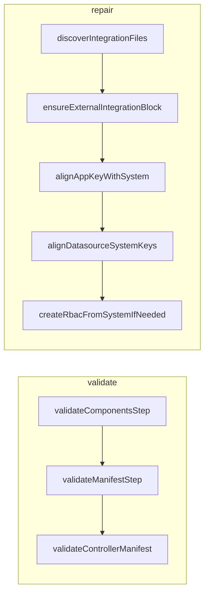

# Datasource systemKey Validation and Repair Plan

## Problem Summary


| Command             | Current Behavior                                                                                            | Desired Behavior                                        |
| ------------------- | ----------------------------------------------------------------------------------------------------------- | ------------------------------------------------------- |
| `aifabrix validate` | Passes even when a datasource has wrong `systemKey` (e.g. `hubspot-deals-datasource` vs `test-e2e-hubspot`) | Fail validation and report the mismatch                 |
| `aifabrix repair`   | Reports "No changes needed" even when datasource files have wrong `systemKey`                               | Fix `systemKey` in datasource files to match system key |
| `aifabrix upload`   | Correctly rejects with "systemKey does not match application system key" (dataplane API)                    | No change; this behavior is correct                     |


The dataplane upload API enforces `datasource.systemKey === ExternalSystem.key`, but local validation and repair do not. Integrators get a confusing flow: validate passes, repair does nothing, then upload fails.

---

## Architecture




---

## 1. Add Validation: Datasource systemKey vs System Key

**File:** [lib/validation/external-manifest-validator.js](lib/validation/external-manifest-validator.js)

**Change:** Add `validateDatasourceSystemKeyAlignment(manifest, errors)` and call it from `validateControllerManifest`.

**Logic:**

- `systemKey = manifest.system?.key`
- If `manifest.dataSources` exists and `systemKey` is defined, iterate each datasource:
  - If `datasource.systemKey !== systemKey`, add error: `Data source '${datasource.key}' systemKey does not match application system key (expected '${systemKey}', got '${datasource.systemKey}')`
- Match the wording used by the upload/dataplane error so integrators recognize it.

**Integration:** The manifest is built by `generateControllerManifest` from files; it already contains both `system.key` and each `dataSources[].systemKey`. No need to touch [lib/validation/validate.js](lib/validation/validate.js) or components step—the manifest validator runs after the manifest is built and will catch mismatches.

---

## 2. Add Repair: Fix Datasource systemKey Mismatch

**File:** [lib/commands/repair.js](lib/commands/repair.js)

**Change:** Add `alignDatasourceSystemKeys(appPath, datasourceFiles, systemKey, dryRun, changes)` and call it after `alignAppKeyWithSystem`, before rbac/manifest logic.

**Logic:**

- For each `datasourceFile` in `datasourceFiles`:
  - Build path: `path.join(appPath, datasourceFile)`
  - Load with `loadConfigFile(path)`
  - If `parsed.systemKey !== systemKey`, set `parsed.systemKey = systemKey`
  - Unless `dryRun`: call `writeConfigFile(path, parsed)` (format inferred from extension)
  - Append to `changes`: `"${datasourceFile}: systemKey ${old} → ${systemKey}"`
- Return `true` if any file was updated.

**Order in repair flow:**

1. Ensure externalIntegration block
2. Align app.key with system
3. **Align datasource systemKeys** (new)
4. Create rbac.yaml if needed
5. Regenerate manifest (if any changes and not dryRun)

**Note:** Use existing [lib/utils/config-format.js](lib/utils/config-format.js) `loadConfigFile` and `writeConfigFile` so YAML/JSON format is preserved per file extension.

---

## 3. Tests

High test coverage is critical for CLI quality. Add the following tests.

### 3a. External Manifest Validator

**File:** [tests/local/lib/validation/external-manifest-validator.test.js](tests/local/lib/validation/external-manifest-validator.test.js)


| Test                                | Purpose                                                                                                                                                                      |
| ----------------------------------- | ---------------------------------------------------------------------------------------------------------------------------------------------------------------------------- |
| Datasource systemKey mismatch fails | Manifest with `system.key: 'test-e2e-hubspot'` and datasource `systemKey: 'hubspot-deals-datasource'` must fail with error mentioning datasource key and expected/got values |
| Multiple datasources, one wrong     | Error identifies the mismatched datasource by key                                                                                                                            |
| All datasources aligned             | Passes when all datasource `systemKey` values equal `system.key`                                                                                                             |


### 3b. Validation (validate.test.js)

**File:** [tests/lib/validation/validate.test.js](tests/lib/validation/validate.test.js)


| Test                                                       | Purpose                                                                                                                                                    |
| ---------------------------------------------------------- | ---------------------------------------------------------------------------------------------------------------------------------------------------------- |
| validateExternalSystemComplete fails on systemKey mismatch | Mock manifest with wrong datasource systemKey; `validateControllerManifest` returns that error; `result.valid === false` and error text mentions systemKey |


### 3c. Repair (repair.test.js)

**File:** [tests/lib/commands/repair.test.js](tests/lib/commands/repair.test.js)


| Test                                                        | Purpose                                                                                                                                    |
| ----------------------------------------------------------- | ------------------------------------------------------------------------------------------------------------------------------------------ |
| Repair fixes datasource systemKey when mismatched           | Datasource has `systemKey: 'wrong-key'`, system has `key: 'correct-key'`; repair writes updated file and `changes` includes the correction |
| Dry-run reports datasource systemKey fix but does not write | Same setup with `dryRun: true`; no `writeConfigFile` for datasource file; `changes` still includes the fix                                 |
| No change when systemKeys already aligned                   | All datasources correct; repair reports "No changes needed"                                                                                |
| Multiple datasources with mismatches                        | Several datasources wrong; all fixed in one repair run                                                                                     |


### 3d. Edge Cases


| Test                                  | Purpose                                                                                                               |
| ------------------------------------- | --------------------------------------------------------------------------------------------------------------------- |
| system.key from filename when missing | System file has no `key`; repair derives key from filename (e.g. `test-e2e-hubspot-system.json` → `test-e2e-hubspot`) |
| Empty dataSources                     | No datasource files; alignment step skipped without error                                                             |
| Format preservation                   | Repair updates `.yaml` datasource; output remains YAML; same for `.json`                                              |


### 3e. Test Count Summary

- **Minimum:** ~6 new tests (validator systemKey, validate integration, repair fix, repair dry-run, repair no change, multi-datasource).
- **Recommended for high quality:** ~10–12 tests, including edge cases above.

---

## 4. Validation Checklist

After implementation:

1. Create a fixture: integration app with one datasource file whose `systemKey` differs from `system.key`.
2. Run `aifabrix validate <app>` → must fail with a clear error.
3. Run `aifabrix repair <app>` → must fix the datasource file and report the change.
4. Run `aifabrix validate <app>` again → must pass.
5. Run `npm run build` (lint + test) and ensure all tests pass.

---

## Files to Modify


| File                                                                                                                             | Change                                                                              |
| -------------------------------------------------------------------------------------------------------------------------------- | ----------------------------------------------------------------------------------- |
| [lib/validation/external-manifest-validator.js](lib/validation/external-manifest-validator.js)                                   | Add `validateDatasourceSystemKeyAlignment`, call from `validateControllerManifest`  |
| [lib/commands/repair.js](lib/commands/repair.js)                                                                                 | Add `alignDatasourceSystemKeys`, integrate into repair flow                         |
| [tests/local/lib/validation/external-manifest-validator.test.js](tests/local/lib/validation/external-manifest-validator.test.js) | Add tests for systemKey mismatch (single, multiple, aligned)                        |
| [tests/lib/validation/validate.test.js](tests/lib/validation/validate.test.js)                                                   | Add integration test for validateExternalSystemComplete fails on systemKey mismatch |
| [tests/lib/commands/repair.test.js](tests/lib/commands/repair.test.js)                                                           | Add repair tests: systemKey fix, dry-run, no change, multi-datasource, edge cases   |


---

## Optional: Update Plan 77

In [.cursor/plans/77-external_integration_repair_command.plan.md](.cursor/plans/77-external_integration_repair_command.plan.md), move "Datasource systemKey mismatch" from "Non-Repairable" to "Repairable" and document the new validation rule.

---

## Implementation Validation Report

**Date**: 2026-02-26
**Plan**: .cursor/plans/78-datasource_systemkey_validation_repair.plan.md
**Status**: ✅ COMPLETE

## Executive Summary

All tasks have been implemented. Validation rule `validateDatasourceSystemKeyAlignment` detects datasource systemKey mismatch; repair logic `alignDatasourceSystemKeys` corrects mismatched systemKey in datasource files. Tests cover validation, repair, dry-run, no-change, and multi-datasource scenarios. Code quality validation passes (format, lint, test). Plan 77 updated to move datasource systemKey from Non-Repairable to Repairable.

## Task Completion

- Total tasks: 6
- Completed: 6
- Incomplete: 0
- Completion: 100%

### Completed Tasks
- ✅ Add `validateDatasourceSystemKeyAlignment` to external-manifest-validator.js
- ✅ Add `alignDatasourceSystemKeys` to repair.js and integrate into flow
- ✅ Add external-manifest-validator tests for systemKey mismatch
- ✅ Add validate.test.js integration test for systemKey failure
- ✅ Add repair.test.js tests for datasource systemKey fix and edge cases
- ✅ Update Plan 77 to move datasource systemKey from Non-Repairable to Repairable

## File Existence Validation

- ✅ lib/validation/external-manifest-validator.js – `validateDatasourceSystemKeyAlignment` added, called from `validateControllerManifest`
- ✅ lib/commands/repair.js – `alignDatasourceSystemKeys` added, integrated into repair flow
- ✅ tests/local/lib/validation/external-manifest-validator.test.js – Tests for systemKey mismatch (single, multiple, aligned)
- ✅ tests/lib/validation/validate.test.js – Integration test for `validateExternalSystemComplete` fails on systemKey mismatch
- ✅ tests/lib/commands/repair.test.js – Repair tests: systemKey fix, dry-run, no change, multi-datasource, empty datasources

## Test Coverage

- ✅ Unit tests exist – external-manifest-validator.test.js (3 systemKey tests)
- ✅ Integration tests exist – validate.test.js (1 systemKey mismatch test)
- ✅ Repair tests exist – repair.test.js (6 systemKey-related tests)
- Test count: 10+ new/updated tests covering validator, validate flow, and repair flow

## Code Quality Validation

- ✅ Format: PASSED (`npm run lint:fix` – exit code 0)
- ✅ Lint: PASSED (0 errors, 0 warnings)
- ✅ Tests: PASSED (221 suites, 4854 tests)

## Cursor Rules Compliance

- ✅ Code reuse: Uses existing `loadConfigFile`/`writeConfigFile` from config-format.js
- ✅ Error handling: Proper parameter validation, try-catch where applicable
- ✅ Logging: Uses logger for output; no sensitive data logged
- ✅ Type safety: JSDoc for all new functions
- ✅ Async patterns: async/await used in repair flow
- ✅ File operations: Uses `path.join()`, proper encoding
- ✅ Input validation: App name validation, path validation in repair
- ✅ Module patterns: CommonJS, named exports
- ✅ Security: No hardcoded secrets

## Implementation Completeness

- ✅ Validation rule: COMPLETE
- ✅ Repair logic: COMPLETE
- ✅ Tests: COMPLETE
- ✅ Plan 77 update: COMPLETE (datasource systemKey moved to Repairable)

## Issues and Recommendations

- None. Implementation meets all plan requirements.

---

## Documentation Validation Report

**Date**: 2026-02-27
**Plan**: .cursor/plans/Done/78-datasource_systemkey_validation_repair.plan.md
**Status**: ⚠️ INCOMPLETE (documentation gap)

### Executive Summary

The plan does not explicitly list docs paths. Validation was run on thematically related docs (validate, repair, datasource systemKey, external integration). One documentation gap was identified: `docs/commands/utilities.md` does not list **Datasource systemKey mismatch** as a repairable issue, though Plan 78 implements this repair and Plan 77 was updated accordingly.

### Documents Validated

| Document | Status | Notes |
|----------|--------|-------|
| docs/commands/validation.md | ✅ Pass | Structure, references, schema alignment OK |
| docs/commands/utilities.md | ⚠️ Gap | Repair section missing "Datasource systemKey mismatch" |
| docs/commands/external-integration.md | ✅ Pass | systemKey, datasource validate documented |
| docs/configuration/external-integration.md | ✅ Pass | Mentions repair |

### Structure Validation

- **validation.md**: Single `#` title, proper hierarchy, nav links to index, focused on builder usage ✅
- **utilities.md**: Proper structure, repair section present; repairable issues list incomplete ⚠️
- **external-integration.md**, **configuration/external-integration.md**: Structure OK ✅

### Reference Validation

- Cross-references within docs use correct relative paths ✅
- No broken internal links detected (README.md, wizard.md, external-integration.md, application-yaml.md, etc. exist) ✅

### Schema-based Validation

- **external-datasource.schema.json**: `systemKey` is required; docs correctly state it must reference/match the system ✅
- **external-system.schema.json**: `key` is required; relationship docs align ✅
- Config examples in docs match schema structure ✅

### Markdown Validation

- MarkdownLint: Not configured in project (`markdownlint-cli` not in package.json); skipped ⚠️

### Project Rules Compliance

- Content focused on using the builder (external users) ✅
- CLI commands and options match the tool ✅

### Manual Fix Required

**docs/commands/utilities.md** – Add "Datasource systemKey mismatch" to the Repairable issues list under `aifabrix repair <app>`:

```markdown
**Repairable issues:**
- **File list drift** — ...
- **Datasource systemKey mismatch** — Datasource file has `systemKey: X` but system file has `key: Y`; repair updates `systemKey` in each datasource file to match system key
- **system.key mismatch** — ...
```

### Recommendation

Update `docs/commands/utilities.md` to document the datasource systemKey repair so integrators know that `aifabrix repair <app>` fixes this case (aligned with Plan 77 and the implementation).

### Final Documentation Checklist

- [x] Related documents validated
- [ ] utilities.md updated with datasource systemKey repair
- [x] Cross-references valid
- [x] Examples and structure aligned with lib/schema
- [x] Content focused on using the builder

---

## Final Validation Checklist

- [x] All tasks completed
- [x] All files exist and contain expected changes
- [x] Tests exist and pass
- [x] Code quality validation passes (format → lint → test)
- [x] Cursor rules compliance verified
- [x] Implementation complete