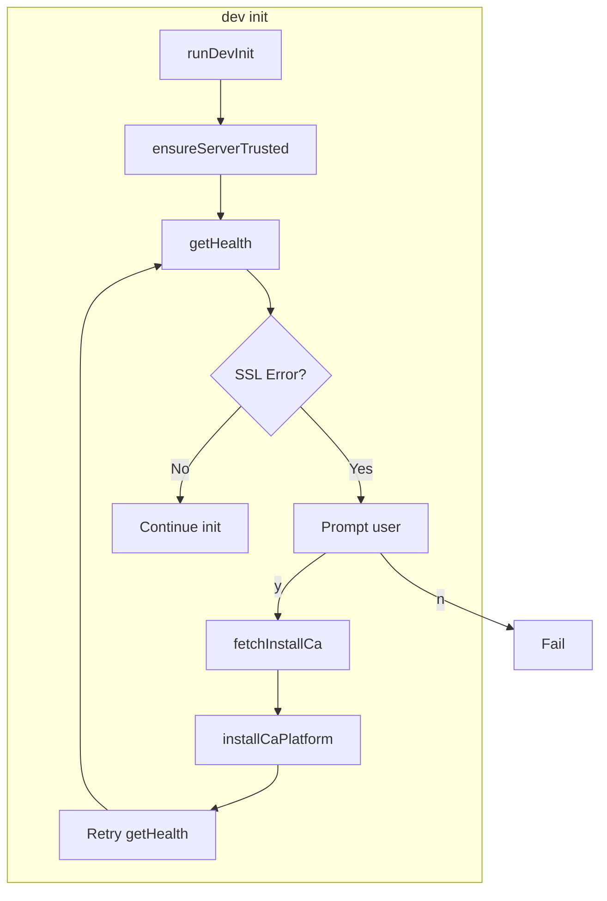

# Dev Init Automatic CA Install

## Summary

When `aifabrix dev init --developer-id 01 --server https://builder02.local --pin 123456` fails with an SSL verification error (e.g. `UNABLE_TO_VERIFY_LEAF_SIGNATURE`), the CLI will:

1. Detect the SSL untrusted error
2. Prompt: "Server certificate not trusted. Download and install the development CA? (y/n)"
3. On yes: fetch `https://builder02.local/install-ca` with `rejectUnauthorized: false`, install CA into OS trust store
4. Retry init (connection now trusted)

This aligns with the documented expectation that the Builder CLI fetches and installs the Root CA on the developer PC.

## Rules and Standards

This plan must comply with [Project Rules](.cursor/rules/project-rules.mdc):

- **[CLI Command Development](.cursor/rules/project-rules.mdc#cli-command-development)** - Adding `--yes`/`--no-install-ca` options, input validation, chalk output
- **[Testing Conventions](.cursor/rules/project-rules.mdc#testing-conventions)** - Jest tests, mocks for fs/child_process/https, tests in `tests/lib/`
- **[Code Quality Standards](.cursor/rules/project-rules.mdc#code-quality-standards)** - Files ≤500 lines, functions ≤50 lines, JSDoc for all public functions
- **[Quality Gates](.cursor/rules/project-rules.mdc#quality-gates)** - Build, lint, test before commit; 80%+ coverage for new code
- **[Security & Compliance (ISO 27001)](.cursor/rules/project-rules.mdc#security--compliance-iso-27001)** - `rejectUnauthorized: false` only for /install-ca; no secrets in logs; document security decisions
- **[Error Handling & Logging](.cursor/rules/project-rules.mdc#error-handling--logging)** - Try-catch for async ops; meaningful error messages; chalk for output

**Key requirements:**

- Use CommonJS, path.join() for cross-platform paths, chalk for output
- Validate inputs (baseUrl); use try-catch for all async operations
- JSDoc for `isSslUntrustedError`, `fetchInstallCa`, `installCaPlatform`, `ensureServerTrusted`, `promptInstallCa`
- Mock fs, child_process, https, readline in tests; test success and error paths

## Before Development

- Read CLI Command Development and Security & Compliance sections from project-rules.mdc
- Review [lib/commands/convert.js](lib/commands/convert.js) for readline prompt pattern
- Review [lib/commands/dev-init.js](lib/commands/dev-init.js) and [lib/api/dev.api.js](lib/api/dev.api.js) for current flow
- Confirm Builder Server exposes `GET /install-ca` returning PEM CA (endpoint assumed from spec)

## Definition of Done

Before marking this plan complete:

1. **Build**: Run `npm run build` FIRST (must succeed – runs lint + test)
2. **Lint**: Run `npm run lint` (must pass with zero errors/warnings)
3. **Test**: Run `npm test` AFTER lint (all tests pass; ≥80% coverage for new code)
4. **Validation order**: BUILD → LINT → TEST (mandatory; never skip)
5. **File size**: `dev-ca-install.js` ≤500 lines; functions ≤50 lines
6. **JSDoc**: All public functions in `dev-ca-install.js` and new exports in `dev-init.js` documented
7. **Security**: No hardcoded secrets; `rejectUnauthorized: false` only for /install-ca; document MITM caveat
8. All implementation tasks completed and docs updated

## Architecture




## Key Files


| File                                                       | Role                                                                                   |
| ---------------------------------------------------------- | -------------------------------------------------------------------------------------- |
| [lib/commands/dev-init.js](lib/commands/dev-init.js)       | Wrap health check with `ensureServerTrusted`; integrate CA install flow                |
| [lib/utils/dev-ca-install.js](lib/utils/dev-ca-install.js) | **New** – SSL detection, fetch CA, platform-specific install                           |
| [lib/api/dev.api.js](lib/api/dev.api.js)                   | No changes; `getHealth` uses `makeApiCall`/fetch; errors surface via `request()` throw |
| [lib/utils/api.js](lib/utils/api.js)                       | No changes; fetch throws on TLS failure; error has `message` and possibly `cause`      |


## Implementation

### 1. New module: `lib/utils/dev-ca-install.js`

**SSL error detection:**

```javascript
const SSL_UNTRUSTED_CODES = [
  'UNABLE_TO_VERIFY_LEAF_SIGNATURE',
  'DEPTH_ZERO_SELF_SIGNED_CERT',
  'CERT_UNTRUSTED',
  'SELF_SIGNED_CERT_IN_CHAIN',
  'UNABLE_TO_GET_ISSUER_CERT',
  'UNABLE_TO_GET_ISSUER_CERT_LOCALLY'
];

function isSslUntrustedError(err) {
  const code = err?.code || err?.cause?.code;
  const msg = (err?.message || '').toUpperCase();
  return SSL_UNTRUSTED_CODES.some(c => code === c || msg.includes(c));
}
```

**Fetch CA (insecure only for /install-ca):**

- Use Node `https` module with `rejectUnauthorized: false` agent (fetch does not expose custom TLS options)
- GET `{baseUrl}/install-ca`, return Buffer
- Handle redirects if needed; validate response is PEM-like

**Platform-specific install:**

- **Windows:** `certutil -addstore -user ROOT <tmpPath>` (user store, no admin)
- **macOS:** `security add-trusted-cert -d -r trustRoot -k ~/Library/Keychains/login.keychain-db <tmpPath>` (user keychain)
- **Linux:** Write to `/usr/local/share/ca-certificates/aifabrix-root-ca.crt` and run `update-ca-certificates` (requires sudo). If that fails or user lacks sudo, show manual instructions and link to `{baseUrl}/install-ca-help`

**UX:**

- Prompt: `readline` (as in [lib/commands/convert.js](lib/commands/convert.js)) for "Download and install the development CA? (y/n)"
- Optional `--yes` / `-y` on dev init to skip prompt and auto-install
- Optional `--no-install-ca` to fail immediately with manual instructions (no prompt)

### 2. Changes to `lib/commands/dev-init.js`

**New flow:**

```javascript
async function ensureServerTrusted(baseUrl, options) {
  const skipInstall = options['no-install-ca'];
  const autoInstall = options.yes || options.y;
  try {
    await devApi.getHealth(baseUrl);
    return; // OK
  } catch (err) {
    if (!isSslUntrustedError(err)) throw err;
    if (skipInstall) {
      throw new Error(`Server certificate not trusted. Install CA manually: ${baseUrl}/install-ca`);
    }
    if (!autoInstall) {
      const install = await promptInstallCa();
      if (!install) {
        throw new Error(`Server certificate not trusted. Install CA manually: ${baseUrl}/install-ca`);
      }
    }
    logger.log('Downloading and installing CA...');
    const caPem = await fetchInstallCa(baseUrl);
    await installCaPlatform(caPem, baseUrl);
    logger.log('CA installed. Retrying...');
    await devApi.getHealth(baseUrl); // Retry; throw if still fails
  }
}
```

Call `ensureServerTrusted(baseUrl, options)` at the start of `runDevInit` before the existing health check. Then keep the existing `devApi.getHealth(baseUrl)` only if we don't want redundancy (or remove the later one and rely on ensureServerTrusted).

**Refactor:** Move the current `devApi.getHealth` call into `ensureServerTrusted`; `runDevInit` only calls `ensureServerTrusted` once.

### 3. CLI options (lib/cli/setup-dev.js)

Add to dev init command:

- `--yes, -y` – Auto-install CA without prompt
- `--no-install-ca` – Do not offer CA install; fail with manual instructions

### 4. Error propagation

- `devApi.getHealth` uses `request()` → `makeApiCall` → `fetch`. On TLS failure, fetch throws; `makeApiCall` catches and returns `handleNetworkError` result; `request()` throws because `!result.success`. The thrown error has `message` (and possibly `cause`) containing the TLS error.
- Check both `err.code`, `err.cause?.code`, and `err.message` for SSL untrusted detection (Node fetch/undici may wrap the TLS error in `cause`).

### 5. Documentation updates

- [docs/commands/developer-isolation.md](docs/commands/developer-isolation.md): Add section describing that `dev init` fetches and installs the Root CA when the server certificate is untrusted (e.g. self-signed dev servers). Mention `--yes`, `--no-install-ca`, and manual install at `{server}/install-ca` and `{server}/install-ca-help`.
- Optional: Add rollback instructions (e.g. Windows: certmgr.msc; macOS: Keychain Access; Linux: remove from ca-certificates).

### 6. Security notes

- `rejectUnauthorized: false` is used **only** for the `/install-ca` request
- Acceptable for known dev setup; MITM could replace the CA. Document this; optionally consider CA fingerprint pinning later
- Idempotency: Reinstalling the same CA is safe (stores typically allow duplicates)

### 7. Tests

- **lib/utils/dev-ca-install.test.js:** `isSslUntrustedError` for each code and message variants; `fetchInstallCa` mock (https); `installCaPlatform` mock `execFileSync` and `fs` for Windows/macOS/Linux
- **lib/commands/dev-init.test.js:** Extend existing tests:
  - When `getHealth` throws SSL error and user accepts → fetch CA, install, retry, init succeeds
  - When `getHealth` throws SSL error and user declines → throw with manual instructions
  - When `getHealth` throws SSL error and `--no-install-ca` → throw immediately
  - When `getHealth` throws SSL error and `--yes` → auto-install, no prompt

## Linux sudo behavior

Linux install path requires sudo for `/usr/local/share/ca-certificates` and `update-ca-certificates`. Options:

- Try `execFileSync`; on EACCES or non-zero exit, catch and show manual instructions with link to `{baseUrl}/install-ca-help`
- Consider user-specific cert dir (e.g. `$HOME/.local/share/ca-certificates`) if distro supports it; many do not for system-wide trust. Simpler: document manual steps and `/install-ca-help` link on failure.

## File size and patterns

- `dev-ca-install.js` should stay under ~200 lines; platform branches are compact
- Follow project conventions: CommonJS, JSDoc, chalk for output, path.join, fs.promises where async

---

## Plan Validation Report

**Date**: 2025-02-26  
**Plan**: .cursor/plans/79-dev_init_ca_install.plan.md  
**Status**: VALIDATED

### Plan Purpose

Add automatic Root CA download and installation to `aifabrix dev init` when HTTPS fails due to untrusted certificates (e.g. self-signed Builder Server). On SSL error: detect, prompt user, fetch CA from `{server}/install-ca` with insecure agent, install into OS trust store, retry init.

**Scope**: CLI (`dev init`), new utility module (`lib/utils/dev-ca-install.js`), docs.  
**Type**: Development (CLI feature + security-related behavior).

### Applicable Rules

- **CLI Command Development** – Adding options, validation, UX (prompt, chalk).
- **Testing Conventions** – Jest, mocks (fs, child_process, https, readline).
- **Code Quality Standards** – File/function size, JSDoc.
- **Quality Gates** – Build, lint, test, coverage.
- **Security & Compliance** – `rejectUnauthorized: false` scope, no secrets in logs.
- **Error Handling & Logging** – Try-catch, error messages, chalk.

### Rule Compliance

- DoD: Build → lint → test documented with validation order.
- Rules and Standards: Six rule sections referenced with brief rationale.
- Before Development: Checklist with relevant files and constraints.
- Security: Plan limits insecure TLS to `/install-ca` and notes MITM risk.
- Testing: Tests for `dev-ca-install` and `dev-init` edge cases.

### Plan Updates Made

- Added Rules and Standards section with links and requirements.
- Added Before Development checklist.
- Added Definition of Done with build/lint/test and validation order.
- Appended this validation report.

### Recommendations

- Confirm Builder Server exposes `GET /install-ca` and `GET /install-ca-help` as described.
- Consider CA fingerprint verification later for stronger guarantees.
- Ensure non-TTY / CI behavior for `--yes` when no prompt is possible.

---

## Implementation Validation Report

**Date**: 2025-02-26  
**Plan**: .cursor/plans/79-dev_init_ca_install.plan.md  
**Status**: ✅ COMPLETE

### Executive Summary

All implementation requirements from the plan have been completed. The Dev Init CA Install feature is fully implemented: new module `lib/utils/dev-ca-install.js`, integration in `lib/commands/dev-init.js`, CLI options in `lib/cli/setup-dev.js`, documentation updates, and tests for all flows. Format, lint, and tests all pass.

### Task Completion

Implementation sections completed:

- **1. New module lib/utils/dev-ca-install.js** – SSL detection, fetch CA, platform-specific install (Windows/macOS/Linux)
- **2. Changes to lib/commands/dev-init.js** – `ensureServerTrusted` flow, single health check via `ensureServerTrusted`
- **3. CLI options** – `--yes` / `-y` and `--no-install-ca` in setup-dev.js
- **4. Error propagation** – SSL detection via `err.code`, `err.cause?.code`, `err.message`
- **5. Documentation** – developer-isolation.md updated with CA install, `--yes`, `--no-install-ca`, manual install
- **6. Security notes** – `rejectUnauthorized: false` only for /install-ca; documented in JSDoc
- **7. Tests** – dev-ca-install.test.js and dev-init.test.js with required scenarios

### File Existence Validation


| File                                   | Status | Notes                                                                                |
| -------------------------------------- | ------ | ------------------------------------------------------------------------------------ |
| lib/utils/dev-ca-install.js            | ✅      | New module, 139 lines                                                                |
| lib/commands/dev-init.js               | ✅      | Modified; `ensureServerTrusted`, CA flow                                             |
| lib/cli/setup-dev.js                   | ✅      | Modified; `--yes`, `--no-install-ca`                                                 |
| lib/api/dev.api.js                     | ✅      | No changes (per plan)                                                                |
| docs/commands/developer-isolation.md   | ✅      | Updated with CA install section                                                      |
| tests/lib/utils/dev-ca-install.test.js | ✅      | New; `isSslUntrustedError`, `fetchInstallCa`, `installCaPlatform`, `promptInstallCa` |
| tests/lib/commands/dev-init.test.js    | ✅      | Extended; SSL + accept/decline/`--no-install-ca`/`--yes`                             |


### Test Coverage

- **dev-ca-install.test.js:** `isSslUntrustedError` (code, cause, message), `fetchInstallCa` (https mock), `installCaPlatform` (win32/darwin/linux), `promptInstallCa` (y/yes/n)
- **dev-init.test.js:** SSL + `--no-install-ca`, SSL + user declines, SSL + user accepts (fetch, install, retry), SSL + `--yes` (auto-install, no prompt)
- **All tests pass:** 222 test suites, 4878 tests

### Code Quality Validation


| Step              | Status   | Details              |
| ----------------- | -------- | -------------------- |
| Format (lint:fix) | ✅ PASSED | Exit code 0          |
| Lint              | ✅ PASSED | 0 errors, 0 warnings |
| Tests             | ✅ PASSED | All 222 suites pass  |


### Cursor Rules Compliance


| Rule             | Status                                                                   |
| ---------------- | ------------------------------------------------------------------------ |
| Code reuse       | ✅ Uses existing patterns (readline like convert.js, path.join)           |
| Error handling   | ✅ try-catch, meaningful error messages                                   |
| Logging          | ✅ logger.log, chalk for output                                           |
| Type safety      | ✅ JSDoc for all public functions                                         |
| Async patterns   | ✅ async/await, fs.promises                                               |
| File operations  | ✅ path.join, proper encoding                                             |
| Input validation | ✅ baseUrl validation in fetchInstallCa                                   |
| Module patterns  | ✅ CommonJS, named exports                                                |
| Security         | ✅ No hardcoded secrets; `rejectUnauthorized: false` only for /install-ca |


### Implementation Completeness

- **File size:** dev-ca-install.js 139 lines (≤500); functions ≤50 lines
- **JSDoc:** All public functions documented (isSslUntrustedError, fetchInstallCa, installCaPlatform, promptInstallCa, ensureServerTrusted)
- **Security:** MITM caveat noted in dev-ca-install.js JSDoc; no secrets in logs

### Final Validation Checklist

- All implementation tasks completed
- All files exist and match plan
- Tests exist and pass
- Format, lint, and test validation pass
- Cursor rules compliance verified
- Implementation complete

---

## Documentation Validation Report

**Date**: 2026-02-27  
**Plan**: .cursor/plans/Done/79-dev_init_ca_install.plan.md  
**Document(s)**: docs/commands/developer-isolation.md  
**Status**: ✅ COMPLETE

### Executive Summary

Documentation validation completed successfully. The single document mentioned in the plan (`docs/commands/developer-isolation.md`) was validated against structure, references, schema alignment, and Markdown standards. One auto-fix was applied (bare URL). All checks pass.

### Documents Validated

- Total: 1
- Passed: 1
- Auto-fixed: 1

### Document List

- ✅ docs/commands/developer-isolation.md – Passed (bare URL auto-fixed)

### Structure Validation

- **Title**: Single `#` at top ("Developer Isolation Commands")
- **Hierarchy**: Proper `##` for main sections, `###` not used (flat structure appropriate for command reference)
- **Nav links**: ← [Documentation index](../README.md) · [Commands index](README.md) – present and correct
- **Sections**: Overview, `aifabrix dev init`, `dev refresh`, `dev add/update/pin/delete/list`, `dev down`, `dev config` – appropriate for user-facing command docs
- **CA install content**: Section 5 documentation updates from the plan are present (CA install flow, `--yes`, `--no-install-ca`, manual install at `{server}/install-ca`, `{server}/install-ca-help`)

### Reference Validation

- `../README.md` → docs/README.md ✅
- `README.md` → docs/commands/README.md ✅
- `../configuration/secrets-and-config.md` → docs/configuration/secrets-and-config.md ✅
- `../developer-isolation.md` → docs/developer-isolation.md ✅
- `infrastructure.md` → docs/commands/infrastructure.md ✅  
All cross-references valid; no broken links.

### Schema-based Validation

- **docs/commands/developer-isolation.md**: Command reference only. Contains YAML snippets for CLI output (e.g. developer config, ports) and user `config.yaml` (developer-id, environment). No application-schema, external-system, external-datasource, or infrastructure-schema examples. N/A – no schema validation required for this document.

### Markdown Validation

- **MarkdownLint**: ✅ PASSED (0 errors) after auto-fix
- **Auto-fix applied**: MD034/no-bare-urls – wrapped `https://dev.aifabrix.dev` in angle brackets on line 32

### Project Rules Compliance

- Content focused on using the aifabrix builder (CLI commands, options, workflows)
- CLI usage examples use `aifabrix`; options match plan (`--yes`, `--no-install-ca`)
- No internal-only implementation details

### Automatic Fixes Applied

1. docs/commands/developer-isolation.md: Wrapped bare URL `https://dev.aifabrix.dev` in angle brackets (MD034)

### Manual Fixes Required

None.

### Issues and Recommendations

None.

### Final Checklist

- [x] All documents validated
- [x] MarkdownLint passes (0 errors)
- [x] Cross-references within docs/ valid
- [x] No broken links
- [x] Examples and structure correct (N/A – command doc, no config schema examples)
- [x] Content focused on using the builder (external users)
- [x] Auto-fixes applied

