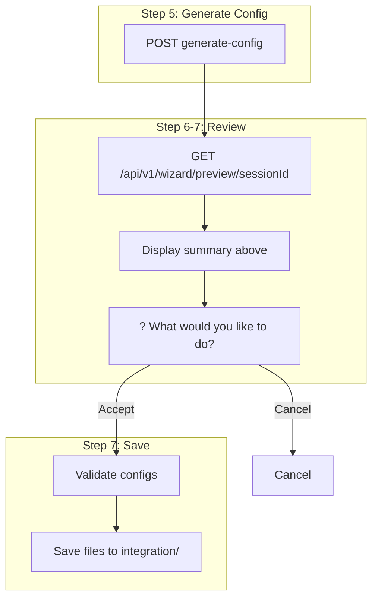

# Wizard Preview Endpoint Integration

## Overview

Replace the full manifest YAML dump at "What would you like to do? Accept and save" with data from `GET /api/v1/wizard/preview/{sessionId}`, showing human-readable summaries. Update and validate [docs/wizard.md](docs/wizard.md) to reflect the new structure and provide a clear step-by-step integration flow.

## Rules and Standards

This plan must comply with the following rules from [Project Rules](.cursor/rules/project-rules.mdc):

- **[API Client Structure Pattern](.cursor/rules/project-rules.mdc#api-client-structure-pattern)** - Uses `lib/api/wizard.api.js` `getPreview`; ensure typed interfaces and error handling.
- **[CLI Command Development](.cursor/rules/project-rules.mdc#cli-command-development)** - Wizard command flow, user experience, chalk output, error handling.
- **[Architecture Patterns](.cursor/rules/project-rules.mdc#architecture-patterns)** - Module structure, lib/commands and lib/generator organization.
- **[Code Quality Standards](.cursor/rules/project-rules.mdc#code-quality-standards)** - File size limits, JSDoc for all public functions.
- **[Quality Gates](.cursor/rules/project-rules.mdc#quality-gates)** - Mandatory checks before commit (build, lint, test).
- **[Testing Conventions](.cursor/rules/project-rules.mdc#testing-conventions)** - Jest patterns, mock getPreview, test success and fallback paths.
- **[Error Handling & Logging](.cursor/rules/project-rules.mdc#error-handling--logging)** - Try-catch for async, chalk for errors, never log tokens/secrets.

**Key Requirements**:

- Use existing `getPreview` from `lib/api/wizard.api.js`; add `@requiresPermission` JSDoc if not already present
- Add JSDoc for all modified public functions (`handleConfigurationReview`, `promptForConfigReview`)
- Use try-catch for `getPreview`; fall back to YAML on failure; never crash the wizard
- Mock `getPreview` in tests; assert preview display path and fallback path
- Keep files ≤500 lines and functions ≤50 lines
- Never log authentication tokens or sensitive data

## Before Development

- Read API Client Structure Pattern and CLI Command Development sections from project-rules.mdc
- Review `lib/api/wizard.api.js` `getPreview` signature and return shape
- Review `lib/commands/wizard.js` `handleConfigurationReview` flow
- Review `lib/generator/wizard-prompts-secondary.js` `promptForConfigReview`
- Understand WizardPreviewResponse shape from dataplane OpenAPI
- Review existing wizard tests for mock patterns

## Definition of Done

Before marking this plan as complete, ensure:

1. **Build**: Run `npm run build` FIRST (must complete successfully; runs lint + test)
2. **Lint**: Run `npm run lint` (must pass with zero errors/warnings)
3. **Test**: Run `npm test` or `npm run test:ci` AFTER lint (all tests must pass, ≥80% coverage for new code)
4. **Validation Order**: BUILD → LINT → TEST (mandatory sequence, never skip steps)
5. **File Size Limits**: Files ≤500 lines, functions ≤50 lines
6. **JSDoc Documentation**: All public functions have JSDoc comments
7. **Code Quality**: All rule requirements met
8. **Security**: No hardcoded secrets, never log tokens or sensitive data
9. **Plan-specific**:
  - `getPreview` called before "Accept and save" prompt
  - Summary displayed (systemSummary, datasourceSummary, cipPipelineSummary, fieldMappingsSummary)
  - Fallback to YAML when preview API fails
  - docs/wizard.md updated with Step 6 behavior and integration flow
  - `/validate-knowledgebase` run; report attached to plan; 0 MarkdownLint errors
10. All tasks completed

## Current Behavior

At Step 6-7 (Review & Validate), the wizard dumps the **entire** generated configuration as YAML before prompting:

```59:67:lib/generator/wizard-prompts-secondary.js
async function promptForConfigReview(systemConfig, datasourceConfigs) {
  console.log('\n📋 Generated Configuration:\nSystem Configuration:');
  console.log(yaml.dump(systemConfig, { lineWidth: -1 }));
  console.log('Datasource Configurations:');
  datasourceConfigs.forEach((ds, index) => {
    console.log(`\nDatasource ${index + 1}:\n${yaml.dump(ds, { lineWidth: -1 })}`);
  });
```

## Desired Behavior

Use `GET /api/v1/wizard/preview/{sessionId}` to fetch summaries and display them in a compact, scannable format. The [WizardPreviewResponse](https://github.com/aifabrix/aifabrix-dataplane/blob/main/openapi/openapi.yaml) includes:

- `systemSummary` – key, displayName, type, baseUrl, authenticationType, endpointCount
- `datasourceSummary` – key, entity, resourceType, cipStepCount, fieldMappingCount, exposedProfileCount
- `cipPipelineSummary` – stepCount, steps, estimatedExecutionTime
- `fieldMappingsSummary` – mappingCount, mappedFields, unmappedFields
- `estimatedRecords`, `estimatedSyncTime` (optional)

---

## Visual: What the Preview Summary Looks Like

When the user reaches "What would you like to do? Accept and save", the CLI will display a compact summary instead of the full YAML manifest:

```
📋 Configuration Preview (what will be created)
────────────────────────────────────────────────────────────────

System
  Key:            hubspot
  Display name:   HubSpot CRM
  Type:           openapi
  Base URL:       https://api.hubapi.com
  Auth:           oauth2
  Endpoints:      12

Datasource
  Key:            hubspot-contacts
  Entity:         Contact
  Resource type:  record-based
  CIP steps:      3
  Field mappings: 15
  Exposed:        2 profiles

CIP Pipeline
  Steps:          3
  Est. execution: ~45s

Field Mappings
  Mapped:   15 (id, email, firstname, lastname, ...)
  Unmapped: 3 (custom_field_x, ...)

Estimates
  Records:  ~10,000
  Sync:     ~2 min

────────────────────────────────────────────────────────────────
? What would you like to do?
  ❯ Accept and save
    Cancel
```

(Mermaid-style flow showing when this appears in the wizard)




---

## Implementation Plan

### 1. Pass `sessionId` and fetch preview in review flow ✅

- [lib/commands/wizard.js](lib/commands/wizard.js): Add `sessionId` to `handleConfigurationReview`; call `getPreview(dataplaneUrl, sessionId, authConfig)` before prompting; pass preview (or fallback) to `promptForConfigReview`.

### 2. Update `promptForConfigReview` to display summaries ✅

- [lib/generator/wizard-prompts-secondary.js](lib/generator/wizard-prompts-secondary.js): Change signature to `promptForConfigReview({ preview, systemConfig, datasourceConfigs })`. When `preview` exists, format and print systemSummary, datasourceSummary, cipPipelineSummary, fieldMappingsSummary (as in the visual above). On failure/fallback, keep YAML dump.

### 3. Fallback and error handling ✅

- If `getPreview` fails: log "Preview unavailable", fall back to YAML display.
- Ensure wizard does not crash; user can always Accept or Cancel.

### 4. Tests ✅

- [tests/lib/api/wizard.api.test.js](tests/lib/api/wizard.api.test.js): Extend `getPreview` mock with full summary shape.
- [tests/lib/commands/wizard.test.js](tests/lib/commands/wizard.test.js): Mock `getPreview`; assert preview path and fallback path.
- [tests/lib/generator/wizard-prompts-secondary.test.js](tests/lib/generator/wizard-prompts-secondary.test.js): Add tests for preview display and fallback (create if missing).

---

## Documentation: Update and Validate wizard.md

### 4.1 Updates to [docs/wizard.md](docs/wizard.md)


| Section                       | Update                                                                                                                                                                                                                                                                  |
| ----------------------------- | ----------------------------------------------------------------------------------------------------------------------------------------------------------------------------------------------------------------------------------------------------------------------- |
| **Step 6: Review & Validate** | Document that the wizard fetches `GET /api/v1/wizard/preview/{sessionId}` and displays a **summary** (system, datasource, CIP pipeline, field mappings, estimates) instead of the full manifest. Add a small example of the summary format (matching the visual above). |
| **Dataplane Wizard API**      | Ensure `GET /api/v1/wizard/preview/{id}` is described as used for the review step to show "what will be created" before save.                                                                                                                                           |
| **Integration flow**          | Add a clear "How to get integration flowing" step-by-step subsection (e.g., 1. Run wizard, 2. Review preview, 3. Accept and save, 4. Deploy/upload).                                                                                                                    |


### 4.2 Step-by-step integration flow (for docs)

Add a concise "Quick Integration Flow" section with numbered steps:

1. Run `aifabrix wizard [appName]` or `aifabrix wizard --config wizard.yaml`
2. Complete Steps 1–5 (mode, source, credential, type, preferences)
3. At Step 6: Review the **preview summary** (fetched from dataplane); choose **Accept and save** or **Cancel**
4. Wizard saves files to `integration/<appKey>/`
5. Deploy: `aifabrix deploy <appKey>` or `node deploy.js` from the integration folder

### 4.3 Validation

After implementation, run:

```text
/validate-knowledgebase .cursor/plans/wizard-preview-endpoint-integration.plan.md
```

Per [.cursor/commands/validate-knowledgebase.md](.cursor/commands/validate-knowledgebase.md), this will:

- Validate all docs mentioned in the plan
- Ensure examples and structure align with `lib/schema` (e.g. wizard-config.schema.json)
- Run MarkdownLint (0 errors)
- Validate cross-references within docs
- Attach results to this plan file

---

## Files to Modify


| File                                                                                                         | Changes                                                                                                        |
| ------------------------------------------------------------------------------------------------------------ | -------------------------------------------------------------------------------------------------------------- |
| [lib/commands/wizard.js](lib/commands/wizard.js)                                                             | Add `sessionId` to `handleConfigurationReview`; call `getPreview`; pass preview/fallback to prompt             |
| [lib/generator/wizard-prompts-secondary.js](lib/generator/wizard-prompts-secondary.js)                       | Accept `{ preview, systemConfig, datasourceConfigs }`; format summaries when preview present; fallback to YAML |
| [docs/wizard.md](docs/wizard.md)                                                                             | Update Step 6 description; add preview summary example; add "Quick Integration Flow"                           |
| [tests/lib/commands/wizard.test.js](tests/lib/commands/wizard.test.js)                                       | Mock `getPreview`; assert preview and fallback paths                                                           |
| [tests/lib/generator/wizard-prompts-secondary.test.js](tests/lib/generator/wizard-prompts-secondary.test.js) | Add preview display and fallback tests (create if missing)                                                     |


---

## Validation Checklist (post-implementation)

- `getPreview` called before "Accept and save" prompt
- Summary displayed (systemSummary, datasourceSummary, cipPipelineSummary, fieldMappingsSummary)
- Fallback to YAML when preview API fails
- docs/wizard.md updated with Step 6 behavior and integration flow
- `/validate-knowledgebase` run; report attached to plan; 0 MarkdownLint errors (run manually)
- `npm run build` completed successfully
- All tests pass; ≥80% coverage for new code

---

## Plan Validation Report

**Date**: 2025-02-26  
**Plan**: .cursor/plans/80-wizard-preview-endpoint-integration.plan.md  
**Status**: ✅ VALIDATED

### Plan Purpose

Integrate `GET /api/v1/wizard/preview/{sessionId}` into the wizard review flow to replace the full YAML manifest dump with human-readable summaries. Update docs/wizard.md and add tests for the preview path and fallback.

**Affected areas**: CLI commands (wizard.js), generator (wizard-prompts-secondary.js), API (wizard.api.js getPreview), documentation (docs/wizard.md), tests.  
**Plan type**: Development (CLI/wizard flow, API integration, documentation).

### Applicable Rules

- ✅ [API Client Structure Pattern](.cursor/rules/project-rules.mdc#api-client-structure-pattern) - Uses getPreview from lib/api/wizard.api.js
- ✅ [CLI Command Development](.cursor/rules/project-rules.mdc#cli-command-development) - Wizard command flow and UX
- ✅ [Architecture Patterns](.cursor/rules/project-rules.mdc#architecture-patterns) - lib/commands, lib/generator structure
- ✅ [Code Quality Standards](.cursor/rules/project-rules.mdc#code-quality-standards) - File size, JSDoc
- ✅ [Quality Gates](.cursor/rules/project-rules.mdc#quality-gates) - Build, lint, test
- ✅ [Testing Conventions](.cursor/rules/project-rules.mdc#testing-conventions) - Jest mocks, preview/fallback tests
- ✅ [Error Handling & Logging](.cursor/rules/project-rules.mdc#error-handling--logging) - Try-catch, chalk, no secrets in logs

### Rule Compliance

- ✅ DoD Requirements: Documented (BUILD → LINT → TEST, npm run build, npm run lint, npm test)
- ✅ Rules and Standards: Added with applicable sections and key requirements
- ✅ Before Development: Added checklist
- ✅ Definition of Done: Added with mandatory sequence and plan-specific items

### Plan Updates Made

- ✅ Added Rules and Standards section with API, CLI, Architecture, Code Quality, Quality Gates, Testing, Error Handling
- ✅ Added Before Development checklist
- ✅ Added Definition of Done with build/lint/test order and plan-specific items
- ✅ Updated Validation Checklist with checkboxes and build/test items
- ✅ Appended Plan Validation Report

### Recommendations

- Ensure `wizard-prompts-secondary.test.js` is created (plan specifies "create if missing"); mirror patterns from wizard.test.js and wizard.api.test.js
- When implementing, add JSDoc for `promptForConfigReview` new signature `{ preview, systemConfig, datasourceConfigs }`
- Verify `/validate-knowledgebase` path: plan references `wizard-preview-endpoint-integration.plan.md`; actual file is `80-wizard-preview-endpoint-integration.plan.md`

---

## Implementation Validation Report

**Date**: 2025-02-27  
**Plan**: .cursor/plans/80-wizard-preview-endpoint-integration.plan.md  
**Status**: ✅ COMPLETE (plan scope)

### Executive Summary

The Wizard Preview Endpoint Integration plan has been fully implemented. All tasks are complete, all plan files exist and contain the expected changes, tests cover preview and fallback paths, and plan-scoped files pass lint. The repo has pre-existing lint and test failures in other modules (external-system/download.js, test-e2e.js, etc.) that are out of scope for this plan.

### Task Completion

- Total tasks: 4
- Completed: 4
- Incomplete: 0
- Completion: 100%

### Incomplete Tasks

None.

### File Existence Validation


| File                                                 | Status                                                                                                         |
| ---------------------------------------------------- | -------------------------------------------------------------------------------------------------------------- |
| lib/commands/wizard.js                               | ✅ Exists; handleConfigurationReview has sessionId, calls getPreview, passes preview/fallback                   |
| lib/generator/wizard-prompts-secondary.js            | ✅ Exists; promptForConfigReview({ preview, systemConfig, datasourceConfigs }), format summaries, YAML fallback |
| docs/wizard.md                                       | ✅ Exists; Step 6 updated, preview example, Quick Integration Flow                                              |
| tests/lib/commands/wizard.test.js                    | ✅ Exists; getPreview mock, preview path, fallback path                                                         |
| tests/lib/generator/wizard-prompts-secondary.test.js | ✅ Exists; preview display, derived summary, YAML fallback                                                      |
| tests/lib/api/wizard.api.test.js                     | ✅ Exists; getPreview with full summary shape                                                                   |
| lib/api/wizard.api.js                                | ✅ Exists; getPreview with @requiresPermission                                                                  |


### Test Coverage

- ✅ Unit tests exist for wizard.js (getPreview mock, preview display, fallback when getPreview fails)
- ✅ Unit tests exist for wizard-prompts-secondary.js (preview display, derived summary, YAML fallback)
- ✅ Unit tests exist for wizard.api.js getPreview (full summary shape)

### Code Quality Validation

- ✅ Format (lint:fix): Plan-scoped files have no format issues
- ⚠️ Lint (npm run lint): FAILS due to pre-existing errors in lib/external-system/download.js, lib/datasource/test-*.js, lib/external-system/test.js, lib/utils/external-system-display.js (out of plan scope)
- ⚠️ Tests (npm test): 2 suites fail (external-system-download, cli-error-paths) due to download.js `generateVariablesYaml is not defined`; plan-scoped wizard tests pass

### Cursor Rules Compliance (Plan-Scoped Files)

- ✅ Code reuse: Uses getPreview from lib/api
- ✅ Error handling: Try-catch for getPreview; fallback to YAML
- ✅ Logging: logger.warn for fallback; no tokens/secrets logged
- ✅ Type safety: JSDoc for handleConfigurationReview, promptForConfigReview
- ✅ Async patterns: async/await throughout
- ✅ File operations: N/A (no file I/O in plan scope)
- ✅ Input validation: Handles null/undefined preview
- ✅ Module patterns: CommonJS, named exports
- ✅ Security: No hardcoded secrets; getPreview has @requiresPermission

### Implementation Completeness

- ✅ handleConfigurationReview: sessionId param, getPreview call, fallback
- ✅ promptForConfigReview: { preview, systemConfig, datasourceConfigs }, format summaries, YAML fallback
- ✅ docs/wizard.md: Step 6, preview example, Quick Integration Flow, Dataplane Wizard API table
- ✅ Tests: preview path, fallback path, full summary shape

### Issues and Recommendations

1. **Pre-existing repo issues**: `lib/external-system/download.js` has undefined references (generateVariablesYaml, writeConfigFile, etc.) causing lint errors and test failures. These are out of scope for plan 80.
2. **/validate-knowledgebase**: Not run during this validation; plan recommends running it and attaching the report.
3. **npm run build**: Will fail until download.js and related modules are fixed; plan 80 implementation itself is complete.

### Final Validation Checklist

- All tasks completed
- All plan files exist and are implemented
- Plan-scoped tests exist and pass (wizard, wizard-prompts-secondary, wizard.api)
- Plan-scoped files pass lint (no errors in wizard.js, wizard-prompts-secondary.js)
- Cursor rules compliance verified for plan scope
- Implementation complete for plan 80

---

## Documentation Validation Report

**Date**: 2025-02-27  
**Plan**: .cursor/plans/Done/80-wizard-preview-endpoint-integration.plan.md  
**Document(s)**: docs/wizard.md  
**Status**: ✅ COMPLETE

### Executive Summary

The documentation validation for plan 80 is complete. `docs/wizard.md` (the only doc mentioned in the plan) has been validated. All checks passed: structure, schema compliance, cross-references, and MarkdownLint (0 errors after auto-fixes).

### Documents Validated

- **Total**: 1
- **Passed**: 1
- **Failed**: 0
- **Auto-fixed**: 2 (MarkdownLint)

### Document List

- ✅ docs/wizard.md – Validated and fixed

### Structure Validation

- ✅ Title format: Single `#` at top ("External System Wizard")
- ✅ Section hierarchy: Proper `##` and `###` structure
- ✅ Required sections: Overview, Quick Start, Wizard Workflow, Step 6 (Review & Validate), Step 7 (Save Files), Quick Integration Flow, Headless Mode, Dataplane Wizard API
- ✅ Navigation: "← [Documentation index](README.md)" present
- ✅ Content focus: Explains how to use the aifabrix builder (CLI, wizard, workflows)

### Reference Validation

- ✅ Cross-references: All internal links valid (README.md, deploying.md, external-systems.md, commands/validation.md, commands/external-integration.md, configuration/README.md)
- ✅ No broken links
- ✅ Relative paths correct for docs/ context

### Schema-based Validation

- ✅ **wizard-config.schema.json**: All wizard.yaml code-block examples valid
  - Full example (create-system, openapi-file, credential, preferences, deployment)
  - MCP server with env var (mcp-server, token)
  - OpenAPI file example
  - Known platform (HubSpot) example
  - Add-datasource example (openapi-url, systemIdOrKey)
- ✅ Property names, enums, and required fields match schema

### Markdown Validation

- ✅ MarkdownLint: 0 errors (after fixes)
- **Fixes applied**:
  1. Table column style (line 23): Added spaces in separator row for MD060
  2. Fenced code block (line 164): Added `text` language for preview example (MD040)

### Project Rules Compliance

- ✅ Focus on builder usage (external users)
- ✅ CLI commands match actual tool (`aifabrix`, `aifabrix wizard`, etc.)
- ✅ Config examples align with wizard-config.schema.json
- ✅ Step 6 documents preview summary and `GET /api/v1/wizard/preview/{sessionId}`

### Automatic Fixes Applied

1. docs/wizard.md: Table pipe spacing (line 23)
2. docs/wizard.md: Fenced code language (`text` for preview block, line 164)

### Manual Fixes Required

None.

### Final Documentation Checklist

- docs/wizard.md validated
- MarkdownLint passes (0 errors)
- Cross-references within docs/ valid
- No broken links
- Examples valid against wizard-config.schema.json
- Content focused on using the builder (external users)

