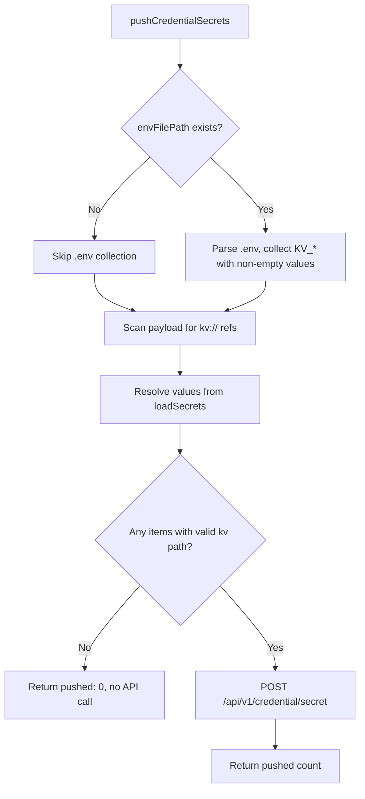

# Upload Credentials, test-e2e, and CLI Documentation Plan

## Rules and Standards

This plan must comply with the following rules from [Project Rules](.cursor/rules/project-rules.mdc):

- **[Quality Gates](.cursor/rules/project-rules.mdc#quality-gates)** - Mandatory checks before commit: build, lint, test must pass.
- **[Code Quality Standards - Documentation Requirements](.cursor/rules/project-rules.mdc#documentation-requirements)** - Use canonical Mermaid diagrams from flows-and-visuals.md for workflow documentation.
- **[Security & Compliance - Secret Management](.cursor/rules/project-rules.mdc#secret-management)** - Document kv:// references, credential push behavior, and skip conditions without exposing secrets.
- **[Development Workflow - Post-Development](.cursor/rules/project-rules.mdc#development-workflow)** - Run build, lint, tests after changes.

**Key Requirements:**

- Documentation updates only; no code logic changes.
- Preserve existing doc structure; add clarity without breaking links.
- Mermaid diagram in plan follows flows-and-visuals.md styling.
- No hardcoded secrets or sensitive data in docs.

## Before Development

- Read upload "Credential secrets push" section in external-integration.md (around line 229)
- Read datasource test-e2e section in external-integration.md (around 789-805)
- Confirm docs/configuration/secrets-and-config.md content for credential push references
- Review flows-and-visuals.md for Mermaid styling if modifying diagrams

## Definition of Done

Before marking this plan as complete, ensure:

1. **Build:** Run `npm run build` (must complete successfully - runs lint + test:ci)
2. **Lint:** Run `npm run lint` (must pass with zero errors/warnings)
3. **Test:** Run `npm test` or `npm run test:ci` (all tests must pass)
4. **Validation order:** BUILD → LINT → TEST (mandatory sequence)
5. Documentation changes are accurate and consistent with code in lib/utils/credential-secrets-env.js
6. All implementation tasks completed
7. No broken internal doc links
8. KV_* to kv:// path mapping documented correctly

## Summary of Findings

### 1. Upload credential push – skip behavior (already correct in code)

Current behavior in [lib/utils/credential-secrets-env.js](lib/utils/credential-secrets-env.js):

- **No .env file:** `buildItemsFromEnv` returns early when `!fs.existsSync(envFilePath)` (line 131) – no env-based items
- **Empty values:** `collectKvEnvVarsAsSecretItems` skips entries where `value === ''` (lines 46–47)
- **Unresolved kv:// in payload:** `buildItemsFromPayload` only adds items when `resolved !== null && resolved !== undefined` (line 163)
- **No items to push:** `pushCredentialSecrets` returns `{ pushed: 0 }` without calling the API when `items.length === 0` (line 233)

**Conclusion:** Logic already skips when there are no keys, no .env, or empty values. Documentation should state this explicitly.

---

### 2. aifabrix datasource test-e2e – credential validation

- **Flow:** CLI calls `POST /api/v1/external/{sourceIdOrKey}/test-e2e`; the dataplane runs steps in order: **config, credential, sync, data, CIP** (see [lib/utils/external-system-display.js](lib/utils/external-system-display.js) line 245).
- **Credential step:** Credential status is validated as step 2 in that sequence, not as a separate pre-check before the E2E run.
- **CLI behavior:** The CLI does not pre-validate credential status; it passes the request to the dataplane, which runs all steps and returns per-step results.

---

### 3. CLI help – test-e2e visibility

- `**aifabrix test-e2e <app>`** – Present in main help under "Applications (Create & Develop)" ([lib/utils/help-builder.js](lib/utils/help-builder.js) line 51).
- `**aifabrix datasource test-e2e <datasourceKey>`** – Present under `aifabrix datasource --help` (subcommand of `datasource`). The main `aifabrix --help` only lists top-level commands; subcommands appear under their parent (e.g. `datasource`, `app`, `credential`).

**Conclusion:** Both commands appear in help. Top-level help intentionally shows parent commands only; datasource test-e2e is discoverable via `aifabrix datasource --help` or `help datasource test-e2e`.

---

## Documentation Updates Required

| Doc                                                                                                         | Update                                                                                                                                                                                                                                                                                                                                                                                                                          |
| ----------------------------------------------------------------------------------------------------------- | ------------------------------------------------------------------------------------------------------------------------------------------------------------------------------------------------------------------------------------------------------------------------------------------------------------------------------------------------------------------------------------------------------------------------------- |
| [docs/commands/external-integration.md](docs/commands/external-integration.md) (upload section)             | Clarify credential push skip behavior and add paragraph: *If there is no `.env` file, no `KV_`* keys, or values are empty, the credential push step is skipped. No `POST /api/v1/credential/secret` call is made when there are no items to push.*                                                                                                                                                                              |
| [docs/commands/external-integration.md](docs/commands/external-integration.md) (credential secrets section) | Align with the user statement: *If your external system uses `kv://test-hubspot/clientId` and `kv://test-hubspot/clientSecret`, ensure `.env` contains corresponding `KV_`* variables (e.g. `KV_TEST_HUBSPOT_CLIENTID`) or values are available in secrets so upload maps them to the expected kv paths. No separate `POST /api/v1/credential/secret` call is needed when using `aifabrix upload` for E2E or deployment flows.* |
| [docs/commands/external-integration.md](docs/commands/external-integration.md) (datasource test-e2e)        | Add note: *The dataplane runs E2E steps in order: config, credential, sync, data, CIP. Credential status is validated as the second step in this sequence.*                                                                                                                                                                                                                                                                     |
| [docs/commands/external-integration-testing.md](docs/commands/external-integration-testing.md)              | Same datasource test-e2e clarification about credential step order.                                                                                                                                                                                                                                                                                                                                                             |
| [docs/commands/application-development.md](docs/commands/application-development.md)                        | (Optional) Add a short cross-reference to datasource test-e2e for external systems (e.g. under test-integration), since `aifabrix test-e2e <app>` is builder-only.                                                                                                                                                                                                                                                              |
| [docs/configuration/secrets-and-config.md](docs/configuration/secrets-and-config.md) (if exists)            | Add upload skip behavior (no .env, no keys, empty values → skip).                                                                                                                                                                                                                                                                                                                                                               |

---

## CLI Help Validation – Other Commands

Audit that help-builder CATEGORIES match actual registered commands:

- **Applications:** create, wizard, build, run, shell, test, install, **test-e2e**, lint, logs, stop, dockerfile – all present in [lib/cli/setup-app.js](lib/cli/setup-app.js).
- **External Systems:** download, upload, delete, repair, test, test-integration – all present.
- **Application & Datasource Management:** app, datasource, credential, deployment, service-user – datasource subcommands (validate, list, diff, deploy, test-integration, test-e2e) appear under `aifabrix datasource --help`.

No missing top-level commands identified. Subcommands are shown under their parent commands, which is the intended design.

---

## Implementation Tasks

1. **Update [docs/commands/external-integration.md](docs/commands/external-integration.md):**
  - In the upload "Credential secrets push" section (around line 229), add:
    - Skip conditions: no .env, no KV_* keys, empty values
    - Clarify mapping of `.env` `KV_`* to `kv://` paths
  - In the datasource test-e2e section (around 789–805), add a short note on E2E step order (config, credential, sync, data, CIP).
2. **Update [docs/commands/external-integration-testing.md](docs/commands/external-integration-testing.md):**
  - Add the same E2E step-order note in the datasource E2E tests section.
3. **Optional – [docs/commands/application-development.md](docs/commands/application-development.md):**
  - Under test-integration, add a brief note: *For datasource-level E2E tests (including credential validation), use `aifabrix datasource test-e2e <datasourceKey>`; see [External Integration Commands](external-integration.md#aifabrix-datasource-test-e2e-datasourcekey).*
4. **Verify [docs/configuration/secrets-and-config.md](docs/configuration/secrets-and-config.md):**
  - If it describes upload credential push, add the skip conditions there; otherwise skip.

---

## Mermaid – Upload Credential Push Flow

---

## Plan Validation Report

**Date:** 2025-02-28
**Plan:** .cursor/plans/84-upload_credentials_docs_and_cli_validation.plan.md
**Status:** VALIDATED

### Plan Purpose

Documentation-only plan to clarify: (1) upload credential-secrets skip behavior when no .env, no KV_* keys, or empty values; (2) E2E credential validation flow (credential is step 2 in config, credential, sync, data, CIP); (3) CLI help vs docs alignment; and (4) required doc updates.

**Scope:** docs/commands/external-integration.md, docs/commands/external-integration-testing.md, docs/commands/application-development.md, docs/configuration/secrets-and-config.md.

**Plan type:** Documentation.

### Applicable Rules

- Quality Gates - Mandatory for all plans; build, lint, test documented in DoD
- Code Quality Standards - Documentation Requirements; Mermaid diagram present and follows styling
- Security & Compliance - Secret Management; plan documents kv:// and credential push without exposing secrets
- Development Workflow - Post-development steps in DoD

### Rule Compliance

- DoD Requirements: Documented (build, lint, test, validation order)
- Quality Gates: Compliant
- Documentation Requirements: Compliant (Mermaid diagram included)
- Security & Compliance: Compliant (no secrets in docs)
- No new code; no JSDoc or test additions required for doc-only changes

### Plan Updates Made

- Added Rules and Standards section with rule references
- Added Before Development checklist
- Added Definition of Done section with BUILD, LINT, TEST order
- Appended validation report

### Recommendations

- When implementing, verify secrets-and-config.md exists and contains upload credential push content before adding skip conditions
- Ensure KV_* to kv:// path mapping examples are accurate (e.g. KV_TEST_HUBSPOT_CLIENTID → kv://test-hubspot/clientid)

---

## Implementation Validation Report

**Date:** 2025-02-28
**Plan:** .cursor/plans/84-upload_credentials_docs_and_cli_validation.plan.md
**Status:** COMPLETE

### Executive Summary

All implementation tasks completed. Documentation updates applied to four files. Format, lint, and tests passed. Documentation-only plan; no new code or tests required.

### Task Completion

- Total implementation tasks: 4
- Completed: 4
- Incomplete: 0
- Completion: 100%

| Task                                                                                                     | Status |
| -------------------------------------------------------------------------------------------------------- | ------ |
| 1. external-integration.md – credential push skip behavior, KV_* mapping, datasource test-e2e step order | Done   |
| 2. external-integration-testing.md – E2E step order note                                                 | Done   |
| 3. application-development.md – datasource test-e2e cross-reference                                      | Done   |
| 4. secrets-and-config.md – upload skip conditions                                                        | Done   |

### File Existence Validation

| File                                          | Status          |
| --------------------------------------------- | --------------- |
| docs/commands/external-integration.md         | Exists, updated |
| docs/commands/external-integration-testing.md | Exists, updated |
| docs/commands/application-development.md      | Exists, updated |
| docs/configuration/secrets-and-config.md      | Exists, updated |

### Content Verification

- Skip conditions documented in external-integration.md and secrets-and-config.md
- KV_* to kv:// mapping with example (KV_TEST_HUBSPOT_CLIENTID, kv://test-hubspot/clientId)
- E2E step order (config, credential, sync, data, CIP) in external-integration.md and external-integration-testing.md
- datasource test-e2e cross-reference in application-development.md
- No separate POST /api/v1/credential/secret note in upload section

### Code Quality Validation

| Step                      | Result                          |
| ------------------------- | ------------------------------- |
| Format (npm run lint:fix) | PASSED (exit 0)                 |
| Lint (npm run lint)       | PASSED (0 errors, 0 warnings)   |
| Tests (npm test)          | PASSED (228 suites, 4932 tests) |

### Cursor Rules Compliance

- Documentation Requirements: Passed (Mermaid diagram in plan; docs updated)
- Security & Compliance – Secret Management: Passed (no secrets in docs; kv:// references documented)
- Quality Gates: Passed (lint + test pass)

### Implementation Completeness

- Documentation: COMPLETE
- No new code: N/A (documentation-only plan)
- No new tests required: N/A
- Internal doc links: Verified (external-integration.md#aifabrix-datasource-test-e2e-datasourcekey, secrets-and-config.md, permissions.md)

### Final Validation Checklist

- All implementation tasks completed
- All files exist and updated
- Lint passes (zero errors/warnings)
- Tests pass (all 228 suites)
- Documentation changes accurate and consistent with lib/utils/credential-secrets-env.js
- No broken internal doc links
- KV_* to kv:// path mapping documented correctly

