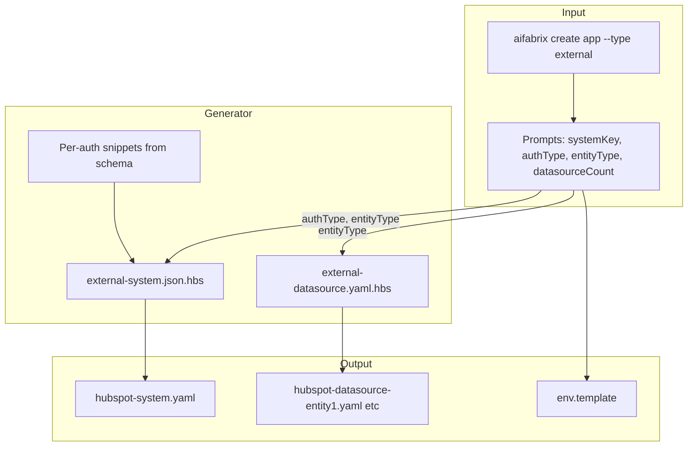

# Manual Generation Improvements

## Context

Manual creation uses `aifabrix create <app> --type external` which calls [lib/external-system/generator.js](lib/external-system/generator.js) and templates under [templates/external-system/](templates/external-system/). The external-system template uses an outdated auth format, and entityType is inferred from resourceType rather than being user-selected.

**Related work:** Dataplane plan 311 (AI Generation Validation and Quality Improvements) added CIP example snippets and per-resourceType snippets for AI prompts. Manual generation should align: use entityType-appropriate CIP operation patterns in commented execution blocks so manual output is consistent with AI-generated configs.

## Current vs Target

| Area                | Current                                                                                | Target                                                                                                                                                                            |
| ------------------- | -------------------------------------------------------------------------------------- | --------------------------------------------------------------------------------------------------------------------------------------------------------------------------------- |
| Auth                | Old `type`/`oauth2`/`apikey`/`basic` format                                            | Schema `method`, `variables`, `security` per [authenticationVariablesByMethod](lib/schema/external-system.schema.json) (oauth2, aad, apikey, basic, queryParam, oidc, hmac, none) |
| Auth prompts        | oauth2, apikey, basic only                                                             | All schema methods (add aad, queryParam, oidc, hmac, none)                                                                                                                        |
| entityType          | Derived from resourceType; not prompted                                                | Promoted to input; when omitted, show list to select (recordStorage, documentStorage, vectorStore, messageService, none)                                                          |
| Datasource sections | Only entityType-specific snippets (sync, documentStorage, vectorStore, messageService) | All optional sections present as commented blocks (sync, documentStorage, vectorStore, messageService, execution, config, etc.)                                                   |

---

## Rules and Standards

This plan must comply with [Project Rules](.cursor/rules/project-rules.mdc):

- **[CLI Command Development](.cursor/rules/project-rules.mdc#cli-command-development)** – Adding `--entity-type` option, prompts, and input validation
- **[Template Development](.cursor/rules/project-rules.mdc#template-development)** – Handlebars templates for external-system and external-datasource
- **[Architecture Patterns – Generated Output](.cursor/rules/project-rules.mdc#generated-output-integration-and-builder)** – Fixes go into generator/templates, not only generated artifacts
- **[Security & Compliance (ISO 27001)](.cursor/rules/project-rules.mdc#security--compliance-iso-27001)** – `kv://` references for secrets, no hardcoded credentials
- **[Quality Gates](.cursor/rules/project-rules.mdc#quality-gates)** – Build, lint, test must pass before commit
- **[Code Quality Standards](.cursor/rules/project-rules.mdc#code-quality-standards)** – File size limits, JSDoc, documentation
- **[Testing Conventions](.cursor/rules/project-rules.mdc#testing-conventions)** – Jest, mocks, 80%+ coverage for new code

**Key requirements:**

- Add `--entity-type` via Commander.js `.option()`; validate inputs
- Use try-catch for async operations; use chalk for CLI output
- Security values in templates must be `kv://` only; never log secrets
- All new/modified public functions need JSDoc
- Keep files ≤500 lines, functions ≤50 lines
- Add tests for each auth method output, entityType propagation, commented sections

---

## Before Development

- Read CLI Command Development and Template Development sections from project-rules.mdc
- Review [lib/external-system/generator.js](lib/external-system/generator.js) and [templates/external-system/](templates/external-system/)
- Review [lib/schema/external-system.schema.json](lib/schema/external-system.schema.json) `$defs.authenticationVariablesByMethod`
- Review [tests/lib/external-system/external-system-generator.test.js](tests/lib/external-system/external-system-generator.test.js) for existing patterns

---

## Definition of Done

Before marking this plan complete:

1. **Build**: Run `npm run build` (runs lint + test; must complete successfully)
2. **Lint**: Run `npm run lint` (zero errors/warnings; runs as part of build)
3. **Test**: Run `npm test` (all tests pass; runs as part of build)
4. **Coverage**: Ensure 80%+ coverage for new/modified code
5. **File size**: Files ≤500 lines, functions ≤50 lines
6. **JSDoc**: All new public functions have JSDoc comments
7. **Security**: No hardcoded secrets; auth templates use `kv://` only
8. **Documentation**: Update [docs/external-systems.md](docs/external-systems.md) and [docs/commands/application-development.md](docs/commands/application-development.md) for new prompts and flags
9. All implementation tasks completed

---

## Implementation Plan

### 1. Add entityType prompt and extend auth choices

**File:** [lib/app/prompts.js](lib/app/prompts.js)

- Add `entityType` prompt in `buildExternalSystemQuestions` (or new helper) when `options.entityType` is missing:
  - Choices: recordStorage, documentStorage, vectorStore, messageService, none (labels: "Record storage (CRM)", "Document storage (with vector)", "Vector store", "Message service", "None")
  - Default: `recordStorage`
- Extend `buildExternalSystemTypeQuestions` auth choices to include: oauth2, aad, apikey, basic, queryParam, oidc, hmac, none
- Add `entityType` to `resolveExternalSystemFields` and `normalizeExternalOptions` in [lib/cli/setup-app.js](lib/cli/setup-app.js)

### 2. Create per-auth system template snippets

**New files:** `templates/external-system/auth-snippets/` (or inline in Handlebars partials)

Create snippets per `authenticationVariablesByMethod` from [lib/schema/external-system.schema.json](lib/schema/external-system.schema.json) (lines 74-84):

- **oauth2**: `variables` (baseUrl, tokenUrl, authorizationUrl, scope, tenantId), `security` (clientId, clientSecret)
- **aad**: same as oauth2
- **apikey**: `variables` (baseUrl, headerName, prefix), `security` (apiKey)
- **basic**: `variables` (baseUrl), `security` (username, password)
- **queryParam**: `variables` (baseUrl, paramName), `security` (paramValue)
- **oidc**: `variables` (openIdConfigUrl, clientId, etc.), no security
- **hmac**: `variables` (baseUrl, algorithm, etc.), `security` (signingSecret)
- **none**: empty variables and security

Each snippet should output valid YAML/JSON matching the schema. Values for `security` must use `kv://` pattern (e.g. `kv://<systemKey>/client-id`).

### 3. Rewrite external-system template

**File:** [templates/external-system/external-system.json.hbs](templates/external-system/external-system.json.hbs)

- Replace old auth block with new `authentication` structure:
  - `method`: from `authType`
  - `variables`: from per-auth snippet (baseUrl when not none, etc.)
  - `security`: from per-auth snippet (kv:// refs)
- Keep openapi/mcp blocks; add commented optional sections (configuration, roles, permissions) so developers can uncomment as needed.

### 4. Update env.template generation for external systems

**File:** [lib/app/config.js](lib/app/config.js) `generateExternalSystemEnvTemplate` and/or [lib/generator/wizard.js](lib/generator/wizard.js) `addAuthenticationLines`

- Align with schema: generate variables and security keys per auth method.
- Add support for aad, queryParam, oidc, hmac, none.
- Use kv:// format consistent with schema (`kv://<systemKey>/<key>`).

### 5. Update external-datasource template

**File:** [templates/external-system/external-datasource.yaml.hbs](templates/external-system/external-datasource.yaml.hbs)

- Pass `schemaEntityType` from config (from user-selected `entityType`, normalized to camelCase).
- Keep existing entityType-specific commented blocks (sync, documentStorage, vectorStore, messageService).
- Add commented blocks for other optional sections: `execution` (engine: cip, operations), `config`, `capabilities`, `exposed`, `metadataSchema` so developers can uncomment.
- **Align execution examples with entityType**: The commented `execution` block should use entityType-appropriate CIP operation patterns, consistent with the dataplane's AI generation (see dataplane `prompt_templates/examples/cip_record_based.md`, `cip_document.md`, `cip_sharepoint.md`). For example:
  - **recordStorage** → list, get, create with paginate (cursor/page/offset); typical CRUD
  - **documentStorage** → list, get, upload with paginate (offset typical); document patterns
  - **vectorStore** / **messageService** → per schema; keep minimal or reference schema
  This ensures manual-generated configs align with AI-generated output and give developers useful starter snippets.

### 6. Update generator to use entityType and auth method

**File:** [lib/external-system/generator.js](lib/external-system/generator.js)

- In `generateExternalSystemTemplate`: accept `authType` (method) and build auth block from schema `authenticationVariablesByMethod` (load from schema or embed mapping).
- In `generateExternalSystemFiles`: pass `entityType` from config to each datasource; use it as `schemaEntityType` instead of deriving from resourceType.
- Ensure `generateExternalDataSourceTemplate` receives `schemaEntityType` from config (user entityType).

### 7. Add CLI option for entityType

**File:** [lib/cli/setup-app.js](lib/cli/setup-app.js)

- Add `--entity-type <type>` option to create command.
- Map to `normalizeExternalOptions` and `validateNonInteractiveExternalOptions` when `--type external`.

### 8. Update documentation

**Files:** [docs/external-systems.md](docs/external-systems.md), [docs/commands/application-development.md](docs/commands/application-development.md)

- Add entityType to "You'll be asked" prompt list; extend auth choices (aad, queryParam, oidc, hmac, none)
- Document `--entity-type` flag for create command
- Clarify entityType vs datasource filenames (entity1, entity2)

---

## Data flow (mermaid)

---

## Files to modify

| File                                                                                                             | Changes                                                         |
| ---------------------------------------------------------------------------------------------------------------- | --------------------------------------------------------------- |
| [lib/app/prompts.js](lib/app/prompts.js)                                                                         | Add entityType prompt, extend auth choices                      |
| [lib/cli/setup-app.js](lib/cli/setup-app.js)                                                                     | Add --entity-type, normalize, validate                          |
| [lib/external-system/generator.js](lib/external-system/generator.js)                                             | Use schema auth mapping, pass entityType to datasources         |
| [templates/external-system/external-system.json.hbs](templates/external-system/external-system.json.hbs)         | New authentication block, optional commented sections           |
| [templates/external-system/external-datasource.yaml.hbs](templates/external-system/external-datasource.yaml.hbs) | More commented optional sections                                |
| [lib/app/config.js](lib/app/config.js)                                                                           | Extend `generateExternalSystemEnvTemplate` for all auth methods |
| [docs/external-systems.md](docs/external-systems.md)                                                             | Add entityType prompt, extend auth choices in "You'll be asked" |
| [docs/commands/application-development.md](docs/commands/application-development.md)                             | Add entityType to prompts, document `--entity-type` flag        |

---

## Schema references

- **Auth:** [external-system.schema.json](lib/schema/external-system.schema.json) `$defs.authenticationVariablesByMethod` (lines 74-84)
- **entityType enum:** [external-datasource.schema.json](lib/schema/external-datasource.schema.json) `entityType` (lines 137-141)
- **documentStorage, sync, vectorStore, messageService:** [external-datasource.schema.json](lib/schema/external-datasource.schema.json) `properties` and `$defs`

---

## Tests

- [tests/lib/external-system/external-system-generator.test.js](tests/lib/external-system/external-system-generator.test.js): Add tests for each auth method output, entityType propagation, commented sections presence.
- Update/create tests for `generateExternalSystemEnvTemplate` with new auth methods.

---

## Plan Validation Report

**Date**: 2026-02-28  
**Plan**: `.cursor/plans/85-manual_generation_improvements.plan.md`  
**Status**: VALIDATED

### Plan Purpose

Improve manual external system/datasource generation: (1) use schema-compliant authentication (method/variables/security per authenticationVariablesByMethod), (2) add entityType as selectable input with correct datasource sections, (3) emit optional sections as commented snippets developers can uncomment.

**Affected areas**: CLI commands, Handlebars templates, generator module, env.template generation, documentation  
**Plan type**: Development (CLI, templates, configuration)

### Applicable Rules

- [CLI Command Development](.cursor/rules/project-rules.mdc#cli-command-development) – New `--entity-type` option, prompts
- [Template Development](.cursor/rules/project-rules.mdc#template-development) – Handlebars templates for external-system and external-datasource
- [Architecture Patterns – Generated Output](.cursor/rules/project-rules.mdc#generated-output-integration-and-builder) – Fixes in generator/templates
- [Security & Compliance (ISO 27001)](.cursor/rules/project-rules.mdc#security--compliance-iso-27001) – `kv://` for secrets
- [Quality Gates](.cursor/rules/project-rules.mdc#quality-gates) – Build, lint, test
- [Code Quality Standards](.cursor/rules/project-rules.mdc#code-quality-standards) – File size, JSDoc
- [Testing Conventions](.cursor/rules/project-rules.mdc#testing-conventions) – Jest, coverage

### Rule Compliance

- DoD requirements: Documented (build, lint, test, coverage, file size, JSDoc, security)
- Rules and Standards section: Added with links
- Before Development section: Added
- Definition of Done section: Added

### Plan Updates Made

- Added Rules and Standards section with rule links
- Added Before Development checklist
- Added Definition of Done section
- Added documentation update task (step 8)
- Added docs to Files to modify table
- Appended validation report

### Recommendations

- Ensure auth snippet templates use `kv://<systemKey>/...` pattern per schema
- Add tests for non-interactive create with `--entity-type` when `--type external`

---

## Implementation Validation Report

**Date**: 2026-03-01  
**Plan**: `.cursor/plans/85-manual_generation_improvements.plan.md`  
**Status**: ✅ COMPLETE

### Executive Summary

Plan 85 (Manual Generation Improvements) implementation is complete. All 8 implementation steps are done. Format, lint, and tests pass. All files exist with expected changes. Cursor rules compliance verified.

### Task Completion

| Step | Description                                                    | Status     |
| ---- | -------------------------------------------------------------- | ---------- |
| 1    | Add entityType prompt and extend auth choices                  | ✅ Complete |
| 2    | Create per-auth system template snippets (inline in generator) | ✅ Complete |
| 3    | Rewrite external-system template                               | ✅ Complete |
| 4    | Update env.template generation for all auth methods            | ✅ Complete |
| 5    | Update external-datasource template with CIP execution blocks  | ✅ Complete |
| 6    | Update generator to use entityType and schema auth             | ✅ Complete |
| 7    | Add CLI option --entity-type                                   | ✅ Complete |
| 8    | Update documentation                                           | ✅ Complete |

### File Existence Validation

| File                                                   | Status   | Notes                                                                                      |
| ------------------------------------------------------ | -------- | ------------------------------------------------------------------------------------------ |
| lib/app/prompts.js                                     | ✅ Exists | entityType prompt, auth choices (oauth2, aad, apikey, basic, queryParam, oidc, hmac, none) |
| lib/cli/setup-app.js                                   | ✅ Exists | --entity-type option, normalizeExternalOptions, validateNonInteractiveExternalOptions      |
| lib/external-system/generator.js                       | ✅ Exists | buildAuthenticationFromMethod, entityType propagation                                      |
| templates/external-system/external-system.json.hbs     | ✅ Exists | New authentication (method, variables, security)                                           |
| templates/external-system/external-datasource.yaml.hbs | ✅ Exists | entityType-specific commented CIP sections                                                 |
| lib/app/config.js                                      | ✅ Exists | generateExternalSystemEnvTemplate for all auth methods                                     |
| docs/external-systems.md                               | ✅ Exists | entityType in "You'll be asked", --entity-type in non-interactive example                  |
| docs/commands/application-development.md               | ✅ Exists | entityType prompts, external flags including --entity-type                                 |

### Test Coverage

| Test Area                                                               | Status                                                    |
| ----------------------------------------------------------------------- | --------------------------------------------------------- |
| Auth methods (oauth2, aad, apikey, basic, queryParam, oidc, hmac, none) | ✅ 8 tests in external-system-generator.test.js            |
| entityType propagation                                                  | ✅ propagate entityType, propagate vectorStore/none        |
| Commented sections                                                      | ✅ recordStorage, vectorStore, messageService, none        |
| generateExternalSystemEnvTemplate                                       | ✅ OAuth2, apikey, basic, queryParam in app-config.test.js |

### Code Quality Validation

| Step                        | Result                          |
| --------------------------- | ------------------------------- |
| Format (`npm run lint:fix`) | ✅ PASSED                        |
| Lint (`npm run lint`)       | ✅ PASSED (0 errors, 0 warnings) |
| Tests (`npm run build`)     | ✅ PASSED                        |

### File Size Compliance

| File                             | Lines | Limit | Status |
| -------------------------------- | ----- | ----- | ------ |
| lib/app/prompts.js               | 470   | 500   | ✅      |
| lib/cli/setup-app.js             | 418   | 500   | ✅      |
| lib/external-system/generator.js | 283   | 500   | ✅      |
| lib/app/config.js                | 236   | 500   | ✅      |

### Cursor Rules Compliance

| Rule                    | Status                                      |
| ----------------------- | ------------------------------------------- |
| CLI Command Development | ✅ --entity-type option, prompts, validation |
| Template Development    | ✅ Handlebars, schema auth, CIP sections     |
| Generated Output        | ✅ Fixes in generator/templates              |
| Security (kv:// only)   | ✅ All auth security use kv:// pattern       |
| Quality Gates           | ✅ Build, lint, test pass                    |
| Code Quality            | ✅ File size, JSDoc on new functions         |
| Testing Conventions     | ✅ Jest, mocks, coverage                     |

### Final Validation Checklist

- All implementation steps completed
- All files exist with expected changes
- Tests exist for auth methods, entityType, commented sections
- Code quality validation passes (format, lint, test)
- Cursor rules compliance verified
- Implementation complete

