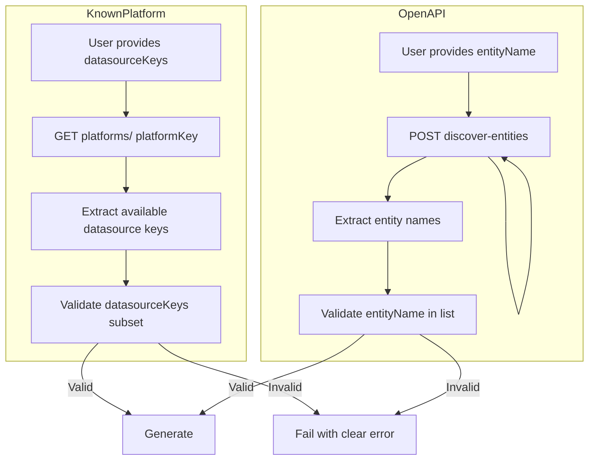

# Data Source List Validation

## Context

The dataplane plan [312-entity_discovery_api_and_multi-entity_wizard](workspace/aifabrix-dataplane/.cursor/plans/312-entity_discovery_api_and_multi-entity_wizard.plan.md) adds:

- `POST /api/v1/wizard/discover-entities` — returns entities from OpenAPI (companies, deals, contacts)
- `entityName` in generate-config — user selects which entity to generate for
- Known platforms use `datasourceKeys` to select which datasources to include

Currently the builder passes `datasourceKeys` and (future) `entityName` to the dataplane **without validating** they exist. Invalid values cause opaque API errors late in the flow. We need **upfront validation** with clear, actionable errors.

---

## Dataplane APIs (Already Available)

| Endpoint                                     | Purpose                                                                          |
| -------------------------------------------- | -------------------------------------------------------------------------------- |
| `GET /api/v1/wizard/platforms/{platformKey}` | Returns platform details including `datasources: [{ key, displayName, entity }]` |
| `POST /api/v1/wizard/discover-entities`      | Returns `entities: [{ name, pathCount, schemaMatch }]` for OpenAPI specs         |

---

## Architecture

---

## Implementation Plan

### 1. Add Wizard API Functions

**File:** [lib/api/wizard.api.js](lib/api/wizard.api.js)

Add:

- `**getPlatformDetails(dataplaneUrl, authConfig, platformKey)`** — `GET /api/v1/wizard/platforms/{platformKey}`. Returns platform object including `datasources: [{ key, displayName, entity }]`. Throws on 404 or error.
- `**discoverEntities(dataplaneUrl, authConfig, openapiSpec)`** — `POST /api/v1/wizard/discover-entities` with `{ openapiSpec }`. Returns `{ entities: [{ name, pathCount, schemaMatch }] }`. Throws on error.

Add JSDoc `@requiresPermission` per [permissions-guide.md](permissions-guide.md). Export both.

### 2. Add Validation Helpers

**File:** [lib/commands/wizard-core-helpers.js](lib/commands/wizard-core-helpers.js) or new `lib/validation/wizard-datasource-validation.js`

Add:

- `**validateDatasourceKeysForPlatform(datasourceKeys, availableDatasources)`** — `availableDatasources` is `{ key, displayName, entity }[]`. Ensure every `datasourceKeys` item exists in `availableDatasources.map(d => d.key)`. Return `{ valid, invalidKeys: string[] }`.
- `**validateEntityNameForOpenApi(entityName, entities)`** — `entities` is `{ name }[]`. Ensure `entityName` is in `entities.map(e => e.name)`. Return `{ valid }`.

Keep functions small and pure (no API calls); callers pass fetched data.

### 3. Validate Known Platform datasourceKeys

**Flow:** Before calling `getPlatformConfig`, when `datasourceKeys` is non-empty:

1. Call `getPlatformDetails(dataplaneUrl, authConfig, platformKey)`.
2. Extract `availableKeys = response.data?.datasources?.map(d => d.key) ?? []`.
3. Call `validateDatasourceKeysForPlatform(datasourceKeys, response.data.datasources)`.
4. If invalid: throw with message like `Invalid datasource keys: [X, Y]. Available for platform 'hubspot': [hubspot-companies, hubspot-contacts, hubspot-deals].`

**Locations:**

- [lib/commands/wizard-core.js](lib/commands/wizard-core.js): In `callGenerateApi` or immediately before it when `sourceType === 'known-platform'` and `options.datasourceKeys?.length > 0`.
- [lib/commands/wizard-headless.js](lib/commands/wizard-headless.js): No change needed; validation happens in `handleConfigurationGeneration` path.

### 4. Validate OpenAPI entityName (Post Plan 312)

When the builder starts passing `entityName` to generate-config (after dataplane supports it):

1. Before `generateConfig`, if `entityName` is provided:
2. Call `discoverEntities(dataplaneUrl, authConfig, openapiSpec)`.
3. Call `validateEntityNameForOpenApi(entityName, response.entities)`.
4. If invalid: throw with message like `Entity 'foo' not found. Available: [companies, deals, contacts].`

**Note:** This step depends on Plan 312 (dataplane) and builder changes to pass `entityName` to `generateConfig`. If the builder does not yet send `entityName`, this validation can be added when that flow is implemented.

### 5. Extend wizard-config Schema (Optional)

**File:** [lib/schema/wizard-config.schema.json](lib/schema/wizard-config.schema.json)

- Add `datasourceKeys: { type: "array", items: { type: "string" } }` to `source.properties` for known-platform.
- Add `entityName: { type: "string" }` to `source.properties` for openapi flows when that flow is added.

Schema validation remains structural; semantic validation (keys/entities exist) happens at runtime via the new helpers.

### 6. Headless Pre-flight Validation (Optional but Recommended)

**File:** [lib/validation/wizard-config-validator.js](lib/validation/wizard-config-validator.js)

Add optional `validateDatasourceListAgainstDataplane(config, dataplaneUrl, authConfig)` that:

- For `source.type === 'known-platform'` and `source.datasourceKeys`: calls `getPlatformDetails` + `validateDatasourceKeysForPlatform` and returns errors if invalid.
- Requires async/API access; call only when `validateFilePaths`-style options enable it (e.g. `validateAgainstDataplane: true`).

This allows `aifabrix wizard validate-config wizard.yaml` (or similar) to validate datasource keys before running the full wizard. Integrate into headless flow if desired.

### 7. Documentation

**Files:** [docs/wizard.md](docs/wizard.md), [docs/commands/utilities.md](docs/commands/utilities.md) (if validate-config exists)

- Document that `datasourceKeys` for known-platform are validated against the platform's available datasources; invalid keys produce a clear error listing available options.
- When entityName flow exists: document that `entityName` is validated against discover-entities; invalid values produce a clear error.

---

## File Summary

| File                                                                                                                               | Action                                                                              |
| ---------------------------------------------------------------------------------------------------------------------------------- | ----------------------------------------------------------------------------------- |
| [lib/api/wizard.api.js](lib/api/wizard.api.js)                                                                                     | Add `getPlatformDetails`, `discoverEntities`                                        |
| [lib/commands/wizard-core-helpers.js](lib/commands/wizard-core-helpers.js) or new `lib/validation/wizard-datasource-validation.js` | Add `validateDatasourceKeysForPlatform`, `validateEntityNameForOpenApi`             |
| [lib/commands/wizard-core.js](lib/commands/wizard-core.js)                                                                         | Before `getPlatformConfig`, validate datasourceKeys via getPlatformDetails + helper |
| [lib/schema/wizard-config.schema.json](lib/schema/wizard-config.schema.json)                                                       | Add `datasourceKeys`, optionally `entityName` to source                             |
| [lib/validation/wizard-config-validator.js](lib/validation/wizard-config-validator.js)                                             | Optional: add async validate against dataplane                                      |
| [docs/wizard.md](docs/wizard.md)                                                                                                   | Document datasourceKeys validation and error behavior                               |

---

## Edge Cases

- **Empty datasourceKeys**: No validation; dataplane returns all datasources (current behavior).
- **Platform not found (404)**: `getPlatformDetails` throws; wizard fails with "Platform 'X' not found".
- **discover-entities returns empty**: If `entityName` provided, treat as invalid and list "No entities discovered from OpenAPI".
- **Dataplane unreachable**: Existing wizard error handling applies; no new behavior.
- **Backward compatibility**: When datasourceKeys is omitted, behavior unchanged.

---

## Rules and Standards

This plan must comply with [Project Rules](.cursor/rules/project-rules.mdc). Applicable sections:

- **[Architecture Patterns – API Client Structure](.cursor/rules/project-rules.mdc#api-client-structure-pattern)** – New API functions in `lib/api/wizard.api.js`; use centralized API client
- **[API Permissions](.cursor/rules/project-rules.mdc#api-permissions)** – Add `@requiresPermission` JSDoc per [permissions-guide.md](permissions-guide.md) for Dataplane calls
- **[Validation Patterns](.cursor/rules/project-rules.mdc#validation-patterns)** – Validation helpers; schema updates in `lib/schema/`
- **[Code Quality Standards](.cursor/rules/project-rules.mdc#code-quality-standards)** – File size limits (≤500 lines, ≤50 per function), JSDoc for all public functions
- **[Quality Gates](.cursor/rules/project-rules.mdc#quality-gates)** – Build, lint, test mandatory; 80%+ coverage for new code
- **[Error Handling & Logging](.cursor/rules/project-rules.mdc#error-handling--logging)** – Meaningful error messages, chalk for output, no sensitive data in errors
- **[Testing Conventions](.cursor/rules/project-rules.mdc#testing-conventions)** – Jest, mocks for API client, success and error paths
- **[Security & Compliance](.cursor/rules/project-rules.mdc#security--compliance-iso-27001)** – Input validation, no hardcoded secrets

**Key requirements:**

- Use `lib/api/` for all API calls; add `getPlatformDetails` and `discoverEntities` to wizard.api.js
- JSDoc for all new public functions; include `@requiresPermission` for Dataplane endpoints
- Try-catch for async operations; clear, actionable error messages for invalid datasourceKeys/entityName
- Validate inputs; keep validation helpers pure (no API calls inside)
- Tests in `tests/` mirroring source; mock ApiClient for API tests

---

## Before Development

- Read Architecture Patterns and API Client Structure from project-rules.mdc
- Review [lib/api/wizard.api.js](lib/api/wizard.api.js) for existing patterns
- Review [permissions-guide.md](permissions-guide.md) for `@requiresPermission` format
- Confirm dataplane endpoints: `GET /api/v1/wizard/platforms/{platformKey}`, `POST /api/v1/wizard/discover-entities`
- Review [lib/commands/wizard-core.js](lib/commands/wizard-core.js) `callGenerateApi` flow

---

## Definition of Done

Before marking this plan complete:

1. **Build**: Run `npm run build` FIRST (must complete successfully; runs lint + test:ci)
2. **Lint**: Run `npm run lint` (zero errors/warnings)
3. **Test**: Run `npm test` or `npm run test:ci` AFTER lint (all tests pass; ≥80% coverage for new code)
4. **Validation order**: BUILD → LINT → TEST (mandatory; do not skip steps)
5. **File size**: Files ≤500 lines, functions ≤50 lines
6. **JSDoc**: All new public functions have JSDoc comments
7. **Security**: No hardcoded secrets; input validation on all parameters
8. **Implementation**: `getPlatformDetails` and `discoverEntities` in wizard.api.js with JSDoc and exports
9. **Validation helpers**: `validateDatasourceKeysForPlatform` and `validateEntityNameForOpenApi` implemented and tested
10. **Flow**: Known-platform validates datasourceKeys before `getPlatformConfig`; invalid keys produce clear errors
11. **Schema**: Updated for datasourceKeys (and entityName when applicable)
12. **Documentation**: wizard.md updated with datasourceKeys validation behavior

---

## Plan Validation Report

**Date**: 2026-03-01
**Plan**: .cursor/plans/86-datasource_list_validation.plan.md
**Status**: VALIDATED

### Plan Purpose

Add validation of datasourceKeys (known platform) and entityName (OpenAPI multi-entity) against dataplane APIs before wizard configuration generation, providing early failure with clear error messages. Affected areas: lib/api, lib/commands, lib/validation, lib/schema, docs. Plan type: Development (API functions, validation helpers, wizard flow).

### Applicable Rules

- [Architecture Patterns – API Client Structure](.cursor/rules/project-rules.mdc#api-client-structure-pattern) – New API functions in wizard.api.js
- [API Permissions](.cursor/rules/project-rules.mdc#api-permissions) – @requiresPermission for Dataplane calls
- [Validation Patterns](.cursor/rules/project-rules.mdc#validation-patterns) – Schema and validation helpers
- [Code Quality Standards](.cursor/rules/project-rules.mdc#code-quality-standards) – File size, JSDoc
- [Quality Gates](.cursor/rules/project-rules.mdc#quality-gates) – Build, lint, test mandatory
- [Error Handling & Logging](.cursor/rules/project-rules.mdc#error-handling--logging) – Meaningful errors
- [Testing Conventions](.cursor/rules/project-rules.mdc#testing-conventions) – Jest, mocks
- [Security & Compliance](.cursor/rules/project-rules.mdc#security--compliance-iso-27001) – Input validation

### Rule Compliance

- DoD requirements: Documented (build, lint, test, order, coverage, file size, JSDoc, security)
- Rules and Standards: Added with applicable sections and key requirements
- Before Development: Checklist added
- Definition of Done: Full checklist with BUILD → LINT → TEST and mandatory items

### Plan Updates Made

- Added Rules and Standards section with rule references and key requirements
- Added Before Development checklist
- Updated Definition of Done with full DoD (build order, lint, test, file size, JSDoc, security, implementation items)
- Appended this validation report

### Recommendations

- When implementing entityName validation (post Plan 312), add tests that mock discoverEntities and cover invalid entityName path
- Consider adding JSDoc typedefs in lib/api/types/wizard.types.js for getPlatformDetails and discoverEntities response shapes

---

## Implementation Validation Report

**Date**: 2026-03-01
**Plan**: .cursor/plans/86-datasource_list_validation.plan.md
**Status**: ✅ COMPLETE

### Executive Summary

All required implementation tasks are complete. The datasourceKeys validation flow is implemented with getPlatformDetails and discoverEntities API functions, validation helpers, wizard-core integration, schema update, and documentation. Code quality validation passes (format, lint, tests). One task (entityName flow) is cancelled as it depends on dataplane Plan 312. One optional task (headless pre-flight validation in wizard-config-validator) was not implemented per plan's "Optional but Recommended" designation.

### Task Completion

- **Total tasks**: 6
- **Completed**: 5
- **Cancelled**: 1 (entityName flow - depends on Plan 312)
- **Completion**: 100% (5/5 required)

| Task | Status |
|------|--------|
| Add getPlatformDetails and discoverEntities to wizard.api | ✅ completed |
| Add validateDatasourceKeysForPlatform and validateEntityNameForOpenApi | ✅ completed |
| Validate datasourceKeys before getPlatformConfig | ✅ completed |
| Add datasourceKeys to wizard-config schema | ✅ completed |
| entityName flow validation | ⏸️ cancelled (post Plan 312) |
| Document datasourceKeys validation in wizard.md | ✅ completed |

### File Existence Validation

| File | Status | Notes |
|------|--------|-------|
| lib/api/wizard.api.js | ✅ | Re-exports getPlatformDetails, discoverEntities from wizard-platform.api |
| lib/api/wizard-platform.api.js | ✅ | New; getPlatformDetails, discoverEntities with @requiresPermission |
| lib/validation/wizard-datasource-validation.js | ✅ | New; validateDatasourceKeysForPlatform, validateEntityNameForOpenApi |
| lib/validation/validate-datasource-keys-api.js | ✅ | New; validateDatasourceKeysBeforePlatformConfig (async orchestration) |
| lib/commands/wizard-core.js | ✅ | Calls validateDatasourceKeysBeforePlatformConfig before getPlatformConfig |
| lib/schema/wizard-config.schema.json | ✅ | datasourceKeys added to source.properties |
| docs/wizard.md | ✅ | Datasource keys validation documented in Known Platform section |
| lib/validation/wizard-config-validator.js | ⏸️ | Optional validateDatasourceListAgainstDataplane not implemented |

### Test Coverage

| Test File | Status | Coverage |
|-----------|--------|----------|
| tests/lib/api/wizard.api.test.js | ✅ | getPlatformDetails, discoverEntities (success, 404, error) |
| tests/lib/validation/wizard-datasource-validation.test.js | ✅ | validateDatasourceKeysForPlatform, validateEntityNameForOpenApi |
| tests/lib/commands/wizard-core.test.js | ✅ | datasourceKeys validation (valid keys, invalid keys, no datasourceKeys) |

**Test results**: 229 suites passed, 4972 tests passed.

### Code Quality Validation

| Step | Result |
|------|--------|
| Format (lint:fix) | ✅ PASSED |
| Lint | ✅ PASSED (0 errors, 0 warnings) |
| Tests | ✅ PASSED (all 4972 tests) |

### Cursor Rules Compliance

| Rule | Status |
|------|--------|
| API Client Structure | ✅ getPlatformDetails, discoverEntities in lib/api (wizard-platform.api.js) |
| @requiresPermission | ✅ JSDoc on getPlatformDetails, discoverEntities |
| Error handling | ✅ Meaningful errors; throws on invalid datasourceKeys with available options |
| Pure validation helpers | ✅ validateDatasourceKeysForPlatform, validateEntityNameForOpenApi have no API calls |
| JSDoc | ✅ All new public functions documented |
| File size (≤500 lines) | ✅ All files within limit |
| Module patterns | ✅ CommonJS, proper exports |
| Security | ✅ No hardcoded secrets; input validation |
| Testing | ✅ Jest, mocks for API client |

### Implementation Completeness

| Area | Status |
|------|--------|
| API functions | ✅ getPlatformDetails, discoverEntities implemented and exported |
| Validation helpers | ✅ validateDatasourceKeysForPlatform, validateEntityNameForOpenApi |
| Flow integration | ✅ callGenerateApi validates before getPlatformConfig |
| Schema | ✅ datasourceKeys in wizard-config.schema.json |
| Documentation | ✅ wizard.md updated |

### Issues and Recommendations

- **None critical.** Implementation meets all DoD requirements.
- Optional: Add `validateDatasourceListAgainstDataplane` to wizard-config-validator when a `validate-config` command or similar is introduced.
- When Plan 312 (dataplane) is complete: add entityName validation before generateConfig and document entityName validation in wizard.md.

### Final Validation Checklist

- [x] All required tasks completed
- [x] All files exist and implement expected behavior
- [x] Tests exist for new code (wizard.api, wizard-datasource-validation, wizard-core)
- [x] Code quality validation passes (format → lint → test)
- [x] Cursor rules compliance verified
- [x] Implementation complete per Definition of Done

