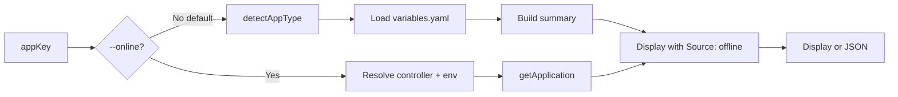

# Plan: `aifabrix show <appKey>` command

## Goal

- New command: `**aifabrix show <appKey>**` (top-level, not under `app`) that returns important application information to the caller.
- **Default (offline)**: Get data from the local **builder/** or **integration/** folder (variables.yaml). Load and display key app info. **Do not run schema validation** — that stays in `aifabrix validate`; show only loads and displays config.
- `**--online**`: Get information from the **controller application API** ([lib/api/applications.api.js](lib/api/applications.api.js) `getApplication(controllerUrl, appKey, authConfig)` — GET `/api/v1/applications/{appKey}`). Require auth. Display what the API returns. No environment key needed.
- **Source indication**: Output must clearly state whether the user is seeing the **offline** (local file) or **online** (controller) version (e.g. header "Source: offline (builder/myapp/variables.yaml)" or "Source: online (controller …)").
- Support **normal web/service apps** and **external** type; when `--online` and type is external, optionally surface extra info from dataplane.

---

## Scope

- **Default (no flag, offline)**: Load from builder or integration path via [lib/utils/paths.js](lib/utils/paths.js) `detectAppType(appKey)` and `variables.yaml`. Parse and display key info (key, displayName, description, type, deploymentKey, image/port/externalIntegration etc.). **No validation** — do not call validateVariables, validateExternalFilesForApp, or show validation errors; use `aifabrix validate` for that. If file is missing or invalid YAML, exit with clear error. Label output as "offline" / "Source: offline".
- `**--online**`: Call controller **application API** using [lib/api/applications.api.js](lib/api/applications.api.js) `getApplication(controllerUrl, appKey, authConfig)` (GET `/api/v1/applications/{appKey}`). Resolve controller URL from config; require auth. Display application details from the API response. For `type: external`, optionally resolve dataplane and call `getExternalSystemConfig`. Label output as "online" / "Source: online". No environment parameter needed for this endpoint.

---

## Do not duplicate `aifabrix validate`

- **Show** only loads and displays app config. It does **not** run schema validation or show validation errors. Use `**aifabrix validate <appKey>**` for that. Offline: load variables.yaml, build summary, display. No `validateVariables`, no `validateExternalFilesForApp`. If file missing or invalid YAML, exit with clear error.

---

## What the user will see (most important)

This section defines the **exact output** the user sees. Implementers must match this.

**Why this matters for developers**: When you have a problem or want to validate (e.g. "why can't user X access this?", "do permissions match roles?", "what config vars are required?"), you need more than basic key/type/port. You need **roles**, **permissions**, **authentication**, **portal input configurations and their values**, and **databases** (if any). So the output must include those sections, not only basic app metadata.

**What you get from the external system (most important for external type)**: For apps with **type: external** (or external integration), the developer must see what is **actually on the dataplane** — not only local variables.yaml. So when we can call the dataplane (see below), we **must** show a dedicated section **"External system (dataplane)"** with:

- **Source**: Dataplane URL used and system key (appKey).
- **System**: From `getExternalSystem` or `getExternalSystemConfig`: system key, displayName, description, type (openapi/mcp/custom), status (published/draft), version if present.
- **DataSources**: From `getExternalSystemConfig` → `dataSources`: list of dataSources with **key**, **displayName**, **systemKey** (and other non-secret fields). So the developer sees which dataSources are registered for this system on the dataplane.
- **Application (from dataplane)**: Summary or key fields from `getExternalSystemConfig` → `application` (the external system's application config as stored on dataplane): e.g. key, displayName, type, roles, permissions if present. So the developer can compare with local variables.yaml.
- **OpenAPI**: From `listOpenAPIFiles` and `listOpenAPIEndpoints` (optional but valuable): list of OpenAPI file names/ids, list of OpenAPI endpoints (path + method). So the developer knows what endpoints the external system exposes on the dataplane.

**When we fetch external system data**: For **--online** and app type **external**, after `getApplication` we resolve dataplane URL (from controller/config) and call `getExternalSystemConfig(dataplaneUrl, appKey, authConfig)`. Optionally call `listOpenAPIFiles` and `listOpenAPIEndpoints` for the same system. If dataplane is unavailable or returns 404/401, show a clear message (e.g. "External system data not available (dataplane unreachable or not found).") and still show the rest of the output. **Offline**: For type external we only have local externalIntegration (schemaBasePath, systems, dataSources file list). We do **not** call the dataplane when offline. Add a hint: "For external system data as on dataplane, run with --online."

---

### Offline (default) — human-readable

When the user runs `aifabrix show myapp` (no flags), they see:

- **First line**: `Source: offline (builder/myapp/variables.yaml)` or the actual path (integration/ when applicable).
- **Application** (basic): Key, Display name, Description, Type, Deployment (truncated), Image, Registry, Port; Health, Build; for **external** type: External integration (schemaBasePath, systems, dataSources file list). For external type also show a hint: **"For external system data as on dataplane, run with --online."**
- **Roles**: List of roles (name, value, description; groups if present). From `variables.yaml` → `roles` array. So the developer can see which roles exist and cross-check with permissions.
- **Permissions**: List of permissions (name, roles that have it, description). From `variables.yaml` → `permissions` array. So the developer can validate that each permission’s `roles` reference existing role values.
- **Authentication**: enableSSO, type, requiredRoles (if present). From `variables.yaml` → `authentication`. So the developer can verify auth and required roles.
- **Portal input configurations**: Only configuration entries that have a **portalInput** block. For each: show **label** (from portalInput.label or name) and **value**. If portalInput.masked is true, show value as "(masked)" or "***". From `variables.yaml` → `configuration` and `conditionalConfiguration[].configuration` (filter to items with portalInput). Do not show the full configuration list (name/required/location); only portal input configs and their values.
- **Databases**: If `requiresDatabase`, list database names. From `variables.yaml` → `databases`.
- If file missing or invalid YAML: clear error and exit 1. No validation (use `aifabrix validate` for that).

Example shape:

```
Source: offline (builder/myapp/variables.yaml)

Application
  Key:           myapp
  Display name:  My Application
  Description:   My app description
  Type:          webapp
  Deployment:    a1b2c3d4e5f6...
  Image:         myreg/myapp:latest
  Registry:      acr
  Port:          3000
  Health:        /health (interval 30s)
  Build:         typescript, localPort 3010

Roles
  admin          (value: admin)     Application administrators
  user           (value: user)     Standard users; groups: [aad-group-users]

Permissions
  documentstore:read    roles: [user, admin]    Read document store
  documentstore:write   roles: [admin]          Write document store

Authentication
  SSO: enabled   type: azure   requiredRoles: [aifabrix-user]

Portal input configurations (and their values)
  Database URL:      postgres://localhost/myapp
  API Key:           (masked)

Databases
  myapp, myapp-logs
```

For **external** type offline, also show External integration (schemaBasePath, systems, dataSources file list) and the hint: **For external system data as on dataplane, run with --online.**

### Online (`--online`) — human-readable

When the user runs `aifabrix show myapp --online`, they see:

- **First line**: `Source: online (https://controller.example.com)` — the controller URL used.
- **Application** (basic): Key, Display name, Description, Type, Status, URL, Port, Configuration summary — from `getApplication` response.
- **Roles**: If the controller application API returns `roles`, display them (name, value, description; groups if present). Otherwise omit or show “(not in API response)”.
- **Permissions**: If the API returns `permissions`, display them (name, roles, description). Otherwise omit or show “(not in API response)”.
- **Authentication**: If the API returns `authentication`, show enableSSO, type, requiredRoles. Otherwise omit.
- **Portal input configurations**: If the API returns `configuration` (list), show only entries that have **portalInput**. For each: label (from portalInput.label or name) and value. If portalInput.masked, show "(masked)". Do not show the full configuration list; only portal input configs and their values.
- **Databases**: If the API returns `databases` or `requiresDatabase` + database list, show them.
- For **external** type: **must** add section **"External system (dataplane)"** (see above). Call `getExternalSystemConfig(dataplaneUrl, appKey, authConfig)`; optionally `listOpenAPIFiles` and `listOpenAPIEndpoints`. Show: system key, displayName, type, status (published/draft); **dataSources** (list with key, displayName, systemKey); **application** (summary from config); **OpenAPI files** and **OpenAPI endpoints** (if we call listOpenAPIFiles / listOpenAPIEndpoints). If dataplane unreachable or 404/401, show clear message and still show the rest.
- On 404: e.g. `Application "myapp" not found on controller.` On auth failure: clear message and hint to run `aifabrix login`.

Example shape (non-external):

```
Source: online (https://controller.example.com)

Application
  Key:           myapp
  Display name:  My Application
  Type:          webapp
  Status:        active
  URL:           https://myapp.example.com
  Port:          3000
  Configuration: pipeline active, ...

Roles
  admin (value: admin)   ...
  user  (value: user)   groups: [aad-group-users]

Permissions
  documentstore:read    roles: [user, admin]   ...
  documentstore:write   roles: [admin]         ...

Authentication
  SSO: enabled   type: azure   requiredRoles: [aifabrix-user]

Portal input configurations (and their values)
  Database URL:   postgres://...
  API Key:        (masked)
```

Example shape (external type — **must** include External system (dataplane)):

```
Source: online (https://controller.example.com)

Application
  Key:           my-ext-system
  Display name:  My External System
  Type:          external
  Status:        active
  ...

External system (dataplane)
  Dataplane:     https://dataplane.example.com
  System key:     my-ext-system
  Display name:  My External System
  Type:          openapi
  Status:        published
  Version:       1.0.0

  DataSources (on dataplane)
    key: docs       displayName: Document store    systemKey: my-ext-system
    key: logs       displayName: Log store         systemKey: my-ext-system

  Application (from dataplane)
    key: my-ext-system   displayName: My External System   type: openapi
    roles: admin, user
    permissions: docstore:read, docstore:write

  OpenAPI files:   2 (spec.json, spec-v2.json)
  OpenAPI endpoints: 12 (e.g. GET /docs, POST /docs, GET /logs, ...)
```

If dataplane unreachable: show `External system (dataplane): not available (dataplane unreachable or not found).` and still show Application section.

### JSON output (`--json`)

With `--json`, the user gets a single JSON object to stdout. The `application` object must include the same logical content as the human-readable output:

- **Offline**: `{ "source": "offline", "path": "builder/myapp/variables.yaml", "appKey": "myapp", "application": { "key", "displayName", "description", "type", "deploymentKey", "image", "registryMode", "port", "healthCheck", "build", "roles", "permissions", "authentication", "portalInputConfigurations" (only entries with portalInput; name/label and value; masked as "(masked)"), "databases" } }`. For type external, no `externalSystem` (dataplane not called offline).
- **Online**: `{ "source": "online", "controllerUrl": "https://...", "appKey": "myapp", "application": { ... } }` — `application` is from `getApplication`; include `roles`, `permissions`, `authentication`, `portalInputConfigurations` (only entries with portalInput; label and value; masked as "(masked)" if API returns them). Required top-level: `source`, `appKey`, `application`; plus `path` (offline) or `controllerUrl` (online). **For type external**: include `**externalSystem**` (from dataplane): `{ "dataplaneUrl", "systemKey", "displayName", "type", "status", "version", "dataSources": [ { "key", "displayName", "systemKey" } ], "application": { ... } (summary from getExternalSystemConfig), "openapiFiles": [ ... ], "openapiEndpoints": [ ... ] }`. If dataplane unreachable, `externalSystem: null` or `externalSystem: { "error": "dataplane unreachable" }`.

---

## Data to display (reference)

**Offline (default — from builder/ or integration/):**

- **Source label**: "Source: offline" + path.
- **Application (basic)**: key, displayName, description, type, deploymentKey (truncated), image/registryMode/port, healthCheck, build; for external: externalIntegration.
- **Roles**: From variables.yaml `roles` (name, value, description, groups). So developer can validate and cross-check with permissions.
- **Permissions**: From variables.yaml `permissions` (name, roles, description). So developer can validate that permission.roles reference existing roles.
- **Authentication**: From variables.yaml `authentication` (enableSSO, type, requiredRoles).
- **Portal input configurations**: From variables.yaml `configuration` (and conditionalConfiguration): only entries that have **portalInput**. Show **label** (portalInput.label or name) and **value**; if portalInput.masked show "(masked)". Do not show the full configuration list.
- **Databases**: From variables.yaml `databases` when requiresDatabase. List database names.
- Exit code: 0 on success; 1 if variables.yaml not found or invalid YAML.

**Online (`--online` — from controller application API):**

- **Source label**: "Source: online" + controller URL.
- Use **getApplication**. Display API response: application basic fields plus **roles**, **permissions**, **authentication**, **portal input configurations and their values** (only entries with portalInput) if the controller returns them. Handle 404/401 gracefully.
- **For type external (most important)**: **Must** call dataplane **getExternalSystemConfig(dataplaneUrl, appKey, authConfig)** and show section **"External system (dataplane)"**: dataplane URL, system key, displayName, type, status (published/draft), version; **dataSources** (list with key, displayName, systemKey); **application** (summary from config); optionally **listOpenAPIFiles** and **listOpenAPIEndpoints** — show OpenAPI files and endpoints. If dataplane unreachable or 404/401, show clear message and still show Application section. JSON: include **externalSystem** object when fetched (dataplaneUrl, systemKey, displayName, type, status, dataSources, application, openapiFiles, openapiEndpoints).
- Exit code: 0 on success; 1 on auth failure, 404, or API error.

**Both**: Optional `--json` with `source`, `appKey`, `application` (including roles, permissions, authentication, portalInputConfigurations, databases); plus `path` (offline) or `controllerUrl` (online).

**OpenAPI specs**: Not required for implementation. We use the existing [lib/api/applications.api.js](lib/api/applications.api.js) `getApplication` and display whatever the controller returns (e.g. `response.data`). If you have OpenAPI specs for the controller application API, they can be used to align which response fields to show (e.g. key, displayName, type, configuration); otherwise we display the API response generically.

---

## (Removed) Schema reference — show does not validate

- **Schema**: [lib/schema/application-schema.json](lib/schema/application-schema.json) already defines:
  - Types: `webapp`, `functionapp`, `api`, `service`, `external`.
  - Required: `key`, `displayName`, `description`, `type`, `deploymentKey`; for non-external also `image`, `registryMode`, `port`; for `external` also `externalIntegration`; conditional `databases` when `requiresDatabase: true`.
  - Refs to external-system and external-datasource schemas for inline `system` / `dataSources` and file-based `externalIntegration`.
- **Reuse existing validation** (no new schema):
  - [lib/validation/validator.js](lib/validation/validator.js): `loadVariablesYaml`, `setupAjvValidator`, `validateVariables`, `validateExternalIntegrationBlock`, `validateFrontDoorRouting`.
  - [lib/validation/validate.js](lib/validation/validate.js): `validateExternalFilesForApp`, `aggregateValidationResults`, `resolveExternalFiles`.
  - [lib/utils/error-formatter.js](lib/utils/error-formatter.js): `formatValidationErrors` for human-readable messages (pattern descriptions, required/min/max/enum, field paths).
- **What matters for developers when they “validate and find an error”**:
  - **Clear field location**: Show which field failed (e.g. `configuration[0].name`, `externalIntegration.schemaBasePath`) using existing `instancePath` → readable path.
  - **Actionable messages**: Use existing formatters (e.g. “Must be one of: webapp, functionapp, api, service, external”, “Must be at least 3 characters”).
  - **File context**: Always mention that validation is for `variables.yaml` (and, for external, list which external-system / external-datasource files were validated).
  - **Exit code**: `0` if valid, `1` if invalid (so CI/scripts can rely on it).
  - Optional `**--json**` output for scripting: structured object with `{ appKey, info, validation: { valid, errors, warnings }, externalFiles?: [...] }`.

---

## (Duplicate section removed.) Display what the API returns: e.g. **key**, **displayName**, **description**, **type**, **status**, **url** / **port**, **configuration** (e.g. pipeline active), **clientId** if present. Include controller URL and environment in the header.

- For **external** type: optionally resolve dataplane URL, then `getExternalSystemConfig(dataplaneUrl, appKey, authConfig)` and show extra info (published status, dataSources count, OpenAPI endpoints). Handle 404/401 gracefully.
- Exit code: 0 on success; 1 on auth failure, 404 (app not in environment), or API error.

`**--offline` (from builder/ or integration/):**

- **Identity**: `key`, `displayName`, `description`, `type` (from variables.yaml).
- **Deployment**: `deploymentKey` (e.g. truncated: first 12 chars + `...`).
- **Type-specific**: For non-external: `image`, `registryMode`, `port`; optionally `healthCheck.path`, `frontDoorRouting.pattern`, `build.language`. For external: `externalIntegration.schemaBasePath`, `systems` / `dataSources` file lists, `autopublish` / `version` if present.
- **Validation result**: Valid / invalid; list of **errors** (developer-friendly); **warnings**. External files (when `type === 'external'`): per-file validation status.
- Exit code: 0 if valid; 1 if invalid or variables.yaml not found.

 (e.g. “Not registered or no dataplane access”).

---

## Implementation outline

1. **CLI**
  - **Top-level command**: In [lib/cli.js](lib/cli.js), add `program.command('show <appKey>')` (not under `app`). Options: `--online` (get from controller), optional `--json`. Action: call show handler; pass `online: options.online`. Exit code 1 on failure (missing file / invalid YAML in default; API/404/auth when `--online`).
2. **Show handler (new module)**
  - **Location**: New file under `lib/app/` (e.g. `lib/app/show.js`).
  - **Flow**:
    - **Default (no --online, offline)**: Resolve app path via `detectAppType(appKey)`; if no `variables.yaml`, exit with clear error. **Load only** (no validation). Build summary from parsed variables; display with **Source: offline** and path. Exit 0 on success; 1 if file missing or invalid YAML.
    - **With --online**: Resolve controller URL from config (same as [lib/app/list.js](lib/app/list.js)); get auth token; call `**getApplication(controllerUrl, appKey, authConfig)**` from applications.api.js. Display API response with **Source: online** and controller URL. For `type: external`, optionally resolve dataplane and call `getExternalSystemConfig`. Exit 1 on auth failure, 404, or API error.
    - (Removed validation steps — do not duplicate aifabrix validate.) Resolve app path via `detectAppType(appKey)`; if no `variables.yaml`, exit with clear error (e.g. “variables.yaml not found for app: &lt;appKey&gt;”).
    - Then: load variables; run validation (validator + external files if external); build info and display. Exit 0 if valid, 1 if invalid or not found. (Details: loadVariablesYaml, validateVariables, validateExternalFilesForApp, aggregateValidationResults; display key info + validation errors/warnings.)
    - `loadVariablesYaml` + schema expects transformed shape; for display, use raw variables for readability or a small “summary” object built from transformed + raw).
    - Run application validation: `validateVariables(appKey)` and, if type is external, `validateExternalFilesForApp(appKey)` then `aggregateValidationResults` (or equivalent) so one place has `valid`, `errors`, `warnings`, and per-file external results.
    - Build “info” object for display (key, displayName, description, type, deploymentKey, type-specific fields, external file list when external).
    - If `--json`: print JSON and exit (exit code still 0/1 by validation).
    - Else: human-readable output (chalk): section “Application”, then “Validation” (errors in red, warnings in yellow), then “External integration” if external; same info as above.
  - **Auth/config**: Required only when `--online`. Reuse pattern from [lib/app/list.js](lib/app/list.js). **Output**: Support `--json` for both modes; else human-readable (chalk).
3. **Documentation**
  - Add `aifabrix show <appKey>` to [docs/commands/application-management.md](docs/commands/application-management.md) and [docs/cli-reference.md](docs/cli-reference.md) (legacy anchor + quick link in Commands Index).
  - Short description: “By default shows app info from local builder/ or integration/ folder (offline). Use --online to fetch from the controller. Output indicates offline vs online source.”
4. **Tests**
  - Unit tests: default (offline) — load from fixture variables.yaml, display, no validation; --online (mock getApplication; success, 404, auth failure); `--json` with source field; exit code 0/1. Optional: integration test with controller and fixture.

---

## Flow (high level)




---

## Files to touch


| Area    | File                                                                               | Change                                                                                                                                                     |
| ------- | ---------------------------------------------------------------------------------- | ---------------------------------------------------------------------------------------------------------------------------------------------------------- |
| CLI     | [lib/cli.js](lib/cli.js)                                                           | Register top-level `show <appKey>` with `--online` and `--json`; call show handler.                                                                        |
| Handler | **lib/app/show.js** (new)                                                          | Default (offline): load from builder/integration, display with Source: offline; --online: get from controller, display with Source: online. No validation. |
| Docs    | [docs/commands/application-management.md](docs/commands/application-management.md) | Document `aifabrix show`.                                                                                                                                  |
| Docs    | [docs/cli-reference.md](docs/cli-reference.md)                                     | Add legacy anchor for `aifabrix show`.                                                                                                                     |
| Tests   | **tests/lib/app/show.test.js** (new)                                               | Unit tests: offline (load only, no validation); --online (mock getApplication); --json with source; exit code.                                             |


---

## Out of scope (this plan)

- Changing [lib/schema/application-schema.json](lib/schema/application-schema.json) (already supports web + external and refs).
- Running schema validation in `show` — use `aifabrix validate` for that. Show only loads and displays; no validation.

---

## Implementation Validation Report

**Date:** 2026-01-30  
**Plan:** .cursor/plans/43-app_show_appkey_command.plan.md  
**Status:** ✅ COMPLETE

### Executive Summary

The `aifabrix show <appKey>` command has been implemented per the plan. All required files exist, documentation is in place, and unit tests for the show command and display module pass (84 tests). **Format, lint, and full test suite all pass** (180 test suites, 4085 tests).

### Task Completion

- The plan uses an implementation outline and a "Files to touch" table rather than checkbox tasks.
- **Implementation outline:** All items addressed:
  1. **CLI** — Top-level `show <appKey>` with `--online` and `--json` registered in lib/cli.js; handler invoked; exit code 1 on failure.
  2. **Show handler** — lib/app/show.js (new) and lib/app/show-display.js (new) implement offline (variables.yaml / generated manifest), online (getApplication + optional dataplane for external), Source labelling, no validation.
  3. **Documentation** — application-management.md and cli-reference.md document `aifabrix show`.
  4. **Tests** — tests/lib/app/show.test.js and tests/lib/app/show-display.test.js with offline, online, --json, and helper coverage.

### File Existence Validation


| File                                    | Status                                                               |
| --------------------------------------- | -------------------------------------------------------------------- |
| lib/cli.js                              | ✅ show command registered (show &lt;appKey&gt;, --online, --json)    |
| lib/app/show.js                         | ✅ Exists; showApp, offline/online flow, helpers                      |
| lib/app/show-display.js                 | ✅ Exists; unified display(summary)                                   |
| docs/commands/application-management.md | ✅ Section "aifabrix show &lt;appKey&gt;" with usage, options, output |
| docs/cli-reference.md                   | ✅ Anchor #aifabrix-show-appkey and link to application-management    |
| tests/lib/app/show.test.js              | ✅ Exists; 47 tests (offline, online, helpers)                        |
| tests/lib/app/show-display.test.js      | ✅ Exists; 25 tests (display branches)                                |


### Test Coverage

- **Unit tests:** ✅ tests/lib/app/show.test.js and tests/lib/app/show-display.test.js exist and pass (84 tests total).
- **Coverage (show + show-display):** Statements ~96%, Branches ~81%, Functions ~96%, Lines ~98% (above 80% target).
- **Scope:** Offline (variables.yaml, generated manifest fallback), online (getApplication, nested configuration, external + dataplane), --json, auth/404/API errors, display sections (Application, Roles, Permissions, Authentication, Configurations, Databases, External system).

### Code Quality Validation


| Step                   | Result                                                                                      |
| ---------------------- | ------------------------------------------------------------------------------------------- |
| **Format (lint:fix)**  | ✅ PASSED (exit code 0)                                                                      |
| **Lint**               | ✅ PASSED (exit code 0; 0 errors)                                                            |
| **Tests (plan 43)**    | ✅ 84 tests in show.test.js + show-display.test.js — all passed                              |
| **Tests (full suite)** | ✅ PASSED — 180 test suites, 4085 tests                                                       |


### Cursor Rules Compliance

- **Code reuse:** ✅ Uses detectAppType, getApplication, getExternalSystemConfig, listOpenAPIFiles/Endpoints, generator, config, token-manager, controller-url, dataplane-resolver.
- **Error handling:** ✅ try/catch, clear errors (variables not found, invalid YAML, 404, auth required, API error).
- **Logging:** ✅ logger.log / logger.error; no console.log for app flow.
- **Type safety:** ✅ JSDoc on public and exported helpers.
- **Async patterns:** ✅ async/await, fs.readFileSync only where used for sync load in show.
- **File operations:** ✅ path.join for paths.
- **Input validation:** ✅ appKey required; validated in showApp.
- **Module patterns:** ✅ CommonJS; showApp and helpers exported as needed.
- **Security:** ✅ No hardcoded secrets; masked values shown as "(masked)".

### Implementation Completeness

- **CLI:** ✅ show &lt;appKey&gt; with --online, --json; action calls showApp; exit 1 on throw.
- **Offline:** ✅ detectAppType → buildDeploymentManifestInMemory or load variables.yaml → buildOfflineSummary / buildOfflineSummaryFromDeployJson → display or JSON.
- **Online:** ✅ resolveControllerUrl, getShowAuthToken, getApplication; 404/auth/API errors; for type external: resolveDataplaneUrl, getExternalSystemConfig, listOpenAPIFiles/Endpoints; buildOnlineSummary → display or JSON.
- **Display:** ✅ Source label, Application (key, displayName, type, deployment, image, port, health, build, status, URL), Roles, Permissions, Authentication, Portal input configurations, Databases, External integration (offline), External system (dataplane) for online external.
- **Docs:** ✅ application-management.md and cli-reference.md.
- **Tests:** ✅ Unit tests for show and show-display; coverage &gt; 80%.

### Issues and Recommendations

- **Lint warnings:** show.js and show-display.js may have complexity/max-statements warnings; acceptable per project practice. Optional: split display() or summary builders into smaller functions in a follow-up.

### Final Validation Checklist

- [x] Implementation outline and "Files to touch" completed
- [x] All listed files exist and contain expected behavior
- [x] Unit tests exist for show and show-display and pass (84 tests)
- [x] Code quality: format passed, lint passed (0 errors), tests passed
- [x] Cursor rules compliance verified for show implementation
- [x] Full `npm test` passes (180 suites, 4085 tests)
- [x] Implementation complete

