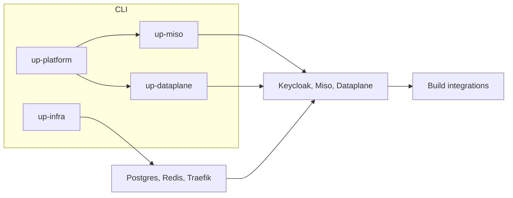

# Platform Up, Docs Restructure, and CLI Alignment

## Rules and Standards

This plan must comply with the following rules from [Project Rules](.cursor/rules/project-rules.mdc):

- **[Quality Gates](.cursor/rules/project-rules.mdc#quality-gates)** - Mandatory checks before commit: build, lint, test, coverage ≥80%, no hardcoded secrets.
- **[Code Quality Standards](.cursor/rules/project-rules.mdc#code-quality-standards)** - Files ≤500 lines, functions ≤50 lines, JSDoc for all public functions.
- **[CLI Command Development](.cursor/rules/project-rules.mdc#cli-command-development)** - Commander.js pattern, input validation, error handling with chalk, tests for commands.
- **[Template Development](.cursor/rules/project-rules.mdc#template-development)** - Handlebars in `templates/`, `.hbs` extension, validate context, document required variables.
- **[Security & Compliance (ISO 27001)](.cursor/rules/project-rules.mdc#security--compliance-iso-27001)** - No hardcoded secrets, secret management via kv:// or secrets files, never log secrets.
- **[Validation Patterns](.cursor/rules/project-rules.mdc#validation-patterns)** - Schema validation (AJV), YAML validation, developer-friendly error messages.
- **[Error Handling & Logging](.cursor/rules/project-rules.mdc#error-handling--logging)** - Try-catch for async, structured error messages, chalk for output, never log secrets.
- **[Docker & Infrastructure](.cursor/rules/project-rules.mdc#docker--infrastructure)** - Infrastructure templates, env vars for config, validate before use.

**Key requirements:**

- New/updated CLI commands: add in `lib/cli.js`, implement in `lib/commands/`, validate inputs, use try-catch and chalk, write tests.
- New template `deploy.js.hbs`: Handlebars context with systemKey, appKey; follow template patterns.
- Encryption key generation: generate secure random value, write to secrets file, never log the key; follow Secret Management rules.
- Docs: use canonical Mermaid templates from [flows-and-visuals.md](.cursor/rules/flows-and-visuals.md) where applicable.
- All new code: JSDoc for public functions, path.join() for paths, no hardcoded secrets.

## Before Development

- Read [CLI Command Development](.cursor/rules/project-rules.mdc#cli-command-development) and [Template Development](.cursor/rules/project-rules.mdc#template-development) from project-rules.mdc.
- Review existing `lib/cli.js` setupInfraCommands and `lib/commands/up-miso.js`, `up-dataplane.js` for patterns.
- Review [lib/core/config.js](lib/core/config.js) getSecretsEncryptionKey/setSecretsEncryptionKey and [lib/utils/local-secrets.js](lib/utils/local-secrets.js) for secrets write pattern.
- Confirm flows-and-visuals.md for Mermaid diagram styling in docs.
- Ensure tests exist or are added for any new CLI behavior (e.g. up-platform, encryption key generation).

## Definition of Done

Before marking this plan as complete, ensure:

1. **Build:** Run `npm run build` FIRST (must complete successfully; runs lint + test:ci).
2. **Lint:** Run `npm run lint` (must pass with zero errors/warnings).
3. **Test:** Run `npm test` or `npm run test:ci` AFTER lint (all tests must pass; ≥80% coverage for new code).
4. **Validation order:** BUILD → LINT → TEST (mandatory sequence; never skip steps).
5. **File size limits:** Files ≤500 lines, functions ≤50 lines.
6. **JSDoc:** All new public functions have JSDoc comments.
7. **Code quality:** All rule requirements from Rules and Standards section are met.
8. **Security:** No hardcoded secrets; encryption key generated and stored per Secret Management; ISO 27001 compliance.
9. All 11 implementation-order steps completed (CLI rename + up-platform, docs, configuration split, deploying, external-systems, infrastructure, running, wizard, commands docs, templates, start-system settings).
10. Docs and templates updated to use `up-infra` / `down-infra` / `up-platform`; no references to old `up` / `down` command names in user-facing content.

## 1. CLI: Infra and platform commands

**Goal:** Focus flow = infra up → platform up → build integrations (apps secondary). Use community edition images.

**Changes:**

- **Rename commands** in [lib/cli.js](lib/cli.js):
  - `up` → `up-infra` (description: start local infrastructure: Postgres, Redis, optional Traefik)
  - `down [app]` → `down-infra [app]` (same behavior: stop infra or specific app)
- **Add** `up-platform` command that:
  - Runs `handleUpMiso(options)` then `handleUpDataplane(options)` (or a shared handler that does both in sequence)
  - Description: start platform (Keycloak, Miso Controller, Dataplane) from community images; infra must be up
- **References to update:** All docs and command docs that mention `aifabrix up` / `aifabrix down` (quick-start, infrastructure.md, running.md, commands/infrastructure.md, commands/README.md, deploying.md, wizard.md, etc.). **No backward compatibility:** do not add `up`/`down` as aliases; rename only.

**Key files:** [lib/cli.js](lib/cli.js) (setupInfraCommands), [lib/commands/up-miso.js](lib/commands/up-miso.js), [lib/commands/up-dataplane.js](lib/commands/up-dataplane.js).

---

## 2. Docs root: add README.md (Quick Start for platform + integrations)

**Goal:** [docs/](docs/) gets a single entrypoint README that is the Quick Start for “get AI Fabrix platform up and build integrations.”

**Content outline:**

- **Section 1 – Install and validate**
  - Install CLI (`npm install -g @aifabrix/builder`), alias `aifx`.
  - Minimal steps: `aifabrix up-infra` → `aifabrix up-platform` (or `up-miso` then `up-dataplane` if you keep them separate in the guide).
  - **Example: parameters you need to add.** User needs either OpenAI or Azure AI LLM. Document with concrete commands:
    - **OpenAI:** `aifabrix secrets set secrets-openaiApiKeyVault <your-openai-secret-key>`
    - **Azure OpenAI:** `aifabrix secrets set azure-openaiapi-urlKeyVault <url...>` and `aifabrix secrets set secrets-azureOpenaiApiKeyVault <your-azure-openai-secret-key>`
  - Secrets go into `~/.aifabrix/secrets.local.yaml` or the file from `aifabrix-secrets` in config (e.g. `/workspace/aifabrix-miso/builder/secrets.local.yaml`). Goal: “couple parameters and then go.”
- **Section 2 – Build your own integration from OpenAPI**
  - Use HubSpot as the example: create external system, wizard or manual, deploy and test. Link to [docs/external-systems.md](docs/external-systems.md) and [docs/wizard.md](docs/wizard.md).

**Note:** You mentioned “secret.config.yaml” – the codebase uses `secrets.local.yaml`. The plan assumes documenting the existing `secrets`/`secrets set` flow; if you want a dedicated `secret.config.yaml` and CLI to populate it, that can be a small follow-up (new file + CLI commands that write it).

---

## 3. docs/quick-start.md → quick start to “own application”

**Goal:** This file becomes the quick start for **building/running your own application** (app-centric), not the full platform.

**Changes:**

- Reframe steps around: create app → configure → run locally / deploy. Keep it short.
- Replace any “platform up” steps with pointers to [docs/README.md](docs/README.md) (platform + integrations quick start).
- Ensure “Start Infrastructure” uses `aifabrix up-infra` (and optional Traefik). Remove or update references to `aifabrix up` / `aifabrix down`.

---

## 4. docs/cli-reference.md – single structure, optional anchor links

**Goal:** One structure only; anchor links only if needed.

**Changes:**

- Remove the “New Structure” framing – the `commands/` layout is the only structure. Describe it as the CLI reference (by concept in `commands/`).
- Replace “Legacy Anchor Links” with a short “Anchor links” (or “Quick links”) section: “If you need direct links to commands, use the anchors in [Commands Index](commands/README.md) and the command pages (e.g. [Infrastructure Commands](commands/infrastructure.md)).” Optionally list the main anchors (e.g. `#aifabrix-up-infra`, `#aifabrix-down-infra`, `#aifabrix-up-platform`) without the “legacy” wording.
- Update any `aifabrix up` / `aifabrix down` to `up-infra` / `down-infra` in this file.

---

## 5. docs/configuration.md – revalidate variables.yaml, single version, simplify, split

**Goal:** Configuration doc matches code; one current version; no backward-compatibility sections; shorter, then split into a folder.

**Changes:**

- **Revalidate variables.yaml:** Cross-check every documented field (app.key, app.displayName, app.type, port, image.*, build.*, externalIntegration, etc.) against [lib/schema/application-schema.json](lib/schema/application-schema.json), [lib/utils/variable-transformer.js](lib/utils/variable-transformer.js), and [lib/validation/validator.js](lib/validation/validator.js). Fix mismatches (e.g. schema uses `deploymentKey` in output; variables use `app.key`; document the mapping).
- **Remove all “Backward Compatibility” subsections** (e.g. around configuration section and secure/secrets). Keep only current behavior.
- **Shorten:** Remove redundancy, keep one clear example per concept. Preserve: variables.yaml structure, env.template, rbac, external integration block, secrets/configuration, env-config interpolation. Use “See also” links for details in the new configuration folder.
- **New layout:** Create `docs/configuration/` with:
  - `README.md` – overview and index to the following files.
  - Split by topic, e.g.: `variables-yaml.md`, `env-template.md`, `external-integration.md`, `secrets-and-config.md`, `env-config.md`, etc. Move content from the long configuration.md into these; keep README as the entrypoint. Delete or redirect the old monolithic `docs/configuration.md` to `docs/configuration/README.md`.

---

## 6. docs/deploying.md – external system flow, environment doc split

**Goal:** Document external system flow (local → controller → dataplane); move “Step 2: Deploy Environment (First Time)” to its own doc; clarify open source vs enterprise environments.

**Changes:**

- **Add “External system flow”:** Describe flow: Local (dev) → Controller → Dataplane. Where external systems are configured (controller vs dataplane), and how deploy/datasource deploy fits in.
- **Move “Step 2: Deploy Environment (First Time)”** to a new doc, e.g. `docs/deploy-environment-first-time.md` (or `docs/deployment/environment-first-time.md`). In deploying.md, replace that section with a short summary and link.
- **Environments:** State clearly: open source = one environment (e.g. dev); standard/enterprise = dev, tst, pro. Remove or simplify enterprise-only options in the main flow so open source path is obvious.
- Replace `aifabrix up`/`down` with `up-infra`/`down-infra` where applicable.

---

## 7. docs/external-systems.md – fixes and cleanup

**Goal:** Correct login, diagram, entityType, JSON docs, REDIRECT_URI, “Deploy to Controller,” remove Known Issues.

**Changes:**

- **Login:** Use device flow explicitly where relevant; fix any `login -device` typo to `login --method device` (e.g. `aifabrix login --controller <url> --method device --environment dev`).
- **Mermaid:** Fix syntax/flow so the diagram renders and matches the described flow (external API → external system → datasources → dataplane → AI models).
- **entityType:** Document as enum; list allowed values from [lib/schema/external-datasource.schema.json](lib/schema/external-datasource.schema.json): `document-storage`, `documentStorage`, `vector-store`, `vectorStore`, `record-storage`, `recordStorage`, `message-service`, `messageService`, `none`. State that values are validated against this enum.
- **Record references (Plan 211):** Remove or rephrase so it’s user/developer documentation, not internal plan references.
- **Full JSON feature docs:** Add a section that documents all supported fields and behaviors for external system and datasource JSON (from external-system.schema.json and external-datasource.schema.json), including authentication, field mappings, entityType, resourceType, etc.
- **REDIRECT_URI:** Add a short note: “REDIRECT_URI is auto-generated; you do not need to set it.”
- **“4. Deploy to Controller”:** Clarify: “Deploy to Controller” means the CLI sends the deployment to the Miso Controller, which then deploys to the dataplane (or target environment). We do not deploy “directly” to the dataplane from the CLI for app-level deploy; the controller orchestrates it.
- **Known Issues:** Delete the entire “Known Issues” section and any “See Known Issues” cross-references. If any workaround is still relevant, fold it into a “Troubleshooting” or “Notes” subsection without the “known issue” label.

---

## 8. docs/infrastructure.md – Azure recommendation, Traefik

**Goal:** Recommend running AI Fabrix on Azure; same CLI locally and in Azure; Traefik in this doc.

**Changes:**

- **Intro:** Add a short recommendation: we recommend running the AI Fabrix platform in Microsoft Azure; the aifabrix CLI works the same locally and in Azure (no manual config difference for the user).
- **Traefik:** Add a “Traefik configuration and validation” section: how to enable Traefik (`aifabrix up-infra --traefik`), basic config (ports, certificate env vars), and how the builder validates or uses Traefik (e.g. labels for frontDoorRouting). Move or copy the Traefik content from [docs/running.md](docs/running.md) here so Traefik lives under “infrastructure,” not “running your app.”
- Replace `aifabrix up`/`down` with `up-infra`/`down-infra`.

---

## 9. docs/running.md – remove Traefik

**Goal:** Traefik is documented only in infrastructure.

**Changes:**

- Remove the “Traefik Routing (Optional)” section (and any Traefik-specific setup). Replace with a single sentence: “For Traefik reverse proxy setup, see [Infrastructure Guide](infrastructure.md#traefik).”
- Ensure “Start infrastructure” references use `aifabrix up-infra` (and optional `--traefik`).

---

## 10. docs/wizard.md – deploy script rename to deploy.js, flow, controller

**Goal:** Wizard generates a Node script `deploy.js`; user runs `node deploy.js`; script: check auth → login if needed → deploy → run integration tests.

**Changes:**

- **Deploy script:** Change documented deploy script from `deploy.sh` / `deploy.ps1` to **deploy.js** (Node). Describe that the wizard generates `deploy.js`; user runs `node deploy.js`. The script is intended to be extended (e.g. add steps, different test commands).
- **Behavior of deploy.js:**  
  1. Check if user is logged in (e.g. `aifabrix auth status` or equivalent).
  2. If not logged in, prompt or run login (e.g. `aifabrix login`).
  3. Run deployment (e.g. `aifabrix deploy <appKey>` or datasource deploy as appropriate).
  4. Run integration tests (e.g. `aifabrix test-integration <appKey>`).
- **Controller/URLs:** Document that the script must get controller (and dataplane if needed) correctly – from config (e.g. `aifabrix auth config`) or env. Ensure wizard template or doc shows how deploy.js reads controller URL (config vs env).
- **Implementation:** Add a new Handlebars template, e.g. [templates/external-system/deploy.js.hbs](templates/external-system/deploy.js.hbs), that generates `deploy.js` implementing the above flow (using child_process or recommending `aifabrix` CLI). Wire the wizard (or external-system generator) to emit `deploy.js` instead of or in addition to deploy.sh/deploy.ps1. Update [docs/wizard.md](docs/wizard.md) “File Structure” and “Deployment” to list `deploy.js` and the “Using deploy.js” flow.
- Replace any `aifabrix up`/`down` with `up-infra`/`down-infra` in wizard.md.

---

## 11. docs/commands/infrastructure.md – command renames and up-platform

**Goal:** Command docs match new names and new command.

**Changes:**

- Rename sections: “aifabrix up” → “aifabrix up-infra”, “aifabrix down” → “aifabrix down-infra”. Update anchors (e.g. `#aifabrix-up-infra`, `#aifabrix-down-infra`).
- Add section “aifabrix up-platform” that describes: runs up-miso then up-dataplane (or equivalent); infra must be up; use for community images.
- Update all examples and “Issues” tips to use `up-infra` / `down-infra` / `up-platform`.
- In [docs/commands/README.md](docs/commands/README.md), update the table of contents: “aifabrix up” → “aifabrix up-infra”, “aifabrix down” → “aifabrix down-infra”, and add “aifabrix up-platform”.

---

## 12. templates – validate and update

**Goal:** All templates consistent with renames and new behavior.

**Changes:**

- **Application templates** ([templates/applications/](templates/applications/)): Check variables.yaml, env.template, README for correct app types and ports; ensure no references to old command names. **Community images:** user will add image names/registries for community edition soon; no change in plan for now.
- **External-system templates** ([templates/external-system/](templates/external-system/)): Add `deploy.js.hbs` (see wizard section above). Update README or comments in deploy.sh/deploy.ps1 to point to “run `node deploy.js` for full flow” if you keep shell scripts as optional. Ensure Handlebars context for deploy.js includes systemKey, appKey, and any needed controller/env flags.
- **Infra/github/python/typescript:** Replace any `aifabrix up`/`down` in comments or docs with `up-infra`/`down-infra`. No functional change unless you have workflow steps that call `up`/`down` (then update those to `up-infra`/`down-infra`).

---

## 13. Start system: encryption and AI keys (config + template)

**Goal:** On empty install, generate encryption key if missing; document/template OpenAI vs Azure so user sets one path and the rest come from template.

**Changes:**

- **Encryption (empty installation):** The key `secrets-encryptionKeyVault` is used for the encryption key. **We do not read this from keyvault.** Check: if we do **not** have this key in the current user’s secrets file (`~/.aifabrix/secrets.local.yaml`) **or** in the project secrets file (from `aifabrix-secrets` in config, e.g. `/workspace/aifabrix-miso/builder/secrets.local.yaml`), then **generate a new value** (e.g. random 32-byte key), write it to that secrets file under `secrets-encryptionKeyVault`, and set `secrets-encryption` in `config.yaml` to that value (or to a kv reference that points to the same file so the key is used for token encryption). Empty installation = generate; never read encryption key from keyvault on first run.
  - **Where to run this:** At “start system” (e.g. beginning of `runUpCommand` for `up-infra`, and/or `up-platform` or a shared ensure-config step). If the encryption key is missing from both user and project secrets, generate, save to secrets, and update config.
- **OpenAI / Azure (user sets one path; rest from template):**
  - **User responsibility:** User chooses either OpenAI or Azure OpenAI; they set the corresponding secrets via CLI. All other variables are provided by the template.
  - **Example parameters to add (document in Quick Start / README):**
    - **OpenAI:** `aifabrix secrets set secrets-openaiApiKeyVault <your-openai-secret-key>`
    - **Azure OpenAI:** `aifabrix secrets set azure-openaiapi-urlKeyVault <url...>` and `aifabrix secrets set secrets-azureOpenaiApiKeyVault <your-azure-openai-secret-key>`
  - **Template/default values** in env.template (e.g. dataplane/miso-controller): `OPENAI_API_KEY=kv://secrets-openaiApiKeyVault`, `AZURE_OPENAI_ENDPOINT=kv://azure-openaiapi-urlKeyVault`, `AZURE_OPENAI_API_KEY=kv://secrets-azureOpenaiApiKeyVault`. Docs: “Set either OpenAI or Azure; the rest come from the template.”

**Key files:** [lib/core/config.js](lib/core/config.js) (get/setSecretsEncryptionKey, getConfig, saveConfig), [lib/cli.js](lib/cli.js) (runUpCommand or up-platform handler), [lib/core/secrets.js](lib/core/secrets.js) (read/write secrets.local.yaml), [lib/utils/local-secrets.js](lib/utils/local-secrets.js) or equivalent (write generated key to secrets file), [templates/applications/](templates/applications/) (env.template), docs Quick Start.

---

## Implementation order (suggested)

1. CLI: rename `up`/`down` to `up-infra`/`down-infra` and add `up-platform`; update all internal references.
2. Docs: add [docs/README.md](docs/README.md) (Quick Start platform + integrations); update [docs/quick-start.md](docs/quick-start.md) (own application); update [docs/cli-reference.md](docs/cli-reference.md).
3. Configuration: revalidate variables.yaml vs schema, remove backward-compatibility sections, simplify; create [docs/configuration/](docs/configuration/) and split; redirect old configuration.md.
4. Deploying: add external system flow, move “Step 2: Deploy Environment” to its own doc, clarify environments; fix command names.
5. External-systems: login, mermaid, entityType enum, full JSON docs, REDIRECT_URI, “Deploy to Controller” clarification, remove Known Issues.
6. Infrastructure: add Azure recommendation and Traefik section; fix command names.
7. Running: remove Traefik, link to infrastructure; fix command names.
8. Wizard: add deploy.js template and flow (auth check → login → deploy → test); update wizard.md; fix command names.
9. Commands: update [docs/commands/infrastructure.md](docs/commands/infrastructure.md) and [docs/commands/README.md](docs/commands/README.md).
10. Templates: add deploy.js.hbs, validate all templates, replace up/down in text.
11. Start system settings: if `secrets-encryptionKeyVault` is missing from user and project secrets.local.yaml, generate a new encryption key and save it (empty install; do not read from keyvault). Document OpenAI/Azure example: `aifabrix secrets set secrets-openaiApiKeyVault ...` and Azure vars; add template vars to env.template.

---

## Diagram (high-level flow)

---

## Open points

- **secret.config.yaml:** Plan uses existing `secrets.local.yaml` + `aifabrix secrets set`; no dedicated `secret.config.yaml` unless you add it later.
- **Community images:** User will add image names/registries for community edition soon; no change in plan.

---

## Plan Validation Report

**Date:** 2025-02-02  
**Plan:** .cursor/plans/45-platform_up_docs_cli_restructure.plan.md  
**Status:** VALIDATED

### Plan Purpose

Rename infra commands (`up`/`down` to `up-infra`/`down-infra`), add `up-platform` (runs up-miso then up-dataplane), restructure docs (docs/README.md Quick Start, configuration folder, deployment/environment split), fix external-systems and wizard docs, move Traefik to infrastructure, add Node deploy.js wizard script, and validate templates. Start-system behavior: generate encryption key on empty install; document OpenAI/Azure secrets via `aifabrix secrets set`. Focus: infra up, then platform up, then build integrations; apps secondary.

**Affected areas:** CLI (lib/cli.js, lib/commands/), docs (docs/*.md, docs/commands/, docs/configuration/), templates (templates/applications/, templates/external-system/), config/secrets (lib/core/config.js, lib/core/secrets.js, lib/utils/local-secrets.js).

**Plan type:** Development (CLI + docs + templates) + Refactoring (docs split) + Security (encryption key, secrets).

### Applicable Rules

- **Quality Gates** - Mandatory checks before commit; build, lint, test, coverage ≥80%; no hardcoded secrets.
- **Code Quality Standards** - File size limits, JSDoc, documentation.
- **CLI Command Development** - New/renamed commands (up-infra, down-infra, up-platform); Commander.js pattern, validation, error handling.
- **Template Development** - New deploy.js.hbs, env.template updates; Handlebars patterns.
- **Security & Compliance (ISO 27001)** - Encryption key generation, secret management, no logging of secrets.
- **Validation Patterns** - variables.yaml vs schema revalidation; YAML/JSON validation in docs.
- **Error Handling & Logging** - Try-catch, chalk, no secrets in logs.
- **Docker & Infrastructure** - Traefik docs move; infrastructure templates.

### Rule Compliance

- **DoD Requirements:** Documented in Definition of Done (build → lint → test order, file size, JSDoc, security, all tasks).
- **Quality Gates:** Referenced in Rules and Standards; DoD includes build, lint, test, coverage.
- **CLI Command Development:** Plan adds/renames commands and references lib/cli.js and lib/commands/.
- **Template Development:** Plan adds deploy.js.hbs and updates env.template; Rules and Standards reference template patterns.
- **Security & Compliance:** Plan specifies generate encryption key (no read from keyvault), store in secrets file; Rules reference Secret Management.
- **Code Quality Standards:** DoD includes file size and JSDoc; Rules reference Code Quality Standards.

### Plan Updates Made

- Added **Rules and Standards** section with links to project-rules.mdc (Quality Gates, Code Quality Standards, CLI Command Development, Template Development, Security & Compliance, Validation Patterns, Error Handling & Logging, Docker & Infrastructure) and key requirements.
- Added **Before Development** checklist (read CLI/Template rules, review cli.js and up-miso/up-dataplane, review config/secrets, flows-and-visuals, tests).
- Added **Definition of Done** with build, lint, test order; file size; JSDoc; security; all 11 implementation steps; command-name updates.
- Appended this **Plan Validation Report**.

### Recommendations

- When implementing encryption key generation, use a cryptographically secure random source (e.g. `crypto.randomBytes(32)`) and write only to the secrets file; never log the value.
- Add or update tests for `up-platform` (and any shared handler) and for the “ensure encryption key” step when touching lib/cli.js or config/secrets.
- After splitting docs/configuration.md into docs/configuration/*.md, run a quick link check so “Back to Quick Start” and cross-references still resolve.

---

## Implementation Validation Report

**Date:** 2025-02-02  
**Plan:** .cursor/plans/45-platform_up_docs_cli_restructure.plan.md  
**Status:** ✅ COMPLETE

### Executive Summary

All 11 implementation-order steps have been completed. CLI renames (up-infra, down-infra, up-platform), documentation restructure (docs/README.md, docs/configuration/, deployment split), external-systems and wizard updates, template changes (deploy.js.hbs, command name updates), and start-system encryption key generation are in place. Format, lint, and tests all pass. Cursor rules compliance verified for the affected areas.

### Task Completion

- **Total steps:** 11 (implementation order 1–11)
- **Completed:** 11
- **Incomplete:** 0
- **Completion:** 100%

### File Existence Validation

| File / Path | Status |
|-------------|--------|
| lib/cli.js (up-infra, down-infra, up-platform) | ✅ |
| lib/commands/up-miso.js | ✅ |
| lib/commands/up-dataplane.js | ✅ |
| lib/core/ensure-encryption-key.js | ✅ |
| lib/core/config.js (ensureSecretsEncryptionKey) | ✅ |
| docs/README.md | ✅ |
| docs/quick-start.md | ✅ |
| docs/cli-reference.md | ✅ |
| docs/configuration.md (redirect) | ✅ |
| docs/configuration/README.md | ✅ |
| docs/configuration/variables-yaml.md | ✅ |
| docs/configuration/env-template.md | ✅ |
| docs/configuration/external-integration.md | ✅ |
| docs/configuration/secrets-and-config.md | ✅ |
| docs/configuration/env-config.md | ✅ |
| docs/deploying.md | ✅ |
| docs/deployment/environment-first-time.md | ✅ |
| docs/external-systems.md | ✅ |
| docs/infrastructure.md | ✅ |
| docs/running.md | ✅ |
| docs/wizard.md | ✅ |
| docs/commands/infrastructure.md | ✅ |
| docs/commands/README.md | ✅ |
| templates/external-system/deploy.js.hbs | ✅ |
| templates/applications/README.md.hbs | ✅ |

### Test Coverage

- **Unit tests:** ✅ Tests exist for CLI (up-infra, down-infra, up-platform), ensureSecretsEncryptionKey (mocked in cli-comprehensive), wizard generator (deploy.js generation), and related command/display/help code.
- **Integration tests:** ✅ Step 07 uses `aifabrix up-infra`.
- **Test structure:** ✅ tests/lib mirrors lib/; wizard, cli, commands, and generator tests cover new/updated behavior.

### Code Quality Validation

- **Format:** ✅ PASSED (`npm run lint:fix` exit 0)
- **Lint:** ✅ PASSED (`npm run lint` exit 0, 0 errors, 0 warnings)
- **Tests:** ✅ PASSED (180 suites, 4095 tests passed; `npm test` exit 0)

### Cursor Rules Compliance

- **Code reuse:** ✅ Utilities and helpers used; no duplication in new code.
- **Error handling:** ✅ Try-catch, chalk, structured errors in CLI and ensure-encryption-key.
- **Logging:** ✅ No secrets logged; CLI output uses chalk.
- **Type safety:** ✅ JSDoc on public functions in ensure-encryption-key and updated modules.
- **Async patterns:** ✅ async/await, fs.promises where applicable.
- **File operations:** ✅ path.join() used; no raw paths.
- **Input validation:** ✅ Parameters validated in CLI and encryption key flow.
- **Module patterns:** ✅ CommonJS, proper exports.
- **Security:** ✅ No hardcoded secrets; encryption key generated and stored per Secret Management; ISO 27001–aligned.

### Implementation Completeness

- **CLI commands:** ✅ up-infra, down-infra, up-platform implemented and referenced in docs/templates.
- **Documentation:** ✅ docs/README.md, quick-start, cli-reference, configuration folder, deploying, external-systems, infrastructure, running, wizard, commands updated.
- **Templates:** ✅ deploy.js.hbs added; application README and external-system templates use new command names.
- **Start system:** ✅ ensureSecretsEncryptionKey runs at up-infra start; key generation and storage implemented.

### Issues and Recommendations

- None. Implementation matches plan requirements.

### Final Validation Checklist

- [x] All 11 implementation steps completed
- [x] All listed files exist and contain expected changes
- [x] Tests exist and pass (format → lint → test)
- [x] Code quality validation passes
- [x] Cursor rules compliance verified
- [x] Implementation complete
