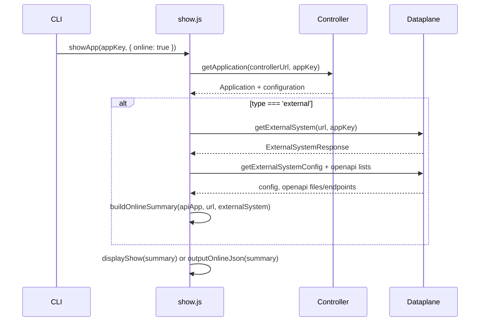

# App show online external system improvements

## Overview

- **Fix**: `aifabrix app show <appKey> --online` currently fails with `error: unknown option '--online'` because the `app show` subcommand does not declare the `--online` option (only the top-level `aifabrix show <appKey> --online` does). Add `--online` to `app show` so the option is accepted (no-op; this command is always online).
- **Improve**: For external apps when showing online, call dataplane `GET /api/v1/external/systems/{systemIdOrKey}` (ExternalSystemResponse), surface credentialId, status, version, showOpenApiDocs, mcpServerUrl, apiDocumentUrl, openApiDocsPageUrl; in Application section hide port/image/registry/build/url/internalUrl and show Status + Dataplane Status + version; update docs and tests.

## Rules and Standards

This plan must comply with [Project Rules](.cursor/rules/project-rules.mdc):

- **[CLI Command Development](.cursor/rules/project-rules.mdc)** – Adding/accepted option on `app show`; clear UX and error handling.
- **[Code Quality Standards](.cursor/rules/project-rules.mdc)** – File size ≤500 lines, functions ≤50 lines; JSDoc for public functions.
- **[Quality Gates](.cursor/rules/project-rules.mdc)** – Build, lint, test mandatory before commit; coverage ≥80% for new code.
- **[Testing Conventions](.cursor/rules/project-rules.mdc)** – Jest; tests in `tests/`; mock API client for show tests.
- **[Error Handling & Logging](.cursor/rules/project-rules.mdc)** – No secrets in logs; chalk for output; actionable errors.
- **[API Client Structure](.cursor/rules/project-rules.mdc)** – Use existing `lib/api/external-systems.api.js` (`getExternalSystem`).

**Key requirements:** Commander option pattern for `--online`; try/catch for async; JSDoc for changed/new functions; tests for new behavior and for `--online` acceptance; `npm run build` (lint + test) and `npm run lint` must pass.

## Before Development

- Read CLI Command Development and Quality Gates in project-rules.mdc.
- Confirm `getExternalSystem` in lib/api/external-systems.api.js and its JSDoc.
- Review lib/commands/app.js show command and lib/app/show.js flow for external + online.

## Definition of Done

Before marking the plan complete:

1. **Build**: Run `npm run build` first (must succeed; runs lint + test).
2. **Lint**: Run `npm run lint` (zero errors/warnings).
3. **Test**: Run `npm test` or `npm run test:ci` after lint (all tests pass; ≥80% coverage for new code).
4. **Order**: BUILD → LINT → TEST (do not skip).
5. **File size**: Files ≤500 lines, functions ≤50 lines.
6. **JSDoc**: All public functions touched or added have JSDoc.
7. **Security**: No hardcoded secrets; no logging of tokens/secrets.
8. **All tasks done**: --online fix, dataplane getExternalSystem, display changes, JSON output, tests, docs.

## Current behavior

- For **external** apps with `--online`, the code calls **Dataplane** only:
  - `getExternalSystemConfig` → `GET /api/v1/external/systems/{systemIdOrKey}/config`
  - `listOpenAPIFiles` and `listOpenAPIEndpoints`
- It does **not** call `GET /api/v1/external/systems/{systemIdOrKey}`, which returns **ExternalSystemResponse** (id, key, displayName, credentialId, status, version, showOpenApiDocs, mcpServerUrl, apiDocumentUrl, openApiDocsPageUrl, etc.).
- [lib/api/external-systems.api.js](lib/api/external-systems.api.js) already exposes `getExternalSystem` for that endpoint.
- Display: [lib/app/show-display.js](lib/app/show-display.js) shows full Application fields (port, image, registry, build, url, internal url) and an External system block built from the **config** response (systemKey, displayName, type, status, version, dataSources, service links).

## Target behavior

1. **Dataplane call**: For external + online, also call `getExternalSystem(dataplaneUrl, appKey, authConfig)` to obtain ExternalSystemResponse and surface:
  - **credentialId**, **status**, **version**, **showOpenApiDocs**, **mcpServerUrl**, **apiDocumentUrl**, **openApiDocsPageUrl**
2. **Application section (when online + external)**:
  - **Hide**: port, image, registry, build, url, internal url
  - **Show**: Status (application status from controller) and **Dataplane Status** (from ExternalSystemResponse.status)
  - **Add**: Application **version** when present (controller app or config)
3. **External system section**: Include the new fields above (credentialId, status, version, showOpenApiDocs, mcpServerUrl, apiDocumentUrl, openApiDocsPageUrl) in addition to existing dataSources and service links.
4. **Documentation**: Update [docs/commands/application-management.md](docs/commands/application-management.md) (and any related reference) to describe the external-specific output: two statuses, hidden deployment fields, and the new dataplane fields.

---

## Implementation plan

### 0. Fix `aifabrix app show <appKey> --online` (unknown option)

**File: [lib/commands/app.js**](lib/commands/app.js)

- On the `app .command('show <appKey>')` chain, add `.option('--online', 'Fetch from controller (default for this command)')` so that `--online` is accepted and does not trigger "unknown option". The command already runs with `online: true`; the option is for UX parity with `aifabrix show <appKey> --online` and can be ignored in the action.
- Add a test in [tests/lib/commands/app.test.js](tests/lib/commands/app.test.js) or [tests/lib/app/show.test.js](tests/lib/app/show.test.js) that `aifabrix app show <appKey> --online` runs without "unknown option" (e.g. invoke the show command with `--online` and assert no exit error for option parsing).

### 1. Fetch ExternalSystemResponse and merge into external system result

**File: [lib/app/show.js**](lib/app/show.js)

- In `fetchExternalSystemFromDataplane`:
  - Call `**getExternalSystem**` (existing in [lib/api/external-systems.api.js](lib/api/external-systems.api.js)) in addition to `getExternalSystemConfig` and `fetchOpenApiLists`.
  - Pass the raw ExternalSystemResponse (or extracted fields) into the builder.
- Extend `**buildExternalSystemResult**` (or add a helper) to accept the system response and map:
  - `credentialId`, `status`, `version`, `showOpenApiDocs`, `mcpServerUrl`, `apiDocumentUrl`, `openApiDocsPageUrl`
  into the result object. Keep building from config for `dataSources`, `application`, and keep `openapiFiles` / `openapiEndpoints` from existing calls so behavior stays consistent. Result shape for display/JSON should include:
  - `dataplaneStatus` (from ExternalSystemResponse.status) for clarity next to application status
  - `credentialId`, `version`, `showOpenApiDocs`, `mcpServerUrl`, `apiDocumentUrl`, `openApiDocsPageUrl` (and keep existing `status`/`version` if still used for backward compatibility or alias to the new source).
- Ensure `**buildApplicationFromAppCfg**` (or the summary path) can carry **version** from controller app/configuration when present (e.g. `pickAppCfg('version', app, cfg, undefined)` and include in application object for display).

### 2. Display: Application section for online + external

**File: [lib/app/show-display.js**](lib/app/show-display.js)

- In `**logApplicationSection**` (or the Application block):
  - When `summary.source === 'online' && summary.isExternal`: do **not** log port, image, registry, build, url, internal url. Still log Key, Display name, Description, Type.
  - When external + online: log **Status** (application status) and **Dataplane Status** (from `summary.externalSystem.status` or the new field used for ExternalSystemResponse.status).
  - When **version** is present on the application object (from controller), log **Version** in the Application section.
- Keep offline and non-external online behavior unchanged (all current Application fields).

### 3. Display: External system section

**File: [lib/app/show-display.js**](lib/app/show-display.js)

- In `**logExternalSystemMain**` (and related helpers): add lines for **credentialId**, **showOpenApiDocs**, **mcpServerUrl**, **apiDocumentUrl**, **openApiDocsPageUrl** when present (existing status/version already there; align with ExternalSystemResponse naming).
- Prefer using **openApiDocsPageUrl** from the response when available for the “OpenAPI docs page” link instead of only constructing REST/MCP URLs (keep constructed links as fallback if needed).

### 4. JSON output

**File: [lib/app/show.js**](lib/app/show.js)

- In `**outputOnlineJson**`, when `summary.externalSystem` is present and has no error, include the new fields in `out.externalSystem` (credentialId, status, version, showOpenApiDocs, mcpServerUrl, apiDocumentUrl, openApiDocsPageUrl) so JSON reflects the same data as the human-readable output.

### 5. Tests

- **Unit tests** ([tests/lib/app/show.test.js](tests/lib/app/show.test.js)): update or add cases that mock `getExternalSystem` and assert:
  - External system result includes the new fields.
  - Application section in display receives and shows Status vs Dataplane Status and version when external + online.
- **API tests** ([tests/lib/api/external-systems.api.test.js](tests/lib/api/external-systems.api.test.js)): `getExternalSystem` is already covered; no change required unless we add a new export or usage pattern.

### 6. Documentation

**File: [docs/commands/application-management.md**](docs/commands/application-management.md)

- In the **Output** description for **Online** (and for **aifabrix app show**):
  - State that for type **external**, the Application section shows **Status** and **Dataplane Status** (and application **Version** when available) and omits port, image, registry, build, url, and internal url.
  - Describe the **External system (dataplane)** section as including: credentialId, status, version, showOpenApiDocs, mcpServerUrl, apiDocumentUrl, openApiDocsPageUrl, plus dataSources and service links.
- Optionally add a short note that online external data comes from the controller plus the dataplane endpoint `GET /api/v1/external/systems/{systemIdOrKey}` (and existing config/openapi calls).

---

## Data flow (high level)

---

## Summary

| Area                    | Action                                                                                                                                                                             |
| ----------------------- | ---------------------------------------------------------------------------------------------------------------------------------------------------------------------------------- |
| Dataplane               | Call `getExternalSystem` for external + online; merge credentialId, status, version, showOpenApiDocs, mcpServerUrl, apiDocumentUrl, openApiDocsPageUrl into external system result |
| Application display     | For online + external: hide port, image, registry, build, url, internal url; show Status, Dataplane Status, and Version when present                                               |
| External system display | Show credentialId, showOpenApiDocs, mcpServerUrl, apiDocumentUrl, openApiDocsPageUrl (and existing status/version)                                                                 |
| JSON                    | Include new external system fields in online JSON output                                                                                                                           |
| Docs                    | Update application-management.md Output for online/external behavior and new fields                                                                                                |
| Tests                   | Adjust show tests to mock getExternalSystem and assert new fields and display behavior                                                                                             |

Yes, documentation should be updated as above so users know about the two statuses, hidden deployment fields for external apps, and the new dataplane-focused fields.

---

## Plan Validation Report

**Date**: 2025-02-12  
**Plan**: .cursor/plans/57-app_show_online_external_improvements.plan.md  
**Status**: VALIDATED

### Plan Purpose

- **Summary**: Fix CLI error when using `aifabrix app show <appKey> --online` (unknown option), and improve online show for external systems by using the dataplane system endpoint and ExternalSystemResponse fields (credentialId, status, version, showOpenApiDocs, mcpServerUrl, apiDocumentUrl, openApiDocsPageUrl), adjust Application display (hide deployment fields, show Status and Dataplane Status, add version), and update docs/tests.
- **Scope**: CLI (`app show`), lib/app/show.js, lib/app/show-display.js, lib/commands/app.js, lib/api (existing getExternalSystem), docs/commands/application-management.md, tests (show, commands).
- **Type**: Development (CLI + display + API usage).

### Applicable Rules

- **CLI Command Development** – Adding `--online` option to `app show`; command pattern and UX.
- **Code Quality Standards** – File size, JSDoc, documentation.
- **Quality Gates** – Mandatory build/lint/test, coverage ≥80%.
- **Testing Conventions** – Jest, tests in tests/, mock API for show.
- **Error Handling & Logging** – No secrets in logs, chalk, clear errors.
- **API Client Structure** – Use lib/api (getExternalSystem).

### Rule Compliance

- DoD requirements documented (build, lint, test, order, file size, JSDoc, security, all tasks).
- CLI Command Development: compliant (option added, pattern followed).
- Code Quality Standards: referenced; plan keeps files/functions within limits.
- Quality Gates: referenced; DoD includes build/lint/test and coverage.
- Testing: plan includes tests for --online and for new external-system display/API behavior.

### Plan Updates Made

- Added Overview clarifying the --online error and the external-system improvements.
- Added Rules and Standards with links to project-rules.mdc and key requirements.
- Added Before Development checklist.
- Added Definition of Done (build, lint, test, order, file size, JSDoc, security, all tasks).
- Added Implementation task 0: Fix `aifabrix app show <appKey> --online` in lib/commands/app.js and tests.
- Appended this Plan Validation Report.

### Recommendations

- When implementing task 0, ensure the show command action still passes `online: true` and does not require `options.online` to be true (accept --online for compatibility only).
- Run `npm run build` after all code changes and fix any lint or test failures before marking done.

