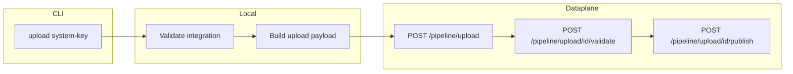

# Plan: `aifabrix upload <system-key>` – direct dataplane publish

## Goal

New command `**aifabrix upload <system-key>**` that:

- Publishes **directly to the dataplane** (no controller pipeline deploy).
- Uses the existing **upload → validate → publish** flow: `POST /api/v1/pipeline/upload`, then `.../upload/{id}/validate`, then `.../upload/{id}/publish`.
- Targets the **logged-in environment’s dataplane** (controller + environment from config; dataplane URL and auth resolved as for `download` / `datasource deploy`).

**Use cases (to document):**

- Test the full system + all datasources on that dataplane without promoting via controller.
- Work with limited platform permissions (e.g. no `applications:deploy` on controller, but dataplane access).
- System is available only on that dataplane for local/testing use. The dataplane does **not** deploy RBAC to the controller; RBAC stays in the dataplane. You can promote the system (including RBAC) to the full platform later via the web interface or `aifabrix deploy <app>`.

---

## Architecture

- **No controller deploy:** Controller is used only to resolve dataplane URL and (with token-manager) auth; no `validatePipeline` / `deployPipeline` calls.
- **Payload:** We send the **full manifest** (system + all datasources + RBAC). Body is `{ version, application, dataSources }` (matches pipeline upload API). The **dataplane does not deploy RBAC to the controller**—it keeps roles/permissions in the dataplane only. Promotion of RBAC to the full platform happens later via web interface or `aifabrix deploy`. Build payload from controller manifest shape (system with RBAC merged via [loadSystemWithRbac](lib/generator/external-controller-manifest.js)) then map to `{ version, application, dataSources }`.

---

## Implementation

### 1. Upload command implementation

- **CLI:** Add `upload <system-key>` in [lib/cli/setup-external-system.js](lib/cli/setup-external-system.js) (alongside `download`, `delete`, `test`, `test-integration`). Single required argument: `<system-key>`. Options: optional `--dry-run` (validate + build payload, no API calls) if desired; optional `--dataplane <url>` override for dataplane URL (mirroring datasource deploy pattern where applicable).
- **Handler module:** New file [lib/commands/upload.js](lib/commands/upload.js) (or [lib/external-system/upload.js](lib/external-system/upload.js)) that:
  1. **Resolve path:** Use `integration/<system-key>/` (same as download). Use existing path/detection helpers so that `system-key` is the app name for integration (e.g. `detectAppType(systemKey, { type: 'external' })` or equivalent).
  2. **Local validation:** Call `validateExternalSystemComplete(systemKey, { type: 'external' })`; if not valid, display errors and exit (same pattern as external-system deploy).
  3. **Build payload:** Send full manifest including RBAC. Build from controller manifest (so system has RBAC merged via `loadSystemWithRbac`) then map to upload body `{ version, application, dataSources }` (e.g. `application` = system object with RBAC, `dataSources` = manifest.dataSources). The dataplane receives the full manifest but does not deploy RBAC to the controller—it keeps RBAC in the dataplane until you promote via deploy or web UI.
  4. **Resolve dataplane and auth:** Same as [lib/external-system/download.js](lib/external-system/download.js): `resolveControllerUrl()`, `resolveEnvironment()`, `getDeploymentAuth(controllerUrl, environment, systemKey)`, `resolveDataplaneUrl(controllerUrl, environment, authConfig)`. If `--dataplane` is provided, use it instead of resolved URL.
  5. **Call pipeline upload flow:** Use existing [lib/api/pipeline.api.js](lib/api/pipeline.api.js):
    - `uploadApplicationViaPipeline(dataplaneUrl, authConfig, payload)` → get `uploadId`.
    - `validateUploadViaPipeline(dataplaneUrl, uploadId, authConfig)`; on failure, surface validation errors and exit.
    - `publishUploadViaPipeline(dataplaneUrl, uploadId, authConfig)`.
  6. **Output:** Clear success message (e.g. “Upload validated and published to dataplane for environment &lt;env&gt;”) and optionally show dataplane URL / system key.
- **Error handling:** Align with existing external-system commands: use `formatApiError` / handler from [lib/utils/api-error-handler.js](lib/utils/api-error-handler.js); suggest `aifabrix login` or `aifabrix app register <system-key>` when auth fails.

### 2. Tests

- **Unit tests:** New file e.g. [tests/lib/commands/upload.test.js](tests/lib/commands/upload.test.js) or [tests/lib/external-system/upload.test.js](tests/lib/external-system/upload.test.js): mock `validateExternalSystemComplete`, `generateExternalSystemApplicationSchema`, `getDeploymentAuth`, `resolveDataplaneUrl`, and the three pipeline API functions; assert sequence (validate → upload → validate upload → publish), payload shape, and error paths (validation failure, upload/validate/publish API errors).
- **Integration/CLI:** Optional: add a small test in existing CLI/external-system test suite that invokes `upload` with mocked APIs to ensure the command is registered and runs without throwing.

### 3. Documentation

- **[docs/commands/README.md](docs/commands/README.md)**  
  - In **External Integration** section, add an entry for `aifabrix upload <system-key>` with a one-line description and link to the new subsection in external-integration.md.  
  - Add “Upload to dataplane” to the Table of Contents under External Integration so it appears next to download, delete, test, datasource.
- **[docs/commands/external-integration.md](docs/commands/external-integration.md)**  
  - Add a new section **“aifabrix upload &lt;system-key&gt;”** (after download or in a logical place):  
    - **What:** Upload full manifest (system + all datasources + RBAC) to the dataplane for the current environment (upload → validate → publish). No controller deploy. The dataplane does not deploy RBAC to the controller—RBAC stays in the dataplane; promote later via web UI or `aifabrix deploy`.  
    - **When:** Test full system on dataplane without promoting; or when you have only dataplane access / limited controller permissions.  
    - **Usage:** `aifabrix upload <system-key>`, optional `--dry-run`, optional `--dataplane <url>`.  
    - **Prerequisites:** Login (or app credentials for `system-key`); `integration/<system-key>/` with valid application.yaml and system/datasource files.  
    - **Process:** 1) Validate locally, 2) Build payload, 3) Resolve dataplane URL and auth, 4) POST upload, 5) POST upload validate, 6) POST upload publish.  
    - **Output example** and **Issues / next steps** (e.g. “System is available only on this dataplane until you run `aifabrix deploy <app>`”).
- **[docs/external-systems.md](docs/external-systems.md)**  
  - Add a short subsection (e.g. under “Deploying” or “Workflow”) explaining **“Upload to dataplane (test without promoting)”**: when to use `aifabrix upload <system-key>` vs `aifabrix deploy <app>`; that we send the full manifest but the dataplane does not deploy RBAC to the controller (RBAC stays in the dataplane); promote to full platform later via web interface or `aifabrix deploy`; link to external-integration.md for the command.
- **[docs/wizard.md](docs/wizard.md)**  
  - In the “After the wizard” or “Next steps” area, add one line: after creating an integration, you can test it on the dataplane with `aifabrix upload <system-key>` before promoting with `aifabrix deploy ...`; link to external-integration.md.
- **[docs/commands/permissions.md](docs/commands/permissions.md)**  
  - Add a row to the Command → Service → Permissions table:  
    - Command: `aifabrix upload [system-key]`  
    - Service: Dataplane  
    - Required permission(s): Authenticated (pipeline upload/validate/publish; same as existing pipeline upload note – typically oauth2, no extra scope).
  - Optionally in the Dataplane permissions summary, mention that pipeline upload/validate/publish are used by `aifabrix upload`.

---

## Files to add

| File                                                                              | Purpose                                                                                                      |
| --------------------------------------------------------------------------------- | ------------------------------------------------------------------------------------------------------------ |
| `lib/commands/upload.js` or `lib/external-system/upload.js`                       | Upload command handler (validate, build payload, resolve dataplane + auth, call upload → validate → publish) |
| `tests/lib/commands/upload.test.js` or `tests/lib/external-system/upload.test.js` | Unit tests for upload flow and errors                                                                        |

## Files to modify

| File                                                                           | Change                                                      |
| ------------------------------------------------------------------------------ | ----------------------------------------------------------- |
| [lib/cli/setup-external-system.js](lib/cli/setup-external-system.js)           | Register `upload <system-key>` and wire to the new handler  |
| [docs/commands/README.md](docs/commands/README.md)                             | Add `upload` to ToC and External Integration list with link |
| [docs/commands/external-integration.md](docs/commands/external-integration.md) | New section documenting `aifabrix upload <system-key>`      |
| [docs/external-systems.md](docs/external-systems.md)                           | Subsection on “Upload to dataplane” vs deploy               |
| [docs/wizard.md](docs/wizard.md)                                               | One-line “next step” for upload before promote              |
| [docs/commands/permissions.md](docs/commands/permissions.md)                   | New row and optional Dataplane note for upload              |

---

## RBAC / payload note

We send the **full manifest** (system + all datasources + RBAC). Build the upload payload from the same source as the controller manifest: use [loadSystemWithRbac](lib/generator/external-controller-manifest.js) so the system object includes roles/permissions from `rbac.yaml`, then map to `{ version, application, dataSources }` (e.g. controller manifest’s `system` → `application`, `dataSources` → `dataSources`). The **dataplane does not deploy RBAC to the controller**—it keeps RBAC in the dataplane only. To make roles/permissions available on the full platform, the user promotes later via the web interface or `aifabrix deploy <app>`.

---

## Out of scope

- Changing the pipeline API or controller behavior.
- New permissions beyond what the dataplane already requires for pipeline upload/validate/publish.
- Promoting the uploaded system to the full platform from this command (user runs `aifabrix deploy <app>` when ready).

---

## Rules and Standards

This plan must comply with the following rules from [Project Rules](.cursor/rules/project-rules.mdc):

- **[Architecture Patterns](.cursor/rules/project-rules.mdc#architecture-patterns)** – Module structure (`lib/commands/` or `lib/external-system/`), CLI command pattern, API client usage (`lib/api/pipeline.api.js`). API Permissions: document required permissions in `docs/commands/permissions.md` and add `@requiresPermission` JSDoc per [permissions-guide.md](.cursor/rules/permissions-guide.md) for any new pipeline API usage.
- **[CLI Command Development](.cursor/rules/project-rules.mdc#cli-command-development)** – Add command in `lib/cli/setup-external-system.js`, implement handler in `lib/commands/` or `lib/external-system/`, input validation, error handling with chalk, user-friendly messages.
- **[Code Style](.cursor/rules/project-rules.mdc#code-style)** – Error handling (try/catch, meaningful messages), input validation (system-key, paths), async/await, `path.join()` for paths.
- **[Testing Conventions](.cursor/rules/project-rules.mdc#testing-conventions)** – Test file mirrors source (`tests/lib/commands/upload.test.js` or `tests/lib/external-system/upload.test.js`), mock API and validation, success and error paths, ≥80% coverage for new code.
- **[Code Quality Standards](.cursor/rules/project-rules.mdc#code-quality-standards)** – Files ≤500 lines, functions ≤50 lines, JSDoc for all public functions.
- **[Quality Gates](.cursor/rules/project-rules.mdc#quality-gates)** – Mandatory checks before commit: build, lint, tests, coverage, no hardcoded secrets.
- **[Error Handling & Logging](.cursor/rules/project-rules.mdc#error-handling--logging)** – Use `formatApiError` / handler from `lib/utils/api-error-handler.js`; never log secrets or tokens.
- **[Security & Compliance](.cursor/rules/project-rules.mdc#security--compliance-iso-27001)** – No hardcoded secrets; validate inputs (system-key, URLs); never expose sensitive data in errors.

**Key requirements**

- Register `upload <system-key>` in `lib/cli/setup-external-system.js` with same pattern as `download`/`delete` (try/catch, `handleCommandError`).
- Use existing `lib/api/pipeline.api.js` for upload → validate → publish; no direct `makeApiCall`.
- Validate system-key and integration path; use `validateExternalSystemComplete`; resolve dataplane and auth as in `lib/external-system/download.js`.
- Add a row in `docs/commands/permissions.md` for `aifabrix upload [system-key]` (Dataplane, pipeline upload/validate/publish).
- Unit tests: mock validation, auth, pipeline API; assert sequence and error paths.

---

## Before Development

- Read CLI Command Development and Architecture Patterns (API client) in project-rules.mdc.
- Review `lib/external-system/download.js` for path resolution, auth, and dataplane URL pattern.
- Review `lib/api/pipeline.api.js` for `uploadApplicationViaPipeline`, `validateUploadViaPipeline`, `publishUploadViaPipeline`.
- Review `.cursor/rules/permissions-guide.md` for documenting permissions.
- Confirm test layout: `tests/lib/commands/upload.test.js` or `tests/lib/external-system/upload.test.js` to mirror handler location.

---

## Definition of Done

Before marking this plan complete:

1. **Build:** Run `npm run build` first (must succeed; runs lint + test).
2. **Lint:** Run `npm run lint` (must pass with zero errors and zero warnings).
3. **Test:** Run `npm test` or `npm run test:ci` after lint (all tests must pass; ≥80% coverage for new code).
4. **Validation order:** BUILD → LINT → TEST (mandatory sequence; do not skip steps).
5. **File size:** New/modified files ≤500 lines; functions ≤50 lines.
6. **JSDoc:** All public functions in the new handler and any new API helpers have JSDoc comments.
7. **Code quality:** All requirements from Rules and Standards and Quality Gates are met.
8. **Security:** No hardcoded secrets; auth and tokens not logged; ISO 27001–aligned.
9. **Permissions:** `docs/commands/permissions.md` updated with `aifabrix upload [system-key]` (Dataplane, pipeline upload/validate/publish); optional Dataplane note added if applicable.
10. **Docs:** All five doc files updated as specified (README ToC, external-integration.md, external-systems.md, wizard.md, permissions.md).
11. All implementation tasks (CLI registration, handler, tests, documentation) are done.

---

## Plan Validation Report

**Date:** 2025-02-12  
**Plan:** .cursor/plans/61-upload_to_dataplane_command.plan.md  
**Status:** VALIDATED

### Plan Purpose

Add a new CLI command `aifabrix upload <system-key>` that publishes a full external system (system + all datasources + RBAC) directly to the dataplane using the existing pipeline upload → validate → publish flow. No controller deploy; controller is used only to resolve dataplane URL and auth. Scope: CLI registration in `lib/cli/setup-external-system.js`, new handler in `lib/commands/upload.js` or `lib/external-system/upload.js`, use of `lib/api/pipeline.api.js`, local validation, payload build from `loadSystemWithRbac`, and documentation updates across five doc files. **Type:** Development (CLI command, new module, API usage, documentation).

### Applicable Rules

- [Architecture Patterns](.cursor/rules/project-rules.mdc#architecture-patterns) – CLI/module layout, API client usage, permissions documentation.
- [CLI Command Development](.cursor/rules/project-rules.mdc#cli-command-development) – New command pattern, validation, error handling, chalk.
- [Code Style](.cursor/rules/project-rules.mdc#code-style) – Error handling, input validation, async/await, path.join.
- [Testing Conventions](.cursor/rules/project-rules.mdc#testing-conventions) – Test layout, mocks, success/error paths, coverage.
- [Code Quality Standards](.cursor/rules/project-rules.mdc#code-quality-standards) – File/function size, JSDoc.
- [Quality Gates](.cursor/rules/project-rules.mdc#quality-gates) – Build, lint, test, coverage, security.
- [Error Handling & Logging](.cursor/rules/project-rules.mdc#error-handling--logging) – formatApiError, no secrets in logs.
- [Security & Compliance](.cursor/rules/project-rules.mdc#security--compliance-iso-27001) – No hardcoded secrets, input validation.

### Rule Compliance

- DoD requirements: Documented (build first, lint, test, order BUILD → LINT → TEST, file size, JSDoc, security, permissions, docs).
- Rules and Standards: Added with applicable sections and key requirements.
- Before Development: Checklist added (read rules, review download + pipeline API + permissions guide, confirm test layout).
- Definition of Done: Added with all mandatory items including validation order and permissions/doc updates.

### Plan Updates Made

- Added **Rules and Standards** section with links to project-rules.mdc and permissions-guide.md.
- Added **Before Development** checklist (rules, download.js, pipeline.api.js, permissions guide, test layout).
- Added **Definition of Done** with build → lint → test order, file size, JSDoc, security, permissions, and doc updates.
- Validation report appended to this plan file.

### Recommendations

- When implementing, place the handler in `lib/commands/upload.js` to align with other command handlers (e.g. convert.js) unless the team prefers `lib/external-system/upload.js` for consistency with download/delete/test.
- If `lib/api/pipeline.api.js` is extended or new pipeline helpers are added, add `@requiresPermission` JSDoc per permissions-guide.md.
- Optional integration/CLI test (command registered and runs with mocked APIs) will improve regression coverage; plan already lists it as optional.

---

## Implementation Validation Report

**Date:** 2025-02-12  
**Plan:** .cursor/plans/61-upload_to_dataplane_command.plan.md  
**Status:** COMPLETE

### Executive Summary

Plan 61 (Upload to dataplane command) has been fully implemented. All required files exist, unit tests are in place and pass, and documentation updates are complete. Code quality steps (lint:fix, lint, test) complete successfully. Lint reports 3 pre-existing warnings in unrelated files (`lib/app/show-display.js`, `lib/app/show.js`); implementation files for this plan have 0 errors and 0 warnings.

### Task Completion

- Plan 61 uses narrative implementation sections (no checkbox tasks). All described implementation items are done: CLI registration, handler module, unit tests, and five doc updates.
- Completion: 100% (all implementation steps completed).

### File Existence Validation

| File                                    | Status                                                                                                                                    |
| --------------------------------------- | ----------------------------------------------------------------------------------------------------------------------------------------- |
| `lib/commands/upload.js`                | Exists – handler with validate, buildPayload, resolveDataplaneAndAuth, runUploadValidatePublish                                           |
| `tests/lib/commands/upload.test.js`     | Exists – unit tests for success, dry-run, dataplane override, validation failure, API errors, buildUploadPayload, validateSystemKeyFormat |
| `lib/cli/setup-external-system.js`      | Modified – `upload <system-key>` registered with --dry-run, --dataplane                                                                   |
| `docs/commands/README.md`               | Modified – upload in ToC and External Integration list with link                                                                          |
| `docs/commands/external-integration.md` | Modified – new section "aifabrix upload " with What/When/Usage/Prerequisites/Process/Output/Issues                                        |
| `docs/external-systems.md`              | Modified – subsection "4a. Upload to dataplane (test without promoting)"                                                                  |
| `docs/wizard.md`                        | Modified – one-line next step for upload before promote with link                                                                         |
| `docs/commands/permissions.md`          | Modified – new row for `aifabrix upload [system-key]` and Dataplane summary note                                                          |

### Test Coverage

- Unit tests exist: `tests/lib/commands/upload.test.js` – mocks validateExternalSystemComplete, generateControllerManifest, getDeploymentAuth, pipeline API; asserts sequence (validate → upload → validate upload → publish), payload shape, dry-run, --dataplane override, validation failure, missing uploadId, validate failure, upload API failure, invalid system-key, buildUploadPayload, validateSystemKeyFormat.
- Integration/CLI test: Optional per plan; not required for validation.
- Upload tests pass as part of full suite (192 suites, 4333+ tests passed).

### Code Quality Validation

| Step                      | Result                                                                                       |
| ------------------------- | -------------------------------------------------------------------------------------------- |
| Format (npm run lint:fix) | PASSED (exit 0)                                                                              |
| Lint (npm run lint)       | PASSED (exit 0). 3 warnings in pre-existing files only; plan 61 files: 0 errors, 0 warnings. |
| Tests (npm test)          | PASSED (all tests pass)                                                                      |

### Cursor Rules Compliance

| Area             | Status                                                                                                                                          |
| ---------------- | ----------------------------------------------------------------------------------------------------------------------------------------------- |
| Code reuse       | PASSED – uses existing validateExternalSystemComplete, generateControllerManifest, pipeline.api, formatApiError, download-style auth resolution |
| Error handling   | PASSED – try/catch, meaningful messages, formatApiError for API errors                                                                          |
| Logging          | PASSED – logger.log, chalk; no secrets logged                                                                                                   |
| Type safety      | PASSED – JSDoc on all public functions in upload.js                                                                                             |
| Async patterns   | PASSED – async/await throughout                                                                                                                 |
| File operations  | PASSED – path usage via existing helpers (no direct file writes in handler)                                                                     |
| Input validation | PASSED – validateSystemKeyFormat; system-key validated                                                                                          |
| Module patterns  | PASSED – CommonJS, named exports                                                                                                                |
| Security         | PASSED – no hardcoded secrets; auth from token-manager/config                                                                                   |

### Implementation Completeness

| Item           | Status                                                                                     |
| -------------- | ------------------------------------------------------------------------------------------ |
| CLI command    | COMPLETE – upload &lt;system-key&gt;, --dry-run, --dataplane                               |
| Handler module | COMPLETE – validate, build payload, resolve dataplane/auth, upload → validate → publish    |
| Unit tests     | COMPLETE – success and error paths, payload and key validation                             |
| Documentation  | COMPLETE – README, external-integration.md, external-systems.md, wizard.md, permissions.md |

### Issues and Recommendations

- None blocking. Lint warnings in `lib/app/show-display.js` and `lib/app/show.js` are pre-existing and outside this plan.
- Optional: add a CLI/external-system test that invokes the upload command with mocked APIs to assert command registration (plan lists as optional).

### Final Validation Checklist

- All implementation tasks completed (CLI, handler, tests, docs)
- All required files exist and contain expected logic
- Tests exist and pass
- Format (lint:fix) passes
- Lint passes (0 errors; 3 warnings in unrelated files)
- Cursor rules compliance verified for new code
- Implementation complete

