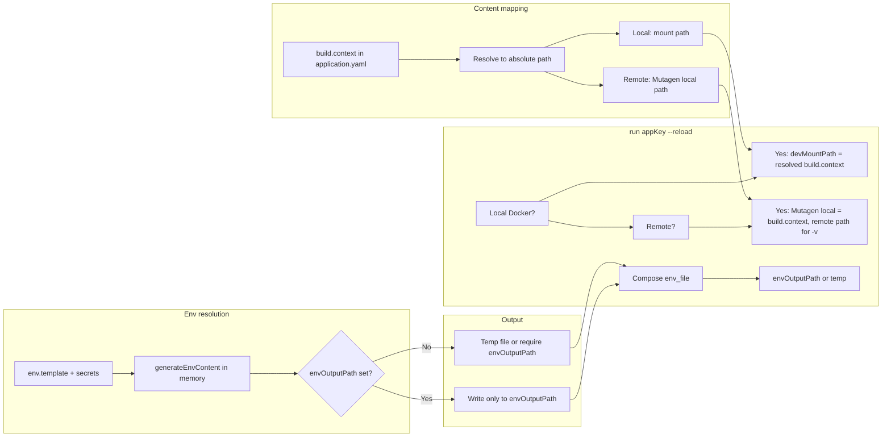

# Local Docker support and single .env (unified run flow)

## Context

- **Remote flow (already implemented):** [65-remote-docker-validated.plan.md](.cursor/plans/65-remote-docker-validated.plan.md) — `run --reload` with remote Docker uses Mutagen sync and remote path for volume mount; .env is still generated in `builder/<appKey>/.env` and copied to dev dir and `envOutputPath`.
- **Goal:** Support the same command **locally** (local Docker + local HDD), use **one .env file** only (in the code folder), resolve secrets **in memory** (no .env in `builder/` or `integration/`), and **remove `build.localPort**` so port comes only from `port` in `application.yaml`.

---

## Rules and Standards

This plan must comply with [Project Rules](.cursor/rules/project-rules.mdc). Applicable sections:

- **[Quality Gates](.cursor/rules/project-rules.mdc#quality-gates)** — Mandatory checks before commit: build, lint, test, coverage ≥80%, no hardcoded secrets. Applies to all plans.
- **[Code Quality Standards](.cursor/rules/project-rules.mdc#code-quality-standards)** — File size ≤500 lines, functions ≤50 lines; JSDoc for all public functions. Applies to all plans.
- **[CLI Command Development](.cursor/rules/project-rules.mdc#cli-command-development)** — run command behaviour, input validation, chalk output, user-friendly errors. Plan changes run/prepareAppRun and related CLI flow.
- **[Security & Compliance (ISO 27001)](.cursor/rules/project-rules.mdc#security--compliance-iso-27001)** — No secrets on disk in builder/integration; resolve in memory; never log secrets. Plan moves .env writes to envOutputPath only.
- **[Docker & Infrastructure](.cursor/rules/project-rules.mdc#docker--infrastructure)** — Compose, volume mounts, env_file, secure container config. Plan touches compose-generator and run flow.
- **[Validation Patterns](.cursor/rules/project-rules.mdc#validation-patterns)** — Schema changes (remove localPort); YAML/config handling. Plan updates application-schema.json.
- **[Testing Conventions](.cursor/rules/project-rules.mdc#testing-conventions)** — Jest, tests in tests/, mock external deps, 80%+ coverage for new code. Plan requires test updates for localPort removal and new behaviour.
- **[Error Handling & Logging](.cursor/rules/project-rules.mdc#error-handling--logging)** — try-catch for async, chalk for errors, never log secrets. Applies to new/updated code paths.

**Key requirements:** Validate inputs (app names, paths); use try-catch for async ops; JSDoc for public functions; path.join() for paths; no hardcoded secrets; tests for new/changed behaviour; run build → lint → test before commit.

---

## Before Development

- Read applicable sections from [project-rules.mdc](.cursor/rules/project-rules.mdc) (Quality Gates, CLI Command Development, Security & Compliance, Docker & Infrastructure).
- Review [builder-cli.md](.cursor/plans/builder-cli.md) for sync/Docker parameters and [65-remote-docker-validated.plan.md](.cursor/plans/65-remote-docker-validated.plan.md) for remote run flow.
- Ensure validation order: **BUILD → LINT → TEST** (never skip steps).

---

## Definition of Done

Before marking this plan complete:

1. **Build:** Run `npm run build` FIRST (must succeed — runs `npm run lint` then `npm run test`).
2. **Lint:** Run `npm run lint` (must pass with zero errors/warnings).
3. **Test:** Run `npm test` after lint (all tests must pass; ≥80% coverage for new code).
4. **Validation order:** BUILD → LINT → TEST (mandatory sequence; never skip steps).
5. **File size limits:** Files ≤500 lines, functions ≤50 lines.
6. **JSDoc:** All new/updated public functions have JSDoc comments.
7. **Code quality:** All rule requirements met for touched files.
8. **Security:** No .env written to builder/ or integration/; secrets resolved in memory; no hardcoded secrets; ISO 27001 compliance where applicable.
9. **Rule references:** Implementation follows Rules and Standards above.
10. All implementation tasks (build.context resolution, single .env, local run --reload, localPort removal) completed and validated per section 6.

---

## 1. Target behaviour

### 1.1 `build.context` as the main content mapping (local and remote)

- **build.context** in `application.yaml` is the **canonical app code directory** for both local and remote. It is resolved relative to the directory containing the application config (e.g. `builder/<appKey>/`). Examples: `../..` (project root), `../../apps/myapp` (app code folder).
- **Local run --reload:** Use **local** Docker. Mount path = resolved **build.context** (absolute). Container sees that directory at `/app`; no Mutagen.
- **Remote run --reload:** Mutagen **local** path = resolved **build.context** (same resolution). Mutagen **remote** path = `user-mutagen-folder` + `/dev/` + appKey (unchanged). Compose `devMountPath` = remote path. So one config field drives both: local mount and local side of sync.
- **Unified:** One command; behaviour depends only on whether remote Docker is configured. Content mapping is always **build.context**.

### 1.2 Single .env file (code folder only)

- **Resolve in memory:** All secret resolution and env content generation stays in memory (reuse existing `generateEnvContent()` in [lib/core/secrets.js](lib/core/secrets.js)); no writes to `builder/<appKey>/.env` or `integration/<appKey>/.env`.
- **Write only to `build.envOutputPath`:** When `build.envOutputPath` is set, write the resolved .env **only** there (the “code folder” .env). That file is the single persisted .env; the runtime (container or local process) reads it from there.
- **When `envOutputPath` is not set:** Either require `envOutputPath` for `run` (and document it), or write to a **temporary** file for that run only (e.g. for compose `env_file`) and do not persist under `builder/` or `integration/`. Prefer requiring `envOutputPath` for run to keep the model simple.
- **Compose:** Use the same single .env for `env_file`: the path is the resolved `envOutputPath` when set; otherwise the temp path or fail with a clear message.

### 1.3 Remove `build.localPort`

- **Single port:** Use `application.yaml` → `port` only for app port (container and host mapping). Developer offset (e.g. `port + developerId * 100`) can remain for multi-developer on one machine.
- **Remove:** `build.localPort` from schema, config types, port resolution ([lib/utils/port-resolver.js](lib/utils/port-resolver.js) `getLocalPort`), [lib/utils/secrets-helpers.js](lib/utils/secrets-helpers.js), [lib/utils/env-copy.js](lib/utils/env-copy.js), compose generator, docs, and tests. All references to “localPort” for PORT or URLs should use `port` instead.

---

## 2. Architecture (high level)

- **Content:** **build.context** is the single source of truth for “where the app code lives”: local mount path and (when remote) Mutagen local path both use resolved **build.context**.
- **Env:** Resolve once in memory; persist only at `envOutputPath` (or temp); never under `builder/` or `integration/`.
- **Run:** Local → mount resolved build.context; remote → Mutagen from resolved build.context to remote path. Compose always uses the single .env path (envOutputPath or temp).

---

## 3. Implementation outline

### 3.1 Content path from build.context; local and remote run --reload

- **Resolve build.context once:** Add (or reuse) a helper that resolves **build.context** from `application.yaml` to an absolute path (relative to the directory containing the config file, e.g. `path.resolve(path.dirname(applicationConfigPath), build.context)`). Use this for both local mount and Mutagen local path. **Where:** e.g. [lib/utils/paths.js](lib/utils/paths.js) or [lib/app/run-helpers.js](lib/app/run-helpers.js); ensure resolution is consistent with build’s `prepareBuildContext` semantics where relevant.
- **Where:** [lib/app/run.js](lib/app/run.js) `ensureReloadSync` and `prepareAppRun`; [lib/app/run-helpers.js](lib/app/run-helpers.js) `prepareEnvironment`.
- **Logic:** In `prepareAppRun`, when `options.reload && envKey === 'dev'`:
  - Compute **codePath** = resolved **build.context** (absolute) from app config.
  - If **remote:** keep current behaviour for remote path; set Mutagen **local** path to **codePath** (not necessarily `getBuilderPath(appName)`). Call `ensureReloadSync` with this local path (or ensure Mutagen uses codePath); set `runOptions.devMountPath = remotePath`.
  - If **local:** set `runOptions.devMountPath = codePath` so the container mounts the same directory that build.context defines.
  - Compose template already supports `devMountPath` ([templates/typescript/docker-compose.hbs](templates/typescript/docker-compose.hbs) lines 41–44); ensure paths work on Windows/Mac (Docker Desktop).
- **Dev directory / copy:** After switching to single .env at envOutputPath, compose’s `env_file` points to that path (or temp). Keep compose generation in dev dir and pass the single .env path and (for reload) the resolved build.context into the run flow.

### 3.2 Env: resolve in memory, write only to envOutputPath

- **New/updated API in [lib/core/secrets.js](lib/core/secrets.js):**
  - Add (or reuse) a function that **only** resolves .env content (e.g. `generateEnvContent(appName, secretsPath, environment, force)` already exists and returns a string). No write.
  - Add `resolveAndWriteEnvFile(appName, options)` (or equivalent) where:
    - `options.envOutputPath` = resolved absolute path when `build.envOutputPath` is set (from application.yaml).
    - Resolve content via `generateEnvContent` (environment: `docker` for run; keep `local`/`docker` semantics as needed for port/URL resolution).
    - If `options.envOutputPath` is set: write **only** there; return that path.
    - If not set: either write to a temp file and return that path (for compose), or throw a clear error that `run` requires `build.envOutputPath`.
  - **Remove** all writes to `builder/<appKey>/.env` and `integration/<appKey>/.env` from the run/build flow. Callers that today expect a builder .env should use the path returned from the new API (envOutputPath or temp).
- **Call sites to update:**
  - [lib/app/run-helpers.js](lib/app/run-helpers.js) `prepareEnvironment`: stop calling `secrets.generateEnvFile` (which writes to builder and then processEnvVariables to envOutputPath). Instead: resolve in memory, write only to envOutputPath (or temp), and pass that path to compose generator. Ensure compose and any copy to “dev dir” use this single path; do not write .env into `pathsUtil.getBuilderPath(appName)` or integration path.
  - [lib/core/secrets.js](lib/core/secrets.js) `generateEnvFile`: refactor so it no longer writes to `builderPath/.env`; it should only write to the path given (envOutputPath) or delegate to the new API. Remove the call to `processEnvVariables` that copies/patches to envOutputPath (that becomes the only write).
  - [lib/utils/env-copy.js](lib/utils/env-copy.js) `processEnvVariables`: once env is written only at envOutputPath, this can be removed or reduced to “ensure directory exists and write content to envOutputPath” (no “copy from builder” path).
  - [lib/build/index.js](lib/build/index.js) and any other callers of `generateEnvFile`: ensure they request the output path (envOutputPath or temp) and do not rely on builder/.env existing.
- **Remote secrets:** [lib/utils/remote-secrets-loader.js](lib/utils/remote-secrets-loader.js) already used for resolution; keep using it so that when `aifabrix-secrets` is a URL, values are not stored on disk — only the final .env at envOutputPath (or temp) is written.

### 3.3 Compose and run flow to use single .env path

- **[lib/utils/compose-generator.js](lib/utils/compose-generator.js):** Today it uses `devDir` and `path.join(devDir, '.env')`. Change to accept an explicit **env file path** (e.g. `options.envFilePath`): when provided, use it for `env_file`; otherwise fall back to current behaviour until everything is migrated, then require it for run.
- **run-helpers.prepareEnvironment:** Compute the single .env path (envOutputPath or temp), call the new resolve-and-write API, pass `envFilePath` into compose generator. Do not write .env to builder or integration.

### 3.4 Remove build.localPort

- **Schema:** [lib/schema/application-schema.json](lib/schema/application-schema.json) — remove `localPort` under `build` (or mark deprecated and ignore).
- **Port resolution:** [lib/utils/port-resolver.js](lib/utils/port-resolver.js) — `getLocalPort` should return `port` (or default); remove branches that prefer `build.localPort`. Same in [lib/utils/secrets-helpers.js](lib/utils/secrets-helpers.js) and [lib/utils/env-copy.js](lib/utils/env-copy.js) (e.g. `patchEnvContentForLocal`, `updatePortInEnv` use port only).
- **Compose / run:** [lib/utils/compose-generator.js](lib/utils/compose-generator.js) (e.g. `localPort` in buildServiceConfig) — remove; use `port` everywhere. [lib/app/run-helpers.js](lib/app/run-helpers.js) `calculateComposePort` already uses `appConfig.port` with developer offset; ensure no localPort reference remains.
- **Docs and tests:** Remove or replace all references to `build.localPort` in docs (e.g. [docs/configuration/application-yaml.md](docs/configuration/application-yaml.md), [docs/developer-isolation.md](docs/developer-isolation.md), [docs/running.md](docs/running.md), [docs/building.md](docs/building.md)) and in tests (grep `localPort` and update expectations to use `port`).

---

## 4. File touch list (concise)

| Area                                                      | Files                                                                                                                                                                                                                                                                                                                                                                |
| --------------------------------------------------------- | -------------------------------------------------------------------------------------------------------------------------------------------------------------------------------------------------------------------------------------------------------------------------------------------------------------------------------------------------------------------- |
| build.context as content mapping                          | [lib/app/run.js](lib/app/run.js), [lib/app/run-helpers.js](lib/app/run-helpers.js), [lib/utils/mutagen.js](lib/utils/mutagen.js) (Mutagen local path), path resolver for build.context                                                                                                                                                                               |
| Local run --reload                                        | [lib/app/run.js](lib/app/run.js), [lib/app/run-helpers.js](lib/app/run-helpers.js)                                                                                                                                                                                                                                                                                   |
| Single .env (resolve in memory, write only envOutputPath) | [lib/core/secrets.js](lib/core/secrets.js), [lib/utils/env-copy.js](lib/utils/env-copy.js), [lib/app/run-helpers.js](lib/app/run-helpers.js), [lib/build/index.js](lib/build/index.js)                                                                                                                                                                               |
| Compose env path                                          | [lib/utils/compose-generator.js](lib/utils/compose-generator.js)                                                                                                                                                                                                                                                                                                     |
| Remove localPort                                          | [lib/utils/port-resolver.js](lib/utils/port-resolver.js), [lib/utils/secrets-helpers.js](lib/utils/secrets-helpers.js), [lib/utils/env-copy.js](lib/utils/env-copy.js), [lib/schema/application-schema.json](lib/schema/application-schema.json), [lib/utils/compose-generator.js](lib/utils/compose-generator.js), docs, templates, tests (multiple under `tests/`) |

---

## 5. Behaviour matrix after changes

| Scenario            | .env on disk                                                                 | Compose env_file     | Mount / sync (--reload dev)                                                                 |
| ------------------- | ---------------------------------------------------------------------------- | -------------------- | ------------------------------------------------------------------------------------------- |
| Local run --reload  | Only at envOutputPath (or temp)                                              | envOutputPath / temp | **build.context** (resolved) → devMountPath                                                 |
| Remote run --reload | Same (no builder/.env)                                                       | Same                 | Mutagen local = **build.context** (resolved); remote = user-mutagen-folder + /dev/ + appKey |
| Build               | No .env in builder/; optional write to envOutputPath if needed for later run | N/A                  | N/A                                                                                         |

---

## 6. Validation

- **build.context:** Resolved build.context is used as local mount path (local) and as Mutagen local path (remote); one config field drives both.
- **Local:** On Windows or Mac, with local Docker only (no remote-server/docker-endpoint), run `aifabrix run <appKey> --reload`: app runs with mount = resolved build.context, changes there are reflected in the container, and only one .env exists (at envOutputPath or documented temp).
- **Remote:** With remote-server and docker-endpoint, `aifabrix run <appKey> --reload` still works: Mutagen syncs from resolved build.context (local) to remote path; container uses remote path for -v.
- **No builder/.env:** After run or resolve, `builder/<appKey>/.env` and `integration/<appKey>/.env` are not created/updated.
- **Port:** All port behaviour uses `port` only; no `build.localPort` in schema or code paths.
- **Tests:** Update and add tests for in-memory resolution, single-file write, local mount path, and removal of localPort; run full test suite and lint.

---

## 7. Optional follow-ups (out of scope for this plan)

- Encrypt .env in the code folder (mentioned as future).
- Consolidate or rename “dev” directory usage if it becomes redundant when .env is only at envOutputPath.

---

## Plan Validation Report

**Date:** 2025-02-17  
**Plan:** .cursor/plans/66-local_docker_and_single_.env.plan.md  
**Status:** VALIDATED

### Plan Purpose

Enable `aifabrix run <appKey> --reload` with local Docker (Windows/Mac, local HDD), use build.context as the single content mapping for local and remote, resolve secrets in memory, write one .env only to build.envOutputPath (code folder), and remove build.localPort. **Scope:** CLI run flow, secrets/core, compose-generator, schema, port resolution, env-copy, paths, Mutagen, docs and tests. **Type:** Development (CLI + infra) and Refactoring (env flow, localPort removal).

### Applicable Rules

- [Quality Gates](.cursor/rules/project-rules.mdc#quality-gates) — Mandatory pre-commit checks; referenced in plan.
- [Code Quality Standards](.cursor/rules/project-rules.mdc#code-quality-standards) — File/function limits, JSDoc; referenced in plan.
- [CLI Command Development](.cursor/rules/project-rules.mdc#cli-command-development) — run command and UX; referenced in plan.
- [Security & Compliance (ISO 27001)](.cursor/rules/project-rules.mdc#security--compliance-iso-27001) — Secret management, no .env in builder/integration; referenced in plan.
- [Docker & Infrastructure](.cursor/rules/project-rules.mdc#docker--infrastructure) — Compose, mounts, env_file; referenced in plan.
- [Validation Patterns](.cursor/rules/project-rules.mdc#validation-patterns) — Schema and YAML; referenced in plan.
- [Testing Conventions](.cursor/rules/project-rules.mdc#testing-conventions) — Jest, coverage; referenced in plan.
- [Error Handling & Logging](.cursor/rules/project-rules.mdc#error-handling--logging) — try-catch, chalk, no secrets in logs; referenced in plan.

### Rule Compliance

- DoD requirements: Documented (build, lint, test, order, file size, JSDoc, security, tasks).
- Quality Gates: Compliant (build/lint/test and order specified).
- Code Quality Standards: Compliant (limits and JSDoc in DoD).
- CLI / Security / Docker / Validation / Testing / Error Handling: Plan references rules and aligns with requirements.

### Plan Updates Made

- Added **Rules and Standards** section with links to project-rules.mdc and key requirements.
- Added **Before Development** section with checklist and validation order.
- Added **Definition of Done** section with build, lint, test, validation order, file size, JSDoc, security, and task completion.
- Appended this **Plan Validation Report**.

### Recommendations

- When implementing build.context resolution, add a helper in lib/utils/paths.js (or run-helpers) and add unit tests for resolution relative to config path.
- When changing Mutagen local path to use resolved build.context, confirm with 65-remote-docker-validated.plan.md and builder-cli.md so remote behaviour stays aligned.
- Run full test suite after localPort removal; many tests reference localPort and will need updates (plan already lists this in 3.4 and file touch list).
