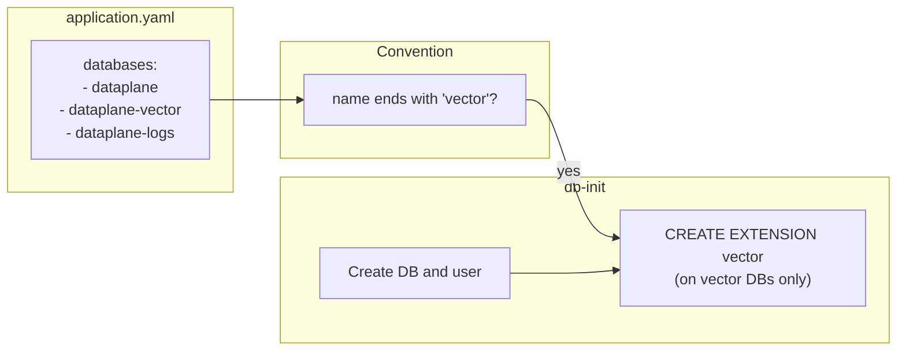

# Vector database extension (name convention)

## Context

- **Cause (from your summary):** Application startup runs `CREATE EXTENSION IF NOT EXISTS vector` on the document-store DB. In PostgreSQL, creating extensions requires superuser (or equivalent). A normal DB user gets "permission denied to create extension vector" and the app fails to start.
- **Change in app (already done elsewhere):** The app now wraps extension creation in try/except and continues on permission denied; if a DBA has already created the extension, the app starts.
- **Builder change (this plan):** In the Builder, treat any database whose **name ends with `vector**` as the vector store and **create the pgvector extension there during db-init**. db-init runs as `pgadmin` (superuser in the local Postgres container), so it can run `CREATE EXTENSION IF NOT EXISTS vector` on those databases. That way local runs get the extension automatically; for Azure/managed Postgres, docs will state that a DBA may need to run it as superuser if the app user cannot.

## Convention

- **Rule:** If `requires.databases[].name` ends with `"vector"` (case-insensitive), that database is a vector store and db-init will run `CREATE EXTENSION IF NOT EXISTS vector` on it.
- **Example:** In [templates/applications/dataplane/application.yaml](templates/applications/dataplane/application.yaml), `dataplane-vector` already matches; no schema or YAML change required for the convention.

## Implementation

### 1. Helper and compose templates

- **[lib/utils/compose-generator.js](lib/utils/compose-generator.js)**  
  - Register a Handlebars helper `isVectorDatabase(name)`: return `true` when `String(name).toLowerCase().endsWith('vector')`.  
  - Optionally export a small predicate (e.g. `isVectorDatabaseName(name)`) for reuse and tests.
- **[templates/python/docker-compose.hbs](templates/python/docker-compose.hbs)** and **[templates/typescript/docker-compose.hbs](templates/typescript/docker-compose.hbs)**  
  - In the db-init `{{#each databases}}` block, **after** the `fi &&` that closes the “create database / already exists” block and **before** `{{/each}}`, add:
    - If `(isVectorDatabase name)`: run `psql -d {{name}} -c "CREATE EXTENSION IF NOT EXISTS vector;"` and an echo (e.g. “pgvector extension enabled on {{name}}."), then `&&` so the shell chain continues.
  - This runs for every vector DB on each init (idempotent due to `IF NOT EXISTS`), for both newly created and already-existing databases.

### 2. Tests

- **[tests/lib/compose-generator.test.js](tests/lib/compose-generator.test.js)**  
  - Add a test: config with `requires.database: true` and `databases: [{ name: 'main' }, { name: 'dataplane-vector' }]`, `.env` with `DB_0_PASSWORD` and `DB_1_PASSWORD`. Generate compose and assert the output includes `CREATE EXTENSION IF NOT EXISTS vector` and the vector DB name (e.g. `dataplane-vector`).
  - Add a test: config with multiple databases **none** of which end with `vector`. Assert the generated compose does **not** contain `CREATE EXTENSION IF NOT EXISTS vector` (to avoid false positives from comments or other text, assert on the exact SQL phrase or a unique substring).
- If the helper is exported (e.g. as `isVectorDatabaseName`), add a small unit test for it (e.g. `dataplane-vector` / `myVector` → true, `mydb` / `vector-store` → false; clarify whether “vector-store” should be true—per “ending is vector”, only names **ending** with `vector` qualify, so `vector-store` → false).

### 3. Documentation

- **[docs/running.md](docs/running.md)**  
  - In the “Multiple Databases” / database initialization section, add a short note: databases whose name **ends with `vector**` are treated as vector stores; db-init creates the **pgvector** extension in those databases automatically. For Azure or managed Postgres, if the app user cannot create extensions, a DBA must run `CREATE EXTENSION IF NOT EXISTS vector;` as superuser on the vector database(s).
- **[docs/configuration/application-yaml.md](docs/configuration/application-yaml.md)**  
  - In the section that describes `requires` / `requires.databases`, mention that any database whose **name ends with `vector**` is treated as a vector store and gets the pgvector extension during db-init (and link or reference the running.md note for Azure/managed Postgres).

## Out of scope (no change)

- **application-schema.json:** No new required fields. Optional: add an optional `vectorExtension?: boolean` or a short description on `databases.items` that names ending with `vector` get the extension; can be a follow-up.
- **env.template generation:** No change required for this feature; the convention is applied only in db-init.
- **Dataplane app code:** The try/except and warning on permission denied are in the app (e.g. `app/main.py`), not in the Builder.

## Summary diagram

## Files to touch

| Area      | File                                                                                                                                                           |
| --------- | -------------------------------------------------------------------------------------------------------------------------------------------------------------- |
| Code      | [lib/utils/compose-generator.js](lib/utils/compose-generator.js)                                                                                               |
| Templates | [templates/python/docker-compose.hbs](templates/python/docker-compose.hbs), [templates/typescript/docker-compose.hbs](templates/typescript/docker-compose.hbs) |
| Tests     | [tests/lib/compose-generator.test.js](tests/lib/compose-generator.test.js)                                                                                     |
| Docs      | [docs/running.md](docs/running.md), [docs/configuration/application-yaml.md](docs/configuration/application-yaml.md)                                           |

## Implementation Validation Report

**Date:** 2025-02-19  
**Plan:** .cursor/plans/68-vector_db_extension_convention.plan.md  
**Status:** ✅ COMPLETE

### Executive Summary

The Vector DB extension convention has been implemented as specified. All required code, templates, tests, and documentation are in place. Lint was brought to zero errors by extracting the vector predicate into `lib/utils/compose-vector-helper.js` and fixing eqeqeq; plan-related tests pass.

### Task Completion

The plan does not use explicit checkboxes; requirements are grouped in Implementation sections.

- **Helper and compose templates:** ✅ Done — `isVectorDatabase` helper (backed by `isVectorDatabaseName`) registered; both Python and TypeScript docker-compose templates run `CREATE EXTENSION IF NOT EXISTS vector` and echo for names ending with `vector`.
- **Tests:** ✅ Done — compose-generator tests cover: (1) config with a vector DB outputs the SQL and DB name, (2) config with no vector DBs does not output the SQL, (3) `isVectorDatabaseName` unit tests (dataplane-vector/myVector → true, mydb/vector-store → false, null/undefined → false).
- **Documentation:** ✅ Done — `docs/running.md` and `docs/configuration/application-yaml.md` describe the convention and Azure/managed Postgres note.

### File Existence Validation

| File                                    | Status                                                  |
| --------------------------------------- | ------------------------------------------------------- |
| lib/utils/compose-generator.js          | ✅ Exists, helper registered, re-exports predicate       |
| lib/utils/compose-vector-helper.js      | ✅ Exists (added for lint: eqeqeq + max-lines)           |
| templates/python/docker-compose.hbs     | ✅ Exists, vector block present                          |
| templates/typescript/docker-compose.hbs | ✅ Exists, vector block present                          |
| tests/lib/compose-generator.test.js     | ✅ Exists, vector and isVectorDatabaseName tests present |
| docs/running.md                         | ✅ Exists, vector stores note present                    |
| docs/configuration/application-yaml.md  | ✅ Exists, requires.databases vector note present        |

### Test Coverage

- **Unit tests for `isVectorDatabaseName`:** ✅ In `tests/lib/compose-generator.test.js` (via re-export from compose-generator).
- **Compose generation with vector DB:** ✅ Asserts output contains `CREATE EXTENSION IF NOT EXISTS vector`, `dataplane-vector`, and pgvector echo.
- **Compose generation without vector DB:** ✅ Asserts output does not contain `CREATE EXTENSION IF NOT EXISTS vector`.
- **Plan-related tests:** ✅ `tests/lib/compose-generator.test.js` passes (exit code 0). Full suite has 2 failing suites (app-deploy.test.js, app.test.js) unrelated to this plan.

### Code Quality Validation

| Step                 | Result                                                                                                                       |
| -------------------- | ---------------------------------------------------------------------------------------------------------------------------- |
| Format (lint:fix)    | ✅ Run; no formatting errors in touched files                                                                                 |
| Lint                 | ✅ PASSED (0 errors). Warnings remain in other files (dev-init, config-paths, mutagen-install, compose-generator complexity). |
| Tests (plan-related) | ✅ PASSED — compose-generator.test.js passes                                                                                  |

### Cursor Rules Compliance

- **Code reuse:** ✅ Predicate in one place, used by helper and tests.
- **Error handling:** ✅ N/A for predicate; compose generation unchanged.
- **Logging:** ✅ No new logging.
- **Type safety:** ✅ JSDoc on `isVectorDatabaseName`.
- **Async patterns:** ✅ No new async code.
- **File operations:** ✅ No new file I/O.
- **Input validation:** ✅ Null/undefined handled in predicate.
- **Module patterns:** ✅ CommonJS; predicate exported from compose-vector-helper, re-exported from compose-generator for tests.
- **Security:** ✅ No secrets; SQL is fixed string with template variable.

### Implementation Completeness

- **Helper:** ✅ `isVectorDatabase(name)` and `isVectorDatabaseName(name)` (latter in compose-vector-helper.js).
- **Templates:** ✅ Both compose templates run `psql -d {{name}} -c "CREATE EXTENSION IF NOT EXISTS vector;"` and echo when name ends with `vector`.
- **Tests:** ✅ All three test requirements from the plan covered.
- **Docs:** ✅ running.md and application-yaml.md updated with convention and Azure/managed Postgres note.

### Issues and Recommendations

- **Lint:** To satisfy eqeqeq and max-lines (500), `isVectorDatabaseName` was moved to `lib/utils/compose-vector-helper.js` and compose-generator re-exports it. No behavior change.
- **Full test suite:** Two test files (app-deploy.test.js, app.test.js) fail in the full run; they are outside this plan’s scope.

### Final Validation Checklist

- All implementation tasks done (helper, templates, tests, docs)
- All listed files exist; compose-vector-helper.js added for lint
- Plan-related tests exist and pass
- Lint passes with 0 errors
- Cursor rules compliance verified
- Implementation complete

