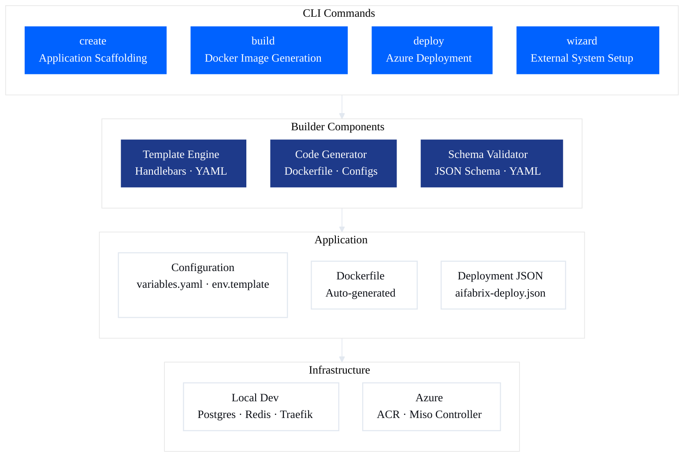
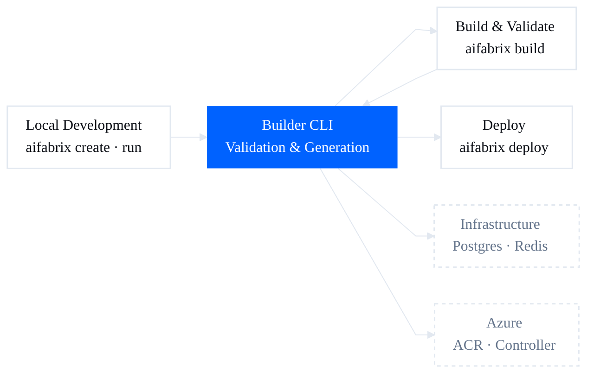
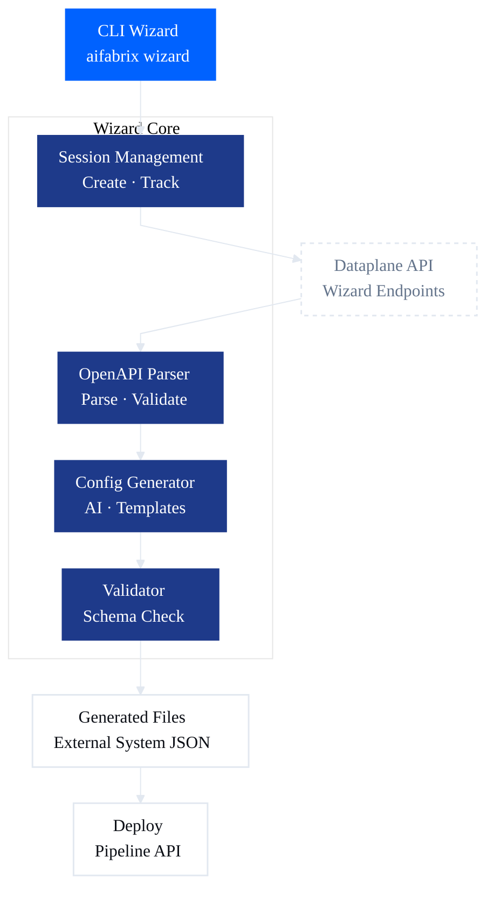

```mermaid
%%{init: {
  "theme": "base",
  "themeVariables": {
    "fontFamily": "Poppins, Arial Rounded MT Bold, Arial, sans-serif",
    "fontSize": "16px",
    "background": "#FFFFFF",
    "primaryColor": "#F8FAFC",
    "primaryTextColor": "#0B0E15",
    "primaryBorderColor": "#E2E8F0",
    "lineColor": "#E2E8F0",
    "textColor": "#0B0E15",
    "borderRadius": 16
  },
  "flowchart": {
    "curve": "linear",
    "nodeSpacing": 34,
    "rankSpacing": 34,
    "padding": 10
  }
}}%%

flowchart LR

%% =======================
%% Styles
%% =======================
classDef base fill:#FFFFFF,color:#0B0E15,stroke:#E2E8F0,stroke-width:1.5px;
classDef medium fill:#1E3A8A,color:#ffffff,stroke-width:0px;
classDef primary fill:#0062FF,color:#ffffff,stroke-width:0px;
classDef note fill:#FFFFFF,color:#64748B,stroke:#E2E8F0,stroke-width:1.5px,stroke-dasharray:4 4;

%% =======================
%% User Input
%% =======================
Input["User Input<br/>CLI Command · Prompts"]:::base

%% =======================
%% Builder
%% =======================
subgraph Builder["Builder"]
  direction TB
  Template["Template Engine<br/>Handlebars Processing"]:::medium
  Generate["Code Generator<br/>Files · Configs"]:::medium
  Validate["Schema Validator<br/>JSON Schema Check"]:::medium
end

%% =======================
%% Contracts
%% =======================
Schema["JSON Schema<br/>Validation Contract"]:::note
TemplateFile["Template Files<br/>.hbs Templates"]:::note

%% =======================
%% Output
%% =======================
Output["Application Files<br/>variables.yaml · Dockerfile"]:::base
Deploy["Deployment<br/>Local or Azure"]:::base

%% =======================
%% Flow
%% =======================
Input --> TemplateFile --> Template
Template --> Generate --> Validate
Validate --> Schema --> Output
Output --> Deploy
```

# Flows and Visuals

## Overview

This document provides canonical Mermaid diagram templates for visualizing AI Fabrix Builder CLI workflows and architecture. These templates follow strict styling guidelines and can be used directly in documentation, presentations, and architectural diagrams. Each template is self-contained with complete Mermaid code and theme configuration.

## Mermaid Styling Guidelines

All canonical templates use a consistent theme configuration aligned with AI Fabrix design system:

- **Font**: Poppins, Arial Rounded MT Bold, Arial, sans-serif
- **Font Size**: 16px
- **Background**: #FFFFFF
- **Primary Color**: #0062FF (used for primary nodes - CLI commands, important components)
- **Medium Color**: #1E3A8A (used for Builder components - templates, generators)
- **Base Color**: #FFFFFF (used for base nodes - applications, infrastructure, external systems)
- **Text Colors**: 
  - Primary text: #0B0E15
  - Note text: #64748B
- **Border Colors**: #E2E8F0 (light gray borders)
- **Border Radius**: 16px (rounded corners for all nodes)
- **Curve Style**: Linear (straight edges)
- **Node Spacing**: 34px (Template 1 & 2), 40px (Template 3)
- **Rank Spacing**: 34px (Template 1 & 2), 40px (Template 3)

The theme is configured using Mermaid's `%%{init: {...}}%%` directive at the start of each diagram. All templates use three styling classes:

- `base`: White fill (#FFFFFF), dark text (#0B0E15), light border (#E2E8F0)
- `medium`: Medium blue fill (#1E3A8A), white text, no border
- `primary`: Primary blue fill (#0062FF), white text, no border
- `note`: White fill, gray text (#64748B), dashed border (for contract/note nodes)

## Canonical Diagram Templates

### Template 1: CLI → Builder → Application → Infrastructure → Deployment

**(Core Builder Architecture Template)**

**Purpose**:
* Explain responsibility boundaries
* Make CLI vs Builder components separation explicit
* Show allowed execution paths only

**Complete Mermaid Code**:

**Explanation**:
- Shows four architectural layers as subgraphs with specific components
- CLI Layer includes create, build, deploy, and wizard commands
- Builder Components include Template Engine, Code Generator, and Schema Validator
- Application includes Configuration files, Dockerfile, and Deployment JSON
- Demonstrates allowed execution path: CLI → Builder → Application → Infrastructure
- Uses three styling classes: base (white), medium (#1E3A8A), and primary (#0062FF)

### Template 2: Application Creation Flow

**(Create → Generate → Validate → Deploy)**

**Purpose**:
* Explain how Builder creates applications from templates
* Make template vs generated code boundaries explicit
* Show validation and deployment flow

**Complete Mermaid Code**:

**Explanation**:
- Left-to-right flow showing application creation path
- Shows User Input → Template Files → Template Engine
- Demonstrates Template → Generate → Validate flow within Builder
- Shows Validate → Schema Contract → Output path
- Contract nodes use note styling (white fill, dashed border) to distinguish template/schema boundaries

### Template 3: Local Dev → Build → Deploy Lifecycle

**(Development Workflow Template)**

**Purpose**:
* Show local development workflow
* Emphasize build-as-validation
* Make deployment paths explicit

**Complete Mermaid Code**:

**Explanation**:
- Left-to-right flow showing development lifecycle progression
- Demonstrates Local → Builder → Build → Builder → Deploy progression
- Shows Builder as the central authority for validation and generation
- Infrastructure and Azure nodes (note style) show deployment targets
- Emphasizes Builder authority and validation-as-gate approach

### Template 4: Wizard Flow

**(External System Integration Template)**

**Purpose**:
* Show wizard workflow for external systems
* Make API vs CLI boundaries explicit
* Show validation and file generation flow

**Complete Mermaid Code**:

**Explanation**:
- Top-to-bottom flow showing wizard workflow
- Shows CLI → Session → Dataplane API path
- Demonstrates API → Parse → Generate → Validate flow within Wizard Core
- Shows Validate → Generated Files → Deploy path
- API node uses note styling to distinguish external API boundary

## How These Templates Are Used

These templates are **drop-in templates** intended for reuse across knowledgebase articles. They follow strict styling guidelines and align with the **official AI Fabrix Builder architecture**.

**Template Usage by Section**:
* **Architecture section** → Template 1 (CLI → Builder → Application → Infrastructure)
* **Application creation** → Template 2 (Application Creation Flow)
* **Development workflow** → Template 3 (Local Dev → Build → Deploy Lifecycle)
* **External systems** → Template 4 (Wizard Flow)

The templates are intentionally **minimal and strict** so authors focus on:
* Boundaries
* Authority
* Flow correctness

## Usage Guidelines

### When to Use Each Template

**Template 1: CLI → Builder → Application → Infrastructure**
- Use when explaining overall Builder architecture
- Use for onboarding documentation
- Use when showing command flow through layers
- Use when documenting responsibility boundaries

**Template 2: Application Creation Flow**
- Use when explaining how `aifabrix create` works
- Use when documenting template generation
- Use when showing template vs generated code boundaries
- Use when explaining validation flow

**Template 3: Local Dev → Build → Deploy Lifecycle**
- Use when documenting development workflows
- Use when explaining local development process
- Use when showing CI/CD workflows
- Use when documenting deployment pipelines

**Template 4: Wizard Flow**
- Use when documenting external system wizard
- Use when explaining wizard API integration
- Use when showing external system creation process
- Use when documenting OpenAPI parsing workflow

### Customization Guidelines

1. **Maintain Theme Consistency**: Always use the same theme configuration across all diagrams
2. **Preserve Color Scheme**: Keep primary (#0062FF) and medium (#1E3A8A) colors consistent
3. **Node Styling**: Use the same class definitions for similar node types
4. **Edge Types**: Use solid lines for execution flows, dashed lines for contracts/feedback
5. **Direction**: Use TB (top-bottom) for hierarchical flows, LR (left-right) for sequential flows

## Best Practices

### Diagram Creation

1. **Start with Template**: Always start from a canonical template rather than creating from scratch
2. **Consistent Naming**: Use consistent node and edge labels across related diagrams
3. **Clear Labels**: Ensure all nodes and edges have clear, descriptive labels
4. **Logical Flow**: Arrange nodes to show logical flow from left-to-right or top-to-bottom
5. **Group Related Elements**: Use subgraphs to group related components

### Documentation Integration

1. **Context First**: Always provide context before showing a diagram
2. **Explain Purpose**: Clearly state what the diagram illustrates
3. **Reference Components**: Reference specific components mentioned in the diagram
4. **Update Together**: Keep diagrams synchronized with code changes
5. **Version Control**: Include diagrams in version control for tracking changes

### Maintenance

1. **Regular Review**: Review diagrams during architecture reviews
2. **Update on Changes**: Update diagrams when architecture changes
3. **Validate Accuracy**: Ensure diagrams accurately represent current implementation
4. **Remove Obsolete**: Remove or archive outdated diagrams
5. **Document Assumptions**: Document any simplifications or assumptions made in diagrams

### Accessibility

1. **Alt Text**: Provide alternative text descriptions for diagrams
2. **Color Contrast**: Ensure sufficient color contrast for readability
3. **Text Size**: Use readable font sizes (minimum 14px)
4. **Clear Labels**: Avoid abbreviations that may not be universally understood
5. **Multiple Formats**: Consider providing diagrams in multiple formats if needed
