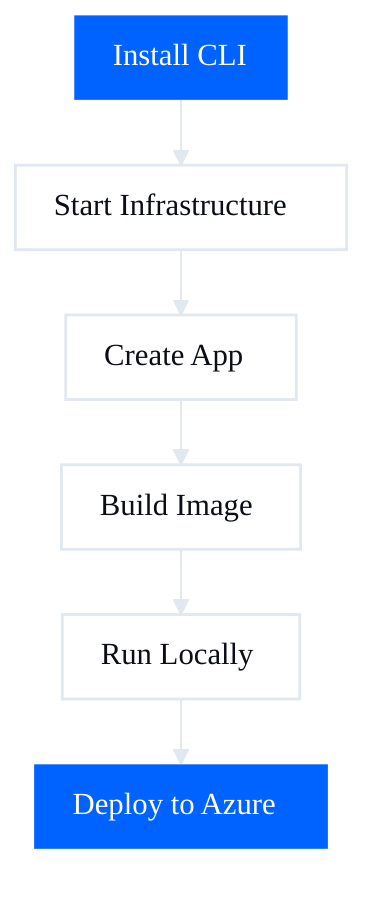

# AI Fabrix - Builder SDK

[](https://www.npmjs.com/package/@aifabrix/builder)
[](https://opensource.org/licenses/MIT)

Local development infrastructure + Azure deployment tool.

## Install

```bash
npm install -g @aifabrix/builder
```

## Quick Start

```bash
aifabrix up              # Start Postgres + Redis
aifabrix create myapp    # Create your app
aifabrix build myapp     # Build Docker image
aifabrix run myapp       # Run locally
# Stop the app (optionally remove its data volume)
aifabrix down myapp
# aifabrix down myapp --volumes
```

→ [Full Guide](docs/quick-start.md) | [CLI Commands](docs/cli-reference.md)

## What You Get

- **Local Postgres + Redis infrastructure** - Runs in Docker
- **Auto-generated Dockerfiles** - TypeScript and Python templates
- **Environment variable management** - Secret resolution with kv:// references
- **Azure deployment pipeline** - Push to ACR and deploy via controller

## Optional Platform Apps

Want authentication or deployment controller?

**Quick install from images (no build):**
```bash
aifabrix up              # Start Postgres + Redis first
aifabrix up-miso         # Install Keycloak + Miso Controller from images (auto-generated secrets for testing)
```

**Or create and build from templates:**
```bash
# Keycloak for authentication
aifabrix create keycloak --port 8082 --database --template keycloak
aifabrix build keycloak
aifabrix run keycloak

# Miso Controller for Azure deployments
aifabrix create miso-controller --port 3000 --database --redis --template miso-controller
aifabrix build miso-controller
aifabrix run miso-controller
```

**Dataplane in dev (after login):**
```bash
aifabrix login --environment dev
aifabrix up-dataplane    # Register or rotate, run, and deploy dataplane in dev
```

→ [Infrastructure Guide](docs/infrastructure.md)

## Documentation

- [Quick Start](docs/quick-start.md) - Get running in 5 minutes
- [Infrastructure](docs/infrastructure.md) - What runs and why
- [Configuration](docs/configuration.md) - Config file reference
- [Building](docs/building.md) - Build process explained
- [Running](docs/running.md) - Run apps locally
- [Deploying](docs/deploying.md) - Deploy to Azure
- [CLI Reference](docs/cli-reference.md) - All commands

## How It Works

1. **Infrastructure** - Minimal baseline (Postgres + Redis)
2. **Create** - Generate config files for your app
3. **Build** - Auto-detect runtime and build Docker image
4. **Run** - Start locally, connected to infrastructure
5. **Deploy** - Push to ACR and deploy via controller



## Development

- **Tests**: `npm test` (runs via wrapper; handles known Jest/Node exit issues).
- **Coverage**: `npm run test:coverage` — runs tests with coverage through the same wrapper. May take 3–5 minutes for the full suite. If the process exits with a signal after "Ran all test suites", the wrapper treats it as success and coverage is written to `coverage/`. Use `test:coverage:nyc` only if you need nyc-specific reporters.

## Requirements

- **Docker Desktop** - For running containers
- **Node.js 18+** - For running the CLI
- **Azure CLI** - For deploying to Azure (optional)

## License

© eSystems Nordic Ltd 2025 - All Rights Reserved

`@aifabrix/builder` is part of the AI Fabrix platform.
