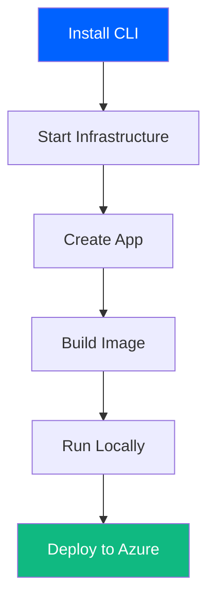

# AI Fabrix - Builder SDK

[](https://www.npmjs.com/package/@aifabrix/builder)
[](https://opensource.org/licenses/MIT)

Local development infrastructure + Azure deployment tool.

## Install

```bash
npm install -g @aifabrix/builder
```

## Quick Start

```bash
aifabrix up              # Start Postgres + Redis
aifabrix create myapp    # Create your app
aifabrix build myapp     # Build Docker image
aifabrix run myapp       # Run locally
# Stop the app (optionally remove its data volume)
aifabrix down myapp
# aifabrix down myapp --volumes
```

→ [Full Guide](docs/QUICK-START.md) | [CLI Commands](docs/CLI-REFERENCE.md)

## What You Get

- **Local Postgres + Redis infrastructure** - Runs in Docker
- **Auto-generated Dockerfiles** - TypeScript and Python templates
- **Environment variable management** - Secret resolution with kv:// references
- **Azure deployment pipeline** - Push to ACR and deploy via controller

## Optional Platform Apps

Want authentication or deployment controller?

```bash
# Keycloak for authentication
aifabrix create keycloak --port 8082 --database --template keycloak
aifabrix build keycloak
aifabrix run keycloak

# Miso Controller for Azure deployments
aifabrix create miso-controller --port 3000 --database --redis --template miso-controller
aifabrix build miso-controller
aifabrix run miso-controller
```

→ [Infrastructure Guide](docs/INFRASTRUCTURE.md)

## Documentation

- [Quick Start](docs/QUICK-START.md) - Get running in 5 minutes
- [Infrastructure](docs/INFRASTRUCTURE.md) - What runs and why
- [Configuration](docs/CONFIGURATION.md) - Config file reference
- [Building](docs/BUILDING.md) - Build process explained
- [Running](docs/RUNNING.md) - Run apps locally
- [Deploying](docs/DEPLOYING.md) - Deploy to Azure
- [CLI Reference](docs/CLI-REFERENCE.md) - All commands

## How It Works

1. **Infrastructure** - Minimal baseline (Postgres + Redis)
2. **Create** - Generate config files for your app
3. **Build** - Auto-detect runtime and build Docker image
4. **Run** - Start locally, connected to infrastructure
5. **Deploy** - Push to ACR and deploy via controller



## Requirements

- **Docker Desktop** - For running containers
- **Node.js 18+** - For running the CLI
- **Azure CLI** - For deploying to Azure (optional)

## License

© eSystems Nordic Ltd 2025 - All Rights Reserved

`@aifabrix/builder` is part of the AI Fabrix platform.
