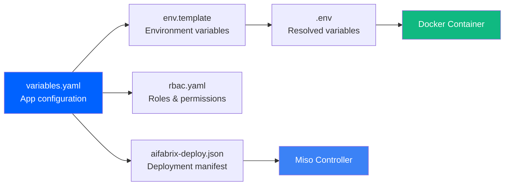
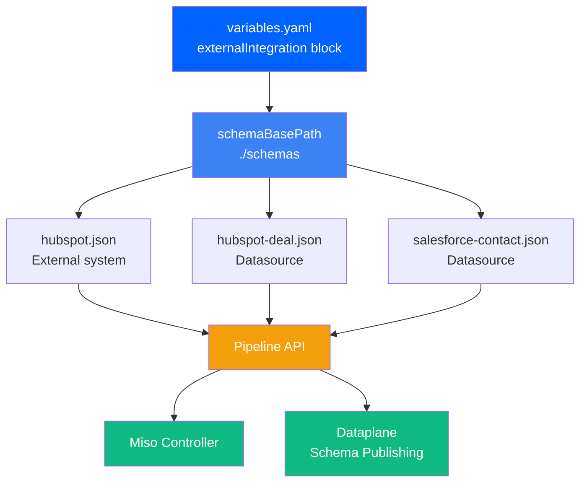
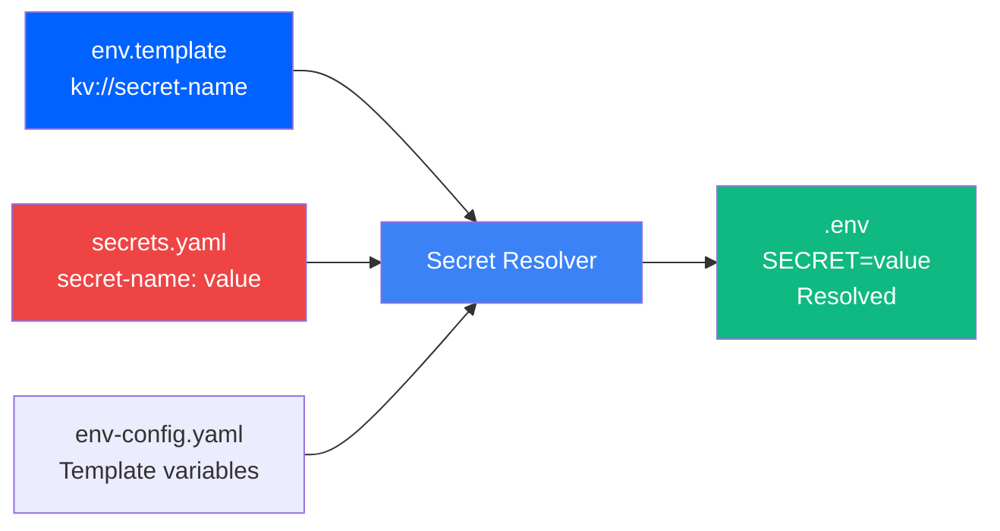

# Configuration Reference

← [Back to Quick Start](QUICK-START.md)

Simple reference for all configuration files.

## variables.yaml

Generated by `aifabrix create`. Defines your application.



### Required Fields

**app.key**  
Unique identifier (lowercase, dashes only)  
Example: `myapp`, `my-api`, `data-processor`

**app.displayName**  
Human-readable name shown in UIs  
Example: `"My Application"`, `"Data Processor API"`

**app.description**  
What your app does  
Example: `"Processes customer data and generates reports"`

**app.type**  
Application type for Azure  
Options: `webapp`, `api`, `service`, `functionapp`, `external`  
*Note: `external` type is for external-only applications (no container image). When using `external` type, `externalIntegration` is required and `port`, `image`, `registryMode` are not required.*

**port**  
Container internal port  
Example: `3000`, `8080`, `5000`  
*Required for all types except `external`. For `external` type applications, this field is not required.*

**image.name**  
Docker image name (without tag)  
Example: `myapp`, `my-company/myapp`  
*Note: Combined with `image.registry` and `image.tag` to form full image reference. Required for all types except `external`.*

**image.registry**  
Container registry URL  
Example: `myacr.azurecr.io`, `docker.io`  
*Required for all types except `external`. Combined with `image.name` and `image.tag` to form full image reference.*

**image.registryMode**  
Registry type  
Options: `acr`, `external`, `public`  
*Required for all types except `external`. Determines how Azure authenticates to the container registry.*

**build.language**  
Runtime language  
Options: `typescript`, `python`

### Optional Fields

**build.localPort**  
Port for local development (if different from container port)  
Example: `3001`

**build.containerPort**  
Container internal port (if different from main port)  
Example: `8080`  
*Defaults to `port` if not specified*

**build.dockerfile**  
Custom Dockerfile path  
Example: `Dockerfile`, `custom/Dockerfile.prod`  
*Leave empty to auto-generate*

**build.context**  
Docker build context  
Default: `.` (current directory)

**build.envOutputPath**  
Path where a **local development** `.env` file is generated (separate from the docker `.env` file)  
Example: `../../apps/myapp/.env`, `../src/.env`  
**Note:** This generates a NEW `.env` file with local values (localhost hosts, `build.localPort`), not a copy of the docker `.env` file. If not set, only the docker `.env` file is generated at `builder/myapp/.env`.

**requires.database**  
Set `true` if you need database  
Generates database config in env.template  
*Note: If `requires.database` is `true`, then `requires.databases` array is required*

**requires.databases**  
List of database names  
Example:
```yaml
databases:
  - name: myapp
  - name: myapp-analytics
```
*Required when `requires.database: true`. Database names must match pattern `^[a-z0-9_-]+$` (lowercase, numbers, underscores, hyphens)*

**requires.redis**  
Set `true` if you need Redis  
Generates Redis config in env.template

**requires.storage**  
Set `true` if you need file storage  
Mounts `/mnt/data` in container

**healthCheck**  
Health check configuration for application monitoring.  
*Optional - if not specified, defaults to `/health` with 30 second interval*

**healthCheck.path**  
Health check endpoint path (must start with `/`)  
Example: `/health`, `/api/health`

**healthCheck.interval**  
Health check interval in seconds  
Example: `30`, `60`  
*Minimum: 10, Maximum: 300*

**healthCheck.probePath**  
Front Door health probe path (defaults to `path` if not specified)  
Example: `/api/health`  
*Optional - used for Azure Front Door health probes*

**healthCheck.probeRequestType**  
HTTP method for Front Door probe  
Options: `GET`, `POST`, `HEAD`, `PUT`, `DELETE`  
*Optional - defaults to `GET`*

**healthCheck.probeProtocol**  
Protocol for Front Door probe  
Options: `Http`, `Https`  
*Optional - defaults to `Http`*

**healthCheck.probeIntervalInSeconds**  
Front Door probe interval in seconds  
Example: `120`  
*Optional - Minimum: 60, Maximum: 600, Default: 120*

**authentication**  
Authentication configuration for SSO and access control.  
*Optional - if not specified, no authentication is required*

**authentication.type**  
Authentication type  
Options: `azure`, `local`, `none`  
*Note: `keycloak` is automatically mapped to `azure` during transformation*

**authentication.enableSSO**  
Whether to enable SSO authentication  
Example: `true`, `false`  
*Required if authentication block is present*

**authentication.requiredRoles**  
Required roles for access (required when `enableSSO: true`)  
Example: `["user"]`, `["admin", "editor"]`  
*Required when `enableSSO: true`, optional otherwise*

**authentication.endpoints.local**  
Local authentication endpoint URL  
Example: `http://localhost:8080/auth`  
*Optional - for local development*

**authentication.endpoints.custom**  
Custom authentication endpoint URL  
Example: `https://auth.example.com`  
*Optional - for custom authentication providers*

**roles**  
Application roles for Azure AD group mapping.  
*Optional - can also be defined in rbac.yaml*

**roles[].name**  
Human-readable role name  
Example: `"Platform Administrator"`, `"Content Editor"`

**roles[].value**  
Role identifier (used in JWT and ACL)  
Example: `platform-admin`, `content-editor`  
*Pattern: lowercase, dashes only (`^[a-z-]+$`)*

**roles[].description**  
Role description  
Example: `"Full administrative access to the platform"`

**roles[].Groups**  
Azure AD groups mapped to this role  
Example: `["admin-group-id", "super-admin-group-id"]`  
*Optional - array of Azure AD group identifiers*

**permissions**  
Application permissions with role mappings for access control.  
*Optional - can also be defined in rbac.yaml*

**permissions[].name**  
Permission identifier  
Example: `documents:read`, `flowise:dev:access`  
*Pattern: lowercase, numbers, dashes, colons (`^[a-z0-9-:]+$`)*

**permissions[].roles**  
Roles that have this permission  
Example: `["user", "admin"]`  
*Required - array of role values (must match roles[].value)*

**permissions[].description**  
Permission description  
Example: `"Read access to documents"`

**repository**  
Repository deployment configuration for CI/CD integration.  
*Optional - enables automated deployments from Git repositories*

**repository.enabled**  
Whether repository deployment is enabled  
Example: `true`, `false`  
*Required if repository block is present*

**repository.repositoryUrl**  
Full repository URL for pipeline validation  
Example: `https://github.com/user/repo`, `https://dev.azure.com/org/project/repo`  
*Optional - must match OAuth callback URL pattern*

**startupCommand**  
Application startup command  
Example: `pnpm start`, `python app.py`, `node server.js`  
*Optional - if not specified, uses default for runtime language*

**runtimeVersion**  
Runtime version configuration.  
*Optional - if not specified, uses default versions*

**runtimeVersion.node**  
Node.js version  
Example: `18.17.0`, `20.10.0`  
*Pattern: `^[0-9]+\.[0-9]+\.[0-9]+$`*

**runtimeVersion.python**  
Python version  
Example: `3.11`, `3.12`  
*Pattern: `^[0-9]+\.[0-9]+$`*

**runtimeVersion.dotnet**  
.NET version  
Example: `8.0`, `9.0`  
*Pattern: `^[0-9]+\.[0-9]+$`*

**scaling**  
Application scaling configuration for auto-scaling.  
*Optional - if not specified, uses default scaling settings*

**scaling.minInstances**  
Minimum number of instances  
Example: `1`, `2`  
*Minimum: 1, Maximum: 20*

**scaling.maxInstances**  
Maximum number of instances  
Example: `5`, `10`  
*Minimum: 1, Maximum: 20*

**scaling.cpuThreshold**  
CPU threshold for scaling (percentage)  
Example: `70`, `80`  
*Minimum: 10, Maximum: 90*

**frontDoorRouting**  
Front Door routing configuration for URL rewriting.  
*Optional - only needed for applications requiring custom routing rules*

**frontDoorRouting.pattern**  
URL pattern for routing  
Example: `/app/*`, `/api/v1/*`  
*Pattern: must start with `/` (`^/.+$`)*

**frontDoorRouting.requiresRuleSet**  
Whether URL rewriting rule set is required  
Example: `true`, `false`

**frontDoorRouting.ruleSetConditions**  
Rule set conditions for URL rewriting  
*Optional - array of condition objects*

**frontDoorRouting.ruleSetConditions[].type**  
Condition type  
Example: `UrlPath`

**frontDoorRouting.ruleSetConditions[].operator**  
Condition operator  
Example: `BeginsWith`

**frontDoorRouting.ruleSetConditions[].matchValues**  
Match values for condition  
Example: `["/app"]`

**deployment.controllerUrl**  
Controller API URL for pipeline deployments  
Example: `https://controller.aifabrix.ai`  
*Optional - enables automated deployment*

**deployment.environment**  
Target environment for deployment  
Example: `miso`, `dev`, `tst`, `pro`  
*Optional - uses root-level environment from config.yaml if not specified*

**Note:** Client credentials are no longer stored in variables.yaml. They are read from `~/.aifabrix/secrets.local.yaml` using pattern `<app-name>-client-idKeyVault` and `<app-name>-client-secretKeyVault`. Tokens are automatically retrieved or refreshed during deployment.

**Note:** The `deploymentKey` field is automatically generated during deployment and should not be manually set in variables.yaml. It is a SHA256 hash of the deployment manifest (excluding the deploymentKey field itself) and is used for change detection and validation.

**externalIntegration**  
Defines external systems and data sources shipped with this application. Pipeline registers these in Miso Controller and publishes schemas to Dataplane.  
*Optional - only needed for applications with external integrations*

**externalIntegration.schemaBasePath**  
Base folder path containing external-system.json and external-datasource.json files.  
Example: `./schemas`, `/absolute/path/to/schemas`  
*Required if externalIntegration block is present*  
*Supports both absolute and relative paths (relative to variables.yaml location)*

**externalIntegration.systems**  
List of external-system JSON files to deploy via pipeline.  
Example:
```yaml
systems:
  - hubspot.json
  - salesforce.json
```
Optional - array of file names (must end with .json)

**externalIntegration.dataSources**  
List of external-datasource JSON files belonging to this app.  
Example:
```yaml
dataSources:
  - hubspot-deal.json
  - salesforce-contact.json
```
Optional - array of file names (must end with .json)

**externalIntegration.autopublish**  
If true, pipeline automatically publishes ExternalSystems + ExternalDataSources to Dataplane after deployment.  
Example: `true`, `false`  
*Optional - defaults to `true`*

**externalIntegration.version**  
Version of the integration set (used for schema diffing & migrations).  
Example: `1.0.0`, `2.1.3`  
*Optional - must match pattern `^[0-9]+\.[0-9]+\.[0-9]+$`*

**Path Resolution:**
- **Relative paths** are resolved relative to the `variables.yaml` file location
- **Absolute paths** are used as-is
- All referenced files must exist at resolved paths
- File paths in `systems` and `dataSources` arrays are resolved relative to `schemaBasePath`

**Example externalIntegration block:**
```yaml
externalIntegration:
  schemaBasePath: ./schemas
  systems:
    - hubspot.json
    - salesforce.json
  dataSources:
    - hubspot-deal.json
    - salesforce-contact.json
  autopublish: true
  version: 1.0.0
```

**File Structure:**
```yaml
builder/
  myapp/
    variables.yaml          # Contains externalIntegration block
    schemas/                # schemaBasePath
      hubspot.json          # External system
      salesforce.json       # External system
      hubspot-deal.json     # External datasource
      salesforce-contact.json # External datasource
```

**Validation:**
- `aifabrix validate myapp` validates both application configuration and all external integration files
- External system files are validated against `external-system.schema.json`
- External datasource files are validated against `external-datasource.schema.json`
- All files must exist and be valid JSON

**Related Commands:**
- `aifabrix validate <app>` - Validates application and external integration files
- `aifabrix datasource validate <file>` - Validates individual datasource file
- `aifabrix datasource list` - Lists deployed datasources
- `aifabrix datasource diff <file1> <file2>` - Compares datasource versions



### Full Example

```yaml
app:
  key: myapp
  displayName: "My Application"
  description: "Does amazing things"
  type: webapp

image:
  name: myapp
  registry: myacr.azurecr.io
  registryMode: acr

port: 3000

requires:
  database: true
  databases:
    - name: myapp
    - name: myapp-logs
  redis: true
  storage: false

build:
  language: typescript
  localPort: 3001
  dockerfile: ""  # Auto-generate
  context: .
  envOutputPath: ../.env

healthCheck:
  path: /health
  interval: 30
  # Optional Front Door probe configuration:
  # probePath: /health
  # probeRequestType: GET
  # probeProtocol: Http
  # probeIntervalInSeconds: 120

authentication:
  type: azure  # Options: azure, local, none (keycloak is mapped to azure)
  enableSSO: true
  requiredRoles: ["user"]

externalIntegration:
  schemaBasePath: ./schemas
  systems:
    - hubspot.json
  dataSources:
    - hubspot-deal.json
  autopublish: true
  version: 1.0.0
```

**Health Check Response Formats:**

The health check endpoint must return HTTP 200 status code and a JSON response with one of the following formats:

1. **Keycloak Format:**
   ```json
   {"status": "UP", "checks": []}
   ```
   Validation: `status === "UP"`

2. **Standard Format:**
   ```json
   {"status": "ok", "database": "connected"}
   ```
   Validation: `status === "ok" && (database === "connected" || !database)`

3. **Alternative Format:**
   ```json
   {"status": "healthy", "service": "dataplane"}
   ```
   Validation: `status === "healthy"`

4. **Success-based Format:**
   ```json
   {"success": true, "message": "Service is running"}
   ```
   Validation: `success === true`

5. **Non-JSON Format:**
   ```yaml
   OK
   ```
   Validation: HTTP status code === 200 (any non-JSON response with 200 status is considered healthy)

**Note:** For non-JSON responses, only the HTTP status code is checked. A 200 status code indicates a healthy service.

---

## env.template

Environment variables template. SDK generates `.env` from this + secrets.

### Standard Variables (Auto-added)

If `requires.database: true`:
```bash
DATABASE_URL=kv://databases-0-urlKeyVault
DATABASE_HOST=localhost
DATABASE_PORT=5432
DATABASE_USER=pgadmin
DATABASE_PASSWORD=kv://postgres-passwordKeyVault
DATABASE_NAME=myapp
```

If `requires.redis: true`:
```bash
REDIS_URL=redis://localhost:6379
REDIS_PASSWORD=
```

### Language-Specific Variables (Auto-added)

Variables are automatically added based on the application language (`build.language` in `variables.yaml`):

**For TypeScript/Node.js apps:**
```bash
NODE_ENV=${NODE_ENV}
```

The `${NODE_ENV}` value is resolved from `env-config.yaml`:
- Docker context: `NODE_ENV=production`
- Local context: `NODE_ENV=development`

**For Python apps:**
```bash
PYTHONUNBUFFERED=${PYTHONUNBUFFERED}
PYTHONDONTWRITEBYTECODE=${PYTHONDONTWRITEBYTECODE}
PYTHONIOENCODING=${PYTHONIOENCODING}
```

These values are resolved from `env-config.yaml` (same values for both docker and local contexts):
- `PYTHONUNBUFFERED=1` - Ensures Python output is unbuffered (important for Docker logs)
- `PYTHONDONTWRITEBYTECODE=1` - Prevents `.pyc` files from being written
- `PYTHONIOENCODING=utf-8` - Ensures UTF-8 encoding

**Note:** You can override these values in your custom `env-config.yaml` file (set `aifabrix-env-config` in `config.yaml`).

### Application Environment Variables (Auto-added)

The following variables are automatically added to all applications:

```bash
ALLOWED_ORIGINS=http://localhost:*,
WEB_SERVER_URL=http://localhost:${PORT},
```

- `ALLOWED_ORIGINS` - My application public address (trailing comma allows easy addition of more origins)
- `WEB_SERVER_URL` - Miso public address (uses `${PORT}` template variable to reference the application's PORT)

### MISO Controller Variables (Auto-added when controller enabled)

If `requires.controller: true` or controller URL is configured, the following variables are automatically added:

```bash
MISO_CONTROLLER_URL=http://${MISO_HOST}:${MISO_PORT}
MISO_ENVIRONMENT=dev
MISO_CLIENTID=kv://miso-controller-client-idKeyVault
MISO_CLIENTSECRET=kv://miso-controller-client-secretKeyVault
MISO_WEB_SERVER_URL=kv://miso-controller-web-server-url
```

- `MISO_CONTROLLER_URL` - Controller API URL (uses template format for environment-specific resolution)
- `MISO_ENVIRONMENT` - Target environment (`miso`, `dev`, `tst`, or `pro`)
- `MISO_CLIENTID` - Client ID for pipeline API (kv:// reference)
- `MISO_CLIENTSECRET` - Client secret for pipeline API (kv:// reference)
- `MISO_WEB_SERVER_URL` - Miso web server URL (kv:// reference)

**Note:** `MISO_CONTROLLER_URL` uses `${MISO_HOST}` and `${MISO_PORT}` template variables which are resolved from `env-config.yaml` based on deployment context (docker/local).

### Your Variables

Add whatever your app needs (note: `NODE_ENV`, `PORT`, `APP_NAME`, and `LOG_LEVEL` are automatically added):

```bash
# These are auto-added, but you can override them:
# NODE_ENV=${NODE_ENV}  # Auto-added for TypeScript apps
# PORT=3000              # Auto-added
# APP_NAME=myapp         # Auto-added
# LOG_LEVEL=info          # Auto-added

# Your custom variables:
LOG_LEVEL=debug  # Override default 'info'

# API Keys (use kv:// for secrets)
API_KEY=kv://my-api-keyKeyVault
OPENAI_API_KEY=kv://openai-keyKeyVault

# Feature Flags
ENABLE_ANALYTICS=true
ENABLE_CACHE=true

# External Services
PAYMENT_API_URL=https://api.payment.com
SMTP_HOST=smtp.gmail.com
SMTP_PORT=587
```

### kv:// References

`kv://name` means "get value from secrets file"

**Secrets file location:**
- Default: `<home>/secrets.yaml`
  - `<home>` is resolved from `config.yaml` key `aifabrix-home` (defaults to `~/.aifabrix`)
- Override: set `aifabrix-secrets` in `config.yaml` to specify a default secrets file path

**Example secrets.yaml:**
```yaml
my-api-keyKeyVault: "sk-1234567890abcdef"
openai-keyKeyVault: "sk-proj-xyz..."
postgres-passwordKeyVault: "admin123"
```

**Encrypted secrets:**
Secrets can be encrypted using `aifabrix secure` command. Encrypted values use `secure://` prefix and are automatically decrypted when loaded. See [Secrets Encryption](#secrets-encryption) section below.

**Resolution:**
```bash
# Before (env.template)
API_KEY=kv://my-api-keyKeyVault

# After (.env generated)
API_KEY=sk-1234567890abcdef
```

**Note:** Encrypted secrets (with `secure://` prefix) are automatically decrypted during resolution. The encryption key is retrieved from `~/.aifabrix/config.yaml`.



### Existing .env Files

Have an existing `.env`?

`aifabrix create` reads it and converts to template:
- Regular values stay as-is
- Sensitive values (passwords, keys) → `kv://` references

### Secrets Encryption

For ISO 27001 compliance, secrets can be encrypted at rest using the `aifabrix secure` command. Encrypted secrets use the `secure://` prefix format and are automatically decrypted when loaded.

**Encryption Format:**
Encrypted values use the format: `secure://<iv>:<ciphertext>:<authTag>`
- All components are base64 encoded
- Uses AES-256-GCM encryption algorithm
- IV (Initialization Vector): 96 bits, randomly generated per encryption
- Ciphertext: Encrypted secret value
- Auth Tag: 128-bit authentication tag for integrity verification

**Example:**
```yaml
# Before encryption (secrets.local.yaml)
# API Configuration
my-api-keyKeyVault: "sk-1234567890abcdef"
database-passwordKeyVault: "admin123"

# Service URLs (not encrypted)
api-url: "https://api.example.com"

# After encryption with aifabrix secure (comments preserved)
# API Configuration
my-api-keyKeyVault: "secure://xK9mP2qR5tW8vY1z:AbCdEfGhIjKlMnOpQrStUvWxYz1234567890abcdef:ZxYwVuTsRqPoNmLkJiHgFeDcBa9876543210"
database-passwordKeyVault: "secure://yL0nQ3rS6uX9wZ2a:BcDeFgHiJkLmNoPqRsTuVwXyZa2345678901bcdefg:YwXvUtSrQpOnMlKjIhGfEdCbA8765432109"

# Service URLs (not encrypted - URLs are not secrets)
api-url: "https://api.example.com"
```

**Note:** The `aifabrix secure` command preserves all comments, blank lines, and formatting. URLs (starting with `http://` or `https://`) are automatically skipped as they are not secrets.

**Encrypting Secrets:**
```bash
# Encrypt all secrets (interactive - prompts for encryption key)
aifabrix secure

# Encrypt with provided key (hex format, 64 characters)
aifabrix secure --secrets-encryption "a1b2c3d4e5f6789abcdef1234567890abcdef1234567890abcdef1234567890ab"

# Encrypt with base64 key (44 characters)
aifabrix secure --secrets-encryption "YWJjZGVmZ2hpams="
```

**Encryption Key:**
- **Format**: 32 bytes (256 bits)
  - Hex: 64 hexadecimal characters
  - Base64: 44 base64 characters
- **Storage**: Saved to `~/.aifabrix/config.yaml` as `secrets-encryption-key`
- **Usage**: Automatically retrieved for decryption when loading secrets
- **Security**: Store encryption key securely (e.g., password manager, secure vault)

**What Gets Encrypted:**
- User secrets: `~/.aifabrix/secrets.local.yaml`
- General secrets: File specified in `aifabrix-secrets` in `config.yaml` (if configured)

**Automatic Decryption:**
Encrypted secrets are automatically decrypted when:
- Running `aifabrix resolve` to generate `.env` files
- Building Docker images with `aifabrix build`
- Deploying applications with `aifabrix deploy`
- Any command that loads secrets

The encryption key is automatically retrieved from `~/.aifabrix/config.yaml`. No manual decryption is required.

**Security Best Practices:**
- **Encrypt before committing**: Encrypt secrets before committing to version control
- **Key management**: Store encryption key securely (password manager, secure vault)
- **Key rotation**: Re-run `aifabrix secure` with a new key to rotate encryption
- **File permissions**: Encrypted files are automatically set to 0o600 (owner read/write only)
- **Backup encryption key**: Ensure encryption key is backed up securely - losing it means losing access to encrypted secrets

**Backward Compatibility:**
Plaintext secrets continue to work if no encryption key is configured. The system automatically detects encrypted values (by `secure://` prefix) and only attempts decryption when needed.

**Troubleshooting:**
- **"Decryption failed"**: Encryption key in `config.yaml` doesn't match the key used for encryption
- **"Invalid encryption key format"**: Key must be 32 bytes (64 hex chars or 44 base64 chars)
- **"No secrets files found"**: Create `~/.aifabrix/secrets.local.yaml` or configure `aifabrix-secrets` in `config.yaml`

For more details, see [aifabrix secure](CLI-REFERENCE.md#aifabrix-secure) command documentation.

### Environment-Specific Variable Interpolation

Environment variables can use `${VAR}` syntax to reference values from `env-config.yaml`. These values are automatically resolved based on deployment context (docker vs local).

**System Configuration File:**
- `lib/schema/env-config.yaml` - System-level default values

**User Override File:**
- Set `aifabrix-env-config` in `~/.aifabrix/config.yaml` to point to your custom `env-config.yaml` file
- User values override system defaults
- New environments can be added

**Supported Variables:**
- `${NODE_ENV}` - Resolves to `production` (docker) or `development` (local)
- `${PYTHONUNBUFFERED}` - Resolves to `1` (both docker and local)
- `${PYTHONDONTWRITEBYTECODE}` - Resolves to `1` (both docker and local)
- `${PYTHONIOENCODING}` - Resolves to `utf-8` (both docker and local)
- `${MISO_HOST}` - Resolves to host from env-config.yaml based on context
- `${MISO_PORT}` - Resolves to port from env-config.yaml based on context
- `${DB_HOST}`, `${DB_PORT}`, `${REDIS_HOST}`, `${REDIS_PORT}` - Service host/port values

**Example:**
```bash
# In env.template
NODE_ENV=${NODE_ENV}
MISO_CONTROLLER_URL=http://${MISO_HOST}:${MISO_PORT}

# Generated .env (docker context)
NODE_ENV=production
MISO_CONTROLLER_URL=http://controller.aifabrix.ai:443

# Generated .env (local context)
NODE_ENV=development
MISO_CONTROLLER_URL=http://localhost:3010
```

**Customization:**

Create your own `env-config.yaml` file and set `aifabrix-env-config` in `config.yaml`:

```yaml
# ~/.aifabrix/config.yaml
aifabrix-env-config: ~/.aifabrix/my-env-config.yaml
```

Your custom file will be merged with system defaults, allowing you to override values or add new environments.

---

## rbac.yaml

Roles and permissions. Only created if `authentication: true` during `aifabrix create`.

### Structure

```yaml
roles:
  - name: "User"              # Display name
    value: "user"             # Code identifier (lowercase, dashes)
    description: "Basic user access"
  
  - name: "Admin"
    value: "admin"
    description: "Administrator access"

permissions:
  - name: "app:read"          # Permission identifier
    roles: ["user", "admin"]  # Roles that have this permission
    description: "Read access to application"
  
  - name: "app:write"
    roles: ["admin"]          # Only admins can write
    description: "Write access to application"
```

### Role Naming

**name** - Human-readable, shown in UIs  
Example: `"Platform Administrator"`, `"Content Editor"`

**value** - Code identifier, used in JWT tokens  
Example: `platform-admin`, `content-editor`  
Pattern: lowercase, dashes only

### Permission Naming

Pattern: `resource:action` or `feature:action`

**Examples:**
- `documents:read`
- `documents:write`
- `users:manage`
- `reports:export`
- `settings:admin`

### Why rbac.yaml?

- **Contract with miso-controller** - Defines what roles/permissions your app has
- **Configuration-driven** - No need to hardcode roles in your application
- **Audit trail** - miso-controller tracks all access decisions
- **Centralized management** - Update roles without code changes

---

## config.yaml

Stored in `~/.aifabrix/config.yaml`. Manages authentication tokens, selected environment, and base paths.

### Structure

```yaml
developer-id: 0
aifabrix-home: "/custom/path"            # Optional: base directory for local files (default: ~/.aifabrix)
aifabrix-secrets: "/path/to/secrets.yaml" # Optional: default secrets file path (default: <home>/secrets.yaml)
aifabrix-env-config: "~/.aifabrix/custom-env-config.yaml" # Optional: custom env-config file path
environment: miso  # Root-level: currently selected environment
device:  # Root-level: device tokens keyed by controller URL (universal per controller)
  http://localhost:3010:
    token: device-token-123
    refreshToken: refresh-token-456
    expiresAt: 2024-01-01T12:00:00.000Z
  https://dev-controller.example.com:
    token: dev-device-token
    refreshToken: dev-refresh-token
    expiresAt: 2024-01-01T12:00:00.000Z
environments:
  miso:
    clients:  # Client tokens per environment and app
      keycloak:
        controller: http://localhost:3010
        token: client-token-456
        expiresAt: 2024-01-01T12:00:00.000Z
  dev:
    clients:
      myapp:
        controller: https://dev-controller.example.com
        token: dev-client-token
        expiresAt: 2024-01-01T12:00:00.000Z
```

### Fields

**developer-id**  
Developer ID for local infrastructure isolation  
Default: `0` (shared infrastructure)  
Example: `1`, `2`, `5` (developer-specific ports)

**aifabrix-home**  
Base directory for AI Fabrix local files (apps, infra, secrets, logs)  
Default: `~/.aifabrix`

**aifabrix-secrets**  
Default secrets file path to use as fallback  
Default: `<home>/secrets.yaml` (where `<home>` is `aifabrix-home`)
Note: This path acts as a fallback-only source and never overrides values from `~/.aifabrix/secrets.local.yaml`.

**aifabrix-env-config**  
Path to user's custom environment configuration file that extends/overrides the system-level `env-config.yaml`  
Set this variable in `~/.aifabrix/config.yaml` to point to your custom env-config.yaml file.  
Example: `aifabrix-env-config: ~/.aifabrix/custom-env-config.yaml` or `aifabrix-env-config: ./my-env-config.yaml`  
When set, the user's env-config file is merged with the base `lib/schema/env-config.yaml`. User values override base values, and new environments can be added.  
This allows customizing host and port values for different deployment contexts (docker/local) without modifying the system file.

**environment** (root-level)  
Currently selected environment  
Updated when `--environment` flag is provided in login or deploy commands  
Example: `miso`, `dev`, `tst`, `pro`

**device** (root-level)  
Device code flow tokens, keyed by controller URL (universal per controller, not per environment)  
- `device.\<controller-url\>.token` - Device access token (encrypted if encryption key is set)  
- `device.\<controller-url\>.refreshToken` - Refresh token for automatic token renewal (encrypted if encryption key is set)  
- `device.\<controller-url\>.expiresAt` - Token expiration timestamp (ISO 8601)  
- **Offline Tokens**: When `--offline` flag is used during login, refresh tokens with `offline_access` scope don't expire

**environments**  
Per-environment client token storage

**environments.\<env\>.clients.\<app-name\>**  
Client credentials token for app in environment  
- `controller` - Controller URL  
- `token` - Client authentication token (encrypted if encryption key is set)  
- `expiresAt` - Token expiration timestamp (ISO 8601)

### Important Notes

- **Never stores credentials** - Only tokens are stored in config.yaml
- **Token Encryption** - Tokens are automatically encrypted at rest if `secrets-encryption` key is set in config.yaml (uses AES-256-GCM)
- **Automatic Migration** - Plain-text tokens are automatically encrypted on first read if encryption key is available
- **Automatic token refresh** - Tokens are automatically refreshed when expired (device tokens use refresh tokens, client tokens use credentials from secrets.local.yaml)
- **Offline Tokens** - Device flow supports `offline_access` scope via `--offline` flag, providing long-lived refresh tokens that don't expire
- **Environment selection** - Root-level `environment` indicates current environment
- **Device tokens** - Stored at root level, keyed by controller URL (universal per controller, not per environment)
- **Client tokens** - Stored per environment and app, automatically refreshed using credentials from secrets.local.yaml
- **Refresh tokens** - Device tokens include refresh tokens for automatic renewal on 401 errors

### Developer directories and generation flow

- Directory names mirror the `developer-id` text in `~/.aifabrix/config.yaml`:
  - Developer ID "0": `<home>/applications`
  - Developer ID "NN": `<home>/applications-dev-NN` (e.g., `"01"` → `applications-dev-01`)
- Application files are generated at the ROOT of that folder (no per-app subfolder).
- Generation steps:
  1. Create the applications folder (with or without `-dev-{id}`)
  2. Clean the folder
  3. Generate all builder/app files into the folder root
  4. Build image and/or run using files from this root

---

## secrets.local.yaml

Stored in `~/.aifabrix/secrets.local.yaml`. Contains client credentials for applications.

### Structure

Flat key-value pairs using pattern: `<app-name>-client-idKeyVault` and `<app-name>-client-secretKeyVault`

```yaml
keycloak-client-idKeyVault: miso-controller-miso-keycloak
keycloak-client-secretKeyVault: YY_j0RdTWBPEA4Seb1uTdR4RbGs1Sy48QhA3vkmz0_c
myapp-client-idKeyVault: myapp-client-id
myapp-client-secretKeyVault: myapp-client-secret
postgres-passwordKeyVault: admin123
redis-passwordKeyVault: redis-secret
```

### Pattern

For application client credentials:
- **Client ID key:** `<app-name>-client-idKeyVault`
- **Client Secret key:** `<app-name>-client-secretKeyVault`

**Example for app `keycloak`:**
- `keycloak-client-idKeyVault` → Client ID
- `keycloak-client-secretKeyVault` → Client Secret

### Usage

Credentials are read from secrets.local.yaml when:
- Running `aifabrix login --method credentials --app <app-name>`
- Running `aifabrix deploy <app>` (if token is missing or expired)

**Important:**
- This file structure is **read-only** - never modified by the CLI
- Credentials are **never** stored in config.yaml - only tokens
- File permissions: `600` (read/write for owner only)

---

## README.md

Application documentation automatically generated during `aifabrix create`.

**What:** Application-specific README with build instructions, prerequisites, and troubleshooting tips.

**When:** Generated automatically when running `aifabrix create` if `README.md` doesn't already exist in the application directory.

**Content:**

The README includes:
- Application display name and description
- Installation instructions
- Build commands (`aifabrix build`)
- Run commands (`aifabrix run`)
- Access URLs (with correct port)
- Container logging commands
- Push to Azure Container Registry instructions
- Prerequisites checklist (conditional based on app configuration)
- Troubleshooting tips

**Example Structure:**

```markdown
# My Application Builder

Build, run, and deploy My Application using @aifabrix/builder.

## Install
npm install -g @aifabrix/builder

## Build
aifabrix build myapp

## Run Locally
aifabrix run myapp
**Access:** http://localhost:3000

## Prerequisites
- @aifabrix/builder installed globally
- Docker Desktop running
- Infrastructure running (aifabrix up)
- PostgreSQL database (if required)
- Redis (if required)
```

**Conditional Sections:**

The README automatically includes sections based on your application configuration:
- Database prerequisites (if `requires.database: true`)
- Redis prerequisites (if `requires.redis: true`)
- Storage prerequisites (if `requires.storage: true`)
- Authentication prerequisites (if `requires.authentication: true`)

**Customization:**

If you want to customize the README, you can:
1. Edit `builder/<app>/README.md` manually after creation
2. The file will not be overwritten on subsequent `aifabrix create` runs (generation is skipped if file exists)

**Template Location:**

The README template is located at `templates/applications/README.md.hbs` and uses Handlebars templating with application context.

---

## Authentication & Access Control

Authentication and access rights are implemented using **miso-client** libraries with **1-2ms response times** thanks to Redis caching.

### Installation

**JavaScript/TypeScript:**
```bash
npm install @aifabrix/miso-client
```

**Python:**
```bash
pip install aifabrix-miso-client
```

### Basic Usage

**JavaScript/TypeScript:**
```typescript
import { MisoClient } from '@aifabrix/miso-client';

const client = new MisoClient({
  controllerUrl: process.env.MISO_CONTROLLER_URL,
  environment: process.env.MISO_ENVIRONMENT, // 'miso', 'dev', 'tst', or 'pro'
  applicationKey: process.env.APPLICATION_KEY
});

await client.initialize();

// Access control (1-2ms response from Redis cache)
if (await client.hasRole(userToken, 'admin')) {
  // Admin-only functionality
}

// Note: For detailed MisoClient configuration, see:
// https://github.com/esystemsdev/aifabrix-miso-client

// Check specific permissions
if (await client.hasRole(userToken,'documents:write')) {
  // Can write documents
}
```

**Python:**
```python
from aifabrix_miso_client import MisoClient

client = MisoClient(
    controller_url=os.getenv('MISO_CONTROLLER_URL'),
    environment=os.getenv('MISO_ENVIRONMENT'),  # 'miso', 'dev', 'tst', or 'pro'
    application_key=os.getenv('APPLICATION_KEY')
)

await client.initialize()

# Access control (1-2ms response from Redis cache)
if await client.has_role(user_token, 'admin'):
    # Admin-only functionality

# Check specific permissions
if await client.has_permission(user_token, 'documents:write'):
    # Can write documents
```

### Error Handling

**JavaScript/TypeScript:**
```typescript
try {
  const isValid = await client.validateToken(token);
  if (!isValid) {
    throw new Error('Invalid token');
  }

  const user = await client.getUser(token);
  
  // Log successful authentication
  await client.log.audit('user.login', 'authentication', {
    userId: user.id,
    ip: '192.168.1.1',
    userAgent: 'Mozilla/5.0...'
  });
  
  // ... use user data
} catch (error) {
  // Log the error
  await client.log.error('Authentication failed', {
    error: error instanceof Error ? error.message : 'Unknown error',
    token: token.substring(0, 10) + '...' // Log partial token for debugging
  });

  // Handle the error appropriately
  console.error('Authentication error:', error);
}
```

**Python:**
```python
try:
    is_valid = await client.validate_token(token)
    if not is_valid:
        raise ValueError('Invalid token')

    user = await client.get_user(token)
    
    # Log successful authentication
    await client.log.audit('user.login', 'authentication', {
        'userId': user.id,
        'ip': '192.168.1.1',
        'userAgent': 'Mozilla/5.0...'
    })
    
    # ... use user data
except Exception as e:
    # Log the error
    await client.log.error('Authentication failed', {
        'error': str(e),
        'token': token[:10] + '...'  # Log partial token for debugging
    })
    
    # Handle the error appropriately
    print(f'Authentication error: {e}')
```

### Audit Trail

All authentication and authorization decisions are automatically logged by miso-controller:

- **Login attempts** - Success/failure with timestamps
- **Permission checks** - What was requested, by whom, when
- **Role changes** - Who granted/revoked roles
- **Failed access** - Security events for monitoring

**View audit logs:**
```bash
# Via miso-controller API
curl https://controller.aifabrix.ai/api/v1/audit/logs?app=myapp
```

### Environment Variables

Add to your `env.template`:
```bash
# Miso Controller connection
MISO_CONTROLLER_URL=http://${MISO_HOST}:${MISO_PORT}
MISO_ENVIRONMENT=dev  # or 'miso', 'tst', 'pro'
APPLICATION_KEY=myapp

# Optional: Redis configuration for caching
REDIS_HOST=localhost
REDIS_PORT=6379
REDIS_PASSWORD=

# Optional: Logging level
MISO_LOG_LEVEL=info

# Pipeline API Deployment (optional - for automated deployments)
MISO_CLIENTID=kv://miso-controller-client-idKeyVault
MISO_CLIENTSECRET=kv://miso-controller-client-secretKeyVault
MISO_WEB_SERVER_URL=kv://miso-controller-web-server-url
```

**Note:** 
- `MISO_CONTROLLER_URL` uses template format (`http://${MISO_HOST}:${MISO_PORT}`) which is resolved from `env-config.yaml` based on deployment context
- Pipeline environment variables are only needed if you're using automated CI/CD deployments. Get ClientId and ClientSecret via `aifabrix app register`
- `MISO_WEB_SERVER_URL` is automatically added when controller is enabled

### Benefits

- **Fast responses** - 1-2ms from Redis cache
- **No ISO 27001 coding** - Compliance handled by miso-client
- **Automatic audit** - All decisions logged
- **Centralized security** - miso-controller manages everything
- **Simple integration** - Just install and use

→ [Miso Client Documentation](https://github.com/esystemsdev/aifabrix-miso-client)

---

## Common Patterns

### Multi-Database App
```yaml
requires:
  database: true
  databases:
    - name: myapp          # Primary database
    - name: myapp-analytics # Analytics database
    - name: myapp-logs     # Logs database
```

### Microservice
```yaml
app:
  type: service  # Not exposed via web UI
port: 8080
requires:
  redis: true    # For job queue
```

### Static Site / SPA
```yaml
app:
  type: webapp
port: 80
requires:
  database: false
  redis: false
build:
  language: typescript  # For build process
```

### Background Worker
```yaml
app:
  type: service
port: 3000  # Health check endpoint
requires:
  database: true
  redis: true  # Job queue
```

---

## Validation

SDK validates configuration:

```bash
aifabrix doctor
```

**Checks:**
- Required fields present
- Valid port numbers (1-65535)
- Valid app.key format (lowercase, dashes)
- Database names valid (lowercase, underscores)
- Language is typescript or python
- Registry mode is acr, external, or public

**Example errors:**
```yaml
❌ variables.yaml: Missing required field 'app.key'
❌ variables.yaml: Port must be between 1 and 65535 (found: 99999)
❌ variables.yaml: app.key must be lowercase with dashes (found: 'MyApp')
❌ env.template: Invalid kv:// reference 'kv://missing-key' not in secrets
```

