# Mermaid Diagrams Test File

This file contains all Mermaid diagrams from the documentation for testing purposes.

## README.md - Overall Workflow

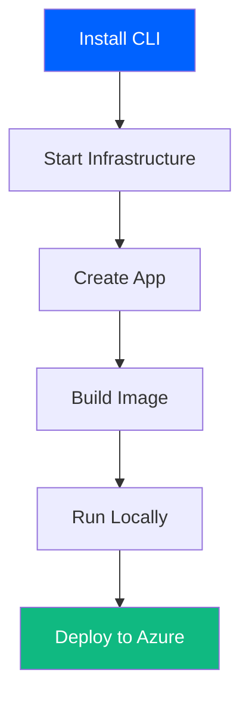

## QUICK-START.md - Quick Start Workflow

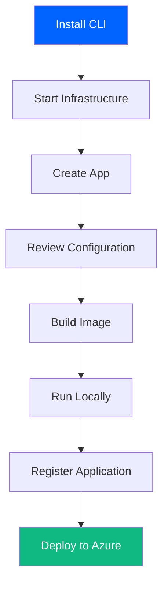

## QUICK-START.md - File Structure

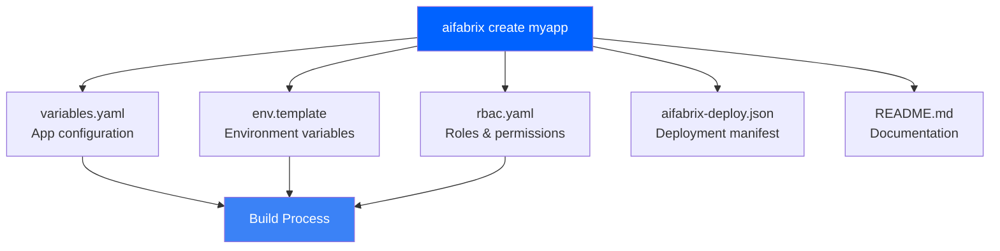

## INFRASTRUCTURE.md - Infrastructure Architecture

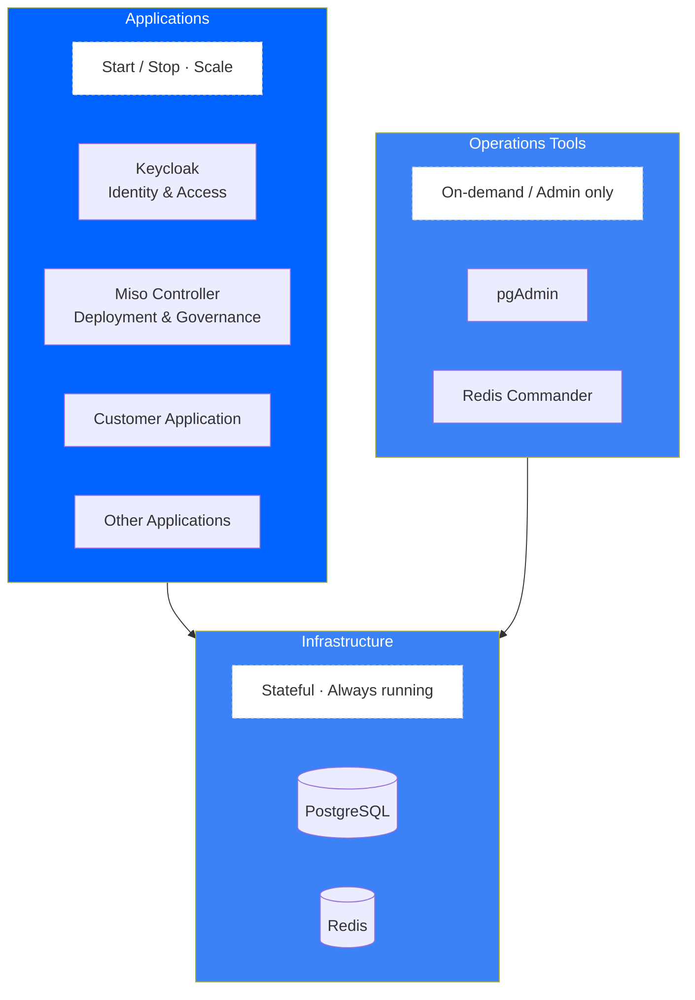

## INFRASTRUCTURE.md - Infrastructure vs Applications

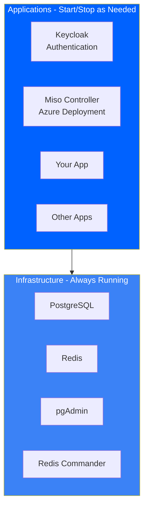

## CONFIGURATION.md - Configuration File Relationships

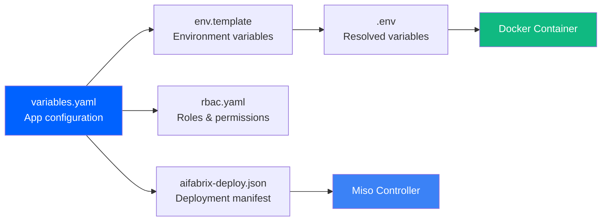

## CONFIGURATION.md - Secret Resolution Flow

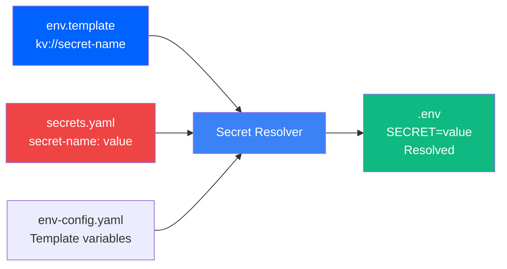

## CONFIGURATION.md - External Integration File Structure

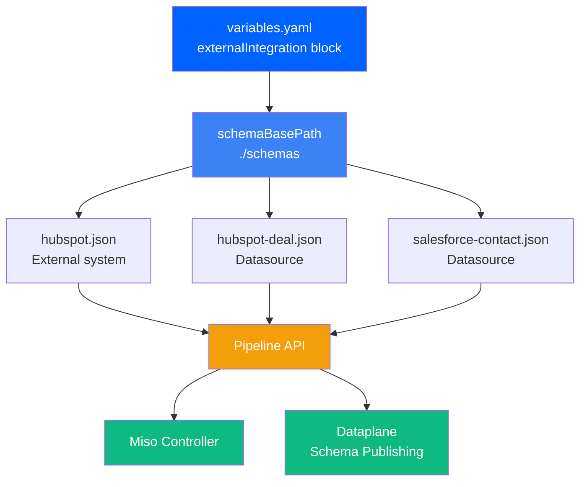

## BUILDING.md - Build Process Flowchart

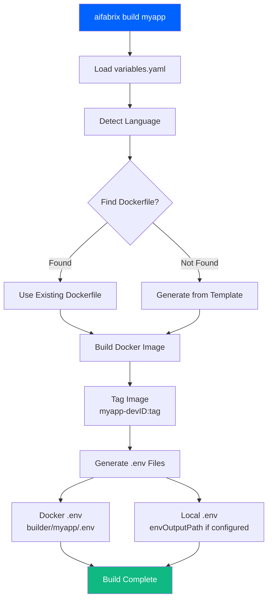

## BUILDING.md - Language Detection Decision Tree

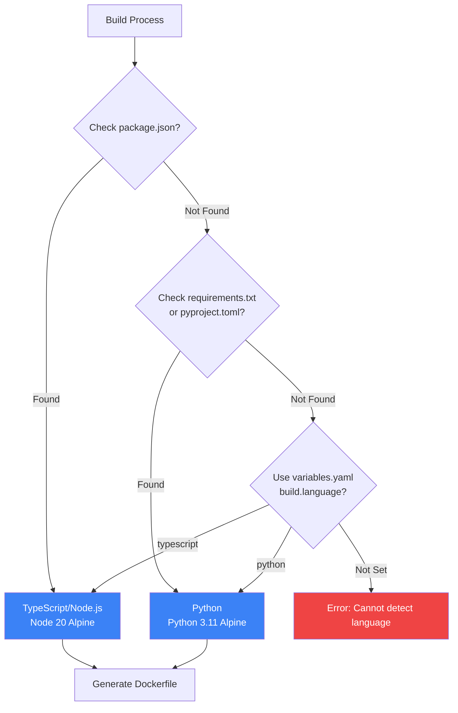

## BUILDING.md - .env File Generation Flow

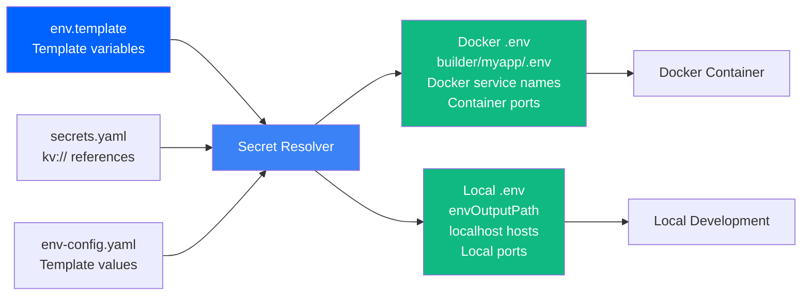

## RUNNING.md - Container Networking

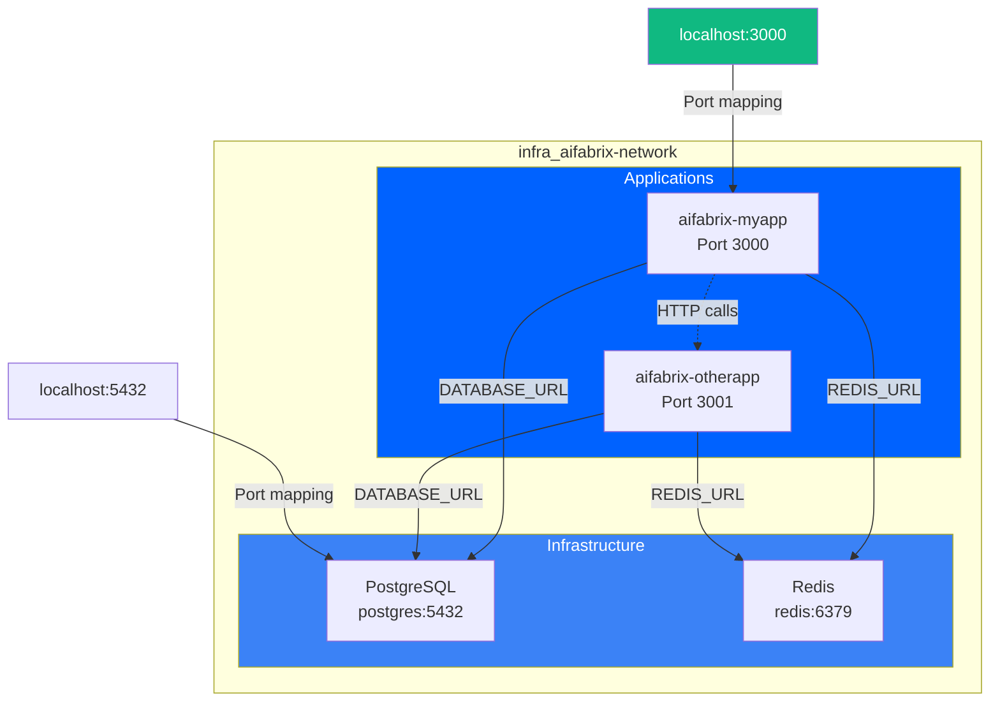

## RUNNING.md - Database Connection Paths

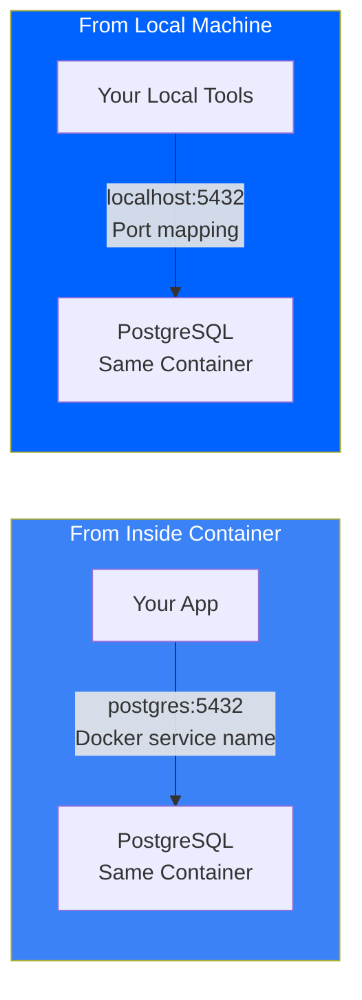

## DEPLOYING.md - Deployment Architecture

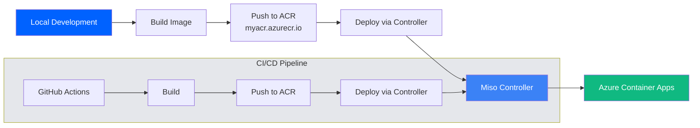

## DEPLOYING.md - Deployment Process Flowchart

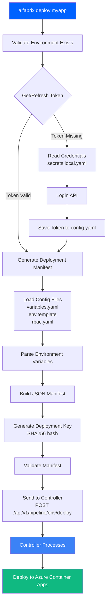

## DEPLOYING.md - Manifest Generation Flow

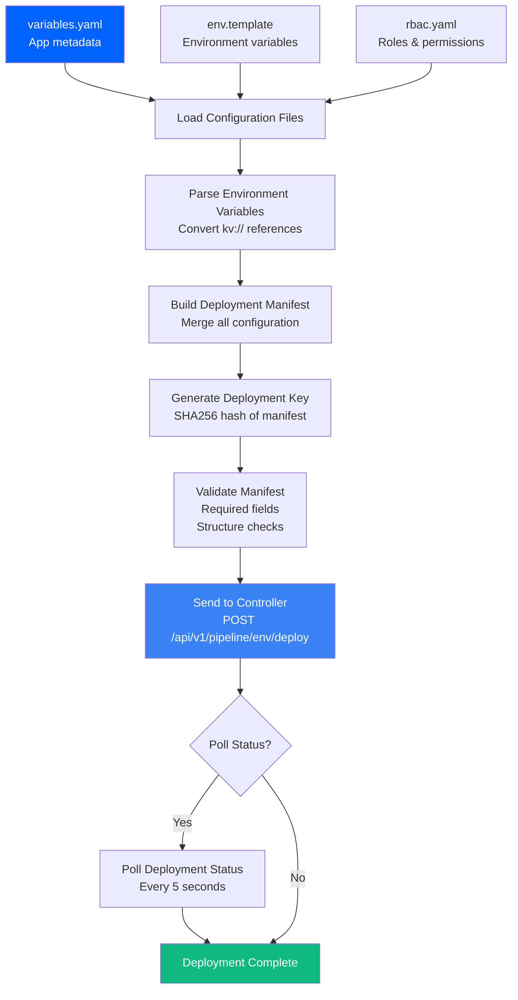

## DEPLOYING.md - Authentication Methods

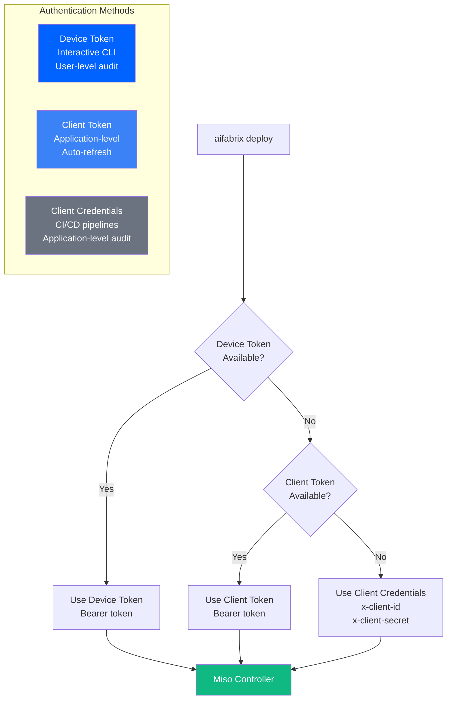

## EXTERNAL-SYSTEMS.md - External Systems Architecture

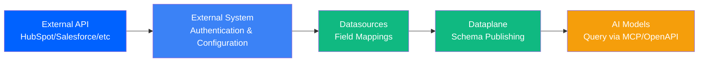

## EXTERNAL-SYSTEMS.md - External System File Structure

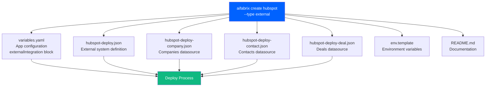

## EXTERNAL-SYSTEMS.md - Field Mapping Flow

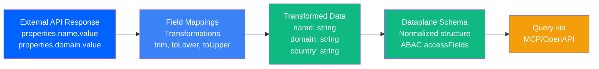

## GITHUB-WORKFLOWS.md - CI/CD Pipeline Flow

```mermaid
flowchart TD
    Push[Push to Repository] --> CI[CI Pipeline<br/>ci.yaml]
    PR[Pull Request] --> CI
    
    CI --> Lint[Lint Job<br/>ESLint checks]
    CI --> Test[Test Job<br/>Jest with coverage]
    CI --> Security[Security Job<br/>npm audit]
    CI --> Build[Build Job<br/>Package building]
    
    Tag[Version Tag<br/>v1.0.0] --> Release[Release Pipeline<br/>release.yaml]
    Release --> Validate[Validate Job]
    Validate --> PublishNPM[Publish NPM<br/>Optional]
    Validate --> CreateRelease[Create GitHub Release]
    
    PR --> PRChecks[PR Checks<br/>pr-checks.yaml]
    PRChecks --> FileSize[File Size Validation]
    PRChecks --> TODO[TODO Detection]
    PRChecks --> CommitMsg[Commit Message Validation]
    
    style CI fill:#0062FF,color:#FFFFFF
    style Release fill:#10B981,color:#FFFFFF
    style PRChecks fill:#3B82F6,color:#FFFFFF
```

## GITHUB-WORKFLOWS.md - CI/CD Deployment Flow

```mermaid
flowchart TD
    GitHub[GitHub Actions<br/>Workflow Triggered] --> Build[Build Docker Image]
    Build --> Push[Push to ACR<br/>Azure Container Registry]
    Push --> Deploy[Deploy via Controller<br/>Pipeline API]
    Deploy --> Controller[Miso Controller]
    Controller --> Azure[Azure Container Apps]
    
    subgraph Secrets[GitHub Secrets]
        ControllerURL[MISO_CONTROLLER_URL<br/>Repository level]
        ClientID[DEV_MISO_CLIENTID<br/>Environment level]
        ClientSecret[DEV_MISO_CLIENTSECRET<br/>Environment level]
    end
    
    Secrets --> Deploy
    
    style GitHub fill:#0062FF,color:#FFFFFF
    style Azure fill:#10B981,color:#FFFFFF
    style Controller fill:#3B82F6,color:#FFFFFF
    style Secrets fill:#EF4444,color:#FFFFFF
```

---

## Color Palette Reference

- **Primary**: `#0062FF` - Main actions, start points
- **Secondary**: `#3B82F6` - Secondary actions, services
- **Success**: `#10B981` - Completion, success states
- **Error**: `#EF4444` - Errors, security-sensitive
- **Warning**: `#F59E0B` - Warnings, queries
- **Neutral Border**: `#E5E7EB` - Neutral elements
- **Subtext**: `#6B7280` - Secondary text
- **Text Color**: `#FFFFFF` - White text on colored backgrounds

