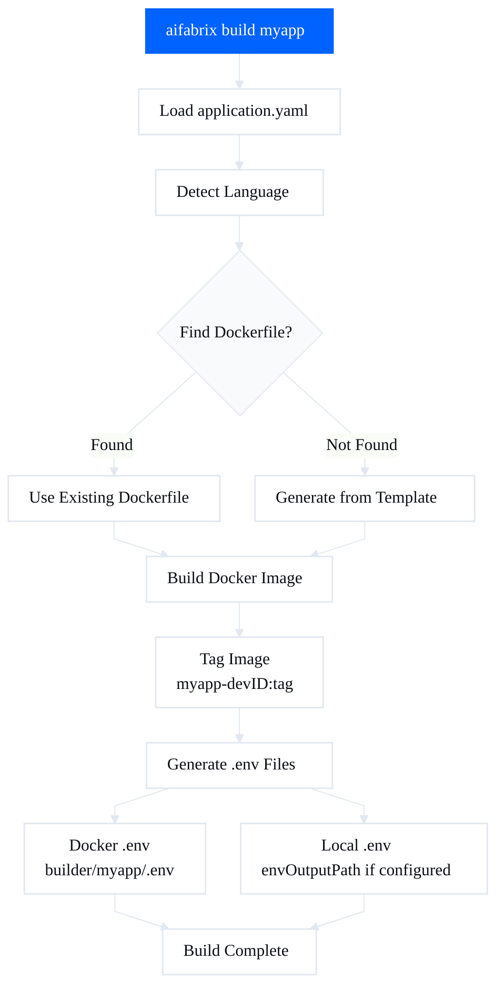
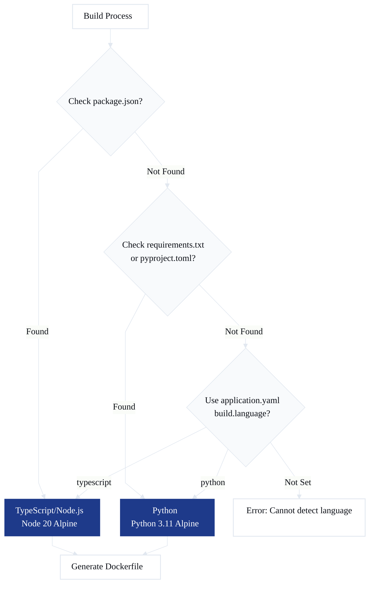
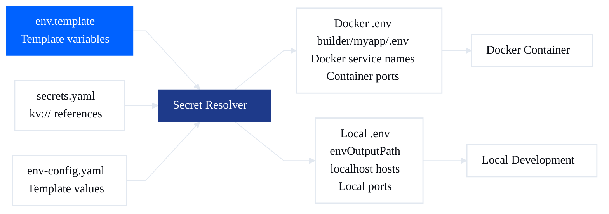

# Building Your App

← [Documentation index](README.md)

How the build process works and how to customize it.

## Basic Build

```bash
aifabrix build myapp
```

### What Happens

1. **Loads configuration** from `builder/myapp/application.yaml`
2. **Detects language** (or uses what you specified)
3. **Finds or generates Dockerfile**
   - Looks in your app root
   - If not found, generates from template
4. **Builds Docker image** with proper context
5. **Builds image as** `myapp-dev<developerId>:<tag>` and also tags `myapp:<tag>` for compatibility
6. **Generates `.env` files** from env.template + secrets
   - **Docker `.env`**: `builder/myapp/.env` - For container runtime
     - Uses `port` from application.yaml
     - Uses docker service names (redis, postgres)
     - All ports get developer-id adjustment
   - **Local `.env`**: Generated at `build.envOutputPath` (if configured) - For local development
     - Uses `build.localPort` (or `port` as fallback) from application.yaml
     - Uses localhost/dev.aifabrix for infrastructure hosts
     - App port gets developer-id adjustment; infra ports use base + developer-id adjustment



### Output

```yaml
✓ Loaded configuration
✓ Detected language: typescript
✓ Using Dockerfile from: .aifabrix/Dockerfile.typescript
✓ Building image...
✓ Image built: myapp-dev123:latest
✓ Tagged image: myapp:latest
✓ Generated .env file
```

---

## Language Detection

SDK auto-detects your language:

| File Found | Language | Base Image |
|------------|----------|------------|
| `package.json` | TypeScript | Node 20 Alpine |
| `requirements.txt` or `pyproject.toml` | Python | Python 3.11 Alpine |

### Override Detection

```bash
aifabrix build myapp --language python
```

Or set in `application.yaml`:
```yaml
build:
  language: python
```



---

## Generated Dockerfiles

If no Dockerfile exists, SDK generates one from templates.

### TypeScript/Node.js Template

```dockerfile
FROM node:20-alpine

WORKDIR /app

# Install system dependencies
RUN apk add --no-cache dumb-init curl

# Copy package files
COPY package*.json ./

# Install dependencies
RUN npm ci --only=production

# Copy application code
COPY . .

# Create non-root user
RUN addgroup -g 1001 nodejs && adduser -S nextjs -u 1001
RUN chown -R nextjs:nodejs /app
USER nextjs

# Expose port
EXPOSE 3000

# Health check
HEALTHCHECK CMD curl -f http://localhost:3000/health || exit 1

# Start
CMD ["npm", "start"]
```

### Python Template

```dockerfile
FROM python:3.11-alpine

WORKDIR /app

# Install system dependencies
RUN apk add --no-cache dumb-init curl gcc musl-dev libffi-dev

# Copy requirements
COPY requirements*.txt ./

# Install Python dependencies
RUN pip install --no-cache-dir -r requirements.txt

# Copy application code
COPY . .

# Create non-root user
RUN addgroup -g 1001 python && adduser -S python -u 1001
RUN chown -R python:python /app
USER python

# Expose port
EXPOSE 3000

# Health check
HEALTHCHECK CMD curl -f http://localhost:3000/health || exit 1

# Start
CMD ["python", "main.py"]
```

**Generated files location:**  
`.aifabrix/Dockerfile.<language>`

---

## Using Your Own Dockerfile

Place `Dockerfile` in your app root - SDK will use it automatically.

### Custom Location

Specify in `application.yaml`:
```yaml
build:
  dockerfile: docker/Dockerfile.prod
```

### When SDK Uses Your Dockerfile

- ✓ Dockerfile exists at specified path
- ✓ You haven't used `--force-template`

### Force Regenerate Template

Have a Dockerfile but want fresh template:
```bash
aifabrix build myapp --force-template
```

---

## Build Context

**Build context** = files Docker can access during build.

### Default Context

Current directory (`.`)

### Custom Context

```yaml
build:
  context: ../  # Parent directory
```

**Why change it?**
- Monorepo: build from workspace root
- Shared code: include sibling directories
- Build tools: access files outside app folder

### Example: Monorepo

```yaml
workspace/
├── packages/
│   ├── shared/       # Shared code
│   └── myapp/        # Your app
│       └── builder/
│           └── application.yaml
```

```yaml
# application.yaml
build:
  context: ../../     # Go to workspace root
  dockerfile: packages/myapp/Dockerfile
```

---

## What Gets Created

### Docker Image
**Name:** `myapp-dev<developerId>:<tag>` locally, plus compatibility tag `myapp:<tag>`  
**Where:** Local Docker

**View images:**
```bash
docker images | grep myapp
docker images | grep myapp-dev
```

### .env Files

**Docker `.env` file**  
**Location:** `builder/myapp/.env`  
**Contains:** Resolved environment variables for Docker container runtime
- Uses docker service names (redis, postgres) for infrastructure
- Uses `port` from application.yaml for application port
- All ports include developer-id adjustment

**View:**
```bash
cat builder/myapp/.env
```

**Local `.env` file** (if `build.envOutputPath` is configured)  
**Location:** Path specified in `build.envOutputPath` (e.g., `../../apps/myapp/.env`)  
**Contains:** Resolved environment variables for local development
- Uses localhost/dev.aifabrix for infrastructure hosts
- Uses `build.localPort` (or `port` as fallback) from application.yaml
- App port includes developer-id adjustment; infra ports use base + developer-id adjustment

**View:**
```bash
cat apps/myapp/.env  # If envOutputPath points here
```



### Build Logs
Shown in terminal during build.

**Save logs:**
```bash
aifabrix build myapp 2>&1 | tee build.log
```

---

## Common Build Scenarios

### After Code Changes
```bash
aifabrix build myapp
```

### With Specific Tag
```bash
aifabrix build myapp --tag v1.0.0
```

### Clean Build
```bash
docker rmi myapp:latest
aifabrix build myapp
```

### Build for Different Environment
```bash
aifabrix build myapp --language python
```

---

## Troubleshooting

### "Docker is not running"
**Fix:** Start Docker Desktop

**Check:**
```bash
docker ps
aifabrix doctor
```

### "Build failed"
**Causes:**
- Syntax error in Dockerfile
- Missing dependencies in package.json/requirements.txt
- Network issues downloading packages

**Debug:**
```bash
# Check Dockerfile syntax
docker build -f .aifabrix/Dockerfile.typescript .

# View detailed logs
aifabrix build myapp --verbose
```

### "Permission denied"
**Cause:** Docker daemon permission issues

**Fix (Linux):**
```bash
sudo usermod -aG docker $USER
# Log out and back in
```

### "Out of disk space"
**Clean up:**
```bash
docker system prune -a
docker volume prune
```

### "Can't find package.json"
**Cause:** Build context doesn't include your files

**Fix:** Set correct context in application.yaml:
```yaml
build:
  context: .  # Current directory
```

### "Image builds but app won't start"
**Debug:**
```bash
# Run image manually
docker run -it myapp:latest sh

# Check CMD/ENTRYPOINT
docker inspect myapp:latest
```

---

## Best Practices

### Multi-Stage Builds
Build and runtime in separate stages:
```dockerfile
# Build stage
FROM node:20-alpine AS builder
WORKDIR /app
COPY package*.json ./
RUN npm ci
COPY . .
RUN npm run build

# Runtime stage
FROM node:20-alpine
WORKDIR /app
COPY --from=builder /app/dist ./dist
COPY --from=builder /app/node_modules ./node_modules
CMD ["node", "dist/index.js"]
```

### Layer Caching
Copy dependency files first:
```dockerfile
# Good - deps cached separately
COPY package*.json ./
RUN npm install
COPY . .

# Bad - cache invalidated on any file change
COPY . .
RUN npm install
```

### Small Images
- Use Alpine Linux
- `npm ci` instead of `npm install`
- `--only=production`
- Multi-stage builds

### Security
- Non-root user
- Scan for vulnerabilities: `docker scan myapp:latest`
- Keep base images updated

