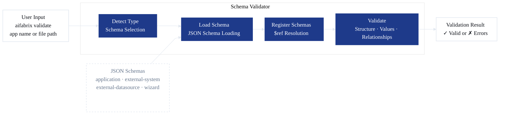

# Validation Commands

← [Back to Commands Index](README.md) | [Back to Quick Start](../quick-start.md)

Commands for validating and comparing configuration files.

---

## Overview

The AI Fabrix Builder validates all configuration files using **JSON Schema validation**. The validation system works in two modes:

1. **Offline Validation (Local)** - Validation runs **completely offline** on your machine before deployment. No network access or backend connection is required. This catches configuration errors early in your development workflow.

2. **Online Validation (Service)** - The dataplane service validates configurations using the **same JSON schemas** when you deploy. This ensures consistency between local and service-side validation. Additionally, the service performs **online validation of ABAC dimensions** to verify dimension keys exist in the Dimension Catalog and are properly configured for access control.

### What Gets Validated

The validation system validates:

- **Application configurations** (`variables.yaml`) - Main application settings
- **External system files** (`*-system.json`) - External integration system definitions
- **External datasource files** (`*-datasource-*.json`) - Datasource configurations
- **Wizard configurations** (`wizard.yaml`) - Wizard setup files (see [Wizard Guide](../wizard.md))
- **Deployment manifests** - Generated deployment configurations
- **ABAC dimensions** - Dimension keys and mappings (validated online during deployment)

### Validation Principles

1. **Schema-Based Validation** - All files are validated against JSON schemas that define the expected structure
2. **Offline Validation** - Local validation requires no API calls or network access
3. **Service-Side Validation** - The dataplane service uses the same schemas for consistent validation
4. **Online ABAC Validation** - Dimension keys are validated against the Dimension Catalog during deployment
5. **Early Error Detection** - Catch configuration errors before deployment
6. **Clear Error Messages** - Human-readable error messages with actionable feedback
7. **Schema Linking** - Schemas reference each other to ensure consistency

### Related Documentation

- [Wizard Guide](../wizard.md) - Wizard validation and configuration
- [External Integration Commands](external-integration.md) - External system validation commands
- [External Systems Guide](../external-systems.md) - ABAC dimensions and field mappings

---

## JSON Schemas

The validation system uses four core JSON schemas:

### 1. Application Schema

**Purpose:** Validates application configuration from `variables.yaml` and deployment manifests.

**Validates:**
- Application identifier (`key`)
- Application metadata (`displayName`, `description`)
- Application type (`webapp`, `functionapp`, `api`, `service`, `external`)
- Deployment configuration (`deploymentKey`, `image`, `port`, `registryMode`)
- External integration configuration (`externalIntegration` block)
- Inline system and datasource configurations (for atomic deployments)

**Key Requirements:**
- `key` must match pattern: lowercase letters, numbers, and hyphens only
- `type` must be one of the allowed application types
- `port` must be between 1 and 65535 (for non-external types)
- `externalIntegration` block required when `type: external`

### 2. External System Schema

**Purpose:** Validates external system integration configurations.

**Validates:**
- System identifier (`key`)
- System type (`openapi`, `mcp`, `custom`)
- Authentication configuration
- OpenAPI or MCP bindings
- Field mapping defaults
- Portal input configuration

**Key Requirements:**
- `key` must be unique and follow naming conventions
- `type` must specify integration type
- `authentication` configuration is required
- OpenAPI/MCP bindings must be properly configured

### 3. External Datasource Schema

**Purpose:** Validates external datasource configurations.

**Validates:**
- Datasource identifier (`key`)
- Parent system reference (`systemKey`)
- Entity type (`entityType`)
- Field mappings (dimensions and attributes)
- Metadata schema
- Custom Integration Pipeline (CIP) configuration

**Key Requirements:**
- `key` must be unique within the system
- `systemKey` must reference a valid external system
- `entityType` must be specified
- `fieldMappings` must include dimensions and attributes
- Field mapping expressions must follow correct syntax

### 4. Wizard Configuration Schema

**Purpose:** Validates wizard configuration files.

**Validates:**
- Wizard mode (`create-system`, `add-datasource`)
- Source configuration (OpenAPI file/URL, MCP server, known platform)
- Application configuration
- System identifier (for `add-datasource` mode)

**Key Requirements:**
- `mode` must be specified
- `source` configuration must match source type
- File paths must exist (for `openapi-file` source type)
- `systemIdOrKey` required when `mode: add-datasource`

---

## How Schema Validation Works

### Schema Linking

Schemas are linked together using JSON Schema's `$ref` (reference) mechanism. This allows schemas to reference each other, ensuring consistency across related configurations.

**Example:** The application schema can include inline external system and datasource configurations by referencing their schemas:

```json
{
  "system": {
    "$ref": "https://raw.githubusercontent.com/esystemsdev/aifabrix-builder/refs/heads/main/lib/schema/external-system.schema.json"
  },
  "dataSources": {
    "items": {
      "$ref": "https://raw.githubusercontent.com/esystemsdev/aifabrix-builder/refs/heads/main/lib/schema/external-datasource.schema.json"
    }
  }
}
```

### Schema Dependency Structure

```yaml
application-schema.json
├── Can reference: external-system.schema.json (via $ref)
├── Can reference: external-datasource.schema.json (via $ref)
└── Validates: variables.yaml → deployment manifests

external-system.schema.json
├── Standalone schema
└── Validates: *-system.json files

external-datasource.schema.json
├── Standalone schema
└── Validates: *-datasource-*.json files

wizard-config.schema.json
├── Standalone schema
└── Validates: wizard.yaml files
```

### Validation Process

When you run validation, the system:

1. **Detects Configuration Type** - Determines which schema to use based on file content or structure
2. **Loads Appropriate Schema** - Selects the correct JSON schema for validation
3. **Registers Related Schemas** - If the schema references other schemas (via `$ref`), those are also loaded
4. **Validates Structure** - Checks that your configuration matches the schema structure
5. **Validates Values** - Ensures field values meet requirements (types, patterns, ranges, enums)
6. **Checks Relationships** - Validates references between related configurations (e.g., `systemKey` references)
7. **Reports Errors** - Provides clear, actionable error messages

### Validation Flow Diagram



### What Gets Checked

**Structure Validation:**
- Required fields are present
- Field types are correct (string, number, boolean, object, array)
- Nested objects and arrays have correct structure
- No unexpected additional properties

**Value Validation:**
- String patterns (e.g., `key` must be lowercase with hyphens)
- Number ranges (e.g., `port` must be 1-65535)
- Enum values (e.g., `type` must be one of allowed values)
- String length constraints (min/max length)
- Required vs optional fields

**Relationship Validation:**
- References between files (e.g., `systemKey` must reference existing system)
- Role references in RBAC configurations
- File path existence (for file-based references)

### Online ABAC Dimension Validation

When deploying external datasources to the dataplane, the service performs **online validation of ABAC dimensions**. This validation happens during deployment and verifies:

1. **Dimension Key Existence** - All dimension keys referenced in `fieldMappings.dimensions` or `abac.dimensions` must exist in the Dimension Catalog
2. **Dimension Mapping Validity** - Dimension mappings must reference valid attribute paths in the metadata schema
3. **ABAC Configuration** - ABAC configuration blocks are validated for proper structure

**Example:**
```json
{
  "fieldMappings": {
    "dimensions": {
      "country": "metadata.country",
      "department": "metadata.department"
    }
  }
}
```

During deployment, the service validates:
- `country` and `department` dimension keys exist in the Dimension Catalog
- `metadata.country` and `metadata.department` are valid attribute paths
- Dimensions are properly configured for ABAC filtering

**Note:** Dimension validation requires network access to the dataplane service. Local validation (`aifabrix validate`) checks dimension syntax and structure but cannot verify dimension keys against the Dimension Catalog. Use `aifabrix test-integration` or deployment to validate dimensions online.

For more information about ABAC dimensions, see [External Systems Guide](../external-systems.md#field-mappings).

---

## aifabrix validate <appOrFile>

Validate application or external integration file.

**What:** Validates application configurations or external integration files against their JSON schemas. Supports both app name validation (including externalIntegration block and rbac.yaml for external systems) and direct file validation.

**When:** Before deployment, when troubleshooting configuration issues, validating external integration schemas, or checking configuration changes.

**Related Commands:**
- [aifabrix wizard](external-integration.md#aifabrix-wizard) - Wizard includes validation step (see [Wizard Guide](../wizard.md#validation))
- [aifabrix test](external-integration.md#aifabrix-test-app) - Unit tests with local validation
- [aifabrix test-integration](external-integration.md#aifabrix-test-integration-app) - Integration tests with online validation including ABAC dimensions
- [aifabrix datasource validate](external-integration.md#aifabrix-datasource-validate-file) - Validate datasource files directly

**Usage:**
```bash
# Validate application by name (includes externalIntegration files if present)
aifabrix validate myapp

# Validate external system file directly
aifabrix validate ./schemas/hubspot-system.json

# Validate external datasource file directly
aifabrix validate ./schemas/hubspot-datasource-company.json

# Validate external system with complete validation (all steps)
aifabrix validate my-hubspot --type external
```

**Arguments:**
- `<appOrFile>` - Application name or path to configuration file

**Options:**
- `--type <type>` - Force application type (e.g., `external` for complete external system validation)

**Process:**

1. **Input Detection:**
   - If file path exists → Direct file validation
   - If app name → Application validation

2. **Application Validation (app name):**
   - Loads `variables.yaml` from `builder/<app-name>/` or `integration/<app-name>/`
   - Validates against application schema
   - If `type: external`:
     - Validates `rbac.yaml` (if present)
     - Checks role references in permissions
     - If `externalIntegration` block exists:
       - Resolves schema base path
       - Finds all `*-system.json` and `*-datasource-*.json` files
       - Validates each file against its schema
   - Aggregates all validation results

3. **File Validation (file path):**
   - Detects schema type automatically:
     - Checks `$id` field in JSON file
     - Checks `title` field
     - Checks required fields structure
     - Checks filename pattern
   - Loads appropriate schema
   - Validates file against schema
   - For external-system files, also validates role references in permissions

4. **External System Complete Validation (`--type external`):**
   - **Step 1:** Application configuration validation
   - **Step 2:** Individual component files validation (system + datasources)
   - **Step 3:** Full deployment manifest validation (generated manifest with inline system/dataSources)

**Output (app validation with external files):**
```yaml
✓ Validation passed!

Application:
  ✓ Application configuration is valid

External Integration Files:
  ✓ hubspot-system.json (system)
  ✓ hubspot-datasource-company.json (datasource)
  ✓ hubspot-datasource-contact.json (datasource)
```

**Output (validation failed):**
```yaml
✗ Validation failed!

Application:
  ✗ Application configuration has errors:
    • Field "app.key": Missing required property
    • Field "app.port": Expected number, got string

External Integration Files:
  ✗ hubspot-system.json (system):
    • Field "key": Missing required field
    • Field "version": Invalid value "1.0" - must match pattern ^[0-9]+\.[0-9]+\.[0-9]+$
```

**Output (external system complete validation):**
```yaml
✓ Validation passed!

Step 1: Application Configuration
  ✓ Application configuration is valid

Step 2: Component Files
  ✓ hubspot-system.json (system) is valid
  ✓ hubspot-datasource-company.json (datasource) is valid
  ✓ hubspot-datasource-contact.json (datasource) is valid

Step 3: Deployment Manifest
  ✓ Generated deployment manifest is valid
```

**Output (file validation):**
```yaml
✓ Validation passed!

File: ./schemas/hubspot-system.json
Type: external-system
  ✓ File is valid
```

**Schema Type Detection:**

When validating files directly, the system automatically detects which schema to use:

1. **By `$id` field** - If the JSON file has an `$id` field matching a known schema
2. **By `title` field** - If the file has a `title` field indicating schema type
3. **By required fields** - Checks for characteristic required fields:
   - Has `systemKey` → external-datasource schema
   - Has `type` with `openapi`/`mcp`/`custom` → external-system schema
   - Has `deploymentKey` → application schema
4. **By filename pattern** - Filenames containing `system`, `datasource`, `deploy`, etc.

**Error Messages:**

Validation errors are formatted to be clear and actionable:

- **Required fields**: `Field "key": Missing required property`
- **Type errors**: `Field "port": Expected number, got string`
- **Pattern errors**: `Field "key": Invalid value "MyApp" - lowercase letters, numbers, and hyphens only`
- **Enum errors**: `Field "type": Must be one of: webapp, functionapp, api, service, external`
- **Additional properties**: `Field "config": must NOT have additional properties`

**Issues:**
- **"App name or file path is required"** → Provide application name or file path
- **"File not found"** → Check file path is correct
- **"Invalid JSON syntax"** → Fix JSON syntax errors in file
- **"externalIntegration block not found"** → Add externalIntegration block to variables.yaml or validate file directly
- **"schemaBasePath not found"** → Add schemaBasePath to externalIntegration block
- **"File not found: <path>"** → Check that external system/datasource files exist at specified paths
- **"Unknown schema type"** → File must be application, external-system, or external-datasource JSON

**Next Steps:**
After validation:
- Fix any errors reported
- For external integrations, ensure all referenced files exist
- Use `aifabrix diff` to compare configuration versions
- Deploy validated configuration: `aifabrix deploy <app>`

---

## Validation Examples

### Example 1: Validating Application Configuration

```bash
aifabrix validate myapp
```

**What happens:**
1. Loads `builder/myapp/variables.yaml` or `integration/myapp/variables.yaml`
2. Transforms YAML to JSON structure
3. Validates against application schema
4. Returns validation result

**Success:**
```yaml
✓ Validation passed!

Application:
  ✓ Application configuration is valid
```

### Example 2: Validating External System File

```bash
aifabrix validate ./integration/hubspot/hubspot-system.json
```

**What happens:**
1. Detects file type as `external-system`
2. Loads external-system schema
3. Validates file against schema
4. Validates role references in permissions (if present)

**Success:**
```yaml
✓ Validation passed!

File: ./integration/hubspot/hubspot-system.json
Type: external-system
  ✓ File is valid
```

### Example 3: Complete External System Validation

```bash
aifabrix validate my-hubspot --type external
```

**What happens:**
1. **Step 1:** Validates `variables.yaml` against application schema
2. **Step 2:** Validates component files:
   - `hubspot-system.json` against external-system schema
   - `hubspot-datasource-company.json` against external-datasource schema
   - `hubspot-datasource-contact.json` against external-datasource schema
3. **Step 3:** Generates deployment manifest and validates:
   - Manifest structure against application schema
   - Inline `system` object against external-system schema (via schema reference)
   - Each `dataSources` item against external-datasource schema (via schema reference)

**Success:**
```yaml
✓ Validation passed!

Step 1: Application Configuration
  ✓ Application configuration is valid

Step 2: Component Files
  ✓ hubspot-system.json (system) is valid
  ✓ hubspot-datasource-company.json (datasource) is valid
  ✓ hubspot-datasource-contact.json (datasource) is valid

Step 3: Deployment Manifest
  ✓ Generated deployment manifest is valid
```

### Example 4: Validation Error with Schema Reference

When using inline `system` or `dataSources` in deployment manifests, validation checks both the application schema and the referenced schemas:

```json
{
  "key": "myapp",
  "type": "external",
  "system": {
    "key": "hubspot",
    "type": "invalid-type"
  }
}
```

**Validation process:**
1. Validates application schema structure ✓
2. Resolves schema reference to external-system schema
3. Validates `system` object against external-system schema
4. Finds error: `type` must be one of: `openapi`, `mcp`, `custom`

**Error:**
```yaml
✗ Validation failed!

Application:
  ✗ Application configuration has errors:
    • Field "system.type": Must be one of: openapi, mcp, custom
```

---

## Best Practices

### 1. Validate Before Deployment

Always validate configurations before deployment:

```bash
# Validate application
aifabrix validate myapp

# Validate external system completely
aifabrix validate my-hubspot --type external

# Validate individual files
aifabrix validate ./schemas/hubspot-system.json
```

### 2. Use Complete Validation for External Systems

For external systems, use `--type external` for complete validation that checks:
- Application configuration
- Component files (system + datasources)
- Generated deployment manifest

```bash
aifabrix validate my-hubspot --type external
```

### 3. Fix Errors in Order

Validation errors are formatted with field paths. Fix errors in order:

1. **Required fields** - Add missing required fields first
2. **Type errors** - Fix type mismatches
3. **Pattern errors** - Fix format violations
4. **Additional properties** - Remove disallowed properties

### 4. Understand Schema References

When using inline `system` or `dataSources` in deployment manifests:

- The application schema references external schemas via `$ref`
- Inline objects must match the referenced schema structure
- Validation automatically resolves schema references
- Errors will indicate which schema (application or external) failed

### 5. Validate Schema Changes

When modifying configurations:

1. Validate existing configurations still pass
2. Test new configurations with updated structure
3. Check schema references are correct
4. Verify all required fields are present

---

## Troubleshooting

### Schema Reference Errors

**Error:** `Cannot resolve reference: https://raw.githubusercontent.com/...`

**Solution:**
- This typically means a schema reference in your configuration doesn't match the expected schema
- Check that inline `system` or `dataSources` objects match their respective schema structures
- Ensure all required fields for the referenced schema are present

### Type Detection Errors

**Error:** `Unknown schema type`

**Solution:**
- Ensure file has `$id` or `title` field indicating schema type
- Check required fields match expected schema type
- Verify filename pattern matches schema type (e.g., `*-system.json` for external-system)

### Validation Performance

**Issue:** Slow validation for large configurations

**Solution:**
- Validation is optimized and cached automatically
- Large configurations may take a few seconds
- Consider splitting very large configurations into smaller files

### Pattern Validation Errors

**Error:** `Invalid value "X" - must match pattern`

**Solution:**
- Check the error message for the expected pattern
- Common patterns:
  - `key`: lowercase letters, numbers, and hyphens only
  - `version`: must match `^[0-9]+\.[0-9]+\.[0-9]+$` (e.g., `1.0.0`)
  - `port`: must be between 1 and 65535

---

## Related Documentation

- [Wizard Guide](../wizard.md) - Wizard validation and configuration workflow
- [External Integration Commands](external-integration.md) - External system validation commands (`test`, `test-integration`, `datasource validate`)
- [External Systems Guide](../external-systems.md) - External system configuration, ABAC dimensions, and field mappings
- [Configuration Guide](../configuration.md) - Application configuration
- [Commands Index](README.md) - All available commands

---

<a id="aifabrix-diff-file1-file2"></a>
## aifabrix diff <file1> <file2>

Compare two configuration files.

**What:** Performs deep comparison of two JSON configuration files, identifying added, removed, and changed fields. Categorizes changes as breaking or non-breaking. Used for deployment pipeline validation and schema migration detection.

**When:** Before deploying configuration changes, comparing schema versions, validating migrations, or reviewing configuration differences.

**Usage:**
```bash
# Compare two external system files
aifabrix diff ./schemas/hubspot-v1.json ./schemas/hubspot-v2.json

# Compare two datasource files
aifabrix diff ./schemas/hubspot-deal-v1.json ./schemas/hubspot-deal-v2.json

# Compare deployment configurations
aifabrix diff ./old-config.json ./new-config.json
```

**Arguments:**
- `<file1>` - Path to first configuration file
- `<file2>` - Path to second configuration file

**Process:**
1. Reads and parses both JSON files
2. Performs deep object comparison
3. Identifies:
   - Added fields (present in file2, not in file1)
   - Removed fields (present in file1, not in file2)
   - Changed fields (different values)
   - Version changes
4. Categorizes breaking changes:
   - Removed fields (potentially breaking)
   - Type changes (breaking)
5. Displays formatted diff output

**Output (identical files):**
```yaml
Comparing: hubspot-v1.json ↔ hubspot-v2.json

✓ Files are identical
```

**Output (different files):**
```yaml
Comparing: hubspot-v1.json ↔ hubspot-v2.json

Files are different

Version: 1.0.0 → 2.0.0

⚠️  Breaking Changes:
  • Field removed: apiKey.path (string)
  • Type changed: timeout (number → string)

Added Fields:
  + authentication.type: "oauth2"
  + rateLimit: 100

Removed Fields:
  - apiKey.path: "config.apiKey"
  
Changed Fields:
  ~ timeout:
    Old: 30
    New: "30s"
  ~ baseUrl:
    Old: "https://api.hubspot.com"
    New: "https://api.hubspot.com/v3"

Summary:
  Added: 2
  Removed: 1
  Changed: 2
  Breaking: 2
```

**Breaking Changes:**
- **Removed fields** - Fields present in file1 but not in file2
- **Type changes** - Fields with different types between files

**Non-Breaking Changes:**
- **Added fields** - New fields in file2
- **Value changes** - Same type, different values

**Exit Codes:**
- **0** - Files are identical
- **1** - Files are different

**Issues:**
- **"First file path is required"** → Provide path to first file
- **"Second file path is required"** → Provide path to second file
- **"File not found: <path>"** → Check file paths are correct
- **"Failed to parse <file>"** → Fix JSON syntax errors in file

**Next Steps:**
After comparing:
- Review breaking changes before deployment
- Update configuration if needed
- Use `aifabrix validate` to ensure new configuration is valid
- Deploy updated configuration: `aifabrix deploy <app>`
