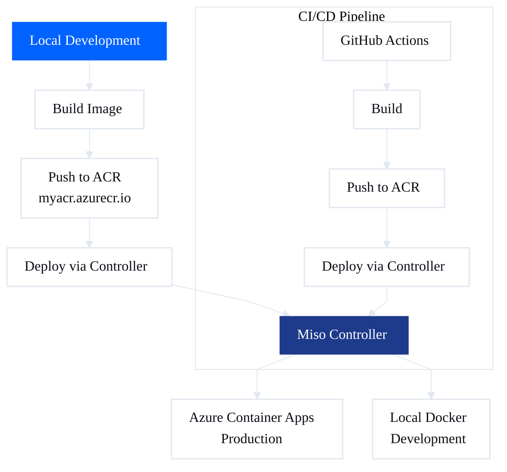
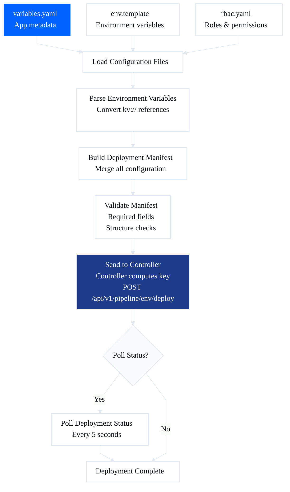

# Deploying Applications

← [Documentation index](README.md)

Deployment is **unified**: the same flow and the same Miso Controller apply to (1) **web apps and Docker images** and (2) **external systems integration**. Most deployments in practice are **integration deployments** (external systems); image-based app deployment is one path. In all cases the CLI sends the deployment to the Controller; the Controller then deploys to the dataplane or target environment (Azure Container Apps or local Docker).

## What gets deployed

- **External systems:** OpenAPI/MCP integrations, datasources, and related config. You work in `integration/<app>/` and deploy with `aifabrix deploy <app> --type external`. No app registration needed; the controller creates and deploys from your integration manifest.
- **Containerized applications:** Web apps or services built as Docker images. You build, push to a registry, then deploy with `aifabrix deploy <app>`. Requires app registration and image push first.

Both paths use the same Controller and the same deploy pipeline; only the source (integration folder vs builder + registry) and manifest content differ.

## Deploying external systems

Flow: **Local (dev)** → **Controller** → **Dataplane**.

Flow for external systems (OpenAPI, MCP, etc.): **Local (dev)** → **Controller** → **Dataplane**.

- **Local (dev):** You define external systems and datasources in `integration/<app>/` (system JSON, datasource JSON). You validate and deploy from the CLI. Use `aifabrix deploy <app> --type external` to deploy from `integration/<app>/` (no app register needed; controller creates and deploys automatically).
- **Controller:** The CLI sends deployment to the Miso Controller (`aifabrix deploy <app>` or `aifabrix deploy <app> --type external` for external systems, or datasource deploy). The controller orchestrates deployment; it does not deploy directly to the dataplane from the CLI for app-level deploy.
- **Dataplane:** The controller deploys to the dataplane (or target environment). External systems and datasources are configured on the controller and published to the dataplane. Pipeline and schema publishing run after deployment when `autopublish` is true.

So: **Deploy to Controller** means the CLI sends the deployment to the Miso Controller, which then deploys to the dataplane (or target environment). The controller orchestrates; you do not deploy directly to the dataplane from the CLI for app-level deploy.

## Deploying containerized applications

For web apps and Docker images: build the image, push to a registry (e.g. ACR), then deploy via the Controller. Prerequisites and steps below apply to this path.

## Prerequisites

Before deploying:

1. **Miso Controller**
   - Running instance (or URL)
   - See [Install Miso Controller](infrastructure.md#install-miso-controller)

2. **Built Image**
   ```bash
   aifabrix build myapp
   ```

3. **Registered Application**
   - Run `aifabrix app register myapp` to get pipeline credentials
   - Credentials are displayed (not automatically saved)
   - Copy credentials to GitHub Secrets for CI/CD

---

## Deployment Methods

### Method 1: Using AI Fabrix Builder SDK

```bash
# Push image to registry
aifabrix push myapp --registry myacr.azurecr.io --tag v1.0.0

# Deploy via controller
aifabrix deploy myapp
```

### Method 2: Automated CI/CD Deployment

For automated deployments using the AI Fabrix Builder CLI, see [GitHub Workflows Guide](github-workflows.md#integration-with-ai-fabrix) for detailed workflow examples using `aifabrix login`, `aifabrix validate`, `aifabrix build`, and `aifabrix deploy` commands.

The deploy command uses Bearer token authentication. Tokens are automatically retrieved or refreshed from config.yaml, or obtained using credentials from secrets.local.yaml if needed.



---

## Open source vs standard/enterprise

**Environments:**
- **Open source:** Typically one environment (e.g. `dev`). Use it for local and single-environment setups.
- **Standard/Enterprise:** Multiple environments (e.g. `dev`, `tst`, `pro`) for staging and production.

**Deployment target:**
- **Open source:** Local Docker instances; basic container deployment; Docker running locally.
- **Enterprise:** Azure Container Apps; full Azure integration, scaling, monitoring; Azure subscription and ACR access.

---

## Step 1: Push to ACR

```bash
aifabrix push myapp --registry myacr.azurecr.io --tag v1.0.0
```

### What Happens

1. **Authenticates with Azure**
   - Uses Azure CLI credentials
   - Or prompts you to log in

2. **Tags image**
   ```yaml
   myapp:latest → myacr.azurecr.io/myapp:v1.0.0
   ```

3. **Pushes to registry**
   - Uploads image layers
   - Verifies upload

### Output

```yaml
✓ Authenticated with myacr.azurecr.io
✓ Tagged image: myacr.azurecr.io/myapp:v1.0.0
✓ Pushing...
✓ Push complete
```

### Multiple Tags

```bash
aifabrix push myapp --registry myacr.azurecr.io --tag "v1.0.0,latest,stable"
```

Tags: `v1.0.0`, `latest`, `stable`

---

## Step 2: Deploy Environment (First Time)

Before deploying applications, ensure the environment is set up in the Miso Controller. Run:

```bash
aifabrix environment deploy dev
```

This validates the environment, authenticates (device token from `aifabrix login`), deploys environment infrastructure, and verifies readiness. Typically done once per environment.

**→ Full details:** [Deploy Environment (First Time)](deployment/environment-first-time.md)

---

## Step 3: Deploy Application via Controller

```bash
aifabrix deploy myapp
```

### What Happens

1. **Validates environment exists**
   - Checks that target environment is set up
   - Verifies environment is ready for deployments

2. **Gets or refreshes authentication token**
   - Retrieves client token from config.yaml for current environment + app
   - If token missing or expired:
     - Reads credentials from `~/.aifabrix/secrets.local.yaml` using pattern `<app-name>-client-idKeyVault` and `<app-name>-client-secretKeyVault`
     - Calls login API to get new token
     - Saves token to config.yaml (never saves credentials)
   - **Note:** Device tokens (from device code flow) are stored at root level keyed by controller URL and include refresh tokens for automatic renewal on 401 errors

2. **Generates deployment manifest**
   - Creates `aifabrix-deploy.json`
   - Includes all configuration from variables.yaml, env.template, rbac.yaml

3. **Generates deployment key**
   - SHA256 hash of variables.yaml
   - Used for authentication and integrity check

4. **Sends to controller**
   - POST to `/api/v1/pipeline/{env}/deploy` (environment-aware endpoint)
   - Includes manifest + deployment key
   - Uses Bearer token authentication

5. **Controller processes**
   - Validates configuration
   - Checks deployment key
   - Deploys to Azure Container Apps
   - Configures database, Redis, networking
   - Sets up RBAC and permissions


### Output

```yaml
✓ Generated deployment manifest
✓ Deployment key: a1b2c3d4...
✓ Sending to controller...
✓ Deployment started
✓ Status: https://controller.aifabrix.dev/deployments/12345
```

---

## Deployment Key

Controller computes and manages the deployment key. Builder sends manifest only (no `deploymentKey`). See [Deployment key](configuration/deployment-key.md) for details.

---

## Deployment Manifest

The `aifabrix-deploy.json` file sent to controller. The controller uses this manifest to:
- **Azure deployments:** Deploy to Azure Container Apps with the specified configuration
- **Local Docker deployments:** Run Docker containers locally with parameters extracted from the manifest

### View Your Manifest

```bash
aifabrix json myapp
```

Creates `builder/myapp/aifabrix-deploy.json`:
```json
{
  "key": "myapp",
  "displayName": "My Application",
  "image": "myacr.azurecr.io/myapp:v1.0.0",
  "port": 3000,
  "configuration": [
    {
      "name": "DATABASE_URL",
      "value": "databases-0-urlKeyVault",
      "location": "keyvault",
      "required": true
    }
  ],
  "roles": [...],
  "permissions": [...]
}
```

### What's Included

- App metadata (key, name, description)
- Docker image reference
- Environment variables (kv:// references)
- Database requirements
- Redis/storage requirements
- RBAC configuration
- Health check settings
- Authentication settings

---

## Application Registration

Before deploying via pipeline API, you must register your application to get ClientId and ClientSecret credentials.

### Step 1: Login to Controller

**For credentials-based login (recommended for deployments):**
```bash
aifabrix login --controller https://controller.aifabrix.dev --method credentials --app myapp --environment dev
```

This reads credentials from `~/.aifabrix/secrets.local.yaml` using pattern:
- `myapp-client-idKeyVault` for client ID
- `myapp-client-secretKeyVault` for client secret

**For device code flow (initial setup):**
```bash
aifabrix login --controller https://controller.aifabrix.dev --method device --environment dev
```

This authenticates you via Keycloak OIDC device code flow.

### Step 2: Register Application

```bash
aifabrix app register myapp
```

**Output:**
```yaml
✓ Application registered successfully!

📋 Application Details:
   Key:          myapp
   Display Name: My Application
   Environment:  dev

🔑 CREDENTIALS (save these immediately):
   Client ID:     ctrl-dev-myapp
   Client Secret: xyz-abc-123...

⚠️  IMPORTANT: Client Secret will not be shown again!

📝 Add to GitHub Secrets:
   Repository level:
     MISO_CONTROLLER_URL = https://controller.aifabrix.dev
   
   Environment level (dev):
     DEV_MISO_CLIENTID = ctrl-dev-myapp
     DEV_MISO_CLIENTSECRET = xyz-abc-123...
```

**Note:**
- For localhost deployments, credentials are automatically saved to `~/.aifabrix/secrets.local.yaml` using pattern `<app-name>-client-idKeyVault` and `<app-name>-client-secretKeyVault`
- `env.template` is updated with `MISO_CLIENTID`, `MISO_CLIENTSECRET`, and `MISO_CONTROLLER_URL` entries
- Tokens are saved to `~/.aifabrix/config.yaml` (never credentials)
- For production deployments, credentials are displayed but not automatically saved. Copy them to GitHub Secrets manually.

### Step 3: Add to GitHub Secrets (CI/CD Only)

1. Go to repository Settings → Secrets and variables → Actions
2. Add repository-level secret:
   - `MISO_CONTROLLER_URL` - Controller URL (e.g., `https://controller.aifabrix.dev`)
3. Add environment-level secrets (for dev):
   - `DEV_MISO_CLIENTID` - From registration output
   - `DEV_MISO_CLIENTSECRET` - From registration output

**Note:** For staging/production, use `TST_` or `PRO_` prefixes.

### Secret Rotation

To rotate your ClientSecret (use when credentials are compromised or need rotation):

```bash
aifabrix app rotate-secret myapp
```

**Output:**
```yaml
⚠️  This will invalidate the old ClientSecret!

✓ Secret rotated successfully!

📋 Application Details:
   Key:         myapp
   Environment: dev

🔑 NEW CREDENTIALS:
   Client ID:     ctrl-dev-myapp
   Client Secret: xyz-new-secret-789

⚠️  Old secret is now invalid. Update GitHub Secrets!
```

Updates credentials display. Copy the new credentials to `DEV_MISO_CLIENTSECRET` in GitHub Secrets if using CI/CD.

## CI/CD Integration

### GitHub Actions Workflow

For automated CI/CD deployments, see [GitHub Workflows Guide](github-workflows.md#integration-with-ai-fabrix) for detailed workflow examples.

**Basic workflow setup:**
1. Register application: `aifabrix app register myapp`
2. Add secrets in GitHub repository settings (see [Application Registration](#application-registration))
3. Create workflow file in `.github/workflows/deploy.yaml`
4. Push code to trigger deployment

### GitLab CI

```yaml
deploy:
  stage: deploy
  image: node:20-alpine
  script:
    - npm install -g @aifabrix/builder
    - aifabrix build myapp
    - aifabrix push myapp --registry $ACR_REGISTRY --tag $CI_COMMIT_SHA
    - aifabrix login --controller $CONTROLLER_URL --method credentials --app myapp --environment $ENV
    - aifabrix deploy myapp
  only:
    - main
```

### Azure DevOps

```yaml
trigger:
  - main

pool:
  vmImage: 'ubuntu-latest'

steps:
  - task: NodeTool@0
    inputs:
      versionSpec: '20.x'
  
  - script: npm install -g @aifabrix/builder
    displayName: 'Install AI Fabrix Builder'
  
  - script: aifabrix build myapp
    displayName: 'Build Application'
  
  - script: |
      aifabrix push myapp \
        --registry $(ACR_REGISTRY) \
        --tag $(Build.BuildId)
    displayName: 'Push to ACR'
  
  - script: |
      aifabrix login --controller $(CONTROLLER_URL) --method credentials --app myapp --environment $(ENV)
    displayName: 'Login to Controller'
  
  - script: aifabrix deploy myapp
    displayName: 'Deploy to Azure'
```

**Note:** Login sets controller and environment in config; deploy uses those values. Ensure `CONTROLLER_URL`, `ENV`, and credentials (in secrets or variables) are configured.

---

## Environment-Specific Deployments

### Development
```bash
aifabrix auth config --set-controller https://dev-controller.aifabrix.dev
aifabrix auth config --set-environment dev
aifabrix deploy myapp
```

### Staging
```bash
aifabrix auth config --set-controller https://staging-controller.aifabrix.dev
aifabrix auth config --set-environment tst
aifabrix deploy myapp
```

### Production
```bash
aifabrix auth config --set-controller https://controller.aifabrix.dev
aifabrix auth config --set-environment pro
aifabrix deploy myapp
```

---

## Rollback

**Deployment** is immutable and uniquely identified by **deployment Id**. To rollback, use the controller’s rollback API (e.g. POST with `deploymentId`) when available, or redeploy a previous image as below.

### Deploy Previous Version

```bash
# Push old version
aifabrix push myapp --registry myacr.azurecr.io --tag v0.9.0

# Deploy it
aifabrix deploy myapp
```

Controller deploys the image tag specified in variables.yaml:
```yaml
image:
  name: myapp
  tag: v0.9.0  # Change this
```

### Version vs deployment

| Concept | Description |
|--------|-------------|
| **Deployment** | Immutable; uniquely identified by **deployment Id**. |
| **Application version** | Semantic version in `variables.yaml` (`app.version`, default `1.0.0`). Used for display and “when to change version” guidance. |

**Purpose:** Version tracks product/application changes and enables schema diffing and migrations. For regular apps, `app.version` can be auto-resolved from the image (OCI label or semver tag) when running or deploying; it flows into the deployment JSON and to Miso Controller, then Dataplane. When running the image, `builder/<app>/variables.yaml` is updated with the discovered version.

**Why two (version vs tag):** version = product semantics; tag = container artifact.

### When to change version number

| Change type | Version bump |
|-------------|--------------|
| Breaking change | Major (e.g. 1.0.0 → 2.0.0) |
| New feature | Minor (e.g. 1.0.0 → 1.1.0) |
| Bug fix | Patch (e.g. 1.0.0 → 1.0.1) |

---

## Monitoring Deployments

### Check Deployments Using CLI

```bash
# List last N deployments for the current environment (default pageSize=50)
aifabrix deployment list

# List last N deployments for a specific application
aifabrix app deployment <appKey>

# Deploy with status polling
aifabrix deploy myapp --poll
```

You can also check status via the controller dashboard.

---

## Troubleshooting

### "ACR authentication failed"

**Fix:**
```bash
az acr login --name myacr
```

**Or set credentials:**
```bash
export AZURE_CREDENTIALS="..."
```

### "Push failed"

**Check image exists:**
```bash
docker images | grep myapp
```

**Check registry accessible:**
```bash
az acr repository list --name myacr
```

### "Controller validation failed"

**View manifest:**
```bash
aifabrix json myapp
cat builder/myapp/aifabrix-deploy.json
```

**Common issues:**
- Missing required fields
- Invalid environment variables
- Database names don't match

**Validate locally:**
```bash
aifabrix doctor
```

### "Deployment key mismatch"

**Regenerate manifest:**
```bash
aifabrix json myapp
```

**Cause:** Deployment configuration changed (variables.yaml, env.template, or rbac.yaml) since last deployment. Controller computes the key from the manifest.

**Fix:** Regenerate manifest with `aifabrix json <app>` and redeploy.

### "Can't reach controller"

**Check authentication:**
```bash
# For credentials login (reads from secrets.local.yaml)
aifabrix login --controller https://controller.aifabrix.dev --method credentials --app myapp --environment dev

# For device code flow
aifabrix login --controller https://controller.aifabrix.dev --method device --environment dev
```

Token is stored in `~/.aifabrix/config.yaml` and auto-refreshes on subsequent commands.

**Check network:**
```bash
ping controller.aifabrix.dev
```

### "Authentication failed" or "Failed to get authentication token"

**Verify credentials in secrets.local.yaml:**
```bash
# Check if credentials exist
cat ~/.aifabrix/secrets.local.yaml | grep myapp-client
```

Should show:
- `myapp-client-idKeyVault: <client-id>`
- `myapp-client-secretKeyVault: <client-secret>`

**Login to refresh token:**
```bash
aifabrix login --controller https://controller.aifabrix.dev --method credentials --app myapp --environment dev
```

**Verify registration:**
```bash
aifabrix app register myapp
```

**Check credentials in GitHub Secrets (for CI/CD):**
- `DEV_MISO_CLIENTID` exists and is correct (for dev environment)
- `DEV_MISO_CLIENTSECRET` exists and is correct
- `MISO_CONTROLLER_URL` points to correct controller (repository level)

**Common issues:**
- Token expired (automatically refreshed, but may need to run login again)
- Credentials missing from secrets.local.yaml (add them using pattern `<app-name>-client-idKeyVault` and `<app-name>-client-secretKeyVault`)
- Wrong environment (miso/dev/tst/pro)
- Invalid application configuration

---

## Best Practices

### Semantic Versioning

Use semantic versions for tags:
```bash
aifabrix push myapp --registry myacr.azurecr.io --tag v1.2.3
```

- **Major** (1.x.x): Breaking changes
- **Minor** (x.2.x): New features
- **Patch** (x.x.3): Bug fixes

### Tag Strategies

**Git commit SHA:**
```bash
aifabrix push myapp --registry myacr.azurecr.io --tag $(git rev-parse --short HEAD)
```

**Build number:**
```bash
aifabrix push myapp --registry myacr.azurecr.io --tag build-$BUILD_NUMBER
```

**Environment + version:**
```bash
aifabrix push myapp --registry myacr.azurecr.io --tag prod-v1.0.0
```

### Pre-Deployment Checks

```bash
# Validate configuration
aifabrix doctor

# Test locally first
aifabrix build myapp
aifabrix run myapp
# Test endpoints...

# Then deploy
aifabrix push myapp --registry myacr.azurecr.io
aifabrix deploy myapp
```

### Secrets Management

**Never commit secrets!**

- Use `kv://` references in env.template
- Store secrets in Azure Key Vault
- Controller resolves them during deployment

**Local development:**
```yaml
# ~/.aifabrix/secrets.yaml
my-api-keyKeyVault: "local-dev-key"
```

**Production:**
Controller fetches from Azure Key Vault.

---

## Implementation Details

### Manifest Generation Process

The `aifabrix deploy` command performs the following steps:

1. **Load Configuration Files**
   - Reads `builder/<app>/variables.yaml` for application metadata
   - Reads `builder/<app>/env.template` for environment variables
   - Reads `builder/<app>/rbac.yaml` for roles and permissions (optional)

2. **Parse Environment Variables**
   - Converts env.template entries to configuration array
   - Handles `kv://` references for Key Vault secrets
   - Maps variables to `location` (variable/keyvault)

3. **Build Deployment Manifest**
   - Merges all configuration into single JSON object
   - Includes: app metadata, image reference, port, configuration, roles, permissions
   - Validates required fields and format

4. **Validate Manifest**
   - Checks required fields: key, displayName, image, port
   - Validates configuration array structure
   - Validates RBAC arrays (roles, permissions)
   - Returns validation errors and warnings

5. **Send to Controller**
   - POST request sends manifest to `<controller>/api/v1/pipeline/{env}/deploy` (environment-aware endpoint)
   - HTTPS-only communication for security
   - Retries with exponential backoff on transient failures
   - Includes structured error handling
   - Uses ClientId/ClientSecret authentication

6. **Poll Status**
   - Polls `/api/v1/environments/{env}/deployments/{deploymentId}` endpoint
   - Configurable interval (default: 5 seconds)
   - Maximum attempts (default: 60)
   - Terminal states: completed, failed, cancelled



### Security Features

- **HTTPS Enforcement**: All controller URLs must use HTTPS protocol
- **Dual Authentication Model**:
  - **Bearer Token (Device Token)**: Preferred for interactive CLI usage - provides user-level audit tracking
    - Uses `Authorization: Bearer <token>` header
    - Token obtained via `aifabrix login --method device`
    - Stored in `~/.aifabrix/config.yaml` under `device` section
  - **Client Credentials**: Preferred for CI/CD pipelines - provides application-level audit logs
    - Uses `x-client-id` and `x-client-secret` headers
    - Credentials from `aifabrix app register` or `~/.aifabrix/secrets.local.yaml`
  - **Client Token (Bearer)**: Application-level authentication with auto-refresh
    - Uses `Authorization: Bearer <token>` header
    - Token obtained via `aifabrix login --method credentials`
    - Stored in `~/.aifabrix/config.yaml` under `environments.<env>.clients.<app>`
- **Authentication Priority**: The deploy command automatically selects authentication method:
  1. Device token (if available) - for user-level audit
  2. Client token (if available) - for application-level authentication
  3. Client credentials (fallback) - direct credential authentication
- **Credential Storage**: Client credentials displayed but not automatically saved (copy to GitHub Secrets)
- **Token Management**: Bearer tokens auto-refresh with expiry tracking
- **Deployment Key Authentication**: SHA256 hash validates configuration integrity
- **Sensitive Data Masking**: Passwords, secrets, tokens masked in logs
- **Input Validation**: App names, URLs, and configurations validated
- **Audit Logging**: All deployment attempts logged for ISO 27001 compliance
- **Error Sanitization**: No internal paths or secrets exposed in error messages


### API Endpoints

**Deploy Endpoint:**
```yaml
POST https://controller.aifabrix.dev/api/v1/pipeline/{env}/deploy
Content-Type: application/json

# Option 1: Bearer token (device token) - for user-level audit
Headers:
  Authorization: Bearer <device-token>

# Option 2: Client credentials - for application-level audit
Headers:
  x-client-id: <client-id>
  x-client-secret: <client-secret>

Body:
{
  "key": "myapp",
  "displayName": "My Application",
  "image": "myacr.azurecr.io/myapp:latest",
  "port": 3000,
  ...
}
```

**Status Endpoint:**
```yaml
GET https://controller.aifabrix.dev/api/v1/environments/{env}/deployments/{deploymentId}

# Option 1: Bearer token (device token)
Headers:
  Authorization: Bearer <device-token>

# Option 2: Client credentials
Headers:
  x-client-id: <client-id>
  x-client-secret: <client-secret>

Response: {
  "deploymentId": "deploy-123",
  "status": "completed",
  "progress": 100,
  "deploymentUrl": "https://myapp.aifabrix.dev"
}
```

### Error Handling

Common HTTP status codes and their meanings:

- **200**: Deployment initiated successfully
- **400**: Invalid deployment manifest (validation errors)
- **401**: Authentication failed (invalid deployment key)
- **403**: Authorization failed (insufficient permissions)
- **404**: Controller endpoint not found
- **500**: Internal server error (retry with exponential backoff)
- **Timeout**: Request exceeded maximum duration

### Deployment Key Details

The deployment key is derived from the **canonical** deployment manifest JSON: the builder hashes the manifest in a minimal, deterministic form (sorted keys, no whitespace). Whitespace or formatting in the file does **not** change the key. The controller validates the key against the same canonical form. This ensures:

- **Configuration Integrity**: Any change to the deployment manifest results in a different key
- **Authentication**: Controller can verify the configuration is from the authorized source
- **Traceability**: Each deployment key uniquely identifies a configuration version
- **Security**: Prevents tampering with deployment configurations

Key changes when you modify:
- Application name or display name
- Image references or tags
- Port configurations
- Service requirements (database, Redis, storage)
- Health check settings
- Authentication settings

### Audit Trail

All deployment operations are logged with ISO 27001 compliant audit entries:

```json
{
  "timestamp": "2024-01-01T12:00:00.000Z",
  "level": "AUDIT",
  "message": "Deployment initiated",
  "metadata": {
    "action": "deploy",
    "appName": "myapp",
    "controllerUrl": "https://controller.aifabrix.dev",
    "environment": "dev"
  }
}
```

Audit logs capture:
- Deployment attempts (success/failure)
- Error conditions with sanitized messages
- Security events (authentication failures, invalid keys)
- Controller communication (requests, responses, retries)

