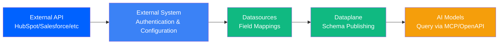
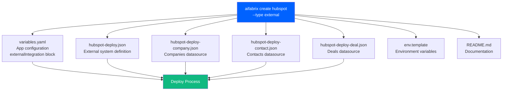
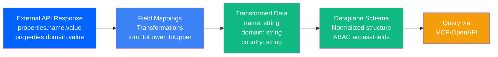

# External Systems Guide

← [Back to Quick Start](quick-start.md)

Connect your AI Fabrix Dataplane to third-party APIs like HubSpot, Salesforce, or any REST API. External systems don't require Docker containers—they're pure integrations that sync data and expose it via MCP/OpenAPI.

## What Are External Systems?

External systems are integrations that connect to third-party APIs and make their data available in your AI Fabrix Dataplane. Unlike regular applications, they:

- **Don't need Docker images** - No containers to build or run
- **Don't need ports** - They're API clients, not servers
- **Sync data automatically** - Pull data from external APIs into your dataplane
- **Expose via MCP/OpenAPI** - Make external data queryable by AI models
- **Support field mappings** - Transform external API data into normalized schemas

**When to use external systems:**
- Integrating with CRM systems (HubSpot, Salesforce)
- Connecting to SaaS APIs (Slack, Teams, GitHub)
- Syncing data from external databases
- Making third-party data available to AI models

**When to use regular applications:**
- Building custom APIs or services
- Running background jobs or workers
- Creating web applications
- Anything that needs a containerized runtime



---

## Quick Start: Create Your First External System

**New to external systems?** Try the interactive wizard:

```bash
aifabrix wizard
```

The wizard guides you through creating external systems with AI-powered configuration generation. See the [Wizard Guide](wizard.md) for details.

**Prefer manual creation?** Follow the steps below to create a HubSpot integration manually.

### Step 1: Create the External System

```bash
aifabrix create hubspot --type external
```

**You'll be asked:**
- System key? *(defaults to app name: `hubspot`)*
- System display name? *HubSpot CRM*
- System description? *HubSpot CRM integration*
- System type? *OpenAPI / MCP / Custom* → Choose **OpenAPI**
- Authentication type? *OAuth2 / API Key / Basic Auth* → Choose **OAuth2**
- Number of datasources? *(1-10)* → Enter **3** (for companies, contacts, deals)

**What gets created:**
```yaml
integration/
  hubspot/
    variables.yaml                    # App configuration
    hubspot-deploy.json              # External system definition
    hubspot-deploy-company.json      # Companies datasource
    hubspot-deploy-contact.json      # Contacts datasource
    hubspot-deploy-deal.json         # Deals datasource
    rbac.yaml                        # RBAC roles and permissions (optional)
    env.template                     # Environment variables
    README.md                        # Documentation
```

All files are in the same folder for easy viewing and management.



### Step 2: Configure Authentication

Edit `integration/hubspot/hubspot-deploy.json` to configure OAuth2. Use standard environment variable references:

```json
{
  "key": "hubspot",
  "displayName": "HubSpot CRM",
  "description": "HubSpot CRM integration",
  "type": "openapi",
  "environment": {
    "baseUrl": "https://api.hubapi.com"
  },
  "authentication": {
    "type": "oauth2",
    "oauth2": {
      "tokenUrl": "{{TOKENURL}}",
      "clientId": "{{CLIENTID}}",
      "clientSecret": "{{CLIENTSECRET}}",
      "scopes": [
        "crm.objects.companies.read",
        "crm.objects.companies.write",
        "crm.objects.contacts.read",
        "crm.objects.contacts.write",
        "crm.objects.deals.read",
        "crm.objects.deals.write"
      ]
    }
  },
  "configuration": [
    {
      "name": "CLIENTID",
      "value": "hubspot-clientidKeyVault",
      "location": "keyvault",
      "required": true
    },
    {
      "name": "CLIENTSECRET",
      "value": "hubspot-clientsecretKeyVault",
      "location": "keyvault",
      "required": true
    },
    {
      "name": "TOKENURL",
      "value": "https://api.hubapi.com/oauth/v1/token",
      "location": "variable",
      "required": true
    }
  ]
}
```

**What this does:**
- `baseUrl` - The API endpoint for HubSpot
- `tokenUrl` - OAuth2 token endpoint (uses `{{TOKENURL}}` variable)
- `clientId` / `clientSecret` - References standard variables `{{CLIENTID}}` and `{{CLIENTSECRET}}`
- `configuration` - Defines variables that can be set via Miso Controller or Dataplane portal interface
- `scopes` - Required OAuth2 permissions

**Important:**
- Standard variables (`CLIENTID`, `CLIENTSECRET`, `TOKENURL`) are managed by the dataplane credentials system—no `portalInput` needed
- Values are set via the Miso Controller or Dataplane portal interface
- The platform automatically manages Key Vault storage—you don't need to manually store secrets
- For custom variables, you can add `portalInput` to configure UI fields (see examples below)

### Step 3: Configure Datasources

Each datasource maps an external entity (company, contact, deal) to your dataplane. Edit the datasource JSON files to configure field mappings.

**Example: `hubspot-deploy-company.json`**

```json
{
  "key": "hubspot-company",
  "systemKey": "hubspot",
  "entityKey": "company",
  "resourceType": "customer",
  "fieldMappings": {
    "accessFields": ["country", "domain"],
    "fields": {
      "name": {
        "expression": "{{properties.name.value}} | trim",
        "type": "string"
      },
      "domain": {
        "expression": "{{properties.domain.value}} | toLower | trim",
        "type": "string"
      },
      "country": {
        "expression": "{{properties.country.value}} | toUpper | trim",
        "type": "string"
      }
    }
  },
  "openapi": {
    "enabled": true,
    "operations": {
      "list": {
        "operationId": "getCompanies",
        "method": "GET",
        "path": "/crm/v3/objects/companies"
      }
    }
  }
}
```

**What this does:**
- Maps HubSpot's nested `properties.name.value` structure to a flat `name` field
- Applies transformations: `trim`, `toLower`, `toUpper`
- Defines `accessFields` for ABAC (Attribute-Based Access Control) filtering
- Configures OpenAPI operations to expose via REST API



### Step 4: Validate Configuration

```bash
# Validate entire integration
aifabrix validate hubspot

# Validate individual files
aifabrix validate integration/hubspot/hubspot-deploy.json
aifabrix validate integration/hubspot/hubspot-deploy-company.json
```

**What happens:**
- Validates JSON syntax
- Checks against schemas (`external-system.schema.json`, `external-datasource.schema.json`)
- Verifies required fields are present
- Checks field mapping expressions are valid

### Step 5: Deploy

```bash
# Login to controller
aifabrix login --controller https://controller.aifabrix.ai --method device --environment dev

# Register application (if not already registered)
aifabrix app register hubspot --environment dev

# Generate deployment JSON
aifabrix json hubspot

# Deploy to controller
aifabrix deploy hubspot --controller https://controller.aifabrix.ai --environment dev
```

**What happens:**
1. `aifabrix json` - Generates application schema structure (combines system + datasources) for pipeline deployment
2. `aifabrix deploy` - Uses the application schema to deploy via Miso Controller pipeline API
3. System is registered in the dataplane
4. Datasources are published and available for querying

**Note:** The `aifabrix json` command generates an internal application schema structure used by the deployment pipeline. Individual JSON files (`hubspot-deploy.json`, `hubspot-deploy-company.json`, etc.) remain in your `integration/` folder and are referenced by the schema.

### Step 6: Verify Deployment

```bash
# List all datasources
aifabrix datasource list --environment dev

# Validate deployed datasource
aifabrix datasource validate hubspot-company --environment dev
```

**Expected output:**
```yaml
✓ External system 'hubspot' deployed
✓ Datasource 'hubspot-company' published
✓ Datasource 'hubspot-contact' published
✓ Datasource 'hubspot-deal' published
```

---

## Configuration Deep Dive

### External System Configuration

The external system JSON (`<app-name>-deploy.json`) defines the connection to the third-party API.

**Required fields:**
- `key` - Unique identifier (lowercase, alphanumeric, hyphens)
- `displayName` - Human-readable name
- `description` - Description of the external system integration (required)
- `type` - `openapi`, `mcp`, or `custom`
- `authentication` - Auth configuration (see below)
- `configuration` - Array of configurable variables (see Configuration section)

**Example structure:**
```json
{
  "key": "hubspot",
  "displayName": "HubSpot CRM",
  "description": "HubSpot CRM integration",
  "type": "openapi",
  "enabled": true,
  "environment": {
    "baseUrl": "https://api.hubapi.com"
  },
  "authentication": { /* see Authentication section */ },
  "configuration": [ /* see Configuration section */ ],
  "openapi": {
    "documentKey": "hubspot-v3",
    "autoDiscoverEntities": false
  },
  "tags": ["crm", "sales", "marketing"]
}
```

### Configuration Array

The `configuration` array defines variables that can be set via the Miso Controller or Dataplane portal interface. This allows users to configure authentication and other settings without editing JSON files.

**Configuration object structure:**
```json
{
  "name": "VARIABLENAME",
  "value": "keyvault-key-name or literal-value",
  "location": "keyvault or variable",
  "required": true,
  "portalInput": {
    "field": "text|password|textarea|select|json",
    "label": "Display Label",
    "placeholder": "Placeholder text",
    "masked": true,
    "options": ["option1", "option2"],
    "validation": {
      "required": true,
      "minLength": 1,
      "maxLength": 100,
      "pattern": "^regex$"
    }
  }
}
```

**Fields:**
- `name` - Variable name (must match `{{VARIABLENAME}}` in authentication block)
- `value` - Key Vault key name (for `location: "keyvault"`) or literal value (for `location: "variable"`)
- `location` - `"keyvault"` (stored securely) or `"variable"` (literal value)
- `required` - Whether the value must be provided
- `portalInput` - **Optional** - UI configuration for custom variables (not needed for standard variables)
  - `field` - Input type: `"password"`, `"text"`, `"textarea"`, `"select"`, `"json"`
  - `label` - Display label in UI
  - `placeholder` - Placeholder text
  - `masked` - Whether to mask the input (for passwords/secrets)
  - `options` - Array of options for `select` field type
  - `validation` - Validation rules (required, minLength, pattern, min, max, etc.)

**Important distinctions:**
- **Standard variables** (`CLIENTID`, `CLIENTSECRET`, `TOKENURL`, `APIKEY`, `USERNAME`, `PASSWORD`, `REDIRECT_URI`) are managed by the dataplane credentials system—**do not include `portalInput`**
- **Custom variables** (any other variable name) can use `portalInput` to configure UI fields in the portal interface

**How it works:**
1. Variables defined in `configuration` can be referenced in `authentication` using `{{VARIABLENAME}}`
2. Standard variables are managed by the dataplane credentials system
3. Custom variables with `portalInput` get UI fields in the portal interface
4. Users set values via the Miso Controller or Dataplane portal interface
5. Values are automatically stored in Key Vault (for `location: "keyvault"`)
6. Values are resolved at deployment time

### Standard Environment Variables

External systems use standard variable names that are **automatically managed by the dataplane credentials system**. These variables do **not** require `portalInput` configuration—they are handled by the platform's credential management.

<!-- markdownlint-disable MD060 -->
| Variable Name      | Description              | Used For              | Example            |
|-------------------|--------------------------|-----------------------|--------------------|
| `{{CLIENTID}}`     | OAuth2 Client ID         | OAuth2 authentication | `{{CLIENTID}}`     |
| `{{CLIENTSECRET}}` | OAuth2 Client Secret     | OAuth2 authentication | `{{CLIENTSECRET}}` |
| `{{TOKENURL}}`     | OAuth2 Token URL         | OAuth2 token endpoint | `{{TOKENURL}}`     |
| `{{APIKEY}}`       | API Key                  | API Key authentication| `{{APIKEY}}`       |
| `{{USERNAME}}`     | Basic Auth Username      | Basic authentication | `{{USERNAME}}`     |
| `{{PASSWORD}}`     | Basic Auth Password      | Basic authentication | `{{PASSWORD}}`     |
| `{{REDIRECT_URI}}` | OAuth2 Redirect URI       | OAuth2 callback URL   | `{{REDIRECT_URI}}` |
<!-- markdownlint-enable MD060 -->

**Important:**
- Standard variables are managed by the dataplane credentials system—no `portalInput` needed
- Values are set via the Miso Controller or Dataplane portal interface
- Values are automatically stored in Key Vault by the platform
- Simply reference them in your `configuration` array without `portalInput`

**Example - Standard variables (no portalInput):**
```json
{
  "configuration": [
    {
      "name": "CLIENTID",
      "value": "hubspot-clientidKeyVault",
      "location": "keyvault",
      "required": true
    },
    {
      "name": "CLIENTSECRET",
      "value": "hubspot-clientsecretKeyVault",
      "location": "keyvault",
      "required": true
    },
    {
      "name": "TOKENURL",
      "value": "https://api.hubapi.com/oauth/v1/token",
      "location": "variable",
      "required": true
    }
  ]
}
```

### Custom Variables with Portal Input

For **custom variables** (non-standard), you can use `portalInput` to configure UI fields in the portal interface. Use any variable name like `{{MYVAR}}` and configure it with `portalInput`.

**Example - Custom variables with portalInput:**
```json
{
  "configuration": [
    {
      "name": "HUBSPOT_API_VERSION",
      "value": "v3",
      "location": "variable",
      "required": false,
      "portalInput": {
        "field": "select",
        "label": "HubSpot API Version",
        "placeholder": "Select API version",
        "options": ["v1", "v2", "v3"],
        "validation": {
          "required": false
        }
      }
    },
    {
      "name": "MAX_PAGE_SIZE",
      "value": "100",
      "location": "variable",
      "required": false,
      "portalInput": {
        "field": "text",
        "label": "Maximum Page Size",
        "placeholder": "100",
        "validation": {
          "required": false,
          "pattern": "^[0-9]+$",
          "min": 1,
          "max": 1000
        }
      }
    },
    {
      "name": "CUSTOM_ENDPOINT",
      "value": "custom-endpointKeyVault",
      "location": "keyvault",
      "required": false,
      "portalInput": {
        "field": "text",
        "label": "Custom API Endpoint",
        "placeholder": "https://api.example.com/custom",
        "masked": false,
        "validation": {
          "required": false,
          "pattern": "^(http|https)://.*$"
        }
      }
    }
  ]
}
```

**When to use custom variables:**
- Configuration options specific to your integration (API version, page size, etc.)
- Optional settings that users should configure via the portal
- Any non-standard variable that needs UI configuration

### Authentication Methods

#### OAuth2

Best for production integrations with user consent flows.

```json
{
  "authentication": {
    "type": "oauth2",
    "oauth2": {
      "tokenUrl": "{{TOKENURL}}",
      "clientId": "{{CLIENTID}}",
      "clientSecret": "{{CLIENTSECRET}}",
      "scopes": ["read", "write"]
    }
  },
  "configuration": [
    {
      "name": "CLIENTID",
      "value": "hubspot-clientidKeyVault",
      "location": "keyvault",
      "required": true
    },
    {
      "name": "CLIENTSECRET",
      "value": "hubspot-clientsecretKeyVault",
      "location": "keyvault",
      "required": true
    },
    {
      "name": "TOKENURL",
      "value": "https://api.example.com/oauth/v1/token",
      "location": "variable",
      "required": true
    }
  ]
}
```

**Note:** Standard variables (`CLIENTID`, `CLIENTSECRET`, `TOKENURL`) don't need `portalInput`—they're managed by the dataplane credentials system.

**Setup steps:**
1. Register OAuth2 app in external system (HubSpot, Salesforce, etc.)
2. Get `clientId` and `clientSecret`
3. Set values via Miso Controller or Dataplane portal interface
4. Configure redirect URI in external system
5. Add required scopes to `scopes` array

#### API Key

Simpler for testing or private APIs.

```json
{
  "authentication": {
    "type": "apikey",
    "apikey": {
      "headerName": "X-API-Key",
      "key": "{{APIKEY}}"
    }
  },
  "configuration": [
    {
      "name": "APIKEY",
      "value": "hubspot-apikeyKeyVault",
      "location": "keyvault",
      "required": true
    }
  ]
}
```

**Note:** Standard variable `APIKEY` doesn't need `portalInput`—it's managed by the dataplane credentials system.

**Setup steps:**
1. Generate API key in external system
2. Set value via Miso Controller or Dataplane portal interface
3. Configure header name (usually `X-API-Key` or `Authorization`)

#### Basic Auth

For simple username/password authentication.

```json
{
  "authentication": {
    "type": "basic",
    "basic": {
      "username": "{{USERNAME}}",
      "password": "{{PASSWORD}}"
    }
  },
  "configuration": [
    {
      "name": "USERNAME",
      "value": "hubspot-usernameKeyVault",
      "location": "keyvault",
      "required": true
    },
    {
      "name": "PASSWORD",
      "value": "hubspot-passwordKeyVault",
      "location": "keyvault",
      "required": true
    }
  ]
}
```

**Note:** Standard variables (`USERNAME`, `PASSWORD`) don't need `portalInput`—they're managed by the dataplane credentials system.

#### Azure AD (AAD)

For Azure Active Directory authentication.

```json
{
  "authentication": {
    "type": "aad",
    "aad": {
      "tenantId": "{{TENANTID}}",
      "clientId": "{{CLIENTID}}",
      "clientSecret": "{{CLIENTSECRET}}",
      "scope": "https://graph.microsoft.com/.default"
    }
  },
  "configuration": [
    {
      "name": "TENANTID",
      "value": "azure-tenantidKeyVault",
      "location": "keyvault",
      "required": true
    },
    {
      "name": "CLIENTID",
      "value": "azure-clientidKeyVault",
      "location": "keyvault",
      "required": true
    },
    {
      "name": "CLIENTSECRET",
      "value": "azure-clientsecretKeyVault",
      "location": "keyvault",
      "required": true
    }
  ]
}
```

**Note:** Standard variables (`CLIENTID`, `CLIENTSECRET`) don't need `portalInput`—they're managed by the dataplane credentials system.

**Setup steps:**
1. Register Azure AD application in Azure Portal
2. Get `tenantId`, `clientId`, and `clientSecret`
3. Set values via Miso Controller or Dataplane portal interface
4. Configure required API permissions and scopes

### RBAC Support (Roles and Permissions)

External systems support RBAC (Role-Based Access Control) configuration via `rbac.yaml`, similar to regular applications. This allows you to define roles and permissions for your external system integration.

**RBAC Configuration:**

External systems can define roles and permissions in two ways:

1. **In `rbac.yaml` file** (recommended for separation of concerns)
2. **Directly in the system JSON file** (`<app-name>-deploy.json`)

When generating deployment JSON with `aifabrix json`, roles/permissions from `rbac.yaml` are automatically merged into the system JSON. Priority: roles/permissions in system JSON > rbac.yaml (if both exist, prefer JSON).

**Example `rbac.yaml`:**

```yaml
roles:
  - name: HubSpot Admin
    value: hubspot-admin
    description: Full access to HubSpot integration
    Groups:
      - "hubspot-admins@company.com"
  
  - name: HubSpot User
    value: hubspot-user
    description: Read-only access to HubSpot data

permissions:
  - name: hubspot:read
    roles:
      - hubspot-user
      - hubspot-admin
    description: Read access to HubSpot data
  
  - name: hubspot:write
    roles:
      - hubspot-admin
    description: Write access to HubSpot data
  
  - name: hubspot:admin
    roles:
      - hubspot-admin
    description: Administrative access to HubSpot integration
```

**Example in System JSON:**

```json
{
  "key": "hubspot",
  "displayName": "HubSpot CRM",
  "description": "HubSpot CRM integration",
  "type": "openapi",
  "roles": [
    {
      "name": "HubSpot Admin",
      "value": "hubspot-admin",
      "description": "Full access to HubSpot integration",
      "Groups": ["hubspot-admins@company.com"]
    },
    {
      "name": "HubSpot User",
      "value": "hubspot-user",
      "description": "Read-only access to HubSpot data"
    }
  ],
  "permissions": [
    {
      "name": "hubspot:read",
      "roles": ["hubspot-user", "hubspot-admin"],
      "description": "Read access to HubSpot data"
    },
    {
      "name": "hubspot:write",
      "roles": ["hubspot-admin"],
      "description": "Write access to HubSpot data"
    }
  ]
}
```

**Role Requirements:**

- `name` - Human-readable role name (required)
- `value` - Role identifier used in JWT and ACL (required, pattern: `^[a-z-]+$`)
- `description` - Role description (required)
- `Groups` - Optional array of Azure AD groups mapped to this role

**Permission Requirements:**

- `name` - Permission identifier (required, pattern: `^[a-z0-9-:]+$`, e.g., `hubspot:read`, `documentstore:write`)
- `roles` - Array of role values that have this permission (required, must reference existing roles)
- `description` - Permission description (required)

**Validation:**

When validating external systems with `aifabrix validate`, the builder:
- Validates `rbac.yaml` structure (if present)
- Validates roles and permissions in system JSON (if present)
- Checks that all role references in permissions exist in the roles array
- Validates role value patterns (`^[a-z-]+$`)
- Validates permission name patterns (`^[a-z0-9-:]+$`)

**Usage:**

```bash
# Generate JSON with rbac.yaml merged
aifabrix json hubspot

# Validate including rbac.yaml
aifabrix validate hubspot

# Split JSON back to component files (extracts roles/permissions to rbac.yml)
aifabrix split-json hubspot
```

**Note:** RBAC configuration is registered with miso-controller during deployment. Roles and permissions are used for access control when querying external system data via MCP/OpenAPI.

### Datasource Configuration

Each datasource maps one entity type from the external system.

**Required fields:**
- `key` - Unique datasource identifier
- `systemKey` - Must match external system `key`
- `entityKey` - Entity identifier in external system
- `fieldMappings` - Field transformation rules

**Resource types:**
- `customer` - Company/organization data
- `contact` - Person/contact data
- `person` - Individual person data
- `document` - Document/file data
- `deal` - Deal/opportunity data

**Example:**
```json
{
  "key": "hubspot-company",
  "displayName": "HubSpot Company",
  "systemKey": "hubspot",
  "entityKey": "company",
  "resourceType": "customer",
  "fieldMappings": {
    "accessFields": ["country"],
    "fields": {
      "name": {
        "expression": "{{properties.name.value}} | trim",
        "type": "string"
      }
    }
  }
}
```

**Note:** Datasource files are named using the `entityKey` field: `<system-key>-deploy-<entity-key>.json`. For example, a datasource with `entityKey: "company"` and `systemKey: "hubspot"` creates the file `hubspot-deploy-company.json`.

### Field Mappings

Field mappings transform external API data into normalized schemas.

**Expression syntax:**
```yaml
{{path.to.value}} | transformation1 | transformation2
```

**Available transformations:**
- `trim` - Remove whitespace
- `toLower` - Convert to lowercase
- `toUpper` - Convert to uppercase
- `default("value")` - Use default if empty
- `toNumber` - Convert to number

**HubSpot example:**
HubSpot uses nested properties:
```json
{
  "properties": {
    "name": { "value": "Acme Corp" },
    "country": { "value": "us" }
  }
}
```

Map to flat structure:
```json
{
  "name": {
    "expression": "{{properties.name.value}} | trim",
    "type": "string"
  },
  "country": {
    "expression": "{{properties.country.value}} | toUpper | trim",
    "type": "string"
  }
}
```

**Access fields:**
Fields listed in `accessFields` are used for ABAC (Attribute-Based Access Control) filtering. These should be fields that identify data ownership or access scope (e.g., `country`, `domain`, `organization`).

### Test Payloads

Test payloads allow you to test field mappings and metadata schemas locally and via integration tests. Add a `testPayload` property to your datasource configuration:

```json
{
  "key": "hubspot-company",
  "systemKey": "hubspot",
  "entityKey": "company",
  "fieldMappings": {
    "fields": {
      "name": {
        "expression": "{{properties.name.value}} | trim",
        "type": "string"
      },
      "country": {
        "expression": "{{properties.country.value}} | toUpper | trim",
        "type": "string"
      }
    }
  },
  "testPayload": {
    "payloadTemplate": {
      "properties": {
        "name": { "value": "Acme Corp" },
        "country": { "value": "us" }
      }
    },
    "expectedResult": {
      "name": "Acme Corp",
      "country": "US"
    }
  }
}
```

**Test Payload Properties:**
- `payloadTemplate` - Sample payload matching the expected API response structure. Used for testing field mappings and metadata schema validation.
- `expectedResult` - (Optional) Expected normalized result after field mapping transformations. Used for validation in unit tests.

**Using Test Payloads:**
- **Unit tests** (`aifabrix test`): Validates field mappings against `payloadTemplate` and compares with `expectedResult` if provided
- **Integration tests** (`aifabrix test-integration`): Sends `payloadTemplate` to dataplane pipeline test API for real validation

**Benefits:**
- Test field mappings locally without API calls
- Validate metadata schemas before deployment
- Catch mapping errors early in development
- Ensure consistent transformation results

### Advanced Datasource Features

The datasource schema supports additional advanced features beyond basic field mappings:

**Execution Engine:**
- `execution.engine` - Choose between `"cip"` (Composable Integration Pipeline, declarative) or `"python"` (custom handlers)
- `execution.cip` - Define CIP operations with steps (fetch, paginate, map, filter, output)
- `execution.python` - Reference Python entrypoint for custom logic

**Capabilities:**
- `capabilities` - Declare which operations are supported (`list`, `get`, `create`, `update`, `delete`)

**Data Quality & Validation:**
- `validation` - Advanced validation rules (repeating values, merge strategies)
- `quality` - Data quality rules (reject conditions, validation operators)
- `indexing` - Indexing and embedding strategy (embedding fields, unique keys, deduplication)

**AI Context:**
- `context` - Natural-language hints for AI agents (semantic tags, synonyms, natural language hints)

**Document Storage:**
- `documentStorage` - Vector storage configuration for document-based datasources

**Sync Configuration:**
- `sync` - Record synchronization rules (pull/push/bidirectional, schedule, batch size)

These features are optional and can be added as needed. See the `external-datasource.schema.json` for complete schema definitions.

### OpenAPI Operations

Configure which API endpoints to expose for each datasource.

```json
{
  "openapi": {
    "enabled": true,
    "documentKey": "hubspot-v3",
    "baseUrl": "https://api.hubapi.com",
    "operations": {
      "list": {
        "operationId": "getCompanies",
        "method": "GET",
        "path": "/crm/v3/objects/companies"
      },
      "get": {
        "operationId": "getCompany",
        "method": "GET",
        "path": "/crm/v3/objects/companies/{companyId}"
      },
      "create": {
        "operationId": "createCompany",
        "method": "POST",
        "path": "/crm/v3/objects/companies"
      },
      "update": {
        "operationId": "updateCompany",
        "method": "PATCH",
        "path": "/crm/v3/objects/companies/{companyId}"
      },
      "delete": {
        "operationId": "deleteCompany",
        "method": "DELETE",
        "path": "/crm/v3/objects/companies/{companyId}"
      }
    },
    "autoRbac": true
  }
}
```

**What this does:**
- `enabled: true` - Enables OpenAPI exposure
- `documentKey` - References registered OpenAPI spec
- `operations` - Maps CRUD operations to API endpoints
- `autoRbac: true` - Auto-generates RBAC permissions (`hubspot.company.list`, `hubspot.company.get`, etc.)

### Exposed Fields

Control which fields are exposed via MCP/OpenAPI.

```json
{
  "exposed": {
    "fields": ["id", "name", "email"],
    "omit": ["internalId", "secret"],
    "readonly": ["createdAt"],
    "groups": {
      "default": ["id", "name"],
      "analytics": ["id", "name", "email", "revenue"]
    }
  }
}
```

**What this does:**
- `fields` - List of fields to expose (default: all fields)
- `omit` - Fields to never expose (overrides `fields`)
- `readonly` - Fields that can't be modified
- `groups` - Logical groupings for different use cases

---

## HubSpot Complete Example

Here's a complete HubSpot integration with companies, contacts, and deals.

### File Structure

```yaml
integration/
  hubspot/
    variables.yaml
    hubspot-deploy.json                    # External system definition
    hubspot-deploy-company.json            # Datasource: entityKey="company"
    hubspot-deploy-contact.json           # Datasource: entityKey="contact"
    hubspot-deploy-deal.json              # Datasource: entityKey="deal"
    rbac.yaml                              # RBAC roles and permissions (optional)
    env.template
```

**File Naming Convention:**
- System file: `<system-key>-deploy.json` (e.g., `hubspot-deploy.json`)
- Datasource files: `<system-key>-deploy-<entity-key>.json` (e.g., `hubspot-deploy-company.json`)
- The `entityKey` comes from the datasource's `entityKey` field in the JSON

### variables.yaml

```yaml
app:
  key: hubspot
  displayName: "HubSpot CRM Integration"
  type: external

externalIntegration:
  schemaBasePath: ./
  systems:
    - hubspot-deploy.json
  dataSources:
    - hubspot-deploy-company.json
    - hubspot-deploy-contact.json
    - hubspot-deploy-deal.json
  autopublish: true
  version: 1.0.0
```

**Important:** Only one system is supported per application. The `systems` array should contain a single entry. Only the first system in the array will be included in the generated `application-schema.json`. Multiple data sources are supported and all will be included.

### hubspot-deploy.json

```json
{
  "key": "hubspot",
  "displayName": "HubSpot CRM",
  "description": "HubSpot CRM integration with OpenAPI support",
  "type": "openapi",
  "enabled": true,
  "environment": {
    "baseUrl": "https://api.hubapi.com"
  },
  "authentication": {
    "type": "oauth2",
    "oauth2": {
      "tokenUrl": "{{TOKENURL}}",
      "clientId": "{{CLIENTID}}",
      "clientSecret": "{{CLIENTSECRET}}",
      "scopes": [
        "crm.objects.companies.read",
        "crm.objects.companies.write",
        "crm.objects.contacts.read",
        "crm.objects.contacts.write",
        "crm.objects.deals.read",
        "crm.objects.deals.write"
      ]
    }
  },
  "configuration": [
    {
      "name": "CLIENTID",
      "value": "hubspot-clientidKeyVault",
      "location": "keyvault",
      "required": true
    },
    {
      "name": "CLIENTSECRET",
      "value": "hubspot-clientsecretKeyVault",
      "location": "keyvault",
      "required": true
    },
    {
      "name": "TOKENURL",
      "value": "https://api.hubapi.com/oauth/v1/token",
      "location": "variable",
      "required": true
    },
    {
      "name": "REDIRECT_URI",
      "value": "hubspot-redirect-uriKeyVault",
      "location": "keyvault",
      "required": false
    },
    {
      "name": "HUBSPOT_API_VERSION",
      "value": "v3",
      "location": "variable",
      "required": false,
      "portalInput": {
        "field": "select",
        "label": "HubSpot API Version",
        "placeholder": "Select API version",
        "options": ["v1", "v2", "v3"],
        "validation": {
          "required": false
        }
      }
    },
    {
      "name": "MAX_PAGE_SIZE",
      "value": "100",
      "location": "variable",
      "required": false,
      "portalInput": {
        "field": "text",
        "label": "Maximum Page Size",
        "placeholder": "100",
        "validation": {
          "required": false,
          "pattern": "^[0-9]+$",
          "min": 1,
          "max": 1000
        }
      }
    }
  ],
  "openapi": {
    "documentKey": "hubspot-v3",
    "autoDiscoverEntities": false
  },
  "tags": ["crm", "sales", "marketing", "hubspot"]
}
```

**Key points:**
- **Standard variables** (`CLIENTID`, `CLIENTSECRET`, `TOKENURL`, `REDIRECT_URI`) are managed by the dataplane credentials system—no `portalInput` needed
- **Custom variables** (`HUBSPOT_API_VERSION`, `MAX_PAGE_SIZE`) use `portalInput` to configure UI fields in the portal interface
- Values are stored in Key Vault automatically by the platform
- Standard variables are set via the dataplane credentials interface
- Custom variables with `portalInput` get UI fields for user configuration

### hubspot-deploy-company.json

See the complete example in `integration/hubspot/hubspot-deploy-company.json` for:
- Full metadata schema for HubSpot company properties
- Field mappings with transformations
- OpenAPI operations configuration
- Exposed fields configuration

### env.template

```bash
# HubSpot OAuth2 Configuration
# Values are set via Miso Controller or Dataplane portal interface
# Key Vault storage is managed automatically by the platform

CLIENTID=kv://hubspot-clientidKeyVault
CLIENTSECRET=kv://hubspot-clientsecretKeyVault
TOKENURL=https://api.hubapi.com/oauth/v1/token
REDIRECT_URI=kv://hubspot-redirect-uriKeyVault
```

**Setup:**
1. Values are set via the Miso Controller or Dataplane portal interface
2. Key Vault storage is managed automatically by the platform
3. Values are resolved at deployment time from the `configuration` array

---

## Development Workflow

### Complete External System Development Workflow

The AI Fabrix Builder supports a complete development workflow for external systems:

1. **Download** - Get existing system from dataplane
2. **Unit Test** - Validate locally without API calls
3. **Integration Test** - Test via dataplane pipeline API
4. **Deploy** - Deploy using application-level workflow

### 1. Download External System from Dataplane

Download an existing external system from the dataplane to your local development environment:

```bash
# Download external system
aifabrix download hubspot --environment dev
```

**What happens:**
- Downloads system configuration from dataplane API
- Downloads all datasource configurations
- Creates `integration/<system-key>/` folder structure
- Generates all development files (variables.yaml, JSON files, env.template, README.md)

**File structure created:**
```yaml
integration/
  hubspot/
    variables.yaml                   # App configuration with externalIntegration block
    hubspot-deploy.json              # External system definition
    hubspot-deploy-company.json      # Companies datasource
    hubspot-deploy-contact.json      # Contacts datasource
    hubspot-deploy-deal.json         # Deals datasource
    rbac.yaml                        # RBAC roles and permissions (optional)
    env.template                     # Environment variables template
    README.md                        # Documentation
```

### 2. Edit Configuration Files

Edit the configuration files in `integration/<system-key>/` to make your changes:
- Update field mappings in datasource JSON files
- Modify authentication configuration
- Add or update test payloads for testing

### 3. Unit Test (Local Validation)

Test your configuration locally without making API calls:

```bash
# Test entire system
aifabrix test hubspot

# Test specific datasource
aifabrix test hubspot --datasource hubspot-company

# Verbose output
aifabrix test hubspot --verbose
```

**What happens:**
- Validates JSON syntax
- Validates against schemas
- Tests field mapping expressions
- Validates metadata schemas against test payloads (if provided)
- Validates relationships

**No API calls are made** - this is pure local validation.

### 4. Integration Test (Via Dataplane)

Test your configuration against the real dataplane pipeline API:

```bash
# Test entire system
aifabrix test-integration hubspot --environment dev

# Test specific datasource
aifabrix test-integration hubspot --environment dev --datasource hubspot-company

# Use custom test payload
aifabrix test-integration hubspot --environment dev --payload ./test-payload.json
```

**What happens:**
- Calls dataplane pipeline test API
- Tests field mappings with real API responses
- Validates metadata schemas
- Tests endpoint connectivity
- Returns detailed validation results

### 5. Deploy to Controller

Deploy using the application-level workflow:

```bash
aifabrix deploy hubspot --controller https://controller.aifabrix.ai --environment dev
```

**What happens:**
1. Generates `application-schema.json` (combines one system + all datasources)
2. Uploads to dataplane via pipeline API
3. Validates changes (optional, can skip with `--skip-validation`)
4. Publishes atomically with rollback support
5. System and datasources are deployed together

**Note:** Only one system per application is supported. If multiple systems are listed in `variables.yaml`, only the first one is included in the generated `application-schema.json`.

## Deployment Workflow

### 1. Configure Authentication Values

Set authentication credentials via the Miso Controller or Dataplane portal interface:

1. Navigate to the external system configuration in the portal
2. Enter OAuth2 credentials (Client ID, Client Secret, Token URL)
3. Values are automatically stored in Key Vault by the platform
4. No manual Key Vault operations required

**Note:** The platform manages Key Vault storage automatically. You only need to provide values via the interface.

### 2. Validate Configuration

```bash
aifabrix validate hubspot
```

### 3. Generate Deployment JSON

```bash
aifabrix json hubspot
```

**What happens:**
- Combines `variables.yaml` with all JSON files
- Generates application schema structure (one system + all datasources) ready for deployment
- Validates all configurations against schemas
- The schema structure is used internally by `aifabrix deploy` command
- **Note:** Only the first system from `externalIntegration.systems` is included. All data sources from `externalIntegration.dataSources` are included.

### 4. Deploy to Controller

```bash
aifabrix deploy hubspot --controller https://controller.aifabrix.ai --environment dev
```

**What happens:**
1. Generates `application-schema.json` (if not already generated)
2. Uses application-level deployment workflow:
   - Upload: `POST /api/v1/pipeline/upload`
   - Validate: `POST /api/v1/pipeline/upload/{uploadId}/validate` (optional, can skip with `--skip-validation`)
   - Publish: `POST /api/v1/pipeline/upload/{uploadId}/publish?generateMcpContract=true`
3. External system and datasources are deployed atomically
4. Field mappings are compiled
5. OpenAPI operations are registered
6. System is ready for querying

**Application-Level Workflow Benefits:**
- Atomic deployment (all or nothing)
- Rollback support
- Change validation before publishing
- Better error handling

### 5. Deploy Individual Datasources (Optional)

You can deploy and test individual datasources:

```bash
# Deploy a single datasource
aifabrix datasource deploy hubspot-company --environment dev --file integration/hubspot/hubspot-deploy-company.json

# This is useful for:
# - Testing individual datasources
# - Incremental deployment
# - Updating specific datasources without redeploying the entire system
```

### 6. Verify Deployment

```bash
# List all datasources
aifabrix datasource list --environment dev

# Validate specific datasource
aifabrix datasource validate hubspot-company --environment dev

# Query via MCP
# (Use MCP client to query hubspot.company.list, etc.)
```

---

## Complete Workflow Example

Here's a complete workflow for developing an external system:

### Download and Modify Existing System

```bash
# 1. Download external system from dataplane
aifabrix download hubspot --environment dev

# 2. Edit configuration files in integration/hubspot/
#    - Update field mappings
#    - Add test payloads
#    - Modify authentication

# 3. Run unit tests (local validation, no API calls)
aifabrix test hubspot

# 4. Run integration tests (via dataplane pipeline API)
aifabrix test-integration hubspot --environment dev

# 5. Deploy back to dataplane (via application-level workflow)
aifabrix deploy hubspot --controller https://controller.aifabrix.ai --environment dev
```

### Create New System from Scratch

```bash
# 1. Create new external system
aifabrix create hubspot --type external

# 2. Edit configuration files in integration/hubspot/
#    - Configure authentication
#    - Set up field mappings
#    - Add test payloads

# 3. Run unit tests
aifabrix test hubspot

# 4. Run integration tests
aifabrix test-integration hubspot --environment dev

# 5. Deploy to dataplane
aifabrix deploy hubspot --controller https://controller.aifabrix.ai --environment dev
```

---

## Common Patterns

### Pattern 1: Nested Properties (HubSpot-style)

Many APIs use nested property structures. Map them to flat fields:

```json
{
  "fieldMappings": {
    "fields": {
      "name": {
        "expression": "{{properties.name.value}} | trim",
        "type": "string"
      }
    }
  }
}
```

### Pattern 2: Array Extraction

Extract first item from array:

```json
{
  "associatedCompany": {
    "expression": "{{associations.companies.results[0].id}}",
    "type": "string"
  }
}
```

### Pattern 3: Multiple Transformations

Chain transformations:

```json
{
  "email": {
    "expression": "{{properties.email.value}} | toLower | trim",
    "type": "string"
  },
  "country": {
    "expression": "{{properties.country.value}} | toUpper | trim",
    "type": "string"
  }
}
```

### Pattern 4: Default Values

Use defaults for optional fields:

```json
{
  "status": {
    "expression": "{{properties.status.value}} | default('active')",
    "type": "string"
  }
}
```

---

## Troubleshooting

**"Validation failed: Invalid JSON"**
→ Check JSON syntax with a JSON validator
→ Ensure all required fields are present
→ Verify field mapping expressions are valid

**"Authentication failed"**
→ Verify Key Vault secrets exist
→ Check kv:// paths match Key Vault secret names
→ Ensure OAuth2 credentials are correct
→ Verify scopes are granted in external system

**"Field mapping error"**
→ Check expression syntax: `{{path}} | transformation`
→ Verify source path exists in API response
→ Test expressions with sample data

**"Deployment failed"**
→ Check controller URL is correct
→ Verify authentication with controller
→ Review deployment logs in controller UI

**"Datasource not appearing"**
→ Check `autopublish: true` in `variables.yaml`
→ Verify datasource JSON files are listed in `dataSources`
→ Check datasource is enabled: `"enabled": true`

**"OpenAPI operations not working"**
→ Verify `documentKey` matches registered OpenAPI spec
→ Check `baseUrl` matches external API
→ Ensure `operationId` matches OpenAPI spec
→ Verify authentication is configured correctly

---

## Next Steps

- [Configuration Reference](configuration.md#external-integration) - Detailed config options
- [CLI Reference](cli-reference.md) - All commands for external systems
- [Pipeline Deployment](.cursor/plans/pipeline.md) - Advanced deployment options
- [Field Mappings Guide](configuration.md#field-mappings) - Advanced mapping patterns

---

## Command Reference

**Download external system:**
```bash
aifabrix download <system-key> --environment <env>
```

**Create external system:**
```bash
aifabrix create <app> --type external
```

**Validate configuration:**
```bash
aifabrix validate <app>
aifabrix validate <file-path>
```

**Unit test (local validation):**
```bash
aifabrix test <app> [--datasource <key>] [--verbose]
```

**Integration test (via dataplane):**
```bash
aifabrix test-integration <app> --environment <env> [--datasource <key>] [--payload <file>]
```

**Generate deployment JSON:**
```bash
aifabrix json <app>
```

**Deploy to controller:**
```bash
aifabrix deploy <app> --controller <url> --environment <env> [--skip-validation]
```

**Deploy individual datasource:**
```bash
aifabrix datasource deploy <datasource-key> --environment <env> --file <path-to-datasource-json>
```

**List datasources:**
```bash
aifabrix datasource list --environment <env>
```

**Validate datasource:**
```bash
aifabrix datasource validate <datasource-key> --environment <env>
```


