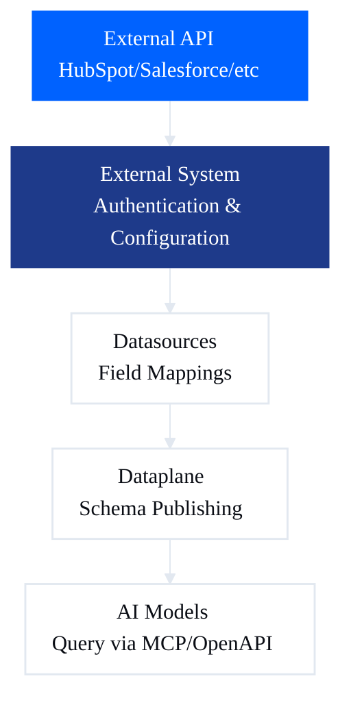
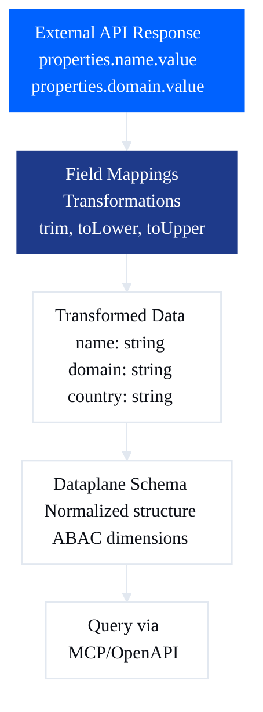

# External Systems Guide

← [Documentation index](README.md)

Connect your AI Fabrix Dataplane to third-party APIs like HubSpot, Salesforce, or any REST API. External systems don't require Docker containers—they're pure integrations that sync data and expose it via MCP/OpenAPI.

## What Are External Systems?

External systems are integrations that connect third-party APIs (HubSpot, Salesforce, Slack, and others) to your AI Fabrix Dataplane. They make external data available for AI models via MCP and OpenAPI—without building or running Docker containers.

### Benefits for Developers

- **Config-only integrations** – Ship integrations as YAML/JSON configuration. No Docker images, ports, or container orchestration.
- **Ready-made templates** – Use templates tailored for **record-based** systems (CRM entities like companies, contacts, deals) or **document-based** systems (documents with metadata and optional vector storage for semantic search).
- **Standardized auth and mappings** – Define authentication, field mappings, and MCP/OpenAPI exposure once. Credentials are managed by the platform.
- **Local validation and testing** – Validate and test field mappings locally before deploy. Catch errors early.

### Record-Based vs Document-Based

External systems can be:

- **Record-based** – CRM-style entities (companies, contacts, deals). Use `entityType: recordStorage` for metadata sync and access rights.
- **Document-based** – Documents with metadata and optional vector storage for semantic search. Use `entityType: documentStorage` or `vectorStore` for metadata-aware vector storage.

### When to Use

| Use external systems for | Use regular applications for |
|--------------------------|------------------------------|
| CRM integration (HubSpot, Salesforce) | Custom APIs or services |
| SaaS APIs (Slack, Teams, GitHub) | Background jobs or workers |
| Syncing data from external databases | Web applications |
| Making third-party data available to AI models | Any containerized runtime |


```mermaid
%%{init: {
  "theme": "base",
  "themeVariables": {
    "fontFamily": "Poppins, Arial Rounded MT Bold, Arial, sans-serif",
    "fontSize": "16px",
    "background": "#FFFFFF",
    "primaryColor": "#F8FAFC",
    "primaryTextColor": "#0B0E15",
    "primaryBorderColor": "#E2E8F0",
    "lineColor": "#E2E8F0",
    "textColor": "#0B0E15",
    "borderRadius": 16
  },
  "flowchart": {
    "curve": "linear",
    "nodeSpacing": 34,
    "rankSpacing": 34,
    "padding": 10
  }
}}%%

flowchart TD

%% =======================
%% Styles
%% =======================
classDef base fill:#FFFFFF,color:#0B0E15,stroke:#E2E8F0,stroke-width:1.5px;
classDef medium fill:#1E3A8A,color:#ffffff,stroke-width:0px;
classDef primary fill:#0062FF,color:#ffffff,stroke-width:0px;

%% =======================
%% Flow
%% =======================
ExternalAPI[External API<br/>HubSpot/Salesforce/etc]:::primary --> ExternalSystem[External System<br/>Authentication & Configuration]:::medium
ExternalSystem --> Datasources[Datasources<br/>Field Mappings]:::base
Datasources --> Dataplane[Dataplane<br/>Schema Publishing]:::base
Dataplane --> AIModels[AI Models<br/>Query via MCP/OpenAPI]:::base
```

---

## Quick Start: Create Your First External System

**New to external systems?** Try the interactive wizard:

```bash
aifabrix wizard
```

The wizard guides you through creating external systems with AI-powered configuration generation. See the [Wizard Guide](wizard.md) for details.

**Next step:** Use the [Wizard](wizard.md) for interactive setup, or continue with the manual steps below.

**Prefer manual creation?** Follow the steps below to create a HubSpot integration manually.

### Step 1: Create the External System

```bash
aifabrix create hubspot --type external
```

**You'll be asked:**
- System key? *(defaults to app name: `hubspot`)*
- System display name? *HubSpot CRM*
- System description? *HubSpot CRM integration*
- System type? *OpenAPI / MCP / Custom* → Choose **OpenAPI**
- Authentication type? *OAuth2 / API Key / Basic Auth* → Choose **OAuth2**
- Number of datasources? *(1-10)* → Enter **3** (for companies, contacts, deals)

**What gets created:**

File names follow `<systemKey>-system.{yaml|json}` and `<systemKey>-datasource-<suffix>.{yaml|json}`. The suffix comes from the datasource key (e.g. `hubspot-company` → `hubspot-datasource-company`). Both `.yaml` and `.json` are supported.

- `aifabrix create --type external` generates `entity1`, `entity2`, etc. (e.g. `hubspot-datasource-entity1.yaml`).
- The wizard can produce semantic names like `company`, `contact`, `deal` for known platforms.

```yaml
integration/
  hubspot/
    application.yaml                        # App configuration
    hubspot-system.yaml                     # External system definition (or .json)
    hubspot-datasource-entity1.yaml         # Datasource 1 (or company/contact/deal via wizard)
    hubspot-datasource-entity2.yaml         # Datasource 2
    hubspot-datasource-entity3.yaml         # Datasource 3
    hubspot-deploy.json                     # Deployment manifest (generated)
    rbac.yaml                               # RBAC roles and permissions (optional)
    env.template                            # Environment variables
    README.md                               # Documentation
```

All files are in the same folder for easy viewing and management.


```mermaid
%%{init: {
  "theme": "base",
  "themeVariables": {
    "fontFamily": "Poppins, Arial Rounded MT Bold, Arial, sans-serif",
    "fontSize": "16px",
    "background": "#FFFFFF",
    "primaryColor": "#F8FAFC",
    "primaryTextColor": "#0B0E15",
    "primaryBorderColor": "#E2E8F0",
    "lineColor": "#E2E8F0",
    "textColor": "#0B0E15",
    "borderRadius": 16
  },
  "flowchart": {
    "curve": "linear",
    "nodeSpacing": 34,
    "rankSpacing": 34,
    "padding": 10
  }
}}%%

flowchart TD

%% =======================
%% Styles
%% =======================
classDef base fill:#FFFFFF,color:#0B0E15,stroke:#E2E8F0,stroke-width:1.5px;
classDef medium fill:#1E3A8A,color:#ffffff,stroke-width:0px;
classDef primary fill:#0062FF,color:#ffffff,stroke-width:0px;

%% =======================
%% Flow
%% =======================
Create[aifabrix create hubspot<br/>--type external]:::primary --> Variables[application.yaml<br/>App configuration<br/>externalIntegration block]:::base
Create --> SystemYaml[hubspot-system.yaml<br/>External system definition]:::base
Create --> Datasource1[hubspot-datasource-entity1.yaml<br/>Datasource 1]:::base
Create --> Datasource2[hubspot-datasource-entity2.yaml<br/>Datasource 2]:::base
Create --> Datasource3[hubspot-datasource-entity3.yaml<br/>Datasource 3]:::base
Create --> DeployManifest[hubspot-deploy.json<br/>Deployment manifest]:::base
Create --> EnvTemplate[env.template<br/>Environment variables]:::base
Create --> Readme[README.md<br/>Documentation]:::base

Variables --> Deploy[Deploy Process]:::base
SystemYaml --> Deploy
Datasource1 --> Deploy
Datasource2 --> Deploy
Datasource3 --> Deploy
```

### Step 2: Configure Authentication

Edit the system file (e.g. `integration/hubspot/hubspot-system.yaml` or `hubspot-system.json`) to configure authentication. Auth is defined in the system file referenced by `externalIntegration.systems` in `application.yaml`.

Authentication uses the **template-based** format from the schema (`authentication.method`, `authentication.variables`, `authentication.security`). See [Authentication](#authentication-methods) for full details.

### Step 3: Configure Datasources

Each datasource maps an external entity (company, contact, deal) to your dataplane. Edit the datasource YAML files to configure field mappings.

**Example: `hubspot-datasource-company.yaml`**

```yaml
key: hubspot-company
systemKey: hubspot
entityType: recordStorage
resourceType: customer
fieldMappings:
  dimensions:
    country: metadata.country
    domain: metadata.domain
  attributes:
    name:
      expression: "{{properties.name.value}} | trim"
      type: string
      indexed: false
    domain:
      expression: "{{properties.domain.value}} | toLower | trim"
      type: string
      indexed: false
    country:
      expression: "{{properties.country.value}} | toUpper | trim"
      type: string
      indexed: true
openapi:
  enabled: true
  operations:
    list:
      operationId: getCompanies
      method: GET
      path: /crm/v3/objects/companies
```

**What this does:**
- Maps HubSpot's nested `properties.name.value` structure to a flat `name` field
- Applies transformations: `trim`, `toLower`, `toUpper`
- Defines `dimensions` for ABAC (Attribute-Based Access Control) filtering using dimensions-first model
- Configures OpenAPI operations to expose via REST API


```mermaid
%%{init: {
  "theme": "base",
  "themeVariables": {
    "fontFamily": "Poppins, Arial Rounded MT Bold, Arial, sans-serif",
    "fontSize": "16px",
    "background": "#FFFFFF",
    "primaryColor": "#F8FAFC",
    "primaryTextColor": "#0B0E15",
    "primaryBorderColor": "#E2E8F0",
    "lineColor": "#E2E8F0",
    "textColor": "#0B0E15",
    "borderRadius": 16
  },
  "flowchart": {
    "curve": "linear",
    "nodeSpacing": 34,
    "rankSpacing": 34,
    "padding": 10
  }
}}%%

flowchart TD

%% =======================
%% Styles
%% =======================
classDef base fill:#FFFFFF,color:#0B0E15,stroke:#E2E8F0,stroke-width:1.5px;
classDef medium fill:#1E3A8A,color:#ffffff,stroke-width:0px;
classDef primary fill:#0062FF,color:#ffffff,stroke-width:0px;

%% =======================
%% Flow
%% =======================
ExternalAPI[External API Response<br/>properties.name.value<br/>properties.domain.value]:::primary --> FieldMappings[Field Mappings<br/>Transformations<br/>trim, toLower, toUpper]:::medium
FieldMappings --> TransformedData[Transformed Data<br/>name: string<br/>domain: string<br/>country: string]:::base
TransformedData --> DataplaneSchema[Dataplane Schema<br/>Normalized structure<br/>ABAC dimensions]:::base
DataplaneSchema --> Query[Query via<br/>MCP/OpenAPI]:::base
```

### Step 4: Validate Configuration

```bash
# Validate entire integration (path resolved: integration first, then builder)
aifabrix validate hubspot

# Validate individual files
aifabrix validate integration/hubspot/hubspot-system.yaml
aifabrix validate integration/hubspot/hubspot-datasource-company.yaml
aifabrix validate integration/hubspot/hubspot-datasource-contact.yaml
aifabrix validate integration/hubspot/hubspot-datasource-deal.yaml
```

**What happens:**
- Validates YAML syntax
- Checks against schemas (`external-system.schema.json`, `external-datasource.schema.json`)
- Verifies required fields are present
- Checks field mapping expressions are valid

> **Note:** For some external integrations, `aifabrix validate <app>` may fail. If that happens, validate the individual files (see Troubleshooting below).

### Step 5: Deploy

```bash
# Login to controller
aifabrix login --controller https://controller.aifabrix.dev --method device --environment dev

# Deploy to controller (path resolved: integration first, then builder; no app register needed for external)
aifabrix deploy hubspot
```

**What happens:**
1. `aifabrix validate` - Validates components and generates full deployment manifest
2. `aifabrix json` - Generates `<systemKey>-deploy.json` deployment manifest (combines system + datasources) for pipeline deployment
3. `aifabrix deploy <app>` - Resolves app path (integration first, then builder); deploys from the resolved path via Miso Controller pipeline API (no app register needed for external; controller creates and deploys automatically)
4. System is registered in the dataplane
5. Datasources are published and available for querying

**Note:** The `aifabrix json` command generates `<systemKey>-deploy.json` deployment manifest. Individual component files (`hubspot-system.yaml`, `hubspot-datasource-company.yaml`, etc.) remain in your `integration/` folder and are referenced in `application.yaml`.

> **Note:** The `internal` property is a **top-level property of the external system object** in the system file (e.g. `hubspot-system.yaml` or `hubspot-system.json`). When `internal: true`, the integration is deployed at dataplane startup. This is for template- or platform-maintained integrations; customers typically use the template system rather than editing YAML manually. See [Troubleshooting](#troubleshooting).

### Step 6: Verify Deployment

```bash
# List all datasources
aifabrix datasource list

# Validate deployed datasource
aifabrix datasource validate hubspot-company
```

**Expected output:**
```yaml
✓ External system 'hubspot' deployed
✓ Datasource 'hubspot-company' published
✓ Datasource 'hubspot-contact' published
✓ Datasource 'hubspot-deal' published
```

---

## Configuration Deep Dive

### External System Configuration

The external system file (`<systemKey>-system.yaml` or `-system.json`) defines the connection to the third-party API. Auth is read from this system file, not from a separate file.

**Required fields:**
- `key` - Unique identifier (lowercase, alphanumeric, hyphens)
- `displayName` - Human-readable name
- `description` - Description of the external system integration (required)
- `type` - `openapi`, `mcp`, or `custom`
- `authentication` - Template-based auth (see [Authentication Methods](#authentication-methods))
- `configuration` - Array of configurable variables for custom/non-credential settings (see [Configuration Array](#configuration-array))

**Example structure:**
```yaml
key: hubspot
displayName: HubSpot CRM
description: HubSpot CRM integration
type: openapi
enabled: true
authentication:
  method: oauth2
  variables:
    baseUrl: "https://api.hubapi.com"
    tokenUrl: "https://api.hubapi.com/oauth/v1/token"
    scope: "crm.objects.companies.read crm.objects.contacts.read crm.objects.deals.read"
  security:
    clientId: "kv://hubspot-clientid"
    clientSecret: "kv://hubspot-clientsecret"
openapi:
  documentKey: hubspot-v3
  autoDiscoverEntities: false
tags:
  - crm
  - sales
  - marketing
```

### Configuration Array

The `configuration` array defines **custom variables** (non-auth) that can be set via the Miso Controller or Dataplane portal. Auth secrets go in `authentication.security` as `kv://` references—they are not listed in `configuration`.

**Configuration object structure:**
```yaml
name: VARIABLENAME
value: keyvault-key-name or literal-value
location: keyvault or variable
required: true
portalInput:
  field: text|password|textarea|select|json
  label: Display Label
  placeholder: Placeholder text
  masked: true
  options: [option1, option2]
  validation: { required, minLength, maxLength, pattern }
```

**Authentication vs configuration:** `authentication` uses `method`, `variables` (non-secret config), and `security` (kv:// refs only). Values in `security` are stored in Key Vault and managed by the platform. Custom integration settings (e.g. API version, page size) go in `configuration` with optional `portalInput` for UI fields.

**Environment promotions:** Different values per environment (dev/tst/pro) are managed by the controller. See [Deployment key](configuration/deployment-key.md).

### Custom Variables with Portal Input

For **custom variables** (non-auth), use `portalInput` to configure UI fields in the portal:
```yaml
configuration:
  - name: HUBSPOT_API_VERSION
    value: v3
    location: variable
    required: false
    portalInput:
      field: select
      label: HubSpot API Version
      placeholder: Select API version
      options:
        - v1
        - v2
        - v3
      validation:
        required: false
  - name: MAX_PAGE_SIZE
    value: "100"
    location: variable
    required: false
    portalInput:
      field: text
      label: Maximum Page Size
      placeholder: "100"
      validation:
        required: false
        pattern: "^[0-9]+$"
        minLength: 1
        maxLength: 1000
  - name: CUSTOM_ENDPOINT
    value: custom-endpointKeyVault
    location: keyvault
    required: false
    portalInput:
      field: text
      label: Custom API Endpoint
      placeholder: https://api.example.com/custom
      masked: false
      validation:
        required: false
        pattern: "^(http|https)://.*$"
```

**When to use custom variables:**
- Configuration options specific to your integration (API version, page size, etc.)
- Optional settings that users should configure via the portal
- Any non-standard variable that needs UI configuration

### Authentication Methods

Authentication uses the **template-based** format: `method`, `variables` (non-secret config), and `security` (secret-bearing keys as `kv://` references only). When `method` is not `none`, `variables` must include `baseUrl`. On deploy, a credential is created with key `authentication.credentialKey` or `<systemKey>-cred`.

**Supported methods:** `oauth2`, `apikey`, `basic`, `aad`, `none`, `queryParam`, `oidc`, `hmac`

#### OAuth2

```yaml
authentication:
  method: oauth2
  variables:
    baseUrl: "https://api.example.com"
    tokenUrl: "https://api.example.com/oauth/token"
    scope: "read write"
  security:
    clientId: "kv://myapp-oauth2-client-id"
    clientSecret: "kv://myapp-oauth2-client-secret"
```

Register OAuth2 app in the external system, create Key Vault entries for `clientId` and `clientSecret`, and configure the dataplane callback URL. Redirect URI is managed by the dataplane.

#### API Key

```yaml
authentication:
  method: apikey
  variables:
    baseUrl: "https://api.example.com"
    headerName: "X-API-Key"
  security:
    apiKey: "kv://myapp-api-key"
```

#### Basic Auth

```yaml
authentication:
  method: basic
  variables:
    baseUrl: "https://api.example.com"
  security:
    username: "kv://myapp-username"
    password: "kv://myapp-password"
```

#### Azure AD (AAD)

```yaml
authentication:
  method: aad
  variables:
    baseUrl: "https://graph.microsoft.com"
    tenantId: "your-tenant-id"
    scope: "https://graph.microsoft.com/.default"
  security:
    clientId: "kv://myapp-aad-client-id"
    clientSecret: "kv://myapp-aad-client-secret"
```

Register Azure AD app, create Key Vault entries, and configure API permissions.

**Credential update policy:** Credential *structure* (type, fields) cannot be changed via the Credential API. Structure changes must go through upload/publish—update the authentication template in your system config and run `aifabrix upload`. Only secret *values* can be updated via the API. Updates are locked when the credential is attached to an external system. See the dataplane knowledgebase for the full policy.

**Shared credentials:** Multiple systems can reference the same credential by key. When publishing with `writeOnce: false`, structure updates affect all systems using that credential. Use `writeOnce: true` when sharing to avoid accidental overwrite.

### RBAC Support (Roles and Permissions)

External systems support RBAC (Role-Based Access Control) configuration via `rbac.yaml`, similar to regular applications. This allows you to define roles and permissions for your external system integration.

**RBAC Configuration:**

External systems can define roles and permissions in two ways:

1. **In `rbac.yaml` file** (recommended for separation of concerns)
2. **Directly in the system YAML file** (`<systemKey>-system.yaml`)

When generating deployment JSON with `aifabrix json`, roles/permissions from `rbac.yaml` are automatically merged into the system YAML. Priority: roles/permissions in system YAML > rbac.yaml (if both exist, prefer system YAML).

**Example `rbac.yaml`:**

```yaml
roles:
  - name: HubSpot Admin
    value: hubspot-admin
    description: Full access to HubSpot integration
    groups:
      - "hubspot-admins@company.com"
  
  - name: HubSpot User
    value: hubspot-user
    description: Read-only access to HubSpot data

permissions:
  - name: hubspot:read
    roles:
      - hubspot-user
      - hubspot-admin
    description: Read access to HubSpot data
  
  - name: hubspot:write
    roles:
      - hubspot-admin
    description: Write access to HubSpot data
  
  - name: hubspot:admin
    roles:
      - hubspot-admin
    description: Administrative access to HubSpot integration
```

**Example in system YAML:**

```yaml
key: hubspot
displayName: HubSpot CRM
description: HubSpot CRM integration
type: openapi
roles:
  - name: HubSpot Admin
    value: hubspot-admin
    description: Full access to HubSpot integration
    groups:
      - hubspot-admins@company.com
  - name: HubSpot User
    value: hubspot-user
    description: Read-only access to HubSpot data
permissions:
  - name: hubspot:read
    roles:
      - hubspot-user
      - hubspot-admin
    description: Read access to HubSpot data
  - name: hubspot:write
    roles:
      - hubspot-admin
    description: Write access to HubSpot data
```

**Role Requirements:**

- `name` - Human-readable role name (required)
- `value` - Role identifier used in JWT and ACL (required, pattern: `^[a-z-]+$`)
- `description` - Role description (required)
- `groups` - Optional array of Azure AD groups mapped to this role

**Permission Requirements:**

- `name` - Permission identifier (required, pattern: `^[a-z0-9-:]+$`, e.g., `hubspot:read`, `documentstore:write`)
- `roles` - Array of role values that have this permission (required, must reference existing roles)
- `description` - Permission description (required)

**Validation:**

When validating external systems with `aifabrix validate`, the builder:
- Validates `rbac.yaml` structure (if present)
- Validates roles and permissions in system YAML (if present)
- Checks that all role references in permissions exist in the roles array
- Validates role value patterns (`^[a-z-]+$`)
- Validates permission name patterns (`^[a-z0-9-:]+$`)

**Usage:**

```bash
# Generate JSON with rbac.yaml merged
aifabrix json hubspot

# Validate including rbac.yaml
aifabrix validate hubspot

# Split JSON back to component files (extracts roles/permissions to rbac.yaml)
aifabrix split-json hubspot
```

**Note:** RBAC configuration is registered with miso-controller during deployment. Roles and permissions are used for access control when querying external system data via MCP/OpenAPI.

### Datasource Configuration

Each datasource maps one entity type from the external system.

**Required fields:**
- `key` - Unique datasource identifier
- `systemKey` - Must match external system `key`
- `entityType` - Entity type identifier; validated against the schema enum. Allowed values (from `lib/schema/external-datasource.schema.json`): `document-storage`, `documentStorage`, `vector-store`, `vectorStore`, `record-storage`, `recordStorage`, `message-service`, `messageService`, `none`. Defines storage semantics and which type schema is used for validation (e.g. `documentStorage` → document-storage schema).
- `resourceType` - Resource type classification (pattern: `^[a-z0-9-]+$`, e.g., "customer", "contact", "deal")
- `fieldMappings` - Field transformation rules with dimensions and attributes

**Resource types (common values):**
- `customer` - Company/organization data
- `contact` - Person/contact data
- `deal` - Business deal/opportunity data
- `document` - Document/file data
- `person` - Individual person data
- `record` - Generic record data

**Note:** `resourceType` is a free-form string matching the pattern `^[a-z0-9-]+$`. Any valid lowercase alphanumeric string with hyphens is allowed.
- `person` - Individual person data
- `document` - Document/file data
- `deal` - Deal/opportunity data

**Example:**
```json
{
  "key": "hubspot-company",
  "displayName": "HubSpot Company",
  "systemKey": "hubspot",
  "entityType": "company",
  "resourceType": "customer",
  "fieldMappings": {
    "dimensions": {
      "country": "metadata.country"
    },
    "attributes": {
      "name": {
        "expression": "{{properties.name.value}} | trim",
        "type": "string",
        "indexed": false
      }
    }
  }
}
```

**Note:** Datasource files are named using the datasource key: `<system-key>-datasource-<datasource-key>.yaml`. For example, a datasource with `key: "hubspot-company"` and `systemKey: "hubspot"` creates the file `hubspot-datasource-company.yaml`.

#### entityType enum

The `entityType` field is validated against the schema enum. Allowed values (from `lib/schema/external-datasource.schema.json`):

| Value | Description |
|-------|-------------|
| `document-storage`, `documentStorage` | Document storage with vector storage |
| `vector-store`, `vectorStore` | External vector storage system |
| `record-storage`, `recordStorage` | Record-based system with metadata sync and access rights |
| `message-service`, `messageService` | Message service (Slack, Teams, Email) |
| `none` | Uses external system data directly or connects other data sources |

Both camelCase and kebab-case are accepted. The field determines which type schema is used for validation (e.g. `documentStorage` → document-storage schema).

**Example:**
```yaml
key: hubspot-documents
entityType: documentStorage
resourceType: document
systemKey: hubspot
documentStorage:
  enabled: true
  binaryOperationRef: get
```

In this example, `entityType="documentStorage"` causes `documentStorage` to validate against `type/document-storage.json`.

#### entityType and Datasource Generation

The `entityType` field drives how datasource files are generated. When you create or add datasources (via `aifabrix create` or the wizard), generators produce YAML/JSON tailored to the chosen `entityType`:

- **recordStorage** – Record-based entities (companies, contacts, deals). Generated content includes dimensions, attributes, and OpenAPI operation stubs.
- **documentStorage** – Document entities with optional vector storage. Generated content includes documentStorage blocks and metadata schema stubs.
- **vectorStore** – External vector storage. Generated content includes vector-specific configuration stubs.
- **messageService** – Message services (Slack, Teams). Generated content includes message-related blocks.
- **none** – Minimal structure; uses external data directly.

Generated datasource files may include **commented-out optional sections** (e.g. `documentStorage`, `sync`, `capabilities`). You can uncomment the sections you need or delete the rest. This keeps generated files ready-made while letting you adapt them quickly.

### Field Mappings

Field mappings transform external API data into normalized schemas.

**Expression syntax:**
```yaml
{{path.to.value}} | transformation1 | transformation2
```

**Available transformations:**
- `trim` - Remove whitespace
- `toLower` - Convert to lowercase
- `toUpper` - Convert to uppercase
- `default("value")` - Use default if empty
- `toNumber` - Convert to number

**HubSpot example:**
HubSpot uses nested properties:
```yaml
properties:
  name:
    value: Acme Corp
  country:
    value: us
```

Map to flat structure:
```yaml
name:
  expression: "{{properties.name.value}} | trim"
  type: string
country:
  expression: "{{properties.country.value}} | toUpper | trim"
  type: string
```

**Dimensions:**
Dimensions are used for ABAC (Attribute-Based Access Control) filtering using the dimensions-first model. The `dimensions` object maps dimension keys (from the Dimension Catalog) to attribute paths (e.g., `metadata.country`, `metadata.domain`). Dimensions are automatically indexed for efficient filtering.

**Example:**
```yaml
fieldMappings:
  dimensions:
    country: metadata.country
    department: metadata.department
    organization: metadata.organization
  attributes:
    country:
      expression: "{{properties.country.value}} | toUpper"
      type: string
      indexed: false
```

Dimensions should identify data ownership or access scope (e.g., `country`, `domain`, `organization`).

**Indexed attributes:**
The `indexed` property in attribute definitions controls whether a database index is created for that attribute. Set `indexed: true` for attributes that are frequently used in queries or filters. Dimensions are automatically indexed (no `indexed` property needed).

**Example:**
```yaml
fieldMappings:
  attributes:
    id:
      expression: "{{id}}"
      type: string
      indexed: true
    name:
      expression: "{{properties.name.value}} | trim"
      type: string
      indexed: false
```

**Primary key / link (recordRef):** Links between entities are defined using a primary key or record reference. The concept is named **recordRef** (camelCase). In expressions, use the prefix `record_ref:<entityType>` (e.g. `record_ref:customer`) to define the link. The schema accepts `record_ref:` in expressions (snake_case).

**Example:**
```yaml
fieldMappings:
  attributes:
    customerId:
      expression: record_ref:customer
      type: string
    dealId:
      expression: record_ref:deal
      type: string
```

The `record_ref:` prefix must be followed by a valid entity type (pattern: `^[a-z0-9-]+$`).

### Test Payloads

Test payloads allow you to test field mappings and metadata schemas locally and via integration tests. Add a `testPayload` property to your datasource configuration. For full detail on test payload format, unit vs integration tests, and troubleshooting, see [External Integration Testing](commands/external-integration-testing.md).

```yaml
key: hubspot-company
systemKey: hubspot
entityType: recordStorage
fieldMappings:
  dimensions:
    country: metadata.country
  attributes:
    name:
      expression: "{{properties.name.value}} | trim"
      type: string
      indexed: false
    country:
      expression: "{{properties.country.value}} | toUpper | trim"
      type: string
      indexed: false
testPayload:
  payloadTemplate:
    properties:
      name:
        value: Acme Corp
      country:
        value: us
  expectedResult:
    name: Acme Corp
    country: US
```

**Test Payload Properties:**
- `payloadTemplate` - Sample payload matching the expected API response structure. Used for testing field mappings and metadata schema validation.
- `expectedResult` - (Optional) Expected normalized result after field mapping transformations. Used for validation in unit tests.

**Using Test Payloads:**
- **Unit tests** (`aifabrix test`): Validates field mappings against `payloadTemplate` and compares with `expectedResult` if provided
- **Integration tests** (`aifabrix test-integration`): Sends `payloadTemplate` to dataplane pipeline test API for real validation

**Benefits:**
- Test field mappings locally without API calls
- Validate metadata schemas before deployment
- Catch mapping errors early in development
- Ensure consistent transformation results

### Advanced Datasource Features

The datasource schema supports additional advanced features beyond basic field mappings:

**Execution Engine:**
- `execution.engine` - Choose between `"cip"` (Composable Integration Pipeline, declarative) or `"python"` (custom handlers)
- `execution.cip` - Define CIP operations with steps (fetch, paginate, map, filter, output)
- `execution.python` - Reference Python entrypoint for custom logic

**Capabilities:**
- `capabilities` - Declare which operations are supported (`list`, `get`, `create`, `update`, `delete`)

**Data Quality & Validation:**
- `validation` - Advanced validation rules (repeating values, merge strategies)
- `quality` - Data quality rules (reject conditions, validation operators)
- `indexing` - Indexing and embedding strategy (embedding fields, unique keys, deduplication)

**AI Context:**
- `context` - Natural-language hints for AI agents (semantic tags, synonyms, natural language hints)

**Document Storage:**
- `documentStorage` - Vector storage configuration for document-based datasources. The type schema used for validation is determined by the `entityType` field (e.g., `entityType: documentStorage` maps to `type/document-storage.json`)

**Sync Configuration:**
- `sync` - Record synchronization rules (pull/push/bidirectional, schedule, batch size)

These features are optional and can be added as needed. See the `external-datasource.schema.json` for complete schema definitions.

### OpenAPI Operations

Configure which API endpoints to expose for each datasource.

```yaml
openapi:
  enabled: true
  documentKey: hubspot-v3
  baseUrl: https://api.hubapi.com
  operations:
    list:
      operationId: getCompanies
      method: GET
      path: /crm/v3/objects/companies
    get:
      operationId: getCompany
      method: GET
      path: /crm/v3/objects/companies/{companyId}
    create:
      operationId: createCompany
      method: POST
      path: /crm/v3/objects/companies
    update:
      operationId: updateCompany
      method: PATCH
      path: /crm/v3/objects/companies/{companyId}
    delete:
      operationId: deleteCompany
      method: DELETE
      path: /crm/v3/objects/companies/{companyId}
  autoRbac: true
```

**What this does:**
- `enabled: true` - Enables OpenAPI exposure
- `documentKey` - References registered OpenAPI spec
- `operations` - Maps CRUD operations to API endpoints
- `autoRbac: true` - Auto-generates RBAC permissions (`hubspot.company.list`, `hubspot.company.get`, etc.)

### Exposed Attributes

Control which attributes are exposed via MCP/OpenAPI.

```yaml
exposed:
  attributes:
    - id
    - name
    - email
  omit:
    - internalId
    - secret
  readonly:
    - createdAt
  groups:
    default:
      - id
      - name
    analytics:
      - id
      - name
      - email
      - revenue
```

**What this does:**
- `attributes` - List of attributes to expose (default: all attributes)
- `omit` - Attributes to never expose (overrides `attributes`)
- `readonly` - Attributes that can't be modified
- `groups` - Logical groupings for different use cases

---

## HubSpot Complete Example

Here's a complete HubSpot integration with companies, contacts, and deals.

### File Structure

```yaml
integration/
  hubspot/
    application.yaml
    hubspot-system.yaml                     # External system definition
    hubspot-datasource-company.yaml         # Datasource: key="hubspot-company"
    hubspot-datasource-contact.yaml         # Datasource: key="hubspot-contact"
    hubspot-datasource-deal.yaml            # Datasource: key="hubspot-deal"
    hubspot-deploy.json                     # Deployment manifest (generated)
    rbac.yaml                               # RBAC roles and permissions (optional)
    env.template
```

**File Naming Convention:**
- System file: `<system-key>-system.yaml` (e.g., `hubspot-system.yaml`)
- Datasource files: `<system-key>-datasource-<datasource-key>.yaml` (e.g., `hubspot-datasource-company.yaml`)
- Deployment manifest: `<system-key>-deploy.json` (e.g., `hubspot-deploy.json`) - generated by `aifabrix json`
- The `entityType` comes from the datasource's `entityType` field in the YAML

### application.yaml

```yaml
app:
  key: hubspot
  displayName: "HubSpot CRM Integration"
  type: external

externalIntegration:
  schemaBasePath: ./
  systems:
    - hubspot-system.yaml
  dataSources:
    - hubspot-datasource-company.yaml
    - hubspot-datasource-contact.yaml
    - hubspot-datasource-deal.yaml
  autopublish: true
  version: 1.0.0
```

**Important:** Only one system is supported per application. The `systems` array should contain a single entry. Only the first system in the array will be included in the generated `<systemKey>-deploy.json`. Multiple data sources are supported and all will be included.

### hubspot-system.yaml

```yaml
key: hubspot
displayName: HubSpot CRM
description: HubSpot CRM integration with OpenAPI support
type: openapi
enabled: true
authentication:
  method: oauth2
  variables:
    baseUrl: "https://api.hubapi.com"
    tokenUrl: "https://api.hubapi.com/oauth/v1/token"
    scope: "crm.objects.companies.read crm.objects.contacts.read crm.objects.deals.read"
  security:
    clientId: "kv://hubspot-clientid"
    clientSecret: "kv://hubspot-clientsecret"
configuration:
  - name: HUBSPOT_API_VERSION
    value: v3
    location: variable
    required: false
    portalInput:
      field: select
      label: HubSpot API Version
      placeholder: Select API version
      options:
        - v1
        - v2
        - v3
      validation:
        required: false
  - name: MAX_PAGE_SIZE
    value: "100"
    location: variable
    required: false
    portalInput:
      field: text
      label: Maximum Page Size
      placeholder: "100"
      validation:
        required: false
        pattern: "^[0-9]+$"
        minLength: 1
        maxLength: 1000
openapi:
  documentKey: hubspot-v3
  autoDiscoverEntities: false
tags:
  - crm
  - sales
  - marketing
  - hubspot
```

**Key points:**
- Auth secrets (`clientId`, `clientSecret`) are in `authentication.security` as `kv://` references
- Custom variables (`HUBSPOT_API_VERSION`, `MAX_PAGE_SIZE`) are in `configuration` with `portalInput` for portal UI

### hubspot-datasource-company.yaml

See the complete example in `integration/hubspot/hubspot-datasource-company.yaml` for:
- Full metadata schema for HubSpot company properties
- Field mappings with transformations
- OpenAPI operations configuration
- Exposed fields configuration

### env.template

```bash
# HubSpot OAuth2 - Key Vault references for authentication.security
# Values are stored in Key Vault and managed by the platform

# Optional: document kv:// keys used in authentication.security for local dev
# hubspot-clientid, hubspot-clientsecret
```

Auth secrets are defined in `authentication.security` as `kv://` references. The platform creates the credential on deploy and resolves values at runtime.

---

## Development Workflow

### Complete External System Development Workflow

The AI Fabrix Builder supports a complete development workflow for external systems:

1. **Download** - Get existing system from dataplane
2. **Unit Test** - Validate locally without API calls
3. **Integration Test** - Test via dataplane pipeline API
4. **Deploy** - Deploy using application-level workflow

### 1. Download External System from Dataplane

Download an existing external system from the dataplane to your local development environment:

```bash
# Download external system
aifabrix download hubspot
```

**What happens:**
- Downloads system configuration from dataplane API
- Downloads all datasource configurations
- Creates `integration/<system-key>/` folder structure
- Generates all development files (application.yaml, YAML files, env.template, README.md)

**File structure created:**
```yaml
integration/
  hubspot/
    application.yaml                   # App configuration with externalIntegration block
    hubspot-system.yaml                # External system definition
    hubspot-datasource-company.yaml    # Companies datasource
    hubspot-datasource-contact.yaml    # Contacts datasource
    hubspot-datasource-deal.yaml       # Deals datasource
    hubspot-deploy.json                # Deployment manifest (generated)
    rbac.yaml                          # RBAC roles and permissions (optional)
    env.template                       # Environment variables template
    README.md                          # Documentation
```

### 2. Edit Configuration Files

Edit the configuration files in `integration/<system-key>/` to make your changes:
- Update field mappings in datasource YAML files
- Modify authentication configuration
- Add or update test payloads for testing

### 3. Unit Test (Local Validation)

Test your configuration locally without making API calls:

```bash
# Test entire system
aifabrix test hubspot

# Test specific datasource
aifabrix test hubspot --datasource hubspot-company

# Verbose output
aifabrix test hubspot --verbose
```

**What happens:**
- Validates YAML syntax
- Validates against schemas
- Tests field mapping expressions
- Validates metadata schemas against test payloads (if provided)
- Validates relationships

**No API calls are made** - this is pure local validation.

### 4. Integration Test (Via Dataplane)

Test your configuration against the real dataplane pipeline API:

```bash
# Test entire system
aifabrix test-integration hubspot

# Test specific datasource
aifabrix test-integration hubspot --datasource hubspot-company

# Use custom test payload
aifabrix test-integration hubspot --payload ./test-payload.json
```

**What happens:**
- Calls dataplane pipeline test API
- Tests field mappings with real API responses
- Validates metadata schemas
- Tests endpoint connectivity
- Returns detailed validation results

### 5. Deploy to Controller

Deploy using the application-level workflow:

```bash
aifabrix deploy hubspot
```

**What happens:** The CLI resolves the app path (integration first, then builder) and sends the deployment to the **Miso Controller** (pipeline API). When the app is in `integration/<app>/`, no app register is needed. The controller then deploys to the dataplane (or target environment). We do not deploy directly to the dataplane from the CLI for app-level deploy; the controller orchestrates deployment.

1. Generates `<systemKey>-deploy.json` (combines one system + all datasources)
2. Sends to controller via pipeline API (validate then deploy)
3. Controller deploys to dataplane; validates and publishes
4. System and datasources are deployed together

**Note:** Only one system per application is supported. If multiple systems are listed in `application.yaml`, only the first one is included in the generated `<systemKey>-deploy.json`.

## Deployment Workflow

### 1. Configure Authentication Values

Set authentication credentials via the Miso Controller or Dataplane portal interface:

1. Navigate to the external system configuration in the portal
2. Enter OAuth2 credentials (Client ID, Client Secret, Token URL)
3. Values are automatically stored in Key Vault by the platform
4. No manual Key Vault operations required

**Note:** The platform manages Key Vault storage automatically. You only need to provide values via the interface.

### 2. Validate Configuration

```bash
aifabrix validate hubspot
```

### 3. Generate Deployment JSON

```bash
aifabrix json hubspot
```

**What happens:**
- Combines `application.yaml` with all YAML files (system + datasources)
- Generates application schema structure (one system + all datasources) ready for deployment
- Validates all configurations against schemas
- The schema structure is used internally by `aifabrix deploy` command
- **Note:** Only the first system from `externalIntegration.systems` is included. All data sources from `externalIntegration.dataSources` are included.

### 4. Deploy to Controller

```bash
aifabrix deploy hubspot
```

**What happens:** The CLI resolves the app path (integration first, then builder) and sends the deployment to the **Miso Controller**. The controller then deploys to the dataplane (or target environment). We do not deploy directly to the dataplane from the CLI for app-level deploy; the controller orchestrates it.

1. Generates controller manifest (if not already generated) via `aifabrix json` internally
2. Uses the same controller pipeline as regular apps: Validate then Deploy
3. Controller deploys external system and datasources to the dataplane
4. Field mappings are compiled; OpenAPI operations are registered; system is ready for querying

**Controller pipeline benefits:** Same workflow as application deployment; validation before deploy; optional polling for deployment status.

**When do I get MCP/OpenAPI docs?** After publish (via deploy or upload), MCP and OpenAPI docs are served by the dataplane at standard URLs. See [Controller and Dataplane: What, Why, When](deploying.md#controller-and-dataplane-what-why-when) for when they become available and how to access them.

### 4a. Upload to dataplane (development)

Use **`aifabrix upload <system-key>`** for fast development iteration. The command uses the dataplane pipeline **upload → validate → publish** flow. It publishes config (system + datasources) into the dataplane and **registers RBAC with the controller**. It does **not** send a manifest to the controller for container/restart deployment. Suited for testing (e.g. with `aifabrix test-integration`).

**When to use upload vs deploy:**
- **`aifabrix upload <system-key>`** – Development: quick iteration, dataplane publish, RBAC registration with controller. No controller validate/deploy; no manifest sent for container deployment. Use when developing or when you have limited controller permissions (e.g. no `applications:deploy`). Promote to full platform later via **`aifabrix deploy <app>`** or the web interface.
- **`aifabrix deploy <app>`** – Promotion: Dataplane builds the manifest and sends it to the controller; controller performs validate + deploy (containers, dataplane restart, etc.). Full versioning and manifest in miso-controller. Enables dev → tst → pro promotion and visibility in `af app list`.

**When do I get MCP/OpenAPI docs?** After publish, the dataplane serves MCP and OpenAPI docs at standard URLs. See [Controller and Dataplane: What, Why, When](deploying.md#controller-and-dataplane-what-why-when) for details and the deploy-vs-upload diagram.

See [External Integration Commands](commands/external-integration.md#aifabrix-upload-system-key) for usage, options, and prerequisites.

### 5. Deploy Individual Datasources (Optional)

You can deploy and test individual datasources:

```bash
# Deploy a single datasource
aifabrix datasource deploy hubspot hubspot-datasource-company.yaml

# This is useful for:
# - Testing individual datasources
# - Incremental deployment
# - Updating specific datasources without redeploying the entire system
```

### 6. Verify Deployment

```bash
# List all datasources
aifabrix datasource list

# Validate specific datasource
aifabrix datasource validate hubspot-company

# Query via MCP
# (Use MCP client to query hubspot.company.list, etc.)
```

---

## Complete Workflow Example

Here's a complete workflow for developing an external system:

### Download and Modify Existing System

```bash
# 1. Download external system from dataplane
aifabrix download hubspot

# 2. Edit configuration files in integration/hubspot/
#    - Update field mappings
#    - Add test payloads
#    - Modify authentication

# 3. Run unit tests (local validation, no API calls)
aifabrix test hubspot

# 4. Run integration tests (via dataplane pipeline API)
aifabrix test-integration hubspot

# 5. Deploy back to dataplane (via application-level workflow)
aifabrix deploy hubspot
```

### Create New System from Scratch

```bash
# 1. Create new external system
aifabrix create hubspot --type external

# 2. Edit configuration files in integration/hubspot/
#    - Configure authentication
#    - Set up field mappings
#    - Add test payloads

# 3. Run unit tests
aifabrix test hubspot

# 4. Run integration tests
aifabrix test-integration hubspot

# 5. Deploy to dataplane
aifabrix deploy hubspot
```

---

## Common Patterns

### Pattern 1: Nested Properties (HubSpot-style)

Many APIs use nested property structures. Map them to flat attributes:

```yaml
fieldMappings:
  dimensions:
    country: metadata.country
  attributes:
    name:
      expression: "{{properties.name.value}} | trim"
      type: string
      indexed: false
```

### Pattern 2: Array Extraction

Extract first item from array:

```yaml
associatedCompany:
  expression: "{{associations.companies.results[0].id}}"
  type: string
```

### Pattern 3: Multiple Transformations

Chain transformations:

```yaml
email:
  expression: "{{properties.email.value}} | toLower | trim"
  type: string
country:
  expression: "{{properties.country.value}} | toUpper | trim"
  type: string
```

### Pattern 4: Default Values

Use defaults for optional fields:

```yaml
status:
  expression: "{{properties.status.value}} | default('active')"
  type: string
```

---

## Troubleshooting

**"Validation failed: Invalid YAML"**
→ Check YAML syntax with a YAML validator
→ Ensure all required fields are present
→ Verify field mapping expressions are valid

**"Authentication failed"**
→ Verify Key Vault secrets exist
→ Check kv:// paths match Key Vault secret names
→ Ensure OAuth2 credentials are correct
→ Verify scopes are granted in external system

**"Field mapping error"**
→ Check expression syntax: `{{path}} | transformation`
→ Verify source path exists in API response
→ Test expressions with sample data

**"Deployment failed"**
→ Check controller URL is correct
→ Verify authentication with controller
→ Review deployment logs in controller UI

**"Application deployment requires image"**
→ External systems do not use Docker images. Add `internal: true` as a top-level property in the system file (e.g. `hubspot-system.yaml`) so the system deploys on dataplane startup; then restart the dataplane.

**"Dataplane URL not found in application configuration"**
→ External systems do not have their own dataplane URL. Dataplane URL is discovered from the controller; ensure the controller is set via `aifabrix login` or `aifabrix auth config --set-controller`.

**"Cannot read properties of undefined (reading 'forEach')"**
→ Validation may crash for some external integrations. Validate individual files: `aifabrix validate integration/<app>/<file>.yaml`.

**"Datasource not appearing"**
→ Check `autopublish: true` in `application.yaml`
→ Verify datasource YAML files are listed in `dataSources`
→ Check datasource is enabled: `"enabled": true`

**"application.yaml out of sync with files"** or **"External datasource file not found"**
→ Run `aifabrix repair <app>` to align `externalIntegration.systems` and `externalIntegration.dataSources` with discovered files on disk.

**"OpenAPI operations not working"**
→ Verify `documentKey` matches registered OpenAPI spec
→ Check `BASEURL` from the selected credential or OpenAPI base URL matches external API
→ Ensure `operationId` matches OpenAPI spec
→ Verify authentication is configured correctly

**Datasource deploy:** Controller and environment come from `config.yaml` (set via `aifabrix login` or `aifabrix auth config`). The dataplane URL is discovered from the controller. Example: `aifabrix datasource deploy hubspot integration/hubspot/hubspot-datasource-company.yaml`.

**Validate individual files:** If `aifabrix validate <app>` fails, validate files directly: `aifabrix validate integration/hubspot/hubspot-system.yaml`, `aifabrix validate integration/hubspot/hubspot-datasource-company.yaml`.

---

## Next Steps

- [Configuration: External integration](configuration/application-yaml.md#external-integration-and-external-system) - Detailed config options
- [CLI Reference](commands/external-integration.md) - All commands for external systems
- [Deploying](deploying.md) - Deployment flow and options
- [Field Mappings Guide](configuration/README.md) - Configuration index and variables

---

## Command Reference

**Download external system:**
```bash
aifabrix download <system-key>
```

**Delete external system:**
```bash
aifabrix delete <system-key>

# Skip confirmation prompt
aifabrix delete <system-key> --yes
```

**Create external system:**
```bash
aifabrix create <app> --type external [--wizard]

# Non-interactive example
aifabrix create hubspot --type external \
  --display-name "HubSpot CRM" \
  --description "HubSpot CRM integration" \
  --system-type openapi \
  --auth-type oauth2 \
  --datasources 2
```

**Validate configuration:**
```bash
aifabrix validate <app>
aifabrix validate <file-path>
```

**Unit test (local validation):**
```bash
aifabrix test <app> [--datasource <key>] [--verbose]
```

**Integration test (via dataplane):**
```bash
aifabrix test-integration <app> [--datasource <key>] [--payload <file>]
```

**Generate deployment JSON:**
```bash
aifabrix json <app>
```

**Deploy to controller:**
```bash
aifabrix deploy <app> [--skip-validation]
```

Path is resolved automatically: `integration/<app>/` first, then `builder/<app>/`. When deploying from `integration/<app>/`, no app register is needed.

**Deploy individual datasource:** (uses controller and environment from config; dataplane is discovered from the controller)
```bash
aifabrix datasource deploy <app-key> <datasource-file>
```

**List datasources:**
```bash
aifabrix datasource list
```

**Validate datasource:**
```bash
aifabrix datasource validate <datasource-key>
```


