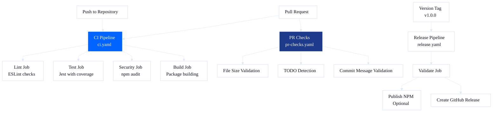
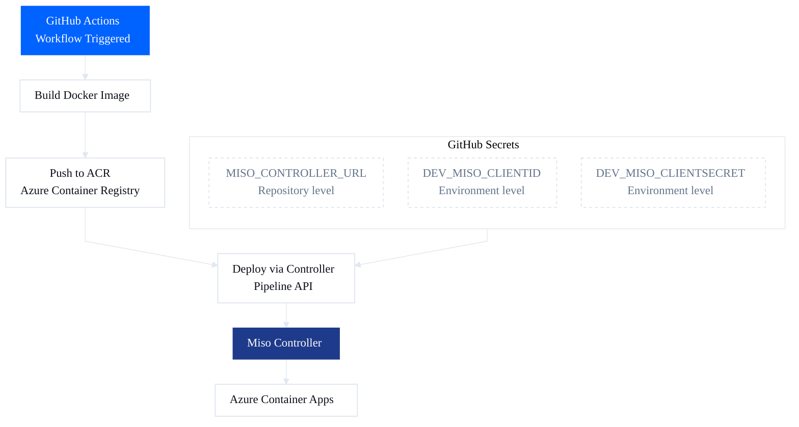

# GitHub Workflows Documentation

← [Documentation index](README.md)

Complete guide to GitHub Actions workflow generation and customization.

---

## Overview

The AI Fabrix Builder can automatically generate GitHub Actions workflows for your application, providing:

- **CI/CD Pipeline** - Automated testing, linting, and building
- **Release Management** - Automated publishing and GitHub releases
- **Pull Request Checks** - Code quality and convention validation
- **Security Auditing** - Dependency vulnerability scanning



---

## Generating Workflows

### Basic Generation

Generate workflows during application creation:

```bash
aifabrix create myapp --github
```

This creates:
- `.github/workflows/ci.yaml` - Main CI/CD pipeline
- `.github/workflows/release.yaml` - Release and publishing
- `.github/workflows/pr-checks.yaml` - Pull request validation

### Custom Configuration

```bash
aifabrix create myapp --github --main-branch develop
```

**Options:**
- `--github` - (Optional) Enable workflow generation
- `--main-branch <branch>` - Set main branch name (default: main)
- `--github-steps <steps>` - Extra GitHub workflow steps (comma-separated, e.g., `npm`). Step templates must exist in `templates/github/steps/{step}.hbs`

### Adding Custom Workflow Steps

You can include custom step templates in your workflows using `--github-steps`:

```bash
aifabrix create myapp --github --github-steps npm
```

**What happens:**
1. Loads step template from `templates/github/steps/npm.hbs`
2. Renders the template with application context
3. Injects the rendered content into workflow files (e.g., `release.yaml`)

**Available step templates:**
- `npm` - Adds NPM publishing job to release workflow

**Creating custom step templates:**
1. Create a file: `templates/github/steps/{your-step}.hbs`
2. Write Handlebars template with workflow YAML content
3. Use available template variables: `{{appName}}`, `{{language}}`, `{{port}}`, etc.
4. Include it: `aifabrix create myapp --github --github-steps your-step`

**Step template example (`templates/github/steps/npm.hbs`):**
```yaml
  publish-npm:
    name: Publish to NPM
    runs-on: ubuntu-latest
    needs: validate
    steps:
      - uses: actions/checkout@v4
      - name: Setup Node.js
        uses: actions/setup-node@v4
        with:
          node-version: '20'
          registry-url: 'https://registry.npmjs.org'
          cache: 'npm'
      - name: Install dependencies
        run: npm ci
      - name: Build package
        run: npm run build
      - name: Publish to NPM
        run: npm publish --access public
        env:
          NODE_AUTH_TOKEN: ${{ secrets.NPM_TOKEN }}
```

---

## Workflow Templates

### CI/CD Pipeline (`ci.yaml`)

**Triggers:**
- Push to main/develop branches
- Pull requests to main branch

**Jobs:**
1. **Lint** - ESLint code quality checks
2. **Test** - Jest test suite with coverage
3. **Security** - npm audit for vulnerabilities
4. **Build** - Package building (if build command specified)

**Features:**
- Node.js 18 and 20 matrix testing
- Codecov integration for coverage reporting
- Security vulnerability scanning
- Conditional build job

### Release Pipeline (`release.yaml`)

**Triggers:**
- Push of version tags (`v*.*.*`)

**Jobs:**
1. **Validate** - Pre-release validation
2. **Publish NPM** - Package publishing (if `npm` step is included via `--github-steps`)
3. **Create Release** - GitHub release creation

**Features:**
- Version tag validation
- NPM publishing with authentication (conditional, based on included steps)
- GitHub release with changelog
- Conditional NPM publishing (if `npm` step template is included)
- Custom workflow steps (injected from step templates specified via `--github-steps`)

### Pull Request Checks (`pr-checks.yaml`)

**Triggers:**
- Pull request events (opened, synchronized, reopened)

**Checks:**
- File size validation (≤500 lines)
- TODO detection in modified files
- Conventional commit message validation

---

## Pipeline Deployment Setup

Before using automated pipeline deployment in GitHub Actions, you must register your application.



### Prerequisites

1. AI Fabrix CLI installed and authenticated
2. Application variables.yaml configured
3. Access to controller environment (miso/dev/tst/pro)

### Step 1: Login to Controller

```bash
aifabrix login --controller https://controller.aifabrix.dev
```

This authenticates you via Keycloak OIDC flow.

### Step 2: Register Application

```bash
aifabrix app register myapp
```

**What happens:**
1. Reads configuration from `builder/myapp/variables.yaml` automatically
2. Creates minimal configuration if file doesn't exist
3. Registers with controller
4. For localhost deployments: automatically saves credentials to `~/.aifabrix/secrets.local.yaml` and updates `env.template` with `MISO_CLIENTID`, `MISO_CLIENTSECRET`, and `MISO_CONTROLLER_URL`
5. Displays credentials (for production, copy to GitHub Secrets manually)
6. Shows setup instructions

**Output:**
```yaml
✓ Application registered successfully!

📋 Application Details:
   Key:          myapp
   Display Name: My Application
   Environment:  dev

🔑 CREDENTIALS (save these immediately):
   Client ID:     ctrl-dev-myapp
   Client Secret: xyz-abc-123...

⚠️  IMPORTANT: Client Secret will not be shown again!

📝 Add to GitHub Secrets:
   Repository level:
     MISO_CONTROLLER_URL = https://controller.aifabrix.dev
   
   Environment level (dev):
     DEV_MISO_CLIENTID = ctrl-dev-myapp
     DEV_MISO_CLIENTSECRET = xyz-abc-123...
```

**Important:**
- For localhost deployments, credentials are automatically saved to `~/.aifabrix/secrets.local.yaml` and `env.template` is updated with `MISO_CLIENTID`, `MISO_CLIENTSECRET`, and `MISO_CONTROLLER_URL` entries.
- For production deployments, credentials are displayed but not automatically saved. Copy them to GitHub Secrets manually.

### Step 3: Add to GitHub Secrets

1. Go to repository → Settings → Secrets and variables → Actions
2. Click "New repository secret"
3. Add repository-level secret:
   - **Name:** `MISO_CONTROLLER_URL` **Value:** `https://controller.aifabrix.dev`
4. Add environment-level secrets (for dev environment):
   - **Name:** `DEV_MISO_CLIENTID` **Value:** `ctrl-dev-myapp`
   - **Name:** `DEV_MISO_CLIENTSECRET` **Value:** (from registration output)

**Note:** For other environments (staging/production), use `TST_` or `PRO_` prefixes.

### Step 4: Set Up Workflow

Create `.github/workflows/deploy.yaml` with pipeline API calls (see [Integration with AI Fabrix](#integration-with-ai-fabrix)).

### Secret Rotation

To rotate your ClientSecret (expires after 90 days):

```bash
aifabrix app rotate-secret myapp
```

**Output:**
```yaml
⚠️  This will invalidate the old ClientSecret!

✓ Secret rotated successfully!

📋 Application Details:
   Key:         myapp
   Environment: dev

🔑 NEW CREDENTIALS:
   Client ID:     ctrl-dev-myapp
   Client Secret: xyz-new-secret-789

⚠️  Old secret is now invalid. Update GitHub Secrets!
```

This displays new credentials. Then update `DEV_MISO_CLIENTSECRET` in GitHub Secrets.

→ [See CLI Reference for `app register` command](commands/application-management.md#aifabrix-app-register-appkey)

---

## Template Variables

Workflows use Handlebars templating with these variables:

### Application Variables
- `{{appName}}` - Application name
- `{{language}}` - Runtime language (typescript/python)
- `{{port}}` - Application port
- `{{fileExtension}}` - File extension (js/py)
- `{{sourceDir}}` - Source directory (lib/src)

### Service Variables
- `{{database}}` - Database enabled (true/false)
- `{{redis}}` - Redis enabled (true/false)
- `{{storage}}` - Storage enabled (true/false)
- `{{authentication}}` - Authentication enabled (true/false)

### Workflow Variables
- `{{mainBranch}}` - Main branch name
- `{{buildCommand}}` - Build command
- `{{uploadCoverage}}` - Enable coverage upload
- `{{publishToNpm}}` - Enable NPM publishing

### Step Template Variables
When creating custom step templates (`templates/github/steps/*.hbs`), you have access to:
- All application variables above
- `{{githubSteps}}` - Array of step names specified via `--github-steps`
- `{{stepContent}}` - Object mapping step names to their rendered content (access via `{{lookup ../stepContent "step-name"}}`)
- `{{hasSteps}}` - Boolean indicating if any steps were provided
- `{{hasNpmStep}}` - Boolean indicating if `npm` step was included

---

## Customization

### Modifying Generated Workflows

After generation, workflows are standard GitHub Actions files that can be edited:

```yaml
# .github/workflows/ci.yaml
name: CI/CD Pipeline

on:
  push:
    branches: [main, develop]
  pull_request:
    branches: [main]

jobs:
  # Your custom jobs here
  custom-job:
    runs-on: ubuntu-latest
    steps:
      - uses: actions/checkout@v4
      - name: Custom step
        run: echo "Custom workflow step"
```

### Adding Custom Steps

Add additional steps to existing jobs:

```yaml
jobs:
  test:
    name: Test Suite
    runs-on: ubuntu-latest
    steps:
      - uses: actions/checkout@v4
      - name: Setup Node.js
        uses: actions/setup-node@v4
        with:
          node-version: '20'
          cache: 'npm'
      - name: Install dependencies
        run: npm ci
      - name: Run tests
        run: npm test
      # Add custom step
      - name: Custom test
        run: npm run test:custom
```

### Environment-Specific Workflows

Create environment-specific workflows:

```yaml
# .github/workflows/deploy-staging.yaml
name: Deploy to Staging

on:
  push:
    branches: [develop]

jobs:
  deploy-staging:
    runs-on: ubuntu-latest
    environment: staging
    steps:
      - uses: actions/checkout@v4
      - name: Deploy to staging
        run: |
          echo "Deploying {{appName}} to staging"
          # Your deployment commands
```

---

## Required Secrets

### NPM Publishing

For NPM package publishing, add these secrets to your repository:

1. **NPM_TOKEN** - NPM authentication token
   - Generate at: <https://www.npmjs.com/settings/tokens>
   - Required scopes: `publish`, `read`

### Codecov Integration

For coverage reporting:

1. **CODECOV_TOKEN** - Codecov upload token (optional)
   - Generate at: <https://codecov.io/settings/tokens>

### AI Fabrix Pipeline Deployment

For automated deployment via pipeline API:

**Repository level:**
1. **MISO_CONTROLLER_URL** - Controller API endpoint (e.g., `https://controller.aifabrix.dev`)

**Environment level (dev/staging/production):**
2. **DEV_MISO_CLIENTID** - Pipeline ClientId from application registration
3. **DEV_MISO_CLIENTSECRET** - Pipeline ClientSecret from application registration

**Getting Pipeline Credentials:**
```bash
# Login to controller
aifabrix login --controller https://controller.aifabrix.dev

# Register application
aifabrix app register myapp

# Credentials saved to ~/.aifabrix/secrets-dev.yaml
# Copy them to GitHub Secrets!
```

See [Application Registration](#pipeline-deployment-setup) for details.

### Custom Secrets

Add custom secrets for your application:

```yaml
# In your workflow
- name: Use custom secret
  run: echo "Using secret: ${{ secrets.CUSTOM_SECRET }}"
```

---

## Language-Specific Configurations

### TypeScript/Node.js Projects

**Default configuration:**
- Source directory: `lib/`
- File extension: `js`
- Build command: `npm run build`
- Test command: `npm test`

**Custom package.json scripts:**
```json
{
  "scripts": {
    "build": "tsc",
    "test": "jest --coverage",
    "lint": "eslint . --ext .js"
  }
}
```

### Python Projects

**Default configuration:**
- Source directory: `src/`
- File extension: `py`
- Build command: `python -m build`
- Test command: `pytest`

**Custom workflow for Python:**
```yaml
jobs:
  test:
    runs-on: ubuntu-latest
    strategy:
      matrix:
        python-version: [3.8, 3.9, '3.10', '3.11']
    steps:
      - uses: actions/checkout@v4
      - name: Set up Python ${{ matrix.python-version }}
        uses: actions/setup-python@v4
        with:
          python-version: ${{ matrix.python-version }}
      - name: Install dependencies
        run: |
          python -m pip install --upgrade pip
          pip install -r requirements.txt
      - name: Run tests
        run: pytest
```

---

## Best Practices

### Workflow Organization

1. **Keep workflows focused** - One workflow per purpose
2. **Use matrix strategies** - Test multiple Node.js/Python versions
3. **Cache dependencies** - Speed up builds with caching
4. **Fail fast** - Stop on first error to save resources

### Security

1. **Use secrets for sensitive data** - Never hardcode tokens
2. **Limit secret scopes** - Use minimal required permissions
3. **Review dependencies** - Regularly update action versions
4. **Enable branch protection** - Require status checks

### Performance

1. **Parallel jobs** - Run independent jobs in parallel
2. **Conditional steps** - Skip unnecessary steps
3. **Artifact caching** - Cache build artifacts between runs
4. **Resource optimization** - Use appropriate runner sizes

---

## Troubleshooting

### Common Issues

**Workflow not triggering:**
- Check branch names match `mainBranch` setting
- Verify workflow file syntax
- Ensure workflow files are in `.github/workflows/`

**Build failures:**
- Check Node.js/Python version compatibility
- Verify package.json/requirements.txt dependencies
- Review build command configuration

**Permission errors:**
- Verify repository secrets are configured
- Check NPM token permissions
- Ensure GitHub token has required scopes

**Coverage upload failures:**
- Verify Codecov token (if using private repos)
- Check coverage file paths
- Ensure coverage reports are generated

### Debugging

**Enable debug logging:**
```yaml
- name: Debug step
  run: echo "Debug information"
  env:
    ACTIONS_STEP_DEBUG: true
```

**View workflow logs:**
1. Go to repository Actions tab
2. Click on failed workflow run
3. Expand job steps to see detailed logs

---

## Examples

### Complete TypeScript Project

```bash
# Create with GitHub workflows
aifabrix create my-ts-app --port 3000 --database --authentication --github

# Generated structure:
# .github/workflows/
#   ├── ci.yaml
#   ├── release.yaml
#   └── pr-checks.yaml
# builder/my-ts-app/
#   ├── variables.yaml
#   ├── env.template
#   ├── rbac.yaml
#   └── <appKey>-deploy.json (e.g. myapp-deploy.json)
```

### Python Project with Custom Workflow

```bash
# Create Python app
aifabrix create my-python-app --language python --port 8000 --github

# Add custom Python workflow
cat > .github/workflows/python-specific.yaml << 'EOF'
name: Python Specific Tests

on:
  push:
    branches: [main]
  pull_request:
    branches: [main]

jobs:
  python-tests:
    runs-on: ubuntu-latest
    strategy:
      matrix:
        python-version: [3.8, 3.9, '3.10', '3.11']
    steps:
      - uses: actions/checkout@v4
      - name: Set up Python ${{ matrix.python-version }}
        uses: actions/setup-python@v4
        with:
          python-version: ${{ matrix.python-version }}
      - name: Install dependencies
        run: |
          python -m pip install --upgrade pip
          pip install -r requirements.txt
      - name: Run tests
        run: pytest --cov=src
EOF
```

---

## Integration with AI Fabrix

### Pipeline Deployment Integration

Use the Pipeline API for automated deployments with proper authentication.

**Note:** The `aifabrix validate` command validates application configurations locally before deployment. It checks `variables.yaml`, `env.template`, and `rbac.yaml` files for syntax errors and schema compliance. This helps catch configuration errors early, before building Docker images, saving time in CI/CD pipelines.

For automated deployments, use the CLI-based workflow (see examples above) which includes:
1. `aifabrix login` - Authenticate with controller
2. `aifabrix validate` - Validate configuration before building
3. `aifabrix build` - Build Docker image
4. `aifabrix deploy` - Deploy to ACR/Azure

The CLI commands handle all the complexity internally, including manifest generation, validation, registry push, and deployment.

Use the AI Fabrix Builder CLI for automated deployments:

**⚠️ Important:** Automatic deployment via GitHub Actions deploys images to **ACR (Azure Container Registry) and Azure** - this is **NOT for local deployment**. For local deployment, use the builder CLI tool directly (`aifabrix deploy` from your local machine).

```yaml
# .github/workflows/deploy.yaml
name: Deploy to AI Fabrix

on:
  push:
    branches: [main]

jobs:
  deploy:
    runs-on: ubuntu-latest
    steps:
      - uses: actions/checkout@v4
      
      - name: Setup Node.js
        uses: actions/setup-node@v4
        with:
          node-version: '20'
      
      - name: Install AI Fabrix Builder
        run: npm install -g @aifabrix/builder
      
      - name: Authenticate with Controller
        run: |
          aifabrix login \
            --method credentials \
            --app myapp \
            --client-id ${{ secrets.DEV_MISO_CLIENTID }} \
            --client-secret ${{ secrets.DEV_MISO_CLIENTSECRET }} \
            --controller ${{ secrets.MISO_CONTROLLER_URL }} \
            --environment dev
      
      - name: Validate Application Manifest
        run: |
          set -e
          aifabrix validate myapp
      
      - name: Build Docker Image
        run: |
          set -e
          aifabrix build myapp --tag ${{ github.sha }}
      
      - name: Deploy Application
        run: |
          set -e
          aifabrix deploy myapp
```

**Workflow Steps Explained:**

1. **Setup Node.js**: Configures Node.js environment for the runner
2. **Install AI Fabrix Builder**: Installs the `@aifabrix/builder` CLI package globally
3. **Authenticate with Controller**: Uses `aifabrix login` to authenticate and store credentials in `~/.aifabrix/config.yaml` on the runner
4. **Validate Application Manifest**: Validates `variables.yaml`, `env.template`, and `rbac.yaml` before building (catches configuration errors early, saving time)
5. **Build Docker Image**: Builds the Docker image with proper tagging using the commit SHA
6. **Deploy Application**: Deploys to ACR/Azure using stored authentication from login (no credentials needed in deploy step)

**Authentication Flow:**

- `aifabrix login` stores controller URL, environment, and credentials in `~/.aifabrix/config.yaml`
- `aifabrix deploy` automatically reads from config (no need to pass `--client-id`/`--client-secret`)
- Config persists during workflow run, isolated per runner

**Error Handling:**

- `set -e` enables fail-fast behavior (stops on first error)
- CLI commands exit with non-zero codes on failure
- Clear, actionable error messages are provided by the CLI

### Environment-Specific Deployments

```yaml
# .github/workflows/deploy-environments.yaml
name: Deploy to Environments

on:
  push:
    branches: [main, develop]

jobs:
  deploy:
    runs-on: ubuntu-latest
    environment: 
      name: ${{ github.ref == 'refs/heads/main' && 'production' || 'staging' }}
    steps:
      - uses: actions/checkout@v4
      
      - name: Setup Node.js
        uses: actions/setup-node@v4
        with:
          node-version: '20'
      
      - name: Install AI Fabrix Builder
        run: npm install -g @aifabrix/builder
      
      - name: Authenticate with Controller
        run: |
          set -e
          # Determine environment from branch
          ENV=${{ github.ref == 'refs/heads/main' && 'pro' || 'dev' }}
          aifabrix login \
            --method credentials \
            --app myapp \
            --client-id ${{ secrets[format('{0}_MISO_CLIENTID', github.ref == 'refs/heads/main' && 'PRO' || 'DEV')] }} \
            --client-secret ${{ secrets[format('{0}_MISO_CLIENTSECRET', github.ref == 'refs/heads/main' && 'PRO' || 'DEV')] }} \
            --controller ${{ secrets.MISO_CONTROLLER_URL }} \
            --environment $ENV
      
      - name: Validate Application Manifest
        run: |
          set -e
          aifabrix validate myapp
      
      - name: Build Docker Image
        run: |
          set -e
          aifabrix build myapp --tag ${{ github.sha }}
      
      - name: Deploy Application
        run: |
          set -e
          aifabrix deploy myapp
```

**Environment-Specific Secrets:**

For environment-specific deployments, use GitHub environment secrets:
- **Development**: `DEV_MISO_CLIENTID`, `DEV_MISO_CLIENTSECRET`
- **Staging/Test**: `TST_MISO_CLIENTID`, `TST_MISO_CLIENTSECRET`
- **Production**: `PRO_MISO_CLIENTID`, `PRO_MISO_CLIENTSECRET`

The workflow automatically selects the correct environment and secrets based on the branch.

**Required GitHub Secrets:**

**Repository level:**
- `MISO_CONTROLLER_URL` - Controller base URL

**Environment level (dev/tst/pro):**
- `{ENV}_MISO_CLIENTID` - Client ID from `aifabrix app register` (e.g., `DEV_MISO_CLIENTID`, `TST_MISO_CLIENTID`, `PRO_MISO_CLIENTID`)
- `{ENV}_MISO_CLIENTSECRET` - Client Secret from `aifabrix app register` (e.g., `DEV_MISO_CLIENTSECRET`, `TST_MISO_CLIENTSECRET`, `PRO_MISO_CLIENTSECRET`)

**Optional:**
- `APP_NAME` - Application name (or hardcode in workflow)

**Deployment Types:**

### Automatic Deployment (GitHub Actions)

- **Purpose**: Deploy images to **ACR (Azure Container Registry) and Azure**
- **Use Case**: CI/CD pipelines, production deployments
- **Location**: GitHub Actions workflows (`.github/workflows/`)
- **Process**: Build → Push to ACR → Deploy to Azure via Miso Controller
- **NOT for**: Local development or testing

### Local Deployment (CLI Tool)

- **Purpose**: Deploy to local infrastructure or test environments
- **Use Case**: Local development, testing, debugging
- **Location**: Run `aifabrix deploy` directly from your machine
- **Process**: Uses local Docker images, deploys to local or configured environments
- **Use**: `aifabrix deploy myapp` from your local terminal

**Why Validate Before Build:**

The `aifabrix validate` step runs **before** the build step to catch configuration errors early. This saves time by:
- Validating `variables.yaml` syntax and schema compliance
- Checking `env.template` for proper secret references
- Validating `rbac.yaml` for external systems
- Catching errors before spending time building Docker images

If validation fails, the workflow stops immediately with clear error messages, preventing unnecessary build steps.

---

## Advanced Features

### Custom Templates

Create custom workflow templates:

```bash
# Create custom template directory
mkdir -p templates/github/custom

# Add custom template
cat > templates/github/custom/custom-workflow.yaml.hbs << 'EOF'
name: Custom Workflow for {{appName}}

on:
  push:
    branches: [{{mainBranch}}]

jobs:
  custom-job:
    runs-on: ubuntu-latest
    steps:
      - uses: actions/checkout@v4
      - name: Custom step for {{appName}}
        run: echo "Running custom workflow for {{appName}}"
EOF
```

### Conditional Workflows

Use Handlebars conditionals in templates:

```yaml
{{#if database}}
- name: Database tests
  run: npm run test:database
{{/if}}

{{#if authentication}}
- name: Authentication tests
  run: npm run test:auth
{{/if}}
```

### Multi-Environment Support

```yaml
jobs:
  {{#each environments}}
  deploy-{{this}}:
    runs-on: ubuntu-latest
    environment: {{this}}
    steps:
      - uses: actions/checkout@v4
      - name: Deploy to {{this}}
        run: aifabrix auth config --set-environment {{this}} && aifabrix deploy {{appName}}
  {{/each}}
```

---

## Migration Guide

### From Manual Workflows

If you have existing GitHub workflows:

1. **Backup existing workflows**
2. **Generate new workflows** with `aifabrix create --github`
3. **Compare and merge** customizations
4. **Test thoroughly** before removing old workflows

### Updating Workflows

To update generated workflows:

1. **Regenerate workflows** (backup first)
2. **Apply customizations** from backup
3. **Test updated workflows**
4. **Commit changes**

---

## Support

For workflow-related issues:

1. **Check GitHub Actions documentation**
2. **Review workflow logs** in repository Actions tab
3. **Validate YAML syntax** with online validators
4. **Test workflows** in feature branches first

For AI Fabrix Builder specific issues:

1. **Run `aifabrix doctor`** to check environment
2. **Check CLI reference** for command options
3. **Review configuration files** for errors
4. **Enable debug logging** for detailed output
