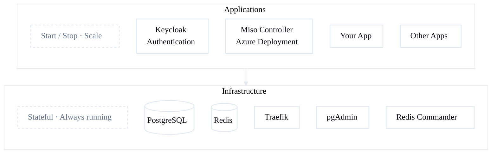

# Infrastructure Guide

← [Back to Quick Start](quick-start.md)

## What is Infrastructure?

When you run `aifabrix up`, you get **shared baseline services** that all your applications use:

### PostgreSQL (port 5432)
- Database server for your applications
- Includes pgvector extension for AI/ML workloads
- **Access:** localhost:5432
- **Username:** pgadmin
- **Password:** admin123

### Redis (port 6379)
- In-memory data store for caching
- Session storage
- Message queue for background jobs
- **Access:** localhost:6379

### pgAdmin (port 5050) - Optional
- Web UI for database management
- Create/edit databases, run SQL queries
- **Access:** <http://localhost:5050>
- **Login:** <admin@aifabrix.dev> / admin123

### Redis Commander (port 8081) - Optional
- Web UI for Redis management  
- View keys, monitor performance
- **Access:** <http://localhost:8081>
- **Login:** admin / admin123

### Traefik (ports 80/443) - Optional
- Reverse proxy for local routing (matches Front Door routing config)

```mermaid
%%{init: {
  "theme": "base",
  "themeVariables": {
    "fontFamily": "Poppins, Arial Rounded MT Bold, Arial, sans-serif",
    "fontSize": "16px",
    "background": "#FFFFFF",
    "primaryColor": "#F8FAFC",
    "primaryTextColor": "#0B0E15",
    "primaryBorderColor": "#E2E8F0",
    "lineColor": "#E2E8F0",
    "textColor": "#0B0E15",
    "subGraphTitleColor": "#64748B",
    "subGraphTitleFontWeight": "500",
    "borderRadius": 16
  },
  "flowchart": {
    "curve": "linear",
    "nodeSpacing": 34,
    "rankSpacing": 34,
    "padding": 10
  }
}}%%

flowchart TB

%% =======================
%% Styles
%% =======================
classDef base fill:#FFFFFF,color:#0B0E15,stroke:#E2E8F0,stroke-width:1.5px;
classDef note fill:#FFFFFF,color:#64748B,stroke:#E2E8F0,stroke-width:1.5px,stroke-dasharray:4 4;

%% =======================
%% Infrastructure
%% =======================
subgraph Infrastructure["Infrastructure"]
    direction TB
    InfraNote["Stateful · Always running"]:::note
    Postgres[(PostgreSQL)]:::base
    Redis[(Redis)]:::base
    Traefik[Traefik]:::base
end

%% =======================
%% Operations Tools
%% =======================
subgraph OpsTools["Operations Tools"]
    direction TB
    OpsNote["On-demand / Admin only"]:::note
    pgAdmin[pgAdmin]:::base
    RedisCommander[Redis Commander]:::base
end

%% =======================
%% Applications
%% =======================
subgraph Applications["Applications"]
    direction TB
    AppNote["Start / Stop · Scale"]:::note
    Keycloak[Keycloak<br/>Identity & Access]:::base
    MisoController[Miso Controller<br/>Deployment & Governance]:::base
    YourApp[Customer Application]:::base
    OtherApps[Other Applications]:::base
end

%% =======================
%% Flow
%% =======================
Applications --> Infrastructure
OpsTools --> Infrastructure
```

- **Access:** <http://localhost:80>, <https://localhost:443>



---

## Commands

### Start Infrastructure
```bash
aifabrix up
```

Start with Traefik:
```bash
aifabrix up --traefik
```

**First time?** Docker downloads images (2-3 minutes).

**What you'll see:**
- Containers starting
- Health checks passing
- Service URLs

### Stop Infrastructure
```bash
aifabrix down
```

Stops all containers. **Your data is preserved** in Docker volumes.

### Check Status
```bash
aifabrix doctor
```

Shows what's running, what's not, and how to fix issues.

### Reset Everything (Delete All Data)
```bash
aifabrix down --volumes
```

⚠️ **Warning:** This deletes all databases, Redis data, everything. Use for fresh start.

---

## Optional Platform Applications

**Keycloak and Miso-Controller are NOT infrastructure** - they are regular applications you install and run like your own apps.

### Why Separate?

**Infrastructure** = Always running, shared by all apps (Postgres, Redis)

**Applications** = Start/stop as needed, specific purpose (Keycloak, Miso-Controller, your apps)

You might not need Keycloak or Miso-Controller for basic development. Install them when you need them.



---

## Install Keycloak (Authentication)

Keycloak provides authentication and user management for your applications.

### 1. Create
```bash
aifabrix create keycloak --port 8082 --database --template keycloak
```

### 2. Build
```bash
aifabrix build keycloak
```

### 3. Run
```bash
aifabrix run keycloak
```

### 4. Access
**URL:** <http://localhost:8082>

**Admin login:** admin / admin123

### What You Get
- User authentication
- Single Sign-On (SSO)
- Role-based access control
- Social login providers

---

## Install Miso-Controller (Azure Deployment)

Miso Controller deploys your applications to Azure.

### 1. Create
```bash
aifabrix create miso-controller --port 3000 --database --redis --template miso-controller
```

### 2. Build
```bash
aifabrix build miso-controller
```

### 3. Run
```bash
aifabrix run miso-controller
```

### 4. Access
**URL:** <http://localhost:3000>

**What You Get**
- Deploy to Azure Container Apps
- Manage deployments via API
- Monitor application status
- Handle secrets and configuration

---

## Common Questions

### Do I need to run infrastructure all the time?
Only when developing. Start with `aifabrix up` when you begin work, stop with `aifabrix down` when done.

### What happens to my data when I stop?
It's preserved in Docker volumes. Your databases and Redis data persist between restarts.

### How do I connect to Postgres from my app?
**From Docker container:** `postgres:5432`  
**From your local machine:** `localhost:5432`

The SDK handles this automatically in generated config files.

### Can I use my own Postgres/Redis?
Yes! Configure connection strings in your app's `env.template`. The SDK doesn't force you to use infrastructure services.

### How much disk space does this use?
Initial download: ~1GB (Docker images)  
Running: ~500MB RAM, minimal CPU
Data volumes: Depends on your usage

---

## Troubleshooting

**Port 5432 already in use**  
→ You have another Postgres running. Stop it or change the port.

**Port 6379 already in use**  
→ You have another Redis running. Stop it first.

**Docker not running**  
→ Start Docker Desktop, then run `aifabrix up` again.

**"Cannot connect to Docker daemon"**  
→ Make sure Docker Desktop is running and you're logged in.

**Containers start but apps can't connect**  
→ Run `aifabrix doctor` to check connectivity.

